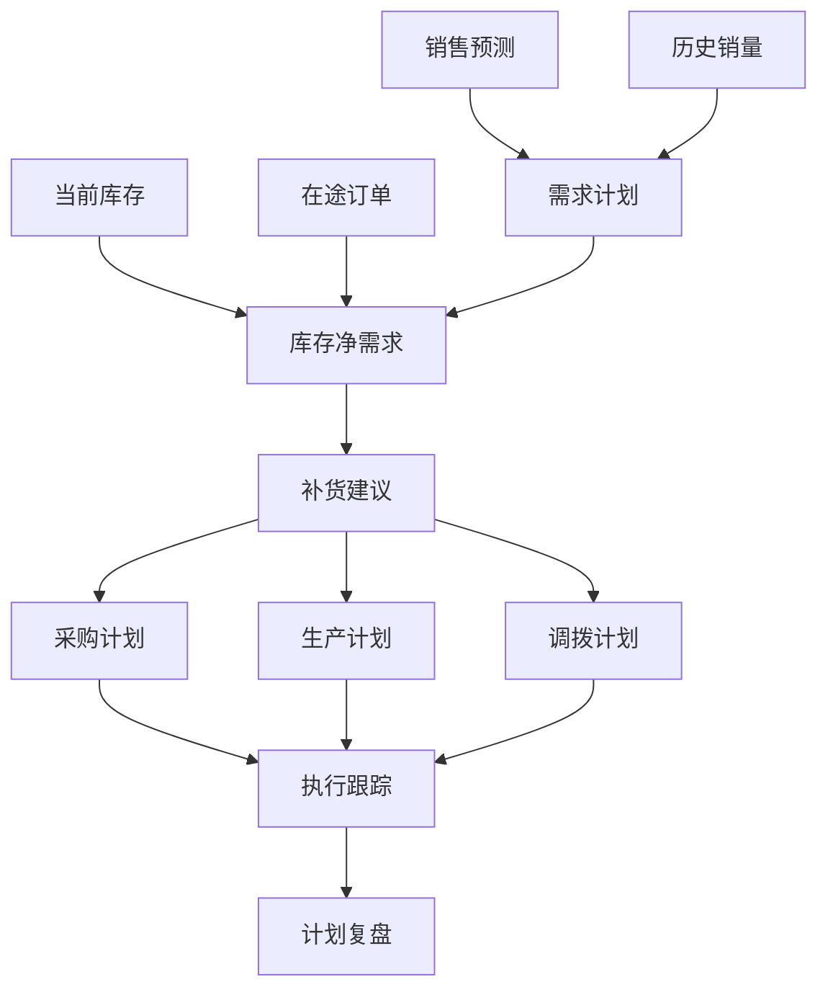
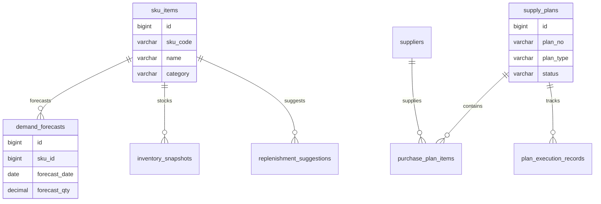
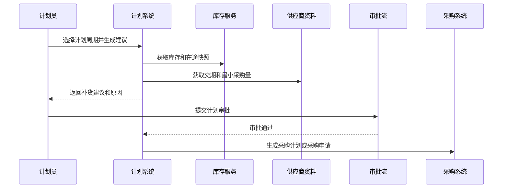

# 供应链计划项目案例

## 适合谁看

适合需要做需求预测、采购计划、生产计划、库存补货、安全库存、供应商交期、缺货预警和计划协同的开发者。

供应链计划不是“库存低了就采购”。真实项目里，计划要同时考虑销售预测、历史销量、在途库存、生产能力、供应商交期、最小采购量、仓库容量和资金占用。计划做得太保守会缺货，做得太激进会积压库存。

## 业务目标

第一版供应链计划支持：

- 采集销售订单、预测需求和历史销量。
- 维护商品、仓库、供应商和交期。
- 计算安全库存、补货点和建议采购量。
- 支持采购计划、生产计划和调拨计划。
- 支持计划审批、锁定和版本。
- 支持缺货、超储和延期预警。
- 支持计划执行跟踪和复盘。

## 供应链计划链路

核心原则：计划建议必须可解释。业务需要知道系统为什么建议采购 500 件，而不是只看到一个数量。

## 数据模型

## 推荐表结构

| 表 | 作用 | 关键字段 |
| --- | --- | --- |
| `sku_items` | 商品 SKU | `sku_code`、`name`、`category`、`unit`、`status` |
| `supplier_lead_times` | 供应商交期 | `supplier_id`、`sku_id`、`lead_days`、`min_order_qty` |
| `demand_forecasts` | 需求预测 | `sku_id`、`warehouse_id`、`forecast_date`、`forecast_qty` |
| `inventory_snapshots` | 库存快照 | `sku_id`、`warehouse_id`、`available_qty`、`locked_qty` |
| `inbound_orders` | 在途订单 | `sku_id`、`warehouse_id`、`expected_qty`、`expected_date` |
| `replenishment_suggestions` | 补货建议 | `sku_id`、`suggest_qty`、`reason_json`、`plan_id` |
| `supply_plans` | 计划主表 | `plan_no`、`plan_type`、`version_no`、`status` |
| `purchase_plan_items` | 采购计划明细 | `plan_id`、`sku_id`、`supplier_id`、`plan_qty` |
| `plan_execution_records` | 执行记录 | `plan_id`、`biz_order_no`、`executed_qty`、`status` |

计划数据要保存计算快照。后续复盘时，不能只看现在的库存和销量，否则无法解释当时为什么这么计划。

## 补货计算思路

| 指标 | 说明 | 示例 |
| --- | --- | --- |
| 日均需求 | 未来一段时间预测销量 | 最近 30 天或预测模型 |
| 供应提前期 | 下单到入库的天数 | 供应商 A 需要 7 天 |
| 安全库存 | 防止波动的缓冲库存 | 日均需求乘安全天数 |
| 补货点 | 触发补货的库存阈值 | 日均需求乘提前期加安全库存 |
| 建议采购量 | 补到目标库存所需数量 | 目标库存减可用和在途 |

第一版可以先使用规则计算，不必一开始做复杂预测模型。关键是把计算公式和参数展示清楚。

## 计划生成流程

计划审批通过后要锁定版本。后续如果要修改，应生成新版本或变更记录。

## 前端页面拆分

| 页面或组件 | 作用 | 注意点 |
| --- | --- | --- |
| 计划工作台 | 查看缺货、超储和待处理建议 | 优先展示异常 SKU |
| 需求预测 | 维护销量预测 | 支持导入和手工调整 |
| 补货建议 | 展示建议数量和计算原因 | 原因要可解释 |
| 采购计划 | 生成采购需求 | 校验供应商交期和最小采购量 |
| 生产计划 | 生成生产任务 | 关联产能和 BOM |
| 调拨计划 | 仓库之间调货 | 关注运输时间和成本 |
| 执行跟踪 | 跟踪计划转订单后的状态 | 显示未执行、部分执行、已完成 |
| 计划复盘 | 对比计划和实际 | 分析缺货、积压和偏差 |

计划类页面要避免只有表格。建议在工作台顶部展示缺货风险、超储金额、延期计划和计划准确率。

## 常见问题

### 问题 1：系统建议采购很多，但业务不敢用

通常是建议不可解释。要展示需求来源、库存快照、在途数量、提前期、安全库存和计算公式。

### 问题 2：采购计划生成后，库存又变化了

计划必须有快照和版本。库存变化可以生成新建议，但不能直接改已审批计划。

### 问题 3：缺货预警太多，业务全部忽略

预警要分级。高销量、高毛利、客户订单已确认的缺货优先级更高，低价值长尾 SKU 可以降级。

### 问题 4：供应商交期不准导致计划失效

要记录实际到货时间，定期更新供应商交期，并在供应商表现看板中体现偏差。

## 验收清单

- SKU、仓库、供应商和交期数据完整。
- 需求预测和历史销量能进入计划计算。
- 库存、锁定库存和在途订单有快照。
- 补货建议能解释计算原因。
- 计划支持审批、锁定和版本。
- 采购、生产、调拨计划边界清晰。
- 缺货和超储预警有优先级。
- 计划执行状态可追踪。
- 计划复盘能对比预测、建议、执行和实际。
- 供应商交期偏差能沉淀为后续计划参数。

## 下一步学习

继续学习 [采购管理项目案例](/projects/procurement-management-case)、[库存管理项目案例](/projects/inventory-management-case)、[仓储物流项目案例](/projects/warehouse-logistics-case) 和 [生产制造项目案例](/projects/manufacturing-execution-case)。
