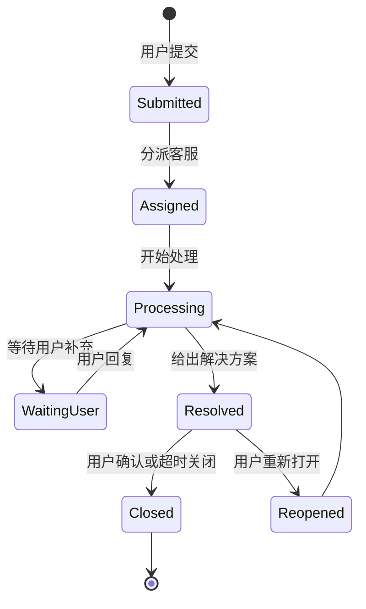
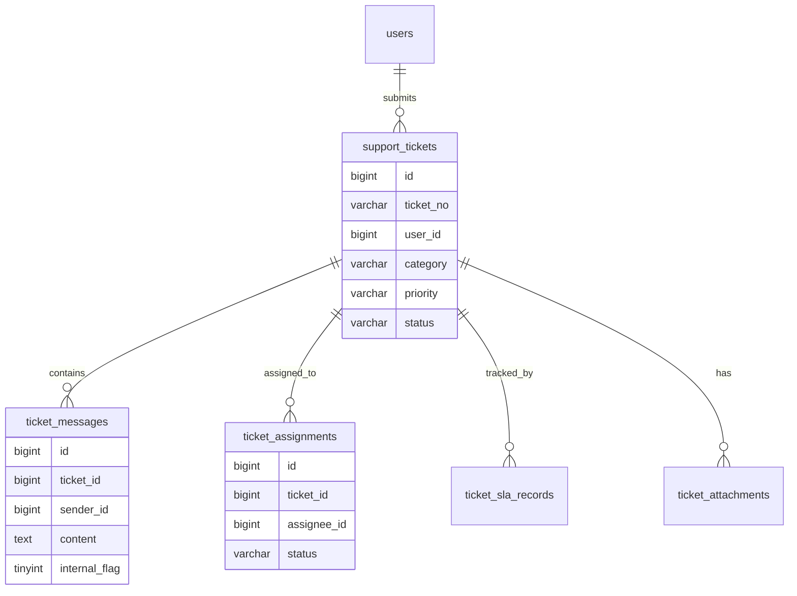
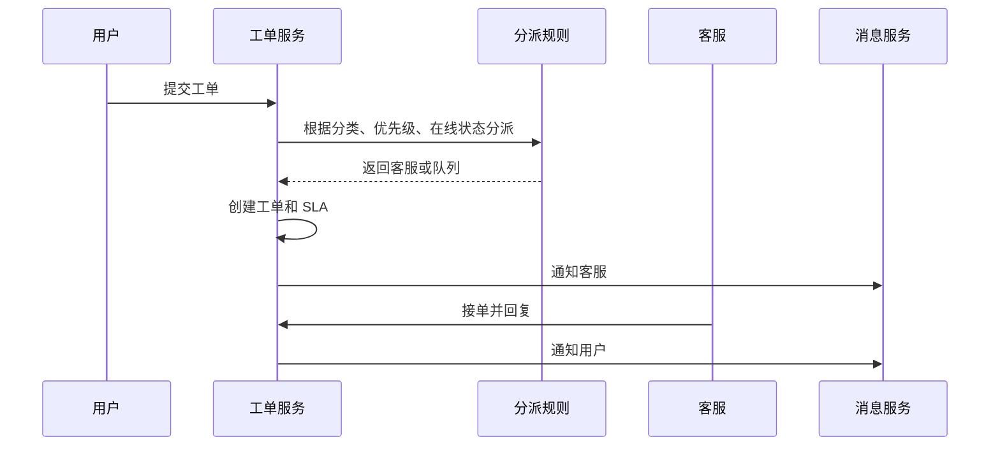

# 客服工单项目案例

## 适合谁看

适合需要做用户反馈、客服工单、工单分派、SLA、内部协作、工单状态流转、消息通知和服务质量统计的开发者。

客服工单不是“用户提交一个问题，客服回复一下”。真实项目里，工单会涉及分类、优先级、责任人、SLA、转派、协作、附件、聊天记录、满意度、知识库和数据看板。它是连接用户问题和内部处理流程的核心模块。

## 业务目标

第一版客服工单模块支持：

- 用户提交工单。
- 上传附件和截图。
- 工单分类和优先级。
- 自动或手动分派。
- 工单回复和内部备注。
- 状态流转。
- SLA 超时提醒。
- 满意度评价。
- 工单数据统计。

## 工单流转图

工单状态要有明确流转，不要让任意角色随意修改状态。

## 数据模型

## 推荐表结构

| 表 | 作用 | 关键字段 |
| --- | --- | --- |
| `support_tickets` | 工单主表 | `ticket_no`、`category`、`priority`、`status`、`user_id` |
| `ticket_messages` | 沟通记录 | `ticket_id`、`sender_id`、`content`、`internal_flag` |
| `ticket_assignments` | 分派记录 | `ticket_id`、`assignee_id`、`assigned_at` |
| `ticket_sla_records` | SLA 记录 | `ticket_id`、`deadline_at`、`breached_flag` |
| `ticket_attachments` | 附件 | `ticket_id`、`file_id`、`uploaded_by` |
| `ticket_feedback` | 满意度 | `ticket_id`、`rating`、`comment` |

内部备注和用户可见回复要明确区分，避免把内部讨论暴露给用户。

## 分派流程

分派规则可以先简单实现，例如按分类指定队列，再由客服手动领取。后续再做自动分派。

## SLA 设计

| 优先级 | 首响时间 | 解决时间 |
| --- | --- | --- |
| 高 | 15 分钟 | 4 小时 |
| 中 | 1 小时 | 1 天 |
| 低 | 4 小时 | 3 天 |

SLA 要明确暂停规则。例如“等待用户补充”期间是否暂停计时，需要产品和客服团队提前约定。

## 前端页面拆分

| 页面 | 作用 | 注意点 |
| --- | --- | --- |
| 用户提交页 | 用户填写问题和附件 | 分类要清楚，减少误选 |
| 我的工单 | 用户查看处理进度 | 状态和最后回复时间明显 |
| 客服工作台 | 客服处理工单 | 优先展示待处理和即将超时 |
| 工单详情 | 沟通、附件、内部备注 | 用户回复和内部备注分区 |
| 分派规则 | 配置分类到队列 | 修改规则写审计 |
| 数据看板 | 首响、解决、满意度 | 指标口径固定 |

## 常见问题

### 问题 1：用户看到了内部备注

说明消息可见性设计不清。`internal_flag` 必须由后端控制，前端不能决定哪些消息对用户可见。

### 问题 2：工单没人处理直到超时

要有未分派工单队列和 SLA 告警。工单创建后如果没有责任人，必须进入公共队列。

### 问题 3：客服数据统计不准

首响时间、解决时间和关闭时间要定义清楚。等待用户补充是否计入 SLA，也要固定口径。

## 验收清单

- 工单号全局唯一。
- 状态流转清晰。
- 用户回复和内部备注隔离。
- 附件走文件中心权限。
- 工单有分类、优先级和责任人。
- SLA 有截止时间和告警。
- 支持转派和处理记录。
- 关闭后可评价。
- 数据看板口径清楚。

## 下一步学习

继续学习 [消息通知项目案例](/projects/notification-center-case)、[文件中心项目案例](/projects/file-center-case) 和 [数据看板项目案例](/projects/analytics-dashboard-case)。
