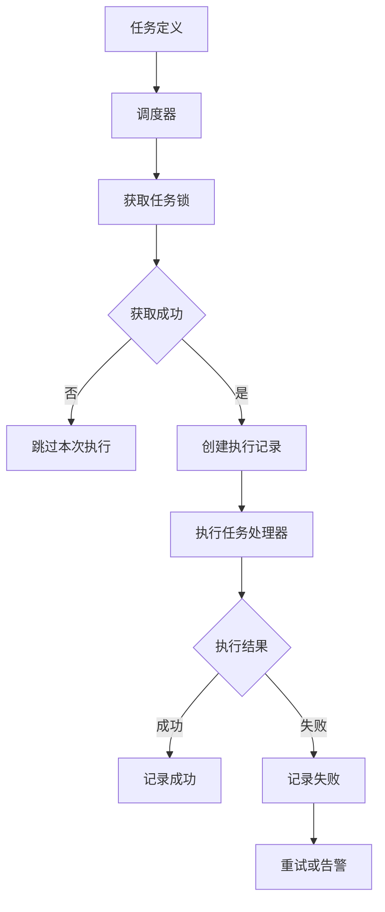
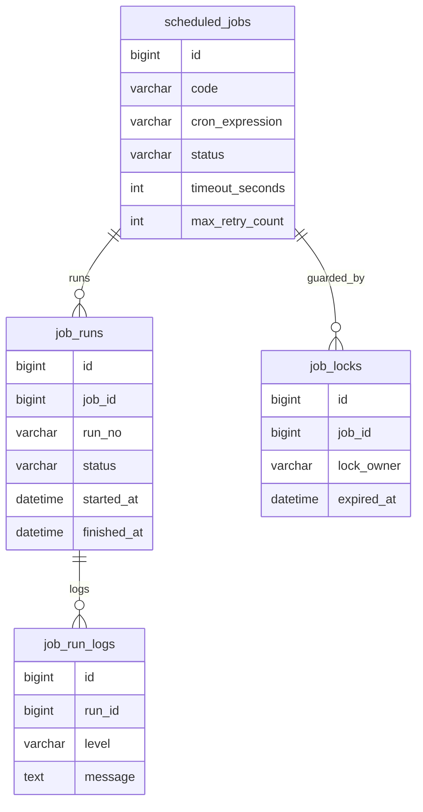
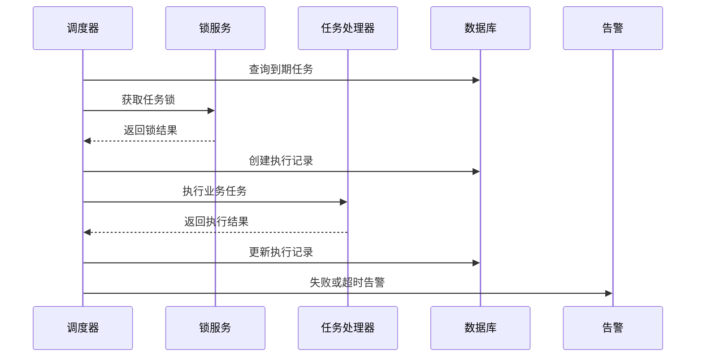

# 任务调度项目案例

## 适合谁看

适合需要做定时任务、批量处理、导入导出后台任务、报表生成、订单超时关闭、订阅到期扫描和失败重试的开发者。

任务调度不是“写一个 cron 定时跑”。真实项目里，它会涉及任务定义、执行记录、分布式锁、重试、超时、幂等、告警、人工补偿和任务依赖。任务一旦重复执行或漏执行，可能造成重复扣款、重复通知、订单状态错误或数据统计不准。

## 业务目标

第一版任务调度模块支持：

- 创建定时任务定义。
- 手动触发任务。
- 记录每次执行结果。
- 支持失败重试。
- 支持超时控制。
- 支持任务锁，避免多实例重复执行。
- 支持执行日志和告警。
- 支持暂停、启用任务。

## 任务调度架构



任务定义和任务执行记录要分开。定义说明“应该做什么”，执行记录说明“这一次实际做了什么”。

## 数据模型



## 推荐表结构

| 表 | 作用 | 关键字段 |
| --- | --- | --- |
| `scheduled_jobs` | 任务定义 | `code`、`cron_expression`、`status`、`timeout_seconds` |
| `job_runs` | 执行记录 | `run_no`、`job_id`、`status`、`started_at`、`finished_at` |
| `job_locks` | 分布式锁 | `job_id`、`lock_owner`、`expired_at` |
| `job_run_logs` | 执行日志 | `run_id`、`level`、`message` |
| `job_retry_records` | 重试记录 | `run_id`、`retry_no`、`error_message` |

任务执行记录要保存输入参数、执行范围和错误信息。否则任务失败后只能看一行“执行失败”，无法补偿。

## 执行流程



分布式部署时，多个应用实例都可能扫描到同一个任务，所以必须有锁或队列机制避免重复执行。

## 幂等设计

任务处理器必须考虑重复执行：

| 场景 | 幂等方式 |
| --- | --- |
| 订单超时关闭 | 只关闭 `pending` 状态订单 |
| 会员到期降级 | 判断当前订阅仍然过期且未处理 |
| 发送提醒 | 使用业务 ID 和提醒类型做唯一键 |
| 报表生成 | 同一统计周期覆盖写入或版本化 |
| 导出文件 | 同一任务只生成一个有效文件 |

示例：

```ts
async function closeExpiredOrders(now: Date) {
  const orders = await orderRepository.findExpiredPendingOrders(now)
  for (const order of orders) {
    await orderRepository.closeIfStatus(order.id, 'pending')
  }
}
```

这里的关键是 `closeIfStatus`，它能防止已支付订单被延迟任务错误关闭。

## 前端页面拆分

| 页面 | 作用 | 注意点 |
| --- | --- | --- |
| 任务列表 | 查看任务定义和状态 | 显示下次执行时间 |
| 任务详情 | 查看 cron、超时、重试配置 | 高风险修改要审计 |
| 执行记录 | 查看每次执行状态 | 支持按成功、失败、超时筛选 |
| 执行日志 | 查看失败原因 | 日志要支持复制和检索 |
| 手动触发弹窗 | 人工执行任务 | 要确认执行范围 |
| 告警配置 | 配置失败通知 | 支持通知到负责人 |

## 常见问题

### 问题 1：任务在多台机器上重复执行

说明没有分布式锁，或者锁过期时间太短。需要保证同一任务同一时间只有一个实例执行，并记录锁持有者。

### 问题 2：任务失败后反复重试造成更多错误

重试要限制次数，并区分可重试错误和不可重试错误。参数错误、权限错误通常不应该无限重试。

### 问题 3：任务执行成功，但业务数据不对

先看执行范围和输入参数。任务日志必须记录处理了多少条、跳过多少条、失败多少条，而不是只记录“success”。

## 验收清单

- 任务定义和执行记录分离。
- 支持启用、暂停和手动触发。
- 多实例部署不会重复执行同一任务。
- 执行记录包含开始时间、结束时间和状态。
- 失败有错误原因和重试记录。
- 任务处理器具备幂等能力。
- 超时任务能被标记并告警。
- 高风险任务有审计日志。
- 手动触发需要确认执行范围。

## 下一步学习

继续学习 [数据导入导出项目案例](/projects/import-export-case)、[支付订单项目案例](/projects/payment-order-case) 和 [DevOps 可观测性](/devops/observability)。
