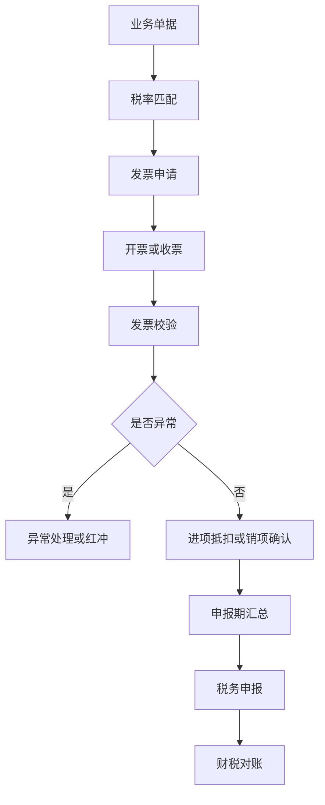
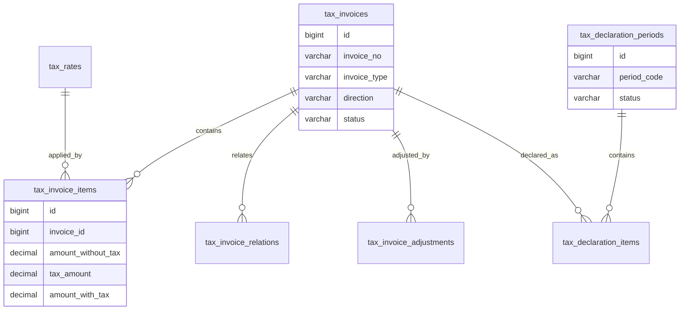
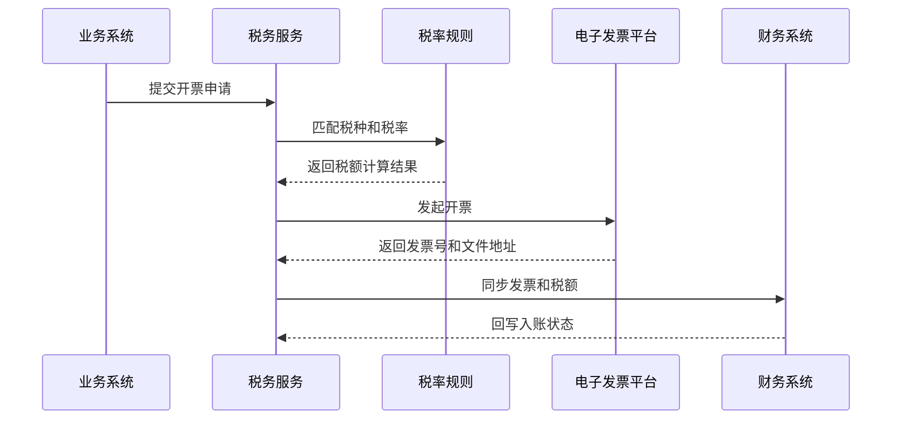

# 税务管理项目案例

## 适合谁看

适合需要做发票管理、税率配置、进项销项、红冲、税额计算、税务申报、税务风险、财税对账和电子发票集成的开发者。

税务管理不是“录入发票”。真实企业里，税务数据来自订单、合同、采购、付款、收款、发票平台和财务系统。系统要保证业务金额、发票金额、税额、申报金额和账务金额能够对得上，并且在税率变化、红字发票、跨期申报和发票异常时能够追溯原因。

## 业务目标

第一版税务管理支持：

- 维护税种、税率和税收分类。
- 管理销项发票和进项发票。
- 支持发票申请、开票、作废和红冲。
- 计算不含税金额、税额和价税合计。
- 支持发票与订单、合同、付款、收款关联。
- 支持进项抵扣状态和销项申报状态。
- 生成申报期税务汇总。
- 识别税务风险和票据异常。
- 对接电子发票平台或财务系统。

## 税务管理链路

税务管理的核心是“业务、发票、税额、申报、账务”五者一致。只做发票列表，无法支撑真实财税流程。

## 核心概念

| 概念 | 说明 | 示例 |
| --- | --- | --- |
| 税种 | 税务类型 | 增值税、企业所得税、附加税 |
| 税率 | 税额计算比例 | 13%、9%、6%、0% |
| 销项发票 | 企业开给客户的发票 | 销售订单开票 |
| 进项发票 | 供应商开给企业的发票 | 采购发票 |
| 红字发票 | 冲减原发票的发票 | 退货、折让、开票错误 |
| 申报期 | 税务申报归属期间 | 2026-07 |
| 抵扣状态 | 进项发票是否用于抵扣 | 待认证、已抵扣、不可抵扣 |

税务字段不要只用字符串描述。税种、税率、申报期、发票状态、抵扣状态都应该有明确枚举和流转规则。

## 数据模型

## 推荐表结构

| 表 | 作用 | 关键字段 |
| --- | --- | --- |
| `tax_categories` | 税种和税收分类 | `category_code`、`category_name`、`enabled` |
| `tax_rates` | 税率配置 | `tax_category_id`、`rate`、`effective_from`、`effective_to` |
| `tax_invoices` | 发票主表 | `invoice_no`、`direction`、`invoice_type`、`status`、`issue_date` |
| `tax_invoice_items` | 发票明细 | `invoice_id`、`goods_name`、`amount_without_tax`、`tax_rate`、`tax_amount` |
| `tax_invoice_relations` | 发票关联业务 | `invoice_id`、`source_type`、`source_id`、`relation_amount` |
| `tax_invoice_adjustments` | 作废、红冲、调整 | `invoice_id`、`adjust_type`、`reason`、`status` |
| `tax_declaration_periods` | 申报期 | `period_code`、`start_date`、`end_date`、`status` |
| `tax_declaration_items` | 申报明细 | `period_id`、`invoice_id`、`tax_amount`、`declare_status` |
| `tax_risk_alerts` | 税务风险 | `risk_type`、`risk_level`、`source_id`、`status` |
| `tax_platform_sync_logs` | 税务平台同步 | `invoice_id`、`platform`、`status`、`error_message` |

税率需要有生效时间。不要在代码里写死税率，也不要只保存税率名称。历史发票必须按开票当时的税率计算和追溯。

## 发票处理流程

发票处理要支持失败重试。开票平台超时不代表开票失败，必须通过平台流水号查询最终状态，避免重复开票。

## 税额计算规则

| 场景 | 计算方式 | 注意点 |
| --- | --- | --- |
| 已知不含税金额 | 税额 = 不含税金额 * 税率 | 按币种和小数位处理舍入 |
| 已知价税合计 | 不含税 = 价税合计 / (1 + 税率) | 明细级和汇总级可能有尾差 |
| 多税率订单 | 按明细分别计算 | 不要用订单总额统一乘税率 |
| 折扣或折让 | 折扣要分摊到明细 | 防止税额和发票明细不一致 |
| 红冲 | 按原发票反向冲减 | 必须关联原发票 |

税额计算最容易出问题的是“舍入”。推荐统一在明细级计算，并记录尾差调整，不要让前端和后端各算一套。

## 前端页面拆分

| 页面或组件 | 作用 | 注意点 |
| --- | --- | --- |
| 税务工作台 | 查看待开票、待认证、待申报和风险 | 按申报期和风险等级聚合 |
| 税率配置 | 维护税种和税率 | 必须有生效日期 |
| 销项发票 | 管理开给客户的发票 | 关联订单、合同、收款 |
| 进项发票 | 管理供应商发票 | 关联采购、付款、验收 |
| 发票申请 | 提交开票或红冲申请 | 展示税额试算 |
| 申报期汇总 | 汇总进项、销项和应纳税额 | 支持锁定申报期 |
| 税务风险 | 展示异常发票和金额不一致 | 支持分派处理 |
| 平台同步日志 | 查看电子发票平台交互 | 支持按流水号追踪 |

税务页面要尽量展示“来源单据”和“金额拆分”。只展示发票号和金额，业务人员很难判断发票是否正确。

## 接口拆分建议

| 接口 | 作用 | 注意点 |
| --- | --- | --- |
| `GET /tax/rates` | 查询税率 | 按日期匹配有效税率 |
| `POST /tax/invoices/apply` | 提交开票申请 | 后端重新计算税额 |
| `POST /tax/invoices/{id}/issue` | 发起开票 | 使用平台流水号保证幂等 |
| `POST /tax/invoices/{id}/void` | 作废发票 | 校验发票状态和平台状态 |
| `POST /tax/invoices/{id}/red` | 红冲发票 | 必须关联原发票 |
| `GET /tax/declarations/{period}` | 查询申报期 | 汇总进项、销项和风险 |
| `POST /tax/declarations/{period}/lock` | 锁定申报期 | 锁定后限制修改 |
| `GET /tax/risks` | 查询税务风险 | 支持风险类型和处理状态筛选 |

## 实际项目常见问题

### 问题 1：订单金额和发票金额总是差一分钱

通常是前后端或不同系统使用了不同的舍入策略。解决方案是统一由后端税务服务计算明细金额、税额和价税合计，并记录尾差调整明细。

### 问题 2：发票平台超时后重复开票

不要把超时直接当作失败重新提交。开票请求要生成业务幂等号，后续先按幂等号查询平台结果。只有确认平台无记录时才能重新发起。

### 问题 3：税率调整后历史发票金额变化

这是因为系统只保存了税率编码，没有保存发票当时使用的税率值。解决方案是在发票明细保存 `tax_rate` 快照，同时税率配置保留历史版本。

### 问题 4：申报期已经锁定，业务又想改发票

申报期锁定后不能直接修改已申报数据。需要走调整单、红冲或下期调整流程，并保留原申报期数据不变。

## 权限与审计

税务管理权限至少要区分：

- 查看发票。
- 提交开票申请。
- 审核开票申请。
- 作废或红冲发票。
- 维护税率。
- 锁定申报期。
- 查看税务风险。
- 导出发票数据。
- 重试平台同步。

税率维护、申报期锁定、红冲和作废必须审计。税务数据直接影响合规和财务报表，不能只记录普通操作日志。

## 验收清单

- 税种和税率可配置，并有生效时间。
- 发票明细保存税率和税额快照。
- 发票能关联订单、合同、付款或收款等来源单据。
- 开票平台调用有幂等和状态查询。
- 支持作废、红冲和调整。
- 申报期可以汇总、锁定和追溯。
- 税额计算前后端一致。
- 进项、销项、申报和账务能对账。
- 税务风险可识别并分派处理。
- 高风险操作有审批或审计。

## 下一步学习

继续学习 [复杂财务对账项目案例](/projects/finance-reconciliation-case)、[资金计划项目案例](/projects/cash-flow-planning-case)、[预算管理项目案例](/projects/budget-management-case) 和 [行业合规审计项目案例](/projects/compliance-audit-case)。
