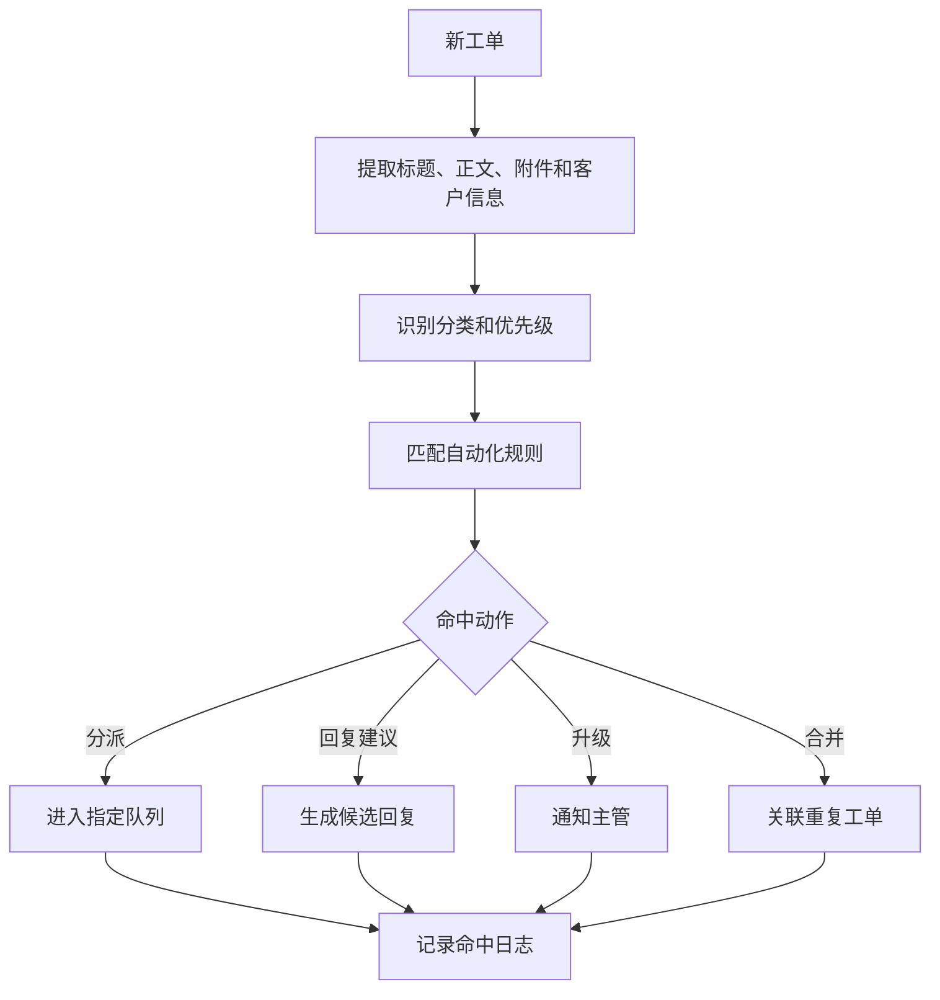
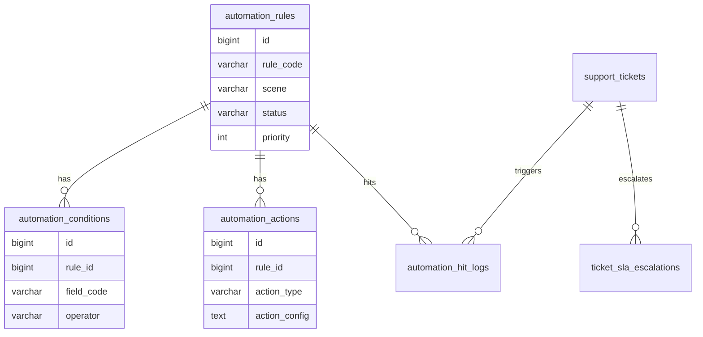
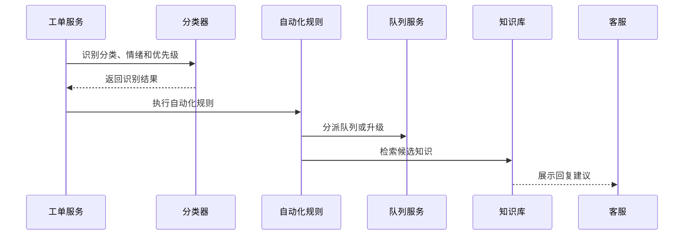

# 工单自动化项目案例

## 适合谁看

适合需要做客服自动分派、SLA 自动升级、工单自动回复、重复问题识别、机器人辅助、工单规则编排和服务流程提效的开发者。

工单自动化不是“写一个自动回复”。真实项目里，自动化要判断分类、优先级、客户等级、当前队列压力、历史工单、SLA 截止时间和知识库命中情况。自动化越强，越需要可解释、可暂停和可人工接管。

## 业务目标

第一版工单自动化支持：

- 自动识别工单分类。
- 根据规则自动分派队列。
- 根据 SLA 自动升级。
- 支持自动回复建议。
- 支持重复工单合并。
- 支持自动化规则试运行。
- 支持规则命中日志。
- 支持人工接管和回滚。

## 自动化链路图

自动化动作不能完全黑盒。客服需要知道一张工单为什么被分到某个队列，为什么被升级，为什么推荐某条回复。

## 数据模型

## 推荐表结构

| 表 | 作用 | 关键字段 |
| --- | --- | --- |
| `automation_rules` | 自动化规则 | `rule_code`、`scene`、`priority`、`status` |
| `automation_conditions` | 触发条件 | `rule_id`、`field_code`、`operator`、`expected_value` |
| `automation_actions` | 执行动作 | `rule_id`、`action_type`、`action_config` |
| `automation_hit_logs` | 命中日志 | `ticket_id`、`rule_code`、`action_result`、`reason_snapshot` |
| `ticket_sla_escalations` | SLA 升级记录 | `ticket_id`、`level`、`escalated_to`、`reason` |
| `ticket_reply_suggestions` | 回复建议 | `ticket_id`、`source_type`、`content`、`accepted_flag` |
| `ticket_duplicate_links` | 重复工单关联 | `ticket_id`、`related_ticket_id`、`match_score` |

自动化规则可以复用规则引擎的思想，但工单自动化要额外关注人工接管和服务体验，不能只追求规则执行成功。

## 规则执行流程

回复建议应该默认由客服确认后发送。除非场景非常明确，例如“工单已收到”这类低风险通知，否则不要自动对用户发送业务结论。

## 自动化场景

| 场景 | 自动动作 | 注意点 |
| --- | --- | --- |
| 新工单分类 | 自动设置分类和优先级 | 低置信度要让人工确认 |
| 队列分派 | 按产品线、客户等级、工作量分派 | 规则要能解释 |
| SLA 临近超时 | 自动提醒或升级主管 | 避免重复轰炸 |
| 重复问题 | 关联历史工单和知识库 | 不要误合并不同客户的隐私问题 |
| 常见问题 | 推荐知识库回复 | 客服确认后发送 |
| 高风险情绪 | 标记投诉风险 | 进入人工优先队列 |

## 前端页面拆分

| 页面 | 作用 | 注意点 |
| --- | --- | --- |
| 自动化规则 | 配置触发条件和动作 | 支持启停和优先级 |
| 规则试运行 | 用历史工单测试规则效果 | 展示命中原因 |
| 命中日志 | 查看自动化执行结果 | 支持按工单号查询 |
| SLA 升级 | 查看升级链路 | 明确升级对象 |
| 回复建议 | 客服确认候选回复 | 展示来源知识 |
| 重复工单 | 查看关联和合并建议 | 人工确认后合并 |
| 自动化看板 | 展示节省工时和误判率 | 误判要能反馈 |

## 实际项目常见问题

### 问题 1：自动回复误导用户

自动回复要分级。确认类、收件类可以自动发送；涉及退款、合同、故障结论的回复应先进入建议模式。

### 问题 2：规则越来越多后相互冲突

规则要有优先级、互斥组和试运行。命中日志要展示最终执行了哪些动作、哪些动作被跳过。

### 问题 3：自动化无法证明提升效果

要统计自动分派准确率、客服采纳率、平均首响时间、SLA 超时率和人工回退率。

## 验收清单

- 自动化规则有场景、优先级和启停状态。
- 条件字段和动作白名单化。
- 支持规则试运行。
- 命中日志能解释自动化动作。
- SLA 升级能定位责任人。
- 回复建议默认需要客服确认。
- 重复工单合并需要人工确认。
- 自动化结果支持人工回退。
- 看板能展示采纳率和误判率。
- 高风险自动动作有审计记录。

## 下一步学习

继续学习 [客服工单项目案例](/projects/support-ticket-case)、[知识库平台项目案例](/projects/knowledge-base-case) 和 [规则引擎项目案例](/projects/rule-engine-case)。
