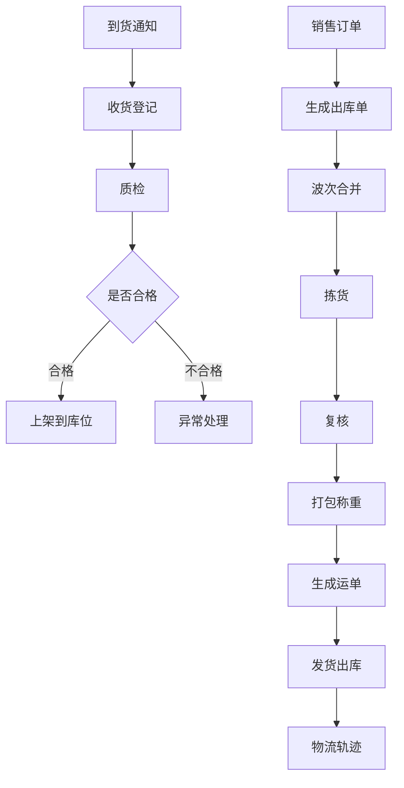
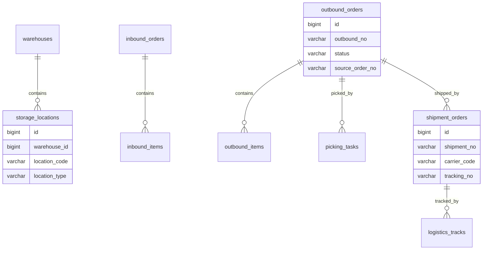
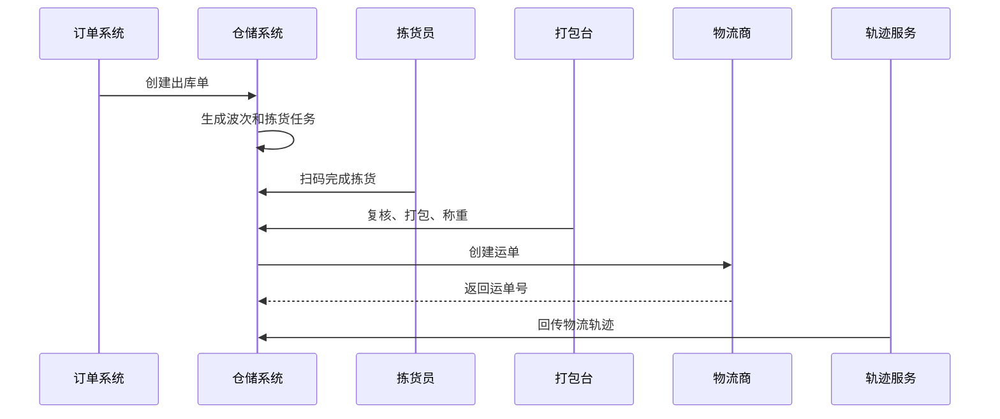

# 仓储物流项目案例

## 适合谁看

适合需要做仓库作业、入库上架、拣货、复核、打包、发货、物流轨迹、运单和异常件处理的开发者。

仓储物流不是“订单发货按钮”。真实项目里，仓库作业会经历到货、收货、质检、上架、波次、拣货、复核、打包、称重、发货和物流跟踪。每一步都要留下作业记录，否则订单丢件、错发、漏发时很难追责。

## 业务目标

第一版仓储物流支持：

- 维护仓库、库区和库位。
- 入库收货和上架。
- 出库波次和拣货。
- 复核、打包和称重。
- 生成运单。
- 物流轨迹订阅。
- 异常件处理。
- 仓库作业看板。

## 仓储作业链路

仓储系统要把“库存数量”和“作业过程”连接起来。库存变化只是结果，作业单据才解释为什么变化。

## 数据模型

## 推荐表结构

| 表 | 作用 | 关键字段 |
| --- | --- | --- |
| `storage_locations` | 库位 | `warehouse_id`、`location_code`、`location_type`、`status` |
| `inbound_orders` | 入库单 | `inbound_no`、`source_type`、`status`、`warehouse_id` |
| `inbound_items` | 入库明细 | `inbound_id`、`sku_id`、`expected_qty`、`received_qty` |
| `outbound_orders` | 出库单 | `outbound_no`、`source_order_no`、`status`、`warehouse_id` |
| `outbound_items` | 出库明细 | `outbound_id`、`sku_id`、`plan_qty`、`picked_qty` |
| `picking_tasks` | 拣货任务 | `outbound_id`、`picker_id`、`status`、`started_at` |
| `shipment_orders` | 发货单 | `outbound_id`、`carrier_code`、`tracking_no`、`status` |
| `logistics_tracks` | 物流轨迹 | `shipment_id`、`track_time`、`track_status`、`description` |

库位和作业单据要分开。库位是仓库结构，入库单、出库单和拣货任务是作业过程。

## 出库发货流程

拣货和复核要扫码确认。只靠人工点击完成，很容易出现错发和漏发。

## 异常场景

| 场景 | 处理方式 | 注意点 |
| --- | --- | --- |
| 到货少件 | 入库差异 | 关联供应商和采购单 |
| 质检不合格 | 异常入库或退回 | 不合格库存隔离 |
| 拣货缺货 | 缺货异常 | 反查库存和库位 |
| 复核不一致 | 退回拣货 | 保留复核记录 |
| 运单创建失败 | 重试或换物流商 | 避免重复发货 |
| 物流丢件 | 售后或补发 | 关联发货单和轨迹 |

异常件要有状态和责任人。否则仓库会积累大量“处理中但没人管”的异常单。

## 前端页面拆分

| 页面 | 作用 | 注意点 |
| --- | --- | --- |
| 仓库库位 | 管理库区、库位和容量 | 库位编码要稳定 |
| 入库收货 | 扫码收货和质检 | 支持差异登记 |
| 上架任务 | 指导放到哪个库位 | 和库存余额联动 |
| 出库单 | 查看待发货订单 | 支持波次合并 |
| 拣货任务 | 仓库人员扫码拣货 | 移动端操作优先 |
| 复核打包 | 检查商品和数量 | 支持称重和面单 |
| 物流轨迹 | 查询发货和签收 | 轨迹异常标记 |
| 异常处理 | 管理少件、错发、丢件 | 需要责任人和处理结果 |

## 实际项目常见问题

### 问题 1：订单显示已发货，但物流没有轨迹

可能只是创建了发货单，没有真正交接给物流商。发货状态要区分“已生成运单、已出库、已揽收、运输中、已签收”。

### 问题 2：仓库错发商品

拣货和复核缺少扫码校验。拣货时扫库位和 SKU，复核时扫商品和包裹，可以明显降低错发。

### 问题 3：异常件长期无人处理

异常单必须有负责人、状态、截止时间和处理结果，不能只在备注里写一句“待处理”。

## 验收清单

- 仓库、库区、库位结构清晰。
- 入库、上架、拣货、复核、打包、发货都有作业记录。
- 出库状态能区分拣货、复核、发货和物流。
- 支持扫码作业。
- 运单创建具备幂等性。
- 物流轨迹可回传和查询。
- 异常件有负责人和处理闭环。
- 作业过程能反向解释库存变化。
- 移动端仓库作业可操作。
- 关键作业有审计记录。

## 下一步学习

继续学习 [库存管理项目案例](/projects/inventory-management-case)、[售后服务项目案例](/projects/after-sales-service-case) 和 [数据导入导出项目案例](/projects/import-export-case)。
