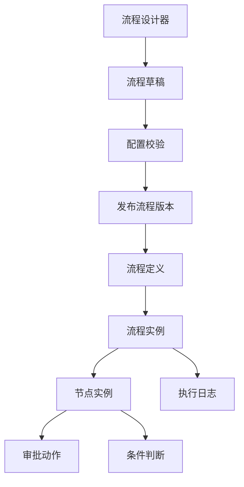
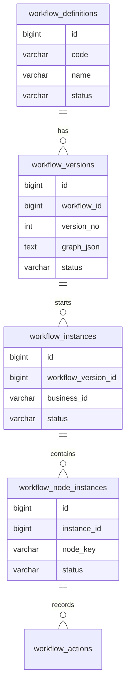
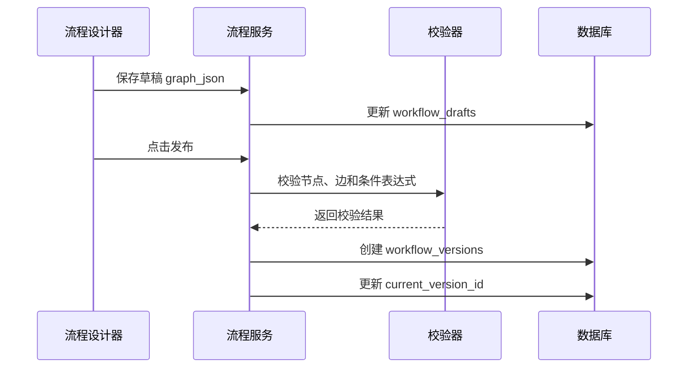

# 工作流配置器项目案例

## 适合谁看

适合需要做可配置审批、表单流转、自动化规则、节点编排、条件分支、流程发布和流程实例追踪的开发者。

工作流配置器不是“画几个节点保存 JSON”。真实项目里，它要处理流程草稿和发布版本、节点配置校验、条件表达式、执行状态、回滚、权限、表单数据绑定和历史实例兼容。设计不好，流程一改，正在运行的实例就可能全部异常。

## 业务目标

第一版工作流配置器支持：

- 可视化编辑流程节点。
- 支持开始、审批、条件、抄送、结束节点。
- 支持流程草稿和发布版本。
- 支持条件表达式。
- 支持流程实例按版本运行。
- 支持节点执行日志。
- 支持流程复制、禁用和回滚。
- 支持配置校验。

## 先看设计器完成形态

工作流设计器不只是节点画布。至少还要让用户看到节点配置、校验结果、草稿版本和发布阻断。

<DocFigure
  src="/images/projects/workflow-builder-canvas.webp"
  alt="报销审批工作流设计器画布包含开始、审批、条件和财务复核节点，右侧显示配置校验和未连接结束节点错误"
  caption="设计态可以持续修改；发布时生成不可变版本，运行中的实例继续使用启动时绑定的版本。"
  :width="1440"
  :height="900"
/>

图中“未连接结束节点”是发布阻断，而不是普通提醒。校验应由服务端再次执行，不能只依赖前端画布，因为发布 API 可能被其他客户端直接调用。

## 模块关系图

关键原则：设计态和运行态要分开。设计器里修改草稿，不应该影响已经启动的流程实例。

## 数据模型

## 推荐表结构

| 表 | 作用 | 关键字段 |
| --- | --- | --- |
| `workflow_definitions` | 流程定义主表 | `code`、`name`、`status`、`current_version_id` |
| `workflow_drafts` | 流程草稿 | `workflow_id`、`graph_json`、`updated_by` |
| `workflow_versions` | 发布版本 | `workflow_id`、`version_no`、`graph_json`、`published_at` |
| `workflow_instances` | 流程实例 | `workflow_version_id`、`business_id`、`status` |
| `workflow_node_instances` | 节点实例 | `instance_id`、`node_key`、`assignee_id`、`status` |
| `workflow_actions` | 操作记录 | `node_instance_id`、`action_type`、`comment` |

`graph_json` 保存流程图结构，但关键查询字段仍要结构化，例如流程状态、当前节点、处理人和业务 ID。

## 发布流程

发布是一个重要边界。只有发布后的版本可以被业务实例引用，草稿不能直接启动流程。

## 节点配置

| 节点类型 | 必填配置 | 常见问题 |
| --- | --- | --- |
| 开始节点 | 触发条件、表单范围 | 一个流程只能有一个开始节点 |
| 审批节点 | 审批人、超时策略 | 审批人为空时要兜底 |
| 条件节点 | 条件表达式、默认分支 | 多个条件命中时要定义顺序 |
| 抄送节点 | 接收人 | 不应阻塞主流程 |
| 结束节点 | 结束状态 | 至少要有一个结束节点 |

条件表达式不要直接执行用户输入的 JavaScript。更安全的方式是提供受控表达式语法，例如字段、比较符和固定函数。

## 前端页面拆分

| 页面或组件 | 作用 | 注意点 |
| --- | --- | --- |
| 流程列表 | 查看流程定义和状态 | 区分草稿、已发布、停用 |
| 流程设计器 | 拖拽节点和连线 | 节点配置面板要明确必填项 |
| 节点配置面板 | 配置审批人和条件 | 实时校验配置 |
| 发布确认弹窗 | 展示校验结果和版本号 | 发布后生成不可变版本 |
| 实例详情页 | 查看流程运行轨迹 | 显示使用的版本 |
| 执行日志页 | 排查节点异常 | 支持按节点、处理人筛选 |

## 常见问题

### 问题 1：修改流程后，历史审批实例异常

说明实例引用了可变流程定义。实例必须绑定发布版本，流程修改只影响新实例。

### 问题 2：条件分支没有命中任何节点

条件节点必须配置默认分支，并在发布校验时检查所有分支是否可达结束节点。

### 问题 3：审批人为空导致流程卡住

审批节点要有兜底策略，例如转给部门负责人、流程管理员或自动退回发起人。

## 验收清单

- 流程草稿和发布版本分离。
- 流程实例绑定固定版本。
- 发布前校验开始节点、结束节点、连线和必填配置。
- 条件节点有默认分支。
- 审批人为空有兜底策略。
- 实例详情能展示当前节点和历史动作。
- 流程变更有版本记录和发布人。
- 停用流程不影响历史实例。
- 执行异常能在日志里定位。

## 下一步学习

继续学习 [审批流项目案例](/projects/approval-workflow-case)、[任务调度项目案例](/projects/task-scheduler-case) 和 [前端页面与状态问题](/projects/issues-frontend)。
