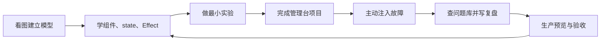

# React 学习导览

## 适合谁看

适合已经掌握 HTML、CSS 和现代 JavaScript，准备系统学习 React 组件开发、状态、路由和项目交付的人；也适合会写页面但经常被 Effect、旧 state、列表 key、请求竞态和表单状态困住的开发者。

React 学习的重点不是背 Hook 名称，而是建立四个模型：

1. 组件如何根据输入描述 UI。
2. state 如何以快照形式驱动下一次 render。
3. 事件、派生计算和 Effect 怎样分工。
4. URL、服务端数据、表单草稿和会话怎样成为不同事实源。

## 学习前准备

开始前应能独立完成：

- 使用 `const`、函数、数组方法、对象展开和模块导入导出。
- 使用 `async/await`、`fetch` 和 `try/catch`。
- 理解 DOM 事件、表单和 URL 查询参数。
- 使用 TypeScript 基础类型、联合类型和函数类型。
- 使用 Git 提交，并能运行 npm 脚本。

基础不稳时先走 [前端基础学习导览](/frontend/introduction)、[JavaScript 学习导览](/javascript/introduction) 和 [TypeScript 学习导览](/typescript/introduction)。

## 学习闭环



## 推荐顺序

<LearningPath :steps="[
  { title: '图解 React 核心概念', description: '先理解 render、commit、state 快照、组件身份、Effect 生命周期、路由数据和排错证据链。', link: '/react/visual-guide', badge: '图解' },
  { title: '快速开始', description: '创建 React 项目，写第一个组件、事件和局部状态。', link: '/react/quick-start', badge: '入门' },
  { title: '组件与 JSX', description: '学习 props、条件渲染、列表 key、组件纯净性和职责拆分。', link: '/react/component-jsx', badge: '核心' },
  { title: 'Hooks 与状态', description: '掌握 state 快照、函数式更新、状态提升和自定义 Hook。', link: '/react/hooks-state', badge: '核心' },
  { title: 'Effect 与副作用', description: '区分事件、派生计算和外部同步，写对依赖与 cleanup。', link: '/react/effects', badge: '难点' },
  { title: '表单与请求', description: '处理受控表单、校验、提交状态、请求取消和服务端错误。', link: '/react/forms', badge: '业务' },
  { title: 'Context 与状态管理', description: '按局部、URL、服务端和跨层共享分类状态，理解 Context 边界。', link: '/react/context-state-management', badge: '状态' },
  { title: '路由与项目结构', description: '用真实 URL、布局、loader 和受保护路由组织应用。', link: '/react/router-structure', badge: '路由' },
  { title: '性能、测试与最佳实践', description: '用 Profiler 和用户行为测试建立证据，不盲目 memo。', link: '/react/performance', badge: '质量' },
  { title: 'React 管理台从零到项目', description: '完成登录、会话、用户列表、表单、权限、Mock API、测试和生产预览。', link: '/react/project-admin', badge: '项目' },
  { title: 'React 专项练习', description: '通过 12 个练习和故障矩阵验证快照、key、Effect、竞态、权限与交付。', link: '/roadmap/react-practice', badge: '练习' },
  { title: 'React 真实项目问题库', description: '按现象、证据、根因、修复和回归处理 16 类高频问题。', link: '/projects/issues-react', badge: '排错' },
  { title: 'React 常见问题', description: '开发中快速定位无限循环、旧状态、key、表单和 Context 问题。', link: '/react/troubleshooting', badge: '速查' }
]" />

## 三种阅读方式

### 第一次系统学习

```text
图解 -> 快速开始 -> 组件 -> state -> Effect
-> 表单与请求 -> 路由与状态 -> 管理台项目
-> 专项练习 -> 问题库复盘
```

不要在还不能解释 state 快照时直接学习大量第三方状态库。

### 已经会 React，准备做项目

```text
图解自测 -> 管理台项目 -> 专项练习 5~12
-> 问题库 -> 性能和测试
```

### 正在排查线上问题

```text
常见问题快速分流 -> React 专项问题库
-> React DevTools / Network / Profiler 证据
-> 最小复现 -> 回归测试
```

## React 与 Vue 的概念对应

| 主题 | Vue | React | 不能直接等同的地方 |
| --- | --- | --- | --- |
| UI 描述 | template / render | JSX | JSX 是 JavaScript 表达式，不是另一套模板指令 |
| 局部状态 | `ref` / `reactive` | `useState` / `useReducer` | React state 是 render 快照，不直接改对象 |
| 逻辑复用 | composable | custom Hook | Hook 有顶层调用规则 |
| 派生值 | `computed` | render 计算 / `useMemo` | `useMemo` 是性能缓存，不是语义必需品 |
| 外部同步 | `watch` / 生命周期 | `useEffect` | Effect 不是监听任意变化的默认入口 |
| 组件通信 | props / emits | props / callback | 数据下传，意图通过回调上传 |
| 全局共享 | provide/inject / Pinia | Context / store | Context 主要解决传递，不自动提供 selector 与缓存 |
| 路由 | Vue Router | React Router | 当前 React Router 有多种模式，要明确项目使用方式 |

不要按 API 名称逐项翻译。先比较数据流和生命周期责任。

## 每阶段验收

| 阶段 | 能力证明 |
| --- | --- |
| 图解 | 能不看文档画出 trigger -> render -> commit -> paint |
| 组件 | 能按职责拆分，props 只读，动态列表 key 稳定 |
| 状态 | 能解释快照、批处理、函数式更新和组件身份 |
| Effect | 能删除不必要 Effect，并为真正同步过程写 cleanup |
| 项目 | 能让 URL、loader、表单、会话和权限边界清楚 |
| 排错 | 能用 Console、Network、React DevTools 和 Profiler 证明根因 |
| 交付 | 测试、构建、生产预览、深层 URL 和失败矩阵通过 |

## 章节地图

| 层次 | 章节 |
| --- | --- |
| 心智模型 | 图解 React 核心概念 |
| UI 基础 | 快速开始、组件与 JSX |
| 状态与同步 | Hooks 与状态、Effect 与副作用、Context 与状态管理 |
| 业务能力 | 表单处理、请求与数据流、路由与项目结构 |
| 工程质量 | 性能优化、测试策略、最佳实践 |
| 项目闭环 | React 管理台从零到项目、React 专项练习 |
| 排障 | React 真实项目问题库、React 常见问题 |

## 不建议的学习方式

- 只照着视频复制最终 UI，不解释状态属于哪里。
- 每个请求都写在 `useEffect(..., [])` 中。
- 一遇到 props 传递就引入全局 store。
- 一遇到重渲染就加 `memo`、`useMemo`、`useCallback`。
- 只测试成功路径，不测试快速操作、取消、401、403、409、422 和 500。
- 只在开发服务器验证，不测试生产预览和深层 URL。

## 下一步学习

从 [图解 React 核心概念](/react/visual-guide) 开始；如果十个自测问题都能回答，可以直接进入 [React 管理台从零到项目](/react/project-admin)，并同步完成 [React 专项练习](/roadmap/react-practice)。
