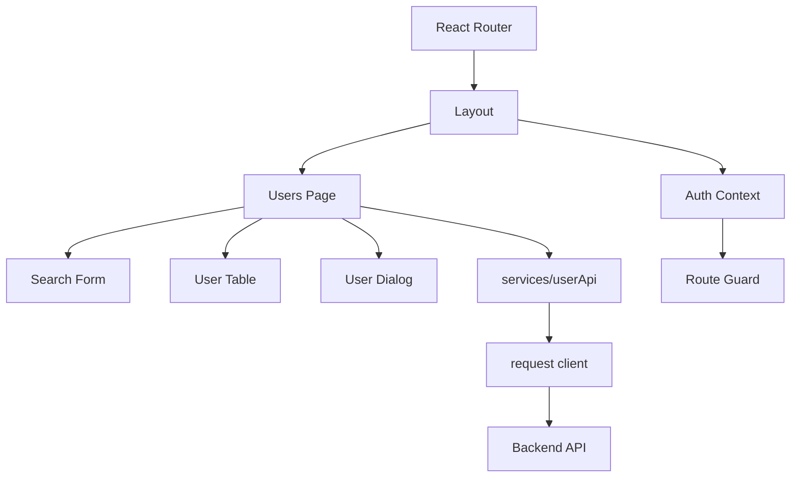
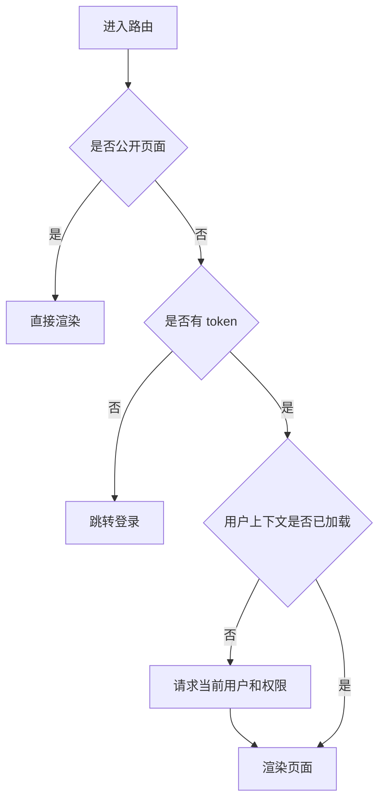
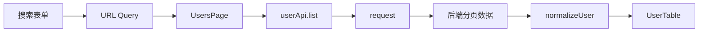
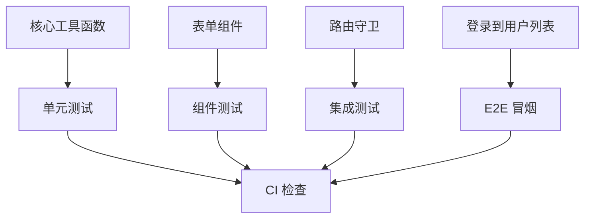

# React 管理台从零到项目

## 适合谁看

适合已经学过 React 组件、Hooks、Effect、请求、路由和表单，但还没有独立完成过一个中小型管理台项目的人。

这篇用“后台用户管理”作为案例，带你把 React 的核心知识串成项目：登录、布局、路由、请求、表格、表单、权限、错误处理、测试和部署说明。

## 这篇解决什么

很多 React 学习者卡在这里：

- 会写组件，但项目目录不知道怎么分。
- 会用 `useState`，但不知道哪些状态放组件、URL、Context 或服务端缓存。
- 会写 `useEffect`，但请求重复、依赖数组和清理逻辑经常出错。
- 会写表单，但新增和编辑逻辑混在一起。
- 会写路由，但未登录、无权限、刷新恢复处理不完整。

React 管理台项目的目标不是炫技，而是建立一个可维护的数据流和页面组织方式。

## 项目目标

第一版管理台包含：

- 登录页。
- 后台布局。
- 用户列表。
- 用户新增和编辑。
- 用户启用和禁用。
- 角色选择。
- 按钮权限控制。
- 统一请求封装。
- 统一错误提示。
- README、环境配置和构建说明。

## 整体架构图



这张图说明两个边界：

- 页面组件负责组合 UI 和调度动作。
- API、权限、路由守卫、请求错误处理不能散落在每个组件里。

## 推荐目录结构

```text
src/
├─ app/
│  ├─ App.tsx
│  └─ router.tsx
├─ layouts/
│  └─ AdminLayout.tsx
├─ pages/
│  ├─ login/
│  │  └─ LoginPage.tsx
│  └─ users/
│     ├─ UsersPage.tsx
│     ├─ UserSearch.tsx
│     ├─ UserTable.tsx
│     └─ UserFormDialog.tsx
├─ services/
│  ├─ request.ts
│  ├─ authApi.ts
│  └─ userApi.ts
├─ state/
│  └─ auth.tsx
├─ types/
│  └─ user.ts
├─ constants/
│  └─ permissions.ts
└─ utils/
   └─ format.ts
```

目录原则：

| 目录 | 负责 |
| --- | --- |
| `pages` | 页面和页面内局部组件 |
| `services` | 请求封装和 API 方法 |
| `state` | 登录态、用户态、权限态 |
| `types` | DTO、ViewModel、Form、Payload |
| `constants` | 权限码、路由名、固定枚举 |
| `utils` | 无业务状态的纯函数 |

## 类型边界

不要让后端 DTO 直接进入表单。

```ts
export interface UserDTO {
  id: number
  username: string
  displayName: string | null
  mobile: string | null
  enabled: 0 | 1
  roleCodes: string[]
  createdAt: string
}

export interface UserViewModel {
  id: number
  username: string
  displayName: string
  mobileText: string
  enabled: boolean
  roleLabels: string[]
  createdAtText: string
}

export interface UserForm {
  id?: number
  username: string
  displayName: string
  mobile: string
  enabled: boolean
  roleCodes: string[]
}
```

转换函数集中写：

```ts
export function normalizeUser(dto: UserDTO): UserViewModel {
  return {
    id: dto.id,
    username: dto.username,
    displayName: dto.displayName ?? '未命名',
    mobileText: dto.mobile ?? '-',
    enabled: dto.enabled === 1,
    roleLabels: dto.roleCodes,
    createdAtText: new Date(dto.createdAt).toLocaleString()
  }
}
```

## 登录和路由守卫

路由守卫要处理三件事：

- 未登录访问后台页面时跳转登录页。
- 已登录访问登录页时跳转首页。
- 刷新页面后恢复当前用户和权限。



不要只在登录成功后加载用户上下文。刷新页面时内存状态会丢失，必须能重新恢复。

## 请求封装

请求层统一处理：

- API baseURL。
- token。
- 401。
- 403。
- 业务错误。
- 网络错误。

```ts
export async function request<T>(url: string, options: RequestInit = {}): Promise<T> {
  const response = await fetch(`${import.meta.env.VITE_API_BASE_URL}${url}`, {
    ...options,
    headers: {
      'Content-Type': 'application/json',
      ...options.headers
    }
  })

  if (response.status === 401) {
    throw new Error('登录已失效')
  }

  if (response.status === 403) {
    throw new Error('没有操作权限')
  }

  if (!response.ok) {
    throw new Error('请求失败')
  }

  return response.json() as Promise<T>
}
```

真实项目可以进一步增加错误码、request id、重试和取消请求。

## 用户列表数据流



把筛选条件同步到 URL 的好处：

- 刷新页面不丢条件。
- 可以复制链接给别人。
- 返回列表时能恢复上次查询。

## 新增和编辑表单

新增和编辑共用表单组件，但表单数据要独立。

```ts
function createDefaultUserForm(): UserForm {
  return {
    username: '',
    displayName: '',
    mobile: '',
    enabled: true,
    roleCodes: []
  }
}

function createEditUserForm(user: UserViewModel): UserForm {
  return {
    id: user.id,
    username: user.username,
    displayName: user.displayName,
    mobile: user.mobileText === '-' ? '' : user.mobileText,
    enabled: user.enabled,
    roleCodes: []
  }
}
```

不要把表单直接绑定表格行对象。否则用户还没点保存，列表数据就可能被改掉。

## 权限按钮

权限码集中管理：

```ts
export const PermissionCode = {
  UserCreate: 'user:create',
  UserUpdate: 'user:update',
  UserDisable: 'user:disable'
} as const
```

按钮组件只做展示控制：

```tsx
function PermissionButton(props: {
  code: string
  children: React.ReactNode
  onClick?: () => void
}) {
  const { hasPermission } = useAuth()

  if (!hasPermission(props.code)) return null

  return <button onClick={props.onClick}>{props.children}</button>
}
```

前端权限只能提升体验，不能替代后端接口鉴权。

## 测试建议

优先测试这些地方：



不要一开始追求 100% 覆盖率。先覆盖最容易出错、最影响交付的路径。

| 测试对象 | 为什么 |
| --- | --- |
| `normalizeUser` | 后端字段变化会影响展示 |
| 表单校验 | 最容易产生边界问题 |
| 权限按钮 | 防止无权限入口展示 |
| 路由守卫 | 防止未登录访问后台 |
| 请求错误处理 | 401/403/网络错误都要有表现 |

## 验收清单

- 登录后能进入后台。
- 刷新后台页面后用户上下文能恢复。
- 用户列表支持搜索、分页、加载中、空状态、错误状态。
- 新增和编辑表单有独立数据，不污染列表。
- 请求层统一处理 401、403 和业务错误。
- 权限码集中维护。
- README 写清启动、环境变量、构建和目录结构。
- 构建通过，核心页面移动端可读。

## 实际项目常见问题

### 问题 1：Effect 重复请求

先确认请求是否应该随 URL query、表单提交还是组件挂载触发。不要把每次渲染都会变化的对象放进依赖数组。

### 问题 2：返回列表后筛选条件丢失

把搜索条件放进 URL query，而不是只存在组件 state。

### 问题 3：按钮隐藏了，但接口还能调用

这是正常风险。后端必须按权限码做授权判断。

## 下一步学习

继续学习 [请求与数据流](/react/request-data-flow)、[路由与项目结构](/react/router-structure)、[测试策略](/react/testing) 和 [真实项目问题库](/projects/real-world-issues)。
