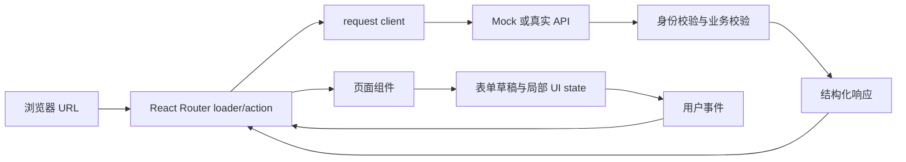
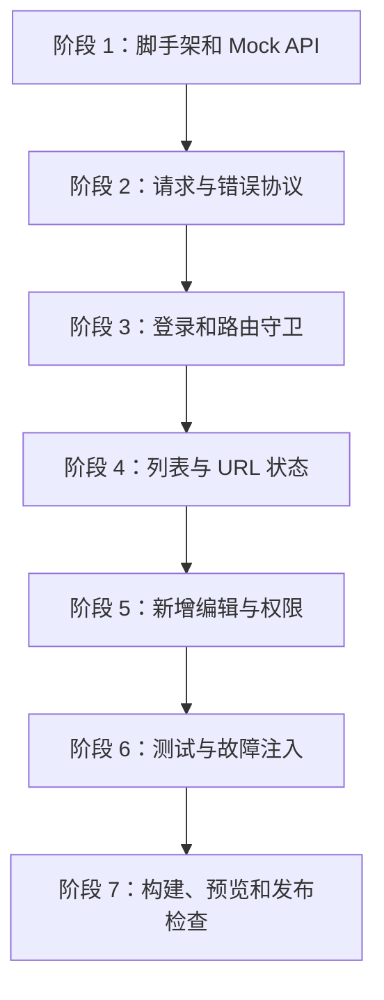
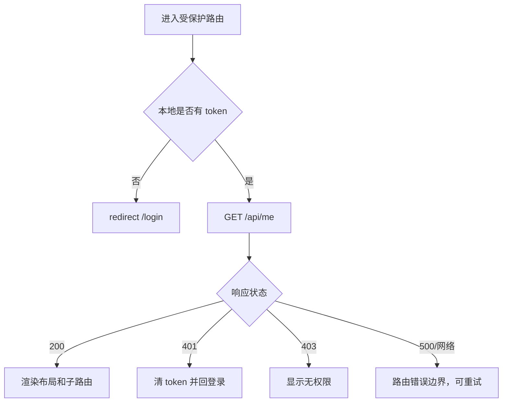
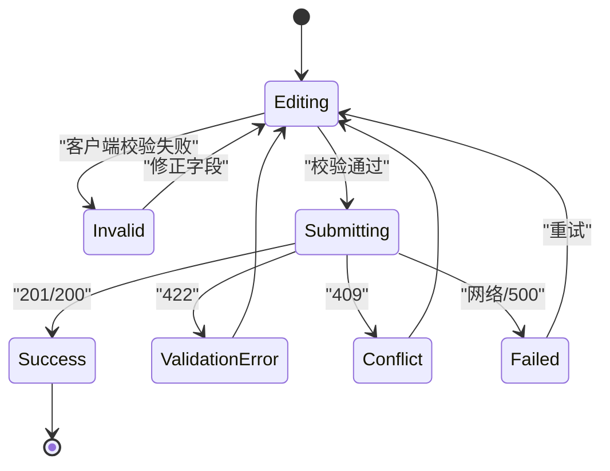
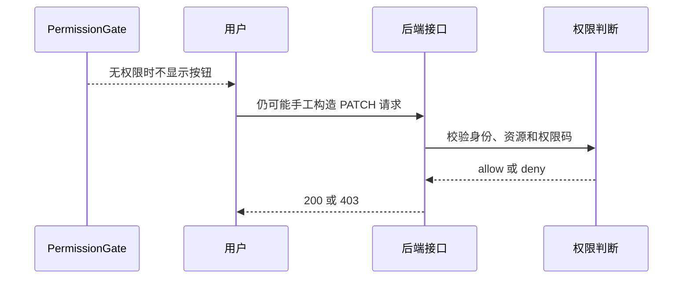

# React 管理台从零到项目

## 适合谁看

适合已经学过 React 组件、state、Effect、表单和路由，但还没有独立完成过一个带登录、权限、真实错误状态、测试和生产验收的管理台项目的人。

## 这个项目解决什么

这不是一份只展示目录结构的示例，而是一条可以照着完成的交付链路。你将用 Vite、React、TypeScript 和 React Router Data Mode 做一个“用户与权限管理台”，并同时实现本地 Mock API、错误状态、测试和生产预览。

适合已经学过组件、props、state 和事件，但还没有独立完成 React 项目的人。建议先读 [图解 React 核心概念](/react/visual-guide)，再边写边验证本章代码。

## 完成后得到什么

第一版包含：

- 登录与刷新后会话恢复。
- 后台布局和受保护路由。
- 用户列表、关键词筛选、分页和 URL 状态。
- 用户新增、编辑、启用与停用。
- 加载、空、校验、冲突、未登录、无权限和服务错误状态。
- 统一请求客户端、结构化错误和 request id。
- 前端权限入口与后端授权边界说明。
- Vitest + React Testing Library 核心测试。
- Mock API、构建、生产预览和故障注入清单。

## 先看完整链路



本项目坚持三个边界：

1. URL 保存可分享、可恢复的页面状态。
2. loader/action 或 service 负责网络交互，组件负责展示和收集意图。
3. 服务端负责可信身份、权限、唯一性和持久化，前端不能代替后端安全校验。

## 技术选择

| 能力 | 选择 | 本章为什么这样选 |
| --- | --- | --- |
| 构建 | Vite + React + TypeScript | 启动简单，适合理解客户端 React 边界 |
| 路由 | React Router Data Mode | 用 loader、action、错误边界管理 URL 与数据 |
| 请求 | 原生 `fetch` 封装 | 看清状态码、取消和错误协议 |
| 状态 | 路由数据 + 局部 state | 第一版不引入重复全局状态 |
| 测试 | Vitest + React Testing Library | 按用户行为验证组件和路由 |
| 后端 | Node 内存 Mock API | 本地可运行，同时保留真实 HTTP 失败语义 |

这里没有为了“像企业项目”一次性加入 UI 库、全局 store 和请求缓存库。项目扩大后可以按真实问题引入，不要在还没有状态边界时先堆依赖。

## 阶段地图



每个阶段都应能独立运行。不要等所有代码写完才第一次打开页面。

## 阶段 1：创建项目

### 1.1 环境检查

先查看 Vite 当前官方要求的 Node.js 版本，再检查本机：

```bash
node --version
npm --version
```

创建项目：

```bash
npm create vite@latest react-admin-lab -- --template react-ts
cd react-admin-lab
npm install
npm install react-router
npm install -D vitest jsdom @testing-library/react @testing-library/jest-dom @testing-library/user-event
```

启动脚手架并确认初始页可见：

```bash
npm run dev
```

### 1.2 脚本

在 `package.json` 的 `scripts` 中保留 Vite 脚本，并增加 Mock 和测试：

```json
{
  "scripts": {
    "dev": "vite",
    "mock": "node server/mock-api.mjs",
    "build": "tsc -b && vite build",
    "preview": "vite preview",
    "test": "vitest run",
    "test:watch": "vitest"
  }
}
```

开发时使用两个终端：

```bash
npm run mock
npm run dev
```

### 1.3 目录结构

```text
react-admin-lab/
├─ server/
│  └─ mock-api.mjs
├─ src/
│  ├─ app/
│  │  ├─ router.tsx
│  │  └─ route-error.tsx
│  ├─ components/
│  │  ├─ PermissionGate.tsx
│  │  └─ UserFormDialog.tsx
│  ├─ layouts/
│  │  └─ AdminLayout.tsx
│  ├─ pages/
│  │  ├─ login/
│  │  │  └─ LoginPage.tsx
│  │  └─ users/
│  │     ├─ UsersPage.tsx
│  │     └─ users.loader.ts
│  ├─ services/
│  │  ├─ auth-api.ts
│  │  ├─ request.ts
│  │  └─ user-api.ts
│  ├─ session/
│  │  └─ session.ts
│  ├─ types/
│  │  ├─ auth.ts
│  │  └─ user.ts
│  ├─ main.tsx
│  └─ styles.css
├─ vite.config.ts
└─ vitest.setup.ts
```

目录表达职责，不表达技术炫技。页面可以组合组件和调用路由 API，但不应该复制请求解析、token 清理和错误格式化。

## 阶段 2：先定义接口和类型边界

### 2.1 API 响应约定

成功列表：

```json
{
  "items": [],
  "page": 1,
  "pageSize": 10,
  "total": 0
}
```

失败响应：

```json
{
  "code": "VALIDATION_ERROR",
  "message": "请修正表单中的错误",
  "fieldErrors": {
    "email": "邮箱格式不正确"
  },
  "requestId": "4f8e9b31-..."
}
```

状态码边界：

| 状态码 | 含义 | 前端表现 |
| ---: | --- | --- |
| 200/201 | 成功 | 更新页面或跳转 |
| 400 | 请求结构错误 | 通用错误，不猜字段 |
| 401 | 未登录或会话失效 | 清理本地会话并回登录页 |
| 403 | 已登录但无权限 | 权限页，不重复登录 |
| 409 | 唯一性或状态冲突 | 保留输入并说明冲突 |
| 422 | 字段校验失败 | 映射字段错误并聚焦摘要 |
| 500 | 服务内部错误 | 提示重试并保留 request id |

### 2.2 用户类型

`src/types/user.ts`：

```ts
export type UserStatus = 'enabled' | 'disabled'

export type UserDTO = {
  id: string
  username: string
  displayName: string | null
  email: string
  status: UserStatus
  roleCodes: string[]
  createdAt: string
}

export type UserListQuery = {
  q: string
  page: number
  pageSize: number
}

export type UserListResult = {
  items: UserDTO[]
  page: number
  pageSize: number
  total: number
}

export type UserFormValues = {
  username: string
  displayName: string
  email: string
  roleCodes: string[]
}

export type UserPayload = UserFormValues
```

`UserDTO` 表达后端事实，`UserFormValues` 表达可编辑草稿。不要把表格行对象直接绑定到表单。

### 2.3 会话类型

`src/types/auth.ts`：

```ts
export type CurrentUser = {
  id: string
  displayName: string
  permissionCodes: string[]
}

export type LoginResult = {
  accessToken: string
}
```

## 阶段 3：建立本地 Mock API

### 3.1 为什么不能只写静态数组

页面内静态数组无法真实验证：

- 状态码分支。
- token 请求头。
- 网络延迟和请求竞态。
- 409 唯一性冲突。
- 422 字段错误。
- 刷新页面后的会话恢复。

所以本章使用一个最小 HTTP 服务。它只用于学习，不是生产后端。

### 3.2 Mock 服务

创建 `server/mock-api.mjs`：

```js
import { createServer } from 'node:http'
import { randomUUID } from 'node:crypto'

const port = 4175
const accounts = [
  {
    email: 'admin@example.com',
    password: 'Admin123!',
    accessToken: 'demo-admin-token',
    user: {
      id: 'current-1',
      displayName: '演示管理员',
      permissionCodes: ['user:read', 'user:create', 'user:update', 'user:disable']
    }
  },
  {
    email: 'viewer@example.com',
    password: 'Viewer123!',
    accessToken: 'demo-viewer-token',
    user: {
      id: 'current-2',
      displayName: '只读成员',
      permissionCodes: ['user:read']
    }
  }
]

let users = [
  {
    id: 'u-1001',
    username: 'ada',
    displayName: 'Ada Lovelace',
    email: 'ada@example.com',
    status: 'enabled',
    roleCodes: ['admin'],
    createdAt: '2026-07-01T08:00:00.000Z'
  },
  {
    id: 'u-1002',
    username: 'lin',
    displayName: 'Lin',
    email: 'lin@example.com',
    status: 'disabled',
    roleCodes: ['viewer'],
    createdAt: '2026-07-02T09:30:00.000Z'
  }
]

function sendJson(response, status, body, requestId) {
  response.writeHead(status, {
    'content-type': 'application/json; charset=utf-8',
    'x-request-id': requestId
  })
  response.end(JSON.stringify({ ...body, requestId }))
}

async function readJson(request) {
  const chunks = []
  for await (const chunk of request) chunks.push(chunk)
  if (chunks.length === 0) return {}
  return JSON.parse(Buffer.concat(chunks).toString('utf8'))
}

function getSession(request) {
  const accessToken = request.headers.authorization?.replace(/^Bearer\s+/i, '')
  return accounts.find((account) => account.accessToken === accessToken) ?? null
}

function hasPermission(session, permission) {
  return session.user.permissionCodes.includes(permission)
}

function sendForbidden(response, requestId, permission) {
  return sendJson(response, 403, {
    code: 'FORBIDDEN',
    message: `缺少权限：${permission}`
  }, requestId)
}

function positiveInteger(value, fallback, maximum) {
  const parsed = Number(value)
  if (!Number.isInteger(parsed) || parsed <= 0) return fallback
  return Math.min(parsed, maximum)
}

function validateUser(payload, editingId = null) {
  const fieldErrors = {}
  const username = String(payload.username ?? '').trim()
  const displayName = String(payload.displayName ?? '').trim()
  const email = String(payload.email ?? '').trim().toLowerCase()
  const roleCodes = Array.isArray(payload.roleCodes)
    ? [...new Set(payload.roleCodes.map(String))]
    : []
  const allowedRoleCodes = new Set(['admin', 'viewer'])

  if (!/^[a-z][a-z0-9_-]{2,19}$/.test(username)) {
    fieldErrors.username = '用户名需为 3 到 20 位小写字母、数字、下划线或短横线'
  }
  if (displayName.length < 2 || displayName.length > 40) {
    fieldErrors.displayName = '显示名称需为 2 到 40 个字符'
  }
  if (!/^[^\s@]+@[^\s@]+\.[^\s@]+$/.test(email)) {
    fieldErrors.email = '邮箱格式不正确'
  }
  if (roleCodes.length === 0 || roleCodes.some((role) => !allowedRoleCodes.has(role))) {
    fieldErrors.roleCodes = '请选择系统允许的角色'
  }

  const duplicated = users.some(
    (user) => user.id !== editingId && (user.username === username || user.email === email)
  )

  return {
    values: { username, displayName, email, roleCodes },
    fieldErrors,
    duplicated
  }
}

const server = createServer(async (request, response) => {
  const requestId = randomUUID()
  const url = new URL(request.url ?? '/', `http://${request.headers.host}`)

  try {
    if (request.method === 'POST' && url.pathname === '/api/auth/login') {
      const body = await readJson(request)
      const account = accounts.find(
        (item) => item.email === body.email && item.password === body.password
      )
      if (!account) {
        return sendJson(response, 401, {
          code: 'INVALID_CREDENTIALS',
          message: '邮箱或密码不正确'
        }, requestId)
      }
      return sendJson(response, 200, { accessToken: account.accessToken }, requestId)
    }

    const session = getSession(request)
    if (!session) {
      return sendJson(response, 401, {
        code: 'UNAUTHORIZED',
        message: '登录已失效，请重新登录'
      }, requestId)
    }

    if (request.method === 'GET' && url.pathname === '/api/me') {
      return sendJson(response, 200, session.user, requestId)
    }

    if (request.method === 'GET' && url.pathname === '/api/users') {
      if (!hasPermission(session, 'user:read')) {
        return sendForbidden(response, requestId, 'user:read')
      }
      const q = (url.searchParams.get('q') ?? '').trim().toLowerCase()
      const page = positiveInteger(url.searchParams.get('page'), 1, 100000)
      const pageSize = positiveInteger(url.searchParams.get('pageSize'), 10, 50)
      const filtered = users.filter((user) =>
        [user.username, user.displayName, user.email]
          .join(' ')
          .toLowerCase()
          .includes(q)
      )
      const start = (page - 1) * pageSize
      return sendJson(response, 200, {
        items: filtered.slice(start, start + pageSize),
        page,
        pageSize,
        total: filtered.length
      }, requestId)
    }

    if (request.method === 'POST' && url.pathname === '/api/users') {
      if (!hasPermission(session, 'user:create')) {
        return sendForbidden(response, requestId, 'user:create')
      }
      const result = validateUser(await readJson(request))
      if (Object.keys(result.fieldErrors).length > 0) {
        return sendJson(response, 422, {
          code: 'VALIDATION_ERROR',
          message: '请修正表单中的错误',
          fieldErrors: result.fieldErrors
        }, requestId)
      }
      if (result.duplicated) {
        return sendJson(response, 409, {
          code: 'USER_CONFLICT',
          message: '用户名或邮箱已存在'
        }, requestId)
      }
      const user = {
        id: randomUUID(),
        ...result.values,
        status: 'enabled',
        createdAt: new Date().toISOString()
      }
      users = [user, ...users]
      return sendJson(response, 201, user, requestId)
    }

    const userMatch = url.pathname.match(/^\/api\/users\/([^/]+)$/)
    if (userMatch && request.method === 'PATCH') {
      const id = userMatch[1]
      const index = users.findIndex((user) => user.id === id)
      if (index < 0) {
        return sendJson(response, 404, {
          code: 'USER_NOT_FOUND',
          message: '用户不存在或已删除'
        }, requestId)
      }

      const body = await readJson(request)
      if (body.status === 'enabled' || body.status === 'disabled') {
        if (!hasPermission(session, 'user:disable')) {
          return sendForbidden(response, requestId, 'user:disable')
        }
        users[index] = { ...users[index], status: body.status }
        return sendJson(response, 200, users[index], requestId)
      }

      if (!hasPermission(session, 'user:update')) {
        return sendForbidden(response, requestId, 'user:update')
      }

      const result = validateUser(body, id)
      if (Object.keys(result.fieldErrors).length > 0) {
        return sendJson(response, 422, {
          code: 'VALIDATION_ERROR',
          message: '请修正表单中的错误',
          fieldErrors: result.fieldErrors
        }, requestId)
      }
      if (result.duplicated) {
        return sendJson(response, 409, {
          code: 'USER_CONFLICT',
          message: '用户名或邮箱已存在'
        }, requestId)
      }
      users[index] = { ...users[index], ...result.values }
      return sendJson(response, 200, users[index], requestId)
    }

    sendJson(response, 404, {
      code: 'NOT_FOUND',
      message: '接口不存在'
    }, requestId)
  } catch (error) {
    console.error(requestId, error)
    sendJson(response, 500, {
      code: 'INTERNAL_ERROR',
      message: '服务暂时不可用'
    }, requestId)
  }
})

server.listen(port, '127.0.0.1', () => {
  console.log(`Mock API: http://127.0.0.1:${port}`)
})
```

两个测试账号只用于本地 Mock。管理员可以执行全部动作；只读账号用于验证前端入口隐藏和后端 `403`：

```text
管理员：admin@example.com / Admin123!
只读成员：viewer@example.com / Viewer123!
```

### 3.3 Vite 代理

`vite.config.ts`：

```ts
import { defineConfig } from 'vite'
import react from '@vitejs/plugin-react'

export default defineConfig({
  plugins: [react()],
  server: {
    proxy: {
      '/api': 'http://127.0.0.1:4175'
    }
  },
  preview: {
    proxy: {
      '/api': 'http://127.0.0.1:4175'
    }
  }
})
```

使用相对路径 `/api`，浏览器只访问 Vite 同源地址，开发代理再转发到 Mock 服务。生产环境是否保留同源 `/api`，由网关和部署结构决定。

## 阶段 4：统一请求和会话

### 4.1 会话存储

`src/session/session.ts`：

```ts
const TOKEN_KEY = 'react-admin-lab-token'

export function getToken() {
  return window.localStorage.getItem(TOKEN_KEY)
}

export function setToken(token: string) {
  window.localStorage.setItem(TOKEN_KEY, token)
}

export function clearToken() {
  window.localStorage.removeItem(TOKEN_KEY)
}
```

这是本地教学方案。真实系统要根据威胁模型决定 Cookie、token 生命周期和 XSS/CSRF 防护，不要把长期敏感凭证直接照搬到 `localStorage`。

### 4.2 结构化请求错误

`src/services/request.ts`：

```ts
import { clearToken, getToken } from '../session/session'

type ApiErrorBody = {
  code?: string
  message?: string
  fieldErrors?: Record<string, string>
  requestId?: string
}

export class ApiError extends Error {
  readonly status: number
  readonly code: string
  readonly fieldErrors: Record<string, string>
  readonly requestId: string

  constructor(
    message: string,
    status: number,
    code: string,
    fieldErrors: Record<string, string>,
    requestId: string
  ) {
    super(message)
    this.name = 'ApiError'
    this.status = status
    this.code = code
    this.fieldErrors = fieldErrors
    this.requestId = requestId
  }
}

export async function request<T>(path: string, init: RequestInit = {}): Promise<T> {
  const token = getToken()
  const headers = new Headers(init.headers)
  headers.set('accept', 'application/json')
  if (init.body && !(init.body instanceof FormData) && !headers.has('content-type')) {
    headers.set('content-type', 'application/json')
  }
  if (token) headers.set('authorization', `Bearer ${token}`)

  const response = await fetch(path, {
    ...init,
    headers
  })

  const body = await response.json().catch(() => ({})) as ApiErrorBody

  if (!response.ok) {
    if (response.status === 401) {
      clearToken()
      if (window.location.pathname !== '/login') {
        window.location.assign('/login?reason=session-expired')
      }
    }
    throw new ApiError(
      body.message ?? `请求失败（${response.status}）`,
      response.status,
      body.code ?? 'UNKNOWN_ERROR',
      body.fieldErrors ?? {},
      body.requestId ?? response.headers.get('x-request-id') ?? ''
    )
  }

  return body as T
}
```

不要把所有错误都转成 `new Error('请求失败')`。状态码、业务码、字段错误和 request id 是排查证据。这里把任意业务请求的 `401` 集中收敛到登录页，因此不仅父级 `/api/me`，子路由 loader 和组件 mutation 失效时也能恢复；登录接口本身已在 `/login`，不会触发重复跳转。

### 4.3 API 方法

`src/services/auth-api.ts`：

```ts
import type { CurrentUser, LoginResult } from '../types/auth'
import { request } from './request'

export function login(email: string, password: string) {
  return request<LoginResult>('/api/auth/login', {
    method: 'POST',
    body: JSON.stringify({ email, password })
  })
}

export function getCurrentUser(signal?: AbortSignal) {
  return request<CurrentUser>('/api/me', { signal })
}
```

`src/services/user-api.ts`：

```ts
import type {
  UserDTO,
  UserListQuery,
  UserListResult,
  UserPayload
} from '../types/user'
import { request } from './request'

export function getUsers(query: UserListQuery, signal?: AbortSignal) {
  const params = new URLSearchParams({
    q: query.q,
    page: String(query.page),
    pageSize: String(query.pageSize)
  })
  return request<UserListResult>(`/api/users?${params}`, { signal })
}

export function createUser(payload: UserPayload) {
  return request<UserDTO>('/api/users', {
    method: 'POST',
    body: JSON.stringify(payload)
  })
}

export function updateUser(id: string, payload: UserPayload) {
  return request<UserDTO>(`/api/users/${id}`, {
    method: 'PATCH',
    body: JSON.stringify(payload)
  })
}

export function updateUserStatus(id: string, status: UserDTO['status']) {
  return request<UserDTO>(`/api/users/${id}`, {
    method: 'PATCH',
    body: JSON.stringify({ status })
  })
}
```

## 阶段 5：路由、登录和会话恢复

### 5.1 数据路由

`src/app/router.tsx`：

```tsx
import { createBrowserRouter, redirect } from 'react-router'
import { AdminLayout } from '../layouts/AdminLayout'
import { LoginPage, loginAction } from '../pages/login/LoginPage'
import { UsersPage } from '../pages/users/UsersPage'
import { usersLoader } from '../pages/users/users.loader'
import { getCurrentUser } from '../services/auth-api'
import { ApiError } from '../services/request'
import { clearToken, getToken } from '../session/session'
import { RouteError } from './route-error'

function AppLoading() {
  return (
    <main className="app-loading" aria-busy="true">
      <p role="status">正在恢复登录状态...</p>
    </main>
  )
}

export async function adminLoader({ request }: { request: Request }) {
  if (!getToken()) throw redirect('/login')

  try {
    return await getCurrentUser(request.signal)
  } catch (error) {
    if (error instanceof ApiError && error.status === 401) {
      throw redirect('/login')
    }
    throw error
  }
}

export async function logoutAction() {
  clearToken()
  return redirect('/login')
}

export const router = createBrowserRouter([
  {
    path: '/login',
    Component: LoginPage,
    action: loginAction
  },
  {
    path: '/logout',
    action: logoutAction
  },
  {
    id: 'admin',
    path: '/',
    loader: adminLoader,
    Component: AdminLayout,
    HydrateFallback: AppLoading,
    ErrorBoundary: RouteError,
    children: [
      {
        index: true,
        loader: () => redirect('/users')
      },
      {
        path: 'users',
        loader: usersLoader,
        Component: UsersPage,
        ErrorBoundary: RouteError
      }
    ]
  }
])
```

保护流程：



只判断“本地有 token”不代表已登录。`/api/me` 才能确认 token 是否有效，并返回当前权限事实。

### 5.2 应用入口

`src/main.tsx`：

```tsx
import { StrictMode } from 'react'
import { createRoot } from 'react-dom/client'
import { RouterProvider } from 'react-router/dom'
import { router } from './app/router'
import './styles.css'

createRoot(document.getElementById('root')!).render(
  <StrictMode>
    <RouterProvider router={router} />
  </StrictMode>
)
```

### 5.3 基础样式

创建 `src/styles.css`，先保证布局、表格、焦点和弹窗在桌面及移动端都可用：

```css
:root {
  color: #18201d;
  background: #f5f8f6;
  font-family: Inter, system-ui, sans-serif;
}

* {
  box-sizing: border-box;
}

body {
  margin: 0;
}

button,
input {
  min-height: 40px;
  font: inherit;
}

button,
a {
  touch-action: manipulation;
}

:focus-visible {
  outline: 3px solid #0b7a5c;
  outline-offset: 3px;
}

.admin-shell {
  min-height: 100vh;
  display: grid;
  grid-template:
    "header header" auto
    "sidebar main" 1fr / 220px minmax(0, 1fr);
}

.admin-header {
  grid-area: header;
  min-height: 64px;
  padding: 12px 24px;
  display: flex;
  align-items: center;
  justify-content: space-between;
  border-bottom: 1px solid #d8e2dd;
  background: #fff;
}

.admin-sidebar {
  grid-area: sidebar;
  padding: 24px;
  border-right: 1px solid #d8e2dd;
  background: #fff;
}

.admin-main {
  grid-area: main;
  min-width: 0;
  padding: 32px;
}

.page-header,
.search-form,
.dialog-actions {
  display: flex;
  align-items: center;
  gap: 12px;
}

.page-header {
  justify-content: space-between;
}

.search-form {
  margin: 24px 0;
  flex-wrap: wrap;
}

.table-scroll {
  max-width: 100%;
  overflow-x: auto;
  border: 1px solid #d8e2dd;
}

table {
  width: 100%;
  min-width: 720px;
  border-collapse: collapse;
  background: #fff;
}

th,
td {
  padding: 12px;
  border-bottom: 1px solid #e6ece9;
  text-align: left;
}

.pagination {
  margin-top: 20px;
  display: flex;
  align-items: center;
  gap: 16px;
}

.dialog-panel {
  width: min(560px, calc(100% - 32px));
  max-height: calc(100vh - 32px);
  overflow: auto;
  padding: 24px;
  border: 0;
}

.dialog-panel::backdrop {
  background: rgb(16 24 20 / 55%);
}

.dialog-panel form,
.login-card {
  display: grid;
  gap: 12px;
}

.error-summary,
[role="alert"] {
  color: #9a271f;
}

.app-loading,
.login-page {
  min-height: 100vh;
  display: grid;
  place-items: center;
  padding: 24px;
}

@media (max-width: 760px) {
  .admin-shell {
    grid-template:
      "header" auto
      "sidebar" auto
      "main" 1fr / minmax(0, 1fr);
  }

  .admin-header,
  .admin-sidebar,
  .admin-main {
    padding: 16px;
  }

  .page-header {
    align-items: flex-start;
    flex-direction: column;
  }
}
```

这里使用的是教学项目所需的最小样式，不承担完整设计系统职责。生产项目还要补充按钮层级、禁用态、骨架屏、Toast、深色模式和更多响应式测试。

### 5.4 登录 action 和页面

`src/pages/login/LoginPage.tsx`：

```tsx
import {
  Form,
  redirect,
  useActionData,
  useNavigation,
  type ActionFunctionArgs
} from 'react-router'
import { login } from '../../services/auth-api'
import { ApiError } from '../../services/request'
import { setToken } from '../../session/session'

type LoginActionData = {
  message: string
}

export async function loginAction({ request }: ActionFunctionArgs) {
  const formData = await request.formData()
  const email = String(formData.get('email') ?? '').trim()
  const password = String(formData.get('password') ?? '')

  if (!email || !password) {
    return { message: '请输入邮箱和密码' } satisfies LoginActionData
  }

  try {
    const result = await login(email, password)
    setToken(result.accessToken)
    return redirect('/users')
  } catch (error) {
    if (error instanceof ApiError) {
      return { message: error.message } satisfies LoginActionData
    }
    return { message: '网络异常，请稍后重试' } satisfies LoginActionData
  }
}

export function LoginPage() {
  const actionData = useActionData() as LoginActionData | undefined
  const navigation = useNavigation()
  const submitting = navigation.state === 'submitting'

  return (
    <main className="login-page">
      <h1>登录管理台</h1>
      {actionData?.message ? (
        <p className="form-error" role="alert">{actionData.message}</p>
      ) : null}
      <Form method="post" replace>
        <label htmlFor="email">邮箱</label>
        <input id="email" name="email" type="email" autoComplete="username" required />

        <label htmlFor="password">密码</label>
        <input
          id="password"
          name="password"
          type="password"
          autoComplete="current-password"
          required
        />

        <button type="submit" disabled={submitting}>
          {submitting ? '登录中...' : '登录'}
        </button>
      </Form>
    </main>
  )
}
```

登录失败时保留邮箱输入，不回显密码；提交中禁用按钮，防止重复请求。

### 5.4 后台布局

`src/layouts/AdminLayout.tsx`：

```tsx
import { Form, NavLink, Outlet, useLoaderData } from 'react-router'
import type { CurrentUser } from '../types/auth'

export function AdminLayout() {
  const currentUser = useLoaderData() as CurrentUser

  return (
    <div className="admin-shell">
      <header className="admin-header">
        <strong>React Admin Lab</strong>
        <span>{currentUser.displayName}</span>
        <Form action="/logout" method="post">
          <button type="submit">退出</button>
        </Form>
      </header>
      <aside className="admin-sidebar" aria-label="后台导航">
        <NavLink to="/users">用户管理</NavLink>
      </aside>
      <main className="admin-main" id="main-content">
        <Outlet />
      </main>
    </div>
  )
}
```

`/logout` 使用 POST action 清理会话，而不是一个可能被预加载或爬取的 GET 链接。

## 阶段 6：用户列表和 URL 状态

### 6.1 loader 解析 URL

`src/pages/users/users.loader.ts`：

```ts
import type { LoaderFunctionArgs } from 'react-router'
import { redirect } from 'react-router'
import { getUsers } from '../../services/user-api'
import { ApiError } from '../../services/request'

function positiveInteger(value: string | null, fallback: number) {
  const parsed = Number(value)
  return Number.isInteger(parsed) && parsed > 0 ? parsed : fallback
}

export async function usersLoader({ request }: LoaderFunctionArgs) {
  const url = new URL(request.url)
  const query = {
    q: (url.searchParams.get('q') ?? '').trim(),
    page: positiveInteger(url.searchParams.get('page'), 1),
    pageSize: 10
  }

  try {
    return {
      query,
      result: await getUsers(query, request.signal)
    }
  } catch (error) {
    if (error instanceof ApiError && error.status === 401) {
      throw redirect('/login')
    }
    throw error
  }
}
```

把 `request.signal` 传给 fetch 后，用户快速切换 URL 时路由可以取消失效请求，避免旧结果覆盖新结果。

### 6.2 列表页面

`src/pages/users/UsersPage.tsx` 的第一版：

```tsx
import { useState } from 'react'
import {
  Form,
  Link,
  useLoaderData,
  useNavigation,
  useRevalidator
} from 'react-router'
import { PermissionGate } from '../../components/PermissionGate'
import { UserFormDialog } from '../../components/UserFormDialog'
import { updateUserStatus } from '../../services/user-api'
import type { usersLoader } from './users.loader'
import type { UserDTO } from '../../types/user'

function pageUrl(q: string, page: number) {
  const params = new URLSearchParams()
  if (q) params.set('q', q)
  params.set('page', String(page))
  return `/users?${params}`
}

export function UsersPage() {
  type LoaderData = Awaited<ReturnType<typeof usersLoader>>
  const { query, result } = useLoaderData() as LoaderData
  const navigation = useNavigation()
  const revalidator = useRevalidator()
  const [editingUser, setEditingUser] = useState<UserDTO | null | undefined>()
  const [mutationError, setMutationError] = useState('')
  const loading = navigation.state === 'loading'
  const totalPages = Math.max(1, Math.ceil(result.total / result.pageSize))

  async function toggleStatus(user: UserDTO) {
    setMutationError('')
    try {
      await updateUserStatus(
        user.id,
        user.status === 'enabled' ? 'disabled' : 'enabled'
      )
      await revalidator.revalidate()
    } catch (error) {
      setMutationError(error instanceof Error ? error.message : '状态更新失败')
    }
  }

  return (
    <section aria-labelledby="users-title" aria-busy={loading}>
      <header className="page-header">
        <div>
          <h1 id="users-title">用户管理</h1>
          <p>共 {result.total} 位用户</p>
        </div>
        <PermissionGate code="user:create">
          <button type="button" onClick={() => setEditingUser(null)}>新增用户</button>
        </PermissionGate>
      </header>

      <Form key={query.q} method="get" className="search-form" role="search">
        <label htmlFor="q">关键词</label>
        <input id="q" name="q" defaultValue={query.q} />
        <button type="submit">搜索</button>
        <Link to="/users">重置</Link>
      </Form>

      {mutationError ? <p role="alert">{mutationError}</p> : null}
      {loading ? <p role="status">正在加载最新结果...</p> : null}

      {result.items.length === 0 ? (
        <div className="empty-state">
          <h2>没有找到用户</h2>
          <p>请调整关键词，或创建第一位用户。</p>
        </div>
      ) : (
        <div className="table-scroll" tabIndex={0} aria-label="用户表格，可横向滚动">
          <table>
            <thead>
              <tr>
                <th scope="col">用户名</th>
                <th scope="col">显示名称</th>
                <th scope="col">邮箱</th>
                <th scope="col">状态</th>
                <th scope="col">操作</th>
              </tr>
            </thead>
            <tbody>
              {result.items.map((user) => (
                <tr key={user.id}>
                  <th scope="row">{user.username}</th>
                  <td>{user.displayName ?? '-'}</td>
                  <td>{user.email}</td>
                  <td>{user.status === 'enabled' ? '启用' : '停用'}</td>
                  <td>
                    <PermissionGate code="user:update">
                      <button type="button" onClick={() => setEditingUser(user)}>编辑</button>
                    </PermissionGate>
                    <PermissionGate code="user:disable">
                      <button type="button" onClick={() => toggleStatus(user)}>
                        {user.status === 'enabled' ? '停用' : '启用'}
                      </button>
                    </PermissionGate>
                  </td>
                </tr>
              ))}
            </tbody>
          </table>
        </div>
      )}

      <nav className="pagination" aria-label="用户列表分页">
        {query.page > 1 ? (
          <Link to={pageUrl(query.q, query.page - 1)}>上一页</Link>
        ) : (
          <span aria-disabled="true">上一页</span>
        )}
        <span aria-current="page">第 {query.page} / {totalPages} 页</span>
        {query.page < totalPages ? (
          <Link to={pageUrl(query.q, query.page + 1)}>下一页</Link>
        ) : (
          <span aria-disabled="true">下一页</span>
        )}
      </nav>

      {editingUser !== undefined ? (
        <UserFormDialog
          key={editingUser?.id ?? 'create'}
          user={editingUser}
          onClose={() => setEditingUser(undefined)}
          onSaved={async () => {
            setEditingUser(undefined)
            await revalidator.revalidate()
          }}
        />
      ) : null}
    </section>
  )
}
```

这里刻意区分三个值：

| `editingUser` | 含义 |
| --- | --- |
| `undefined` | 表单关闭 |
| `null` | 新增模式 |
| `UserDTO` | 编辑模式 |

如果只用真假判断，新增和关闭容易混成同一状态。

### 6.3 搜索与分页必须继续写入 URL

`pageUrl` 被上一页和下一页链接直接调用，并保留当前关键词；搜索表单提交时没有携带旧页码，因此新搜索会自然回到第 1 页。`Form` 的 `key` 跟随 `query.q`，浏览器前进或后退到另一关键词时，非受控输入框会用 loader 的值重新创建，不会残留后一个页面的文字。

不要同时维护一份搜索/分页 state 和一份 URL 参数。URL 已经是事实源，loader 负责把它解析成页面数据。

## 阶段 7：表单、服务端错误和焦点

### 7.1 表单状态机



### 7.2 默认值和校验

`src/components/UserFormDialog.tsx` 的核心逻辑：

```tsx
import { useEffect, useRef, useState, type FormEvent } from 'react'
import { createUser, updateUser } from '../services/user-api'
import { ApiError } from '../services/request'
import type { UserDTO, UserFormValues } from '../types/user'

type Props = {
  user: UserDTO | null
  onClose: () => void
  onSaved: () => Promise<void>
}

function initialValues(user: UserDTO | null): UserFormValues {
  return user
    ? {
        username: user.username,
        displayName: user.displayName ?? '',
        email: user.email,
        roleCodes: [...user.roleCodes]
      }
    : { username: '', displayName: '', email: '', roleCodes: [] }
}

export function validate(values: UserFormValues) {
  const errors: Record<string, string> = {}
  if (!/^[a-z][a-z0-9_-]{2,19}$/.test(values.username)) {
    errors.username = '请输入 3 到 20 位合法用户名'
  }
  if (values.displayName.trim().length < 2) {
    errors.displayName = '显示名称至少 2 个字符'
  }
  if (!/^[^\s@]+@[^\s@]+\.[^\s@]+$/.test(values.email)) {
    errors.email = '请输入有效邮箱'
  }
  if (values.roleCodes.length === 0) {
    errors.roleCodes = '至少选择一个角色'
  }
  return errors
}

export function UserFormDialog({ user, onClose, onSaved }: Props) {
  const [values, setValues] = useState(() => initialValues(user))
  const [errors, setErrors] = useState<Record<string, string>>({})
  const [submitError, setSubmitError] = useState('')
  const [submitting, setSubmitting] = useState(false)
  const summaryRef = useRef<HTMLDivElement>(null)
  const dialogRef = useRef<HTMLDialogElement>(null)

  useEffect(() => {
    const dialog = dialogRef.current
    if (dialog && !dialog.open) dialog.showModal()
    return () => {
      if (dialog?.open) dialog.close()
    }
  }, [])

  function closeDialog() {
    if (submitting) return
    dialogRef.current?.close()
    onClose()
  }

  function updateField<Key extends keyof UserFormValues>(
    key: Key,
    value: UserFormValues[Key]
  ) {
    setValues((current) => ({ ...current, [key]: value }))
    setErrors((current) => {
      const next = { ...current }
      delete next[key]
      return next
    })
  }

  async function handleSubmit(event: FormEvent<HTMLFormElement>) {
    event.preventDefault()
    const nextErrors = validate(values)
    if (Object.keys(nextErrors).length > 0) {
      setErrors(nextErrors)
      queueMicrotask(() => summaryRef.current?.focus())
      return
    }

    setSubmitting(true)
    setSubmitError('')
    try {
      const payload = {
        ...values,
        username: values.username.trim(),
        displayName: values.displayName.trim(),
        email: values.email.trim().toLowerCase()
      }
      if (user) await updateUser(user.id, payload)
      else await createUser(payload)
      await onSaved()
    } catch (error) {
      if (error instanceof ApiError && error.status === 422) {
        setErrors(error.fieldErrors)
        setSubmitError('请修正标出的字段')
      } else if (error instanceof ApiError && error.status === 409) {
        setSubmitError(error.message)
      } else {
        setSubmitError(error instanceof Error ? error.message : '保存失败')
      }
      queueMicrotask(() => summaryRef.current?.focus())
    } finally {
      setSubmitting(false)
    }
  }

  return (
    <dialog
      ref={dialogRef}
      className="dialog-panel"
      aria-labelledby="user-dialog-title"
      onCancel={(event) => {
        event.preventDefault()
        closeDialog()
      }}
    >
        <h2 id="user-dialog-title">{user ? '编辑用户' : '新增用户'}</h2>

        {(submitError || Object.keys(errors).length > 0) ? (
          <div ref={summaryRef} className="error-summary" role="alert" tabIndex={-1}>
            <strong>{submitError || '请修正以下字段'}</strong>
            <ul>
              {Object.entries(errors).map(([field, message]) => (
                <li key={field}><a href={`#${field}`}>{message}</a></li>
              ))}
            </ul>
          </div>
        ) : null}

        <form onSubmit={handleSubmit} noValidate>
          <label htmlFor="username">用户名</label>
          <input
            id="username"
            value={values.username}
            onChange={(event) => updateField('username', event.target.value)}
            aria-invalid={Boolean(errors.username)}
            aria-describedby={errors.username ? 'username-error' : undefined}
          />
          {errors.username ? <p id="username-error">{errors.username}</p> : null}

          <label htmlFor="displayName">显示名称</label>
          <input
            id="displayName"
            value={values.displayName}
            onChange={(event) => updateField('displayName', event.target.value)}
            aria-invalid={Boolean(errors.displayName)}
            aria-describedby={errors.displayName ? 'displayName-error' : undefined}
          />
          {errors.displayName ? <p id="displayName-error">{errors.displayName}</p> : null}

          <label htmlFor="email">邮箱</label>
          <input
            id="email"
            type="email"
            value={values.email}
            onChange={(event) => updateField('email', event.target.value)}
            aria-invalid={Boolean(errors.email)}
            aria-describedby={errors.email ? 'email-error' : undefined}
          />
          {errors.email ? <p id="email-error">{errors.email}</p> : null}

          <fieldset
            aria-invalid={Boolean(errors.roleCodes)}
            aria-describedby={errors.roleCodes ? 'roleCodes-error' : undefined}
          >
            <legend>角色</legend>
            {['admin', 'viewer'].map((role) => (
              <label key={role}>
                <input
                  type="checkbox"
                  checked={values.roleCodes.includes(role)}
                  onChange={(event) => updateField(
                    'roleCodes',
                    event.target.checked
                      ? [...values.roleCodes, role]
                      : values.roleCodes.filter((item) => item !== role)
                  )}
                />
                {role}
              </label>
            ))}
          </fieldset>
          {errors.roleCodes ? <p id="roleCodes-error">{errors.roleCodes}</p> : null}

          <div className="dialog-actions">
            <button type="button" onClick={closeDialog} disabled={submitting}>取消</button>
            <button type="submit" disabled={submitting}>
              {submitting ? '保存中...' : '保存'}
            </button>
          </div>
        </form>
    </dialog>
  )
}
```

原生 `dialog.showModal()` 会建立模态层和焦点范围，本例补了 Escape、关闭和卸载清理。生产项目仍要验证：

- 打开后把焦点移入。
- Tab 焦点限制在弹窗中。
- Escape 关闭策略。
- 关闭后把焦点还给触发按钮。
- 背景内容不可交互。

优先使用团队组件库已经验证过的 Dialog；无论使用哪种实现，都要在桌面、移动端和纯键盘环境验证焦点行为。

## 阶段 8：权限边界

### 8.1 前端权限入口

`src/components/PermissionGate.tsx`：

```tsx
import { useRouteLoaderData } from 'react-router'
import type { ReactNode } from 'react'
import type { CurrentUser } from '../types/auth'

export function PermissionGate(props: { code: string; children: ReactNode }) {
  const currentUser = useRouteLoaderData('admin') as CurrentUser
  return currentUser.permissionCodes.includes(props.code) ? props.children : null
}
```

### 8.2 后端必须再次授权



隐藏按钮只改善体验。真实 API 必须校验“当前用户是否能对当前资源执行当前动作”，不能相信前端传来的角色或权限码。

## 阶段 9：错误边界

`src/app/route-error.tsx`：

```tsx
import { isRouteErrorResponse, useRouteError, useRevalidator } from 'react-router'
import { ApiError } from '../services/request'

export function RouteError() {
  const error = useRouteError()
  const revalidator = useRevalidator()

  if (isRouteErrorResponse(error)) {
    return <main><h1>{error.status}</h1><p>{error.statusText}</p></main>
  }

  if (error instanceof ApiError) {
    return (
      <main>
        <h1>{error.status === 403 ? '没有访问权限' : '页面加载失败'}</h1>
        <p>{error.message}</p>
        {error.requestId ? <p>请求编号：{error.requestId}</p> : null}
        <button type="button" onClick={() => revalidator.revalidate()}>重试</button>
      </main>
    )
  }

  return <main><h1>页面发生未知错误</h1><p>请刷新后重试。</p></main>
}
```

不要在生产页面直接展示 stack、内部 URL、SQL 或敏感响应。开发日志和用户错误信息应分层。

## 阶段 10：测试关键行为

### 10.1 测试环境

`vitest.setup.ts`：

```ts
import '@testing-library/jest-dom/vitest'
```

把前面的代理配置与测试配置合并到 `vite.config.ts`：

```ts
/// <reference types="vitest/config" />

import { defineConfig } from 'vite'
import react from '@vitejs/plugin-react'

export default defineConfig({
  plugins: [react()],
  server: {
    proxy: { '/api': 'http://127.0.0.1:4175' }
  },
  preview: {
    proxy: { '/api': 'http://127.0.0.1:4175' }
  },
  test: {
    environment: 'jsdom',
    setupFiles: './vitest.setup.ts'
  }
})
```

### 10.2 表单校验测试

将 `validate` 导出后测试业务结果，不测试内部 state：

```ts
import { describe, expect, it } from 'vitest'
import { validate } from './UserFormDialog'

describe('validate user form', () => {
  it('returns field errors for an invalid form', () => {
    expect(validate({
      username: 'A',
      displayName: '',
      email: 'wrong',
      roleCodes: []
    })).toEqual({
      username: '请输入 3 到 20 位合法用户名',
      displayName: '显示名称至少 2 个字符',
      email: '请输入有效邮箱',
      roleCodes: '至少选择一个角色'
    })
  })
})
```

### 10.3 按用户方式测试登录

```tsx
import { render, screen } from '@testing-library/react'
import userEvent from '@testing-library/user-event'
import { createMemoryRouter } from 'react-router'
import { RouterProvider } from 'react-router/dom'
import { describe, expect, it } from 'vitest'
import { LoginPage } from './LoginPage'

describe('LoginPage', () => {
  it('shows validation feedback for empty credentials', async () => {
    const user = userEvent.setup()
    const router = createMemoryRouter([
      { path: '/login', Component: LoginPage }
    ], { initialEntries: ['/login'] })

    render(<RouterProvider router={router} />)
    await user.click(screen.getByRole('button', { name: '登录' }))

    expect(screen.getByLabelText('邮箱')).toBeInvalid()
  })
})
```

测试优先级：

| 优先级 | 场景 |
| --- | --- |
| P0 | 登录、会话失效、列表加载、新增保存、后端 403 |
| P1 | 搜索 URL、422 字段错误、409 冲突、状态切换 |
| P2 | 空态、重试、焦点归还、移动端表格 |

组件测试不应依赖真实 Mock 服务。使用可控的 route loader、action 或网络 mock 返回固定状态，避免测试随机失败。

## 阶段 11：故障注入

不要只验证成功路径。按表逐项制造问题：

| 编号 | 故障 | 预期行为 | 证据 |
| --- | --- | --- | --- |
| R01 | `/api/me` 返回 401 | 清 token，回登录页 | Network + URL |
| R02 | `/api/me` 返回 500 | 错误边界显示重试和 request id | 页面 + 响应头 |
| R03 | 用户列表延迟 3 秒 | 有加载反馈，可继续识别当前页 | `aria-busy` + Network |
| R04 | 快速搜索 a、ab、abc | 最终只显示 abc 结果 | 请求取消/顺序 |
| R05 | 新增重复邮箱 | 保留输入并显示 409 冲突 | 表单 + response |
| R06 | 服务端返回 422 | 字段错误与摘要一致 | DOM + 焦点 |
| R07 | 重复点击保存 | 只产生一次有效 mutation | Network |
| R08 | 手工调用无权限接口 | 后端返回 403 | curl/Network |
| R09 | 列表排序后编辑 | 表单仍对应正确 id | React DevTools |
| R10 | 深层 URL `/users?q=ada` 刷新 | 页面正常，条件保留 | preview/部署 |
| R11 | 发布新版本后旧 chunk 失效 | 有可恢复策略，不白屏死循环 | Console + Network |
| R12 | 390px 与 200% 缩放 | 无页面级横向溢出，操作可达 | 浏览器检查 |

故障复盘至少写清：现象、复现、第一条证据、根因、修复、回归和预防。

R08 可以直接使用只读 token 调用写接口，不依赖前端是否隐藏按钮：

```bash
curl -i http://127.0.0.1:4175/api/users \
  -H 'Authorization: Bearer demo-viewer-token' \
  -H 'Content-Type: application/json' \
  --data '{"username":"grace","displayName":"Grace Hopper","email":"grace@example.com","roleCodes":["viewer"]}'
```

响应应为 `403`、业务码 `FORBIDDEN`，并带有 `x-request-id`。这一步证明授权发生在 API，而不是只依赖 `PermissionGate`。

## 阶段 12：构建与生产预览

```bash
npm run test
npm run build
npm run preview
```

生产预览需要同时启动 Mock API：

```bash
npm run mock
npm run preview
```

上线前检查：

```text
[ ] `/login` 可直接刷新
[ ] `/users?q=ada&page=1` 可直接刷新
[ ] 静态托管已配置 SPA fallback，但不会错误吞掉 `/api/*`
[ ] API base、Cookie 或 token 策略与环境一致
[ ] JS/CSS chunk 返回正确 Content-Type
[ ] 401、403、404、409、422、500 分支已验证
[ ] Console 无错误
[ ] 390px、1440px、200% 缩放可读可操作
[ ] 仅键盘可完成登录、搜索、新增和取消
[ ] 构建产物未包含真实密钥
```

## 生产化时必须替换什么

本地 Mock 省略了大量生产责任：

| Mock 简化 | 生产要求 |
| --- | --- |
| 内存数组 | 数据库、唯一约束、迁移和事务 |
| 固定 token | 安全会话、过期、续期、撤销 |
| 两个固定账号 | 用户、角色、资源级授权 |
| 无限请求 | 限流、审计、告警 |
| 简单邮箱正则 | 后端可信校验与业务规则 |
| 单进程 | 多实例一致性、可观测性和发布策略 |
| console 日志 | 结构化日志、脱敏、request id 链路 |

不要把本章 Mock 服务部署到公网。

## 完成标准

### 功能

- 登录成功、失败和会话失效都可复现。
- 搜索、分页写入 URL，刷新和后退后仍正确。
- 列表有加载、空、成功和错误状态。
- 新增与编辑表单数据隔离，关闭后不会串数据。
- 422、409、500 都保留用户输入并给出下一步。
- 前端按权限展示入口，后端仍做授权。

### 工程

- 请求层不依赖页面组件。
- API DTO、表单值和页面状态边界清楚。
- loader 请求传递 `AbortSignal`。
- 没有为了派生值增加重复 state。
- Strict Mode 下没有无法解释的订阅或请求问题。
- 核心测试、构建和生产预览通过。

### 交付材料

```text
README.md
ARCHITECTURE.md
API_CONTRACT.md
TEST_NOTES.md
DEBUG_NOTES.md
RELEASE_CHECKLIST.md
```

## 常见卡点

### 开发环境请求两次

先看请求来自 route loader、组件 Effect 还是事件，不要只凭“看到两条 Network”下结论。Strict Mode 会在开发环境帮助暴露不对称 Effect；Data Router 还可能因导航或 revalidation 重新加载。给每次请求标出触发源，再修复不幂等或重复的数据路径。

### 搜索后又跳回旧结果

检查是否同时使用 loader 和组件 Effect 请求列表，或旧请求没有被取消。本项目只保留 loader 为列表事实源，并传递 `request.signal`。

### 编辑 A 后打开 B 仍是 A 的表单

检查表单是否只在首次 `useState` 初始化。可以在父组件使用业务 id 作为 `key` 明确重建，也可以在打开事件中明确生成新草稿；不要用 Effect 反复复制 props。

### 隐藏按钮后仍能请求接口

这是前端权限的能力边界，不是 React bug。后端必须返回 403；前端隐藏入口只是降低误操作。

## 参考资料

- [Vite：Getting Started](https://vite.dev/guide/)
- [React：Creating a React App](https://react.dev/learn/creating-a-react-app)
- [React：Managing State](https://react.dev/learn/managing-state)
- [React：You Might Not Need an Effect](https://react.dev/learn/you-might-not-need-an-effect)
- [React Router：Data Mode Installation](https://reactrouter.com/start/data/installation)
- [React Router：Data Mode Routing](https://reactrouter.com/start/data/routing)
- [React Router：Data Loading](https://reactrouter.com/start/data/data-loading)
- [React Testing Library：Introduction](https://testing-library.com/docs/react-testing-library/intro/)
- [Vitest：Writing Tests](https://vitest.dev/guide/learn/writing-tests)

## 下一步学习

完成项目后，不要马上换技术栈。先做 [React 专项练习](/roadmap/react-practice) 的故障注入，再用 [React 真实项目问题库](/projects/issues-react) 复盘至少五个问题。基础模型不稳时回到 [图解 React 核心概念](/react/visual-guide)。
