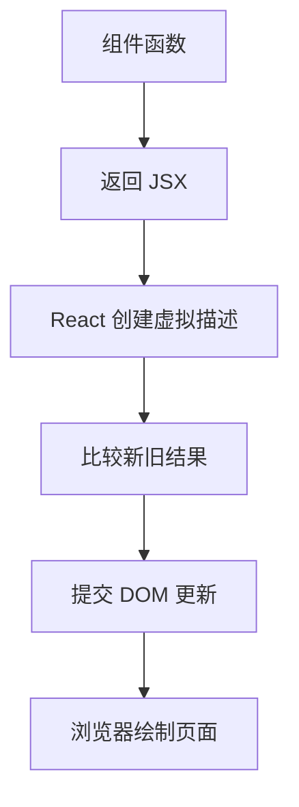
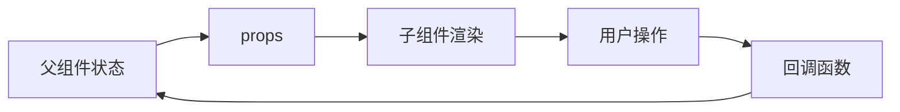
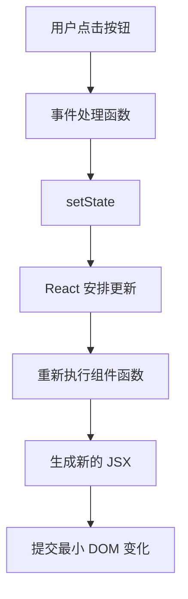
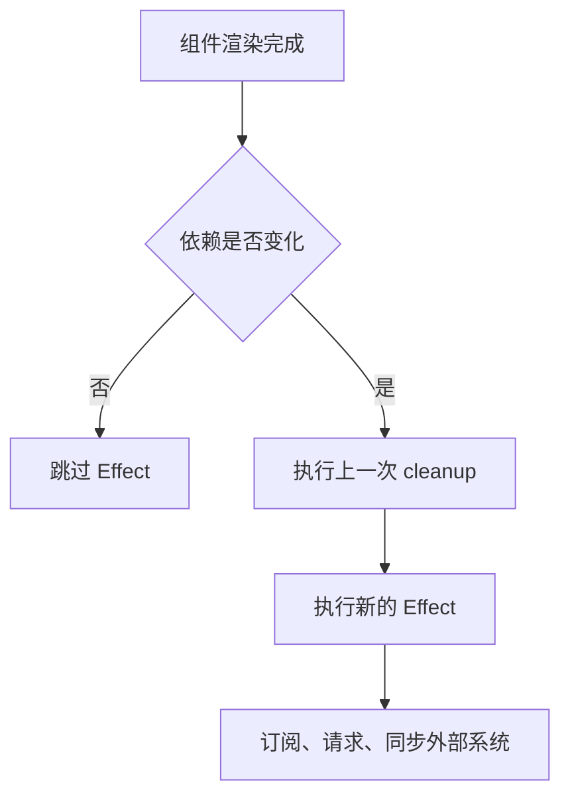
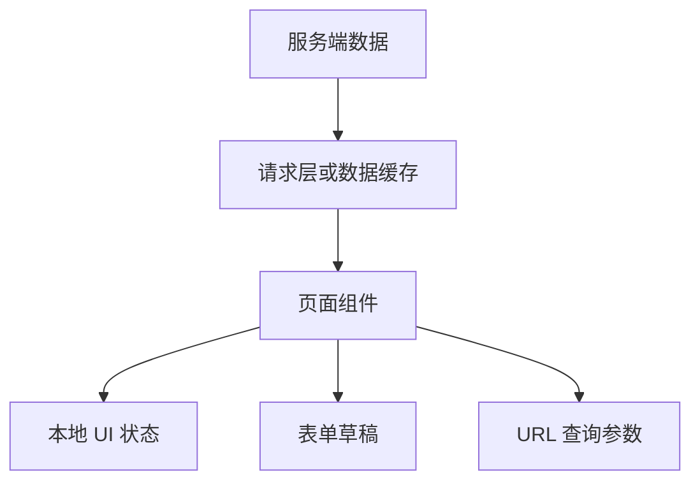
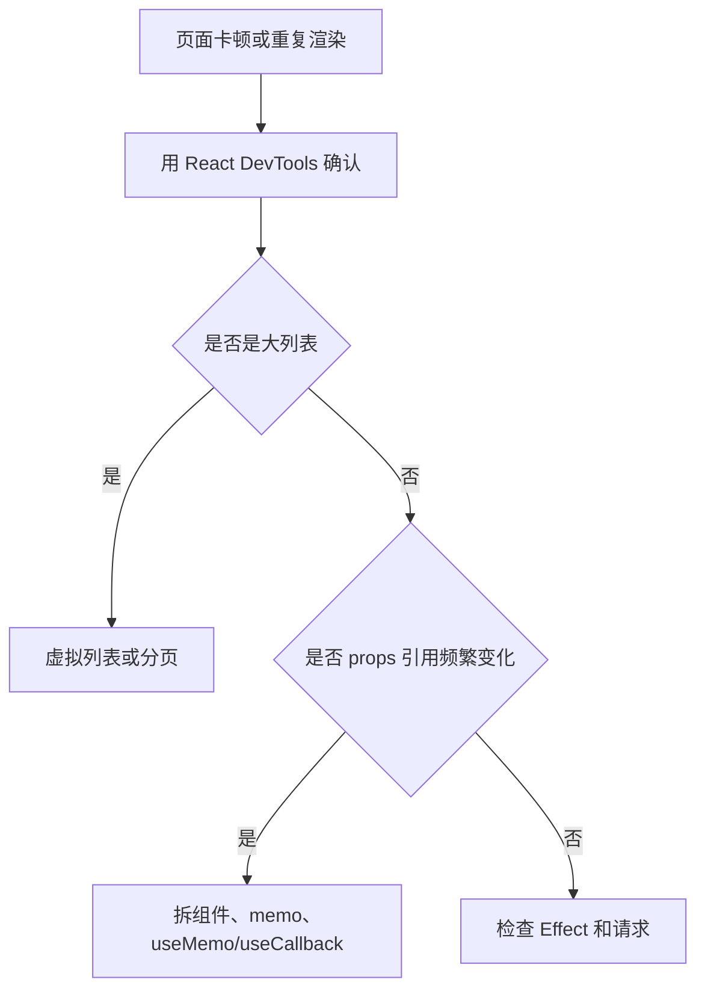
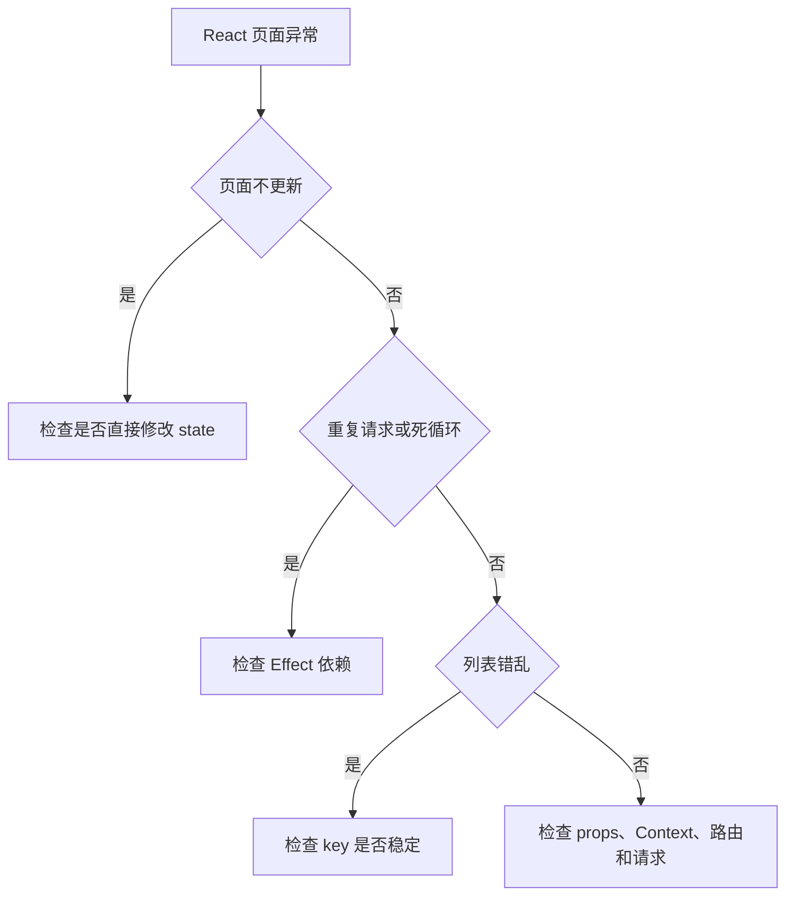

# 图解 React 核心概念

## 适合谁看

适合已经会 JavaScript，准备学习 React，或者已经写过 React 但对 JSX、组件渲染、状态更新、Effect 和性能边界还不够清楚的人。

React 学习的关键不是背 Hooks 名称，而是理解：组件如何描述 UI，状态如何触发重新渲染，副作用什么时候执行，数据应该放在哪一层。

## 你会学到什么

- React 页面从组件树到真实 DOM 的大致过程。
- JSX、props、state 的关系。
- 状态更新为什么不是直接改变量。
- Effect 为什么容易写出重复请求和无限循环。
- Context、局部状态、服务端数据应该如何分层。
- React 项目常见排错路径。

## React 渲染模型



组件函数不是模板文件。它会在需要重新渲染时再次执行，所以不要在组件函数顶层直接写有副作用的代码，例如请求接口、订阅事件、修改全局对象。

## props 和 state



| 概念 | 谁拥有 | 什么时候变化 |
| --- | --- | --- |
| props | 父组件传入 | 父组件重新渲染时 |
| state | 当前组件拥有 | 调用 setState 时 |
| derived value | 由 props/state 计算 | 渲染时重新计算 |
| ref | 组件实例持有 | 改变时不触发渲染 |

如果一个值能从 props 或 state 计算出来，通常不需要再放一份 state。

## 状态更新流程



不要直接修改状态对象。

不推荐：

```tsx
user.name = 'Ada'
setUser(user)
```

推荐：

```tsx
setUser((prev) => ({
  ...prev,
  name: 'Ada'
}))
```

React 需要新的引用来判断状态发生了变化。

## Effect 执行模型



`useEffect` 用来同步外部系统，不是用来计算普通数据。

适合放进 Effect：

- 请求数据。
- 订阅事件。
- 操作非 React 管理的对象。
- 同步 document title。

不适合放进 Effect：

- 根据 props/state 计算展示文本。
- 处理点击事件。
- 把一个 state 复制到另一个 state。

## 服务端数据和本地状态



项目中常见状态分类：

| 状态 | 示例 | 推荐位置 |
| --- | --- | --- |
| 服务端数据 | 用户列表、订单详情 | 请求层、数据缓存、页面状态 |
| UI 状态 | 弹窗打开、tab 当前项 | 当前组件 |
| 表单草稿 | 编辑用户表单 | 表单组件 |
| URL 状态 | 搜索关键词、分页 | 路由 query |
| 全局用户态 | 当前用户、权限码 | Context 或全局 store |

不要把所有状态都放到全局。离使用位置越近越容易维护。

## 性能优化判断



不要一上来就到处加 `memo`。先用 React DevTools 确认重渲染来源。

## React 排错路径



## 实际项目常见问题

### 问题 1：Effect 无限请求

常见原因是依赖数组里放了每次渲染都会新建的对象或函数。先判断这个请求是否真的应该放在 Effect 里，再考虑稳定依赖。

### 问题 2：列表状态错乱

不要用数组下标作为动态列表 key。新增、删除、排序后，组件状态可能对应到错误行。

### 问题 3：表单输入变卡

可能是父组件过大，每次输入都导致整页重新渲染。把表单拆成更小组件，或把昂贵计算移出输入链路。

## 下一步学习

继续学习 [快速开始](/react/quick-start)、[组件与 JSX](/react/component-jsx)、[Hooks 与状态](/react/hooks-state) 和 [Effect 与副作用](/react/effects)。
