# 图解 React 核心概念

## 适合谁看

适合已经掌握现代 JavaScript，准备系统理解 React 运行模型的人；也适合能写组件但无法解释重复 render、旧 state、Effect 循环、key 错乱和请求竞态的开发者。

## 这个页面解决什么

很多 React 问题表面上是 Hook 用错了，根因却是没有建立统一的运行模型：把组件函数当成只执行一次的初始化函数，把 state 当成可以立即改写的普通变量，把 Effect 当成“渲染后什么都能放”的入口。

本页先用图建立模型，再用最小代码验证。读完后你应该能解释：

- React 为什么会重新调用组件函数。
- render、commit 和浏览器 paint 分别发生什么。
- state 为什么像快照，连续更新为什么需要函数式写法。
- 组件状态为什么会因为位置或 `key` 被保留、移动或重置。
- 事件、派生计算和 Effect 应该怎样分工。
- 请求、表单、URL、Context 和服务端数据分别放在哪里。
- 页面重复请求、旧数据覆盖和大面积重渲染怎样沿证据链定位。

建议每看完一张图，就尝试不看正文复述箭头方向；说不清时不要急着记 API。

## 1. React 的最小心智模型

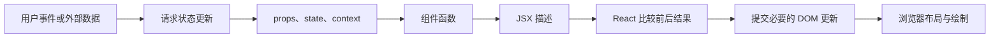
```mermaid
flowchart LR
  A["props、state、context"] --> B["组件函数"]
  B --> C["JSX 描述"]
  C --> D["React 比较前后结果"]
  D --> E["提交必要的 DOM 更新"]
  E --> F["浏览器布局与绘制"]
  G["用户事件或外部数据"] --> H["请求状态更新"]
  H --> A
```

组件的核心职责是：根据当前输入，返回当前界面应该是什么样。它不是持续运行的页面对象，也不应该在函数顶层发送请求或修改外部对象。

可以先记住一句话：

> render 负责计算，event 负责响应操作，Effect 负责和 React 外部系统同步。

## 2. 组件树不等于 DOM 树

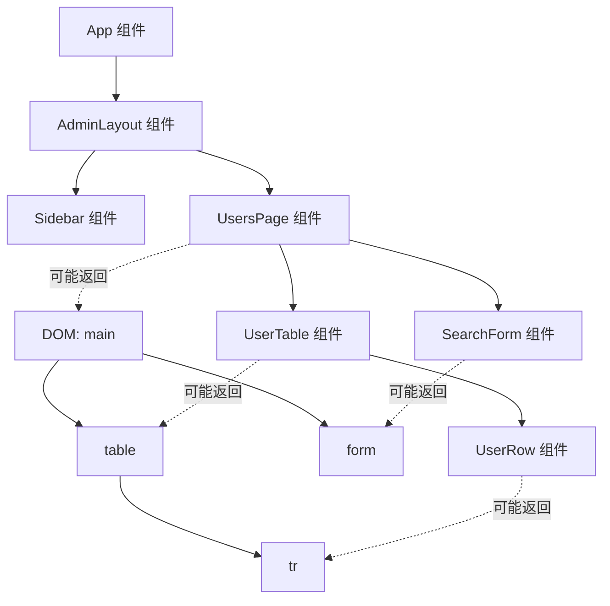
```mermaid
flowchart TD
  A["App 组件"] --> B["AdminLayout 组件"]
  B --> C["Sidebar 组件"]
  B --> D["UsersPage 组件"]
  D --> E["SearchForm 组件"]
  D --> F["UserTable 组件"]
  F --> G["UserRow 组件"]

  H["DOM: main"] --> I["form"]
  H --> J["table"]
  J --> K["tr"]

  D -. "可能返回" .-> H
  E -. "可能返回" .-> I
  F -. "可能返回" .-> J
  G -. "可能返回" .-> K
```

React 组件是业务和状态边界，DOM 元素是浏览器节点。一个组件可以：

- 返回多个 DOM 节点。
- 只返回另一个组件。
- 根据条件返回 `null`。
- 通过 Fragment 避免额外容器。

拆组件时不要按每个 `div` 拆。更有价值的拆分依据是：职责、变化频率、复用边界和测试边界。

## 3. 一次更新经过 trigger、render、commit、paint

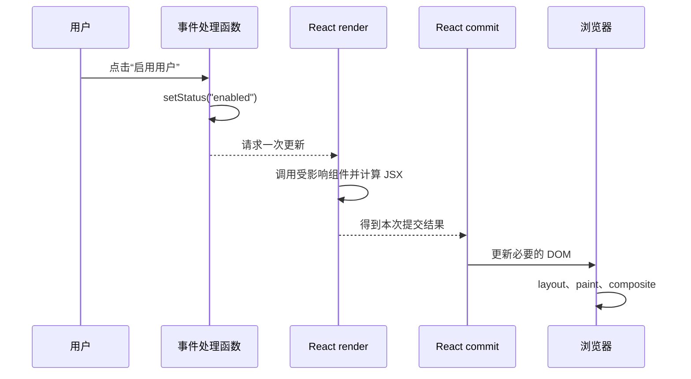
```mermaid
sequenceDiagram
  participant U as 用户
  participant E as 事件处理函数
  participant R as React render
  participant C as React commit
  participant B as 浏览器

  U->>E: 点击“启用用户”
  E->>E: setStatus("enabled")
  E-->>R: 请求一次更新
  R->>R: 调用受影响组件并计算 JSX
  R-->>C: 得到本次提交结果
  C->>B: 更新必要的 DOM
  B->>B: layout、paint、composite
```

| 阶段 | 主要工作 | 代码要求 |
| --- | --- | --- |
| trigger | 事件、路由、请求结果触发状态变化 | 明确是谁请求更新 |
| render | 调用组件，计算下一份 JSX | 必须保持纯净 |
| commit | 把必要变化应用到 DOM，更新 ref | 不由业务代码直接控制 |
| paint | 浏览器布局和绘制 | 用 Performance 面板观察 |

“组件执行了”不等于“DOM 一定变化了”。React 可能重新计算后发现输出没有需要提交的变化。

## 4. render 必须纯净，Strict Mode 是压力测试

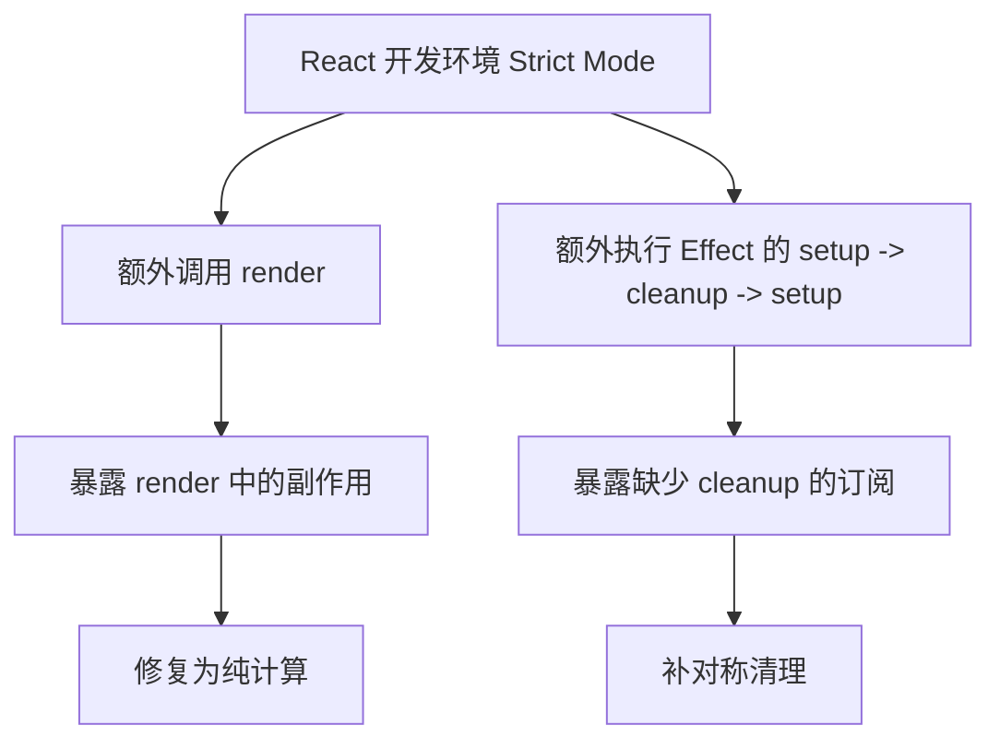
```mermaid
flowchart TD
  A["React 开发环境 Strict Mode"] --> B["额外调用 render"]
  A --> C["额外执行 Effect 的 setup -> cleanup -> setup"]
  B --> D["暴露 render 中的副作用"]
  C --> E["暴露缺少 cleanup 的订阅"]
  D --> F["修复为纯计算"]
  E --> G["补对称清理"]
```

错误写法：

```tsx
function UsersPage() {
  // 错：每次 render 都可能发送请求。
  fetch('/api/users')
  return <main>用户列表</main>
}
```

render 阶段适合做：

- 从 props 和 state 计算展示值。
- `map`、`filter`、条件判断。
- 构造本次 JSX。

render 阶段不适合做：

- 发请求、写本地存储。
- 注册事件监听或定时器。
- 修改传入对象。
- 调用会改变外部系统的函数。

开发环境看到额外渲染或 Effect 额外执行时，不要通过关闭 Strict Mode 遮盖问题。先确认逻辑能否安全地 setup、cleanup、再次 setup。

## 5. props 单向下传，事件意图向上传

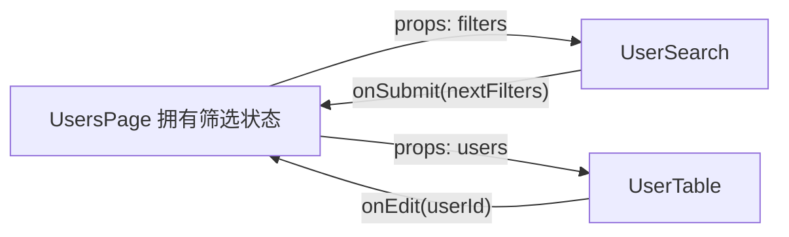
```mermaid
flowchart LR
  A["UsersPage 拥有筛选状态"] -->|"props: filters"| B["UserSearch"]
  B -->|"onSubmit(nextFilters)"| A
  A -->|"props: users"| C["UserTable"]
  C -->|"onEdit(userId)"| A
```

子组件不要改 props：

```tsx
type UserSearchProps = {
  initialKeyword: string
  onSubmit: (keyword: string) => void
}

function UserSearch({ initialKeyword, onSubmit }: UserSearchProps) {
  const [draft, setDraft] = useState(initialKeyword)

  return (
    <form onSubmit={(event) => {
      event.preventDefault()
      onSubmit(draft.trim())
    }}>
      <input value={draft} onChange={(event) => setDraft(event.target.value)} />
      <button type="submit">搜索</button>
    </form>
  )
}
```

props 传事实，回调传意图。`onEdit(user.id)` 比把父组件的内部 `setDialogState` 直接交给子组件更容易维护。

## 6. state 是一次 render 的快照

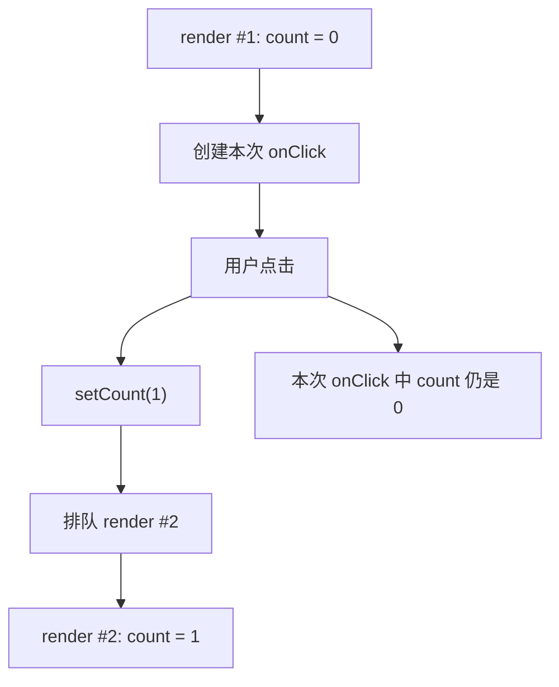
```mermaid
flowchart TD
  A["render #1: count = 0"] --> B["创建本次 onClick"]
  B --> C["用户点击"]
  C --> D["setCount(1)"]
  D --> E["排队 render #2"]
  C --> F["本次 onClick 中 count 仍是 0"]
  E --> G["render #2: count = 1"]
```

```tsx
function Counter() {
  const [count, setCount] = useState(0)

  function handleClick() {
    setCount(count + 1)
    console.log(count) // 仍是本次 render 的快照
  }

  return <button onClick={handleClick}>{count}</button>
}
```

`setCount` 请求下一次 render 使用新值，不会回头改写当前事件处理函数已经捕获的值。异步回调也会记住创建它的那次快照，这就是很多 stale closure 问题的来源。

## 7. 批处理与函数式更新

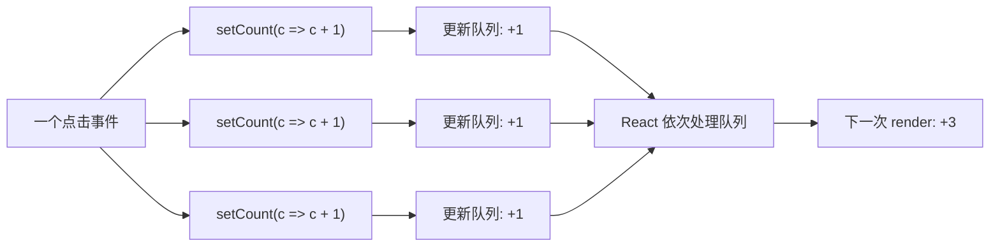
```mermaid
flowchart LR
  A["一个点击事件"] --> B["setCount(c => c + 1)"]
  B --> C["更新队列: +1"]
  A --> D["setCount(c => c + 1)"]
  D --> E["更新队列: +1"]
  A --> F["setCount(c => c + 1)"]
  F --> G["更新队列: +1"]
  C --> H["React 依次处理队列"]
  E --> H
  G --> H
  H --> I["下一次 render: +3"]
```

```tsx
setCount((current) => current + 1)
setCount((current) => current + 1)
setCount((current) => current + 1)
```

依赖上一次状态时用函数式更新。对象和数组也要返回新值：

```tsx
setUsers((current) =>
  current.map((user) =>
    user.id === targetId ? { ...user, enabled: true } : user
  )
)
```

直接执行 `user.enabled = true` 会破坏不可变数据假设，也可能让 React 和 memo 化逻辑无法识别变化。

## 8. state 绑定组件在树中的身份

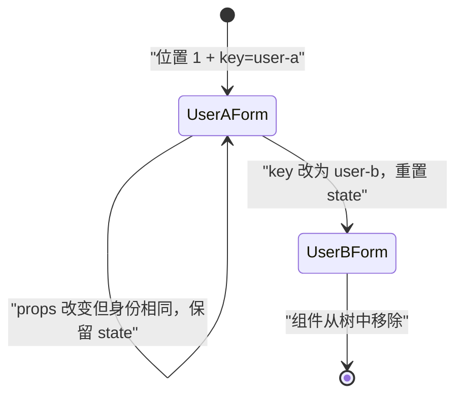
```mermaid
stateDiagram-v2
  [*] --> UserAForm: "位置 1 + key=user-a"
  UserAForm --> UserAForm: "props 改变但身份相同，保留 state"
  UserAForm --> UserBForm: "key 改为 user-b，重置 state"
  UserBForm --> [*]: "组件从树中移除"
```

React 不是把 state 存在 JSX 标签里，而是把 state 与组件在渲染树中的位置和身份关联。

```tsx
<UserForm key={editingUserId ?? 'create'} userId={editingUserId} />
```

适合用 `key` 明确重置的场景：

- 从编辑用户 A 切到用户 B。
- 切换聊天对象，希望草稿不串人。
- 创建表单和编辑表单共享组件，但必须独立初始化。

动态列表不要用 index 作为 key。插入、删除或排序后，相同位置可能对应另一条业务数据，输入状态会跟错行。

## 9. 事件、派生值和 Effect 的决策图

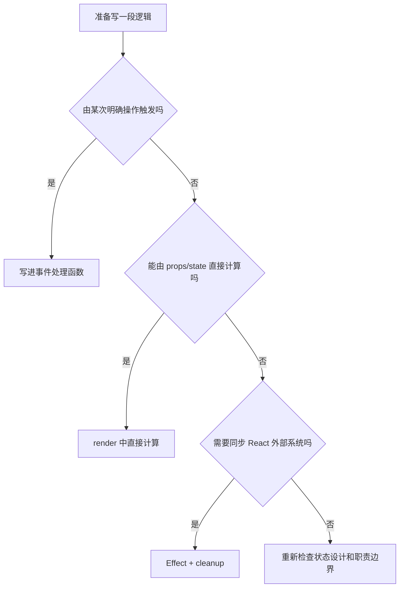
```mermaid
flowchart TD
  A["准备写一段逻辑"] --> B{"由某次明确操作触发吗"}
  B -- "是" --> C["写进事件处理函数"]
  B -- "否" --> D{"能由 props/state 直接计算吗"}
  D -- "是" --> E["render 中直接计算"]
  D -- "否" --> F{"需要同步 React 外部系统吗"}
  F -- "是" --> G["Effect + cleanup"]
  F -- "否" --> H["重新检查状态设计和职责边界"]
```

| 需求 | 推荐位置 | 原因 |
| --- | --- | --- |
| 点击保存后 POST | 事件处理函数 | 由特定操作触发 |
| `fullName = first + last` | render 派生 | 没有外部系统 |
| 根据筛选条件得到可见数组 | render，昂贵时再 memo | 避免重复 state |
| 订阅 WebSocket 房间 | Effect | 与外部连接同步 |
| 同步 `document.title` | Effect | 修改浏览器 API |
| 用户切换时重置整张表单 | `key` 或事件 | 不必用 Effect 复制 state |

## 10. Effect 是独立的同步过程

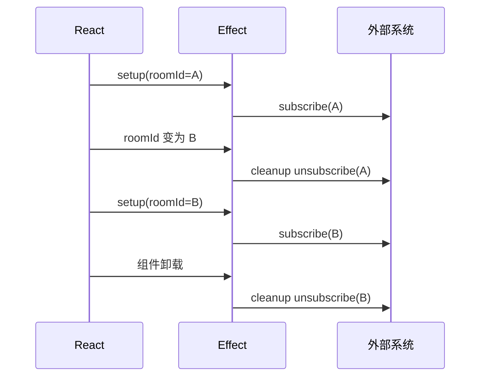
```mermaid
sequenceDiagram
  participant R as React
  participant E as Effect
  participant S as 外部系统

  R->>E: setup(roomId=A)
  E->>S: subscribe(A)
  R->>E: roomId 变为 B
  E->>S: cleanup unsubscribe(A)
  R->>E: setup(roomId=B)
  E->>S: subscribe(B)
  R->>E: 组件卸载
  E->>S: cleanup unsubscribe(B)
```

```tsx
useEffect(() => {
  const connection = createConnection(roomId)
  connection.connect()

  return () => connection.disconnect()
}, [roomId])
```

依赖不是手工挑选的“执行时机开关”。Effect 读取的响应式值决定依赖；如果依赖太多，应先重构逻辑，而不是删除依赖规避 lint。

Effect 的 setup 和 cleanup 应该对称：

| setup | cleanup |
| --- | --- |
| `addEventListener` | `removeEventListener` |
| `setInterval` | `clearInterval` |
| `subscribe` | `unsubscribe` |
| 发起可取消请求 | `AbortController.abort()` |
| 创建第三方实例 | destroy/dispose |

## 11. 状态先分类，再决定放哪里

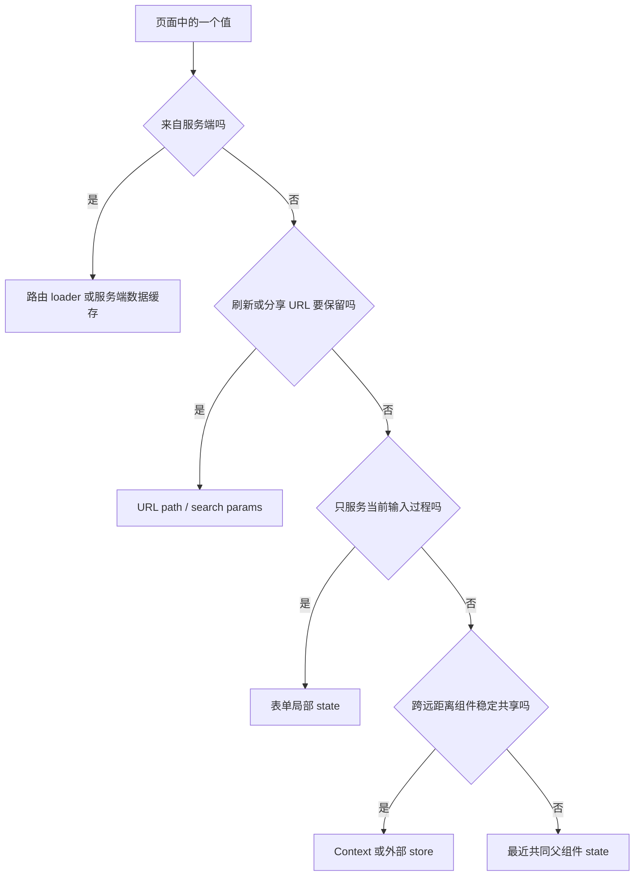
```mermaid
flowchart TD
  A["页面中的一个值"] --> B{"来自服务端吗"}
  B -- "是" --> C["路由 loader 或服务端数据缓存"]
  B -- "否" --> D{"刷新或分享 URL 要保留吗"}
  D -- "是" --> E["URL path / search params"]
  D -- "否" --> F{"只服务当前输入过程吗"}
  F -- "是" --> G["表单局部 state"]
  F -- "否" --> H{"跨远距离组件稳定共享吗"}
  H -- "是" --> I["Context 或外部 store"]
  H -- "否" --> J["最近共同父组件 state"]
```

React 管理台常见状态表：

| 状态 | 示例 | 推荐位置 |
| --- | --- | --- |
| 服务端数据 | 用户列表、详情 | route loader、请求缓存 |
| URL 状态 | 关键词、分页、排序 | search params |
| 表单草稿 | 新增用户字段 | 表单组件 |
| 短暂 UI | 弹窗开关、展开行 | 最近组件 |
| 会话 | 当前用户、权限 | 根路由数据或 Auth Context |
| 派生值 | 已选择数量、过滤结果 | render 中计算 |
| 非渲染值 | timer id、DOM 引用 | ref |

避免同一事实保留两份可写 state。例如 `users` 和 `filteredUsers` 同时可写，迟早会失去同步。

## 12. Reducer 管状态变化，Context 管传递范围

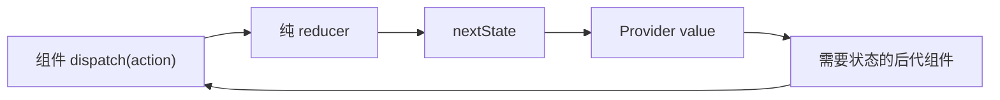
```mermaid
flowchart LR
  A["组件 dispatch(action)"] --> B["纯 reducer"]
  B --> C["nextState"]
  C --> D["Provider value"]
  D --> E["需要状态的后代组件"]
  E --> A
```

Reducer 适合：

- 多个字段经常一起变化。
- 状态转换有明确动作名称。
- 希望单独测试转换逻辑。

```tsx
type Action =
  | { type: 'loaded'; users: User[] }
  | { type: 'disabled'; userId: string }
  | { type: 'failed'; message: string }

function usersReducer(state: State, action: Action): State {
  switch (action.type) {
    case 'loaded':
      return { ...state, users: action.users, error: null }
    case 'disabled':
      return {
        ...state,
        users: state.users.map((user) =>
          user.id === action.userId ? { ...user, enabled: false } : user
        )
      }
    case 'failed':
      return { ...state, error: action.message }
  }
}
```

Context 解决“怎样传下去”，不会自动解决状态建模、缓存、请求去重或性能。高频变化数据放进一个巨大 Context，所有消费者都可能频繁更新；优先拆分职责或让状态靠近使用位置。

## 13. ref 保存不参与渲染的值

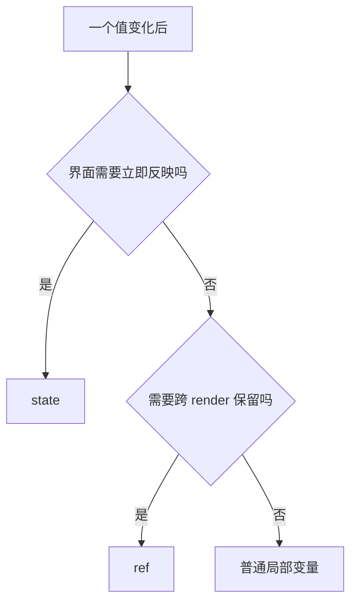
```mermaid
flowchart TD
  A["一个值变化后"] --> B{"界面需要立即反映吗"}
  B -- "是" --> C["state"]
  B -- "否" --> D{"需要跨 render 保留吗"}
  D -- "是" --> E["ref"]
  D -- "否" --> F["普通局部变量"]
```

常见 ref：

```tsx
const inputRef = useRef<HTMLInputElement>(null)
const requestIdRef = useRef(0)
const timerRef = useRef<number | null>(null)
```

修改 `ref.current` 不会触发 render。不要把页面应该显示的数据藏进 ref，否则界面不会自动更新。

操作 DOM 时也应保持边界清楚：聚焦、测量、滚动、第三方组件接入可以使用 ref；普通内容变化继续交给 state 和 JSX。

## 14. 路由不只是切组件，也是数据边界

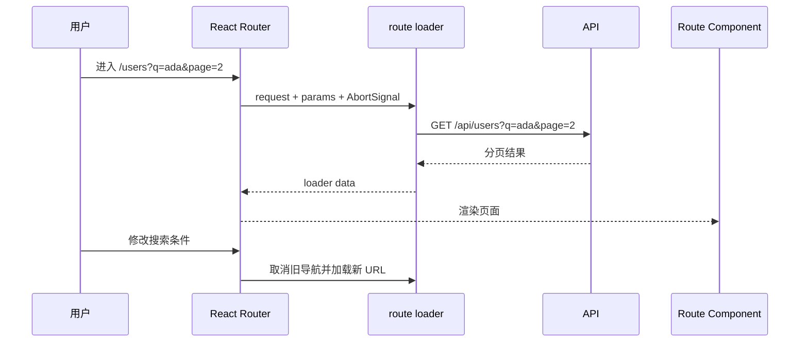
```mermaid
sequenceDiagram
  participant U as 用户
  participant RR as React Router
  participant L as route loader
  participant API as API
  participant P as Route Component

  U->>RR: 进入 /users?q=ada&page=2
  RR->>L: request + params + AbortSignal
  L->>API: GET /api/users?q=ada&page=2
  API-->>L: 分页结果
  L-->>RR: loader data
  RR-->>P: 渲染页面
  U->>RR: 修改搜索条件
  RR->>L: 取消旧导航并加载新 URL
```

把关键筛选条件放在 URL，把路由数据放进 loader，可以获得：

- 刷新和分享后状态可恢复。
- 导航生命周期与请求取消关联。
- 路由错误边界能处理加载失败。
- 页面组件减少“挂载后再请求”的 Effect。

React Router 有 Declarative、Data 和 Framework 等使用方式。本文项目使用 Data Mode，目的是演示客户端 Vite 项目中的 route object、loader、action 和 error boundary；不要把不同模式的 API 随意混在同一段示例里。

## 15. 异步请求必须处理竞态

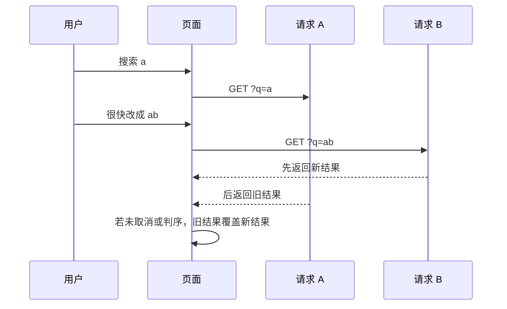
```mermaid
sequenceDiagram
  participant U as 用户
  participant P as 页面
  participant A as 请求 A
  participant B as 请求 B

  U->>P: 搜索 a
  P->>A: GET ?q=a
  U->>P: 很快改成 ab
  P->>B: GET ?q=ab
  B-->>P: 先返回新结果
  A-->>P: 后返回旧结果
  P->>P: 若未取消或判序，旧结果覆盖新结果
```

原生请求可以使用 `AbortController`：

```tsx
useEffect(() => {
  const controller = new AbortController()

  loadUsers(query, { signal: controller.signal })
    .then(setUsers)
    .catch((error) => {
      if (error.name !== 'AbortError') setError(error)
    })

  return () => controller.abort()
}, [query])
```

如果使用 route loader，优先把 `request.signal` 传给 `fetch`。如果使用 TanStack Query、SWR 等请求库，则使用它们的 query key、取消、缓存和失效机制，不要再手写一套相互竞争的缓存状态。

## 16. 页面不是“有数据”和“没数据”两种状态

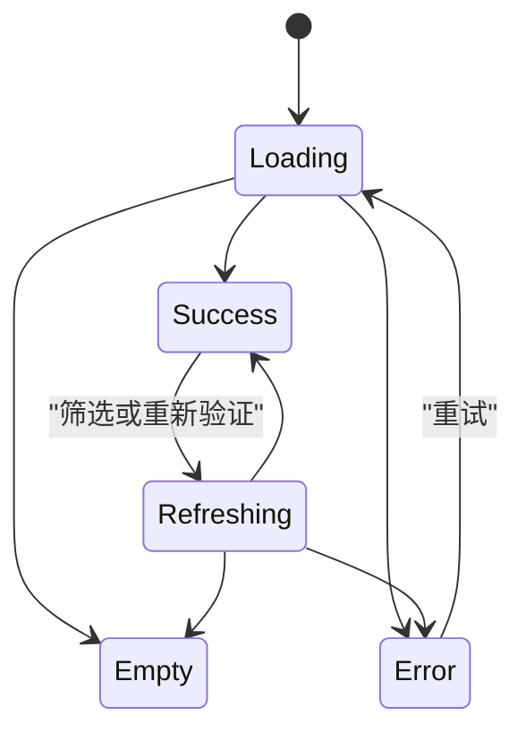
```mermaid
stateDiagram-v2
  [*] --> Loading
  Loading --> Success
  Loading --> Empty
  Loading --> Error
  Success --> Refreshing: "筛选或重新验证"
  Refreshing --> Success
  Refreshing --> Empty
  Refreshing --> Error
  Error --> Loading: "重试"
```

至少设计这些状态：

| 状态 | 页面表现 |
| --- | --- |
| 初次加载 | 骨架或明确加载文本，不展示误导性空态 |
| 成功有数据 | 主内容和可执行操作 |
| 成功无数据 | 说明筛选无结果或系统暂无数据，并给下一步 |
| 重新加载 | 保留旧内容时给非阻塞反馈 |
| 权限不足 | 解释不能访问，不伪装成 404 或空列表 |
| 网络/服务错误 | 可理解错误、request id、重试入口 |

Error Boundary 可以捕获渲染、生命周期和部分路由渲染错误，但不能替你处理所有事件处理函数、异步回调和服务端业务错误。错误边界与请求错误状态各有职责。

## 17. 性能优化从证据开始

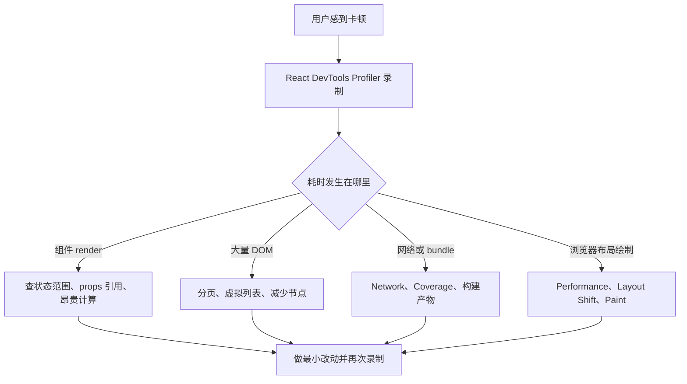
```mermaid
flowchart TD
  A["用户感到卡顿"] --> B["React DevTools Profiler 录制"]
  B --> C{"耗时发生在哪里"}
  C -- "组件 render" --> D["查状态范围、props 引用、昂贵计算"]
  C -- "大量 DOM" --> E["分页、虚拟列表、减少节点"]
  C -- "网络或 bundle" --> F["Network、Coverage、构建产物"]
  C -- "浏览器布局绘制" --> G["Performance、Layout Shift、Paint"]
  D --> H["做最小改动并再次录制"]
  E --> H
  F --> H
  G --> H
```

`memo`、`useMemo`、`useCallback` 不是默认装饰：

- `memo` 只有在父组件常更新、子组件渲染昂贵且 props 可保持稳定时才可能有收益。
- `useMemo` 用于缓存昂贵计算结果，不用于修复错误状态设计。
- `useCallback` 能稳定函数引用，但它本身也有维护成本。
- 大列表的主要问题往往是 DOM 数量，单纯 memo 不能替代分页或虚拟化。

先记录基线，再修改，再用相同操作复测。

## 18. React 问题的统一排查图

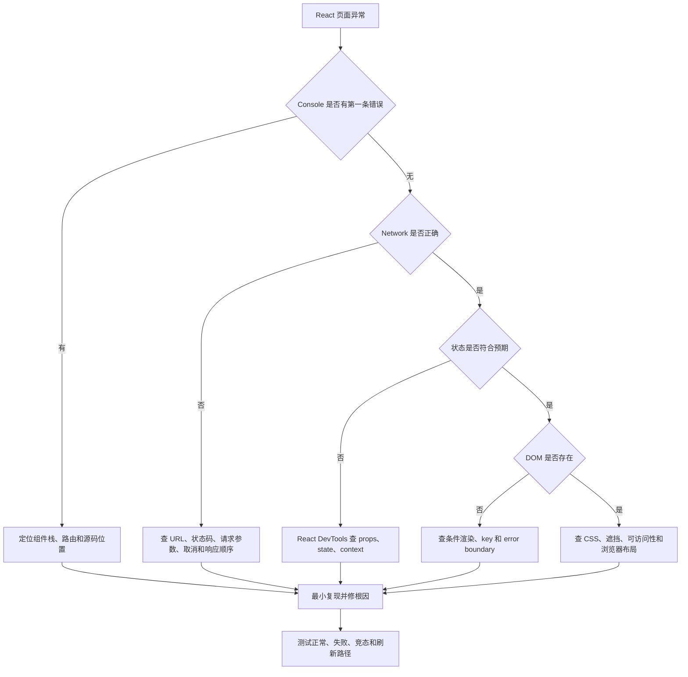
```mermaid
flowchart TD
  A["React 页面异常"] --> B{"Console 是否有第一条错误"}
  B -- "有" --> C["定位组件栈、路由和源码位置"]
  B -- "无" --> D{"Network 是否正确"}
  D -- "否" --> E["查 URL、状态码、请求参数、取消和响应顺序"]
  D -- "是" --> F{"状态是否符合预期"}
  F -- "否" --> G["React DevTools 查 props、state、context"]
  F -- "是" --> H{"DOM 是否存在"}
  H -- "否" --> I["查条件渲染、key 和 error boundary"]
  H -- "是" --> J["查 CSS、遮挡、可访问性和浏览器布局"]
  G --> K["最小复现并修根因"]
  C --> K
  E --> K
  I --> K
  J --> K
  K --> L["测试正常、失败、竞态和刷新路径"]
```

固定证据清单：

```text
复现 URL、账号、视口和操作步骤
Console 第一条错误与组件栈
Network 的请求参数、状态码、响应顺序和 request id
React DevTools 中关键组件的 props/state/context
Profiler 中 commit 时长和更新来源
Elements 中真实 DOM、key 相关列表和最终样式
开发环境 Strict Mode 与生产预览是否表现一致
刷新深层 URL、后退前进、快速重复操作的结果
```

## 一张图串起 React 项目

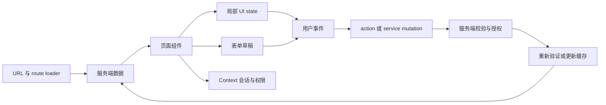
```mermaid
flowchart LR
  A["URL 与 route loader"] --> B["服务端数据"]
  B --> C["页面组件"]
  C --> D["局部 UI state"]
  C --> E["表单草稿"]
  C --> F["Context 会话与权限"]
  D --> G["用户事件"]
  E --> G
  G --> H["action 或 service mutation"]
  H --> I["服务端校验与授权"]
  I --> J["重新验证或更新缓存"]
  J --> B
```

这条链路里，React 负责 UI 和交互模型；路由负责 URL 与页面数据边界；服务端负责可信校验、权限和持久化。把边界放对，比多记几个 Hook 更重要。

## 最小自测

不看正文回答：

1. render、commit、paint 有什么区别？
2. 为什么 `setState` 后当前函数里仍读到旧值？
3. 什么时候应该用函数式更新？
4. 为什么改变 `key` 会重置组件状态？
5. 事件、派生值和 Effect 怎样区分？
6. Effect 的 cleanup 什么时候执行？
7. 服务端数据、URL 状态、表单草稿和 ref 各放哪里？
8. Context 为什么不等于完整状态管理方案？
9. 旧请求覆盖新请求有哪些解决方法？
10. 页面卡顿时为什么不能先到处加 `memo`？

如果有三题说不清，回到对应图并用项目里的一个真实页面重新画一遍。

## 参考资料

- [React：Render and Commit](https://react.dev/learn/render-and-commit)
- [React：State as a Snapshot](https://react.dev/learn/state-as-a-snapshot)
- [React：Queueing a Series of State Updates](https://react.dev/learn/queueing-a-series-of-state-updates)
- [React：Preserving and Resetting State](https://react.dev/learn/preserving-and-resetting-state)
- [React：Synchronizing with Effects](https://react.dev/learn/synchronizing-with-effects)
- [React：You Might Not Need an Effect](https://react.dev/learn/you-might-not-need-an-effect)
- [React：StrictMode](https://react.dev/reference/react/StrictMode)
- [React Router：Data Mode Routing](https://reactrouter.com/start/data/routing)
- [React Router：Data Loading](https://reactrouter.com/start/data/data-loading)

## 下一步学习

继续学习 [组件与 JSX](/react/component-jsx)、[Hooks 与状态](/react/hooks-state) 和 [Effect 与副作用](/react/effects)。准备把整条链路做成作品时，进入 [React 管理台从零到项目](/react/project-admin)；遇到线上问题时查 [React 真实项目问题库](/projects/issues-react)。
