# 前端综合实战练习

## 这个页面解决什么

你已经看过 CSS、JavaScript、TypeScript、Vue、浏览器、工程化和问题库之后，最容易出现一个新问题：每一块单独看都懂，但真正做项目时还是不知道怎么把它们串成一个可交付结果。

这篇不是新的知识点，而是一个综合练习。它要求你做一个“小型 Vue Admin 工作台”，用一个项目把下面能力串起来：

- CSS 样式系统和响应式。
- JavaScript 数据处理和异步排障。
- TypeScript 类型边界。
- Vue 组件、路由、Pinia、请求、表单和权限。
- 浏览器请求、跨域、缓存、存储和调试。
- 前端工程化、测试、构建、预览、CI 和发布检查。
- 真实项目问题复盘。

完成这个练习后，你不只是“读完文档”，而是应该拥有一个能运行、能解释、能排错、能构建、能交付的前端项目。

## 适合谁看

适合已经完成部分基础练习，但想做一个综合项目的人：

- 已经能写 Vue 页面。
- 已经看过 [学习路径练习包](/roadmap/practice-labs) 的基础练习。
- 想把 CSS、浏览器、工程化和 Vue Admin 串起来。
- 想用一个项目检验自己是否真的能进入真实团队开发。
- 想准备一个可展示、可复盘、可持续扩展的作品。

如果你还没有做过任何练习，先从 [学习路径练习包](/roadmap/practice-labs) 的前 3 个练习开始。

## 最终项目

项目名称建议叫 `vue-admin-capstone`。它不是完整企业后台，但要覆盖真实后台项目的核心链路。

```text
vue-admin-capstone/
  README.md
  LEARNING_NOTES.md
  BROWSER_DEBUG_NOTES.md
  ENGINEERING_NOTES.md
  RELEASE_CHECKLIST.md
  TROUBLESHOOTING.md
  src/
    app/
    config/
    features/
      users/
      roles/
      dashboard/
    shared/
      request/
      components/
      utils/
    styles/
  tests/
```

最终至少包含：

| 模块 | 必须完成 |
| --- | --- |
| 登录 | token 或 Cookie 登录态、退出清理、刷新恢复 |
| 布局 | 顶部栏、侧边导航、移动端导航策略 |
| 用户管理 | 搜索、分页、表格、新增、编辑、删除、启停 |
| 角色权限 | 角色列表、权限码、按钮权限、403 页面 |
| 数据看板 | 指标卡片、图表占位、加载态、空态、错误态 |
| 请求 | request 封装、错误分类、traceId、旧请求覆盖处理 |
| 类型 | DTO、ViewModel、FormState、Payload 分层 |
| 样式 | token、layout、components、响应式和暗色变量 |
| 浏览器调试 | Network、Application、缓存、登录态证据记录 |
| 工程化 | lint、type-check、test、build、preview、发布清单 |
| 问题复盘 | 至少 8 条真实或模拟问题记录 |

如果练习过程中不知道问题该归到哪一类，先进入 [前端项目排障图谱](/projects/frontend-debugging-map)，再根据现象分流到 Vue、请求权限、CSS、TypeScript、JavaScript、工程化或部署问题库。

## 综合能力地图

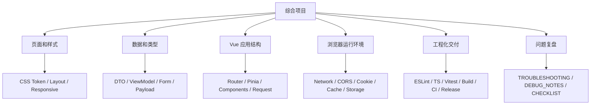

这个项目的目标不是堆功能，而是证明你能把每条链路做清楚，并且能在出错时定位。

## 推荐周期

建议用 20 天完成。每天都要有可检查产出，不要只看文档。

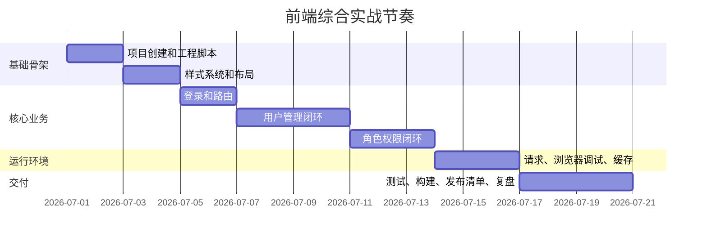

如果你不想按日期推进，也可以按阶段推进。每阶段必须先验收，再进入下一阶段。

## 阶段 1：项目骨架和工程化底座

### 目标

先得到一个可启动、可检查、可构建的项目骨架。

### 准备文档

- [前端工程化从零到项目落地](/engineering/project-from-zero)
- [Vite 工程基础](/engineering/vite)
- [代码规范](/engineering/eslint-prettier)
- [环境配置](/engineering/env-config)
- [前端工程化真实项目问题库](/projects/issues-engineering)

### 任务

1. 创建 Vite + Vue + TypeScript 项目。
2. 增加 `src/app`、`src/config`、`src/features`、`src/shared`、`src/styles`。
3. 增加 `README.md`，写清技术栈、启动命令、目录结构。
4. 配置环境变量和 `appConfig.ts`。
5. 配置 `lint`、`type-check`、`test`、`build`、`preview` 脚本。
6. 创建 `ENGINEERING_NOTES.md`，记录工程决策。

### 骨架图

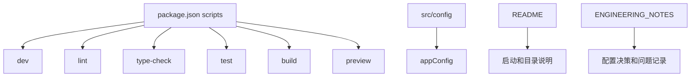

### 验收标准

- `npm run dev` 能启动。
- `npm run build` 能通过。
- README 能让另一个人启动项目。
- 环境变量有 `.env.example`。
- 项目目录能说明职责。

### 常见问题

| 问题 | 处理 |
| --- | --- |
| env 改了不生效 | 重启 dev server，检查 `VITE_` 前缀 |
| build 失败但 dev 正常 | 跑 type-check，检查动态导入和大小写路径 |
| CI 或本地安装失败 | 查 [前端工程化真实项目问题库](/projects/issues-engineering) |

## 阶段 2：样式系统和响应式布局

### 目标

建立稳定的页面骨架，让项目从一开始就具备响应式和组件库边界意识。

### 准备文档

- [CSS 从零到项目落地](/css/project-from-zero)
- [项目样式架构](/css/architecture)
- [设计 Token 与主题](/css/design-tokens)
- [CSS 真实项目问题库](/projects/issues-css)

### 任务

1. 建立 `tokens.css`、`base.css`、`layout.css`、`components.css`。
2. 做后台布局：`AppLayout`、顶部栏、侧边栏、内容区。
3. 做移动端导航策略：抽屉、顶部菜单或紧凑导航。
4. 做基础组件：状态点、空态、错误态、加载态。
5. 做 `STYLE_GUIDE.md`，写清 token、选择器规则和禁止写法。

### 响应式布局图

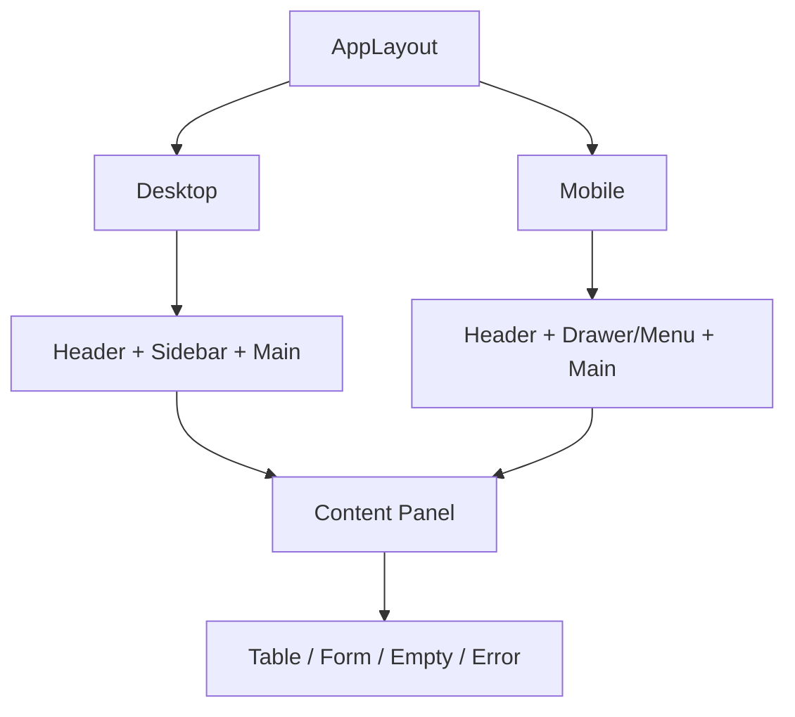

### 验收标准

- 390px、768px、1440px 下无整体横向滚动。
- 图标按钮、头像、状态点不会被挤压变形。
- 不使用 `.page div`、`.content *` 这类污染性选择器。
- 暗色变量或主题变量切换后文字仍可读。

## 阶段 3：登录、路由和应用状态

### 目标

完成后台应用最基本的访问控制链路。

### 准备文档

- [Vue Router](/vue/router)
- [Pinia 状态管理](/vue/pinia)
- [Vue Admin 权限路由闭环实战](/vue/admin-permission-route-flow)
- [Vue 真实项目问题库](/projects/issues-vue)

### 任务

1. 创建登录页。
2. 创建基础路由表。
3. 创建 `authStore` 和 `permissionStore`。
4. 登录后获取用户信息和权限码。
5. 刷新页面后恢复登录态。
6. 无权限进入 403 页面。
7. 退出登录清理 token、用户信息、权限和缓存。

### 登录恢复图

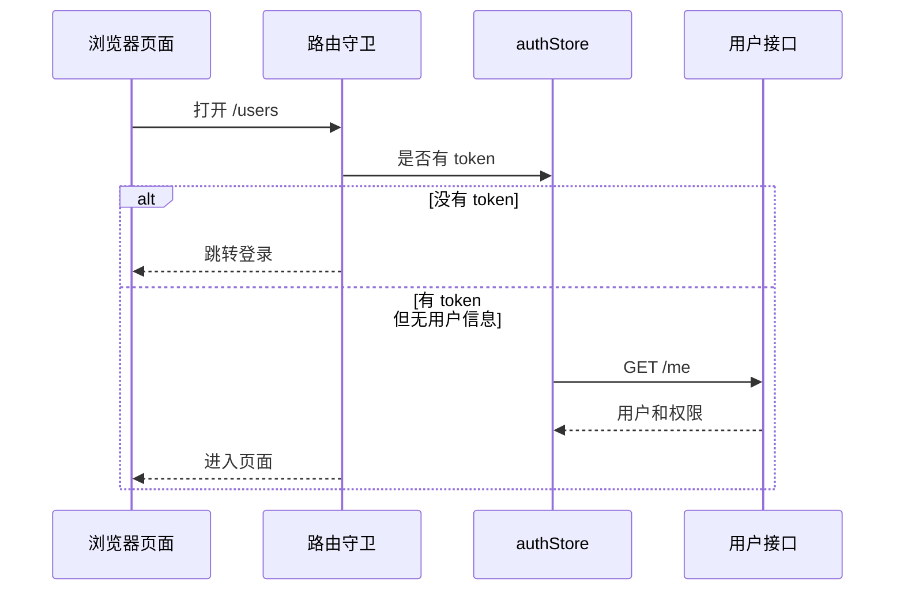

### 验收标准

- 深层路由刷新后能恢复用户信息。
- 退出登录后不能访问旧页面。
- 切换账号后旧权限不残留。
- 403 和未登录跳转能区分。

## 阶段 4：用户管理 CRUD 闭环

### 目标

完成最典型的后台业务页面：列表、搜索、分页、表单、新增、编辑、删除、启停。

### 准备文档

- [Vue 从零到项目落地](/vue/project-from-zero)
- [Vue Admin 列表搜索表格闭环实战](/vue/admin-list-search-table)
- [Vue Admin 表单弹窗、新增编辑与校验闭环实战](/vue/admin-form-modal-crud)
- [TypeScript 类型边界从零到项目](/typescript/type-boundary-project)

### 任务

1. 定义 `UserDTO`、`UserListItem`、`UserFormState`、`SaveUserPayload`。
2. 创建 `userService`。
3. 创建 `useUserList` 管理查询、分页、loading、error。
4. 拆分 `UserSearchForm`、`UserTable`、`UserFormDialog`。
5. 新增和编辑表单做不同初始化。
6. 删除最后一页最后一条后页码回退。
7. 处理 422 字段错误回填。

### 数据流图

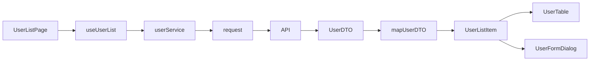

### 验收标准

- 页面组件不直接拼接口地址。
- 表格行对象不会被编辑表单直接污染。
- 搜索后页码回到第一页。
- 旧请求不会覆盖新搜索结果。
- loading、empty、error 状态完整。

## 阶段 5：角色权限和按钮权限

### 目标

把权限从“隐藏按钮”升级成完整链路：菜单、路由、按钮、接口、数据范围。

### 准备文档

- [Vue Admin 角色权限模块实现手册](/vue/admin-permission-module)
- [Vue Admin 菜单与动态路由实现手册](/vue/admin-menu-route-module)
- [Vue Admin 请求、权限与数据问题排查专题](/projects/issues-vue-admin-request)

### 任务

1. 创建角色列表。
2. 创建权限码常量。
3. 创建 `hasPermission` 工具函数。
4. 在用户管理按钮上接入权限码。
5. 模拟接口返回 403。
6. 写清前端权限和后端权限的边界。

### 权限链路图

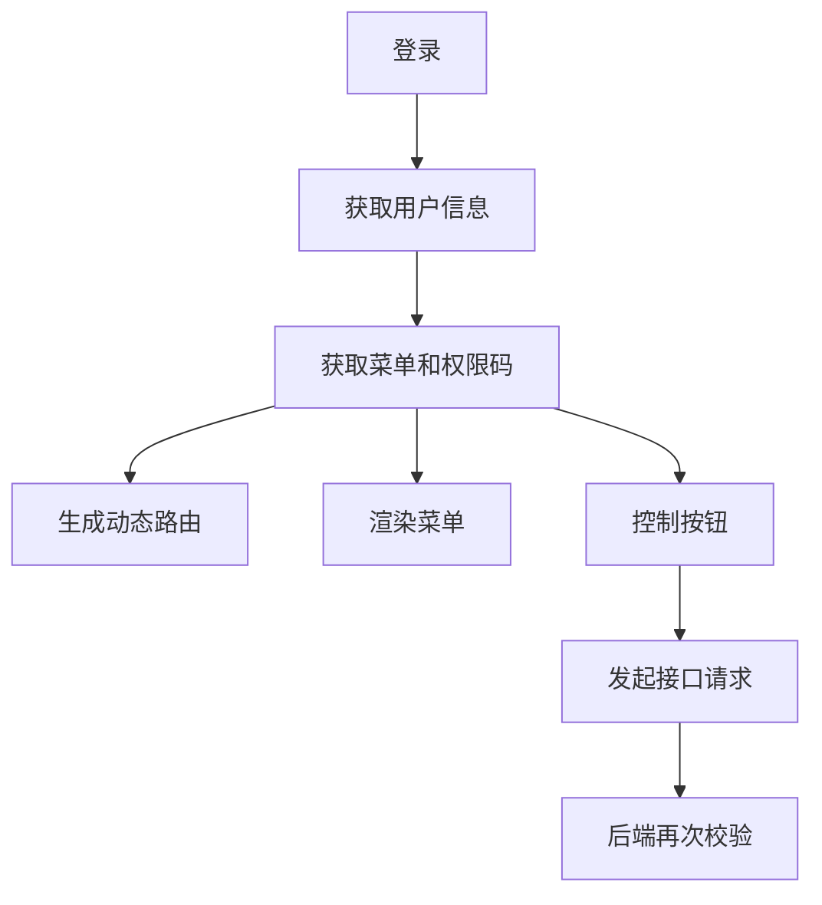

### 验收标准

- 前端隐藏按钮不作为唯一安全措施。
- 后端 403 有明确提示。
- 退出或切换账号会清空权限。
- 权限码集中管理，不散落字符串。

## 阶段 6：浏览器调试和缓存验证

### 目标

把浏览器 DevTools 变成项目排障工具，而不是只看 Console。

### 准备文档

- [浏览器与网络从零到项目落地](/browser/project-from-zero)
- [HTTP 与请求流程](/browser/http-request)
- [跨域与登录态](/browser/cors-auth)
- [缓存策略](/browser/cache)
- [浏览器存储](/browser/storage)

### 任务

1. 写 `BROWSER_DEBUG_NOTES.md`。
2. 记录一次登录请求的 Network 证据。
3. 记录一次 401 或 403 的请求和响应。
4. 模拟接口缓存或旧数据问题。
5. 检查 Cookie、LocalStorage、SessionStorage。
6. 模拟 localStorage 脏 JSON，并做安全读取。
7. 记录一次页面性能或长任务证据。

### 调试证据图

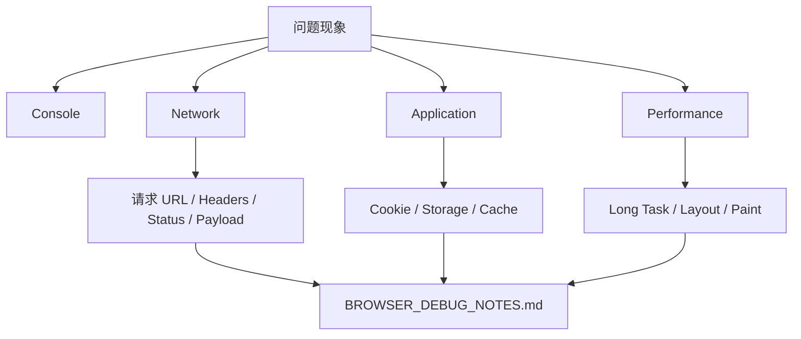

### 验收标准

- 能解释 Postman 能通但浏览器不通的原因。
- 能指出 Cookie 是否真的带出。
- 能区分 HTTP 缓存、Service Worker 缓存和前端状态缓存。
- 每个调试记录都有复现步骤和证据。

## 阶段 7：工程化、测试和发布检查

### 目标

让项目从“本地能跑”走到“能协作、能构建、能预览、能上线、能回滚”。

### 准备文档

- [前端工程化从零到项目落地](/engineering/project-from-zero)
- [测试策略](/engineering/testing)
- [构建与部署](/engineering/build-deploy)
- [前端工程化真实项目问题库](/projects/issues-engineering)
- [项目交付检查清单](/projects/delivery-checklist)

### 任务

1. 补齐 `format:check`、`lint`、`type-check`、`test`、`build`、`preview`。
2. 为 DTO 转换、权限判断、表单校验写测试。
3. 写一个最小 CI 流程。
4. 写 `RELEASE_CHECKLIST.md`。
5. 构建后本地 preview。
6. 验证二级路由刷新。
7. 记录一次模拟回滚流程。

### 交付门禁图

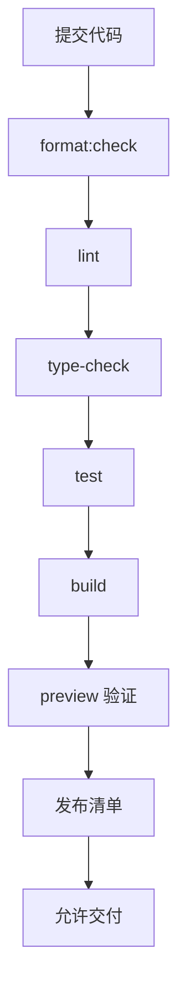

### 验收标准

- README 写清启动、配置、脚本和目录。
- 所有质量门禁命令能通过。
- 构建产物可预览。
- 发布清单写清版本、检查项和回滚方式。
- 工程问题能查到对应问题库。

## 阶段 8：问题注入和复盘

### 目标

故意制造真实项目问题，并训练自己按证据修复。

### 必做问题

| 问题 | 注入方式 | 查阅入口 |
| --- | --- | --- |
| CSS 横向溢出 | 给表格或卡片设置固定宽度 | [CSS 真实项目问题库](/projects/issues-css) |
| 旧请求覆盖 | 搜索接口随机延迟返回 | [JavaScript 真实项目问题库](/projects/issues-javascript) |
| 表单污染列表 | 编辑弹窗直接绑定表格行对象 | [Vue 真实项目问题库](/projects/issues-vue) |
| Cookie 未携带 | 跨源请求漏配 credentials | [浏览器与网络从零到项目落地](/browser/project-from-zero) |
| 环境变量错误 | 构建 test 环境时使用生产 API | [前端工程化真实项目问题库](/projects/issues-engineering) |
| 403 处理混乱 | 前端隐藏按钮但接口仍返回 403 | [Vue Admin 请求权限排障](/projects/issues-vue-admin-request) |
| localStorage 脏数据 | 手动写入非法 JSON | [JavaScript 真实项目问题库](/projects/issues-javascript) |
| 构建后路由 404 | preview 或静态服务缺少 fallback | [部署、缓存与 DevOps 问题](/projects/issues-deployment) |

### 复盘流程

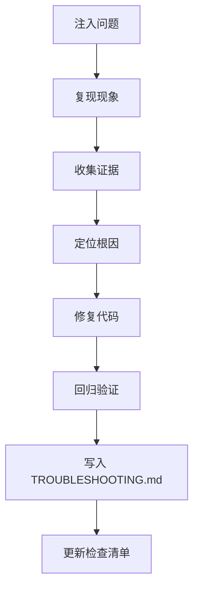

### 验收标准

- 至少完成 8 个问题注入和修复。
- 每个问题有复现步骤、证据、根因、修复和回归。
- 至少 3 个问题来自浏览器或工程化层，不只是组件代码。
- `TROUBLESHOOTING.md` 能作为以后项目排障模板。

## 最终交付物

| 交付物 | 要求 |
| --- | --- |
| 可运行项目 | `npm run dev` 能启动 |
| README | 技术栈、目录、脚本、环境变量、开发流程 |
| STYLE_GUIDE | token、布局、响应式、组件库边界 |
| BROWSER_DEBUG_NOTES | 请求、Cookie、缓存、Storage、Performance 证据 |
| ENGINEERING_NOTES | 配置决策、CI、构建、依赖升级记录 |
| RELEASE_CHECKLIST | 发布前检查、版本、回滚方案 |
| TROUBLESHOOTING | 至少 8 条问题复盘 |
| 测试 | DTO、权限、表单、请求错误至少各有一个测试 |
| 截图 | 桌面和移动端核心页面截图 |

## 最终验收清单

| 检查项 | 通过标准 |
| --- | --- |
| 运行 | 干净安装后能启动 |
| 目录 | 文件归属清楚，不混杂业务、状态、请求、UI |
| 样式 | 移动端无横向溢出，组件库不被污染 |
| 请求 | 错误分类、traceId、旧请求覆盖处理清楚 |
| 权限 | 菜单、路由、按钮、接口权限边界清楚 |
| 类型 | DTO、ViewModel、FormState、Payload 分层 |
| 浏览器 | 能用 Network/Application/Performance 定位问题 |
| 工程化 | lint、type-check、test、build、preview 通过 |
| 发布 | 有发布和回滚清单 |
| 复盘 | 问题记录能被他人复现 |

## 评分标准

| 等级 | 标准 |
| --- | --- |
| 可运行 | 页面能启动，有基本列表和表单 |
| 可维护 | 目录、类型、请求、样式、状态边界清楚 |
| 可排错 | 有浏览器证据和问题复盘 |
| 可交付 | 有测试、构建、预览、发布清单 |
| 可复用 | README 和复盘能指导下一个项目 |

不要追求一开始就做到“完美”。但最终至少要达到“可维护”和“可排错”，否则仍然只是一个 demo。

## 推荐阅读顺序

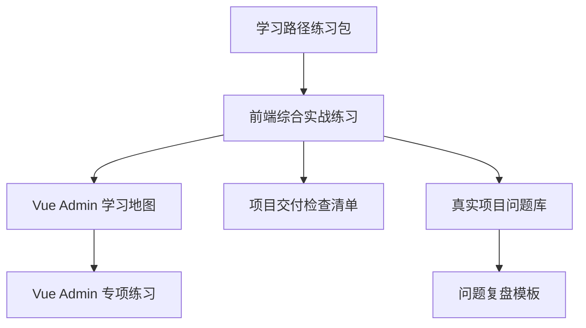

## 下一步

如果你还没有完成基础练习，回到 [学习路径练习包](/roadmap/practice-labs)。如果你要系统做后台项目，继续看 [Vue Admin 学习地图与交付清单](/roadmap/vue-admin-learning-map) 和 [Vue Admin 专项练习](/roadmap/vue-admin-practice)。如果你已经完成项目，进入 [项目交付检查清单](/projects/delivery-checklist) 做最终验收。
