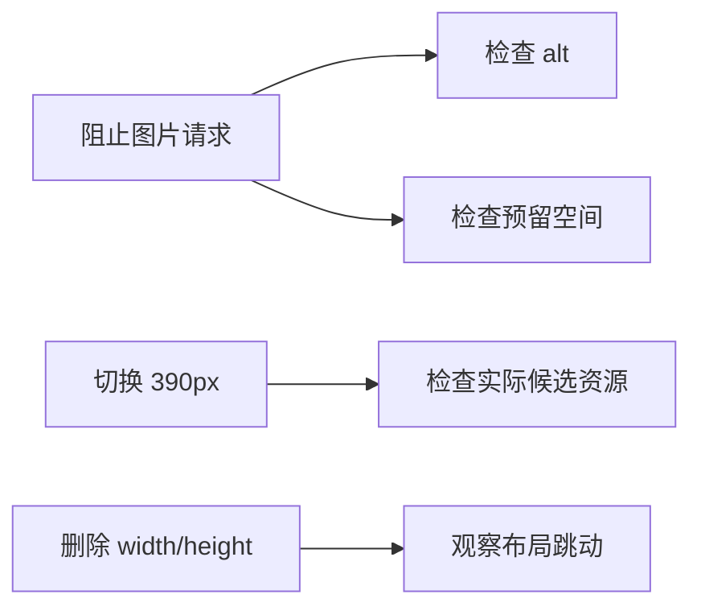
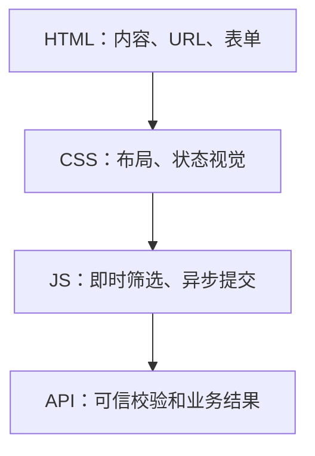
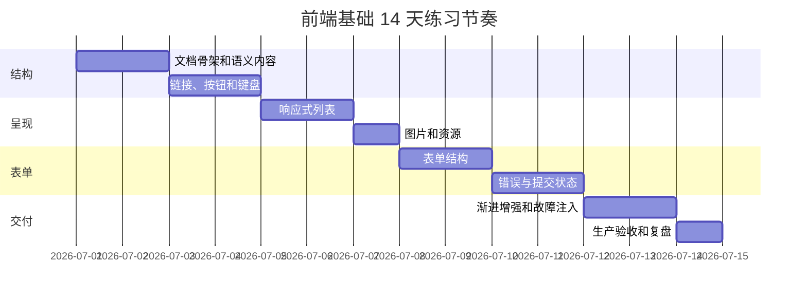

# 前端基础专项练习

## 这个练习包解决什么

前端基础不能只靠阅读。你需要亲手写结构、关闭资源、只用键盘操作，并从浏览器证据判断问题。本页提供 10 个从小到大的练习，最后汇总成“课程目录与报名页”。

每个练习都要求留下四类产出：

```text
可运行页面
验收截图或记录
至少一个故障注入
一段根因复盘
```

## 适合谁看

适合刚开始学习前端，或已经会写框架页面但想补齐浏览器原生基础的人：

- 能创建并打开一个 HTML 页面。
- 愿意使用 DevTools 检查 DOM、Network 和 Accessibility 信息。
- 想系统练习语义结构、表单、图片、响应式和键盘操作。
- 想在进入 Vue 或 React 项目前完成一次无框架交付。
- 项目里经常遇到资源 404、表单错误不清楚、焦点丢失或移动端溢出。

如果还不知道 DOM、CSSOM 和事件是什么，先阅读 [图解前端页面核心概念](/frontend/visual-guide)。如果已经能独立完成本页全部故障注入，可以直接进入 [前端综合实战练习](/roadmap/frontend-capstone-lab)。

## 练习路线


## 开始前准备

推荐先读：

- [前端基础学习导览](/frontend/introduction)
- [图解前端页面核心概念](/frontend/visual-guide)
- [HTML 语义与页面结构](/frontend/html-semantics)
- [表单、图片与无障碍](/frontend/forms-media-accessibility)

练习仓库建议：

```text
frontend-foundation-labs/
├─ lab-01-document/
├─ lab-02-semantics/
├─ lab-03-actions/
├─ lab-04-responsive-list/
├─ lab-05-images/
├─ lab-06-form/
├─ lab-07-errors/
├─ lab-08-enhancement/
├─ lab-09-failure-injection/
├─ lab-10-release/
└─ LEARNING_NOTES.md
```

也可以在一个项目中按 Git 提交完成，每个练习对应一个可回退提交。

## 练习 1：建立正确文档骨架

### 目标

创建一个不依赖 CSS 和 JavaScript也能正确解析的页面。

### 任务

1. 写 `doctype`、`html lang`、`charset` 和 viewport。
2. 为页面设置独立 `title` 和 description。
3. 添加 header、main、footer。
4. 添加跳到主要内容的 skip link。
5. 使用 module script 和独立 stylesheet。

### 故障注入

- 删除 viewport，在移动设备模拟器观察变化。
- 把 CSS 和 JS 路径改错，观察 Network 与页面降级。
- 把 `lang` 改成错误语言，检查 Accessibility 信息。

### 验收

```text
[ ] Document 200，字符显示正确
[ ] 页面有唯一可见 main
[ ] 浏览器标签标题能区分页面
[ ] Tab 第一个页面内焦点可以跳到 main
[ ] CSS/JS 失败时仍能读懂页面主题
```

## 练习 2：只用语义 HTML 写课程详情

### 目标

在不写 CSS 的情况下，让页面结构和内容关系清楚。

### 任务

- 一个 `h1` 表达课程名称。
- 用 `section` 和 `h2` 组织目标、大纲、适合人群。
- 大纲使用有序列表。
- 课程属性使用 `dl`。
- 课程时间使用 `time`。
- 相关课程使用列表与真实链接。

### 禁止项

- 不用一串 `div` 模拟所有结构。
- 不用 `<br>` 制造间距。
- 不按字体大小选择标题等级。
- 不用表格做整页布局。

### 故障注入

故意用 CSS `order` 改变区域视觉顺序，然后只用键盘和读屏顺序检查差异，写下为什么 DOM 顺序更重要。

### 验收

关闭 CSS 后，请另一个人只看页面回答：

1. 这是什么课程？
2. 先学什么、后学什么？
3. 课程时长和难度是什么？
4. 下一步可以去哪里？

## 练习 3：链接、按钮和展开内容

### 目标

根据行为选择正确原生元素。

### 任务

| 功能 | 必须使用 |
| --- | --- |
| 课程详情导航 | `a href` |
| 收藏课程 | `button type="button"` |
| 提交报名 | `button type="submit"` |
| FAQ 展开 | `details` + `summary` |
| 图标关闭按钮 | button + 可访问名称 |

### 故障注入

1. 先用 `div onclick` 实现收藏。
2. 只用键盘测试并记录失败。
3. 换成原生按钮再次测试。
4. 对比 Accessibility 面板中的 role、name 和 focusable。

### 验收

```text
[ ] 导航可新标签打开和复制地址
[ ] 所有动作可 Tab 聚焦
[ ] Enter/Space 行为符合控件类型
[ ] 焦点样式可见
[ ] 所有图标按钮名称可区分
```

## 练习 4：响应式课程列表

### 目标

用 CSS Grid 完成可承受不同屏幕和内容长度的列表。

### 任务

1. 至少 6 张课程卡片。
2. 使用 `auto-fit` 或明确断点布局。
3. 网格轨道允许子项收缩。
4. 卡片图片保持稳定比例。
5. 长标题、长英文和长 URL 能换行。
6. 390px、768px、1440px 均无页面级横向滚动。

### 压力数据

```text
普通：HTML 语义与页面结构
长中文：企业级多语言课程内容管理与无障碍交付实践
长英文：FrontendAccessibilityAndSemanticArchitectureMasterclass
长 URL：https://example.com/courses/frontend/foundation/very-long-path
```

### 故障注入

- 把 Grid 改成 `repeat(3, 1fr)` 并放入长英文。
- 给卡片加 `width: 500px`。
- 给页面容器设置 `width: 100vw`。
- 用溢出定位脚本找出撑破元素。

### 验收记录

| 视口 | 页面 scrollWidth | 页面 clientWidth | 结果 |
| --- | ---: | ---: | --- |
| 390px |  |  |  |
| 768px |  |  |  |
| 1440px |  |  |  |

## 练习 5：响应式图片与失败回退

### 目标

理解图片内容、尺寸、候选资源和加载策略。

### 任务

- 为课程图准备至少 640w 和 1280w 两个版本。
- 使用 `srcset` 和与布局一致的 `sizes`。
- 设置真实 `width` 和 `height`。
- 首屏图正常加载，后续图按需要 lazy load。
- 内容图片写有意义 alt，装饰图片使用空 alt。
- 用 `picture` 完成一次移动端裁切练习。

### 故障注入



### 验收

- Network 记录不同视口实际选择的图片。
- 图片失败后卡片结构仍可理解。
- alt 不重复旁边已有文字，也不写文件名。
- 首屏关键图没有因 lazy load 延迟。

## 练习 6：可访问报名表单

### 目标

完成可以自动填充、键盘操作并被辅助技术理解的报名表单。

### 字段

| 字段 | 要求 |
| --- | --- |
| 姓名 | label、autocomplete、minlength |
| 邮箱 | email type、autocomplete、帮助文本 |
| 电话 | tel type、autocomplete、inputmode |
| 学习时间 | fieldset、legend、radio |
| 兴趣方向 | checkbox 组 |
| 备注 | textarea、长度说明 |
| 同意规则 | checkbox + 独立规则链接 |

### 故障注入

- 删除 label，只留 placeholder。
- 复制字段导致重复 id。
- 把普通按钮放进 form 且省略 type。
- 用正数 tabindex 重新排序。

每次在 Accessibility 面板记录 role、name、description 和 invalid 状态变化。

### 验收

只用键盘完成整张表单；浏览器自动填充后仍能识别每个字段；点击 label 会聚焦正确控件。

## 练习 7：字段错误与错误摘要

### 目标

让用户知道哪里错、为什么错、怎样修。

### 任务

1. 编写纯函数 `validate(values)`。
2. 字段旁显示具体错误。
3. 设置 `aria-invalid` 和 `aria-describedby`。
4. 长表单顶部生成错误摘要。
5. 提交失败后焦点进入摘要。
6. 摘要链接跳到对应字段。
7. 字段修正后移除过期错误。

### 测试数据

```text
姓名：空、1 字符、40 字符、41 字符
邮箱：空、abc、name@example.com
学习时间：未选、已选
条款：未勾选、已勾选
服务端：422 字段错误、409 业务冲突、500
```

### 故障注入

只显示红色边框或瞬时 Toast，让另一位测试者在不看颜色的情况下尝试修正，再对比完整错误方案。

## 练习 8：渐进增强筛选和提交

### 目标

让 HTML 提供核心内容，JavaScript 增强效率和反馈。

### 任务

- 课程列表最初存在于 HTML。
- 搜索表单有真实字段和提交按钮。
- JS 加载后支持本地筛选与空态。
- 报名 form 有真实 action 和 method。
- JS 加载后使用 fetch 异步提交。
- 请求中禁用提交，失败保留输入，成功后再 reset。

### 能力分层图



### 验收

| 环境 | 课程 | 详情链接 | 筛选 | 报名 |
| --- | --- | --- | --- | --- |
| 正常 | 可读 | 可用 | 即时增强 | 异步状态完整 |
| JS 失败 | 可读 | 可用 | 原始列表可读 | 原生提交或清楚降级 |
| CSS 失败 | 可读 | 可用 | 控件仍有语义 | 字段顺序清楚 |

## 练习 9：系统故障注入

### 目标

不等线上出错，主动证明失败路径可控。

### 故障矩阵

| 编号 | 故障 | 期望证据 |
| --- | --- | --- |
| F01 | main.js 404 | 核心内容和链接仍存在 |
| F02 | styles.css 404 | 文档结构仍可理解 |
| F03 | 一张图片 404 | alt 可理解、布局稳定 |
| F04 | API 延迟 5 秒 | 提交中状态、防重复 |
| F05 | API 422 | 字段错误和摘要 |
| F06 | API 409 | 业务冲突说明 |
| F07 | API 500 | 保留输入、允许重试 |
| F08 | 深层 URL 刷新 | 返回正确页面而非 404 |
| F09 | 200% 缩放 | 无内容遮挡 |
| F10 | 纯键盘 | 完成筛选和报名 |

### DEBUG_NOTES 模板

```md
## F05 - API 返回 422

### 现象
### 复现步骤
### Network 证据
### DOM / Accessibility 证据
### 根因
### 修复
### 回归
### 预防
```

至少完整写 5 条，不要只勾选通过。

## 练习 10：生产构建与交付

### 目标

证明项目离开开发服务器后仍然成立。

### 任务

```bash
npm run build
npm run preview
```

检查：

- 首页和所有详情 URL。
- CSS、JS、字体、图片的状态码和 Content-Type。
- 子路径或实际部署 base。
- 文件大小写。
- Console 零错误。
- 390px、1440px、200% 缩放。
- 键盘主流程。
- API 正常与失败响应。

### 最终交付

```text
[ ] README
[ ] ACCESSIBILITY_CHECKLIST.md
[ ] DEBUG_NOTES.md
[ ] RELEASE_CHECKLIST.md
[ ] 生产预览截图
[ ] Network 关键请求记录
[ ] 至少 5 条故障复盘
[ ] 可分享的部署 URL
```

## 14 天建议节奏



每天最后 15 分钟只做三件事：

1. 写今天遇到的一个问题。
2. 记录一条浏览器证据。
3. 说明明天如何验证没有回归。

## 最终自测

| 能力 | 0 分 | 1 分 | 2 分 | 3 分 |
| --- | --- | --- | --- | --- |
| 语义结构 | 全靠 div | 会用部分标签 | 层级与区域清楚 | 能解释对可访问性和维护的影响 |
| 表单 | 只有输入和按钮 | 有 label | 有错误和状态 | 有服务端错误、焦点与失败恢复 |
| 图片 | 单张原图 | 有 alt | 有尺寸与候选 | 能按内容、视口和性能决策 |
| 响应式 | 只看桌面 | 有媒体查询 | 多视口稳定 | 通过长内容和缩放压力测试 |
| 键盘 | 未检查 | 能 Tab | 可完成主任务 | 弹窗、错误和焦点归还完整 |
| 排错 | 凭感觉修改 | 会看 Console | 会串 Network/DOM/A11y | 能写根因、回归和预防 |
| 交付 | 只有 dev | 能 build | preview 通过 | 深层 URL、资源、失败矩阵完整 |

总分低于 14：回到对应练习重做故障注入。

总分 14 到 18：可以进入 JavaScript、CSS 和框架项目，同时继续补问题记录。

总分 19 以上：尝试把同一项目重构成 Vue 版本，对比原生 DOM 与组件边界。

## 下一步学习

练习中遇到问题，先查 [前端基础常见问题](/frontend/troubleshooting) 和 [HTML 与无障碍真实项目问题库](/projects/issues-html-accessibility)。完成后进入 [JavaScript 学习导览](/javascript/introduction)、[CSS 学习导览](/css/introduction) 或 [Vue 前端工程师路线](/roadmap/vue-frontend)。
