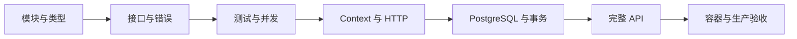
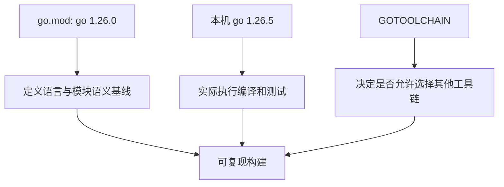
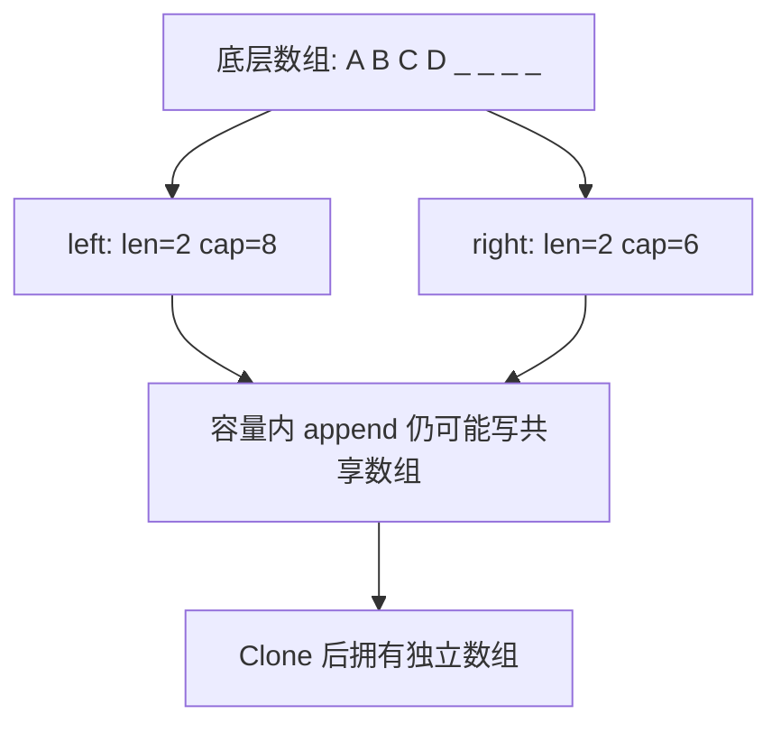
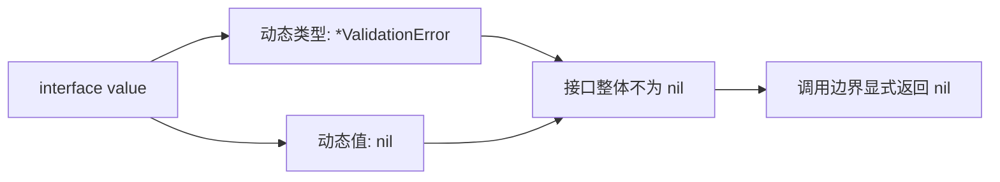
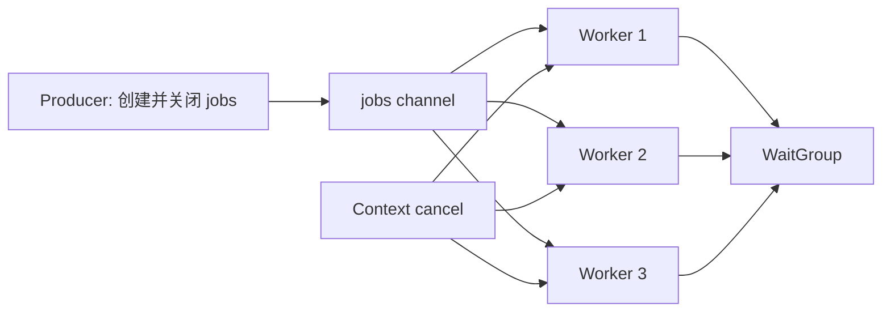
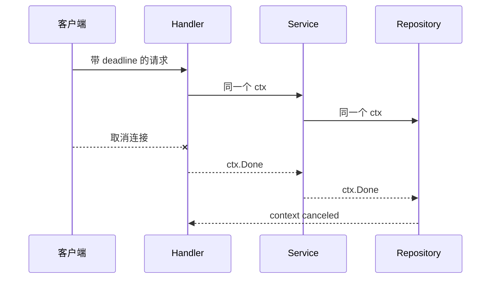
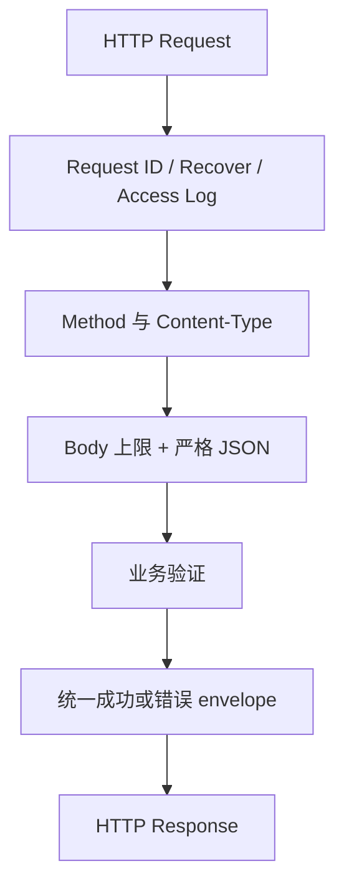
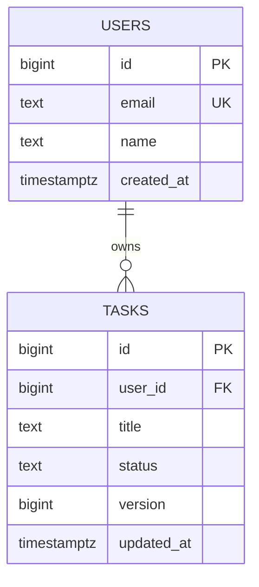
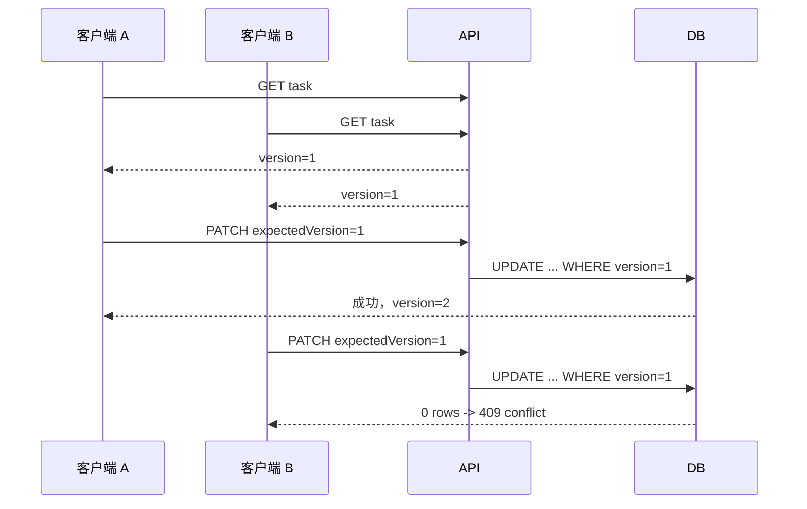
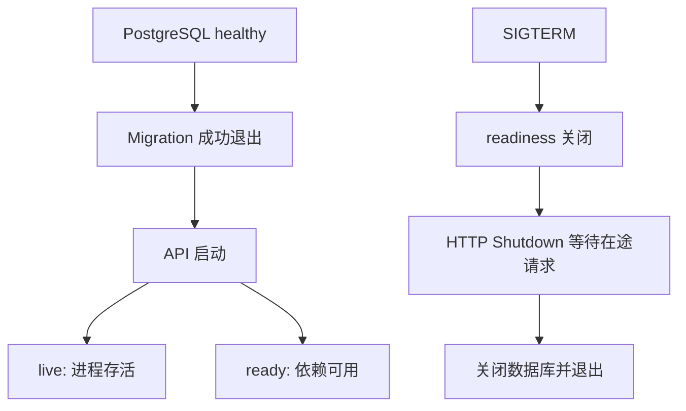

# Go 专项实战练习

## 适合谁看

适合已经读过 [Go 学习导览](/go/introduction)，但还没有把语法、并发、HTTP、数据库和部署串成完整项目的人。这里不是选择题集合，而是 12 个可以运行、破坏、观察、修复并验收的工程练习。

如果某一步无法解释原因，先回到对应章节建立心智模型；如果程序已经出现具体故障，使用 [Go 真实项目问题库](/projects/issues-go) 按现象排查。

## 最终能力地图



完成全部练习后，你应该能够独立回答：

- 为什么 `go.mod` 的语言版本与本机实际工具链可能不同。
- slice、interface、error、goroutine 和 channel 最容易在哪些边界失控。
- 如何让请求超时真正传递到数据库，而不是只给客户端返回一句超时。
- 如何设计稳定的 HTTP 错误契约、事务边界与乐观锁冲突。
- 如何用测试、race detector、真实 PostgreSQL 和容器 smoke test 证明项目可交付。

## 统一实验规则

本页统一使用 **Go 1.26.5** 和 **PostgreSQL 18.4**。练习可以在单独目录完成，也可以逐步改造仓库中的 `examples/go-task-api`。不要把本机已经存在的缓存、数据库或环境变量当作成功条件。

每个练习都保留三组证据：

```text
baseline/   修改前的命令、日志、响应和测试结果
broken/     故障注入方式与第一条异常证据
fixed/      修复后的同条件回归结果
```

统一记录模板：

```text
练习编号：
Git commit：
Go / PostgreSQL / Docker 版本：
启动命令与环境变量：
正常基线：
故障注入：
第一条异常证据：
根因：
修复与取舍：
回归命令与结果：
仍未验证的风险：
```

统一基础命令：

```bash
go version
go test ./...
go test -race ./...
go vet ./...
go build ./cmd/...
```

涉及 Docker 的练习使用固定项目名，避免误删其他项目资源：

```bash
docker compose -p go-task-api-practice up -d --build
docker compose -p go-task-api-practice ps
docker compose -p go-task-api-practice logs --no-color
docker compose -p go-task-api-practice down -v --remove-orphans
```

清理前先确认 `docker compose ... ps` 只显示本练习资源。端口被占用时设置 `POSTGRES_PORT=55432`，不要停止不属于本练习的容器。

## 练习 1：固定模块版本与工具链

### 目标

从空目录创建可复现模块，理解 `go` 指令、`toolchain` 指令和本机 `go` 命令之间的关系。

### 起始条件

- 已安装 Go 1.26.5。
- 新建空目录，不复制现有 `go.mod`。

### 任务步骤

1. 执行 `go mod init example.com/version-lab`。
2. 写一个输出运行时版本的 `main.go`。
3. 将 `go.mod` 的 `go` 指令设为 `1.26.0`，记录 `go env GOTOOLCHAIN`。
4. 执行测试、构建和 `go version -m` 检查二进制元信息。
5. 分别尝试 `GOTOOLCHAIN=local` 与默认设置，记录差异。



### 限制

- 不通过删除 `go.mod` 解决版本错误。
- 不写模糊的“需要较新 Go”，必须记录精确版本。

### 验证命令

```bash
go version
go env GOTOOLCHAIN
go mod tidy
go test ./...
go build -o version-lab .
go version -m ./version-lab
```

### 通过标准

- 干净目录能重复构建。
- 能解释 `go 1.26.0` 不等于必须安装补丁版本 `1.26.0`。
- `go.mod`、README 和实际工具链没有互相冲突。

### 常见失败

| 现象 | 根因 | 修正 |
| --- | --- | --- |
| 本机能构建，CI 失败 | CI 工具链较旧 | 固定 CI 和镜像版本 |
| `go mod tidy` 每次改文件 | 使用不同 Go 版本 | 统一版本后重新整理 |
| 自动下载工具链失败 | 网络受限 | 使用预装工具链并设 `GOTOOLCHAIN=local` |

### 进阶挑战

为模块增加 CI，打印版本并执行 `go test -race ./...`，故意使用旧版本镜像验证失败信息是否清楚。

## 练习 2：看见 slice 的共享底层数组

### 目标

用地址、长度和容量证明多个 slice 可能共享底层数组，并修复意外修改与大对象滞留。

### 起始条件

创建只包含 `slice.go` 与 `slice_test.go` 的小模块。

### 任务步骤

1. 创建长度 4、容量 8 的 slice，并切出两个子 slice。
2. 修改其中一个元素，观察另一个视图。
3. 在容量以内和容量以外分别 `append`，比较结果。
4. 从一个大 byte slice 中保留很小切片，观察内存仍被引用的原因。
5. 使用 `copy` 或 `slices.Clone` 建立所有权清晰的副本。



### 限制

- 不只比较打印值，必须记录 `len`、`cap` 和首元素地址。
- 基准测试不得把日志放进计时循环。

### 验证命令

```bash
go test -v ./...
go test -run TestSliceOwnership -count=50 ./...
go test -bench BenchmarkClone -benchmem ./...
```

### 通过标准

- 测试能稳定证明共享与复制两种行为。
- 对外返回内部 slice 时明确是否复制。
- 能解释“小切片为什么可能留住大数组”。

### 常见失败

| 现象 | 根因 | 修正 |
| --- | --- | --- |
| 修改 A，B 也变化 | 共享底层数组 | 在边界处 clone |
| append 后有时共享、有时不共享 | 容量决定是否扩容 | 不依赖隐式扩容隔离数据 |
| 内存不下降 | 小切片仍引用大数组 | 复制所需区间后释放原引用 |

### 进阶挑战

使用 `runtime/pprof` 对比保留子切片与复制子切片两种实现的 heap profile。

## 练习 3：接口、typed nil 与错误链

### 目标

理解接口值由动态类型和动态值组成，避免 `typed nil` 让 `err != nil`，并建立可检查的错误链。

### 起始条件

准备一个返回 `error` 的函数和一个自定义 `ValidationError` 指针类型。

### 任务步骤

1. 让 `*ValidationError` 变量为 nil，再作为 `error` 返回。
2. 打印 `%T`、`%v` 和 `err == nil`。
3. 修正为在具体指针为 nil 时直接返回 `nil`。
4. 使用 `%w` 包装哨兵错误，并用 `errors.Is` 判断。
5. 使用 `errors.As` 提取带字段的业务错误。



### 限制

- 不使用字符串相等判断错误类型。
- 不把数据库原始错误直接返回给 HTTP 客户端。

### 验证命令

```bash
go test -v ./...
go test -run 'TestTypedNil|TestErrorChain' -count=100 ./...
go vet ./...
```

### 通过标准

- typed nil 回归测试先失败、修复后通过。
- 包装错误保留上下文，也能被 `errors.Is/As` 识别。
- 日志记录内部 cause，响应只暴露稳定业务码。

### 常见失败

| 现象 | 根因 | 修正 |
| --- | --- | --- |
| 返回 nil 指针却进入错误分支 | 接口动态类型非 nil | 返回真正的 nil interface |
| `errors.Is` 失败 | 使用 `%v` 而非 `%w` | 在需要保留链的位置使用 `%w` |
| 客户端看到 SQL | 传输了内部错误文本 | 在 HTTP 边界统一映射 |

### 进阶挑战

实现 `AppError`，包含稳定 code、HTTP status、公开 message 与内部 cause，并为序列化边界写测试。

## 练习 4：表驱动测试、子测试与 Fuzz

### 目标

建立可以覆盖正常、边界和随机输入的测试结构，而不是只验证一个成功样例。

### 起始条件

实现一个解析分页参数的纯函数，输入字符串，输出 `limit`、`offset` 或错误。

### 任务步骤

1. 用表驱动测试覆盖空值、边界、负数、超大值与非法字符。
2. 使用 `t.Run` 让失败案例可定位。
3. 给无共享状态的案例加 `t.Parallel()`。
4. 添加 Fuzz seeds，断言函数不会 panic 且结果满足不变量。
5. 把发现的反例加入固定回归用例。

### 限制

- 不在断言中复制生产实现。
- 并行子测试不得共享可变变量或固定端口。

### 验证命令

```bash
go test -v ./...
go test -shuffle=on -count=20 ./...
go test -fuzz=FuzzParsePagination -fuzztime=20s ./...
go test -race ./...
```

### 通过标准

- 用例名能直接说明输入场景。
- Fuzz 输入不会触发 panic、负 offset 或越界 limit。
- 打乱和 race 模式均通过。

### 常见失败

| 现象 | 根因 | 修正 |
| --- | --- | --- |
| 单独通过、全量失败 | 测试共享状态 | 每例独立初始化 |
| 并行案例读到同一输入 | 错误捕获循环变量或共享对象 | 在子测试边界复制值 |
| Fuzz 只跑默认种子 | 命令未指定 fuzz | 使用 `-fuzz` 和合理时间 |

### 进阶挑战

为严格 JSON 请求解码器增加 Fuzz，验证未知字段、尾随 JSON、超大输入和非法 UTF-8 都不会导致 panic。

## 练习 5：明确 goroutine 与 channel 所有权

### 目标

实现可停止的 worker pool，清楚说明谁创建、谁发送、谁关闭、谁等待。

### 起始条件

准备 `jobs <-chan Job`、固定数量 worker 和可取消 `context.Context`。

### 任务步骤

1. 主 goroutine 创建 jobs channel 与 `sync.WaitGroup`。
2. 启动 3 个 worker，循环处理或响应取消。
3. 由唯一发送方在发送完成后关闭 jobs。
4. 注入单个慢任务，验证取消能结束等待。
5. 反向实验：让接收方关闭 channel，记录 panic。



### 限制

- 不使用 `time.Sleep` 猜测 worker 是否结束。
- 不允许多个发送方在没有协调的情况下关闭 channel。

### 验证命令

```bash
go test -run TestWorkerPool -count=100 ./...
go test -race ./...
go test -run TestWorkerPoolCancel -timeout=3s ./...
```

### 通过标准

- 所有 goroutine 都有明确退出路径。
- 测试通过 WaitGroup 或结果 channel 同步。
- race detector 无报告，取消测试不会超时。

### 常见失败

| 现象 | 根因 | 修正 |
| --- | --- | --- |
| `send on closed channel` | 关闭权不唯一 | 由生命周期拥有者关闭 |
| 测试偶发挂死 | worker 阻塞发送结果 | 发送时同时监听 ctx |
| 主函数提前结束 | 未等待 worker | 用 WaitGroup 收拢生命周期 |

### 进阶挑战

增加有界队列、拒绝策略与指标，验证高负载时内存不会无限增长。

## 练习 6：让 Context 取消贯穿调用链

### 目标

从 HTTP 请求到 service、repository 和数据库都传递同一个取消信号。

### 起始条件

准备 `httptest.Server` 和一个会阻塞直到收到取消的 fake repository。

### 任务步骤

1. Handler 从 `r.Context()` 取得 context。
2. Service 方法将 context 作为第一个参数继续传递。
3. Repository 使用 `QueryContext` 或 `ExecContext`。
4. 客户端设置短 deadline，证明 repository 收到取消。
5. 写一个错误版本：在 service 中替换成 `context.Background()`，观察泄漏。



### 限制

- 不把 context 存进结构体字段。
- 中间层不得改用 `context.Background()`。

### 验证命令

```bash
go test -run TestRequestCancellation -count=50 ./...
go test -race ./...
go test -run TestRequestCancellation -timeout=2s ./...
```

### 通过标准

- 客户端取消后 repository 在测试 deadline 内退出。
- 日志能区分取消、超时和内部失败。
- 客户端主动取消不被错误记录成服务端 500。

### 常见失败

| 现象 | 根因 | 修正 |
| --- | --- | --- |
| 响应超时后 SQL 仍运行 | context 在中途断开 | 全链路透传并用 Context API |
| goroutine 数持续增加 | 后台工作不监听取消 | 每个阻塞点 select ctx.Done |
| 所有错误都记 500 | 未识别 context 错误 | 在边界分类记录 |

### 进阶挑战

增加服务端 timeout middleware，并证明它只负责 deadline 传播，不额外启动无法回收的 handler goroutine。

## 练习 7：建立严格 HTTP JSON 契约

### 目标

实现可预测的请求解码、错误响应、方法限制与 request ID 中间件。

### 起始条件

创建一个最小 `net/http` 服务，包含 `POST /users`。

### 任务步骤

1. 限制 body 大小并检查 `Content-Type`。
2. 使用 `DisallowUnknownFields`，拒绝第二个 JSON 值。
3. 对验证失败、冲突和内部错误返回稳定 code。
4. 为不支持的方法返回 405 与 `Allow` header。
5. 中间件生成或透传 request ID，并在 panic 时返回脱敏 500。



### 限制

- 不在每个 Handler 手写不同错误 JSON。
- 不把 panic 内容、堆栈或数据库错误返回给客户端。

### 验证命令

```bash
go test -run TestAPIContract -v ./...
go test -race ./...
curl -i -X POST http://127.0.0.1:8080/users \
  -H 'Content-Type: application/json' \
  -d '{"email":"demo@example.com","unknown":true}'
```

### 通过标准

- 未知字段、尾随 JSON、超大 body、错误媒体类型都有测试。
- 405 包含正确 `Allow`。
- 所有错误包含稳定 code 和 request ID，但不泄露内部细节。

### 常见失败

| 现象 | 根因 | 修正 |
| --- | --- | --- |
| 拼错字段仍创建成功 | 默认解码忽略未知字段 | 启用严格解码 |
| 请求后仍有额外 JSON | 只调用一次 Decode | 再次 Decode 并要求 EOF |
| 日志无法串联 | 每层自己生成 ID | 在入口生成并放入 context |

### 进阶挑战

加入 deadline、结构化访问日志和 panic 回归测试，对比 `examples/go-task-api/internal/httpx` 的实现。

## 练习 8：用 PostgreSQL 迁移建立真实数据边界

### 目标

使用 PostgreSQL 18.4 和版本化 SQL 迁移创建 users/tasks 结构，并证明约束与索引真实生效。

### 起始条件

已安装 Docker，宿主机目标端口可用，或者设置 `POSTGRES_PORT=55432`。

### 任务步骤

1. 用 Compose 启动单独 PostgreSQL 容器。
2. 写 `000001_init.up.sql` 和对应 down migration。
3. 添加主键、外键、唯一 email、状态检查与时间字段。
4. 根据列表查询建立复合索引。
5. 连续执行 migrate up，证明不会重复创建。
6. 插入非法状态和重复 email，保存数据库拒绝证据。



### 限制

- 不在应用启动时偷偷修改 schema。
- 不用 SQLite 替代 PostgreSQL 验证数据库语义。

### 验证命令

```bash
POSTGRES_PORT=55432 docker compose -p go-db-practice up -d postgres
docker compose -p go-db-practice ps
go run ./cmd/migrate
go run ./cmd/migrate
go test -tags=integration ./...
docker compose -p go-db-practice down -v --remove-orphans
```

### 通过标准

- fresh database 能从零迁移到最新版本。
- 约束失败可被稳定识别并映射为业务错误。
- 清理后没有练习容器和 volume 残留。

### 常见失败

| 现象 | 根因 | 修正 |
| --- | --- | --- |
| 应用先于数据库启动 | 只写启动顺序，没有健康条件 | healthcheck + migration job |
| 本机可用，容器连接失败 | 容器内 `localhost` 指向自身 | 使用 Compose 服务名 |
| down 丢失生产数据 | 把回滚当默认操作 | 生产优先向前修复并评审迁移 |

### 进阶挑战

为迁移增加 CI：启动真实 PostgreSQL，执行 up、集成测试，再从新数据库重复一次。

## 练习 9：Repository、分页与连接池

### 目标

把 SQL 限制在 repository，正确关闭 rows、处理排序和分页，并观察连接池等待。

### 起始条件

复用练习 8 的数据库，插入至少 100 条 tasks。

### 任务步骤

1. 实现按 `user_id`、`status`、`limit`、`offset` 列表查询。
2. 固定允许的排序字段，不直接拼接用户输入。
3. 使用 `defer rows.Close()` 并检查 `rows.Err()`。
4. 配置最大连接数、连接生命周期和空闲时间。
5. 并发执行慢查询，记录 `DB.Stats().WaitCount/WaitDuration`。

### 限制

- Handler 不直接写 SQL。
- 不以无限增大连接数作为池等待的唯一解决方案。

### 验证命令

```bash
go test -tags=integration -run TestTaskRepository -v ./...
go test -race ./...
go test -bench BenchmarkTaskList -benchmem ./...
```

### 通过标准

- 查询顺序稳定，相同条件不会随机换页。
- 所有 rows 和事务路径都能释放连接。
- 能通过指标区分 SQL 慢、池太小和连接泄漏。

### 常见失败

| 现象 | 根因 | 修正 |
| --- | --- | --- |
| 翻页有重复或遗漏 | 排序字段不唯一 | 添加稳定次级排序键 |
| pool wait 持续增长 | 连接未释放或事务过长 | 检查 rows/tx 生命周期 |
| 出现 SQL 注入风险 | 排序字段直接拼接 | 使用 allowlist 映射 |

### 进阶挑战

增加 cursor pagination，比较 offset 在深页时的执行计划与延迟。

## 练习 10：用乐观锁完成任务生命周期 API

### 目标

实现创建、读取、更新状态和删除任务的完整生命周期，并用 version 阻止丢失更新。

### 起始条件

数据库已有 `tasks.version`，HTTP 层能返回统一错误结构。

### 任务步骤

1. 创建用户和任务。
2. 两个客户端读取同一 task，得到相同 version。
3. 客户端 A 使用该 version 更新成功。
4. 客户端 B 继续使用旧 version，必须收到冲突。
5. 使用新 version 完成状态转换，再删除任务。
6. 给非法状态转换与重复删除写回归测试。



### 限制

- 不使用“先 SELECT 再无条件 UPDATE”模拟并发保护。
- 冲突不能返回 500，也不能静默覆盖较新数据。

### 验证命令

```bash
go test -tags=integration -run TestTaskLifecycle -v ./...
go test -tags=integration -run TestStaleVersion -count=20 ./...
go test -race ./...
```

### 通过标准

- 生命周期测试覆盖成功、404、409 与非法状态转换。
- 并发更新只有一个成功，另一个得到稳定冲突码。
- 冲突修复方式是重新读取和合并，而不是自动重试旧写入。

### 常见失败

| 现象 | 根因 | 修正 |
| --- | --- | --- |
| 两个请求都成功 | UPDATE 没带 version 条件 | 条件更新并递增 version |
| 0 rows 都映射 404 | 未区分不存在与版本冲突 | 结合查询或契约分类 |
| 冲突后无限重试 | 重试仍带旧业务意图 | 重新读取并交给调用方决策 |

### 进阶挑战

使用并发屏障同时提交 20 次更新，统计成功数并证明最终 version 正确。

## 练习 11：容器健康检查与优雅关闭

### 目标

构建非 root 最小镜像，区分 liveness/readiness，并在 SIGTERM 时停止接流量、等待请求、关闭资源。

### 起始条件

API 已有 `/health/live`、`/health/ready` 和可配置 shutdown timeout。

### 任务步骤

1. 使用多阶段 Dockerfile 构建 API、migration 和 healthcheck 二进制。
2. runtime 使用非 root 用户。
3. Compose 先等待 PostgreSQL healthy，再运行 migration，最后启动 API。
4. 启动慢请求并发送 SIGTERM，观察生命周期日志。
5. 让数据库不可用，验证 live 仍存活、ready 失败。
6. 执行完整清理并检查残留。



### 限制

- 不用 `sleep 10` 代替健康检查。
- 不使用 root 运行最终容器。
- 不用 `docker kill` 验证优雅关闭。

### 验证命令

```bash
POSTGRES_PORT=55432 docker compose -p go-task-api-practice up -d --build
docker compose -p go-task-api-practice ps
curl -fsS http://127.0.0.1:8080/health/live
curl -fsS http://127.0.0.1:8080/health/ready
docker compose -p go-task-api-practice stop api
docker compose -p go-task-api-practice logs --no-color api
docker compose -p go-task-api-practice down -v --remove-orphans
```

### 通过标准

- migration 未成功时 API 不启动。
- 最终容器不是 root。
- 日志包含开始监听、开始关闭、关闭完成。
- down 后项目容器、网络和 volume 均不存在。

### 常见失败

| 现象 | 根因 | 修正 |
| --- | --- | --- |
| ready 永远成功 | 只检查进程 | readiness 检查关键依赖 |
| SIGTERM 立即断开请求 | 没调用 `Server.Shutdown` | 信号触发有时限 shutdown |
| 关闭一直卡住 | handler 不尊重 context | 让阻塞调用响应取消 |

### 进阶挑战

设置容器 CPU/内存限制并压测，观察超时、连接池和关闭行为是否仍满足契约。

## 练习 12：交付完整 go-task-api

### 目标

把前 11 个练习合并为可交付项目，并用自动化证据证明代码、数据库、HTTP 与容器行为一致。

### 起始条件

直接使用仓库中的 `examples/go-task-api`。先阅读其 README、`API_CONTRACT.md` 和 `TROUBLESHOOTING.md`，不要先改代码。

### 任务步骤

1. 从干净环境执行构建、单元测试、race 和 vet。
2. 启动真实 PostgreSQL，执行全量 integration tests。
3. 用 Compose 构建并启动完整栈。
4. 使用 curl 完成用户和任务全生命周期。
5. 注入重复 email、未知字段、旧 version、deadline 和 panic 场景。
6. 对照日志中的 request ID 定位每次失败。
7. 执行 SIGTERM、查看关闭日志并清理环境。
8. 写一份交付报告，明确已验证项和剩余风险。


### 限制

- 不跳过失败测试，不删除断言换取绿色结果。
- 不把本机已有数据库或手工建表作为前置条件。
- 不在报告中把未运行的检查写成“通过”。

### 验证命令

```bash
cd examples/go-task-api
go build ./cmd/...
go test -race ./...
go vet ./...
go test -tags=integration ./... -v
POSTGRES_PORT=55432 docker compose -p go-task-api-practice up -d --build
docker compose -p go-task-api-practice ps
docker compose -p go-task-api-practice logs --no-color
docker compose -p go-task-api-practice down -v --remove-orphans
```

### 通过标准

- 所有命令在报告中保留退出状态与关键输出。
- 全生命周期与错误契约均有自动化测试或可复现 smoke 证据。
- 容器健康、非 root、迁移顺序、优雅关闭与资源清理全部可证明。
- 另一位开发者只看 README 就能在干净机器复现。

### 常见失败

| 现象 | 根因 | 修正 |
| --- | --- | --- |
| 单测通过但线上请求失败 | 没测真实边界 | 补 PostgreSQL 与 HTTP 集成测试 |
| Compose 偶发启动失败 | 依赖只按顺序、不按状态 | 使用健康与完成条件 |
| 报告只有截图没有命令 | 证据不可复现 | 同时记录命令、环境和输出 |
| 清理误伤其他项目 | Compose 项目名不固定 | 始终使用独立 `-p` 名称 |

### 进阶挑战

增加 CI：分别运行静态检查、race、真实 PostgreSQL 集成测试和镜像 smoke；再增加性能基线与回滚演练，但不要用性能测试替代正确性测试。

## 完成后的复盘

不要只记录“做完 12 题”。选出三个最容易犯错的边界，按下面格式写入学习笔记：

```text
我原来的错误模型：
第一条推翻它的证据：
正确模型：
项目中如何预防：
对应测试或监控：
```

接下来阅读 [Go 从零构建 HTTP API](/go/http-api-project-from-zero)，逐段对照可运行示例；遇到异常时回到 [Go 真实项目问题库](/projects/issues-go) 和 [Go 故障排查](/go/troubleshooting)。

## 下一步学习

完成练习并不等于项目已经具备生产质量。下一步把 `examples/go-task-api` 当作基线，选择一个真实业务功能扩展领域模型，同时保持错误契约、迁移、并发控制、集成测试、容器健康检查和交付证据同步更新。
