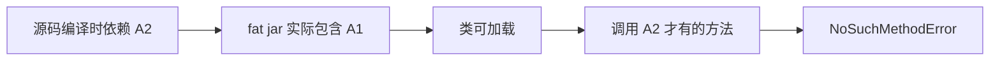
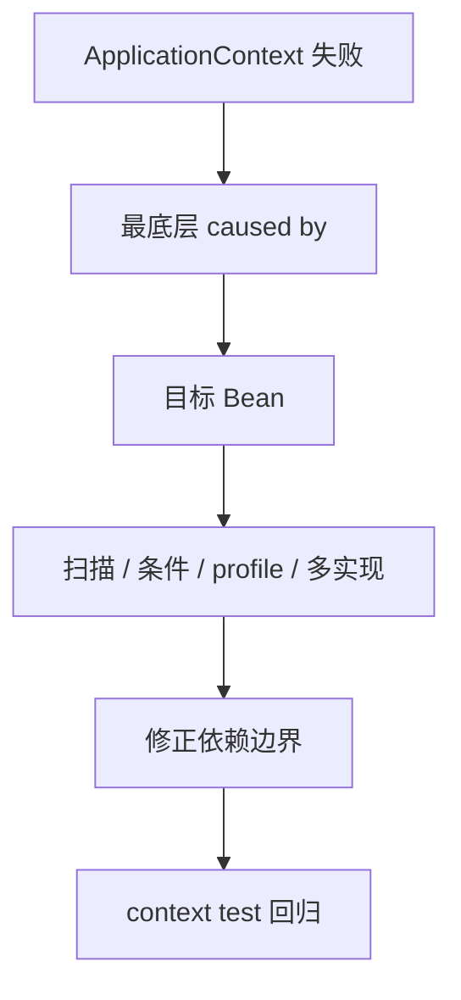
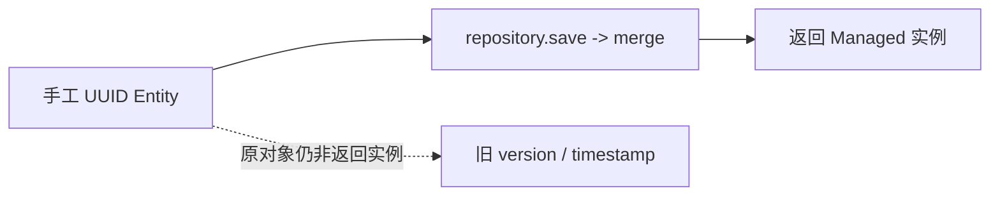
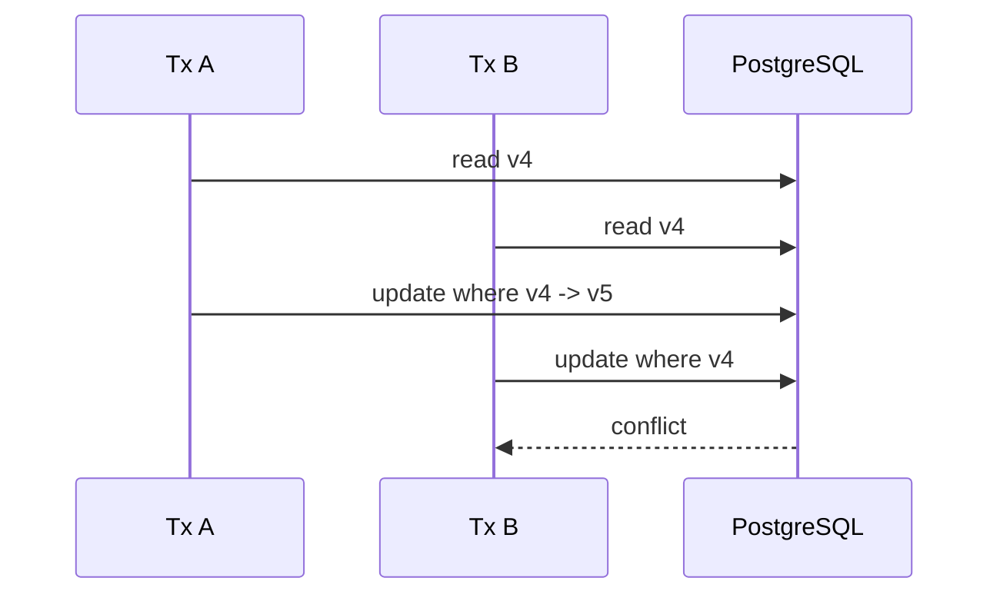
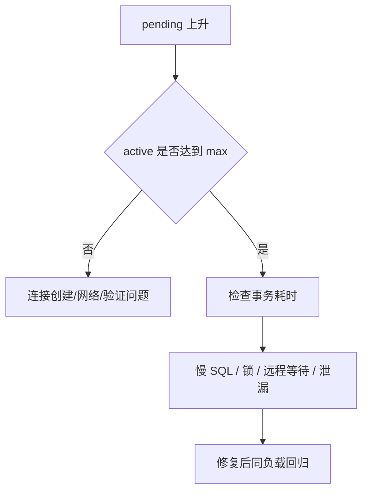
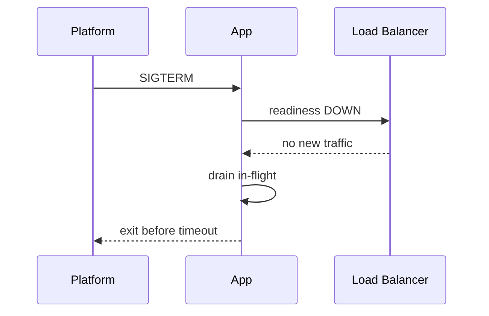

# Java 专项练习

## 适合谁看

适合已经完成 [Java 学习导览](/java/introduction)，并至少能启动一个 Spring Boot API 的学习者。本页不要求再写一套重复 CRUD，而是在 [Spring Boot 从零到项目](/java/spring-boot-project-from-zero) 的可运行工程上注入真实 Java 故障。

如果还不能解释 Controller、Service、Repository 和事务边界，先完成项目章节；如果问题是通用接口契约、幂等或 401/403，使用 [后端接口与服务问题](/projects/issues-backend)，不要误归为 JVM 问题。

## 练习目标


完成 12 个练习后，你应该能：

- 从干净环境得到可复现 jar 和镜像。
- 用依赖树、条件报告、事务日志和 SQL 数量定位问题。
- 复现乐观锁、连接池、ThreadLocal 和 Executor 故障。
- 使用 thread dump、JFR、GC 和 native memory 证据。
- 用真实 PostgreSQL 验证迁移、事务和 HTTP 契约。
- 完成 readiness、SIGTERM、资源上限和回滚演练。

## 统一实验规则

每个练习保留三组证据：

```text
baseline/  正常代码、命令、日志和指标
broken/    故障注入、第一条异常证据和影响
fixed/     修复后同条件回归结果
```

统一记录模板：

```text
练习编号：
Git commit：
Java / Spring Boot / PostgreSQL / OS：
JVM 参数与容器 CPU/内存：
输入规模、并发和持续时间：
正常基线：
故障注入：
第一条异常证据：
排除过的假设：
根因：
修复与取舍：
回归命令与结果：
预防规则：
```

比较前后结果时保持数据量、并发、机器和运行时参数一致。不要改变负载后声称性能改善。

## 练习 1：JDK 与字节码可复现

### 目标

证明源码、Maven、CI、build stage 和 runtime stage 使用一致的 Java 25 基线，并能解释版本不兼容。

### 任务

1. 删除 `target`，从干净目录执行测试和打包。
2. 记录 `java -version`、`mvn -version`。
3. 用 `javap -verbose` 查看一个 class 的 major version。
4. 构建 Docker 镜像，在镜像中检查 Java 版本。
5. 保存本地、CI、镜像的版本矩阵。

### 故障注入

- 使用 Java 25 编译，再用 Java 21 runtime 启动。
- 把 Maven `java.version` 攓为 21，尝试调用 Java 25 API。
- build stage 使用 25，runtime stage 使用 21。

### 证据

```bash
rm -rf target
mvn -B -ntp test
mvn -B -ntp package
javap -verbose target/classes/com/example/admin/JavaAdminApiApplication.class | rg 'major version'
docker build --no-cache -t java-admin-api:practice .
```

- [ ] 能稳定复现 `UnsupportedClassVersionError`。
- [ ] 修复后最终镜像可启动。
- [ ] README 和 CI 明确 Java 25，不写“较新版本”。

## 练习 2：Maven 依赖收敛与运行时类路径

### 目标

能从 `NoSuchMethodError` 或 `NoClassDefFoundError` 反推实际加载的依赖，而不是反复清缓存。

### 任务

1. 保存正常 `mvn dependency:tree -Dverbose`。
2. 选择一个 Spring/Jackson 相关依赖，画出传递路径。
3. 检查 fat jar 的 `BOOT-INF/lib`。
4. 增加 Maven Enforcer convergence 检查作为实验。
5. 做一次生产 jar 启动 smoke test。

### 故障注入

手工覆盖一个与 Boot BOM 不兼容的核心依赖版本，运行真正触发该方法的请求。



### 完成证据

- [ ] 能指出冲突依赖的完整路径。
- [ ] 修复通过 BOM/统一升级完成，不靠复制 jar。
- [ ] 干净仓库可重新得到同一依赖集合。

## 练习 3：Spring 启动条件和 Bean 依赖图

### 目标

学会从异常链底部、条件报告和构造器依赖定位启动失败。

### 任务

1. 画出 UserController 到 Repository 的 Bean 图。
2. 使用 `--debug` 保存正常 condition report。
3. 为关键 Bean 写 context load 测试。
4. 分别在 default 和一个练习 profile 启动。

### 故障注入

- 把入口类移动到无法扫描业务包的位置。
- 添加同一接口的第二个实现且不指定选择。
- 制造 A/B 构造器循环依赖。
- 给 Repository 加一个未激活的 profile。

### 排查顺序



- [ ] 不通过 field injection 或允许循环依赖掩盖问题。
- [ ] 能解释最终 Bean 为什么被创建或没有创建。

## 练习 4：事务代理、传播与回滚

### 目标

亲自证明事务注解只有在调用经过代理且异常符合回滚规则时才生效。

### 任务

1. 在测试中记录事务是否 active。
2. 添加外层方法调用 `this.inner()`，inner 使用 `REQUIRES_NEW`。
3. 对比把 inner 移到独立 Bean 后的行为。
4. 分别抛 RuntimeException、checked exception。
5. 在 catch 后吞掉异常，观察最终数据。

### 结果矩阵

| 场景 | 预期 |
| --- | --- |
| 外部经过代理 + RuntimeException | 回滚 |
| 同类内部调用 | inner 独立传播不生效 |
| checked exception 无规则 | 默认不回滚 |
| `rollbackFor` 明确 checked exception | 回滚 |
| catch 后正常返回 | 除非手工标记，否则可能提交 |

### 完成证据

- [ ] 每个场景断言数据库最终状态。
- [ ] 事务边界位于 Service。
- [ ] 能解释 flush 和 commit 的区别。

## 练习 5：JPA 实体状态、懒加载与 N+1

### 目标

区分 Transient、Managed、Detached，理解 merge 返回值，并控制列表 SQL 数量。

### 任务

1. 创建用户时忽略 `saveAndFlush` 返回值，记录响应和数据库 version 差异。
2. 恢复保存 Managed 返回值，验证一致。
3. 在事务外访问 `roles`，复现 LazyInitializationException。
4. 临时开启 OSIV，观察异常消失但 SQL 发生位置改变。
5. 把列表改为每用户访问角色，记录 1、20、100 用户时 SQL 数。
6. 恢复批量 projection。



### 完成证据

- [ ] 创建响应的 version 与随后查询一致。
- [ ] `open-in-view=false`。
- [ ] 用户数增长时 SQL 数不线性增长。
- [ ] Controller 不返回 Entity。

## 练习 6：乐观锁、悲观锁和并发更新

### 目标

为真实冲突选择合适锁策略，并证明不会静默丢失更新。

### 任务

1. 两个事务读取同一用户版本。
2. 让事务 A 先提交，事务 B 后提交。
3. 记录更新 SQL 的 version 条件和 409 响应。
4. 让客户端重新读取并显式合并。
5. 再实现一个短时间悲观锁实验，比较等待和吞吐。



### 故障注入

移除 `@Version` 或忽略 expectedVersion，证明后提交覆盖先提交。

### 完成证据

- [ ] 乐观锁恰好一方成功。
- [ ] 409 响应可由前端识别。
- [ ] 能说明悲观锁的等待、死锁和连接占用代价。

## 练习 7：Hikari 连接池预算与泄漏

### 目标

理解“HTTP 并发、虚拟线程和数据库连接数不是同一个量”，并用池指标定位等待。

### 任务

1. 固定 `maximum-pool-size=5`。
2. 记录无故障时 active、idle、pending 和 acquire time。
3. 在事务中加入 2 秒等待，并发请求 20 次。
4. 把远程等待移出事务后复测。
5. 用原生 JDBC 漏掉 close，再用 try-with-resources 修复。
6. 计算 4 个应用实例的数据库总连接预算。

### 判断图



- [ ] 不把池直接改为 200 作为修复。
- [ ] 超过连接预算时请求在有限时间失败。
- [ ] 事务结束后连接稳定归还。

## 练习 8：虚拟线程与 ThreadLocal 上下文

### 目标

验证虚拟线程适合阻塞 I/O，但不会自动解决下游容量和上下文传播。

### 任务

1. 用平台线程池和虚拟线程分别执行 1000 个短阻塞任务。
2. 比较线程数、吞吐、内存和数据库连接等待。
3. 在 MDC 中放入 request id，验证同步请求日志。
4. 跨一个显式 Executor 执行任务，观察上下文丢失。
5. 实现最小显式上下文传播。
6. 每次 set 都在 finally remove。

### 故障注入

- 使用固定池线程但不清理 MDC。
- 让 1000 个虚拟线程同时争抢 5 个数据库连接。
- 把 Entity 放入 ThreadLocal 并跨事务访问。

### 完成证据

- [ ] 日志没有 request id 串线。
- [ ] 能解释 carrier 与 virtual thread，不把二者混为一谈。
- [ ] 下游并发有信号量、池或限流预算。

## 练习 9：CompletableFuture 与 Executor 隔离

### 目标

让异步任务有明确 executor、超时、取消、异常和关闭策略。

### 任务

1. 使用默认 `supplyAsync` 记录线程名。
2. 在 commonPool 中注入阻塞任务。
3. 同时运行另一模块的计算任务，观察互相影响。
4. 创建业务专用有界 Executor。
5. 再创建虚拟线程 Executor 处理阻塞实验。
6. 为组合任务增加总 deadline 和异常汇聚。

```java
try (var executor = java.util.concurrent.Executors.newVirtualThreadPerTaskExecutor()) {
    var future = java.util.concurrent.CompletableFuture.supplyAsync(
        () -> loadRemoteData(),
        executor
    );
    return future.orTimeout(2, java.util.concurrent.TimeUnit.SECONDS).join();
}
```

### 完成证据

- [ ] commonPool 不承载业务阻塞 I/O。
- [ ] 应用停机时 executor 可关闭。
- [ ] 任一子任务失败不会留下无人观察的后台任务。
- [ ] 事务 Entity 不跨异步边界。

## 练习 10：Thread Dump、JFR、GC 与内存

### 目标

不用“CPU 高就加机器、内存高就调堆”猜测，能采集并解释最小 JVM 证据。

### 任务

1. 制造两个线程相反顺序获取锁，采集两份 thread dump。
2. 制造高分配速率，录制 60 秒 JFR。
3. 建立无界缓存，让 GC 后 live set 持续增长。
4. 生成 heap dump，找 dominator 和 GC Root。
5. 创建大量线程，比较 heap 与 native memory/RSS。
6. 修复后在相同负载回归。

### 命令

```bash
jcmd PID Thread.print -l > thread-1.txt
jcmd PID JFR.start name=practice duration=60s filename=practice.jfr
jcmd PID GC.heap_info
jcmd PID VM.native_memory summary
jcmd PID GC.heap_dump /tmp/practice.hprof
```

### 完成证据

- [ ] 能指出死锁中的拥有者和等待者。
- [ ] 能区分 live set、分配速率、暂停和 RSS。
- [ ] 生成 dump 前评估磁盘、暂停和敏感数据。
- [ ] 修复后指标进入稳定平台。

## 练习 11：Testcontainers、迁移与测试隔离

### 目标

证明测试覆盖的是 PostgreSQL、Flyway 和 Spring 真实边界，不是 Mock 或 H2 的近似行为。

### 任务

1. 从空 PostgreSQL 18 容器启动测试。
2. 断言 Flyway schema version 是 2。
3. 覆盖唯一索引、check constraint 和外键。
4. 覆盖创建、搜索、版本冲突、校验和 404。
5. 故意破坏 V2 迁移，观察 context 启动失败。
6. 检查测试之间的数据隔离和 context 缓存。

### Docker Desktop 注意

从 Maven 容器内部再运行 Testcontainers 时，需要把 Docker socket 挂入容器；在 macOS 上还可能需要：

```bash
-e TESTCONTAINERS_HOST_OVERRIDE=host.docker.internal
```

这属于测试执行环境网络，不要把它写进生产 `application.yml`。

### 完成证据

- [ ] 测试日志显示 PostgreSQL 18 和两条迁移成功。
- [ ] 失败迁移会阻止应用启动。
- [ ] 单元测试与集成测试职责清晰。
- [ ] 测试结束后容器和连接被释放。

## 练习 12：Readiness、优雅停机与容器资源

### 目标

完成一次接近生产的发布和故障演练，证明服务能正确接流量、摘流量和退出。

### 任务

1. 构建多阶段镜像并确认非 root 用户。
2. 设置容器 CPU/内存限制，记录 heap max 与 RSS。
3. 正常检查 liveness/readiness。
4. 停止 PostgreSQL，验证 liveness 200、readiness 503。
5. 恢复数据库，验证 readiness 恢复。
6. 持续请求时发送 SIGTERM，记录摘流量和退出时间。
7. 让平台宽限期小于应用排空时间，复现强制终止。
8. 调整宽限期并回归。



### 发布验收

- [ ] liveness 不依赖数据库。
- [ ] readiness 能反映关键依赖。
- [ ] 在途请求在上限内完成。
- [ ] Hikari 和 executor 正常关闭。
- [ ] JVM heap 为 Metaspace、线程栈和 native memory 留出余量。
- [ ] Flyway 迁移与应用版本向前兼容。

## 12 个练习的能力映射

| 能力 | 练习 |
| --- | --- |
| 版本与构建 | 1、2 |
| Spring 启动与事务 | 3、4 |
| JPA 与数据并发 | 5、6 |
| 连接与线程 | 7、8、9 |
| JVM 诊断 | 10 |
| 测试与交付 | 11、12 |

## 最终交付物

完成练习后整理一个目录：

```text
java-practice-report/
├── environment.md
├── dependency-tree.txt
├── transaction-matrix.md
├── sql-counts.md
├── hikari-metrics.md
├── thread-dumps/
├── jfr/
├── memory-findings.md
├── testcontainers-result.md
├── graceful-shutdown-timeline.md
└── prevention-rules.md
```

每条结论都要能指向命令、日志、指标或测试。没有证据的“应该没问题”不计入完成。

## 下一步

练习过程中遇到故障时，使用 [Java 真实项目问题库](/projects/issues-java) 对照现象和证据。完成 12 个练习后进入 [Spring Security 权限认证项目](/java/spring-security-permission)，并把相同测试和发布纪律继续应用到认证授权链路。
