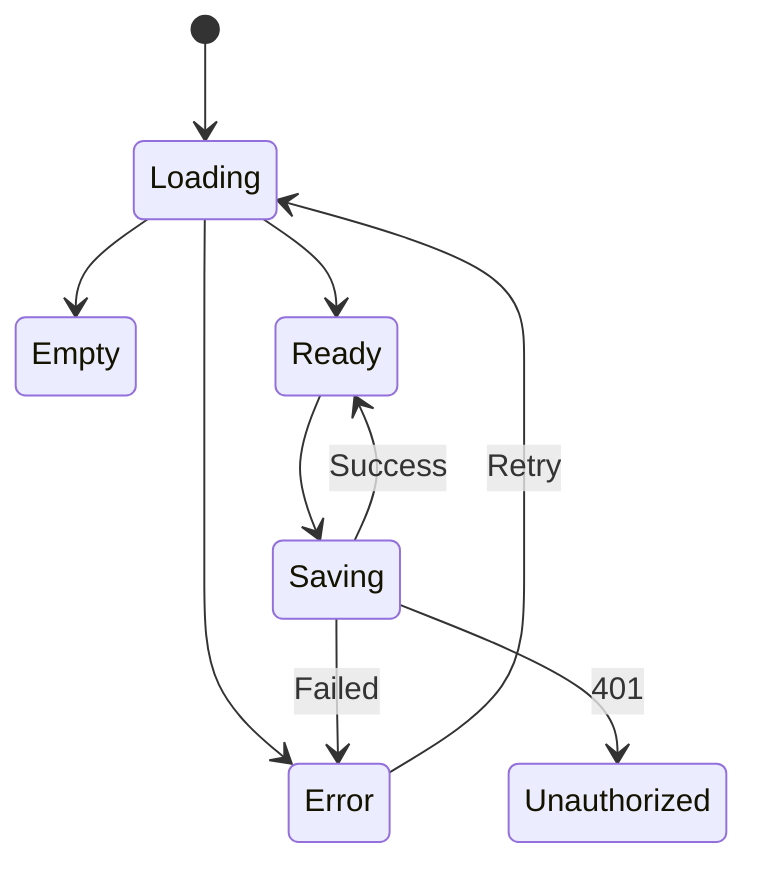

# Nuxt / Next 专项练习

## 这套练习解决什么

很多人读完 SSR、文件路由、Server Component 和缓存，真正做项目时仍然不知道先写什么。原因是只记住了概念，没有把每个概念变成可验证的项目结果。

这套练习围绕 [课程内容平台](/meta-frameworks/project-from-zero) 展开。你只选择 Nuxt 或 Next 一条路线，用 10 个逐步加深的练习完成：


## 适合谁看

适合已经掌握 Vue 或 React 基础，准备系统训练 Nuxt 或 Next 项目能力的人。

开始前建议完成：

- [图解 Nuxt / Next 元框架核心概念](/meta-frameworks/visual-guide)
- [Nuxt / Next 从零到项目：课程内容平台](/meta-frameworks/project-from-zero)
- [浏览器 HTTP 与请求流程](/browser/http-request)

## 练习规则

每个练习都按同一节奏执行：

1. 先写预期结果。
2. 只实现当前练习范围。
3. 同时验证直接刷新和站内跳转。
4. 主动制造一个失败。
5. 收集证据并修复。
6. 写下验收结果和下一步。

每次练习保留：

```text
docs/labs/lab-xx.md       目标、决策、证据和复盘
screenshots/              必要的页面与 DevTools 截图
tests/                    当前练习增加的测试
README.md                 持续更新实际命令和项目边界
```

截图必须隐藏 Cookie、令牌和私密环境变量。

## 路线选择

| 你的基础 | 推荐路线 | 不需要做什么 |
| --- | --- | --- |
| 熟悉 Vue 3、Composition API | Nuxt | 不必同时学习 React Server Component |
| 熟悉 React、Hooks | Next | 不必同时记 Nuxt composable |
| Vue 和 React 都会 | 先选项目要用的一套 | 不要为比较 API 写两份相同项目 |

练习的共同验收标准比框架 API 更重要：正确状态码、明确数据边界、无重复首屏请求、无用户数据公共缓存、生产构建可运行。

## 练习 1：文件路由与共享布局

### 目标

建立首页、课程列表、动态详情、登录页和学习中心的真实 URL，并让公开区与登录区使用清楚的布局。

### 任务

- 创建 `/`、`/courses`、`/courses/[slug]`、`/login`、`/dashboard`。
- 全站布局包含品牌导航和页脚。
- 学习中心布局包含用户导航，但不读取课程详情数据。
- 导航使用框架链接组件，不用 `href="#section"` 代替页面路由。
- 当前页面有可感知的标题和导航状态。

### 故障注入

故意把动态详情文件命名错一层，记录：

- 框架生成了什么 URL。
- 直接刷新返回什么状态。
- 你如何通过目录和路由检查定位。

### 验收

```text
[ ] 五条路由都能直接在新标签页打开
[ ] 不存在路由返回框架 404
[ ] 布局没有重复导航和重复 main
[ ] 页面标题能说明当前位置
[ ] 390px 宽度没有页面级横向滚动
```

### 交付物

画一张“目录文件 → URL → 使用布局”的 Mermaid 图，并放入 `docs/labs/lab-01.md`。

## 练习 2：服务端课程列表

### 目标

让公开课程列表在首屏 HTML 中可读，并且没有重复请求。

### 任务

- 定义 `CourseSummary`。
- 数据层返回至少 3 门课程。
- 页面在服务端获取列表。
- 覆盖成功、空数据和系统错误状态。
- 每个课程使用稳定 slug 作为 key 和 URL。

### 需要观察的证据

```text
页面源代码：是否包含课程标题
浏览器 Network：同一首屏 API 调用了几次
服务端日志：请求发生在哪个环境
HTML / RSC / payload：是否包含不需要的敏感字段
```

### 故障注入

在客户端挂载后无条件再取一次列表，观察重复请求和 loading 闪烁，再修复。

### 验收

- 页面源代码有课程标题。
- 首屏请求次数符合设计。
- 空数据不是空白页面。
- 数据层失败时能重试或给出 traceId。
- 列表没有返回课程完整章节正文。

## 练习 3：动态详情、404 和 metadata

### 目标

完成可分享、可索引、可直接刷新的课程详情。

### 任务

- 定义 `CourseDetail`。
- 从动态路由参数读取 slug。
- 查不到课程时使用框架 404 能力。
- 根据课程生成 title 和 description。
- 页面包含 H1、简介、章节列表和返回课程列表的真实链接。

### 测试样例

| 输入 | HTTP 状态 | 页面结果 |
| --- | ---: | --- |
| `/courses/vue-foundations` | 200 | 正确课程和 metadata |
| `/courses/not-exists` | 404 | 不存在页面 |
| `/courses/%20` | 404 | 不把空 slug 当正常课程 |

### 故障注入

把“课程不存在”写成普通组件并返回 200。使用 Network 发现状态码错误，再改为真正 404。

### 验收

- 直接刷新和站内跳转结果一致。
- 页面 title、description、H1 来自同一课程数据。
- 404 不进入 sitemap。
- 不存在页面不会被缓存成正常详情。

## 练习 4：最小客户端交互边界

### 目标

在不把整页改成客户端渲染的前提下，增加“标记课程完成”交互。

### 任务

- 详情主体保持服务端可渲染。
- 只有完成按钮及其状态进入客户端边界。
- 处理默认、保存中、成功、失败和禁用状态。
- 使用 `aria-live` 宣布保存结果。
- 防止快速重复点击造成重复写入。

### 故障注入

让接口延迟 2 秒并连续点击按钮，观察是否发生重复提交。

### 验收

```text
[ ] 禁用 JavaScript 时仍能阅读课程正文
[ ] 启用 JavaScript 后按钮可操作
[ ] 保存中按钮不可重复触发
[ ] 失败后可以重试
[ ] 客户端 bundle 没有因为一个按钮包含整个数据访问层
```

## 练习 5：Cookie 会话与受保护学习中心

### 目标

让服务器在直接请求 `/dashboard` 时识别当前用户，并确保未登录用户不能读取进度。

### 任务

- 使用成熟认证方案或本地教学 session 实现登录。
- 会话标识放 HttpOnly Cookie；生产环境启用 Secure，并根据业务选择合理的 SameSite、Path 和有效期。
- 登录后跳回经过校验的站内 redirect。
- 学习中心在服务端验证 session。
- Progress API 再次验证 session，不依赖页面守卫。
- 所有写接口校验 CSRF token 或可信 Origin，不能只依赖前端页面入口。
- 退出登录使服务端会话失效并清理客户端状态。

### 安全边界


### 故障注入

在请求体添加另一个用户的 `userId`。服务端必须忽略或拒绝，不能修改对方数据。

### 验收

- 未登录直接刷新学习中心仍被保护。
- 过期会话得到明确 401 或登录跳转。
- Cookie 具备 HttpOnly、生产 Secure、合理 SameSite、Path 和过期时间。
- 退出登录或管理员撤销后，旧会话不能继续使用。
- 跨站伪造的 Progress 写请求被 CSRF token 或 Origin 校验拒绝。
- 无权限写进度返回 403。
- 两个测试账号的数据完全隔离。
- 日志中没有完整 Cookie 和密码。

## 练习 6：路由级缓存策略

### 目标

让公开课程页得到缓存收益，同时保证个人学习中心永远不会被公共缓存。

### 任务

- 为每条路由写缓存决策表。
- 公开列表和详情设置明确新鲜度。
- `/dashboard` 和 `/api/progress` 设置私有或 no-store 策略。
- 课程更新后按路径、标签或内容版本刷新。
- 在生产预览环境观察实际响应头。

### 故障注入

在本地假数据环境临时给 `/dashboard` 加公共缓存，使用两个测试账号观察风险，然后立即还原。

### 证据表

| 路由 | Cache-Control / 框架策略 | 第一次内容版本 | 更新后内容版本 | 是否符合目标 |
| --- | --- | --- | --- | --- |
| `/courses` |  |  |  |  |
| `/courses/vue-foundations` |  |  |  |  |
| `/dashboard` |  |  |  |  |

### 验收

- 公开课程在约定时间内更新。
- 学习中心响应不进入公共缓存。
- 两个用户不会串数据。
- 能说清 CDN、框架、API 和 Redis 各自是否缓存。

## 练习 7：hydration 与浏览器专用组件

### 目标

能主动复现并修复 hydration mismatch，理解服务端和客户端首次输出必须一致。

### 任务

- 在首屏加入当前时间或随机推荐，复现问题。
- 对比页面源代码和 hydration 后 DOM。
- 将不稳定输入改为服务端提供的稳定值，或延后到客户端显示。
- 引入一个依赖浏览器 API 的小组件，并建立最小客户端边界。

### 排查记录

```md
## 服务端首次输出

## 客户端首次输出

## 两者为什么不同

## 最小修复边界

## 为什么不关闭整页 SSR
```

### 验收

- 连续硬刷新不再出现 hydration 警告。
- 页面不闪烁。
- 浏览器专用依赖不在服务端执行。
- 公开正文仍由服务端输出。

## 练习 8：加载、空、错误和会话失效

### 目标

让失败状态成为页面设计的一部分，而不是出了错才补一句提示。

### 任务

- 课程列表支持加载、空、错误、成功。
- 详情支持 404 和系统错误。
- 保存进度支持 pending、success、error。
- 会话过期时停止继续提交并提示重新登录。
- 错误日志包含 traceId，页面只展示安全信息。

### 状态图



### 故障注入

- 列表返回空数组。
- repository 抛出超时。
- 进度接口返回 401。
- 动态详情返回不存在。

### 验收

每种状态都有可理解页面、正确状态码和下一步操作；未知错误可通过 traceId 在服务端定位。

## 练习 9：生产构建和部署冒烟

### 目标

验证项目在真实部署形态中工作，不依赖开发服务器的宽松行为。

### 任务

- 执行生产构建。
- 启动生产预览或正式 server。
- 记录部署形态：Node、Docker、Serverless、Edge 或静态。
- 检查私有和公开环境变量。
- 直接打开所有关键路由。
- 检查健康接口、服务端日志和回滚步骤。

### 故障注入

选择一个与项目能力不匹配的部署假设，例如“纯静态托管仍能运行 Progress API”，在文档中解释为什么不成立以及正确替代方案。

### 冒烟清单

```text
[ ] 首页与课程正文可访问
[ ] 动态详情刷新不 404
[ ] 不存在课程返回 404
[ ] 登录、退出和会话过期正常
[ ] 进度写入后立即可见
[ ] 用户页面不公共缓存
[ ] 内容更新按策略刷新
[ ] 日志能定位请求且不泄密
[ ] 回滚命令或平台操作已验证
```

## 练习 10：完整事故复盘

### 目标

选择前九个练习中最难的一次故障，完成可复用复盘。

### 必须包含

- 影响和时间线。
- 复现条件。
- 浏览器、服务端、缓存和部署证据。
- 根因，而不只是报错文字。
- 临时止损与长期修复。
- 自动化测试、监控和文档改进。

### 根因链示例


最后一个节点通常才是值得长期修复的系统原因。

### 验收

- 另一个开发者只看复盘就能理解和验证修复。
- 新测试在旧代码上能够失败，在修复后通过。
- 发布或运维清单新增了预防项。
- 问题条目可以映射到 [Nuxt / Next 真实项目问题库](/projects/issues-meta-frameworks)。

## 14 天建议节奏

| 天数 | 任务 | 当天产出 |
| ---: | --- | --- |
| 1 | 图解核心概念、选择 Nuxt 或 Next | 一页运行环境图 |
| 2 | 练习 1 | 路由与布局 |
| 3 | 练习 2 | 服务端课程列表 |
| 4 | 练习 3 | 详情、404、metadata |
| 5 | 练习 4 | 最小客户端交互 |
| 6 | 补状态和可访问性 | 状态清单 |
| 7 | 练习 5 上半 | 登录与 Cookie 会话 |
| 8 | 练习 5 下半 | 权限与用户隔离测试 |
| 9 | 练习 6 | 缓存策略与证据表 |
| 10 | 练习 7 | hydration 故障复盘 |
| 11 | 练习 8 | 完整错误状态 |
| 12 | 自动化测试 | 核心回归测试 |
| 13 | 练习 9 | 生产构建和部署冒烟 |
| 14 | 练习 10 | 事故复盘与项目说明 |

时间不够时，优先保证练习 1、2、3、5、6、9 完整，不要把登录、缓存和生产构建删掉只留下页面样式。

## 最终项目验收

### 能运行

- 新成员根据 README 可以启动和构建。
- 关键路由直接刷新可用。
- 生产预览行为与目标部署一致。

### 能解释

- 能解释每条路由为什么使用当前渲染策略。
- 能说清服务端、浏览器和构建时分别运行什么。
- 能解释公开缓存和用户态缓存边界。

### 能排错

- 能根据页面源代码判断 SSR 是否成功。
- 能识别 hydration、缓存、会话和运行时问题。
- 能收集浏览器、服务端和平台证据。

### 能交付

- 有测试、部署、回滚和故障复盘。
- 没有把密钥交给浏览器。
- 用户数据通过服务端会话隔离。
- 公开内容具备正确状态码和 metadata。

## 练习记录模板

```md
# Lab XX：练习名称

## 目标与非目标

## 路由和数据边界

## 实现决策

## 正常流程证据

## 故障注入

### 症状

### 浏览器证据

### 服务端证据

### 根因

### 修复

## 验收结果

## 下次如何更快定位
```

## 下一步学习

完成 10 个练习后，把 Course Hub 接到一个真实 CMS 或数据库，并重新审视缓存失效和数据权限。排错时继续使用 [Nuxt / Next 真实项目问题库](/projects/issues-meta-frameworks)，部署前复查 [部署、缓存与运行时](/meta-frameworks/deployment)。
