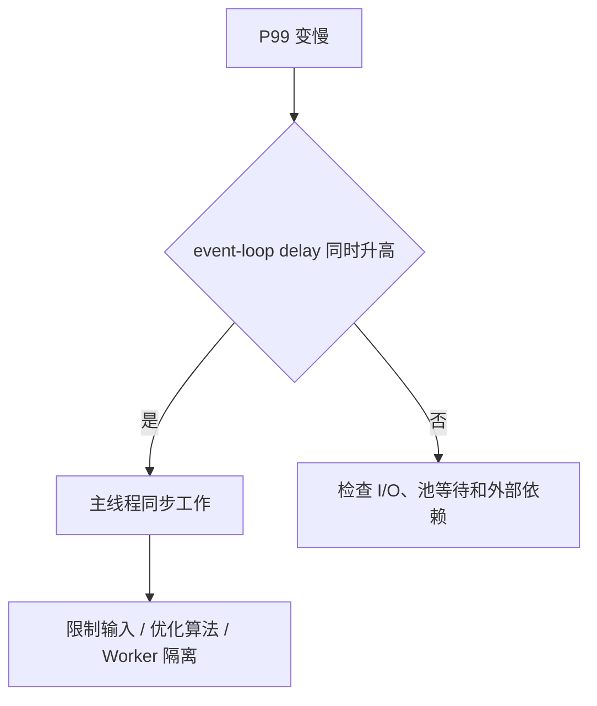
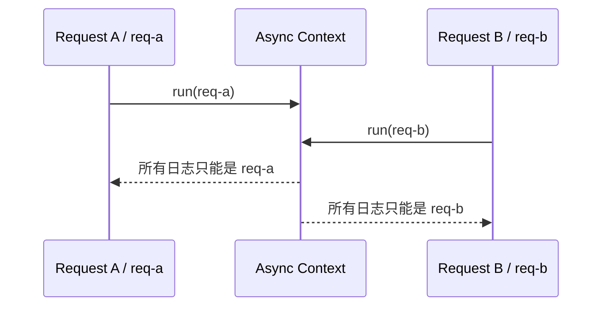
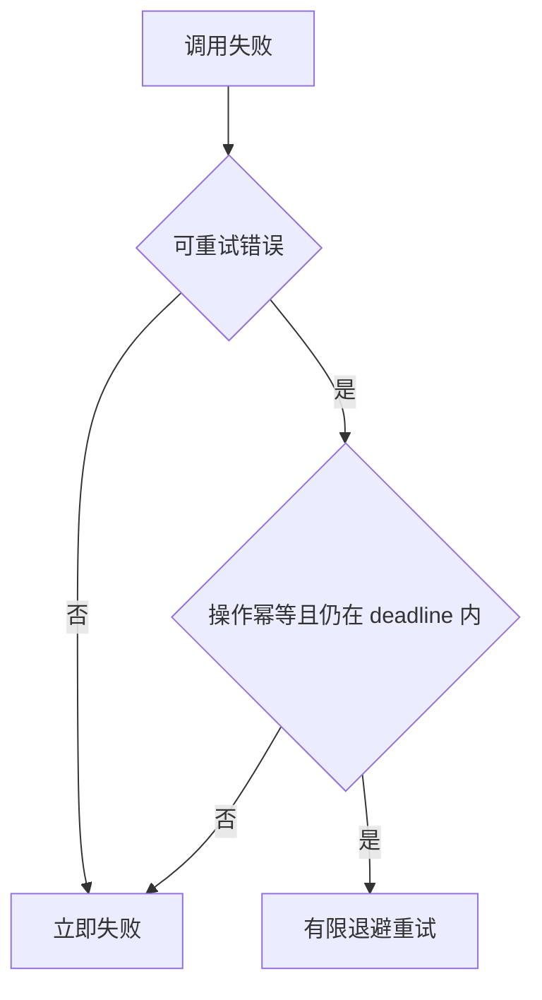
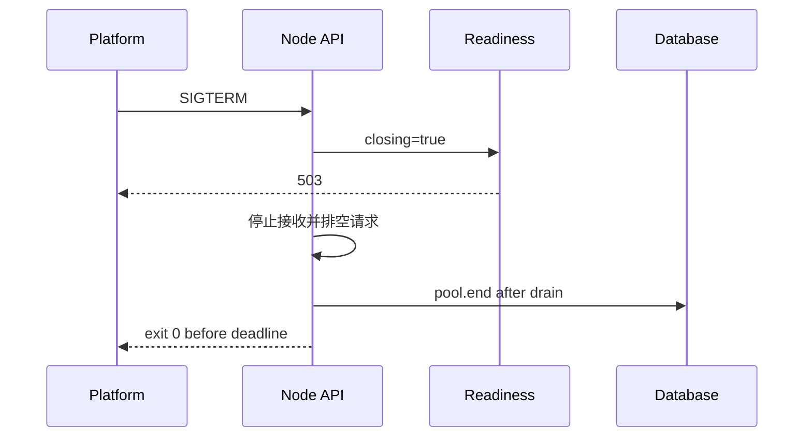

# Node.js 专项练习

## 适合谁看

适合已经完成 [Node.js 学习导览](/node/introduction)，并至少能启动一个 Node API 项目的人。练习不再重复写第三套 CRUD，而是在 [Node 权限 API 从零到项目](/node/permission-api-project) 和 [Redis 缓存与 BullMQ 队列项目](/node/cache-queue-project) 上注入真实运行时故障。

如果你还不能独立完成路由、数据库和认证，先做权限 API；如果问题属于接口契约、事务、幂等或 401/403，使用 [后端接口与服务问题](/projects/issues-backend)，不要误归为 Node 运行时问题。

## 练习目标


完成后你应该能：

- 证明开发运行器与生产 Node 使用同一模块和入口契约。
- 用事件循环、CPU、线程池和内存证据解释性能问题。
- 正确处理 Stream 背压、取消、HTTP 连接和异步上下文。
- 找出阻止测试退出的资源句柄。
- 完成 SIGTERM 排空和多实例状态演练。
- 为每个故障留下可重复的证据、回归和预防规则。

## 统一实验规则

每个练习建立独立分支或提交点，并保留三组结果：

```text
baseline/       正常基线日志和指标
broken/         故障注入后的复现证据
fixed/          修复后同条件回归证据
```

排障记录统一使用：

```text
练习编号：
环境：Node / OS / CPU / 容器：
负载：并发、请求大小、持续时间：
现象：
第一条异常证据：
排除过的假设：
根因：
修复与取舍：
回归命令和结果：
预防规则：
```

不要改变负载后再比较修复前后结果。事件循环延迟、内存和吞吐必须在相同输入下对照。

## 练习 1：生产入口与依赖可复现

### 目标

证明项目不依赖编辑器、全局 CLI、宿主机 `node_modules` 或开发运行器的隐式能力。

### 任务

1. 删除 `node_modules` 和 `dist`，只保留仓库文件。
2. 执行 `npm ci`、typecheck、test、build。
3. 用 `node dist/src/server.js` 启动生产入口。
4. 使用多阶段 Dockerfile 在镜像内重新安装依赖。
5. 输出 Node 主版本、`package.json` type 和最终文件树。

### 故障注入

- 把一个相对导入改成省略 `.js` 后缀。
- 把 Docker CMD 改为 `dist/server.js`。
- 从 macOS 复制 `node_modules` 到 Linux 镜像。
- 本地 Node 26 安装依赖，运行时切换到 Node 24。

### 完成证据

```bash
npm ci
npm run typecheck
npm test
npm run build
find dist -maxdepth 3 -type f | sort
docker build --no-cache -t node-permission-api:practice .
```

- [ ] 生产入口从干净环境启动。
- [ ] 错误入口能稳定复现，并在 README 写明根因。
- [ ] 本地、CI 和镜像固定 Node 24 主版本。

## 练习 2：事件循环延迟与 Worker Threads

### 目标

亲自证明“异步 API”并不能保护主线程免受同步 CPU 计算影响，并学会决定何时使用 Worker。

### 实验接口

创建两个只用于练习的路由：

```js
app.get('/practice/cpu', async () => {
  let result = 0
  for (let index = 0; index < 200_000_000; index += 1) result += index
  return { result }
})

app.get('/practice/io', async () => {
  await new Promise((resolve) => setTimeout(resolve, 200))
  return { ok: true }
})
```

### 任务

1. 记录无负载时 `/health/live` P50/P99。
2. 并发请求 `/practice/io`，观察健康检查。
3. 并发请求 `/practice/cpu`，记录事件循环延迟与 CPU profile。
4. 把 CPU 计算迁移到复用的 Worker 池。
5. 在相同并发下重新测量。

### 判断标准



- [ ] 能说明 Worker 创建、消息复制/转移和池管理成本。
- [ ] 修复后 CPU 路由仍有总成本，但无关健康检查不再同幅阻塞。

## 练习 3：libuv Worker Pool 饱和实验

### 目标

区分 JavaScript 主线程阻塞与线程池排队。

### 任务

1. 并发执行高成本 `scrypt`，逐个记录提交时间和完成时间。
2. 同时执行一个依赖线程池的文件或 DNS 实验。
3. 观察事件循环延迟可能正常，但任务完成时间呈批次增长。
4. 增加应用级并发信号量，把超额任务排在明确队列中。
5. 对比调整 `UV_THREADPOOL_SIZE` 前后 CPU、内存、吞吐和尾延迟。

### 故障注入

取消登录限流并发起大量错误密码请求。不要在共享或公网环境执行。

### 完成标准

- [ ] 能画出任务提交、worker 数和排队关系。
- [ ] 不用“把线程池设得很大”作为唯一修复。
- [ ] 在线 API 的昂贵任务有并发预算和 429/排队策略。

## 练习 4：Promise 错误和单次响应边界

### 目标

让可预期请求错误进入 Fastify error handler，让真正未处理错误触发进程退出策略，并杜绝重复响应。

### 注入列表

```text
A. handler 中 await 一个 reject Promise
B. 启动 Promise 后既不 await 也不 catch
C. 404 reply.send 后没有 return
D. 500ms timeout 与 500ms 成功结果竞态
E. callback 和 async return 同时发送
```

### 任务

1. 为 A-E 分别写 `app.inject()` 或子进程测试。
2. 记录响应状态、日志、是否出现 `ERR_HTTP_HEADERS_SENT`、进程退出码。
3. 请求错误只返回一次稳定响应。
4. 后台 Promise 进入统一 supervisor。
5. 未处理 rejection 记录 fatal 并进入有期限关闭，不继续长期服务。

### 验收

- [ ] 可预期错误不导致进程退出。
- [ ] 未捕获异常不会被吞掉后继续运行。
- [ ] 同一请求任何竞态下最多发送一次响应。

## 练习 5：AsyncLocalStorage request id 隔离

### 目标

让 request id 跨 Promise、timer、数据库和 callback 链路传播，并证明高并发下不会串线。

### 任务

1. 创建 `AsyncLocalStorage`，store 只保存 `requestId` 和 `actorId`。
2. 在请求入口使用 `run()` 包裹后续工作。
3. 在 Service、Repository 和异步任务中读取 store 写日志。
4. 并发执行 1000 条带不同 ID 的请求。
5. 引入一个 callback 库或自定义 thenable，定位第一次丢失上下文的位置。
6. 使用 `promisify`、`AsyncResource` 或 `AsyncLocalStorage.bind()` 修复。

### 结果校验



- [ ] 任何一条日志都没有错误 request id。
- [ ] store 不保存可被多个分支修改的共享业务对象。

## 练习 6：大文件 Stream、背压和中断清理

### 目标

在文件大小明显大于进程可用内存时仍保持稳定 RSS，并处理慢消费者和客户端取消。

### 任务

1. 生成一个 1 GB 稀疏或测试文件。
2. 先用 `readFile()` 实现下载并记录 RSS。
3. 改用 `createReadStream()` 和 `pipeline()`。
4. 用限速客户端模拟慢消费者。
5. 下载中途断开，确认 Stream、文件描述符和临时文件被清理。
6. 为上传增加单文件、总大小、文件数、类型和处理时长限制。

### 证据

```text
时间 | RSS | heapUsed | external | arrayBuffers | 已发送字节 | 客户端状态
```

### 验收

- [ ] RSS 不随文件完整大小线性增长。
- [ ] 慢消费者会触发上游暂停，不无限积压。
- [ ] 取消和错误路径没有残留文件或句柄。

## 练习 7：外部依赖超时、取消和连接池

### 目标

为出站 HTTP 建立总 deadline、取消、有限重试和连接池预算。

### 模拟服务

准备一个可配置接口，分别返回：立即 200、延迟 10 秒、503、响应头后不结束、主动断开 socket。

### 任务

1. 使用全局 `fetch` 调用，确认它基于 Undici dispatcher，不套用 `http.Agent` 配置。
2. 每次调用传入 AbortSignal 和总 deadline。
3. 只对幂等 GET 的明确瞬时错误重试，使用指数退避、抖动和总次数上限。
4. 确认响应体被消费或取消。
5. 记录 active/pending 连接与业务耗时。

### 防止重试放大



- [ ] 客户端断开或 deadline 到期后上游立即收到 abort。
- [ ] POST 写操作没有未经幂等设计的自动重试。
- [ ] 连接数和待处理队列有明确上限。

## 练习 8：Buffer、Timer 和 EventEmitter 泄漏

### 目标

学会区分 V8 heap、堆外 Buffer、listener 和 timer 泄漏。

### 注入三个故障

```js
const buffers = []
setInterval(() => buffers.push(Buffer.alloc(1024 * 1024)), 100)

setInterval(() => {}, 60_000)

function reconnect() {
  bus.on('message', handleMessage)
}
```

### 任务

1. 每秒记录 `rss/heapUsed/external/arrayBuffers`。
2. 用 heap snapshot 确认 Buffer wrapper 和 listener 引用链。
3. 统计 event listener 数和活动资源。
4. 实现有上限缓存、timer clear 和 listener 对称移除。
5. 连续执行 30 分钟负载，确认曲线回到稳定平台。

### 验收

- [ ] 能解释为什么只看 heapUsed 会漏掉 Buffer 问题。
- [ ] 不通过提高 max listeners 掩盖泄漏。
- [ ] 测试 teardown 显式关闭 timer 和 emitter。

## 练习 9：`node:test` Open Handles

### 目标

让测试自然退出，不使用强制退出掩盖资源泄漏。

### 故障注入

- 在测试导入 `server.ts`，模块顶层立即监听端口。
- 创建数据库池后不 `end()`。
- 创建 interval、Worker 和 socket 后不关闭。
- Fastify `buildApp()` 使用后不 `app.close()`。

### 任务

1. 为每种资源编写失败测试，观察命令挂起。
2. 将应用工厂和进程入口拆分。
3. 在 `after` 或 `finally` 对称关闭。
4. 重复运行测试 20 次，检查端口占用和随机失败。

### 验收

```bash
time npm test
npm test && npm test
```

- [ ] 不使用 `--test-force-exit`。
- [ ] 连续运行没有端口冲突、残留容器或共享脏数据。

## 练习 10：反向代理信任边界

### 目标

在真实代理拓扑下正确识别客户端 IP、协议和 host，并阻止绕过代理伪造头。

### 任务

1. 在 Nginx 前后分别记录 socket IP 和 forwarded headers。
2. 默认关闭任意 proxy trust，观察 `request.ip`。
3. 只信任明确代理地址/跳数。
4. 客户端自行发送伪造 `X-Forwarded-For`，确认代理覆盖或清洗。
5. 测试 HTTP 到 HTTPS 重定向和 Secure Cookie。
6. 从网络层阻止公网直连应用端口。

### 验收

- [ ] 直接伪造 forwarded headers 不能绕过限流或审计。
- [ ] 多层代理下取到的客户端 IP 与架构图一致。
- [ ] 没有 HTTPS 重定向循环。

## 练习 11：SIGTERM 与优雅停机

### 目标

在滚动发布中停止新流量、完成在途请求、释放资源并在期限内退出。

### 演练时间线



### 任务

1. 创建稳定执行 3 秒的请求。
2. 请求中发送 SIGTERM。
3. 检查 readiness 先失败，原请求仍完成。
4. 确认新连接不再进入，数据库池最后关闭。
5. 注入永不结束请求，确认总关闭期限生效并非零退出。
6. 连续发送 SIGTERM/SIGINT，关闭逻辑只能执行一次。

### 验收

- [ ] 正常排空退出码为 0。
- [ ] 超时有 fatal 日志和非零退出码。
- [ ] 发布期间错误率没有明显尖峰。

## 练习 12：多实例状态和队列幂等

### 目标

消除“只有一个 Node 进程”的隐含假设。

### 任务

1. 启动两个权限 API 实例，通过代理随机分流。
2. 把会话先放进实例内存，复现登录随机失效，再改为共享会话存储。
3. 给每个实例启动同一个 cron，复现重复执行。
4. 使用分布式锁、唯一任务或专用调度器保证调度入口。
5. 让 BullMQ Worker 在副作用完成后、ack 前崩溃，观察任务重投。
6. 使用业务幂等键和数据库唯一约束防止重复结果。
7. 修改权限并验证两个实例立即或在定义的 TTL 内一致。

### 多实例验收

| 场景 | 预期结果 |
| --- | --- |
| 登录后随机访问 A/B | 会话持续有效 |
| 权限变更 | 所有实例按约定时间看到新权限 |
| cron 触发 | 业务结果只有一份 |
| Worker 崩溃重投 | 任务可重试，但副作用不重复 |
| 实例重启 | 不丢失唯一事实数据 |

## 14 天推进节奏

| 天数 | 练习 | 当天必须产出 |
| ---: | --- | --- |
| 1 | 1 | 干净构建和生产入口记录 |
| 2-3 | 2 | event-loop 基线、CPU profile、Worker 对照 |
| 4 | 3 | worker pool 排队图和并发预算 |
| 5 | 4 | 五种错误/响应竞态测试 |
| 6 | 5 | 1000 并发上下文隔离报告 |
| 7 | 6 | 大文件 RSS 和背压曲线 |
| 8 | 7 | 超时、取消、重试和连接证据 |
| 9 | 8 | 四类内存指标和泄漏修复 |
| 10 | 9 | 无强制退出的稳定测试 |
| 11 | 10 | 代理信任拓扑和伪造测试 |
| 12 | 11 | SIGTERM 发布时间线 |
| 13-14 | 12 | 双实例与队列幂等演练 |

每天只处理一类主要证据。不要同一天同时改运行时版本、负载、数据库和应用代码，否则无法说明哪个变量导致结果变化。

## 最终交付物

```text
node-runtime-lab/
├─ README.md
├─ environment.txt
├─ baseline/
├─ broken/
├─ fixed/
├─ profiles/
├─ load-tests/
├─ DEBUG_NOTES.md
├─ SHUTDOWN_TIMELINE.md
├─ MULTI_INSTANCE_NOTES.md
└─ RELEASE_CHECKLIST.md
```

`DEBUG_NOTES.md` 至少包含五份完整问题记录，且覆盖：性能、内存/资源、网络/取消、测试、发布/多实例。

## 评分标准

| 维度 | 0 分 | 1 分 | 2 分 |
| --- | --- | --- | --- |
| 可复现 | 只能口述 | 有零散命令 | 干净环境一键复现 |
| 证据 | 只看报错 | 有单项指标 | 时间线和多指标互相印证 |
| 根因 | 凭经验猜 | 能定位模块 | 能解释运行时机制和触发条件 |
| 修复 | 重启/加资源 | 修复当前症状 | 同时说明取舍、边界和预防 |
| 回归 | 手工点一次 | 有固定请求 | 自动测试和同负载对照 |
| 交付 | 无文档 | 有结果截图 | 环境、命令、证据和结论完整 |

总分 10-12：可以进入真实 Node 服务交付；7-9：继续补最弱两项；0-6：回到 [图解 Node.js 核心概念](/node/visual-guide) 和 [Node.js 真实项目问题库](/projects/issues-node)，先建立证据路径。

## 最终检查

- [ ] 所有实验固定 Node 24、依赖锁文件和负载条件。
- [ ] 能区分事件循环阻塞、worker pool 排队和外部 I/O 慢。
- [ ] 能区分 heap、external、arrayBuffers 和 RSS。
- [ ] Stream 在慢消费、错误和取消时都能清理。
- [ ] 出站 HTTP 有 deadline、取消、连接和重试预算。
- [ ] 高并发 AsyncLocalStorage 不丢失、不串线。
- [ ] 测试自然退出，无强制 exit。
- [ ] SIGTERM 和多实例演练有真实时间线。
- [ ] 每个修复都包含同条件回归和预防规则。

## 下一步学习

完成后按 [Node.js 真实项目问题库](/projects/issues-node) 复盘至少五个问题，并把结论回写项目 README、测试和发布清单。需要补通用接口与数据库能力时，继续 [后端 API 综合项目](/roadmap/practice-labs#练习-65后端-api-综合项目) 和 [数据库学习导览](/database/introduction)。
