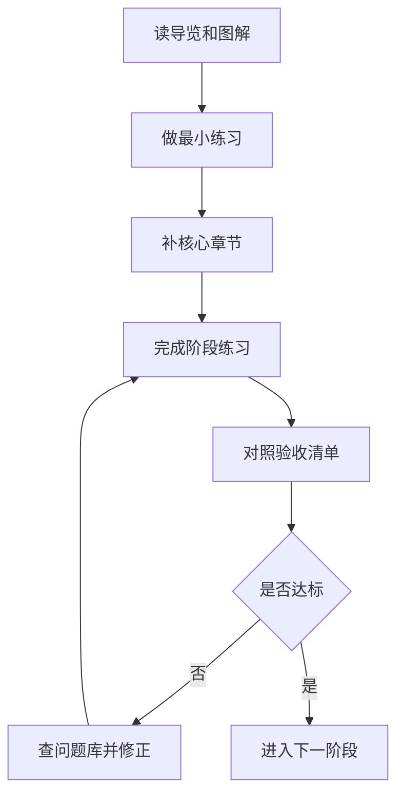
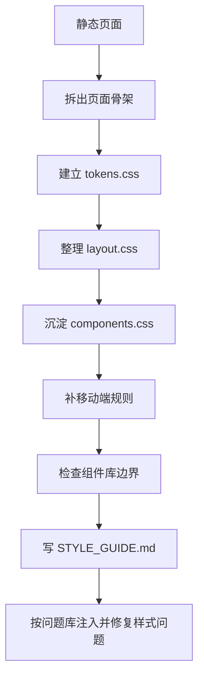
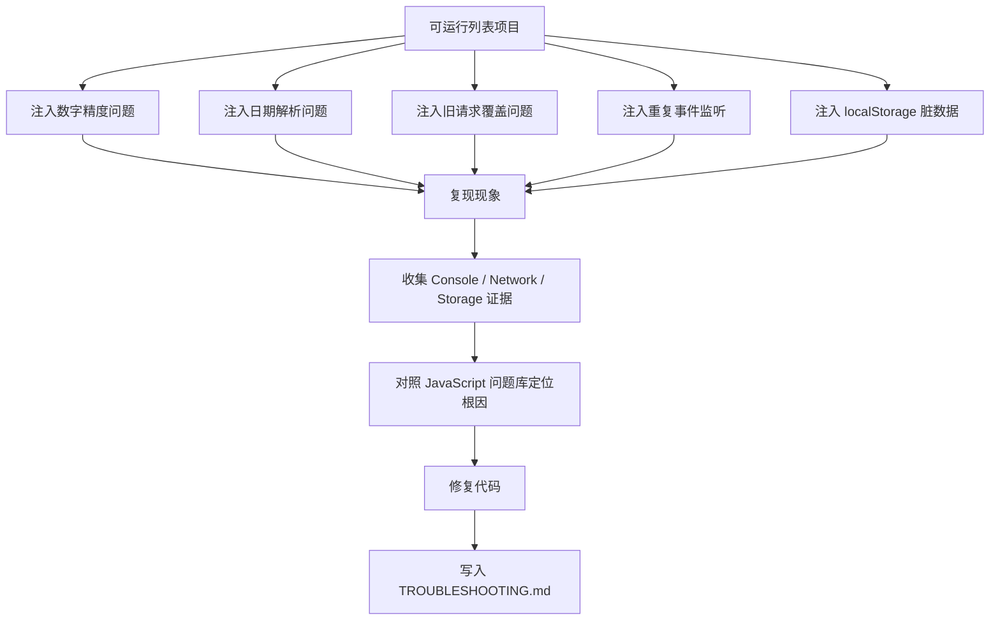
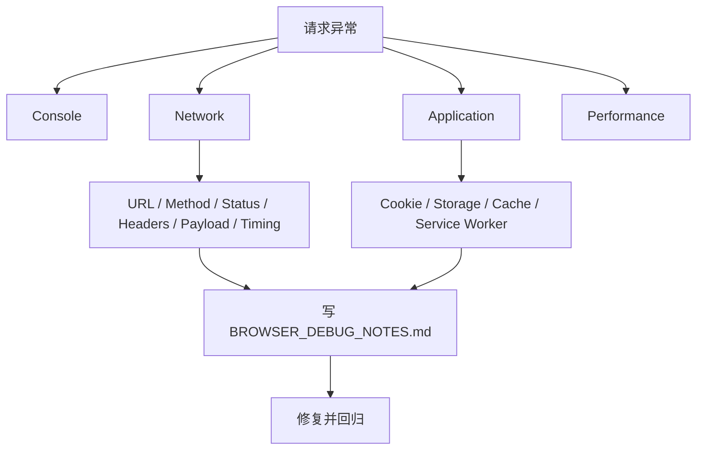
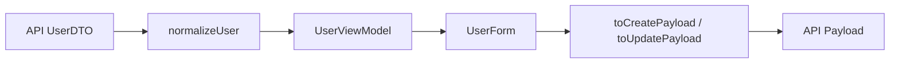
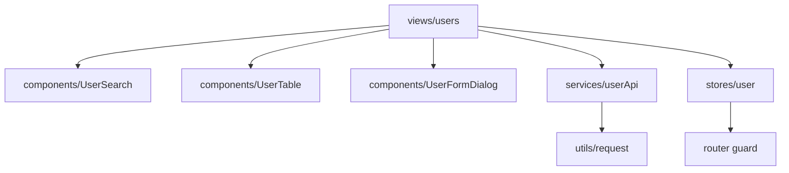
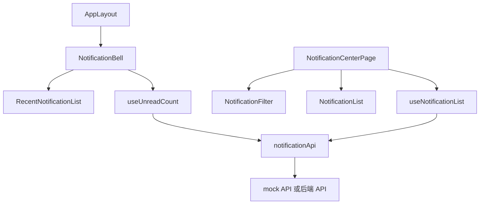
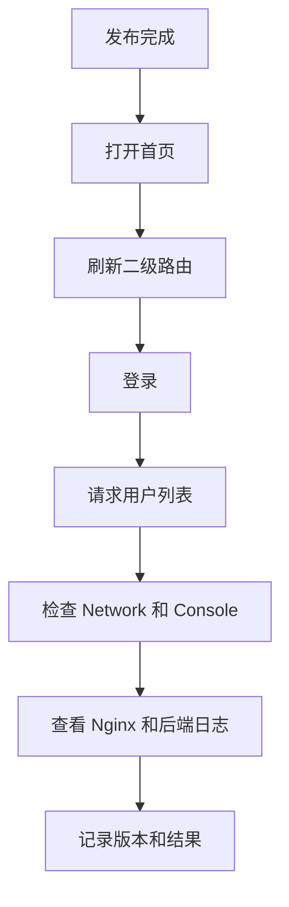
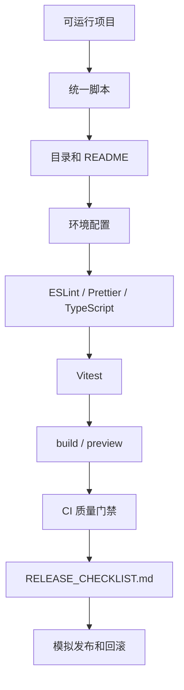

# 学习路径练习包

## 适合谁看

适合已经开始按路线学习，但发现“看懂了文档，自己做项目还是卡住”的人。

这篇不是新的知识点，而是把现有文档变成一组可执行练习。你可以把它当作训练计划：每个练习都有目标、准备文档、任务步骤、验收标准、常见错误和进阶挑战。

## 这篇解决什么

只读文档很容易产生错觉：概念都懂，但真正写项目时不知道从哪里下手。练习包要解决三个问题：

- 把大路线拆成可以当天完成的小任务。
- 让每个任务都有可检查的产出。
- 把常见错误提前暴露出来，减少无效试错。

练习推进顺序建议如下。如果你的目标是后台管理系统，建议先把 [Vue Admin 学习地图与交付清单](/roadmap/vue-admin-learning-map) 作为总路线，再按本页挑选练习。完成基础练习后，可以进入 [前端综合实战练习](/roadmap/frontend-capstone-lab)，用一个 Vue Admin 工作台把 CSS、浏览器、工程化、Vue、权限、问题库和交付验收串起来。



## 使用规则

每个练习都按这个节奏执行：

1. 先读“准备文档”，不要一次打开太多页面。
2. 按任务步骤完成最小可运行版本。
3. 对照验收标准逐项检查。
4. 把遇到的问题写进 `LEARNING_NOTES.md`。
5. 如果卡住超过 30 分钟，去问题库按现象查。
6. 完成后再做进阶挑战，不要一开始就追求复杂。

建议每个练习都保留这些文件：

```text
README.md              项目说明、启动方式、练习目标
LEARNING_NOTES.md      卡点、错误、解决方案
CHANGELOG.md           每次练习完成了什么
```

## 综合练习入口

如果你已经完成前 3 个基础练习，不要急着继续堆新知识。更推荐进入 [前端综合实战练习](/roadmap/frontend-capstone-lab)，用一个项目同时验证：

- 页面骨架和样式系统是否可维护。
- 浏览器请求、缓存、登录态和性能证据是否能说清楚。
- Vue Router、Pinia、请求封装、表单、权限和列表 CRUD 是否能协同工作。
- 工程化检查、发布清单和问题复盘是否能支撑真实交付。

这个综合练习更像项目验收，不是单点知识训练。如果你在综合练习里卡住，再回到本页选择对应的小练习补短板。

## 练习 1：可维护静态页面

### 目标

做一个能在桌面和移动端稳定展示的页面，重点练 HTML 结构、CSS 布局、响应式和浏览器调试。

### 准备文档

- [前端基础](/frontend/html-css)
- [CSS 学习导览](/css/introduction)
- [盒模型与布局基础](/css/box-model-layout)
- [Flex 与 Grid](/css/flex-grid)
- [响应式设计](/css/responsive)
- [浏览器学习导览](/browser/introduction)

### 任务步骤

1. 创建一个静态页面项目。
2. 页面包含头部导航、主要内容区、列表区和底部信息。
3. 列表区至少有 6 条数据。
4. 桌面端使用两栏或三栏布局。
5. 移动端改为单栏布局。
6. 给按钮和链接增加 hover、focus 状态。
7. 用 DevTools 检查 Console、Network、Elements 和移动端视口。

### 验收标准

- 页面有清晰的 `header`、`main`、`footer`。
- 移动端宽度 390px 下没有横向滚动。
- 图片或图标有稳定宽高。
- 文本不会压到按钮或图片上。
- CSS 选择器不使用 `.page div`、`.content *` 这类宽泛写法。
- 控制台没有错误。

### 常见错误

| 错误 | 后果 | 修正方式 |
| --- | --- | --- |
| 全部写固定宽度 | 移动端横向溢出 | 使用 `max-width`、百分比、Grid/Flex |
| 图片不设尺寸 | 加载时页面抖动 | 设置宽高或 `aspect-ratio` |
| 按钮只靠颜色区分 | 可访问性差 | 增加文字、图标、focus 状态 |
| CSS 后代选择器太宽 | 后续组件容易被污染 | 使用明确业务 class |

### 进阶挑战

- 增加暗色模式。
- 增加筛选输入框。
- 给列表增加空状态。
- 用 Lighthouse 检查基础性能和可访问性。

### 加练：CSS 项目样式系统

完成静态页面后，不要只停留在“页面能看”。真实项目还要能解释样式从哪里来、为什么不会污染组件库、移动端如何验收、后续如何换主题。这个加练会把静态页面升级成一个小型后台样式系统。

#### 加练准备

- [CSS 从零到项目落地](/css/project-from-zero)
- [项目样式架构](/css/architecture)
- [设计 Token 与主题](/css/design-tokens)
- [CSS 真实项目问题库](/projects/issues-css)

#### 样式系统落地图



#### 必做任务

| 任务 | 要求 | 产出 |
| --- | --- | --- |
| 建立样式目录 | 拆出 `tokens.css`、`base.css`、`layout.css`、`components.css` | `src/styles/` |
| 定义 token | 颜色、间距、圆角、阴影、层级都用 CSS 变量 | `tokens.css` |
| 重做页面骨架 | 有 `app-header`、`app-sidebar`、`app-main`、`content-panel` | 页面结构截图 |
| 做工具栏 | 搜索区和按钮区能在窄屏下换行 | 桌面和 390px 截图 |
| 做表格容器 | 字段多时只让表格区域横向滚动 | 横向溢出检查记录 |
| 做固定元素 | 头像、状态点、图标按钮设置稳定宽高和不可压缩 | CSS 代码片段 |
| 写样式指南 | 说明 token、选择器规则、禁止写法和验收清单 | `STYLE_GUIDE.md` |

#### 验收标准

- 390px、768px、1440px 三个宽度下页面整体没有横向滚动。
- 不使用 `.page div`、`.content *`、`div > div` 这类宽泛后代选择器。
- 图标按钮、头像、状态点不会被工具栏或表格挤压变形。
- 工具栏和表格在移动端仍然可读可操作。
- 暗色模式或主题变量切换后，文字和边框仍然清楚。
- `STYLE_GUIDE.md` 能让另一个开发者知道如何新增页面样式。

#### 故障注入

| 故障 | 注入方式 | 修复方向 |
| --- | --- | --- |
| 横向滚动 | 给表格或卡片设置固定 `width: 1200px` | 改用 `minmax(0, 1fr)`、容器滚动和响应式规则 |
| 组件库污染 | 写 `.toolbar button { width: 100%; }` | 改成明确业务 class 或组件库 token |
| 状态点变形 | 删除状态点的 `flex: 0 0 8px` | 补稳定宽高和不可压缩 |
| 弹层遮挡 | 给父容器加 `overflow: hidden` 或错误 `z-index` | 梳理层叠上下文和弹层挂载位置 |

## 练习 2：JavaScript 列表交互

### 目标

用原生 JavaScript 完成一个可筛选、可排序、可分页的列表，理解数据处理、事件、异步和错误处理。

### 准备文档

- [JavaScript 学习导览](/javascript/introduction)
- [图解 JavaScript 核心概念](/javascript/visual-guide)
- [数组与对象处理](/javascript/array-object)
- [DOM 事件](/javascript/dom-events)
- [异步编程](/javascript/async)
- [项目落地实践](/javascript/project-practice)
- [任务看板从零到项目](/javascript/task-board-project)
- [JavaScript 真实项目问题库](/projects/issues-javascript)

### 任务步骤

1. 准备 30 条用户或订单 mock 数据。
2. 实现关键字搜索。
3. 实现状态筛选。
4. 实现按创建时间排序。
5. 实现分页。
6. 增加 loading、empty、error 三种状态。
7. 模拟一个异步请求，并处理请求失败。

### 数据流图


不要把过滤、排序、分页都写在渲染函数里。先把数据处理拆成独立函数，再渲染结果。

### 验收标准

- 数据处理函数能独立测试。
- 搜索为空时显示全部数据。
- 无结果时显示空状态。
- 请求失败时不清空旧页面到不可恢复状态。
- 快速连续搜索不会被旧请求覆盖新结果。
- 事件监听不会重复绑定。

### 常见错误

| 错误 | 现象 | 修正方式 |
| --- | --- | --- |
| 每次渲染都重新绑定事件 | 点击一次触发多次 | 只在初始化时绑定，或使用事件委托 |
| 排序直接改原数组 | 重置筛选后顺序异常 | 排序前复制数组 |
| 请求失败后无提示 | 用户不知道发生了什么 | 增加 error 状态 |
| 旧请求覆盖新请求 | 搜索结果闪回 | 使用请求序号或 AbortController |

### 进阶挑战

- 增加防抖搜索。
- 把筛选条件同步到 URL query。
- 增加本地缓存上次筛选条件。
- 用单元测试覆盖数据处理函数。

### 加练：JavaScript 项目排障专项

完成列表交互后，不要马上进入 TypeScript。先故意给项目注入一批真实问题，再按证据修复。这个加练的目标不是写更多功能，而是训练你在真实项目中定位 JavaScript 问题的能力。

#### 加练准备

- [JavaScript 真实项目问题库](/projects/issues-javascript)
- [错误处理](/javascript/error-handling)
- [事件循环](/javascript/event-loop)
- [内存管理](/javascript/memory-management)
- [项目排障方法论](/projects/debugging-playbook)

#### 故障注入图



#### 必做任务

| 任务 | 注入方式 | 修复方向 |
| --- | --- | --- |
| 金额精度 | 给列表增加订单金额合计，使用小数直接相加 | 改成分为单位或统一 decimal 计算策略 |
| 日期差一天 | 用 `new Date('2026-07-01')` 格式化日期 | 区分 date-only 和 datetime |
| 旧请求覆盖 | 搜索时随机延迟返回不同关键字结果 | 使用请求序号或 AbortController |
| 重复监听 | 每次渲染后都重新绑定列表点击事件 | 改成初始化一次或事件委托 |
| 本地缓存崩溃 | 手动把 localStorage 写成非法 JSON | 加安全读取、默认值和版本兜底 |
| 动态正则异常 | 搜索关键字输入 `[`、`a+b`、`.` | 对用户输入做正则转义，或改用 includes |

#### 证据记录模板

在项目里新增 `TROUBLESHOOTING.md`：

```md
# JavaScript 排障记录

## 问题现象

## 复现步骤

## 证据

- Console：
- Network：
- Storage：
- 相关代码：

## 根因

## 修复方式

## 回归验证

## 下次如何预防
```

#### 验收标准

- 至少完成 4 个故障注入和修复。
- 每个问题都能写出复现步骤和根因，而不是只写“已修复”。
- 修复旧请求覆盖时，能说明为什么请求返回顺序不等于发起顺序。
- 修复重复监听时，能证明点击一次只触发一次处理函数。
- 修复 localStorage 脏数据时，页面启动不能白屏。
- `TROUBLESHOOTING.md` 至少沉淀 4 条问题记录。

#### 常见错误

| 错误 | 后果 | 修正方式 |
| --- | --- | --- |
| 只改代码不写复现 | 下次遇到同类问题还会重新猜 | 每个问题先写复现步骤 |
| 只看 Console 不看数据 | 容易忽略输入和中间转换 | 同时检查输入、转换、输出 |
| 修复后不回归 | 旧问题可能变成新问题 | 对照验收标准重新操作一次 |
| 把所有问题归为异步问题 | 根因判断粗糙 | 按数字、日期、异步、引用、生命周期分类 |

### 加练：浏览器请求调试工作台

完成 JavaScript 列表交互后，建议补一个浏览器专项加练。目标不是再写一个业务页面，而是训练你用浏览器证据定位请求、跨域、登录态、缓存和存储问题。

#### 加练准备

- [浏览器与网络从零到项目落地](/browser/project-from-zero)
- [HTTP 与请求流程](/browser/http-request)
- [跨域与登录态](/browser/cors-auth)
- [缓存策略](/browser/cache)
- [浏览器存储](/browser/storage)
- [浏览器自动化调试](/browser/browser-automation-debugging)

#### 诊断链路图



#### 必做任务

| 任务 | 要求 | 产出 |
| --- | --- | --- |
| 封装请求 | 记录 URL、method、status、duration、headers、traceId | `requestClient.ts` |
| 模拟跨域 | 做一个跨源 API，分别配置成功和失败的 CORS | Network 截图或记录 |
| 模拟登录态 | 分别实现 Cookie Session 和 Token 请求 | 登录态链路说明 |
| 模拟缓存 | 给 HTML、hash 静态资源和接口设置不同缓存头 | 缓存策略表 |
| 模拟存储异常 | 注入 localStorage 脏 JSON 和旧版本缓存 | 修复记录 |
| 写排障记录 | 每个问题都有复现、证据、根因、修复、回归 | `BROWSER_DEBUG_NOTES.md` |

#### 验收标准

- 能解释为什么 Postman 能通不代表浏览器能通。
- 能在 Network 中指出 OPTIONS、实际请求、请求头、响应头和 traceId。
- 能判断 Cookie 是否保存、是否带出、为什么没带出。
- 能区分 HTTP 缓存、CDN 缓存、Service Worker 缓存和前端状态缓存。
- 至少沉淀 4 条浏览器排障记录。
- 修复后能用同一组复现步骤证明问题不再出现。

## 练习 3：TypeScript 类型边界

### 目标

把接口返回数据、页面展示数据、表单数据和提交参数分清楚，避免所有地方都用一个 `User` 类型。

### 准备文档

- [TypeScript 学习导览](/typescript/introduction)
- [图解 TypeScript 核心概念](/typescript/visual-guide)
- [基础类型](/typescript/basic-types)
- [对象、接口与 type](/typescript/interface-type)
- [类型收窄与类型守卫](/typescript/narrowing-guards)
- [项目落地实践](/typescript/project-practice)
- [类型边界从零到项目](/typescript/type-boundary-project)

### 类型流转图



### 任务步骤

1. 定义后端返回类型 `UserDTO`。
2. 定义页面展示类型 `UserViewModel`。
3. 定义表单类型 `UserForm`。
4. 定义提交参数 `CreateUserPayload` 和 `UpdateUserPayload`。
5. 编写 DTO 到 ViewModel 的转换函数。
6. 编写 Form 到 Payload 的转换函数。
7. 处理接口字段可能为空、枚举未知值和日期格式转换。

### 验收标准

- 页面组件不直接依赖后端 DTO。
- 表单类型不包含页面展示字段。
- 创建和更新 payload 分开。
- 未知枚举有兜底展示。
- 可空字段在进入页面前被处理。
- `any` 只在不可避免的边界出现，并有说明。

### 常见错误

| 错误 | 后果 | 修正方式 |
| --- | --- | --- |
| DTO、表单、展示共用一个类型 | 后端字段变化影响整个页面 | 建立转换层 |
| 直接信任接口枚举 | 新枚举导致页面空白 | 增加 unknown 兜底 |
| 日期字符串到处转换 | 格式不统一 | 在 normalize 阶段统一 |
| 为了省事用 `any` | 类型保护失效 | 先用 `unknown`，再收窄 |

### 进阶挑战

- 给接口响应写运行时校验。
- 把权限码定义为联合类型。
- 为表单组件定义 `props` 和 `emits` 类型。
- 尝试把通用分页响应抽成泛型。

## 练习 4：Vue Admin 用户管理

### 目标

用 Vue 3 + TypeScript 做一个用户管理模块，串联路由、Pinia、请求、表单、权限和组件拆分。

### 准备文档

- [Vue 学习导览](/vue/introduction)
- [图解 Vue 核心概念](/vue/visual-guide)
- [Vue 前端工程师路线](/roadmap/vue-frontend)
- [Vue Admin 专项练习手册](/roadmap/vue-admin-practice)
- [路由与页面](/vue/router)
- [Pinia 状态管理](/vue/pinia)
- [请求与接口封装](/vue/request)
- [权限与菜单](/vue/permission)
- [从零到项目落地](/vue/project-from-zero)

### 模块关系图



### 任务步骤

建议先按 [Vue Admin 专项练习手册](/roadmap/vue-admin-practice) 的 14 天计划执行。如果只在本页快速完成，至少做完：

1. 创建 Vue 3 + TypeScript 项目。
2. 配置基础路由和后台布局。
3. 创建登录页和用户列表页。
4. 定义 DTO、ViewModel、FormState、Payload。
5. 封装 request 实例和错误处理。
6. 用 Pinia 保存 token、用户信息和权限码。
7. 实现用户列表筛选、分页、加载状态和空状态。
8. 实现新增、编辑弹窗。
9. 实现按钮权限控制。
10. 写 README 说明目录、启动、配置和数据流。

### 验收标准

- 页面组件不直接拼接口地址。
- request 层统一处理 token、401、业务错误。
- 新增和编辑表单使用独立表单对象。
- 保存成功后刷新列表。
- 删除最后一条数据后页码能回退。
- 无权限按钮不展示，接口 403 有提示。
- 构建通过，移动端不出现横向溢出。

### 常见错误

| 错误 | 现象 | 修正方式 |
| --- | --- | --- |
| 表单直接绑定表格行 | 未保存列表也变化 | 打开弹窗时复制对象 |
| 请求散落在组件里 | 错误处理不一致 | 建立 `services` 层 |
| 权限只隐藏按钮 | 用户仍能调接口 | 后端也要鉴权 |
| 动态路由只在登录后注册 | 刷新后菜单丢失 | 启动时恢复用户上下文 |

### 进阶挑战

- 按 [Vue Admin 专项练习手册](/roadmap/vue-admin-practice) 补齐 14 天验收。
- 增加角色管理页面。
- 增加菜单权限树。
- 增加操作日志。
- 增加单元测试或组件测试。

## 练习 5：Vue Admin 消息通知中心

### 目标

用 Vue 3 + TypeScript 做一个消息通知中心，串联顶部铃铛、站内信列表、未读数、已读未读、实时刷新、业务跳转和问题复盘。

这个练习适合在完成 [Vue Admin 用户管理](#练习-4vue-admin-用户管理) 后进行。它比用户管理更接近真实业务，因为通知中心会跨审批流、工作台、文件任务、登录态和权限系统。

### 准备文档

- [Vue Admin 专项练习手册](/roadmap/vue-admin-practice)
- [Vue Admin 消息通知、站内信、实时提醒与已读闭环实战](/vue/admin-notification-center)
- [Vue Admin 消息通知、未读数与实时提醒问题排查专题](/projects/issues-vue-admin-notification)
- [Vue Admin 审批流、状态机、待办与审计闭环实战](/vue/admin-approval-workflow)
- [Vue Admin 工作台、统计卡片、图表看板与数据刷新闭环实战](/vue/admin-dashboard-analytics)

### 模块关系图



### 任务步骤

1. 创建 `features/notifications` 目录。
2. 定义 `NotificationDTO`、`UnreadCountDTO`、`NotificationListQuery`。
3. 封装 `notificationApi`，至少包含未读数、最近消息、列表、已读接口。
4. 创建 `useUnreadCount`，支持加载、刷新、重置。
5. 创建顶部 `NotificationBell`，展示未读数和最近消息。
6. 创建 `/notifications` 页面，支持筛选、分页、单条已读、批量已读。
7. 接入轮询或 SSE，断线后刷新未读数。
8. 点击审批待办通知时跳转审批详情页。
9. 退出登录和切换账号时清理通知状态。
10. 写一份通知问题复盘。

### 验收标准

- 铃铛未读数来自接口或 mock API，不是写死。
- 消息中心列表支持 loading、empty、error。
- 单条已读、批量已读、全部已读都会刷新服务端未读数。
- 轮询不会重复启动多个定时器。
- 退出登录后不再请求未读数接口。
- 通知跳转无权限时有明确提示。
- 390px 宽度下铃铛下拉和消息列表不横向溢出。
- `TROUBLESHOOTING.md` 至少记录一个未读数不一致或重复通知问题。

### 常见错误

| 错误 | 现象 | 修正方式 |
| --- | --- | --- |
| 铃铛和列表各自维护未读数 | 数字对不上 | 抽出 `useUnreadCount` |
| 已读后本地直接 `count--` | 并发时未读数错乱 | 已读成功后重新拉服务端数量 |
| 每个页面都启动轮询 | 请求越来越多 | 只在 Layout 启动一次 |
| 切换账号不清通知状态 | 看到上一个账号消息 | logout 时 reset 通知上下文 |
| 点击通知直接 push | 404 或 403 空白 | 跳转前检查路由和权限 |

### 进阶挑战

- 增加 SSE 或 WebSocket 实时提醒。
- 增加通知偏好设置。
- 增加多标签页已读同步。
- 把通知问题复盘补进 [Vue Admin 消息通知排障](/projects/issues-vue-admin-notification) 的模板。

## 练习 6：数据库权限模型

### 目标

为后台权限系统设计数据库结构，并能解释每张表、每个字段、每个索引为什么存在。

### 准备文档

- [数据库学习导览](/database/introduction)
- [图解数据库核心概念](/database/visual-guide)
- [数据库项目落地实践](/database/project-practice)
- [数据建模与表设计](/database/modeling)
- [索引与查询优化](/database/indexes)
- [事务、锁与并发](/database/transactions)

### 任务步骤

1. 画出用户、角色、菜单、按钮权限的关系。
2. 设计 `users`、`roles`、`menus`、`permissions`。
3. 设计 `user_roles`、`role_menus`、`role_permissions`。
4. 为每个字段写业务注释。
5. 为登录、菜单加载、角色授权设计索引。
6. 写初始化角色和菜单的种子数据。
7. 设计角色授权事务。
8. 写迁移说明和回滚说明。

### 验收标准

- 表名、字段名表达业务含义。
- 唯一约束能防止重复账号、重复角色编码、重复权限码。
- 关系表能防止重复绑定。
- 每个索引都能说出对应查询场景。
- 事务能避免权限半更新。
- 种子数据可重复执行。
- 迁移说明包含目的、影响范围、约束、索引原因和回滚策略。

### 常见错误

| 错误 | 后果 | 修正方式 |
| --- | --- | --- |
| 只建字段，不建约束 | 脏数据进入数据库 | 补唯一、非空、联合主键 |
| 权限码用中文 | 后续难维护和搜索 | 使用稳定英文编码 |
| 所有表都只用自增 ID | 业务配置不稳定 | 为角色、权限增加 code |
| 授权不加事务 | 菜单和按钮权限半更新 | 删除和插入放进同一事务 |

### 进阶挑战

- 增加组织和部门表。
- 增加操作审计表。
- 增加软删除策略。
- 设计多租户字段和索引。

## 练习 7：项目上线和回滚

### 目标

把前端、后端、数据库和缓存组织成可部署项目，并写出发布、验证和回滚步骤。

### 准备文档

- [DevOps 学习导览](/devops/introduction)
- [图解 DevOps 核心概念](/devops/visual-guide)
- [组件库工程从零到项目](/engineering/component-library-project)
- [项目上线全流程实践](/devops/project-deployment-practice)
- [Nginx 静态部署与代理](/devops/nginx)
- [Docker 容器化](/devops/docker)
- [CI/CD 自动化发布](/devops/ci-cd)
- [部署、缓存与 DevOps 问题](/projects/issues-deployment)

### 上线验证图



### 任务步骤

1. 为前端项目执行生产构建。
2. 写 Nginx 配置，支持 SPA history fallback。
3. 配置 `/api` 反向代理。
4. 用 Docker Compose 启动 API、MySQL 和 Redis。
5. 为后端增加 `/health` 和 `/version`。
6. 写 CI 流程，至少包含安装、检查、构建。
7. 写发布检查清单。
8. 写前端和后端回滚步骤。

### 验收标准

- 二级路由刷新不 404。
- `/api` 代理路径正确。
- 静态资源没有 404。
- `index.html` 不被长期强缓存。
- Docker 容器重启后数据不丢。
- 健康检查能区分应用存活和依赖异常。
- 回滚步骤能说明回滚前端、后端和数据库的区别。

### 常见错误

| 错误 | 现象 | 修正方式 |
| --- | --- | --- |
| 只验证首页 | 二级路由刷新 404 | 验证所有核心路由 |
| API 地址写死 | 换环境请求错误 | 统一配置环境变量 |
| 容器里连接 localhost 数据库 | API 连不上数据库 | 使用 Compose 服务名 |
| 没有版本号 | 不知道线上是哪次发布 | 增加 `/version` |

### 进阶挑战

- 增加灰度发布说明。
- 增加日志聚合。
- 增加错误告警。
- 增加数据库备份和恢复演练。

## 练习 7.5：前端工程化交付项目

### 目标

把一个能运行的前端项目升级成能协作、能检查、能构建、能预览、能发布、能回滚的工程项目。这个练习重点不是业务页面，而是工程链路。

### 准备文档

- [前端工程化从零到项目落地](/engineering/project-from-zero)
- [Vite 工程基础](/engineering/vite)
- [代码规范](/engineering/eslint-prettier)
- [环境配置](/engineering/env-config)
- [测试策略](/engineering/testing)
- [构建与部署](/engineering/build-deploy)
- [工程化常见问题](/engineering/troubleshooting)
- [前端工程化真实项目问题库](/projects/issues-engineering)

### 工程交付图



### 必做任务

| 任务 | 要求 | 产出 |
| --- | --- | --- |
| 统一脚本 | 至少有 `dev`、`lint`、`type-check`、`test`、`build`、`preview` | `package.json` |
| 补 README | 写清技术栈、目录、启动、环境变量、提交前检查 | `README.md` |
| 集中配置 | 环境变量只在 `src/config` 读取 | `appConfig.ts` |
| 质量门禁 | ESLint、Prettier、TypeScript、Vitest 都能跑 | 命令输出记录 |
| 构建预览 | 生产构建后用 preview 检查核心路由 | 预览截图或记录 |
| 发布清单 | 写发布版本、检查项、回滚方案 | `RELEASE_CHECKLIST.md` |
| 问题复盘 | 记录一次 CI 失败或构建失败的复现和修复 | `ENGINEERING_NOTES.md` |

### 验收标准

- 新人只看 README 就能启动项目。
- 环境变量有 `.env.example`，且没有敏感信息。
- 提交前检查命令明确。
- CI 流程至少包含安装、格式检查、lint、类型检查、测试和构建。
- `build` 后的产物能用 `preview` 打开。
- 发布清单写清回滚方式，而不是只写“重新发布”。

## 练习 8：真实问题复盘

### 目标

把一次真实或模拟问题沉淀成可复用的排查经验，而不是只记住“改了哪里”。

### 准备文档

- [真实项目问题库](/projects/real-world-issues)
- [前端页面与状态问题](/projects/issues-frontend)
- [前后端联调排查](/projects/integration-debugging)
- [数据库与缓存问题](/projects/issues-database)
- [部署、缓存与 DevOps 问题](/projects/issues-deployment)
- [故障复盘模板](/projects/incident-review)

### 任务步骤

1. 选择一个问题，例如搜索旧结果、刷新 404、权限缓存不生效。
2. 写出最小复现步骤。
3. 记录错误截图、日志或请求响应。
4. 分析根因。
5. 写最终修复方案。
6. 写预防方式。
7. 补充到自己的问题库文档。

### 验收标准

- 现象描述能让别人复现。
- 根因不是“可能是”，而是有证据。
- 解决方案能解释为什么有效。
- 预防方式能落到检查清单、测试、监控或规范。
- 复盘里不包含敏感数据。

### 常见错误

| 错误 | 后果 | 修正方式 |
| --- | --- | --- |
| 只写最终改动 | 下次仍不会排查 | 记录定位过程 |
| 没有复现步骤 | 别人无法验证 | 写最小复现 |
| 根因停在表象 | 问题反复出现 | 继续追到数据流或配置层 |
| 不写预防 | 经验无法复用 | 转成检查清单 |

### 进阶挑战

- 为问题补一个自动化测试。
- 把问题加入项目交付检查清单。
- 做一次团队分享。
- 把复盘变成文档站的问题库条目。

## 周计划模板

如果你每周只有 6 到 10 小时，可以这样安排：

| 时间 | 做什么 |
| --- | --- |
| 第 1 天 | 读导览和图解，整理关键词 |
| 第 2 天 | 做最小练习，不追求完整 |
| 第 3 天 | 补核心章节，修正练习 |
| 第 4 天 | 做阶段任务，记录问题 |
| 第 5 天 | 对照验收标准，补 README |
| 第 6 天 | 做进阶挑战或问题复盘 |
| 第 7 天 | 休整、回顾、计划下一周 |

## 练习记录模板

```md
# 练习名称

## 目标

## 完成内容

## 启动方式

## 关键代码位置

## 遇到的问题

## 解决方案

## 还不稳定的知识点

## 下一次要改进什么
```

## 下一步学习

如果你还没有选路线，先看 [学习路线总览](/roadmap/introduction)。如果你已经完成了前 5 个练习，继续进入 [项目里程碑](/roadmap/project-milestones)，把练习成果组合成一个可展示项目。
