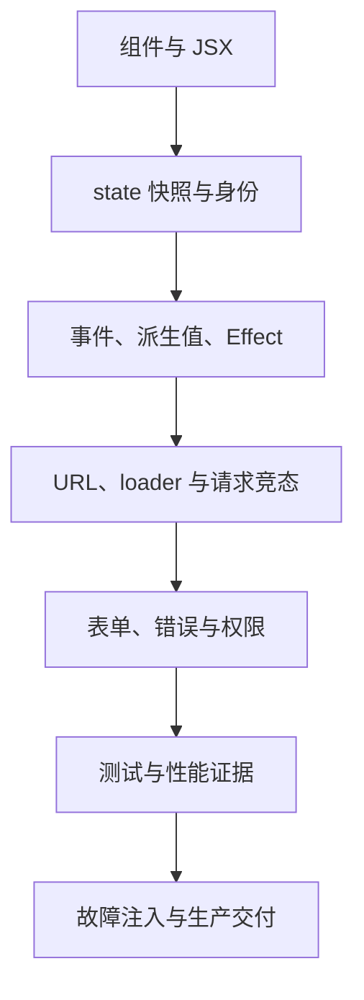
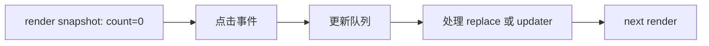
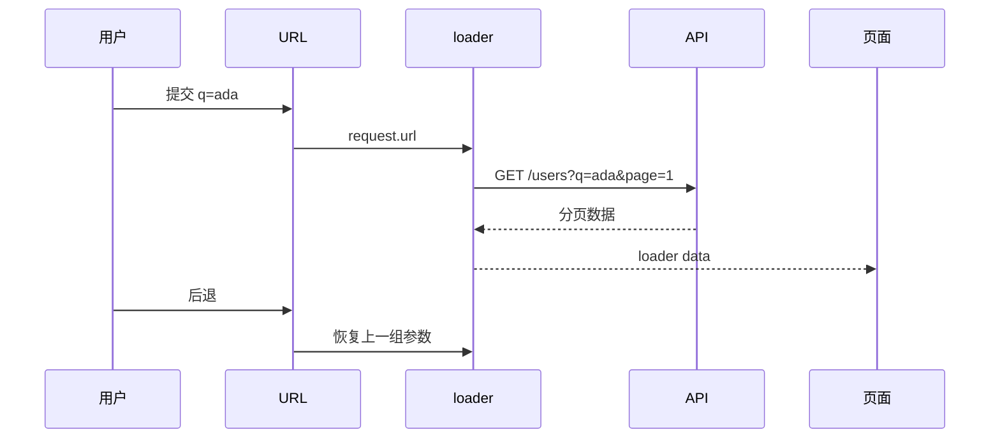
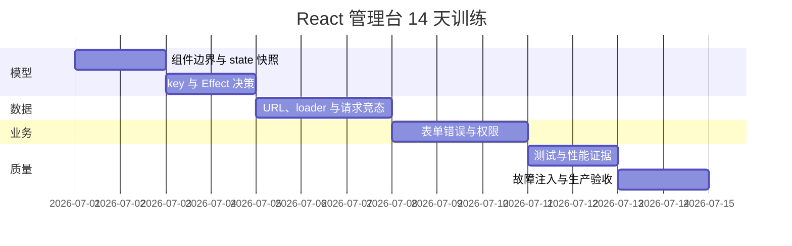

# React 专项练习

## 适合谁看

适合已经读过 React 基础章节，准备从“能写组件”进入“能解释数据流、能排查问题、能交付项目”的学习者。练习以 [React 管理台从零到项目](/react/project-admin) 为主线，但每项都可以单独完成。

不要只抄最终代码。每个练习都要求先预测、再运行、再收集证据，最后写复盘。

## 训练目标

完成后应该能：

- 画出组件、URL、服务端数据、表单和会话的状态边界。
- 用 render 快照和更新队列解释 state 行为。
- 判断逻辑属于事件、派生计算还是 Effect。
- 用 loader、请求取消和错误边界处理页面数据。
- 实现新增编辑表单的校验、冲突和失败恢复。
- 用 React DevTools、Network 和 Performance 定位问题。
- 在开发、生产预览、移动端和失败环境下完成验收。

## 练习规则

每个练习提交四份证据：

```text
1. BEFORE.md：修改前预测和复现步骤
2. 实现代码或最小复现
3. VERIFY.md：Console、Network、React DevTools 或测试结果
4. REVIEW.md：根因、修复、回归和预防
```

“页面看起来正常”不是验证结果。必须说明在哪个环境、用什么操作、观察到什么证据。

## 能力地图



## 练习 1：从静态页面拆出组件边界

### 目标

把一张用户管理静态页面拆成可维护组件，但不提前引入全局状态。

### 初始页面

```text
后台布局
├─ 顶部账号区
├─ 侧边导航
└─ 用户页面
   ├─ 标题和新增按钮
   ├─ 搜索表单
   ├─ 用户表格
   └─ 编辑弹窗
```

### 任务

1. 标出每块的职责和变化原因。
2. 创建 `AdminLayout`、`UsersPage`、`UserSearch`、`UserTable`、`UserFormDialog`。
3. 父组件通过 props 传事实，子组件通过回调传意图。
4. 保留正确的 `main`、`nav`、`form`、`table` 和按钮语义。
5. 不按每个 `div` 拆组件。

### 验收

| 问题 | 合格答案 |
| --- | --- |
| 谁拥有搜索条件 | URL 或 UsersPage，不是 UserTable |
| 谁决定打开哪个用户 | UsersPage |
| UserRow 是否直接发请求 | 第一版不直接发，由页面调度 mutation |
| 表格为空谁显示空态 | UsersPage 或明确的 TableState 组件 |

### 故障注入

故意让 `UserTable` 同时管理搜索、弹窗、请求和权限，记录新增一个需求时需要修改多少位置，再恢复清楚边界。

## 练习 2：验证 state 快照和批处理

### 目标

不用“React 异步更新”这一句模糊解释，真正看懂每次 render 的快照。

### 任务

实现两个按钮：

```tsx
function Counter() {
  const [count, setCount] = useState(0)

  function addWrong() {
    setCount(count + 1)
    setCount(count + 1)
    setCount(count + 1)
  }

  function addCorrect() {
    setCount((current) => current + 1)
    setCount((current) => current + 1)
    setCount((current) => current + 1)
  }

  return (
    <>
      <output>{count}</output>
      <button onClick={addWrong}>普通 +3</button>
      <button onClick={addCorrect}>函数式 +3</button>
    </>
  )
}
```

在 `BEFORE.md` 先写出两个按钮各自结果，再运行验证。

### 画图要求



把三个更新逐个写进队列，说明为什么一个结果是 `1`，另一个是 `3`。

### 加练

- 在 `setTimeout` 中读取 count，解释旧值。
- 用函数式更新实现快速连续点击不丢计数。
- 写单元测试验证最终输出。

## 练习 3：组件身份、key 和表单重置

### 目标

理解 state 与渲染树位置的关系，解决“编辑 A 后打开 B 还是 A 的值”。

### 任务

1. 创建用户 A 和 B 两条数据。
2. 表单用 `useState(() => initialValues(user))` 初始化。
3. 不加 key，复现切换对象后草稿残留。
4. 给表单增加 `key={user.id}`，记录变化。
5. 将列表 key 从业务 id 改为 index，排序后观察输入状态。
6. 恢复稳定业务 key。

### 验收

- 能解释“props 变了为什么 useState 初始函数不重新运行”。
- 能说明何时应该保留 state，何时应该重置。
- 不使用 Effect 机械复制所有 props 到 state。

## 练习 4：删除不必要的 Effect

### 目标

把逻辑分回事件、派生计算和真正外部同步。

### 初始错误代码

```tsx
const [fullName, setFullName] = useState('')
const [filteredUsers, setFilteredUsers] = useState<User[]>([])

useEffect(() => setFullName(`${firstName} ${lastName}`), [firstName, lastName])
useEffect(() => setFilteredUsers(filterUsers(users, query)), [users, query])
useEffect(() => {
  if (submitted) saveUser(form)
}, [submitted, form])
```

### 任务

- `fullName` 改为 render 派生。
- `filteredUsers` 改为 render 计算，确认昂贵后才 memo。
- 保存动作移到 submit 事件。
- 另写一个真正需要 Effect 的例子：同步 `document.title` 或订阅连接。
- 为订阅实现对称 cleanup。

### 决策记录

| 逻辑 | 最终位置 | 依据 |
| --- | --- | --- |
| fullName | render | 可由当前输入计算 |
| filterUsers | render/useMemo | 没有外部系统 |
| saveUser | submit event | 特定用户操作 |
| notification subscription | Effect | 同步外部系统 |

## 练习 5：把搜索和分页放进 URL

### 目标

让搜索结果可刷新、可分享、可后退恢复。

### 任务

1. 路由为 `/users?q=&page=`。
2. loader 解析并校正非法页码。
3. 搜索使用 GET Form。
4. 新搜索自动回到第 1 页。
5. 分页链接保留关键词。
6. 重置操作回到 `/users`。
7. 复制 URL 到新标签，结果一致。

### 数据流图



### 故障注入

- 输入 `page=-1`、`page=abc`、极大页码。
- 同时保留 URL page 和组件 page state，复现不同步后删除重复事实源。

## 练习 6：制造并修复请求竞态

### 目标

证明最终页面只接受最新导航对应的数据。

### 任务

1. Mock API 根据关键词返回不同延迟：`a=3000ms`、`ab=1500ms`、`abc=200ms`。
2. 快速触发三次搜索。
3. 记录修复前 Network 顺序和错误最终结果。
4. 在 route loader 将 `request.signal` 传给请求。
5. 如果使用 Effect，再用 `AbortController` 实现同一目标。
6. 被取消请求不能显示“请求失败”。

### 验收

```text
[ ] URL 最终为 abc
[ ] 页面最终显示 abc 结果
[ ] 旧请求被取消或结果被忽略
[ ] Console 没有未处理 AbortError
[ ] Loading 状态不会被旧请求提前关闭
```

## 练习 7：完整表单状态与服务端错误

### 目标

让用户知道哪里错、为什么错、如何恢复，而不是只弹 Toast。

### 任务

- 初始值固定类型，避免 controlled/uncontrolled 警告。
- 客户端校验用户名、显示名称、邮箱和角色。
- 字段使用 label、`aria-invalid`、`aria-describedby`。
- 顶部错误摘要可聚焦，并链接到字段。
- 提交中禁用保存，取消按钮策略明确。
- 422 映射字段错误。
- 409 显示业务冲突。
- 500 保留草稿、request id 和重试入口。
- 成功后才关闭并 revalidate 列表。

### 状态矩阵

| 响应 | 草稿 | 弹窗 | 焦点 | 下一步 |
| --- | --- | --- | --- | --- |
| 本地无效 | 保留 | 保持 | 错误摘要/首字段 | 修正 |
| 422 | 保留 | 保持 | 错误摘要 | 修正字段 |
| 409 | 保留 | 保持 | 冲突提示 | 换用户名/邮箱 |
| 500 | 保留 | 保持 | 通用错误 | 重试或稍后处理 |
| 200/201 | 可丢弃 | 关闭 | 返回触发点 | 查看新列表 |

### 测试数据

```text
用户名：空、A、ab、ada_user、21 个字符
显示名称：空、1 字符、40 字符、41 字符
邮箱：空、abc、ada@example.com、重复邮箱
角色：未选、单选、多选
服务：422、409、500、延迟 5 秒、网络断开
```

## 练习 8：权限入口与后端授权

### 目标

理解“看不见按钮”和“不能执行动作”是两层能力。

### 任务

1. 当前用户 loader 返回 permission codes。
2. `PermissionGate` 控制新增、编辑、停用入口。
3. 使用 DevTools 或 curl 绕过页面直接调用接口。
4. Mock API 增加权限校验并返回 403。
5. 前端 403 保留会话，显示无权限，不跳登录。
6. 记录审计日志需要的 actor、action、resource 和 result。

### 验收

- 无权限用户看不到误导入口。
- 构造请求仍被后端拒绝。
- 401 与 403 页面行为不同。
- 不从前端传入并信任“我是管理员”。

## 练习 9：用 Profiler 证明性能问题

### 目标

先找到瓶颈，再决定是否 memo、分页或虚拟化。

### 场景

创建 2000 行用户列表，并在页面顶部加入受控搜索框。

### 任务

1. React Profiler 录制输入 5 个字符。
2. 记录每次 commit 时长和重渲染组件。
3. Browser Performance 检查 scripting、layout 和 paint。
4. 依次尝试：状态下沉、分页、稳定必要 props、memo。
5. 每次只改一项并使用相同输入复测。

### 结果表

| 方案 | commit | DOM 数量 | 输入延迟 | 结论 |
| --- | ---: | ---: | ---: | --- |
| 基线 | 记录 | 记录 | 记录 | 证据 |
| 状态下沉 | 记录 | 记录 | 记录 | 是否有效 |
| 分页 | 记录 | 记录 | 记录 | 是否有效 |
| memo | 记录 | 记录 | 记录 | 是否值得保留 |

不要写“性能明显提升”。写测试设备、数据量、操作和前后数值。

## 练习 10：按行为写测试

### 目标

让重构组件内部实现时，测试仍然表达用户能力。

### 必做测试

```text
[ ] 登录空字段不能提交
[ ] 错误凭证显示可理解提示
[ ] 无 token 进入 /users 会跳登录
[ ] 搜索提交后 URL 包含 q 和 page=1
[ ] loader 失败显示路由错误边界
[ ] 表单 422 显示字段错误
[ ] 409 保留输入
[ ] 无权限时入口隐藏
[ ] 列表排序后行状态仍跟随业务 id
[ ] 取消编辑不改变列表 DTO
```

### 约束

- 优先按 role、label 和可见文本查询。
- 不断言内部 state 或组件私有方法。
- 网络结果可控，不依赖真实线上服务。
- 至少一条测试先看到失败，再实现修复。

## 练习 11：系统故障注入

### 目标

把 [React 真实项目问题库](/projects/issues-react) 变成自己的证据库。

### 故障矩阵

| 编号 | 故障 | 期望证据 |
| --- | --- | --- |
| F01 | Strict Mode 额外 setup/cleanup | 订阅无泄漏 |
| F02 | Effect 依赖放新对象 | 能复现并修复循环 |
| F03 | 动态列表使用 index key | 能复现状态错行 |
| F04 | 旧请求最后返回 | 最新 URL 与数据一致 |
| F05 | `/api/me` 401 | 清会话回登录 |
| F06 | 资源接口 403 | 保留会话显示无权限 |
| F07 | 表单 422/409/500 | 草稿与错误状态正确 |
| F08 | 深层 URL 刷新 | 不返回托管 404 |
| F09 | 旧 chunk 404 | 有一次性可恢复流程 |
| F10 | 2000 行列表 | 有性能基线和改后数据 |
| F11 | 390px 与 200% 缩放 | 无页面级横向溢出 |
| F12 | 纯键盘操作 | 完成登录、搜索、表单取消 |

至少完整复盘八项，其中必须包含一个竞态、一个权限、一个生产部署问题。

## 练习 12：生产构建与交付

### 命令

```bash
npm run test
npm run build
npm run mock
npm run preview
```

### 浏览器验收

- 直接打开和刷新 `/login`、`/users?q=ada&page=1`。
- Console 无错误和 uncontrolled 警告。
- Network 中 JS、CSS、API 的状态码和 Content-Type 正确。
- 登录、搜索、新增、编辑、停用和退出可完成。
- 401、403、409、422、500 可复现。
- 390px、1440px、200% 缩放没有内容遮挡。
- 仅键盘完成主流程，焦点清楚可见。
- 生产 preview 与 dev 的差异有记录。

### 交付物

```text
README.md
ARCHITECTURE.md
API_CONTRACT.md
TEST_NOTES.md
DEBUG_NOTES.md
RELEASE_CHECKLIST.md
至少 8 条故障复盘
一份生产预览验收记录
```

## 14 天建议节奏



每天最后 20 分钟固定做三件事：

1. 画今天涉及的数据流或状态图。
2. 保存一条关键 Console、Network 或 Profiler 证据。
3. 写明明天怎样证明没有回归。

## 最终自测

每项 0 到 3 分：

| 能力 | 0 分 | 1 分 | 2 分 | 3 分 |
| --- | --- | --- | --- | --- |
| 渲染模型 | 只会背 Hook | 知道会重渲染 | 能解释快照和 commit | 能用模型定位问题 |
| 状态设计 | 所有值放 state | 能局部管理 | URL/服务端/表单边界清楚 | 能消除重复事实源 |
| Effect | 用来处理一切 | 会写依赖 | 能区分事件和同步 | 能证明 cleanup 与竞态 |
| 列表表单 | 只完成成功路径 | 有校验 | 有 422/409/500 | 焦点、草稿和回归完整 |
| 路由请求 | 页面挂载再请求 | 会配置路由 | loader 与 URL 状态完整 | 取消、错误边界和恢复完整 |
| 权限 | 只隐藏按钮 | 知道后端鉴权 | 401/403 分层 | 有越权回归和审计模型 |
| 性能 | 凭感觉 memo | 会看 Profiler | 有基线和复测 | 能区分 React/DOM/网络 |
| 交付 | 只有 dev | build 通过 | preview 与失败态通过 | 深层 URL、旧 chunk、移动端完整 |

总分低于 15：回到图解页重建模型，并重做练习 2、4、5、7。

总分 15 到 20：完成项目主流程后，继续做故障注入和测试。

总分 21 以上：尝试把同一业务迁移到 Next.js，比较客户端 loader 与服务端数据边界，而不是重写一份只有 UI 的项目。

## 下一步学习

练习中遇到症状先查 [React 真实项目问题库](/projects/issues-react) 和 [React 常见问题](/react/troubleshooting)。完成整套练习后，进入 [Nuxt / Next 专项练习](/roadmap/meta-framework-practice) 或回到 [React 管理台从零到项目](/react/project-admin) 做第二次无提示实现。
