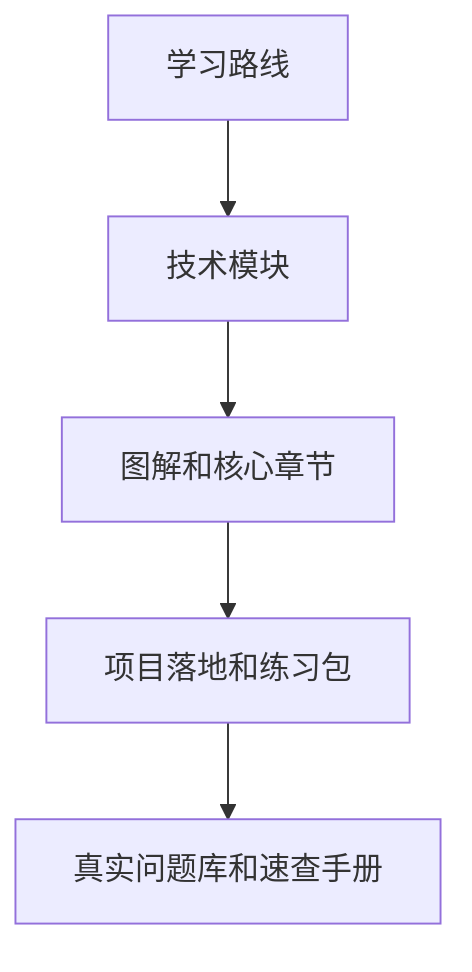
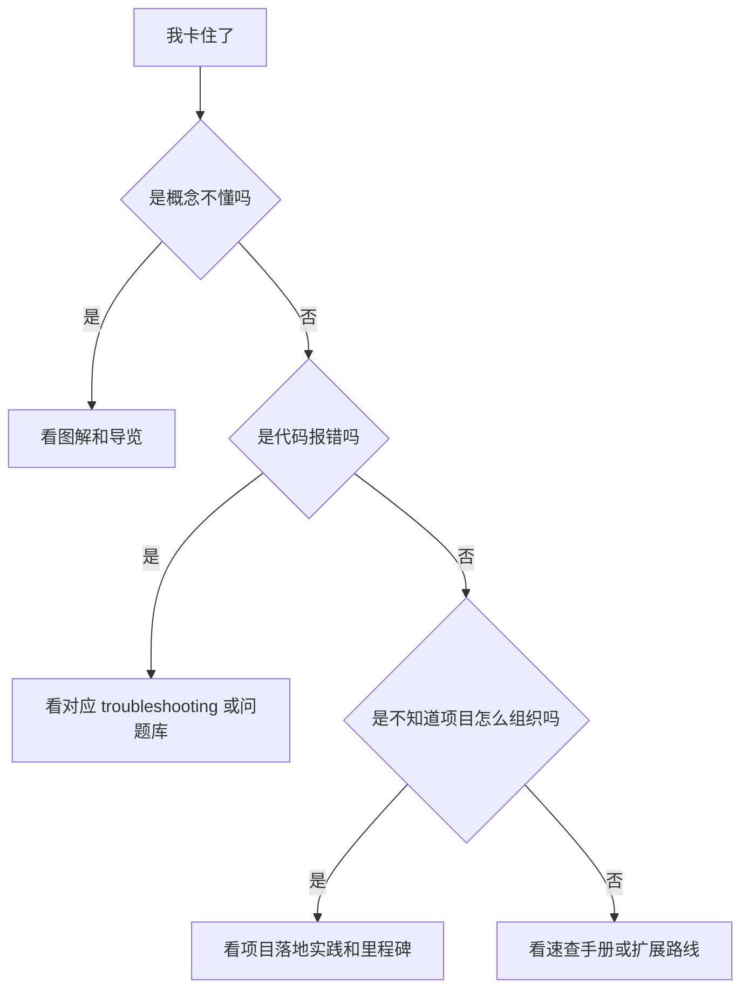

# 阅读顺序与使用方法

## 适合谁看

适合第一次进入这个文档站，或者已经看到很多模块但不知道怎么读、怎么练、怎么查问题的人。

这个站不是百科式 API 列表，而是“学习路线 + 技术模块 + 项目实战 + 问题库 + 速查手册”的组合。正确使用方式不是从首页一路读完，而是根据当前目标选择入口。

## 站点结构怎么理解

可以把站点理解成五层：



每一层解决的问题不同：

| 层级 | 解决的问题 | 什么时候看 |
| --- | --- | --- |
| 学习路线 | 我该按什么顺序学 | 刚开始、换方向、复盘能力 |
| 技术模块 | 这门技术系统讲什么 | 正在学某个技术 |
| 图解和核心章节 | 概念如何运行 | 觉得抽象、看代码前 |
| 项目落地和练习包 | 项目里怎么用 | 看懂概念后要动手 |
| 问题库和速查 | 出错怎么查、写法怎么回忆 | 开发、联调、上线时 |

## 最推荐的阅读路径

如果你以 Vue 前端和全栈后台为目标，推荐顺序是：

```text
阅读顺序与使用方法
↓
学习工作流与笔记模板
↓
学习路线总览
↓
阶段任务清单
↓
JavaScript / TypeScript / Vue 图解
↓
图解学习地图
↓
Vue 从零到项目落地
↓
数据库项目落地实践
↓
项目上线全流程实践
↓
学习路径练习包
↓
前端综合实战练习
↓
真实项目问题库
```

如果你已经在做项目，不需要从头读。直接按问题选择入口。

## 按目标选择入口

| 当前目标 | 推荐入口 | 后续动作 |
| --- | --- | --- |
| 不知道从哪学 | [学习路线总览](/roadmap/introduction) | 选一条路线 |
| 不知道怎么读、怎么记、怎么复盘 | [学习工作流与笔记模板](/roadmap/study-workflow) | 按目标、图解、实验、项目、问题、复盘形成闭环 |
| 想先建立整体技术模型 | [图解学习地图](/roadmap/visual-learning-map) | 按图解顺序串起模块 |
| 想按任务推进 | [阶段任务清单](/roadmap/phase-tasks) | 每阶段完成一个产出 |
| 想动手练习 | [学习路径练习包](/roadmap/practice-labs) | 选择一个练习并记录问题 |
| 想做综合前端项目 | [前端综合实战练习](/roadmap/frontend-capstone-lab) | 按阶段完成可运行、可排错、可交付项目 |
| 想做后端 API 练习 | [学习路径练习包](/roadmap/practice-labs#练习-65后端-api-综合项目) | 选择 Java、Go 或 Node 做真实 API 并接前端 |
| 想系统完成 Vue Admin | [Vue Admin 学习地图与交付清单](/roadmap/vue-admin-learning-map) | 按阶段完成用户、权限、菜单、请求和问题复盘 |
| Vue Admin 文档太多不知道下一篇看什么 | [Vue Admin 阅读顺序与实战索引](/vue/admin-reading-guide) | 按当前任务选择实现手册、问题库和交付检查 |
| 想做完整项目 | [项目里程碑](/roadmap/project-milestones) | 对照验收清单补功能 |
| 概念看不懂 | 各模块“图解核心概念” | 先看图，再看代码 |
| 项目出问题但不知道从哪查 | [项目排障方法论](/projects/debugging-playbook) | 先定位问题层级，再收集证据 |
| 前端项目出问题但不知道查哪个专题 | [前端项目排障图谱](/projects/frontend-debugging-map) | 按白屏、数据、状态、样式、权限、构建分流 |
| 已知道问题分类 | [真实项目问题库](/projects/real-world-issues) | 按现象查根因 |
| 忘记写法 | [速查手册总览](/cheatsheets/) | 快速回忆命令和 API |
| 准备上线 | [项目交付检查清单](/projects/delivery-checklist) | 逐项验证 |

## 每篇文档怎么读

建议按四遍读法：

### 第一遍：只看目的

先看：

- 适合谁看。
- 这篇解决什么。
- 学完能做到什么。

如果和你当前目标无关，先跳过，不要为了“完整”浪费时间。

### 第二遍：看图和流程

遇到图解、流程图、表格时停一下，先用自己的话解释：

- 输入是什么。
- 经过哪些步骤。
- 输出是什么。
- 哪一步最容易出错。

解释不出来再回到正文。

### 第三遍：照着做

代码和命令不要只复制。每做一步都确认：

- 这个文件为什么放这里。
- 这个函数属于组件、状态、服务还是工具。
- 这个配置影响开发环境还是生产环境。
- 这个错误如果发生应该在哪里查。

### 第四遍：查问题库

完成练习后，不要马上进入下一章。先去问题库找同类问题：

- 有没有类似错误。
- 真实项目里会怎样失效。
- 怎么预防。
- 要不要补进自己的检查清单。

## 新手容易读错的方式

| 错误方式 | 问题 | 更好的方式 |
| --- | --- | --- |
| 从首页开始逐篇读 | 容易疲劳，记不住 | 按目标选路线 |
| 只读概念不做练习 | 项目里仍然不会写 | 每个阶段做一个练习 |
| 遇到错误只复制解决方案 | 下次还会卡 | 写清根因和复现步骤 |
| 过早追求全栈全会 | 学习线太散 | 先围绕一个项目闭环 |
| 只看速查手册 | 只知道写法，不懂场景 | 速查用于回忆，不替代学习文档 |

## 遇到卡点时怎么查

按这个顺序排查：



如果一个问题排查超过 30 分钟，建议停下来写下：

```text
我想做什么？
我预期发生什么？
实际发生什么？
我已经验证了什么？
错误信息或截图是什么？
```

写完这四项，很多问题会变得清楚。

## 如何判断可以进入下一阶段

不要用“我读完了”作为判断标准。更可靠的标准是：

- 能独立复述核心流程。
- 能完成一个最小练习。
- 能解释项目目录和数据流。
- 能说出至少 3 个常见问题。
- 能自己定位一次错误。
- 能写 README 让别人运行你的结果。

如果做不到，先回到 [学习路径练习包](/roadmap/practice-labs)，补一个小练习。

## 如何维护自己的学习笔记

建议不要照搬整篇文档。自己的笔记只记三类东西：

| 类型 | 示例 |
| --- | --- |
| 我以前误解的点 | Pinia 不是所有业务逻辑的垃圾桶 |
| 我踩过的问题 | 编辑弹窗直接绑定表格行导致列表提前变化 |
| 我以后可复用的模板 | 请求封装、表单默认值、发布检查清单 |

推荐格式：

```md
# 日期 + 主题

## 今天解决的问题

## 根因

## 最小示例

## 下次如何避免
```

## 下一步学习

如果你是第一次使用本站，继续进入 [学习路线总览](/roadmap/introduction)、[学习工作流与笔记模板](/roadmap/study-workflow) 和 [图解学习地图](/roadmap/visual-learning-map)。如果你已经有明确目标，直接进入 [学习路径练习包](/roadmap/practice-labs)，从当前最薄弱的练习开始；完成基础练习后，进入 [前端综合实战练习](/roadmap/frontend-capstone-lab) 做一次完整项目闭环。
