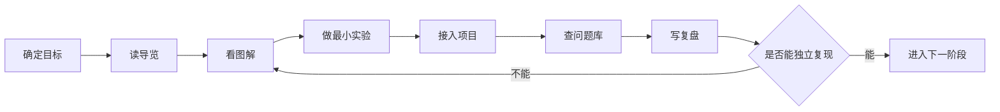
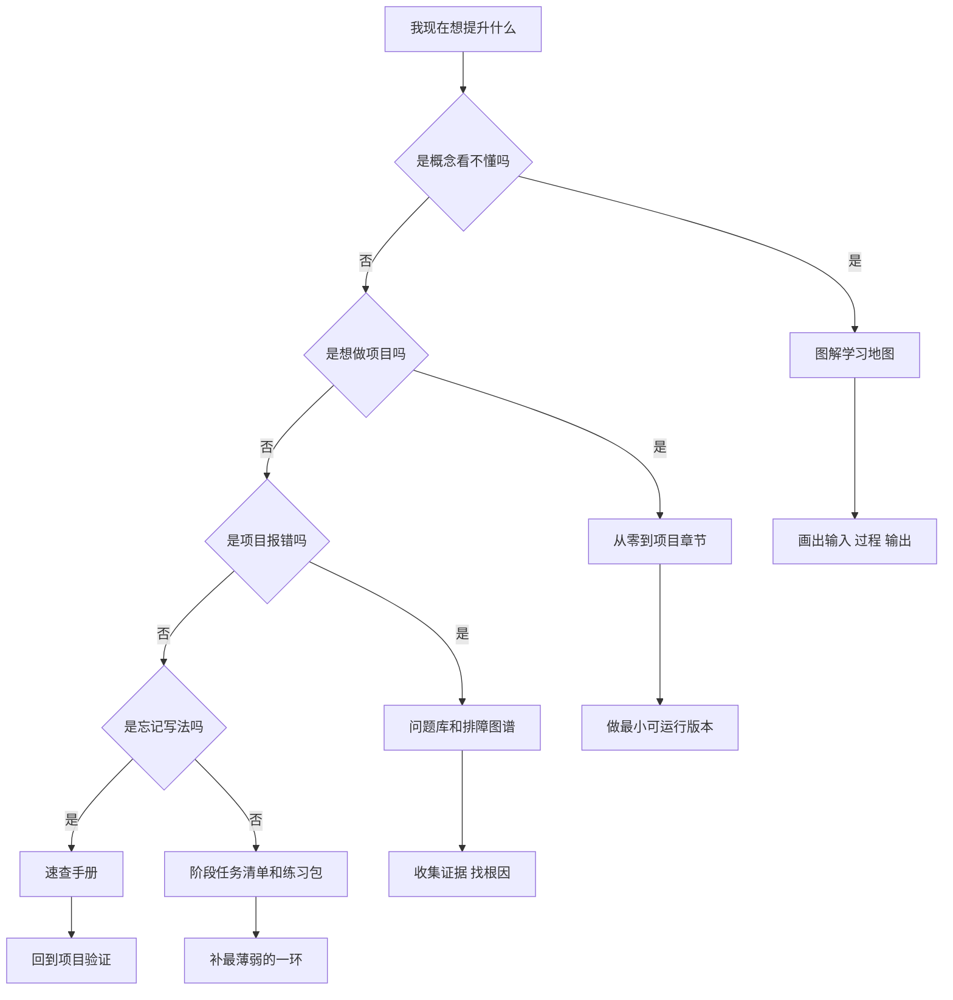
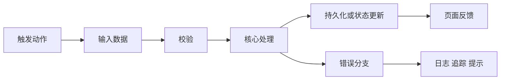
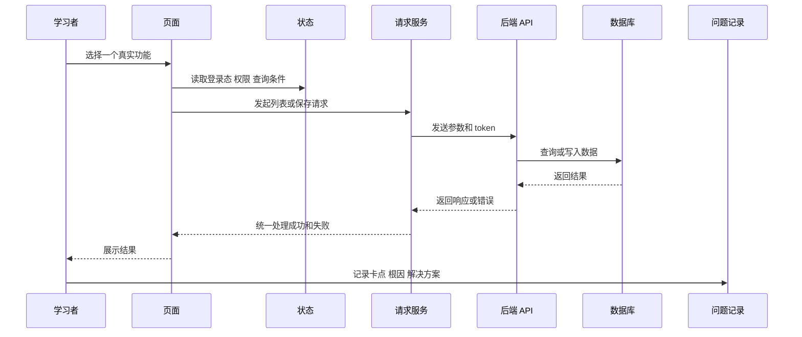
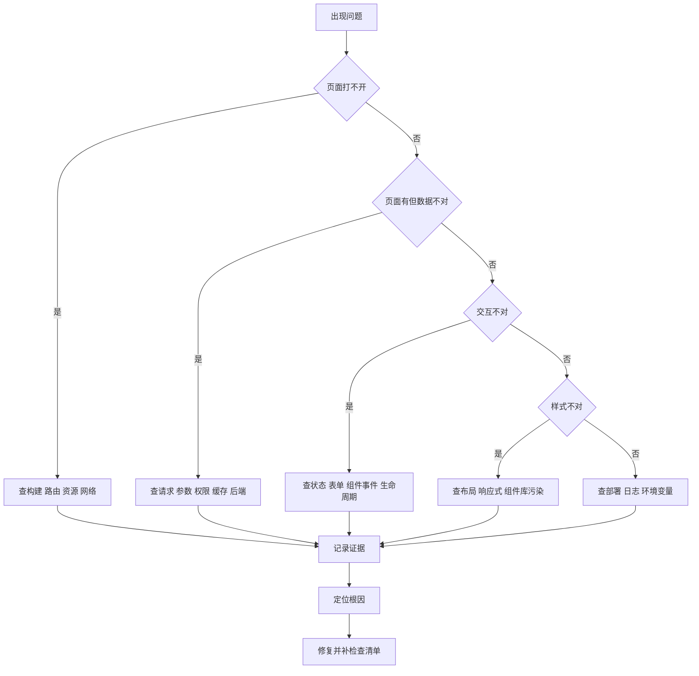

# 学习工作流与笔记模板

## 适合谁看

适合已经知道本站有哪些模块，但读完一篇文档后仍然不知道如何吸收、如何练习、如何把问题沉淀下来的人。

这篇文档不是新的技术章节，而是一套学习工作流。它把“读图解、看正文、写代码、查问题、做复盘”串成一个闭环，避免出现只收藏文档、只复制代码、只记结论但项目里仍然不会用的情况。

## 这篇解决什么

学习技术文档最常见的问题不是资料不够，而是没有固定动作：

- 看图时只觉得“有道理”，但没有说清输入、过程和输出。
- 看代码时只复制最终写法，但不知道为什么这样分层。
- 做练习时只追求跑通，没记录错误、根因和排查证据。
- 查问题库时只拿解决方案，不补自己的检查清单。
- 学完一个模块后，不知道能不能进入下一阶段。

本页给出一套可重复使用的工作流。以后读任何模块，都可以按这套动作走。

## 总体工作流

一篇技术文档不要一次性读完。更推荐把阅读拆成 6 个动作：



这套流程的关键点是：每次学习都要留下一个可运行产物和一份问题记录。没有产物，说明还停留在理解层；没有问题记录，说明下次很容易重复踩坑。

## 第一步：先确定目标

开始阅读前，先写一句话目标，不要写成“学习 Vue”这种大词。

更好的目标应该能落到一个结果：

| 模糊目标 | 可执行目标 |
| --- | --- |
| 学 Vue | 做一个带列表、弹窗表单和分页的用户管理页 |
| 学 TypeScript | 给列表、详情、表单提交参数分别建类型 |
| 学请求封装 | 让 401、403、业务错误和网络错误走不同提示 |
| 学数据库 | 设计用户、角色、菜单和操作日志表 |
| 学部署 | 把项目构建、上传、回滚和健康检查跑通 |

目标越具体，越容易判断应该看哪篇文档。

## 目标选择图

如果不知道从哪里开始，用下面这张图分流：



对应入口：

| 当前状态 | 先看 | 再做 |
| --- | --- | --- |
| 不知道技术之间怎么连接 | [图解学习地图](/roadmap/visual-learning-map) | 画一张自己的项目链路图 |
| 想按路线系统学习 | [学习路线总览](/roadmap/introduction) | 选择一条主线，不同时开太多方向 |
| 已经有项目目标 | 对应技术的“从零到项目”章节 | 做出最小可运行版本 |
| 已经遇到错误 | [项目排障方法论](/projects/debugging-playbook) | 先收集证据，再套解决方案 |
| 想验证能力 | [学习路径练习包](/roadmap/practice-labs) | 按验收标准补产物 |

## 第二步：读导览时只做三件事

导览页不要逐字背，重点找三类信息：

1. 这门技术解决什么问题。
2. 项目里通常放在哪一层。
3. 学完后应该能做出什么。

建议在笔记里写成下面这种格式：

```md
## 技术定位

- 技术：Vue Router
- 解决的问题：页面地址、页面切换、菜单和权限路由
- 项目位置：router 配置、动态路由生成、导航守卫、菜单渲染
- 学完产物：能根据后端菜单生成可访问路由，并处理 403 页面
```

这样做的好处是，你不会把“会 API”误以为“会在项目里用”。

## 第三步：看图解时画三层

图解不是用来看热闹的。每张图都要拆成三层：

| 层级 | 要问的问题 | 示例 |
| --- | --- | --- |
| 输入 | 谁触发了流程，传入了什么 | 用户点击保存按钮，提交表单模型 |
| 过程 | 中间经过哪些模块 | 表单校验、请求封装、后端校验、数据库事务 |
| 输出 | 成功或失败会改变什么 | 列表刷新、提示成功、日志记录、错误提示 |

可以使用这个模板画自己的流程：



例如读 Vue 请求封装时，不要只记 axios 怎么写，要能说清：

- 页面在哪里发起请求。
- loading 和错误状态在哪里维护。
- 401 和 403 为什么不是同一种错误。
- 保存成功后为什么要重新查询列表。
- 后端字段变化时 TypeScript 类型怎么同步。

## 第四步：做最小实验

每个知识点都要做一个最小实验。最小实验不是完整项目，而是一个可以证明你理解了关键机制的小例子。

| 学习内容 | 最小实验 | 验收标准 |
| --- | --- | --- |
| JavaScript 事件循环 | 写同步、Promise、setTimeout 的输出顺序 | 能解释每一行为什么这样输出 |
| TypeScript 类型边界 | 给分页接口、表单模型、提交参数建类型 | 改错字段时 TS 能报错 |
| Vue 响应式 | 对比 ref、reactive、computed、watch | 能解释谁负责数据、谁负责派生、谁负责副作用 |
| Vue Router | 写登录页、列表页、403 页和导航守卫 | 未登录跳登录，无权限跳 403 |
| 请求封装 | 模拟 200、401、403、500 和网络错误 | 每类错误有不同处理 |
| 数据库事务 | 写订单和库存同时更新的伪代码或 SQL | 能说明失败时如何回滚 |
| 部署回滚 | 写一份构建、备份、发布、回滚清单 | 能按清单恢复到上一版本 |

最小实验应该控制在 30 到 90 分钟内。如果做不完，说明目标太大，需要继续拆小。

## 第五步：接入真实项目

最小实验跑通后，要接到项目里，否则知识点仍然是孤立的。

推荐用下面这条项目链路验证：



每次接入项目时，至少记录这 8 个点：

| 检查项 | 要写清楚什么 |
| --- | --- |
| 入口 | 用户从哪个页面或按钮触发 |
| 数据 | 表单、查询条件、接口参数分别是什么 |
| 状态 | loading、选中行、弹窗、分页在哪里维护 |
| 请求 | 调哪个 service，错误如何处理 |
| 权限 | 菜单、按钮、接口是否都有限制 |
| 持久化 | 是否写数据库，是否需要事务 |
| 反馈 | 成功、失败、空数据、无权限如何展示 |
| 证据 | 截图、日志、请求响应、复现步骤 |

## 第六步：查问题库时不要只抄答案

问题库的正确用法是建立排查路径，而不是复制最终代码。

遇到问题时，先按这张图定位层级：



问题记录建议包含这些字段：

```md
# 问题标题

## 现象

页面或接口出现了什么异常。

## 复现步骤

1. 打开哪个页面。
2. 点击哪个按钮。
3. 输入什么数据。
4. 实际结果是什么。

## 证据

- 浏览器控制台：
- Network 请求：
- 服务端日志：
- 数据库记录：
- 截图：

## 根因

真正出错的层级和原因。

## 修复

修改了哪些文件，为什么这样改。

## 预防

下次如何在检查清单、测试或代码结构里避免。
```

## 第七步：写复盘

复盘不是写日报，而是把经验变成下次可复用的判断。

推荐用“事实、原因、规则、清单”四段：

| 段落 | 写什么 | 不要写什么 |
| --- | --- | --- |
| 事实 | 发生了什么，有什么证据 | “感觉应该是缓存问题” |
| 原因 | 哪一层设计或实现导致问题 | “不知道为什么好了” |
| 规则 | 下次遇到同类问题先查什么 | 只写一次性解决方案 |
| 清单 | 加入项目检查项或模板 | 写完不更新任何流程 |

示例：

```md
## 事实

用户列表编辑弹窗打开后，修改姓名但不保存，表格行已经变化。

## 原因

弹窗表单直接引用了表格行对象，表单输入改变了原始列表数据。

## 规则

编辑弹窗必须克隆表格行作为表单模型；保存成功后再刷新列表或合并结果。

## 清单

- 打开编辑弹窗时是否复制数据？
- 取消弹窗后列表是否保持不变？
- 保存失败后表单和列表状态是否一致？
```

## 一周学习节奏

如果每天只有 1 到 2 小时，可以按这个节奏推进：

| 天数 | 动作 | 产物 |
| --- | --- | --- |
| 第 1 天 | 读导览和图解 | 一张技术流程图 |
| 第 2 天 | 做最小实验 | 一个可运行小例子 |
| 第 3 天 | 接入项目页面 | 一个真实功能入口 |
| 第 4 天 | 补请求、状态和错误处理 | 一份数据流说明 |
| 第 5 天 | 查问题库并故意制造一个错误 | 一份问题记录 |
| 第 6 天 | 补测试、验收和 README | 一份交付说明 |
| 第 7 天 | 复盘并更新个人清单 | 一份下周计划 |

这个节奏比“连续读 7 天文档”更有效，因为它每天都有可验证结果。

## 不同阶段的笔记模板

### 概念笔记

用于读图解和核心概念：

```md
# 技术名 + 核心概念

## 它解决什么

## 输入是什么

## 中间过程

## 输出是什么

## 最容易错的地方

## 一个最小例子
```

### 项目笔记

用于做从零到项目章节：

```md
# 项目功能名

## 用户目标

## 页面和路由

## 数据模型

## API 设计

## 状态和权限

## 错误处理

## 验收标准

## 后续可扩展点
```

### 排障笔记

用于查问题库：

```md
# 问题标题

## 现象

## 复现

## 证据

## 排除过什么

## 根因

## 修复

## 预防清单
```

### 阶段复盘

用于决定是否进入下一阶段：

```md
# 阶段复盘

## 我能独立完成什么

## 我仍然依赖教程的地方

## 我解决过哪些问题

## 我沉淀了哪些模板

## 下一阶段只补哪 1 到 2 个短板
```

## 是否可以进入下一阶段

不要用“我读完了”判断。用下面的验收表：

| 验收项 | 合格标准 |
| --- | --- |
| 能复述 | 不看文档能说清输入、过程、输出 |
| 能编码 | 能从空文件写出最小示例 |
| 能接项目 | 能把知识点放进页面、service、store、router 或数据库 |
| 能排错 | 能收集控制台、Network、日志、数据记录等证据 |
| 能复盘 | 能写清问题根因和预防清单 |
| 能交付 | 能写 README 让别人运行和验收 |

如果有 2 项以上做不到，不建议继续开新模块。先回到 [学习路径练习包](/roadmap/practice-labs) 补一个小练习。

## 推荐组合路径

| 目标 | 推荐组合 |
| --- | --- |
| 快速建立全局理解 | [阅读顺序与使用方法](/roadmap/reading-guide) -> [图解学习地图](/roadmap/visual-learning-map) -> 本页 |
| 做 Vue Admin 项目 | 本页 -> [Vue Admin 学习地图](/roadmap/vue-admin-learning-map) -> [前端综合实战练习](/roadmap/frontend-capstone-lab) |
| 做全栈 API 项目 | 本页 -> [学习路径练习包](/roadmap/practice-labs#练习-65后端-api-综合项目) -> [前后端联调排查](/projects/integration-debugging) |
| 排查真实项目问题 | 本页 -> [项目排障方法论](/projects/debugging-playbook) -> [真实项目问题库](/projects/real-world-issues) |
| 准备交付上线 | 本页 -> [项目交付检查清单](/projects/delivery-checklist) -> [DevOps 学习导览](/devops/introduction) |

## 下一步

如果你还不知道该选哪条路线，回到 [学习路线总览](/roadmap/introduction)。如果你已经知道目标，先用本页模板写一份学习目标，再进入 [图解学习地图](/roadmap/visual-learning-map) 或 [学习路径练习包](/roadmap/practice-labs)。
