# 图解学习地图

## 适合谁看

适合已经看到多个“图解核心概念”页面，但不知道应该先看哪一个、每张图要解决什么问题、不同技术之间如何连接的人。

这篇不是新的技术章节，而是本站图解体系的总入口。它会把前端、后端、数据库、工程化、DevOps 和 AI 工程的核心图示串成一条可执行路径，让你先建立整体模型，再进入具体技术模块。

## 为什么需要图解学习地图

很多学习卡点不是因为某个 API 不会用，而是因为脑子里没有系统图：

- 不知道浏览器、JavaScript、Vue、请求和后端之间谁先谁后。
- 只会写组件，但不知道状态、请求、缓存、权限应该放在哪里。
- 能看懂数据库表，却不知道事务、索引、缓存和接口性能怎么互相影响。
- 学了 Docker、Nginx、CI/CD，却不知道上线问题应该从哪一层排查。
- 接入 AI 后，只看到模型调用，不知道提示词、检索、权限、评测和上线治理如何闭环。

图解学习地图的目标是先让你看见“技术系统如何运转”，再去学语法和细节。

## 总体学习顺序

推荐先按这条主线看图：

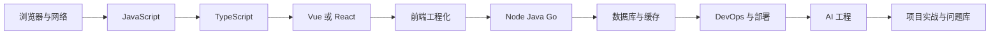

这条顺序的原因很简单：

| 顺序 | 先学它的原因 | 不学会的典型问题 |
| --- | --- | --- |
| 浏览器与网络 | 所有前端代码最终都运行在浏览器里，并通过网络拿数据 | 不知道 401、跨域、缓存、白屏从哪里查 |
| JavaScript | Vue、React、Node 都建立在 JS 运行机制上 | Promise、闭包、this、事件循环一出问题就靠猜 |
| TypeScript | 项目变大后需要类型边界保护接口和组件 | 表单、接口、状态字段经常对不上 |
| Vue 或 React | 用组件、状态和路由组织页面 | 页面能写出来，但逻辑散、难维护 |
| 前端工程化 | 把开发、构建、测试、规范和部署串起来 | 本地能跑，上线构建、环境变量、包体积出问题 |
| 后端语言 | 提供 API、鉴权、事务、任务和集成能力 | 前端只能写静态页面，无法交付完整业务 |
| 数据库与缓存 | 保存业务事实，支撑查询、事务和权限 | 表设计混乱、慢查询、并发更新错误 |
| DevOps 与部署 | 让项目可上线、可回滚、可观测 | 线上问题无法定位，只能重启试运气 |
| AI 工程 | 把模型能力接到业务流程里 | 只会调接口，不会控权限、质量、成本和风险 |

## 第一层：浏览器如何承载应用

先看 [图解浏览器核心概念](/browser/visual-guide)。

浏览器是前端应用的运行容器。你需要先知道页面从 URL 到可交互大概经历什么：

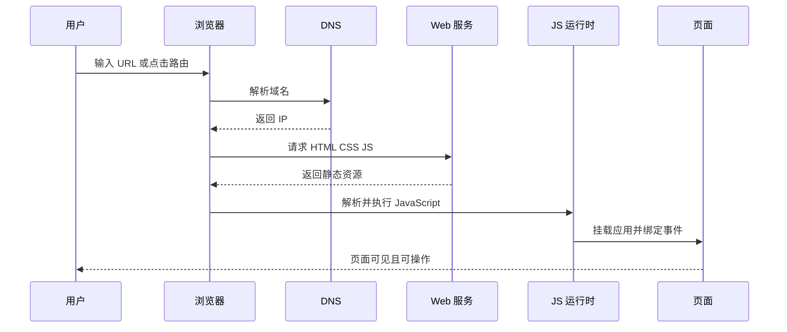

看这一层时重点回答 5 个问题：

| 问题 | 要理解的内容 | 对应文档 |
| --- | --- | --- |
| 页面为什么能打开 | DNS、HTTP、HTML、CSS、JS 加载顺序 | [HTTP 请求与响应](/browser/http-request) |
| 为什么会跨域 | 同源策略、CORS、Cookie、Token | [跨域、认证与安全边界](/browser/cors-auth) |
| 为什么刷新后数据还在 | Cookie、LocalStorage、SessionStorage、IndexedDB | [浏览器存储](/browser/storage) |
| 为什么有时页面还是旧的 | HTTP 缓存、Service Worker、构建产物缓存 | [浏览器缓存](/browser/cache) |
| 为什么页面卡顿 | 渲染流程、重排重绘、长任务、资源体积 | [渲染性能](/browser/rendering-performance) |

如果你看不懂前端报错，通常先从这一层确认：资源是否加载成功、接口是否返回、浏览器是否拦截、缓存是否命中。

## 第二层：JavaScript 如何执行逻辑

接着看 [图解 JavaScript 核心概念](/javascript/visual-guide)。

JavaScript 是页面交互、状态更新、请求处理和 Node 后端的共同语言。核心不是背语法，而是理解执行模型：

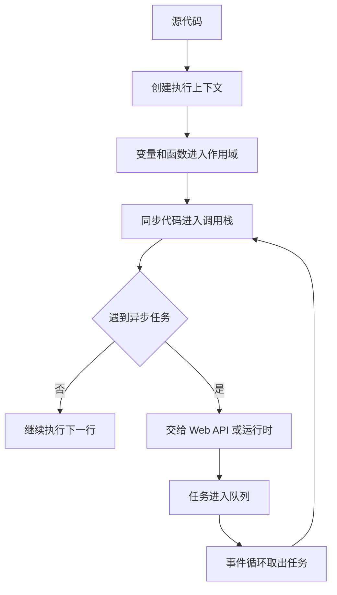

这层要重点掌握：

| 概念 | 你要能说清楚什么 | 常见项目问题 |
| --- | --- | --- |
| 作用域和闭包 | 函数为什么能记住外层变量 | 循环里绑定事件拿到错误值 |
| 原型链 | 对象属性查找和方法复用如何发生 | 判断类型、扩展对象、继承代码混乱 |
| Promise | 异步结果如何从 pending 变成 fulfilled/rejected | 请求顺序错乱、错误没有捕获 |
| 事件循环 | 同步任务、微任务、宏任务谁先执行 | loading 闪烁、状态更新时机不对 |
| 模块化 | import/export 如何组织代码边界 | 工具函数、服务层、组件互相乱依赖 |

学习建议：每看一个概念，都写一个 20 行以内的小例子。解释不出来时不要继续背 API，先回到图里找“输入、过程、输出”。

## 第三层：TypeScript 如何保护边界

然后看 [图解 TypeScript 核心概念](/typescript/visual-guide)。

TypeScript 的价值不是“多写类型”，而是让模块之间的边界更可靠：

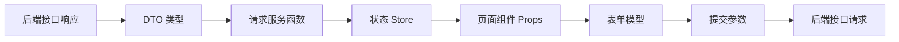

看这一层时重点关注三类边界：

| 边界 | 类型要解决什么 | 推荐做法 |
| --- | --- | --- |
| 接口边界 | 后端返回字段是否和前端使用一致 | 为响应、分页、错误结构建立通用类型 |
| 组件边界 | 父子组件传参是否清楚 | 用 props、emit、slot 类型描述能力 |
| 业务边界 | 表单、状态、列表项是否能被误用 | 区分列表展示模型、详情模型、提交模型 |

不要一开始追求复杂类型体操。先把接口、表单、状态和组件 props 的边界写清楚，项目稳定性就会明显提升。

## 第四层：Vue 如何组织页面

如果你的主线是 Vue，继续看 [图解 Vue 核心概念](/vue/visual-guide)、[图解 Vue Admin 项目架构](/vue/admin-architecture-visual-guide) 和 [Vue 从零到项目落地](/vue/project-from-zero)。

Vue 项目不是组件文件的堆叠，而是一套页面协作系统：

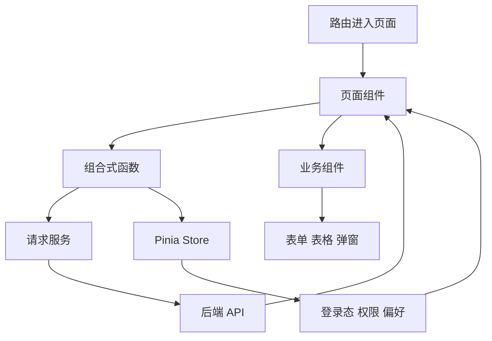

Vue 图解重点不是“响应式很神奇”，而是你要知道每类逻辑应该放在哪里：

| 逻辑 | 推荐位置 | 不推荐做法 |
| --- | --- | --- |
| 页面加载、查询、保存 | 页面组合式函数或页面组件 | 全塞到 Pinia |
| 登录用户、菜单权限 | Pinia Store | 每个页面重复请求 |
| 表格行编辑、弹窗状态 | 页面局部状态 | 直接修改原始列表行 |
| API 调用 | service/request 层 | 组件里手写 fetch/axios 细节 |
| 格式化、枚举映射 | utils 或 constants | 模板里写复杂表达式 |

读完这一层后，要能画出一个页面从路由进入、请求数据、展示表格、打开弹窗、提交表单、刷新列表的完整链路。

## 第五层：工程化如何让项目可维护

看 [图解前端工程化核心概念](/engineering/visual-guide)。

工程化解决的是“项目多人长期维护”的问题：

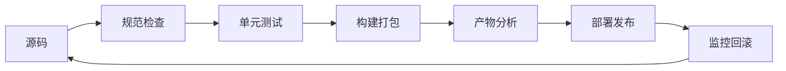

你需要理解这些工程机制分别保护什么：

| 机制 | 保护的东西 | 常见问题 |
| --- | --- | --- |
| ESLint/Prettier | 代码风格和潜在错误 | 代码风格不统一、隐式全局变量 |
| 环境变量 | 不同环境的接口和开关 | 本地、测试、生产接口混用 |
| 构建工具 | 模块转换、资源处理、产物输出 | 构建后白屏、资源路径错误 |
| 测试 | 核心逻辑和交互不被改坏 | 改权限、表单、请求后没人发现回归 |
| 包体积分析 | 首屏性能和依赖治理 | 引入一个库导致首屏变慢 |

工程化不是上线前才看。只要项目超过一个页面，就应该开始建立目录、规范、请求、状态和测试边界。

## 第六层：后端如何提供业务能力

后端可以从 Node.js、Java 或 Go 选择一条主线：

| 方向 | 图解入口 | 适合场景 |
| --- | --- | --- |
| Node.js | [图解 Node.js 核心概念](/node/visual-guide) | 前端转后端、BFF、轻量 API、权限 API |
| Java | [图解 Java 核心概念](/java/visual-guide) | 企业系统、Spring Boot、事务、复杂业务 |
| Go | [图解 Go 核心概念](/go/visual-guide) | 高并发服务、工具、云原生、网关类项目 |

无论选择哪种语言，后端图解都要理解同一条请求链路：

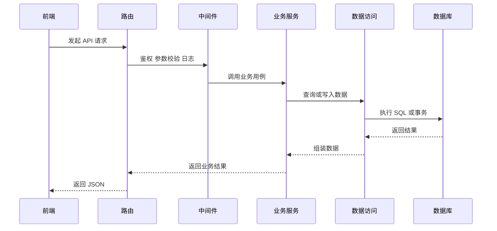

看后端图解时，不要只看语法。要问：

- 鉴权在哪里做？
- 参数校验在哪里做？
- 事务边界在哪里？
- 业务错误如何返回给前端？
- 日志里能不能定位一次失败请求？

## 第七层：数据库如何保存业务事实

看 [图解数据库核心概念](/database/visual-guide)。

数据库不是“把字段存进去”这么简单。它决定业务事实、查询能力、事务一致性和权限边界：

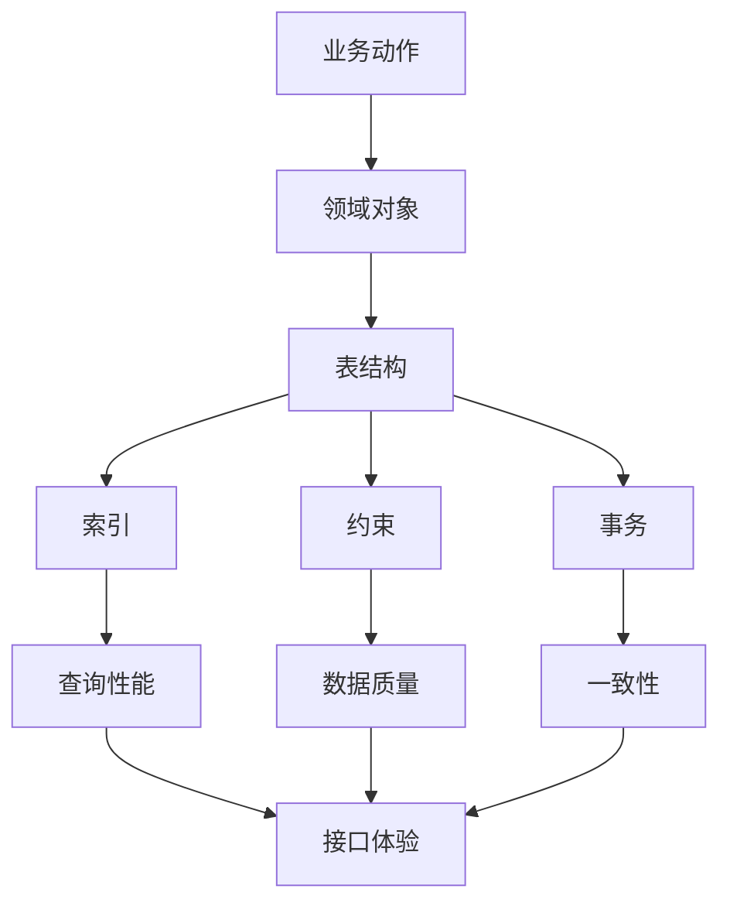

数据库图解要重点看：

| 主题 | 要解决的问题 | 项目例子 |
| --- | --- | --- |
| 建模 | 表之间是什么关系 | 用户、角色、菜单、按钮权限 |
| 索引 | 查询如何更快 | 列表筛选、模糊搜索、状态统计 |
| 事务 | 多步写入如何一起成功或失败 | 创建订单、审批流、扣库存 |
| 迁移 | 表结构如何演进 | 新增字段、补历史数据、回滚 |
| 备份恢复 | 数据出问题如何恢复 | 误删、发布故障、灾备切换 |

学数据库时一定要结合项目案例，不要只背 SQL。每个字段都应该能解释业务含义、约束和变化原因。

## 第八层：DevOps 如何保障上线

看 [图解 DevOps 核心概念](/devops/visual-guide)。

DevOps 的核心不是工具名，而是让变更可发布、可观察、可回滚：

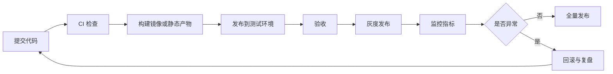

看这一层时，重点把“上线”拆成 6 个问题：

| 问题 | 需要的能力 |
| --- | --- |
| 能不能构建 | 构建脚本、依赖锁定、环境变量 |
| 能不能发布 | Nginx、Docker、CI/CD、云服务 |
| 能不能回滚 | 版本产物、数据库迁移策略、灰度发布 |
| 能不能观测 | 日志、指标、链路、错误报警 |
| 能不能定位 | 访问日志、接口耗时、浏览器错误、慢查询 |
| 能不能复盘 | 事故记录、根因、预防动作、责任边界 |

## 第九层：AI 工程如何接入业务

看 [图解 AI 工程核心概念](/ai-engineering/visual-guide)。

AI 工程不只是“调用模型返回文本”，而是一条包含输入、检索、工具、权限、评测和上线治理的链路：

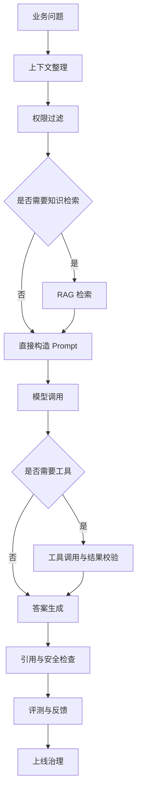

学 AI 工程要特别关注：

| 主题 | 为什么重要 |
| --- | --- |
| Prompt | 决定模型理解任务的方式 |
| 结构化输出 | 让模型结果能被程序消费 |
| RAG | 让回答基于企业知识，而不是凭空编 |
| 工具调用 | 让模型能查询、计算、触发流程 |
| 评测 | 判断效果是否真的变好 |
| 权限与审计 | 防止越权回答、泄露数据和无法追责 |

## 跨模块总图：一次后台操作如何穿过全栈

下面用“管理员修改用户角色”串起所有模块：

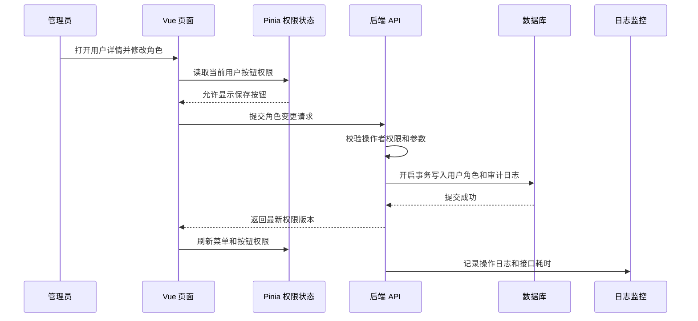

这一个操作至少涉及：

| 模块 | 在这个操作里负责什么 |
| --- | --- |
| 浏览器 | 页面加载、Cookie/Token、请求发送 |
| JavaScript | 事件处理、Promise、错误捕获 |
| TypeScript | 用户、角色、菜单、按钮权限类型 |
| Vue | 页面、组件、表单、状态和路由 |
| 工程化 | 请求封装、环境配置、测试、构建 |
| 后端 | 鉴权、校验、业务服务、审计日志 |
| 数据库 | 用户角色关系、事务、一致性约束 |
| DevOps | 发布、日志、监控、回滚 |
| AI 工程 | 可扩展为权限变更风险解释或智能排查助手 |

## 学习时如何使用每张图

看图时不要只觉得“懂了”。建议按这个方法复述：

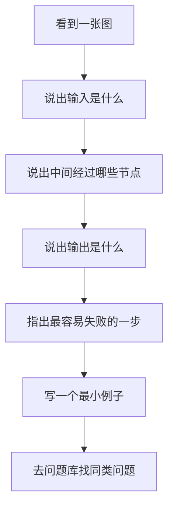

每张图至少回答这 4 个问题：

| 问题 | 示例 |
| --- | --- |
| 输入是什么 | 用户点击保存、接口返回数据、定时任务触发 |
| 输出是什么 | 页面更新、数据库写入、日志产生、消息发送 |
| 哪一步最容易错 | 权限缓存、事务边界、异步顺序、环境变量 |
| 出错时去哪查 | 浏览器控制台、Network、后端日志、数据库慢查询、问题库 |

## 7 天图解学习安排

如果你想快速建立整体模型，可以按 7 天推进：

| 天数 | 重点 | 阅读入口 | 当天产出 |
| --- | --- | --- | --- |
| 第 1 天 | 浏览器和网络 | [浏览器图解](/browser/visual-guide)、[HTTP 请求与响应](/browser/http-request) | 画出一次页面加载流程 |
| 第 2 天 | JavaScript 执行 | [JavaScript 图解](/javascript/visual-guide)、[事件循环](/javascript/event-loop) | 写一个 Promise 顺序示例 |
| 第 3 天 | TypeScript 边界 | [TypeScript 图解](/typescript/visual-guide)、[Vue 集成](/typescript/vue-integration) | 给列表、详情、表单写类型 |
| 第 4 天 | Vue 页面组织 | [Vue 图解](/vue/visual-guide)、[Vue Admin 架构图解](/vue/admin-architecture-visual-guide)、[从零到项目落地](/vue/project-from-zero) | 画出一个列表页数据流 |
| 第 5 天 | 后端与数据库 | [Node 图解](/node/visual-guide)、[数据库图解](/database/visual-guide) | 画出一个保存接口和事务 |
| 第 6 天 | 工程化和上线 | [工程化图解](/engineering/visual-guide)、[DevOps 图解](/devops/visual-guide) | 写一份发布前检查清单 |
| 第 7 天 | AI 和问题复盘 | [AI 工程图解](/ai-engineering/visual-guide)、[真实项目问题库](/projects/real-world-issues) | 复盘一个真实问题 |

## 学完之后做什么

图解只是建立模型，最终要回到项目和练习：

1. 如果你刚入门，进入 [学习路径练习包](/roadmap/practice-labs)，从静态页面和 JS 列表开始。
2. 如果你以 Vue 为主线，进入 [Vue 前端工程师路线](/roadmap/vue-frontend) 和 [Vue 从零到项目落地](/vue/project-from-zero)。
3. 如果你要做完整后台，进入 [项目里程碑](/roadmap/project-milestones)。
4. 如果你已经在项目里遇到问题，进入 [真实项目问题库](/projects/real-world-issues)。
5. 如果你要查某个技术全貌，进入 [技术库总览](/technologies/)。

## 自测清单

看完这篇后，用下面清单判断是否真正建立了整体模型：

| 检查项 | 达标标准 |
| --- | --- |
| 能说明页面加载流程 | 能说清 DNS、HTTP、资源加载、JS 执行和页面挂载 |
| 能说明一次交互流程 | 能说清事件、状态、请求、响应和页面更新 |
| 能说明类型边界 | 能区分接口响应、状态模型、表单模型和提交参数 |
| 能说明后端请求链路 | 能说清路由、中间件、服务、数据访问和事务 |
| 能说明数据一致性 | 能解释约束、事务、索引和缓存的作用 |
| 能说明上线链路 | 能说清构建、发布、灰度、监控、回滚和复盘 |
| 能说明 AI 接入边界 | 能说清 Prompt、检索、工具、权限、评测和治理 |

如果这些检查项还有空白，不要急着补更多技术名词。先回到对应的图解页，用一个真实功能把流程画出来。

## 下一步学习

如果你是第一次进入本站，继续看 [阅读顺序与使用方法](/roadmap/reading-guide)。如果你已经准备动手，进入 [学习路径练习包](/roadmap/practice-labs)。如果你正在做 Vue 项目，进入 [Vue 从零到项目落地](/vue/project-from-zero)。
