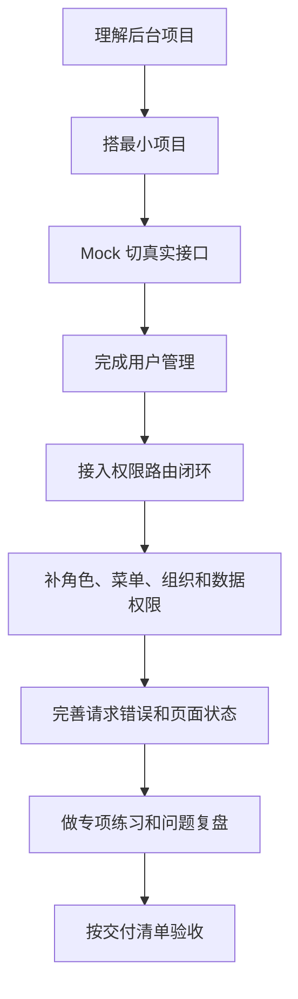
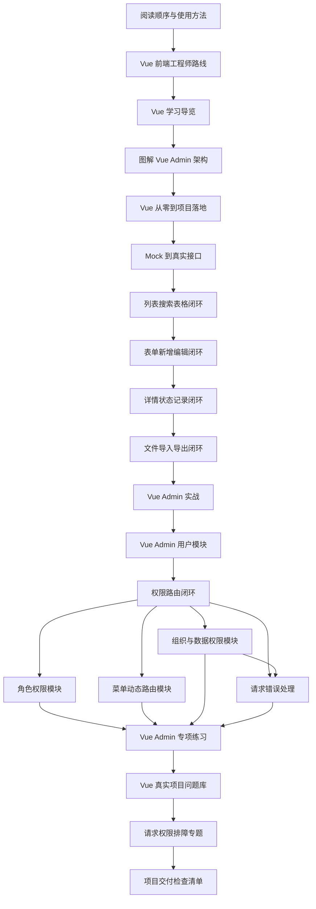
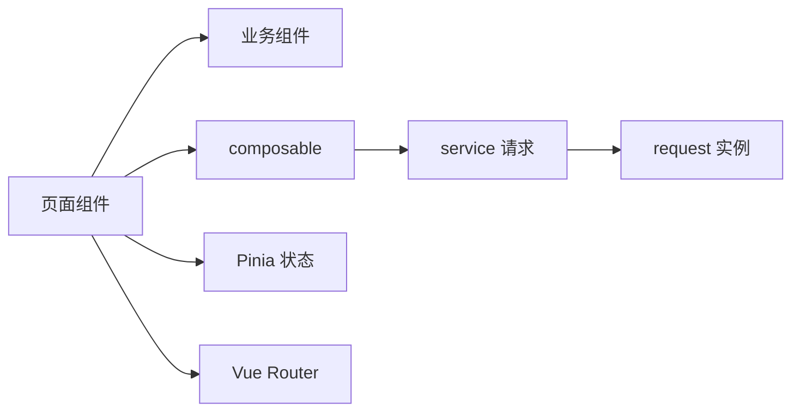
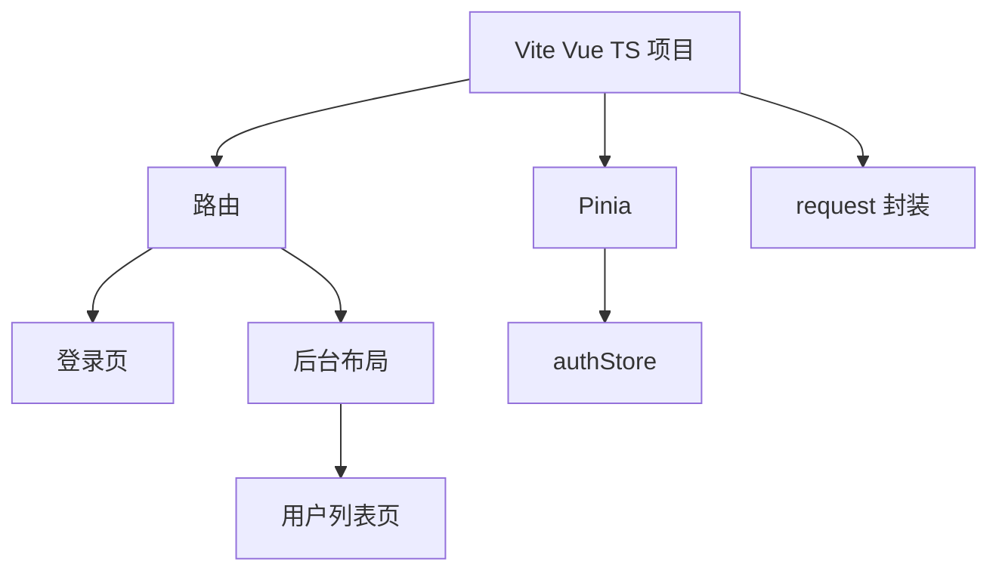
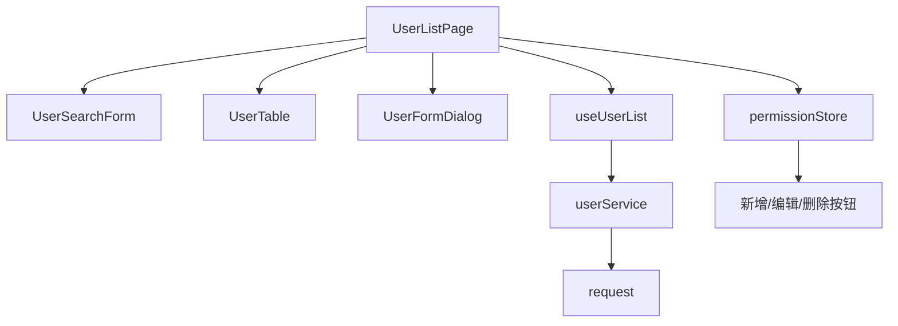
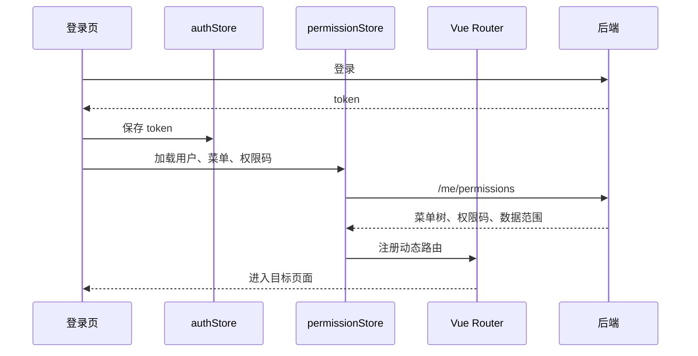
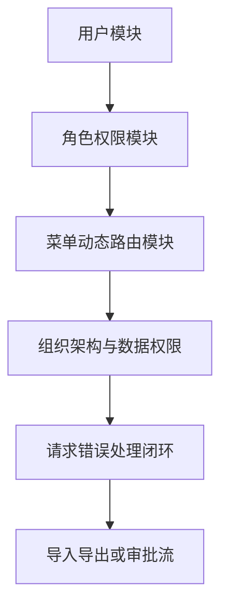
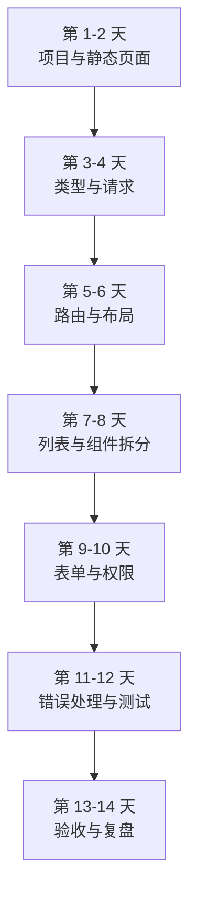
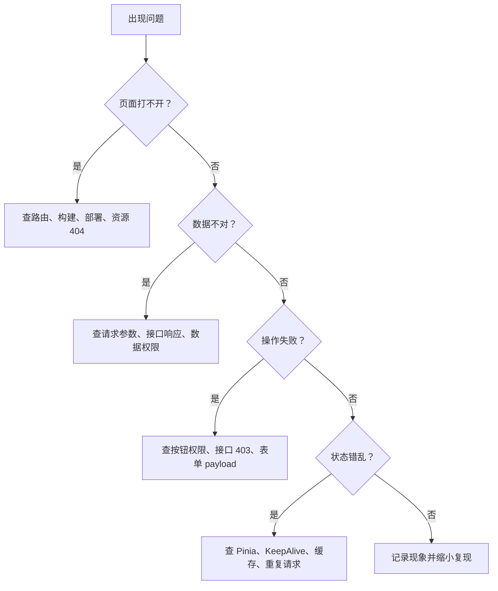
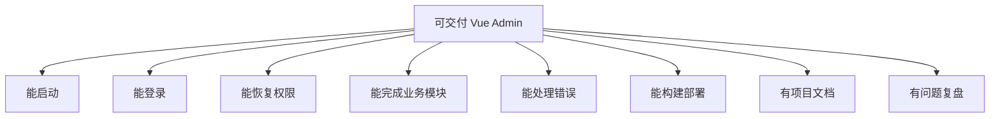

# Vue Admin 学习地图与交付清单

## 这个页面解决什么

Vue Admin 相关文档已经覆盖了 Vue 基础、从零到项目、Mock 到真实接口联调、列表表单详情闭环、文件上传导入导出、权限路由闭环、用户模块、角色权限、菜单动态路由、组织数据权限、请求错误处理、专项练习和问题库。内容足够深以后，新的问题会出现：**读者不知道先看哪一篇、什么时候动手、每一阶段做到什么程度才算过关。**

这一页不是新的知识点，而是 Vue Admin 学习路线的“导航层”。它把现有文档组织成一条能执行、能检查、能复盘的路径：

- 第一阶段先用图建立 Vue Admin 的项目心智模型。
- 第二阶段做出最小可运行后台。
- 第三阶段从 mock 切到真实接口，明确 DTO、分页、错误分类和联调证据。
- 第四阶段补登录态、权限路由和请求错误闭环。
- 第五阶段拆用户、角色、菜单、组织这些真实模块。
- 第六阶段用问题库训练排障能力。
- 第七阶段对照交付清单判断项目是否能放进作品集或团队模板。

如果你已经打开很多文档但不知道下一步读哪篇，从这里开始。

## 适合谁看

- 想系统做一个 Vue Admin 项目，但容易在文档之间来回跳的人。
- 看完 Vue 基础后，不知道如何进入真实后台项目的人。
- 已经做了用户列表，但不知道接下来该补权限、请求、组织还是问题库的人。
- 想把学习过程变成“阶段产出 + 验收清单 + 问题复盘”的人。
- 带新人学习 Vue Admin，需要一份清晰路线和交付标准的人。

## 路线原则

这条路线采用“任务优先”的组织方式，不按技术名堆章节，而按真实交付顺序推进：



为什么这样排：

1. 后台项目最先需要稳定结构，而不是先追求复杂权限。
2. Mock 到真实接口是从页面 demo 进入真实项目的关键分界线，能提前暴露环境、代理、字段和错误处理问题。
3. 用户管理是最小业务闭环，能串起列表、搜索、表单、请求和权限按钮。
4. 权限路由闭环应该在有最小页面后接入，太早接入会变成空架构。
5. 角色、菜单、组织、数据权限要在理解用户模块后再拆，否则容易只会复制代码。
6. 问题库放在项目后半段，因为只有做过页面，真实问题才看得懂。

## 总体学习地图

下面这张图是完整路径。每个节点都对应一批文档和一个产出。



路线不要求一次读完所有文档。更好的方式是每一阶段只打开当前需要的 3 到 5 篇，做完产出后再进入下一阶段。

## 阶段总览

| 阶段 | 目标 | 必读文档 | 阶段产出 |
| --- | --- | --- | --- |
| 0. 会用本站 | 知道怎么读、怎么练、怎么查问题 | [阅读顺序与使用方法](/roadmap/reading-guide)、[学习路线总览](/roadmap/introduction) | 一份个人学习计划 |
| 1. Vue 基础成型 | 理解组件、路由、状态、请求和权限基础 | [Vue 学习导览](/vue/introduction)、[Vue 前端工程师路线](/roadmap/vue-frontend) | 基础笔记和小页面 |
| 2. 最小后台项目 | 搭出 Vue Admin 骨架和用户管理入口 | [图解 Vue Admin 项目架构](/vue/admin-architecture-visual-guide)、[Vue 从零到项目落地](/vue/project-from-zero)、[Vue Admin 实战](/projects/vue-admin) | 可运行 Vue Admin demo |
| 3. Mock 到真实接口 | 从假数据切到真实 API，补环境、代理、DTO、分页和错误分类 | [Vue Admin Mock 到真实接口联调实战](/vue/admin-mock-to-api) | 可复现的接口联调证据 |
| 4. 列表搜索表格闭环 | 掌握后台最常见页面形态，处理搜索、分页、表格、批量选择和导出 | [Vue Admin 列表、搜索、分页与表格闭环实战](/vue/admin-list-search-table) | 可复用列表页模式 |
| 5. 表单新增编辑闭环 | 掌握新增、编辑、复制、校验、422 回填、关闭确认和防重复提交 | [Vue Admin 表单弹窗、新增编辑与校验闭环实战](/vue/admin-form-modal-crud) | 可复用表单弹窗模式 |
| 6. 详情状态记录闭环 | 掌握详情页、状态流转、操作按钮、时间线和审计日志 | [Vue Admin 详情页、状态流转与操作记录闭环实战](/vue/admin-detail-status-audit) | 可复用详情页模式 |
| 7. 文件导入导出闭环 | 掌握上传、下载、模板导入、异步导出、进度、权限审计和错误处理 | [Vue Admin 文件上传、下载、导入导出与异步任务闭环实战](/vue/admin-file-import-export) | 可复用文件任务模式 |
| 8. 用户模块闭环 | 完成列表、表单、分页、权限按钮和文件任务入口 | [Vue Admin 用户模块实现手册](/vue/admin-user-module) | 用户管理模块 |
| 9. 权限路由闭环 | 串起登录态、菜单、动态路由、按钮和接口权限 | [Vue Admin 权限路由闭环实战](/vue/admin-permission-route-flow) | 权限恢复和无权限处理 |
| 10. 核心后台模块 | 拆角色、菜单、组织、数据权限和请求错误 | 角色权限、菜单动态路由、组织数据权限、请求错误处理 | 可扩展后台基建 |
| 11. 专项练习 | 用 14 天计划把模块做扎实 | [Vue Admin 专项练习](/roadmap/vue-admin-practice) | README、练习记录、问题复盘 |
| 12. 排障训练 | 学会按证据定位问题 | [Vue 真实项目问题库](/projects/issues-vue)、[Vue Admin 请求权限排障](/projects/issues-vue-admin-request) | TROUBLESHOOTING.md |
| 13. 交付验收 | 判断项目是否能作为作品或模板 | [项目里程碑](/roadmap/project-milestones)、[项目交付检查清单](/projects/delivery-checklist) | 交付检查结果 |

## 阶段 0：先学会使用文档站

### 目标

先建立学习方法，不要直接打开几十篇文档。

### 必读

- [阅读顺序与使用方法](/roadmap/reading-guide)
- [学习路线总览](/roadmap/introduction)
- [图解学习地图](/roadmap/visual-learning-map)

### 产出

创建一个 `LEARNING_PLAN.md`：

```md
# Vue Admin 学习计划

## 当前基础

- HTML/CSS：
- JavaScript：
- TypeScript：
- Vue：
- 后端/API：

## 本周目标

## 本周只读这些文档

## 本周必须完成的项目产出

## 遇到问题记录在哪里
```

### 验收标准

- 能说清自己当前阶段。
- 能列出本周只看哪几篇文档。
- 能列出本周要产出的代码或文档。
- 知道遇到问题先查哪类问题库。

如果你没有写计划，很容易在“看文档”里消耗很多时间，但项目没有任何可运行结果。

## 阶段 1：补齐 Vue 项目基础

### 目标

能理解一个 Vue Admin 页面背后的基本结构：



你不需要一开始就写出完美架构，但至少要知道每类代码放在哪里。

### 必读

| 任务 | 文档 |
| --- | --- |
| 建立 Vue 模块总览 | [Vue 学习导览](/vue/introduction) |
| 理解组件和响应式 | [组件设计](/vue/component)、[响应式基础](/vue/reactivity) |
| 理解路由和状态 | [路由与页面](/vue/router)、[Pinia 状态管理](/vue/pinia) |
| 理解请求和表单 | [请求与接口封装](/vue/request)、[表单处理](/vue/forms) |
| 理解权限基础 | [权限与菜单](/vue/permission) |

### 练习任务

做一个最小用户列表静态页：

1. 页面包含标题、搜索区、表格区、分页区。
2. 搜索条件存在页面状态里，不要放 Pinia。
3. 用户列表数据先写死在本地数组里。
4. 表格操作区预留“编辑”和“删除”按钮。
5. 写一个 `README.md` 说明页面结构。

### 验收标准

- 组件能解释清楚：哪个是页面组件，哪个是业务组件。
- 页面状态没有全部塞进全局 Store。
- 列表渲染使用稳定 `key`，不要用数组下标。
- 移动端页面没有整体横向溢出。

## 阶段 2：从零搭出最小后台

### 目标

做出一个能启动、能登录、能进入用户管理页面的 Vue Admin 骨架。

### 必读

- [图解 Vue Admin 项目架构](/vue/admin-architecture-visual-guide)
- [Vue 从零到项目落地](/vue/project-from-zero)
- [Vue Admin Mock 到真实接口联调实战](/vue/admin-mock-to-api)
- [Vue Admin 列表、搜索、分页与表格闭环实战](/vue/admin-list-search-table)
- [Vue Admin 表单弹窗、新增编辑与校验闭环实战](/vue/admin-form-modal-crud)
- [Vue Admin 详情页、状态流转与操作记录闭环实战](/vue/admin-detail-status-audit)
- [Vue Admin 文件上传、下载、导入导出与异步任务闭环实战](/vue/admin-file-import-export)
- [Vue Admin 实战](/projects/vue-admin)
- [项目阶段任务](/projects/project-stage-tasks)

### 推荐目录

```text
src/
  app/
    router/
    stores/
    layouts/
  features/
    users/
  shared/
    request/
    components/
    permissions/
  styles/
```

### 产出



### 验收标准

| 验收项 | 通过标准 |
| --- | --- |
| 启动 | `npm run dev` 能访问首页 |
| 构建 | `npm run build` 通过 |
| 路由 | `/login`、`/dashboard`、`/system/users` 能访问 |
| 布局 | 有后台布局，不是所有页面堆在一个组件 |
| 文档 | README 写清技术栈、启动方式、目录职责 |

这一阶段不要急着做完整权限。先让项目能跑，目录能解释。

## 阶段 3：完成用户管理模块

### 目标

用用户管理模块把 Vue Admin 的核心页面能力练完整。

### 必读

- [Vue Admin 用户模块实现手册](/vue/admin-user-module)
- [TypeScript Vue 集成](/typescript/vue-integration)
- [Vue 真实项目问题库](/projects/issues-vue)

### 用户模块拆解图



### 必须完成

- 搜索。
- 分页。
- loading。
- empty。
- error。
- 新增。
- 编辑。
- 删除或禁用。
- 表单校验。
- 防重复提交。
- 按钮权限。
- README 模块说明。

### 常见错误预警

| 错误 | 后果 | 修正 |
| --- | --- | --- |
| 搜索条件放 Pinia | 全局状态膨胀 | 留在页面或 `useUserList` |
| 编辑直接引用表格行 | 表单修改污染列表 | 打开弹窗时复制对象 |
| 子组件自己请求接口 | 页面无法统一 loading 和刷新 | 页面或 composable 统一调 service |
| 权限码写在模板里 | 改名难维护 | 集中维护权限常量 |

### 验收标准

- `UserListPage` 不直接拼接口 URL。
- `UserSearchForm` 不知道后端 API。
- `UserTable` 不维护页面请求状态。
- `UserFormDialog` 能区分新增和编辑。
- 关闭弹窗不会污染列表数据。
- 无权限时按钮不显示或禁用。

## 阶段 4：接入权限路由闭环

### 目标

让项目从“能进入页面”升级为“像真实后台一样控制登录、菜单、路由、按钮和接口权限”。

### 必读

- [Vue Admin 权限路由闭环实战](/vue/admin-permission-route-flow)
- [Vue Admin 菜单与动态路由实现手册](/vue/admin-menu-route-module)
- [Vue Admin 角色权限模块实现手册](/vue/admin-permission-module)

### 闭环图



### 必须完成

| 能力 | 通过标准 |
| --- | --- |
| 未登录访问业务页 | 跳登录，保留 redirect |
| 登录后跳转 | 进入 redirect 或 dashboard |
| 刷新动态页 | `/system/users` 刷新不 404 |
| 菜单渲染 | 侧边栏来自权限菜单 |
| 按钮权限 | 权限码控制按钮显示 |
| 接口 403 | 保持登录态，提示无权限 |
| 退出登录 | 清 token、store、动态路由和标签缓存 |

### 最容易错的顺序

错误顺序：

```text
登录成功
↓
马上跳转页面
↓
页面先发业务请求
↓
权限还没恢复
↓
404 或 403
```

推荐顺序：

```text
登录成功
↓
保存 token
↓
加载用户、菜单、权限码
↓
注册动态路由
↓
跳转目标页
```

## 阶段 5：扩展真实后台核心模块

### 目标

把用户管理扩展成一个更接近企业后台的系统。

### 推荐顺序



### 对应文档

| 模块 | 文档 | 学习重点 |
| --- | --- | --- |
| 角色权限 | [角色权限模块实现手册](/vue/admin-permission-module) | 权限树、授权保存、权限码治理 |
| 菜单动态路由 | [菜单与动态路由实现手册](/vue/admin-menu-route-module) | 菜单模型、组件白名单、刷新恢复 |
| 组织数据权限 | [组织架构与数据权限实现手册](/vue/admin-organization-data-permission) | 部门树、员工归属、数据范围 |
| 请求错误处理 | [请求封装与错误处理闭环手册](/vue/admin-request-error-handling) | 401/403、错误提示、并发、导出 |
| 请求权限排障 | [请求权限排障专题](/projects/issues-vue-admin-request) | 线上问题证据链 |

### 阶段产出

至少完成这些文档：

```text
README.md
docs/
  architecture.md
  permission-flow.md
  request-error-handling.md
  troubleshooting.md
```

`architecture.md` 写系统结构，`permission-flow.md` 写权限恢复流程，`request-error-handling.md` 写 401/403/500/业务错误处理，`troubleshooting.md` 写真实问题复盘。

## 阶段 6：专项练习与每日任务

### 目标

把阅读变成可执行任务，而不是只看文档。

### 必读

- [Vue Admin 专项练习](/roadmap/vue-admin-practice)
- [学习路径练习包](/roadmap/practice-labs)
- [阶段任务清单](/roadmap/phase-tasks)

### 14 天节奏



### 每天必须写的记录

```md
## 第 N 天：主题

### 今天完成

### 涉及文件

### 遇到的问题

### 根因分析

### 明天继续
```

这份记录比“看了几篇文章”更重要。真实项目能力来自复盘，不来自收藏链接。

## 阶段 7：问题库训练

### 目标

学会用证据定位问题，而不是看到异常就猜。

### 必读

- [项目排障方法论](/projects/debugging-playbook)
- [Vue 真实项目问题库](/projects/issues-vue)
- [Vue Admin 请求、权限与数据问题排查专题](/projects/issues-vue-admin-request)
- [前端真实项目问题库](/projects/issues-frontend)
- [TypeScript 类型边界问题](/projects/issues-typescript)

### 排障路径



### 问题复盘模板

```md
# 问题复盘：标题

## 现象

## 影响范围

## 复现步骤

## 证据

- Console：
- Network：
- Store：
- Route：
- Backend log：

## 根因

## 修复方案

## 验证方式

## 预防措施
```

### 必须训练的 10 个问题

| 问题 | 应查文档 |
| --- | --- |
| 刷新动态页面 404 | [Vue Admin 权限路由闭环实战](/vue/admin-permission-route-flow) |
| 菜单显示但接口 403 | [请求权限排障专题](/projects/issues-vue-admin-request) |
| 编辑弹窗污染列表 | [Vue 真实项目问题库](/projects/issues-vue) |
| 重复请求导致数据闪烁 | [Vue 真实项目问题库](/projects/issues-vue) |
| KeepAlive 页面缓存串数据 | [Vue 真实项目问题库](/projects/issues-vue) |
| 401 和 403 混用 | [请求封装与错误处理闭环手册](/vue/admin-request-error-handling) |
| TypeScript 类型越写越乱 | [TypeScript 类型边界问题](/projects/issues-typescript) |
| 生产二级路由刷新 404 | [部署、缓存与 DevOps 问题](/projects/issues-deployment) |
| 数据少了但接口没报错 | [请求权限排障专题](/projects/issues-vue-admin-request) |
| 退出登录后返回旧页面 | [Vue Admin 权限路由闭环实战](/vue/admin-permission-route-flow) |

## 阶段 8：项目交付清单

### 目标

判断你的 Vue Admin 项目是不是已经从练习项目变成可交付项目。

### 总验收图



### 交付清单

| 类别 | 必须满足 |
| --- | --- |
| 启动 | README 写清 Node 版本、安装、启动、构建命令 |
| 目录 | `app`、`features`、`shared` 边界清楚 |
| 路由 | 静态路由、动态路由、403、404、登录 redirect 正常 |
| 状态 | `authStore`、`permissionStore` 和页面状态边界清楚 |
| 请求 | token、traceId、401、403、业务错误统一处理 |
| 用户模块 | 搜索、分页、新增、编辑、删除、启禁用、校验完整 |
| 权限 | 菜单、路由、按钮、接口、数据权限都能解释 |
| 表单 | 新增和编辑不污染列表，提交防重复 |
| 类型 | DTO、ViewModel、FormState、Payload 分层 |
| 测试 | 至少覆盖转换函数、权限判断、列表 composable |
| 构建 | 生产构建通过，环境变量清楚 |
| 部署 | history fallback、接口代理、静态资源 base 有说明 |
| 文档 | README、架构说明、权限流程、问题复盘齐全 |

### 能力等级

| 等级 | 标准 |
| --- | --- |
| 入门可用 | 能启动、能做用户列表、能处理登录 |
| 项目可练 | 有请求、表单、权限按钮、错误提示和 README |
| 作品可展示 | 有完整权限路由闭环、模块拆分、构建说明、问题复盘 |
| 团队可复用 | 有模块规范、权限文档、测试、交付清单和扩展说明 |

## 一页速查：不知道下一步看什么

| 当前状态 | 下一步 |
| --- | --- |
| 不知道从哪里开始 | [阅读顺序与使用方法](/roadmap/reading-guide) |
| Vue 基础不牢 | [Vue 学习导览](/vue/introduction) |
| 不知道项目怎么搭 | [图解 Vue Admin 项目架构](/vue/admin-architecture-visual-guide) |
| 页面 mock 做完，要接后端 | [Vue Admin Mock 到真实接口联调实战](/vue/admin-mock-to-api) |
| 列表页搜索分页经常写乱 | [Vue Admin 列表、搜索、分页与表格闭环实战](/vue/admin-list-search-table) |
| 新增编辑弹窗经常污染数据 | [Vue Admin 表单弹窗、新增编辑与校验闭环实战](/vue/admin-form-modal-crud) |
| 详情页状态和操作记录混乱 | [Vue Admin 详情页、状态流转与操作记录闭环实战](/vue/admin-detail-status-audit) |
| 上传下载导入导出总是出问题 | [Vue Admin 文件上传、下载、导入导出与异步任务闭环实战](/vue/admin-file-import-export) |
| 已有静态页面 | [Vue Admin 用户模块实现手册](/vue/admin-user-module) |
| 用户模块做完 | [Vue Admin 权限路由闭环实战](/vue/admin-permission-route-flow) |
| 权限链路混乱 | [Vue Admin 菜单与动态路由实现手册](/vue/admin-menu-route-module) |
| 角色授权不会做 | [Vue Admin 角色权限模块实现手册](/vue/admin-permission-module) |
| 数据范围不理解 | [Vue Admin 组织架构与数据权限实现手册](/vue/admin-organization-data-permission) |
| 请求错误处理混乱 | [Vue Admin 请求封装与错误处理闭环手册](/vue/admin-request-error-handling) |
| 项目老出问题 | [项目排障方法论](/projects/debugging-playbook) |
| 想按天练习 | [Vue Admin 专项练习](/roadmap/vue-admin-practice) |
| 想验收作品 | [项目里程碑](/roadmap/project-milestones) |

## 最终产物建议

完成这条路线后，你应该留下一个项目和一组文档：

```text
vue-admin-learning/
  README.md
  LEARNING_PLAN.md
  LEARNING_NOTES.md
  TROUBLESHOOTING.md
  docs/
    architecture.md
    permission-flow.md
    request-error-handling.md
    delivery-checklist.md
  src/
    app/
    features/
    shared/
```

如果只有代码没有文档，下次回来看会忘记为什么这样拆。如果只有文档没有代码，也无法证明真的掌握。两者必须一起交付。

## 下一步学习

如果你是第一次走这条路线，先打开 [图解 Vue Admin 项目架构](/vue/admin-architecture-visual-guide)，再进入 [Vue 从零到项目落地](/vue/project-from-zero)，做出最小后台。  
如果你已经有项目骨架，先进入 [Vue Admin Mock 到真实接口联调实战](/vue/admin-mock-to-api)，把 mock、真实接口、DTO、分页、错误处理和 traceId 对齐。  
如果你已经能稳定联调真实接口，继续进入 [Vue Admin 列表、搜索、分页与表格闭环实战](/vue/admin-list-search-table)，把最常见页面形态做扎实。  
如果你已经掌握列表页闭环，继续进入 [Vue Admin 表单弹窗、新增编辑与校验闭环实战](/vue/admin-form-modal-crud)，把新增、编辑和提交状态做扎实。  
如果你已经掌握表单闭环，继续进入 [Vue Admin 详情页、状态流转与操作记录闭环实战](/vue/admin-detail-status-audit)，把详情、状态和审计记录做扎实。  
如果你已经掌握详情闭环，继续进入 [Vue Admin 文件上传、下载、导入导出与异步任务闭环实战](/vue/admin-file-import-export)，把附件、模板导入、异步导出和任务轮询补完整。  
如果你已经掌握文件任务闭环，直接进入 [Vue Admin 用户模块实现手册](/vue/admin-user-module)。  
如果你已经有用户模块，继续补 [Vue Admin 权限路由闭环实战](/vue/admin-permission-route-flow) 和 [Vue Admin 专项练习](/roadmap/vue-admin-practice)。  
如果你正在排错，直接进入 [项目排障方法论](/projects/debugging-playbook) 和 [Vue Admin 请求、权限与数据问题排查专题](/projects/issues-vue-admin-request)。
