# Vue Admin 专项练习手册

## 这个页面解决什么

这是一套围绕 Vue 3 + TypeScript 后台管理系统的专项练习。它不是新的知识点章节，而是把 [Vue 前端工程师路线](/roadmap/vue-frontend)、[Vue 从零到项目落地](/vue/project-from-zero)、[Vue 真实项目问题库](/projects/issues-vue) 串成一组可以逐天执行的训练任务。

练习目标不是“看懂 Vue”，而是让你能独立完成一个用户管理模块，并能解释：

- 页面结构为什么这样拆。
- 路由和权限为什么这样接。
- Pinia 里应该放什么，不应该放什么。
- 请求、表单、类型、权限如何分层。
- 出现问题时如何定位根因。
- 构建、测试、README 如何验收。

## 适合谁看

适合已经读过 Vue 基础章节，但还缺少完整项目练习的人：

- 已经知道 `ref`、`computed`、`watch` 的基本用法。
- 能写简单组件，但不知道真实后台项目怎么拆。
- 知道 Vue Router 和 Pinia，但没有做过登录态和权限恢复。
- 想通过一个用户管理模块串联请求、表单、权限、测试和构建。
- 想把学习路线变成每天可以执行的训练计划。

如果你还没有 Vue 基础，先看 [Vue 学习导览](/vue/introduction) 和 [Vue 前端工程师路线](/roadmap/vue-frontend)。

## 最终交付物

完成这套练习后，你应该得到一个小而完整的 Vue Admin 项目：

```text
vue-admin-practice/
  README.md
  LEARNING_NOTES.md
  TROUBLESHOOTING.md
  src/
    app/
    features/
      users/
    shared/
    styles/
```

最终项目至少包含：

| 模块 | 必须完成 |
| --- | --- |
| 登录页 | token 保存、退出清理、登录后跳转 |
| 后台布局 | 顶部栏、侧边菜单、内容区 |
| 用户列表 | 搜索、分页、loading、empty、error |
| 用户表单 | 新增、编辑、校验、防重复提交 |
| 权限 | 页面权限、按钮权限、无权限提示 |
| 请求 | request 封装、401、403、业务错误 |
| 状态 | authStore、permissionStore、局部列表状态 |
| 类型 | DTO、ViewModel、FormState、Payload 分层 |
| 测试 | 关键转换函数或 composable 测试 |
| 文档 | README、学习记录、问题复盘 |

## 练习总图

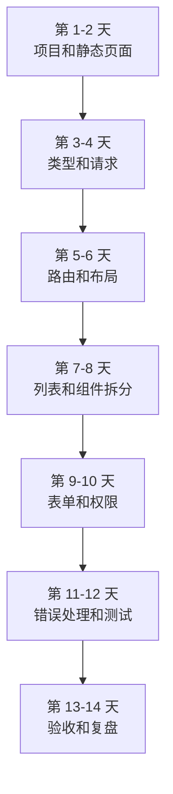

## 练习规则

### 每天都要有产出

每天结束时至少提交一种产出：

- 一个可运行页面。
- 一个类型文件。
- 一个 composable。
- 一个组件。
- 一个测试。
- 一段 README。
- 一条问题复盘。

只读文档不算完成练习。

### 每天都要写学习记录

在 `LEARNING_NOTES.md` 里记录：

```md
## 第 N 天：主题

### 今天完成

### 涉及文件

### 遇到的问题

### 解决方式

### 明天继续
```

这样做的价值是：你以后遇到同类问题时，可以回到自己的复盘，而不是重新搜索。

### 每个阶段都要能跑

不要等 14 天结束才第一次构建。推荐每天至少跑一次：

```bash
npm run dev
npm run build
```

如果项目已经配置了类型检查和测试，再跑：

```bash
npm run typecheck
npm run test
```

## 项目目标模型

这个练习围绕“用户管理”展开。用户管理足够典型，能覆盖后台系统的主要能力。

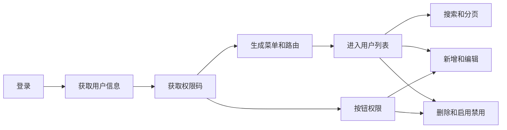

## 第 1 天：创建项目和目录

### 目标

创建一个 Vue 3 + TypeScript 项目，并整理出后续练习会用到的目录结构。

### 任务

1. 创建 Vite Vue TS 项目。
2. 安装 Vue Router 和 Pinia。
3. 创建 `app`、`features`、`shared`、`styles` 目录。
4. 创建 README。
5. 写清启动命令和目录说明。

### 推荐目录

```text
src/
  app/
    main.ts
    router/
    stores/
    layouts/
  features/
    users/
  shared/
    request/
    components/
    constants/
    utils/
  styles/
```

### 验收标准

- `npm run dev` 能启动。
- 首页能显示一段项目标题。
- README 写清技术栈、启动命令、目录含义。
- 目录不是随手创建，而是能解释职责。

### 常见问题

| 问题 | 处理 |
| --- | --- |
| 不知道目录怎么拆 | 先照推荐目录做，后面再按业务调整 |
| 创建后页面白屏 | 先看控制台和终端报错 |
| 别名不可用 | 同时检查 Vite alias 和 TypeScript paths |

## 第 2 天：后台布局和静态用户页

### 目标

不接接口、不接权限，先把后台的视觉骨架和用户列表静态页面搭出来。

### 页面结构图

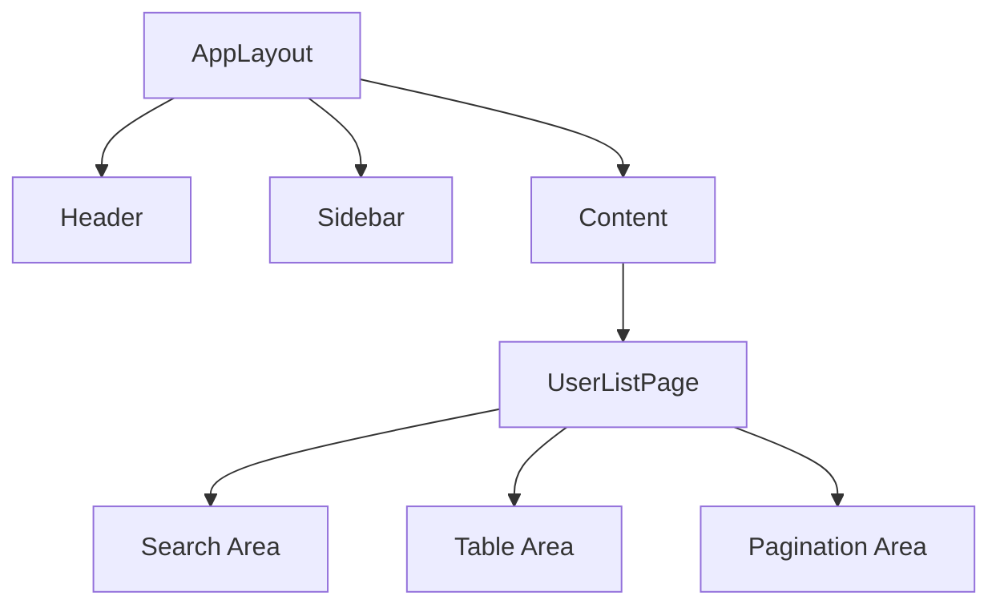

### 任务

1. 创建 `AppLayout.vue`。
2. 创建 `UserListPage.vue`。
3. 使用 mock 数组显示用户列表。
4. 做搜索区、表格区、分页区。
5. 窄屏下检查是否有整体横向溢出。

### mock 数据

```ts
const mockUsers = [
  { id: 1, name: 'Ada', mobile: '13800000001', enabled: true },
  { id: 2, name: 'Lin', mobile: '13800000002', enabled: false }
]
```

### 验收标准

- 页面分区清楚。
- 用户列表能显示。
- 按钮和状态点不会被挤压变形。
- 390px 宽度下没有整体横向滚动。
- CSS 命中明确业务 class，不写 `.page div`、`.page *`。

## 第 3 天：类型边界

### 目标

为用户模块定义 DTO、页面模型、表单状态和提交参数。

### 类型流转图

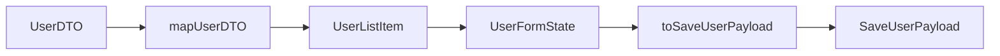

### 任务

1. 创建 `features/users/types.ts`。
2. 定义 `UserDTO`。
3. 定义 `UserListItem`。
4. 定义 `UserFormState`。
5. 定义 `SaveUserPayload`。
6. 写 `mapUserDTO`、`createEmptyUserForm`、`createEditUserForm`、`toSaveUserPayload`。

### 验收标准

- DTO 不直接进入组件模板。
- 表单类型不等于提交类型。
- 编辑表单复制列表行，不引用原对象。
- 转换函数不依赖组件实例。
- 至少写 3 条转换函数测试用例。

### 常见问题

| 问题 | 处理 |
| --- | --- |
| 到处写 `any` | 先定义接口，确实未知再用 `unknown` |
| DTO 直接进表格 | 先映射成 ViewModel |
| 表单和提交参数混用 | 用转换函数隔离 |

## 第 4 天：请求封装和 mock API

### 目标

建立 service 层和 request 层，即使先用 mock，也要保持真实项目的调用方式。

### 请求链路

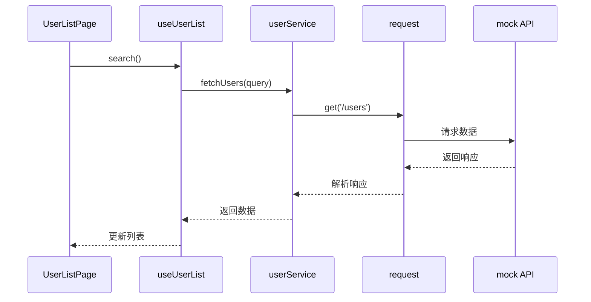

### 任务

1. 创建 `shared/request/index.ts`。
2. 创建 `shared/request/types.ts`。
3. 创建 `features/users/services/userService.ts`。
4. 先用 Promise + mock 数据模拟接口。
5. 支持列表查询、新增、编辑、删除。
6. 模拟 401、403、500 三类错误。

### 验收标准

- 页面不直接调用 `fetch`。
- service 函数命名表达业务动作。
- request 层能统一返回错误。
- mock API 和真实 API 的调用形态一致。

## 第 5 天：路由和登录页

### 目标

建立登录页、后台布局路由、用户管理路由。

### 任务

1. 安装并配置 Vue Router。
2. 创建 `/login`。
3. 创建 `/users`。
4. 创建 403 和 404 页面。
5. 配置 `meta.requiresAuth`。
6. 创建基础路由守卫。

### 路由守卫流程

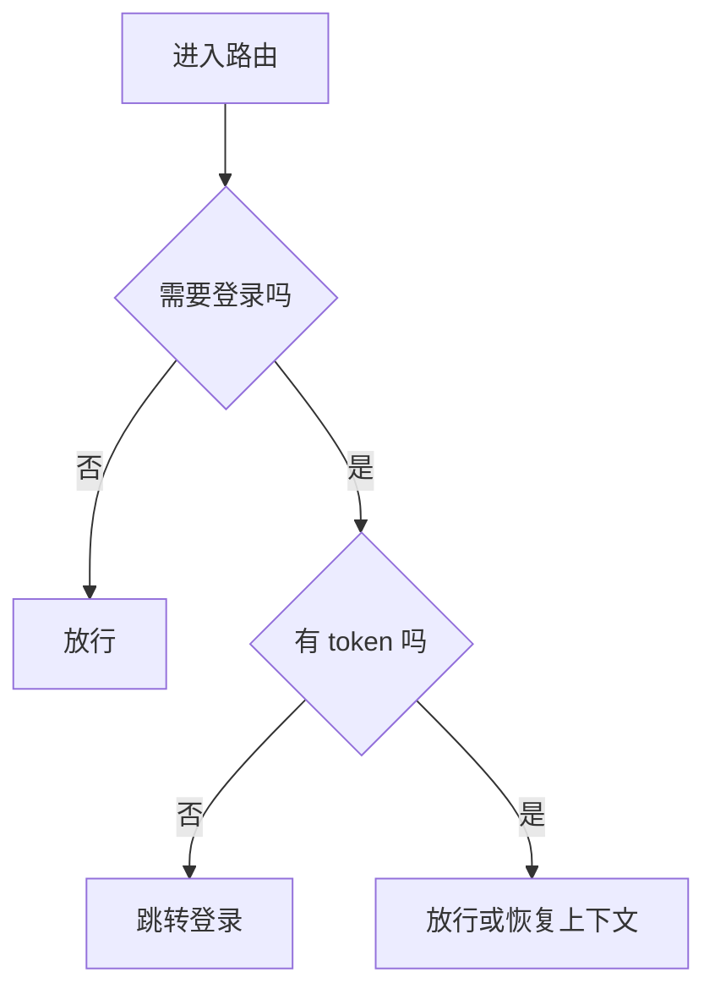

### 验收标准

- `/login` 能访问。
- `/users` 未登录时跳登录。
- 登录后能进入 `/users`。
- 深层路由刷新不白屏。
- 404 页面能显示。

## 第 6 天：Pinia 登录态

### 目标

用 Pinia 管理 token、当前用户和退出登录。

### 任务

1. 创建 `authStore`。
2. 保存 token。
3. 登录后写入 token。
4. 刷新页面后能恢复 token。
5. 退出登录时清理 token 和用户信息。
6. 在路由守卫中使用 authStore。

### Store 边界

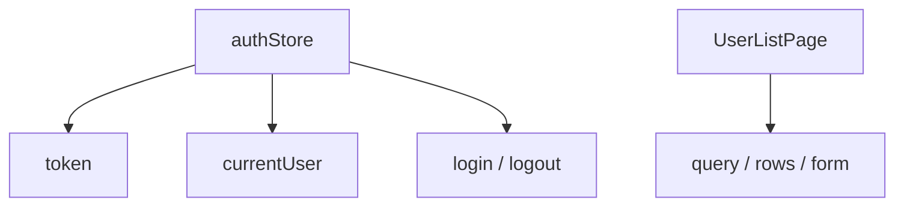

`query`、`rows`、`form` 不放进 authStore，它们只属于用户列表页面。

### 验收标准

- token 刷新后仍然存在。
- 退出后 token 被清理。
- Store 状态解构使用 `storeToRefs`。
- 登录态逻辑不散落在多个页面。

## 第 7 天：用户列表 composable

### 目标

用 `useUserList` 管理列表查询、分页、loading、error。

### 任务

1. 创建 `features/users/useUserList.ts`。
2. 管理 `query`、`rows`、`total`、`loading`、`error`。
3. 实现 `loadUsers`。
4. 实现 `search`。
5. 实现 `changePage`。
6. 实现 `refreshAfterDelete`。

### 状态机

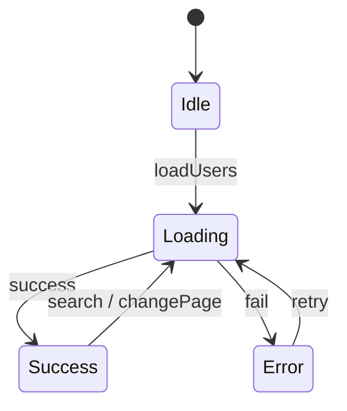

### 验收标准

- 首次进入只请求一次。
- 搜索时页码回到 1。
- 翻页能更新列表。
- 删除最后一条后页码能回退。
- 失败后有错误状态和重试入口。

## 第 8 天：搜索、表格、分页拆分

### 目标

把用户列表页拆成可维护的业务组件。

### 组件关系

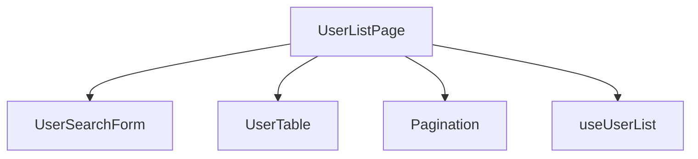

### 任务

1. 创建 `UserSearchForm.vue`。
2. 创建 `UserTable.vue`。
3. 分页可以先留在页面，也可以封装。
4. 搜索组件只负责收集查询条件。
5. 表格组件只负责展示和抛出行操作。
6. 页面组件负责组织流程。

### 验收标准

- 子组件不直接请求接口。
- 子组件不直接改 Pinia 登录态。
- props 和 emits 有类型。
- emits 名称使用业务动作。
- 页面组件读起来像流程，而不是细节堆叠。

## 第 9 天：新增和编辑弹窗

### 目标

完成新增、编辑和表单校验，避免污染列表数据。

### 表单流程

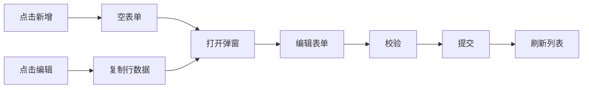

### 任务

1. 创建 `UserFormDialog.vue`。
2. 新增时使用 `createEmptyUserForm`。
3. 编辑时使用 `createEditUserForm(row)`。
4. 提交时使用 `toSaveUserPayload`。
5. 添加 `submitting` 防重复提交。
6. 成功后关闭弹窗并刷新列表。

### 验收标准

- 编辑未保存时，列表不变化。
- 取消后表单状态被清理。
- 必填字段有校验。
- 提交中按钮禁用。
- 保存成功后刷新列表。

## 第 10 天：权限码和按钮权限

### 目标

完成页面权限和按钮权限的最小闭环。

### 任务

1. 创建 `permissionStore`。
2. 定义权限码常量。
3. 登录后写入权限码。
4. 路由 meta 写页面权限。
5. 新增、编辑、删除按钮按权限显示。
6. 模拟 403 错误并展示提示。

### 权限链路

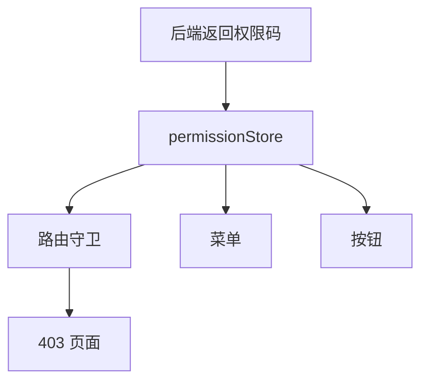

### 验收标准

- 权限码集中定义。
- 页面、菜单、按钮使用同一份权限数据。
- 退出登录时清空权限。
- 前端隐藏按钮，后端或 mock API 仍然校验权限。

## 第 11 天：动态菜单和刷新恢复

### 目标

解决后台项目里最常见的“刷新后菜单丢失”和“动态路由不匹配”问题。

### 任务

1. mock 后端菜单数据。
2. 根据菜单生成路由。
3. 登录后注册动态路由。
4. 刷新后通过 token 恢复用户信息和菜单。
5. 动态路由注册后重新匹配当前地址。

### 验收标准

- 登录后菜单正常。
- 刷新 `/users` 后菜单仍然存在。
- 刷新深层页面不 404。
- 动态路由注册后能重新进入目标页面。
- 404 路由不会提前吞掉动态路由。

## 第 12 天：错误处理和真实问题复盘

### 目标

补齐 loading、empty、error、401、403、500、网络异常等状态。

### 任务

1. 用户列表支持 loading。
2. 空列表显示空状态。
3. 请求失败显示错误状态。
4. 401 清理登录态并跳转登录。
5. 403 显示无权限提示或页面。
6. 500 显示稍后重试。
7. 把至少 3 个问题写进 `TROUBLESHOOTING.md`。

### 推荐复盘模板

```md
## 问题：刷新后菜单丢失

### 现象

### 复现步骤

### 根因

### 修复

### 如何预防
```

### 验收标准

- 错误不会只出现在控制台。
- 用户知道下一步该做什么。
- 登录失效不会重复弹很多提示。
- 问题复盘能对应到代码修改。

## 第 13 天：测试和构建

### 目标

用测试和构建检查项目是否真的稳定。

### 任务

1. 配置 Vitest。
2. 给 `mapUserDTO` 写测试。
3. 给 `toSaveUserPayload` 写测试。
4. 给 `useUserList` 的分页回退逻辑写测试。
5. 运行类型检查。
6. 运行生产构建。

### 测试优先级

| 优先级 | 测试对象 | 原因 |
| --- | --- | --- |
| 1 | 纯函数转换 | 成本低，收益高 |
| 2 | composable 状态流 | 容易出现分页、loading、error 问题 |
| 3 | 权限判断 | 防止按钮和路由权限错位 |
| 4 | 组件交互 | 关键表单和弹窗再补 |

### 验收标准

- 测试能运行。
- 构建能通过。
- 类型检查能通过。
- 失败时能看懂错误来自哪个文件。

## 第 14 天：总验收和项目说明

### 目标

把项目整理成别人能启动、能理解、能继续维护的状态。

### 任务

1. 完善 README。
2. 补目录结构说明。
3. 补路由和权限说明。
4. 补请求封装说明。
5. 补常见问题说明。
6. 按验收清单逐项检查。

### README 最低内容

```md
# Vue Admin Practice

## 技术栈

## 启动

## 目录结构

## 用户管理模块

## 路由和权限

## 请求封装

## 测试和构建

## 常见问题
```

### 总验收清单

| 类别 | 验收项 |
| --- | --- |
| 启动 | 新人能按 README 启动 |
| 路由 | 登录、用户页、403、404 正常 |
| 列表 | 搜索、分页、loading、empty、error 正常 |
| 表单 | 新增、编辑、校验、防重复提交正常 |
| 权限 | 页面、菜单、按钮、403 正常 |
| 状态 | Store 和页面状态边界清楚 |
| 类型 | DTO、ViewModel、FormState、Payload 分层 |
| 请求 | 401、403、500、网络错误有统一处理 |
| 测试 | 关键转换函数和列表逻辑有测试 |
| 构建 | 生产构建通过 |
| 文档 | README、学习记录、问题复盘完整 |

## 进阶专项：3 天完成消息通知闭环

完成用户管理、权限、请求和错误处理后，可以用 3 天把 Vue Admin 里的消息通知中心补成一个可验收模块。它适合放在审批流、工作台和文件导入导出之后练习，因为通知中心会把这些业务事件串起来。

### 专项目标

做出一个可运行的消息通知模块：

```text
src/
  features/
    notifications/
      api/
      components/
      composables/
      model/
      pages/
```

最终至少包含：

| 能力 | 必须完成 |
| --- | --- |
| 顶部铃铛 | 展示未读数，点击打开最近消息 |
| 消息中心 | 支持关键词、类型、已读状态、分页 |
| 已读动作 | 单条已读、批量已读、全部已读 |
| 实时刷新 | 先用轮询，进阶可接 SSE 或 WebSocket |
| 跳转业务 | 通知能跳审批详情、任务详情或业务详情 |
| 登录态清理 | 退出和切换账号时清空通知状态 |
| 问题复盘 | 记录至少 2 个通知问题和修复证据 |

### 专项总图

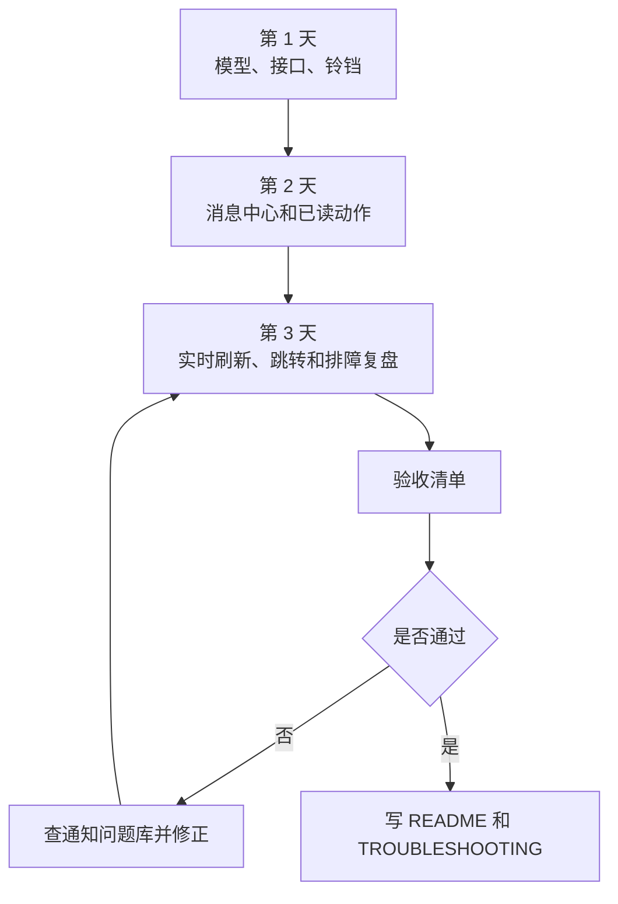

### 准备文档

- [Vue Admin 消息通知、站内信、实时提醒与已读闭环实战](/vue/admin-notification-center)
- [Vue Admin 消息通知、未读数与实时提醒问题排查专题](/projects/issues-vue-admin-notification)
- [Vue Admin 工作台、统计卡片、图表看板与数据刷新闭环实战](/vue/admin-dashboard-analytics)
- [Vue Admin 审批流、状态机、待办与审计闭环实战](/vue/admin-approval-workflow)
- [Vue Admin 请求封装与错误处理闭环手册](/vue/admin-request-error-handling)

### 第 1 天：模型、接口和顶部铃铛

目标：先建立通知模块骨架，不急着做复杂实时通信。

任务：

1. 创建 `features/notifications` 目录。
2. 定义 `NotificationDTO`、`UnreadCountDTO`、`NotificationListQuery`。
3. 创建 `notificationApi.ts`，封装未读数、最近消息、列表接口。
4. 创建 `useUnreadCount`，管理未读数量、加载状态和重置动作。
5. 创建 `NotificationBell.vue`，显示未读数和最近 5 条消息。
6. 在后台 Layout 中接入铃铛。

验收标准：

- 刷新后台后会加载未读数。
- 打开铃铛下拉时才加载最近消息。
- 未读数大于 99 时显示 `99+`。
- 退出登录时能清空未读数。
- 铃铛组件不直接写接口地址。

### 第 2 天：消息中心、筛选和已读动作

目标：把下拉提醒升级成完整站内信页面。

任务：

1. 增加 `/notifications` 路由。
2. 创建 `NotificationCenterPage.vue`。
3. 创建 `useNotificationList` 管理查询、分页、loading、error。
4. 支持关键词、类型、已读状态筛选。
5. 支持单条已读、批量已读、全部已读。
6. 已读成功后刷新列表和未读数。

数据流：


验收标准：

- 搜索后分页回到第一页。
- 列表失败有 error 状态和重试入口。
- 单条已读不会导致未读数变负数。
- 批量已读期间按钮不可重复点击。
- 全部已读后重新从服务端取未读数。

### 第 3 天：实时刷新、业务跳转和问题复盘

目标：处理真实项目里最容易出问题的边界。

任务：

1. 先实现 30 秒轮询未读数。
2. 页面重新可见时刷新未读数。
3. 进阶：如果后端支持 SSE 或 WebSocket，封装 `useNotificationRealtime`。
4. 点击审批待办通知时跳转审批详情。
5. 无权限、路由不存在、业务记录已删除时给出明确提示。
6. 模拟并复盘两个问题：未读数不一致、重复通知、切换账号污染、实时连接重连任选两个。

实时补偿流程：

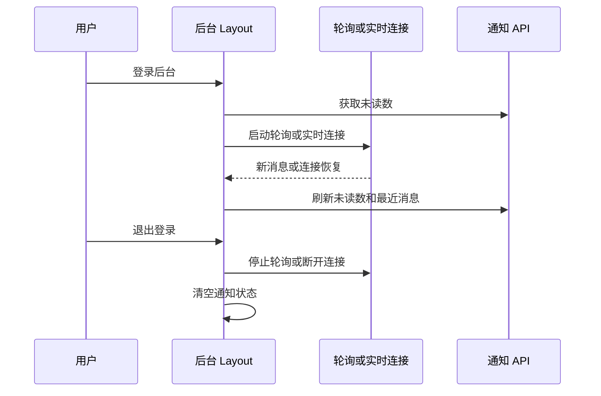

验收标准：

- 不会启动多个重复定时器。
- 断线或页面重新可见后会刷新未读数。
- 切换账号后不会显示旧账号未读数。
- 重复事件不会重复弹窗。
- 通知跳转失败时不是空白页。
- `TROUBLESHOOTING.md` 至少记录 2 个通知问题。

### 专项交付清单

| 交付物 | 要求 |
| --- | --- |
| README | 写清通知模块目录、接口、启动方式和模拟数据 |
| LEARNING_NOTES | 记录每天完成内容和卡点 |
| TROUBLESHOOTING | 记录通知问题复盘 |
| 截图或录屏 | 铃铛、消息中心、已读动作、错误状态 |
| 验收结果 | 对照本专项验收标准逐项打勾 |

## 7 天压缩版

如果你没有 14 天，可以用压缩版：

| 天数 | 内容 |
| --- | --- |
| 第 1 天 | 创建项目、目录、布局、静态用户页 |
| 第 2 天 | 类型边界、mock API、request 封装 |
| 第 3 天 | 路由、登录、Pinia 登录态 |
| 第 4 天 | 用户列表 composable、搜索、分页 |
| 第 5 天 | 表单弹窗、新增、编辑、删除 |
| 第 6 天 | 权限、动态菜单、刷新恢复 |
| 第 7 天 | 错误处理、测试、构建、README |

压缩版不能跳过验收，只是把多个阶段合并。

## 常见卡点对照

| 卡点 | 先看文档 | 做什么 |
| --- | --- | --- |
| 不知道组件怎么拆 | [Vue 从零到项目落地](/vue/project-from-zero) | 重画组件关系图 |
| 表单污染列表 | [Vue 真实项目问题库](/projects/issues-vue) | 改成复制表单对象 |
| 动态菜单刷新丢失 | [Vue Admin 权限路由闭环实战](/vue/admin-permission-route-flow) | 增加刷新恢复流程 |
| 类型越写越乱 | [TypeScript 类型边界问题库](/projects/issues-typescript) | 分离 DTO 和 Payload |
| 请求重复 | [Vue 真实项目问题库](/projects/issues-vue) | 明确唯一加载入口 |
| 消息未读数不准 | [Vue Admin 消息通知排障](/projects/issues-vue-admin-notification) | 对齐未读数、列表和工作台口径 |
| 实时连接反复重连 | [Vue Admin 消息通知排障](/projects/issues-vue-admin-notification) | 区分鉴权失败和网络断线 |
| 构建失败 | [前端工程化问题库](/engineering/troubleshooting) | 先跑 typecheck |

## 下一步学习

完成这套练习后，进入：

- [Vue 从零到项目落地](/vue/project-from-zero)
- [Vue Admin 学习地图与交付清单](/roadmap/vue-admin-learning-map)
- [Vue Admin 权限路由闭环实战](/vue/admin-permission-route-flow)
- [Vue Admin 用户模块实现手册](/vue/admin-user-module)
- [Vue Admin 角色权限模块实现手册](/vue/admin-permission-module)
- [Vue Admin 菜单与动态路由实现手册](/vue/admin-menu-route-module)
- [Vue Admin 组织架构与数据权限实现手册](/vue/admin-organization-data-permission)
- [Vue Admin 请求封装与错误处理闭环手册](/vue/admin-request-error-handling)
- [Vue Admin 消息通知、站内信、实时提醒与已读闭环实战](/vue/admin-notification-center)
- [Vue Admin 消息通知、未读数与实时提醒问题排查专题](/projects/issues-vue-admin-notification)
- [项目排障方法论](/projects/debugging-playbook)
- [Vue 真实项目问题库](/projects/issues-vue)
- [项目里程碑](/roadmap/project-milestones)
- [能力自测](/roadmap/self-assessment)

## 参考资料

- [Vue `<script setup>` 官方文档](https://vuejs.org/api/sfc-script-setup)
- [Vue Router 动态路由官方文档](https://router.vuejs.org/guide/advanced/dynamic-routing)
- [Pinia 官方文档](https://pinia.vuejs.org/core-concepts/)
- [Vue 官方测试建议](https://vuejs.org/guide/scaling-up/testing)
- [Vitest 官方指南](https://vitest.dev/guide/)
