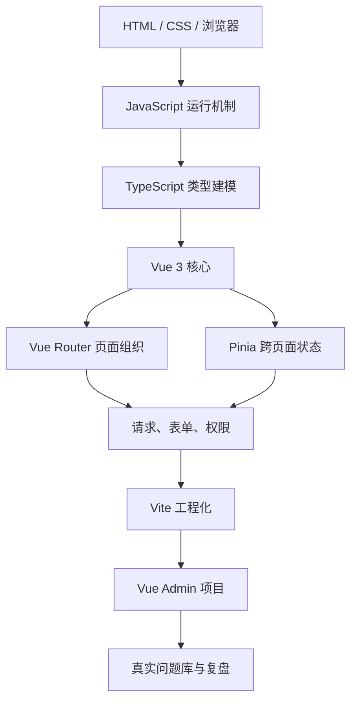
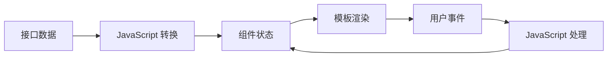
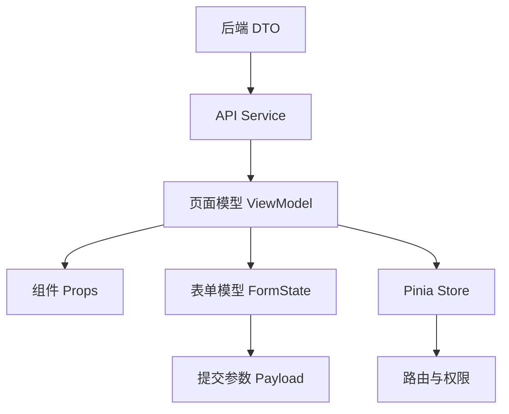
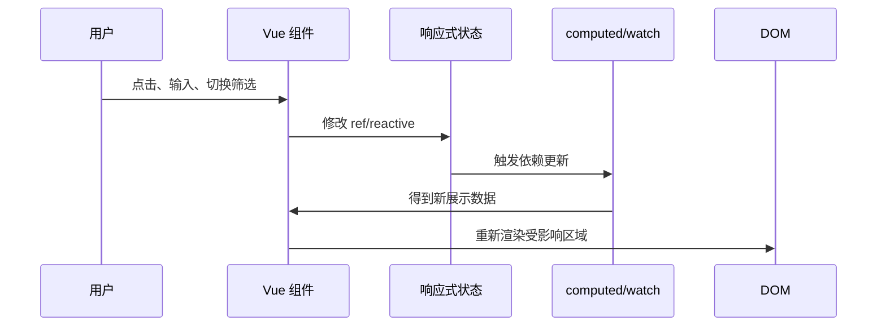
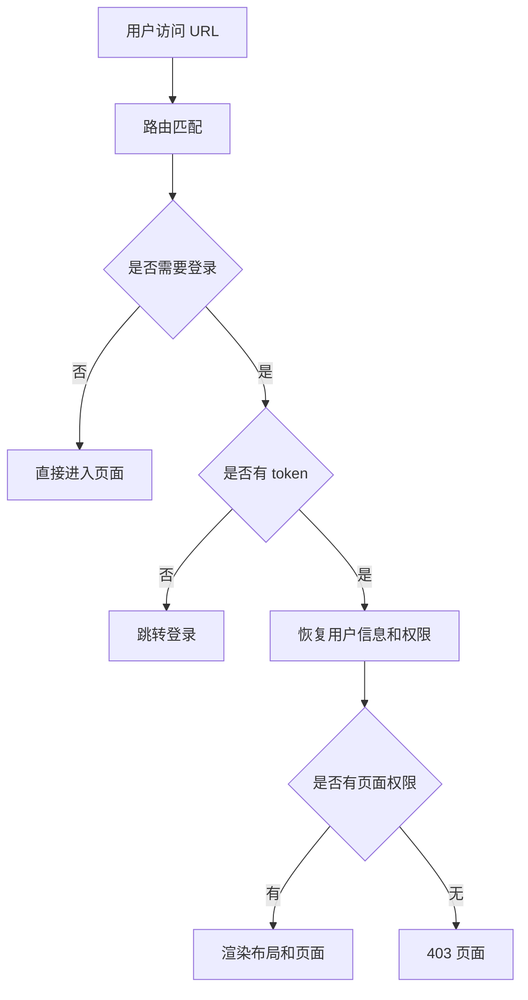
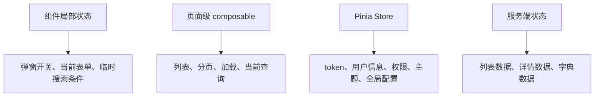
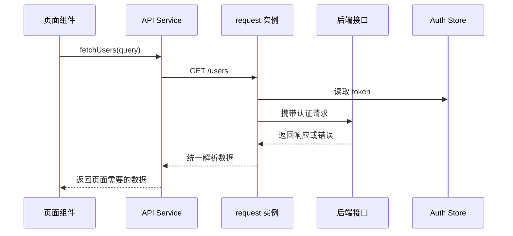
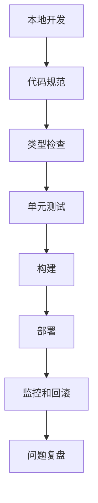
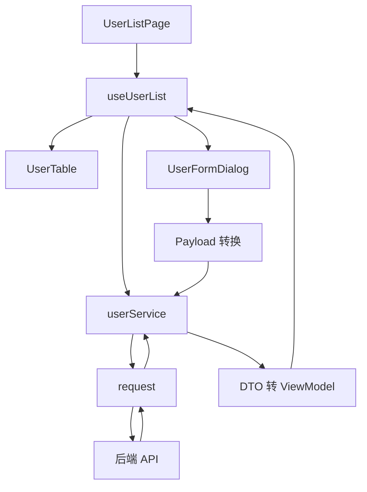
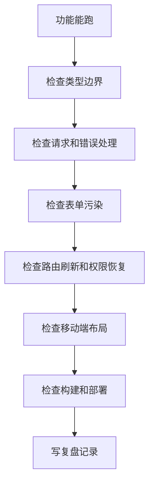

# Vue 前端工程师路线

## 适合谁看

这条路线面向准备系统学习 Vue 3 的前端开发者。它不是知识点清单，而是一条从“能写页面”到“能交付项目、能排查问题、能和后端协作”的学习路径。

如果你现在的状态是：

- 会一点 HTML、CSS、JavaScript，但不知道怎么进入 Vue 项目。
- 能写 Vue 页面，但组件、状态、路由、请求、权限经常混在一起。
- 看过很多教程，但自己做后台管理项目时不知道先做什么。
- 项目里遇到 401、动态菜单、表单污染、重复请求、权限错位等问题时靠猜。

这篇就是你的主线入口。你不需要一次读完整个站点，而是按阶段进入对应文档，边学边做练习，最后用 Vue Admin 项目验收。

## 路线总图

Vue 前端工程师的能力不是只会 `ref`、`computed`、`watch`。真正项目里需要把语言、框架、工程、业务和排错连起来。



这张图要表达三件事：

1. Vue 不是第一步，JavaScript 和 TypeScript 是 Vue 项目的地基。
2. 路由、状态、请求、表单、权限不是分散知识点，它们最终会汇合到一个业务页面。
3. 学完章节不等于掌握，必须通过项目和问题复盘验证。

## 推荐学习顺序

<LearningPath :steps="[
  { title: '前端基础', description: '掌握 HTML 语义、CSS 布局、响应式页面和浏览器基础。', link: '/frontend/html-css', badge: '基础' },
  { title: 'CSS', description: '掌握盒模型、Flex、Grid、响应式设计、可访问性、项目样式架构和 CSS 从零到项目落地。', link: '/css/introduction', badge: '样式' },
  { title: 'JavaScript', description: '掌握数据类型、函数、数组对象、DOM 事件、异步请求、事件循环和模块化。', link: '/javascript/introduction', badge: '基础' },
  { title: 'TypeScript', description: '理解类型、接口、泛型、类型收窄，并能给组件、接口、表单和状态建模。', link: '/typescript/introduction', badge: '必学' },
  { title: 'Vue 3 核心', description: '学习响应式、模板语法、组件通信、组合式 API、生命周期和内置组件。', link: '/vue/introduction', badge: '核心' },
  { title: '路由与状态', description: '使用 Vue Router 组织页面，用 Pinia 管理登录态、用户信息和跨页面状态。', link: '/vue/router', badge: '项目' },
  { title: '请求与权限', description: '封装请求、处理错误、组织登录态、动态路由、菜单权限和按钮权限。', link: '/vue/request', badge: '业务' },
  { title: '工程化', description: '使用 Vite、环境变量、代码规范、构建部署、测试和项目目录约定。', link: '/engineering/vite', badge: '交付' },
  { title: '项目实战', description: '通过 Vue Admin 学习地图完成一个可扩展的后台管理项目。', link: '/roadmap/vue-admin-learning-map', badge: '实战' },
  { title: '问题复盘', description: '用真实项目问题库复盘重复请求、权限半更新、表单污染和类型边界问题。', link: '/projects/real-world-issues', badge: '排错' }
]" />

## 学习原则

### 先能跑，再追求优雅

初学阶段不要一开始就设计复杂架构。建议先做出一个能访问的页面，再逐步补：

- 组件拆分。
- 类型定义。
- 请求封装。
- 状态管理。
- 权限控制。
- 错误处理。
- 构建和部署。

如果一开始就追求“完美目录”，很容易卡在命名和抽象上，反而看不到数据如何从接口流到页面。

### 先学真实高频场景

Vue 项目里最常见的页面不是炫酷动画，而是后台业务页面：

- 列表。
- 搜索。
- 分页。
- 新增。
- 编辑。
- 删除。
- 详情。
- 导入导出。
- 权限按钮。
- 登录态恢复。

所以这条路线优先围绕 Vue Admin，而不是围绕零散组件 Demo。

### 每个阶段都要产出可运行结果

<PracticeBlock title="阶段产出比读完章节更重要" tone="sky">
每完成一个阶段，至少保留一个可运行页面、一个 README、一张数据流图和一份问题记录。不要只收藏链接，也不要只写笔记不写代码。
</PracticeBlock>

## 阶段 1：前端基础

### 目标

能写一个结构清晰、样式稳定、在桌面和手机上都能阅读的页面。

### 必学内容

- HTML 语义标签：知道什么时候用 `header`、`main`、`section`、`nav`、`button`。
- CSS 盒模型：知道宽度、内边距、边框、外边距如何影响布局。
- Flex 和 Grid：能完成常见列表、表单、工具栏和两栏布局。
- 响应式：知道移动端为什么会横向溢出，如何用 `max-width`、`minmax`、`flex-wrap` 修正。
- 浏览器基础：知道页面加载、资源请求、缓存和渲染大致过程。

### 推荐文档

| 任务 | 文档 |
| --- | --- |
| 建立页面基础 | [HTML 与 CSS](/frontend/html-css) |
| 学布局系统 | [CSS 学习导览](/css/introduction) |
| 看图理解布局 | [图解 CSS 核心概念](/css/visual-guide) |
| 做样式系统项目 | [CSS 从零到项目落地](/css/project-from-zero) |
| 理解浏览器 | [浏览器与网络导览](/browser/introduction) |
| 做请求调试项目 | [浏览器与网络从零到项目落地](/browser/project-from-zero) |

### 最小练习

做一个“用户列表静态页”：

1. 顶部放标题和主要操作按钮。
2. 中间放搜索区、表格区和分页区。
3. 移动端把搜索项换行，表格允许横向滚动。
4. 所有按钮、头像、状态点设置固定宽高，避免被挤压。
5. 写 README 说明页面结构。

### 验收标准

- 不依赖绝对定位堆 UI。
- 页面缩到 390px 宽时没有整体横向滚动。
- 按钮文字不溢出。
- 表格、搜索区、分页区在视觉上能分清层级。
- CSS 选择器命中业务 class，不用宽泛的 `div div`、`.xxx *`。

## 阶段 2：JavaScript 基础

### 目标

能用 JavaScript 处理列表数据、事件、异步请求和错误，不再把 Vue 当成“魔法”。

### JavaScript 在 Vue 项目里的位置



Vue 模板里的 `v-for`、`v-if`、事件处理、计算属性，本质上都依赖 JavaScript 的数据处理能力。

### 必学内容

- 数据类型：区分字符串、数字、布尔值、数组、对象、`null`、`undefined`。
- 函数和作用域：知道变量在哪里可见，什么时候会形成闭包。
- 数组对象：会用 `map`、`filter`、`find`、`some`、`every`、`reduce`。
- DOM 事件：理解事件对象、事件冒泡和事件委托。
- 异步：理解 Promise、`async/await`、错误捕获。
- 事件循环：知道同步任务、微任务、宏任务的大致顺序。
- 模块化：知道如何拆分 `services`、`utils`、`constants`。

### 推荐文档

| 任务 | 文档 |
| --- | --- |
| 建立整体模型 | [JavaScript 学习导览](/javascript/introduction) |
| 看图理解运行机制 | [图解 JavaScript 核心概念](/javascript/visual-guide) |
| 补语法基础 | [JavaScript 基础](/javascript/fundamentals) |
| 处理列表和对象 | [数组与对象](/javascript/array-object) |
| 理解请求顺序 | [异步编程](/javascript/async) |
| 进入小项目 | [JavaScript 任务看板从零到项目](/javascript/task-board-project) |

### 最小练习

做一个“任务列表”：

1. 用数组保存任务。
2. 支持新增、完成、删除。
3. 支持按状态筛选。
4. 支持保存到 `localStorage`。
5. 刷新页面后恢复数据。
6. 写一个错误提示函数，处理 JSON 解析失败。

### 验收标准

- 数据源是数组，不直接从 DOM 反推状态。
- 事件监听可以清理，不重复绑定。
- 异步错误能进入统一处理。
- `localStorage` 读取时有兜底，不假设数据永远正确。

## 阶段 3：TypeScript 类型建模

### 目标

能给接口、组件、表单、状态和权限写类型，让错误尽量在开发阶段暴露。

### 为什么 Vue 项目一定要学 TypeScript

后台系统里数据结构多、状态多、权限多。如果没有类型约束，很多问题会到运行时才暴露：

- 接口字段改名，页面继续读取旧字段。
- 表单提交参数和表单 UI 状态混在一起。
- 权限码字符串拼错。
- 路由 `meta` 字段写错。
- Pinia Store 被临时状态污染。

### 类型边界图



核心原则：接口返回、页面展示、表单编辑、提交参数不要用同一个类型混到底。

### 推荐文档

| 任务 | 文档 |
| --- | --- |
| 建立类型模型 | [TypeScript 学习导览](/typescript/introduction) |
| 看图理解边界 | [图解 TypeScript 核心概念](/typescript/visual-guide) |
| 基础类型 | [基础类型](/typescript/basic-types) |
| 接口和类型别名 | [接口与类型别名](/typescript/interface-type) |
| 类型收窄 | [类型收窄与守卫](/typescript/narrowing-guards) |
| Vue 集成 | [Vue 项目集成](/typescript/vue-integration) |
| 从零到项目 | [TypeScript 类型边界从零到项目](/typescript/type-boundary-project) |
| 真实问题 | [TypeScript 类型边界问题库](/projects/issues-typescript) |

### 最小练习

给用户管理模块定义这些类型：

```ts
export interface UserDTO {
  id: number
  user_name: string
  mobile: string | null
  status: 0 | 1
  roles: string[]
}

export interface UserListItem {
  id: number
  name: string
  mobileText: string
  enabled: boolean
  roleNames: string[]
}

export interface UserFormState {
  name: string
  mobile: string
  roleIds: number[]
  enabled: boolean
}

export interface CreateUserPayload {
  name: string
  mobile?: string
  roleIds: number[]
  status: 0 | 1
}
```

然后写转换函数：

```ts
export function mapUserDTO(dto: UserDTO): UserListItem {
  return {
    id: dto.id,
    name: dto.user_name,
    mobileText: dto.mobile || '-',
    enabled: dto.status === 1,
    roleNames: dto.roles
  }
}
```

### 验收标准

- 组件不直接使用后端 DTO。
- 新增表单和编辑表单有独立状态。
- 提交参数由转换函数生成。
- 权限码使用联合类型或常量对象，不散落裸字符串。
- `npm run typecheck` 或构建能发现类型错误。

## 阶段 4：Vue 3 核心

### 目标

能正确使用组合式 API、响应式、模板语法、组件通信和生命周期。

### Vue 页面运行模型



你需要理解的不是“Vue 会自动更新”，而是：

- 哪些数据是响应式的。
- 哪些逻辑应该写在 `computed`。
- 哪些副作用应该写在 `watch`。
- 哪些资源需要在卸载时清理。
- 哪些状态应该留在组件，哪些应该进入 Pinia。

### 必学内容

| 能力 | 要点 | 文档 |
| --- | --- | --- |
| 模板语法 | 插值、指令、事件、列表、条件 | [模板语法](/vue/template-syntax) |
| 响应式 | `ref`、`reactive`、`computed`、`watch` | [响应式基础](/vue/reactivity) |
| 组件 | `props`、`emits`、slot、组件拆分 | [组件设计](/vue/component) |
| 组合式 API | `script setup`、composable、逻辑复用 | [组合式 API](/vue/composition-api) |
| 生命周期 | 初始化、请求、监听、清理 | [生命周期](/vue/lifecycle) |
| 内置组件 | `Teleport`、`KeepAlive`、异步组件 | [内置组件](/vue/built-ins) |

### 最小练习

把用户列表拆成 4 个组件：

```text
views/users/UserListPage.vue
components/UserSearchForm.vue
components/UserTable.vue
components/UserFormDialog.vue
composables/useUserList.ts
```

拆分规则：

- 页面组件负责组织流程。
- 搜索组件只负责搜索条件输入。
- 表格组件只负责展示和行操作事件。
- 弹窗组件负责表单 UI 和校验。
- `useUserList` 负责列表请求、分页、加载和刷新。

### 常见误区

| 误区 | 结果 | 修正 |
| --- | --- | --- |
| 所有逻辑都写在页面组件 | 文件越来越长，难测试 | 按页面流程、表单、请求拆分 |
| `watchEffect` 到处用 | 依赖不清楚，容易重复请求 | 需要新旧值时用 `watch` |
| `computed` 里发请求 | 副作用不可控 | 请求放在函数或 `watch` |
| 直接改 `props` | 数据来源混乱 | 子组件通过 `emit` 通知父组件 |
| 用 `index` 做列表 key | 删除、排序后状态错位 | 使用稳定业务 ID |

## 阶段 5：路由与页面结构

### 目标

能设计真实项目的页面结构、菜单结构、动态路由和登录态恢复。

### 路由在后台项目里的职责



路由不是只写 `path` 和 `component`。后台项目里，路由还承载：

- 页面标题。
- 菜单分组。
- 是否缓存。
- 是否需要登录。
- 页面权限码。
- 面包屑。
- 布局类型。

### 推荐文档

- [路由与页面](/vue/router)
- [权限与菜单](/vue/permission)
- [Vue Router 速查](/cheatsheets/vue-router)
- [真实项目问题库：前端页面与状态](/projects/issues-frontend)

### 最小练习

为用户管理模块设计路由：

```ts
export const userRoutes = [
  {
    path: '/system/users',
    name: 'SystemUsers',
    component: () => import('@/views/system/users/UserListPage.vue'),
    meta: {
      title: '用户管理',
      requiresAuth: true,
      permission: 'system:user:view',
      keepAlive: true
    }
  }
]
```

同时补充 `RouteMeta` 类型声明，避免 `meta.permission` 拼错后没人发现。

### 验收标准

- 页面路径稳定，能直接刷新访问。
- 登录后能恢复动态菜单。
- 无权限页面进入 403，而不是空白页。
- 菜单显示和路由权限使用同一份权限数据。
- 路由 meta 有类型，不靠字符串猜。

## 阶段 6：Pinia 状态管理

### 目标

能判断什么状态应该进 Store，什么状态应该留在页面组件里。

### 状态分层图



不要把 Pinia 当成全局杂物间。判断标准很简单：

- 刷新页面是否需要恢复？
- 多个页面是否共享？
- 是否属于当前登录用户上下文？
- 是否影响路由、菜单、权限或全局布局？

如果答案都是否，先留在页面组件或 composable。

### 推荐文档

- [Pinia 状态管理](/vue/pinia)
- [Vue 项目集成](/typescript/vue-integration)
- [TypeScript 类型边界问题库](/projects/issues-typescript)

### 最小练习

设计三个 Store：

```text
stores/auth.ts        token、登录、退出
stores/user.ts        当前用户、角色、权限码
stores/app.ts         主题、折叠菜单、全局配置
```

不要把用户列表、弹窗表单、当前页码放进全局 Store，除非有明确恢复或跨页面共享需求。

### 验收标准

- Store 名称表达业务职责。
- action 负责修改状态，不在组件里散落修改。
- 登出时清理 token、用户信息、权限和动态路由。
- Store 类型清晰，不能随便塞临时字段。

## 阶段 7：请求、表单和权限

### 目标

能完成后台管理系统最常见的业务链路：登录、请求、列表、表单、权限、错误处理。

### 请求链路图



请求封装的目的不是少写几行 `fetch`，而是统一处理：

- baseURL。
- token。
- 超时。
- 业务错误。
- 401 重新登录。
- 403 无权限。
- 重复提交。
- 加载状态。
- 错误提示。

### 表单数据流


最重要的规则：编辑弹窗不要直接绑定列表行对象，否则用户还没点保存，列表已经被改了。

### 推荐文档

- [请求与接口封装](/vue/request)
- [表单处理](/vue/forms)
- [权限与菜单](/vue/permission)
- [真实项目问题库](/projects/real-world-issues)
- [前端页面与状态问题](/projects/issues-frontend)

### 最小练习

完成用户管理功能：

1. 用户列表查询。
2. 搜索条件。
3. 分页。
4. 新增用户。
5. 编辑用户。
6. 删除用户。
7. 启用和禁用。
8. 按钮权限。
9. 401、403、500 错误提示。

### 验收标准

- 页面组件不直接拼接口地址。
- request 层统一处理 token 和错误。
- API Service 只暴露业务函数。
- 表单提交前做字段转换。
- 保存成功后刷新当前页。
- 删除最后一条数据后页码能回退。
- 无权限按钮不展示，接口 403 也有提示。

## 阶段 8：工程化、测试和交付

### 目标

能让项目从“本地能跑”走到“团队能维护、能构建、能上线、能回滚”。

### 工程链路图



### 必学内容

| 能力 | 说明 | 文档 |
| --- | --- | --- |
| Vite | 开发服务器、构建、别名、代理 | [Vite 工程配置](/engineering/vite) |
| 环境变量 | 区分本地、测试、生产配置 | [环境配置](/engineering/env-config) |
| 代码规范 | ESLint、Prettier、提交前检查 | [代码规范](/engineering/eslint-prettier) |
| 测试 | 组件、工具函数、关键流程 | [测试策略](/vue/testing) |
| 构建部署 | 构建产物、Nginx、回滚 | [构建部署](/engineering/build-deploy) |
| 性能 | 首屏、包体积、懒加载 | [性能优化](/vue/performance) |

### 最小练习

给 Vue Admin 项目补齐工程检查：

```bash
npm run typecheck
npm run lint
npm run test
npm run build
```

如果项目暂时没有对应命令，也要在 README 里说明缺失原因和后续补齐计划。

### 验收标准

- 本地启动命令明确。
- 环境变量有示例文件。
- 构建命令能通过。
- 关键工具函数有测试。
- 路由懒加载生效。
- README 写清目录结构、配置方式和常见问题。

## 阶段 9：Vue Admin 项目验收

### 项目结构建议

```text
src/
  app/
    router/
    stores/
    layouts/
  features/
    users/
      components/
      services/
      types.ts
      useUserList.ts
      UserListPage.vue
  shared/
    request/
    constants/
    utils/
    components/
```

这个结构强调“按业务功能聚合”，适合中小型后台项目。通用能力放到 `shared`，用户管理这样的业务模块放到 `features/users`。

### 数据流验收图



### 功能验收清单

| 功能 | 必须达到 |
| --- | --- |
| 登录 | token 保存、刷新恢复、退出清理 |
| 菜单 | 根据权限生成菜单，无权限不展示 |
| 路由 | 直接刷新页面不丢状态，非法页面有 404/403 |
| 用户列表 | 搜索、分页、加载、空状态、错误状态 |
| 表单 | 新增、编辑、校验、提交、取消不污染列表 |
| 权限 | 页面权限和按钮权限同时控制 |
| 请求 | 401、403、业务错误、网络错误统一处理 |
| 类型 | DTO、ViewModel、FormState、Payload 分层 |
| 工程 | 构建通过，README 完整，目录职责清晰 |

## 常见学习卡点

| 卡点 | 表现 | 先看哪里 | 练什么 |
| --- | --- | --- | --- |
| JavaScript 基础不稳 | 看 Vue 代码能懂，自己写不出来 | [JavaScript 基础](/javascript/fundamentals) | 任务看板 |
| 异步顺序混乱 | 请求结果覆盖、加载状态错乱 | [事件循环](/javascript/event-loop) | 搜索防抖和请求取消 |
| 类型写不出来 | 到处 `any`，接口改动才报错 | [类型边界从零到项目](/typescript/type-boundary-project) | DTO 转 ViewModel |
| 组件越写越大 | 一个页面几百行，复用困难 | [组件设计](/vue/component) | 拆用户列表 |
| Store 混乱 | 什么状态都放 Pinia | [Pinia 状态管理](/vue/pinia) | 区分全局和局部状态 |
| 权限错位 | 菜单有了，刷新丢了，按钮还能点 | [权限与菜单](/vue/permission) | 动态路由和按钮权限 |
| 构建才报错 | 开发能跑，CI 失败 | [TypeScript 类型边界问题库](/projects/issues-typescript) | 补 typecheck |

## 4 周学习计划

### 第 1 周：基础和 JavaScript

| 天数 | 任务 | 产出 |
| --- | --- | --- |
| 第 1 天 | HTML/CSS 页面结构 | 用户列表静态页 |
| 第 2 天 | Flex/Grid 和响应式 | 移动端可读布局 |
| 第 3 天 | JavaScript 数据类型和函数 | 搜索和筛选函数 |
| 第 4 天 | 数组对象处理 | 列表排序和分页 |
| 第 5 天 | DOM 事件 | 原生交互列表 |
| 第 6 天 | 异步和错误处理 | 模拟请求和错误提示 |
| 第 7 天 | 复盘 | README 和问题记录 |

### 第 2 周：TypeScript 和 Vue 核心

| 天数 | 任务 | 产出 |
| --- | --- | --- |
| 第 1 天 | TypeScript 基础类型 | 用户类型定义 |
| 第 2 天 | 接口和类型别名 | DTO、ViewModel、Payload |
| 第 3 天 | Vue 快速开始 | 第一个 Vue 页面 |
| 第 4 天 | 响应式和 computed | 搜索结果计算 |
| 第 5 天 | 组件通信 | 搜索、表格、弹窗拆分 |
| 第 6 天 | 组合式 API | `useUserList` |
| 第 7 天 | 复盘 | 类型边界图 |

### 第 3 周：路由、状态、请求和权限

| 天数 | 任务 | 产出 |
| --- | --- | --- |
| 第 1 天 | Vue Router | 后台布局和用户页 |
| 第 2 天 | Pinia | 登录态和用户信息 |
| 第 3 天 | request 封装 | 用户 API Service |
| 第 4 天 | 表单 | 新增和编辑弹窗 |
| 第 5 天 | 权限 | 页面权限和按钮权限 |
| 第 6 天 | 错误处理 | 401、403、500 统一提示 |
| 第 7 天 | 复盘 | 权限和请求流程图 |

### 第 4 周：工程化和项目验收

| 天数 | 任务 | 产出 |
| --- | --- | --- |
| 第 1 天 | Vite 配置 | 环境变量、代理、别名 |
| 第 2 天 | 代码规范 | lint 和格式化 |
| 第 3 天 | 测试 | 工具函数和组件测试 |
| 第 4 天 | 性能 | 路由懒加载和包体积检查 |
| 第 5 天 | 构建 | 生产构建通过 |
| 第 6 天 | README | 项目说明和数据流 |
| 第 7 天 | 总验收 | 按清单修问题 |

## 实际项目问题复盘顺序

项目能跑之后，不要马上继续堆功能。先按下面顺序复盘：



推荐进入这些问题库：

- [真实项目问题库](/projects/real-world-issues)
- [前端页面与状态问题](/projects/issues-frontend)
- [TypeScript 类型边界问题](/projects/issues-typescript)
- [部署与发布问题](/projects/issues-deployment)

## 能力自测

完成这条路线后，逐条自测：

| 问题 | 达标标准 |
| --- | --- |
| 能不能从 0 创建 Vue 3 + TypeScript 项目 | 能说明 Vite、路由、状态、目录和环境变量如何配置 |
| 能不能独立做一个列表页 | 能完成搜索、分页、加载、空状态、错误状态 |
| 能不能拆组件 | 能说明页面组件、业务组件、通用组件的边界 |
| 能不能写类型 | 能区分 DTO、ViewModel、FormState、Payload |
| 能不能处理登录态 | 能保存、恢复、刷新、退出和过期重登 |
| 能不能处理权限 | 能控制页面、菜单、按钮和接口错误 |
| 能不能排查问题 | 能按现象定位到路由、状态、请求、类型或样式层 |
| 能不能交付 | 能构建、写 README、说明部署配置和回滚方式 |

如果有 3 项以上做不到，先不要开新技术。回到对应阶段补最小练习。

## 下一步学习

如果你还没有开始项目，进入 [学习路径练习包](/roadmap/practice-labs)，从“Vue Admin 用户管理”开始做。

如果你已经能独立完成 Vue Admin 项目，继续进入 [全栈工程师路线](/roadmap/fullstack)，把能力扩展到 Node.js、数据库、部署和 AI 工程。

如果你正在项目里遇到具体问题，直接进入 [真实项目问题库](/projects/real-world-issues)，按现象排查根因。

## 参考资料

- [Vue 官方文档](https://vuejs.org/guide/introduction.html)
- [Vue Router 官方文档](https://router.vuejs.org/)
- [Pinia 官方文档](https://pinia.vuejs.org/)
- [Vite 官方文档](https://vite.dev/guide/)
