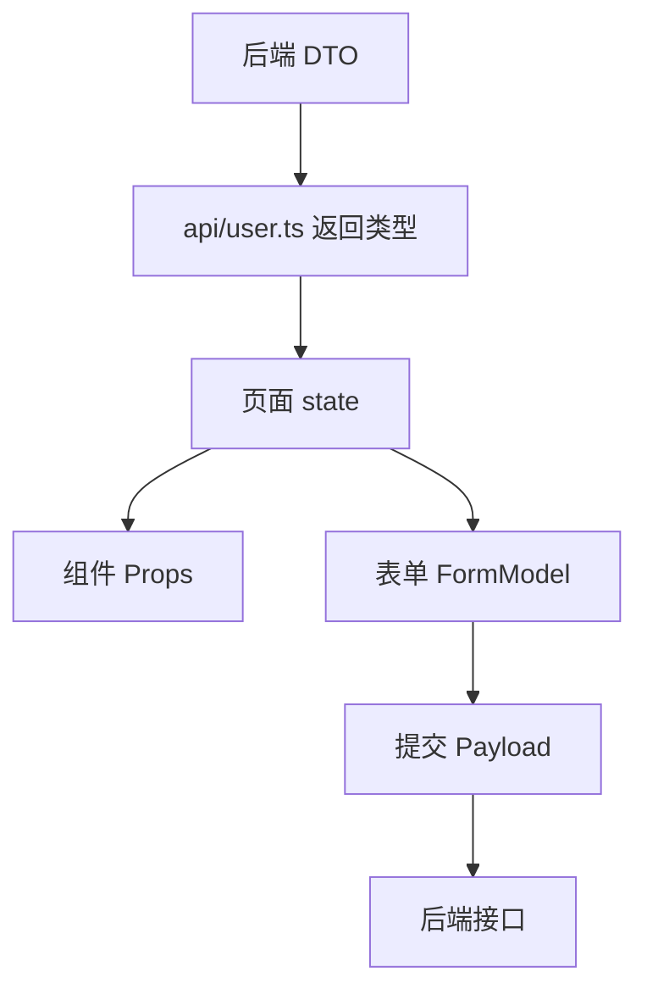

# TypeScript 项目落地实践

## 这个页面解决什么

TypeScript 在项目里的价值不是“把所有变量都写上类型”，而是让接口、表单、组件、状态和权限码之间有清晰边界。

## 适合谁看

适合已经掌握基础类型、interface、泛型和类型收窄，但不知道如何在真实 Vue 项目里设计类型的人。

## 一张图理解项目类型流



这条链路里最重要的是分清 DTO、ViewModel、FormModel、Payload。

## 四种常见模型

```ts
export interface UserDTO {
  id: number
  user_name: string
  role_codes: string[]
  status: 0 | 1
}

export interface UserView {
  id: number
  name: string
  roles: string[]
  enabled: boolean
}

export interface UserForm {
  id?: number
  name: string
  roleIds: number[]
  enabled: boolean
}

export interface SaveUserPayload {
  id?: number
  name: string
  role_ids: number[]
  status: 0 | 1
}
```

为什么要拆：

- DTO 跟后端字段一致。
- ViewModel 跟页面展示一致。
- FormModel 跟表单交互一致。
- Payload 跟提交接口一致。

## 类型转换函数

```ts
export function toUserView(dto: UserDTO): UserView {
  return {
    id: dto.id,
    name: dto.user_name,
    roles: dto.role_codes,
    enabled: dto.status === 1
  }
}

export function toSaveUserPayload(form: UserForm): SaveUserPayload {
  return {
    id: form.id,
    name: form.name.trim(),
    role_ids: form.roleIds,
    status: form.enabled ? 1 : 0
  }
}
```

转换函数的好处：

- 字段映射集中。
- 后端字段变化时容易定位。
- 页面模板不需要知道后端字段命名。

## API 返回类型

```ts
export interface PageResult<T> {
  items: T[]
  total: number
  page: number
  pageSize: number
}

export interface ApiResult<T> {
  code: string
  data: T
  message: string
}
```

请求函数：

```ts
export function getUsers(query: UserListQuery) {
  return request.get<PageResult<UserDTO>>('/users', { params: query })
}
```

页面使用：

```ts
const result = await getUsers(query)
rows.value = result.items.map(toUserView)
```

## 组件 Props 类型

```ts
interface UserStatusBadgeProps {
  enabled: boolean
}

const props = defineProps<UserStatusBadgeProps>()
```

如果组件需要双向交互，用 emit：

```ts
const emit = defineEmits<{
  change: [value: boolean]
}>()
```

## 权限码类型

权限码不要到处写字符串：

```ts
export const permissionCodes = {
  userCreate: 'user:create',
  userUpdate: 'user:update',
  userDelete: 'user:delete'
} as const

export type PermissionCode = typeof permissionCodes[keyof typeof permissionCodes]
```

判断函数：

```ts
function hasPermission(code: PermissionCode) {
  return userPermissions.value.includes(code)
}
```

这样写错权限码时，编辑器会提前提示。

## 实际项目问题

### 1. 接口字段变了，页面没报错

如果请求返回是 `any`，字段变化不会被发现。解决：

- 给 API 返回值加类型。
- 禁止 request 默认返回 `any`。
- 转换函数集中处理 DTO。

### 2. 表单类型和提交类型混在一起

表单里可能是 boolean、Date、数组对象；提交时可能需要数字、字符串、id 数组。不要强行用一个类型。

### 3. 类型太复杂看不懂

业务项目优先清晰，不要为了少写几个字段制造复杂条件类型。类型应该帮助阅读，而不是让维护者害怕。

## 下一步学习

继续学习 [Vue 项目集成](/typescript/vue-integration)，再进入 [工具类型与类型边界](/typescript/utility-types-boundary)。
