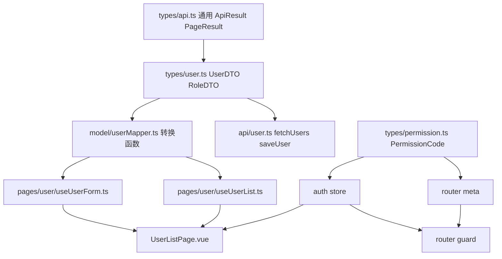

# TypeScript 类型边界从零到项目

## 适合谁看

适合已经学过基础类型、interface、泛型、类型收窄和 Vue 集成，但一进入真实项目就不知道“类型应该放哪里、怎么拆、怎么跟接口和表单对应”的人。

这篇会用一个用户权限管理页面做完整示例，把 TypeScript 的类型设计变成项目流程。你会看到接口 DTO、页面 ViewModel、表单 FormModel、提交 Payload、权限码、路由 meta、Pinia Store、API 请求和类型检查如何互相配合。

## 项目目标

我们要做一个“用户权限管理”页面的类型边界设计。功能不追求界面复杂，而是把类型链路设计清楚：

- 用户列表分页查询。
- 用户详情编辑。
- 角色多选。
- 启用/禁用状态切换。
- 按钮权限控制。
- 路由 meta 权限控制。
- 提交前字段转换。
- API 响应类型约束。
- typecheck 接入本地构建。

学完后你要能回答：

| 问题 | 要能说清楚什么 |
| --- | --- |
| DTO 和 ViewModel 为什么要拆 | 后端字段和页面字段不一定一致 |
| FormModel 和 Payload 为什么要拆 | 表单交互状态和提交参数不一定一致 |
| 权限码如何约束 | 不让字符串散落在页面里 |
| Store 类型如何设计 | 全局状态和页面局部状态怎么分开 |
| 路由 meta 如何加类型 | 菜单、权限、标题不靠约定猜 |
| typecheck 如何兜底 | 构建前发现接口和组件类型问题 |

## 总体类型流

同一个“用户”在接口、页面和表单中并不是同一种数据。观察下面五个边界，重点看日期、空值和字段错误在哪一步被转换。

<DocFigure
  src="/images/typescript/type-boundary-error-state.webp"
  alt="UserDTO 经过运行时校验和 mapper 转成 UserViewModel，表单错误使用独立状态保存"
  caption="DTO、ViewModel、FormModel、Payload 和 FormError 各自表达不同阶段，不能用一个大接口贯穿项目。"
  :width="1440"
  :height="900"
/>

显式 mapper 看似多了一步，却让后端字段变化、日期转换和错误回显都有稳定落点，也让组件不再到处写兼容分支。

先看完整链路：


这条链路里的核心原则是：**每一层只暴露自己真正需要的字段形态**。

不要让页面模板直接使用后端字段，也不要把表单对象原样提交给后端。

## 一、定义后端 DTO

DTO 是后端接口返回什么，前端就怎么描述。不要为了页面舒服而改名：

```ts
export interface UserDTO {
  id: number
  user_name: string
  email: string
  role_codes: string[]
  department_id: number | null
  status: 0 | 1
  created_at: string
  updated_at: string
}

export interface RoleDTO {
  id: number
  role_code: string
  role_name: string
  enabled: 0 | 1
}
```

DTO 层的注意点：

| 做法 | 原因 |
| --- | --- |
| 字段名跟接口保持一致 | 方便定位后端字段变化 |
| 状态用接口真实值 | 避免提前转换导致语义不清 |
| 可空字段明确写 null | 不要把空值当成不存在 |
| 时间字段先保留 string | 格式化属于页面展示层 |

常见错误是把 DTO 写成页面想要的样子：

```ts
interface UserDTO {
  name: string
  enabled: boolean
}
```

这样会让后端字段变化、接口联调和页面展示混在一起，后续很难排查。

## 二、定义页面 ViewModel

ViewModel 是页面展示需要的数据形态：

```ts
export interface UserView {
  id: number
  name: string
  email: string
  roleNames: string[]
  departmentName: string
  enabled: boolean
  createdText: string
  updatedText: string
}
```

DTO 转 ViewModel：

```ts
export function toUserView(dto: UserDTO, roleMap: Map<string, string>): UserView {
  return {
    id: dto.id,
    name: dto.user_name,
    email: dto.email,
    roleNames: dto.role_codes.map((code) => roleMap.get(code) ?? code),
    departmentName: dto.department_id ? `部门 ${dto.department_id}` : '未分配',
    enabled: dto.status === 1,
    createdText: formatDateTime(dto.created_at),
    updatedText: formatDateTime(dto.updated_at)
  }
}
```

为什么要有 ViewModel：

| 不拆 ViewModel | 拆 ViewModel |
| --- | --- |
| 模板里到处写 `user.user_name` | 模板只关心 `user.name` |
| 状态判断散落 `status === 1` | 页面只使用 `enabled` |
| 时间格式化散在模板里 | 格式化集中在转换函数 |
| 后端字段变化影响全页面 | 只改转换函数 |

## 三、定义列表查询类型

查询条件不要随便用对象：

```ts
export interface UserListQuery {
  keyword?: string
  roleCode?: string
  status?: 0 | 1
  page: number
  pageSize: number
}

export interface PageResult<T> {
  items: T[]
  total: number
  page: number
  pageSize: number
}

export interface ApiResult<T> {
  code: string
  message: string
  data: T
}
```

请求函数要明确输入和输出：

```ts
export async function fetchUsers(
  query: UserListQuery
): Promise<PageResult<UserDTO>> {
  const result = await request.get<ApiResult<PageResult<UserDTO>>>('/users', {
    params: query
  })

  return result.data
}
```

如果你的 request 已经统一拆了 `ApiResult.data`，那请求函数可以返回 `Promise<PageResult<UserDTO>>`。关键是团队要统一，不要有的页面拿 `result.data.items`，有的页面拿 `result.items`。

## 四、定义 FormModel

表单模型服务于用户编辑，不等于 DTO，也不等于 Payload：

```ts
export interface UserFormModel {
  id?: number
  name: string
  email: string
  roleCodes: string[]
  departmentId: number | null
  enabled: boolean
}
```

从详情复制成表单：

```ts
export function createUserForm(dto?: UserDTO): UserFormModel {
  if (!dto) {
    return {
      name: '',
      email: '',
      roleCodes: [],
      departmentId: null,
      enabled: true
    }
  }

  return {
    id: dto.id,
    name: dto.user_name,
    email: dto.email,
    roleCodes: [...dto.role_codes],
    departmentId: dto.department_id,
    enabled: dto.status === 1
  }
}
```

这里一定要复制数组：

```ts
roleCodes: [...dto.role_codes]
```

否则编辑弹窗里的多选可能直接改到详情对象或列表缓存，用户还没点保存，页面数据已经变了。

## 五、定义提交 Payload

Payload 是后端保存接口需要的数据：

```ts
export interface SaveUserPayload {
  id?: number
  user_name: string
  email: string
  role_codes: string[]
  department_id: number | null
  status: 0 | 1
}
```

FormModel 转 Payload：

```ts
export function toSaveUserPayload(form: UserFormModel): SaveUserPayload {
  return {
    id: form.id,
    user_name: form.name.trim(),
    email: form.email.trim(),
    role_codes: [...form.roleCodes],
    department_id: form.departmentId,
    status: form.enabled ? 1 : 0
  }
}
```

这一步可以集中处理：

- trim。
- boolean 转数字状态。
- 数组复制。
- 可空字段。
- 默认值。

不要在提交按钮里直接拼 payload。提交按钮只应该表达“保存这个表单”，字段转换放在专门函数里。

## 六、权限码类型

权限码必须集中定义：

```ts
export const permissionCodes = {
  userView: 'user:view',
  userCreate: 'user:create',
  userUpdate: 'user:update',
  userDelete: 'user:delete',
  userDisable: 'user:disable'
} as const

export type PermissionCode =
  (typeof permissionCodes)[keyof typeof permissionCodes]
```

权限判断函数：

```ts
export function hasPermission(
  ownedCodes: readonly string[],
  requiredCode: PermissionCode
) {
  return ownedCodes.includes(requiredCode)
}
```

页面里这样用：

```ts
const canCreate = computed(() => {
  return hasPermission(authStore.permissionCodes, permissionCodes.userCreate)
})
```

这样写的价值是：

| 风险 | 类型约束后的效果 |
| --- | --- |
| `user:cretae` 拼错 | 编辑器直接报错 |
| 页面散落权限字符串 | 全部从 permissionCodes 引用 |
| 权限删除后页面不知道 | 删除常量后引用处报错 |

## 七、路由 meta 类型

Vue Router 默认的 meta 很宽松，需要补类型：

```ts
import 'vue-router'
import type { PermissionCode } from '@/types/permission'

declare module 'vue-router' {
  interface RouteMeta {
    title: string
    requiresAuth?: boolean
    requiredPermission?: PermissionCode
    keepAlive?: boolean
  }
}
```

路由配置：

```ts
export const routes = [
  {
    path: '/users',
    component: () => import('@/pages/user/UserListPage.vue'),
    meta: {
      title: '用户管理',
      requiresAuth: true,
      requiredPermission: permissionCodes.userView
    }
  }
]
```

路由守卫：

```ts
router.beforeEach((to) => {
  const authStore = useAuthStore()

  if (to.meta.requiresAuth && !authStore.isLogin) {
    return '/login'
  }

  if (
    to.meta.requiredPermission &&
    !hasPermission(authStore.permissionCodes, to.meta.requiredPermission)
  ) {
    return '/403'
  }
})
```

这样页面标题、登录要求、权限要求都有类型保护。

## 八、Pinia Store 类型边界

全局 Store 保存跨页面共享的状态，不要把页面表单塞进去：

```ts
export interface AuthUser {
  id: number
  name: string
  avatarUrl: string
}

export interface AuthState {
  token: string
  user: AuthUser | null
  permissionCodes: PermissionCode[]
}
```

Pinia 示例：

```ts
export const useAuthStore = defineStore('auth', {
  state: (): AuthState => ({
    token: '',
    user: null,
    permissionCodes: []
  }),
  getters: {
    isLogin: (state) => Boolean(state.token)
  },
  actions: {
    setUserContext(user: AuthUser, permissions: PermissionCode[]) {
      this.user = user
      this.permissionCodes = permissions
    }
  }
})
```

Store 边界建议：

| 可以放 Store | 不建议放 Store |
| --- | --- |
| 登录用户 | 某个弹窗是否打开 |
| token | 某个页面的搜索关键字 |
| 权限码 | 某个表单的临时输入 |
| 全局偏好 | 列表勾选项 |

页面局部状态越多塞进 Store，后续越难追踪是谁改了它。

## 九、页面组合式函数

用户列表页可以拆一个 composable：

```ts
export function useUserList() {
  const roleMap = ref(new Map<string, string>())
  const query = reactive<UserListQuery>({
    page: 1,
    pageSize: 20
  })
  const rows = ref<UserView[]>([])
  const total = ref(0)
  const loading = ref(false)

  async function loadUsers() {
    loading.value = true

    try {
      const page = await fetchUsers(query)
      rows.value = page.items.map((item) => toUserView(item, roleMap.value))
      total.value = page.total
    } finally {
      loading.value = false
    }
  }

  return {
    query,
    rows,
    total,
    loading,
    loadUsers
  }
}
```

这个 composable 的边界是：

- 负责页面查询。
- 负责调用 API。
- 负责 DTO 到 ViewModel。
- 不负责渲染按钮。
- 不负责全局登录态。

## 十、类型检查流程

项目里必须有独立 typecheck：

```json
{
  "scripts": {
    "typecheck": "vue-tsc --noEmit",
    "build": "vue-tsc --noEmit && vite build"
  }
}
```

本地开发时：

```text
写类型
↓
编辑器实时提示
↓
npm run typecheck
↓
npm run build
↓
提交代码
```

CI 里至少要跑：

```text
install
↓
typecheck
↓
lint
↓
test
↓
build
```

不要只靠 Vite dev server。很多类型错误在开发服务器里不会阻止页面运行，但会在构建或 CI 才暴露。

## 项目类型关系总图



建议的目录结构：

```text
src/
├─ api/
│  └─ user.ts
├─ model/
│  └─ userMapper.ts
├─ pages/
│  └─ user/
│     ├─ UserListPage.vue
│     ├─ useUserList.ts
│     └─ useUserForm.ts
├─ stores/
│  └─ auth.ts
├─ types/
│  ├─ api.ts
│  ├─ permission.ts
│  ├─ router.d.ts
│  └─ user.ts
└─ utils/
   └─ format.ts
```

## 常见问题和解决方案

| 问题 | 现象 | 根因 | 解决方案 |
| --- | --- | --- | --- |
| 接口字段变了页面没报错 | 上线后列表空白 | request 返回 any | 给 request 和 API 函数加泛型返回 |
| 表单提交字段错 | 后端 400 或保存失败 | FormModel 直接当 Payload 用 | 单独写 toSaveUserPayload |
| 权限按钮不显示 | 明明有权限但判断失败 | 权限字符串拼错或大小写不一致 | 权限码集中定义为 const |
| 路由权限没有提示 | meta 字段写错仍能编译 | 没有扩展 RouteMeta | 用 declare module 补 meta 类型 |
| Store 越来越乱 | 页面状态互相影响 | 把局部状态放进全局 Store | Store 只放跨页面共享状态 |
| 类型太复杂没人敢改 | 类型报错难读 | 过度使用条件类型和类型体操 | 业务类型优先清晰直写 |
| 第三方库没类型 | import 报错 | 缺少声明文件 | 补 `declare module` 或安装 @types |

## 验收清单

完成这个项目类型设计后，逐项检查：

- API 函数没有返回 `any`。
- DTO、ViewModel、FormModel、Payload 是四个独立概念。
- 所有字段转换都在 mapper 函数里。
- 表单提交前会 trim 和转换状态。
- 权限码没有散落字符串。
- 路由 meta 有类型声明。
- Pinia Store 有明确 State 类型。
- 页面局部表单状态没有塞进全局 Store。
- `npm run typecheck` 能独立运行。
- 构建脚本包含 typecheck。
- 常见接口字段变化能通过类型错误定位。

## 进阶挑战

| 挑战 | 训练能力 |
| --- | --- |
| 增加部门树 | 递归类型、树结构转换 |
| 增加批量授权 | 批量 Payload、选中状态类型 |
| 增加角色模板 | 联合类型、枚举映射 |
| 增加审计日志 | 只读 ViewModel、时间格式化 |
| 增加导入导出 | 文件类型、解析结果、错误行类型 |
| 增加单元测试 | mapper 和权限判断纯函数测试 |
| 接入真实 Vue 页面 | ref、computed、props、emits、Pinia 联动 |

## 下一步学习

继续学习：

- [Vue 项目集成](/typescript/vue-integration)
- [工具类型与类型边界](/typescript/utility-types-boundary)
- [TypeScript 项目落地实践](/typescript/project-practice)
- [TypeScript 类型边界问题库](/projects/issues-typescript)
- [Vue 从零到项目落地](/vue/project-from-zero)
- [Node 权限 API 从零到项目](/node/permission-api-project)
