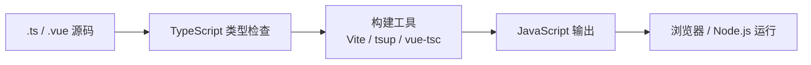
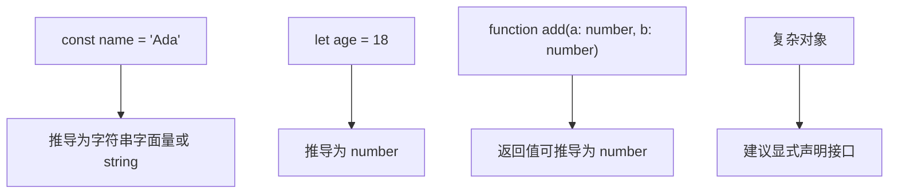
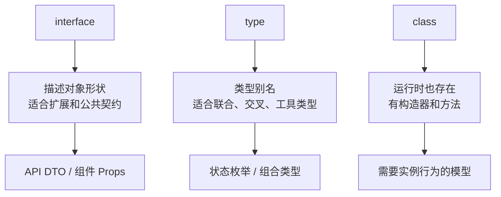
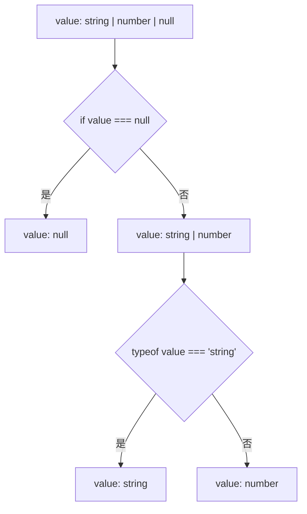
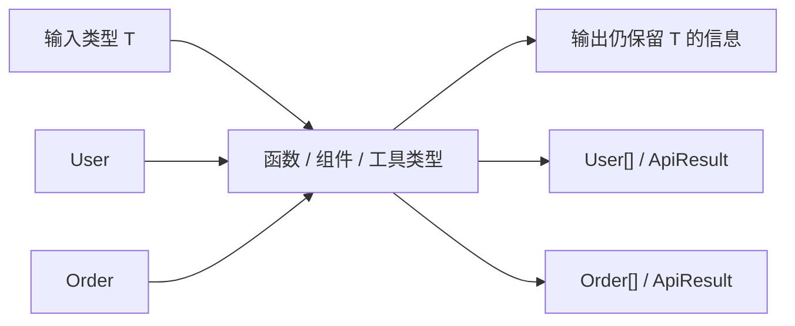
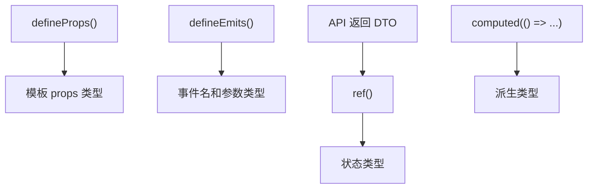
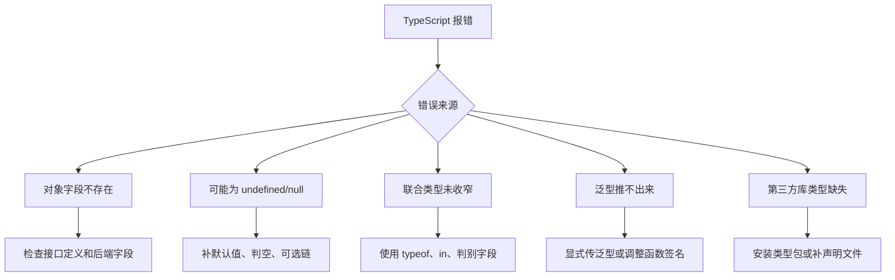

# 图解 TypeScript 核心概念

## 这个页面解决什么

TypeScript 的难点不是“多写类型”，而是理解类型如何在编辑器、编译阶段和项目边界上帮助你发现问题。

## 适合谁看

适合已经会 JavaScript，准备在 Vue、React、Node 或后端工具项目中系统使用 TypeScript 的学习者。

## 一张图理解 TypeScript 在项目中的位置



TypeScript 类型只在开发和构建阶段生效。运行时执行的仍然是 JavaScript。

所以：

- 类型能提前发现很多错误。
- 类型不能替代运行时校验。
- 接口返回数据、用户输入、localStorage 内容仍要校验。

## 一张图理解类型推导



类型不是写得越多越好。简单变量交给推导，跨模块边界和复杂对象显式声明。

## 一张图理解 interface、type、class



项目里最常见：

- API 数据结构用 `interface`。
- 联合状态用 `type`。
- 前端业务很少必须用 `class`。

## 一张图理解联合类型和类型收窄



类型收窄的目标是让代码每个分支里的类型更准确，减少强制断言。

## 一张图理解泛型



泛型不是为了变复杂，而是为了保留输入和输出之间的类型关系。

典型场景：

```ts
interface ApiResult<T> {
  code: string
  data: T
  message: string
}
```

## 一张图理解 Vue 与 TypeScript



Vue 项目里类型链路最好从 API DTO 开始：

```text
后端响应 DTO
↓
请求函数返回值
↓
页面 state
↓
组件 props
↓
模板展示
```

任何一层用了 `any`，后面的类型保护都会变弱。

## 一张图理解类型问题排查



## 下一步学习

继续学习 [基础类型](/typescript/basic-types)，或进入 [类型收窄与类型守卫](/typescript/narrowing-guards)。
