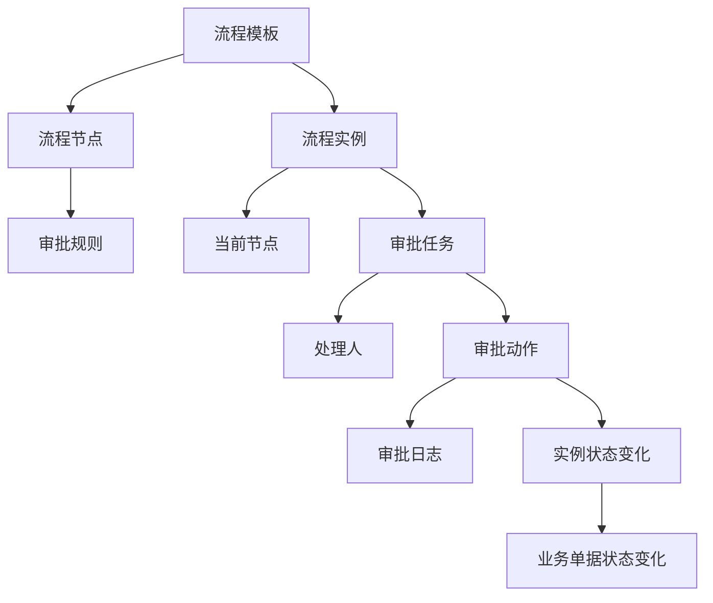
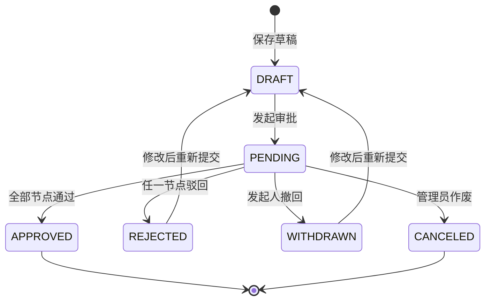
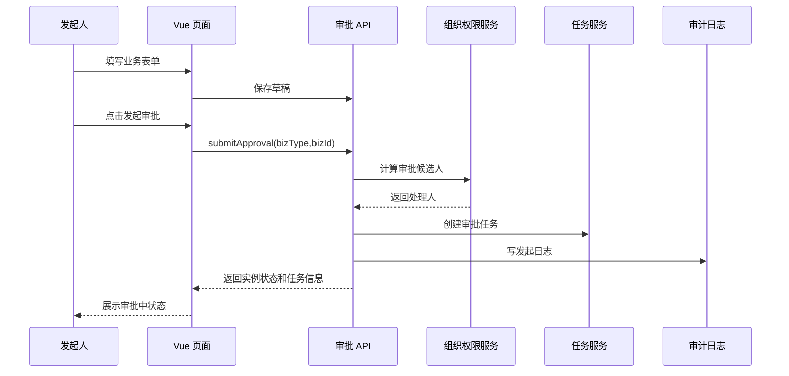
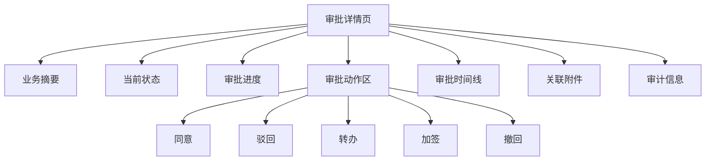
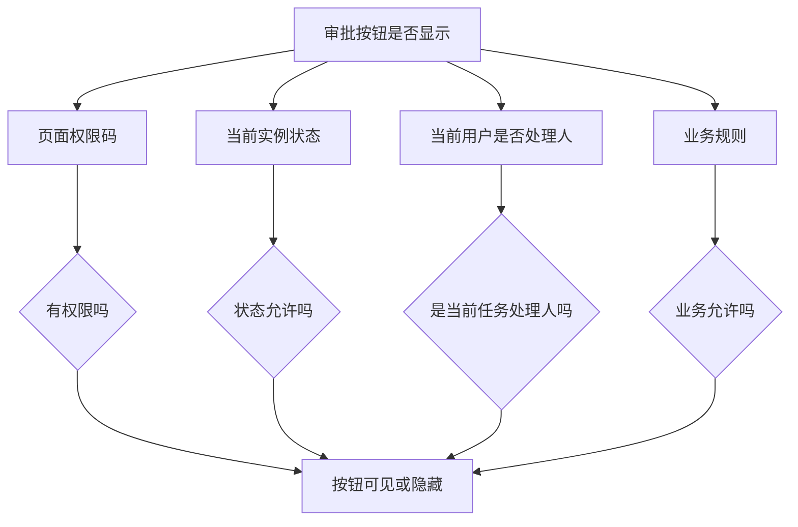
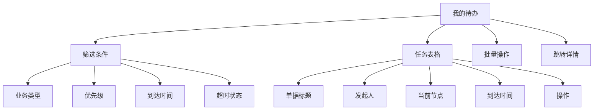
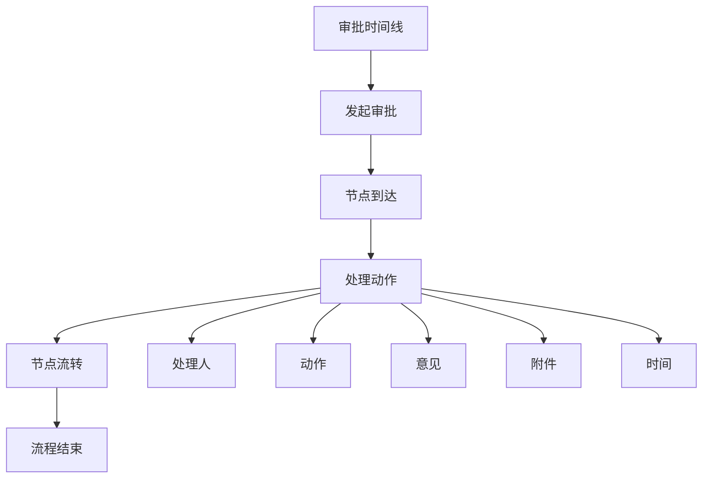
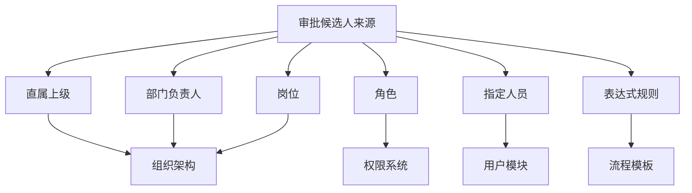
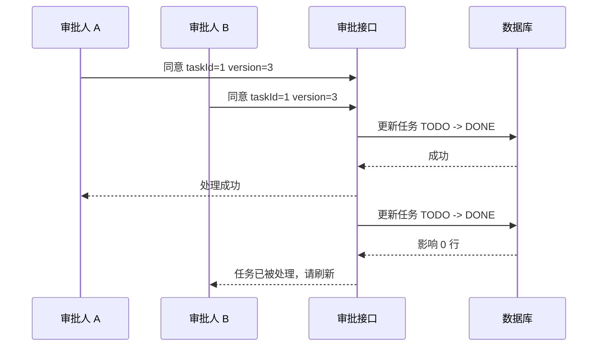
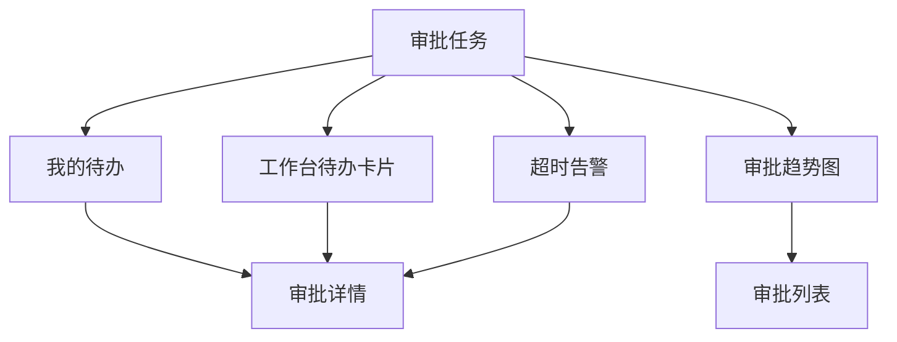

# Vue Admin 审批流、状态机、待办与审计闭环实战

审批流是 Vue Admin 里非常典型的复杂业务模块。它不像普通 CRUD 那样只做新增、编辑、删除，而是会把这些能力全部串起来：

- 表单提交后进入审批。
- 审批人来自组织架构、角色、岗位、直属上级或流程规则。
- 当前处理人有同意、驳回、转办、加签、撤回等动作。
- 每一次动作都要写操作记录和审批意见。
- 审批状态会影响详情页按钮、列表筛选、工作台待办和数据看板。
- 并发审批、重复点击、权限变化、节点配置错误都会让流程卡住。

这一页从 Vue Admin 前端视角，把审批流拆成流程模型、状态机、页面结构、接口契约、权限校验、审计日志和问题排查。它不是替代 [审批流项目案例](/projects/approval-workflow-case)，而是讲清楚前端如何把审批模块接进后台项目主线。

## 适合谁看

- 已经完成 [Vue Admin 详情页、状态流转与操作记录闭环实战](/vue/admin-detail-status-audit)，准备做真实状态流转的人。
- 已经完成 [Vue Admin 组织架构与数据权限实现手册](/vue/admin-organization-data-permission)，想把员工、部门、岗位和审批候选人串起来的人。
- 正在做请假、报销、采购、合同、发布审批、权限申请、价格审批、渠道策略审批的人。
- 经常遇到“审批按钮该不该显示”“驳回后回到哪里”“两个人同时审批怎么办”“工作台待办为什么不刷新”的人。

## 最终要做到什么

完成本页后，你应该能做出一个可交付的审批闭环：

| 能力 | 最终效果 | 不合格表现 |
| --- | --- | --- |
| 流程模型 | 能区分模板、实例、节点、任务、动作和日志 | 所有字段混在一张表或一个对象里 |
| 状态机 | 发起、审批中、通过、驳回、撤回、作废都有合法流转 | 页面按钮里到处写 `if status` |
| 待办列表 | 只展示当前用户可处理任务，支持筛选和跳详情 | 所有人都能看到所有待办 |
| 审批动作 | 同意、驳回、转办、加签、撤回都有权限和状态校验 | 前端改状态后再请求保存 |
| 审批时间线 | 能看到处理人、动作、意见、前后状态和时间 | 只显示当前状态，看不到过程 |
| 并发幂等 | 重复点击、多人同时审批不会重复处理 | 两个人同意后流程走两次 |
| 组织联动 | 审批人能按部门、岗位、直属上级和角色计算 | 审批人写死在前端 |
| 工作台联动 | 待办数量、待审批列表、异常流程能进工作台 | 工作台数字和待办列表不一致 |

先观察一个待审批任务的完整信息：业务摘要说明“审批什么”，流程位置说明“走到哪里”，操作区只提供当前用户在当前节点允许执行的动作。

<DocFigure
  src="/images/vue/admin-approval-pending.webp"
  alt="Vue Admin 采购审批详情，展示业务摘要、审批节点、处理意见和同意驳回操作"
  caption="审批按钮不是普通详情页按钮，它由任务归属、节点状态、权限和流程版本共同决定。"
  :width="1440"
  :height="900"
/>

## 先建立心智模型

审批流不是“状态字段 + 按钮”，而是一个由模板驱动的流程实例。



先记住 6 个核心对象：

| 对象 | 说明 | 前端页面 |
| --- | --- | --- |
| 流程模板 | 请假审批、合同审批、发布审批这类规则 | 模板选择、模板配置 |
| 流程节点 | 主管审批、财务审批、法务审批、结束节点 | 进度条、流程图 |
| 流程实例 | 某一张报销单实际发起的一次审批 | 审批详情 |
| 审批任务 | 分配给某个处理人的待办 | 我的待办、待审批列表 |
| 审批动作 | 同意、驳回、撤回、转办、加签 | 操作按钮、弹窗 |
| 审批日志 | 每次动作的证据 | 时间线、审计记录 |

## 推荐目录结构

审批模块不要直接写在业务页面里。建议沉淀成一个可复用 `approval` 领域模块：

```txt
src/
  features/
    approval/
      api/
        approval.api.ts
      components/
        ApprovalActionBar.vue
        ApprovalActionDialog.vue
        ApprovalTimeline.vue
        ApprovalProgress.vue
        ApprovalTodoTable.vue
        ApprovalCandidateSelect.vue
      composables/
        useApprovalActions.ts
        useApprovalDetail.ts
        useApprovalTodoList.ts
        useApprovalCandidates.ts
      types/
        approval.types.ts
      views/
        ApprovalTodoPage.vue
        ApprovalDonePage.vue
        ApprovalDetailPage.vue
    contracts/
      views/
        ContractDetailPage.vue
      components/
        ContractApprovalPanel.vue
```

结构原则：

- `approval` 模块负责审批通用能力。
- 业务模块只负责业务单据本身，比如合同、报销、采购。
- 审批按钮、时间线、待办列表可以复用。
- 业务详情页通过 `bizType` 和 `bizId` 接入审批。

## 类型模型

先定义稳定类型，再写页面。

```ts
export type ApprovalBizType =
  | 'LEAVE'
  | 'EXPENSE'
  | 'CONTRACT'
  | 'RELEASE'
  | 'PERMISSION_APPLY'

export type ApprovalInstanceStatus =
  | 'DRAFT'
  | 'PENDING'
  | 'APPROVED'
  | 'REJECTED'
  | 'WITHDRAWN'
  | 'CANCELED'

export type ApprovalTaskStatus =
  | 'TODO'
  | 'DONE'
  | 'CANCELED'
  | 'EXPIRED'

export type ApprovalAction =
  | 'SUBMIT'
  | 'APPROVE'
  | 'REJECT'
  | 'TRANSFER'
  | 'ADD_SIGN'
  | 'WITHDRAW'
  | 'CANCEL'
```

实例、任务、日志要分开：

```ts
export interface ApprovalInstanceDTO {
  id: string
  bizType: ApprovalBizType
  bizId: string
  templateId: string
  status: ApprovalInstanceStatus
  currentNodeId?: string
  currentNodeName?: string
  initiatorId: string
  initiatorName: string
  createdAt: string
  updatedAt: string
  version: number
}

export interface ApprovalTaskDTO {
  id: string
  instanceId: string
  nodeId: string
  nodeName: string
  assigneeId: string
  assigneeName: string
  status: ApprovalTaskStatus
  arrivedAt: string
  finishedAt?: string
  dueAt?: string
}

export interface ApprovalLogDTO {
  id: string
  instanceId: string
  taskId?: string
  operatorId: string
  operatorName: string
  action: ApprovalAction
  fromStatus?: ApprovalInstanceStatus
  toStatus?: ApprovalInstanceStatus
  comment?: string
  attachments?: Array<{ fileId: string; fileName: string }>
  createdAt: string
  traceId?: string
}
```

为什么不能只用一个 `ApprovalDTO`？

- 实例表示这条流程本身。
- 任务表示谁要处理。
- 日志表示发生过什么。
- 页面上它们可能同时出现，但后端生命周期完全不同。

## 审批状态机

审批流最怕状态不受控。先画状态机：



状态机要回答这些问题：

| 问题 | 必须明确 |
| --- | --- |
| 草稿能否删除 | 通常可以 |
| 审批中能否编辑 | 通常不允许，只能撤回 |
| 驳回后回到哪里 | 回到草稿、上一节点或结束，需要模板规则 |
| 通过后能否撤回 | 通常不能，除非业务支持反审 |
| 作废谁能操作 | 通常管理员或流程管理员 |
| 重新提交是否新实例 | 看业务要求，建议保留历史实例 |

前端状态机只负责展示和交互，后端状态机才是最终可信来源。

## 审批链路总图



发起审批后页面要做三件事：

1. 刷新业务详情。
2. 刷新审批时间线。
3. 更新按钮权限，比如隐藏“编辑”，显示“撤回”。

## 页面结构

一个审批详情页通常包含：



不要把审批能力藏在业务详情页的角落。用户进入详情时要马上知道：

- 当前审批状态。
- 当前等谁处理。
- 我能不能处理。
- 下一步会流向哪里。
- 历史处理意见是什么。

## 按钮权限怎么判断

按钮显示要同时看 4 类条件：



示例规则：

| 按钮 | 权限码 | 状态 | 人员条件 | 备注 |
| --- | --- | --- | --- | --- |
| 发起审批 | `approval:submit` | `DRAFT`、`REJECTED` | 单据创建人或有提交权限 | 发起前校验表单完整性 |
| 同意 | `approval:approve` | `PENDING` | 当前任务处理人 | 需要任务 ID |
| 驳回 | `approval:reject` | `PENDING` | 当前任务处理人 | 通常必填意见 |
| 转办 | `approval:transfer` | `PENDING` | 当前任务处理人 | 新处理人要有资格 |
| 加签 | `approval:add-sign` | `PENDING` | 当前任务处理人 | 取决于模板规则 |
| 撤回 | `approval:withdraw` | `PENDING` | 发起人 | 已被处理后可能不允许 |
| 作废 | `approval:cancel` | `PENDING` | 管理员 | 高风险操作 |

前端判断只负责体验。后端接口仍然必须重新判断权限、状态和处理人。

## 审批动作弹窗

同意、驳回、转办、加签不要共用一个混乱弹窗。可以共用组件，但表单字段要按动作配置。

```ts
export interface ApprovalActionForm {
  action: ApprovalAction
  taskId: string
  comment: string
  targetAssigneeId?: string
  addSignType?: 'BEFORE' | 'AFTER'
  attachmentFileIds: string[]
  instanceVersion: number
}
```

动作字段规则：

| 动作 | 必填字段 | 说明 |
| --- | --- | --- |
| 同意 | `taskId`、`instanceVersion` | 评论可选，部分业务必填 |
| 驳回 | `taskId`、`comment`、`instanceVersion` | 必须说明原因 |
| 转办 | `taskId`、`targetAssigneeId`、`comment` | 目标处理人要校验 |
| 加签 | `taskId`、`targetAssigneeId`、`addSignType` | 会影响当前节点任务 |
| 撤回 | `comment`、`instanceVersion` | 发起人撤回原因 |

## 审批动作请求

动作接口建议统一入口：

```ts
export interface ApprovalActionPayload {
  action: ApprovalAction
  taskId?: string
  instanceId: string
  comment?: string
  targetAssigneeId?: string
  addSignType?: 'BEFORE' | 'AFTER'
  attachmentFileIds?: string[]
  instanceVersion: number
}

export async function submitApprovalAction(payload: ApprovalActionPayload) {
  return http.post<ApprovalInstanceDTO>('/approval/actions', payload)
}
```

为什么带 `instanceVersion`？

- 避免用户打开旧页面后处理已经变化的流程。
- 后端可以用乐观锁拒绝过期操作。
- 前端收到版本冲突后刷新详情和待办。

版本冲突时不要简单提示“失败”。应该提示：

```txt
审批状态已经变化，页面将刷新最新状态。
```

然后重新加载实例、任务和时间线。

## 待办列表

待办列表是审批模块的入口之一，也是工作台的来源。



待办列表字段建议：

| 字段 | 说明 |
| --- | --- |
| 任务标题 | 用户能知道要处理什么 |
| 业务类型 | 请假、报销、合同、发布 |
| 发起人 | 谁发起 |
| 当前节点 | 主管审批、财务审批 |
| 到达时间 | 任务到达当前人的时间 |
| 截止时间 | 用于超时提醒 |
| 操作 | 查看、同意、驳回 |

待办查询必须由后端按当前用户裁剪：

```ts
export interface ApprovalTodoQuery {
  keyword?: string
  bizType?: ApprovalBizType
  arrivedStart?: string
  arrivedEnd?: string
  overdueOnly?: boolean
  page: number
  pageSize: number
}
```

不要把所有任务拉到前端再过滤当前用户。

## 审批时间线

审批时间线是最重要的审计视图之一。



时间线不要只显示中文文案。至少保留这些结构化字段：

| 字段 | 价值 |
| --- | --- |
| `operatorId` | 追踪处理人 |
| `action` | 判断同意、驳回、转办 |
| `fromStatus` / `toStatus` | 解释状态变化 |
| `comment` | 展示意见 |
| `traceId` | 排查接口 |
| `createdAt` | 排序和审计 |

前端显示可以转成 ViewModel：

```ts
export interface ApprovalTimelineItem {
  id: string
  title: string
  description: string
  operatorText: string
  timeText: string
  statusType: 'default' | 'success' | 'warning' | 'danger'
  attachments: Array<{ fileId: string; fileName: string }>
}
```

## 审批候选人

审批人不要写死。候选人通常来自：



前端处理审批候选人时要注意：

- 转办候选人必须从后端查询。
- 当前用户不能随便转给无权限的人。
- 组织变更后候选人可能变化。
- 候选人为空时要显示明确错误和兜底策略。

```ts
export interface ApprovalCandidateQuery {
  instanceId: string
  taskId: string
  action: 'TRANSFER' | 'ADD_SIGN'
  keyword?: string
}
```

## 驳回、撤回、转办、加签

这些不是边缘功能，而是审批流是否能上线的关键。

### 驳回

驳回规则要在模板中定义：

| 驳回方式 | 说明 | 适合场景 |
| --- | --- | --- |
| 驳回到发起人 | 流程回到草稿或待修改 | 表单信息错误 |
| 驳回到上一节点 | 回到上一个审批人 | 多级审批中局部退回 |
| 直接结束 | 流程状态变成驳回 | 高风险审批 |

前端展示时要告诉用户“驳回后会去哪里”。

### 撤回

撤回通常只允许发起人操作，并且要看当前节点是否已经被处理。

常见规则：

- 审批中可以撤回。
- 已通过不能撤回。
- 当前任务已经有人处理中，后端决定是否允许撤回。
- 撤回后业务单据回到草稿或待提交。

### 转办

转办会改变任务处理人，不改变流程节点。

必须记录：

- 原处理人。
- 新处理人。
- 转办原因。
- 转办时间。

### 加签

加签会增加处理人。要明确：

- 前加签：新处理人先处理，原处理人后处理。
- 后加签：原处理人先处理，新处理人后处理。
- 会签：多人都要处理。
- 或签：任意一人处理即可。

## 并发和幂等

审批动作必须防并发：



前端要做：

- 按钮提交中禁用。
- 弹窗提交中不能关闭或重复提交。
- 收到 409 冲突后刷新详情。
- 不要在接口成功前本地改成通过。

后端要做：

- 状态条件更新。
- 乐观锁或版本号。
- 幂等 key。
- 审批日志唯一约束或事务保护。

## 工作台联动

审批流和工作台天然关联：



工作台上的待审批数量必须来自同一套待办接口或同一口径统计。不要工作台一个接口、待办列表另一个口径。

## 路由与菜单

审批模块常见路由：

| 路由 | 页面 | 权限 |
| --- | --- | --- |
| `/approval/todo` | 我的待办 | `approval:todo:list` |
| `/approval/done` | 已办任务 | `approval:done:list` |
| `/approval/instances` | 流程实例 | `approval:instance:list` |
| `/approval/instances/:id` | 审批详情 | `approval:instance:view` |
| `/approval/templates` | 流程模板 | `approval:template:list` |

详情页通常是隐藏路由，但要有稳定 `name`，方便从待办、工作台、消息通知跳转。

## 常见问题与解决方案

### 1. 审批按钮显示错了

按顺序查：

1. 当前用户权限码。
2. 当前实例状态。
3. 当前任务处理人。
4. 流程模板是否允许该动作。
5. 后端返回的可用动作列表。

最佳做法是后端返回 `availableActions`，前端再结合按钮权限显示。

### 2. 驳回后不知道回到哪里

这是流程模板缺规则，不是前端问题。模板要定义驳回目标：

- 发起人。
- 上一节点。
- 指定节点。
- 结束流程。

前端只负责展示规则和提交动作。

### 3. 审批记录缺失

审批动作、任务状态、实例状态、业务状态和日志必须在一个事务里完成。前端排查时要拿：

- instanceId。
- taskId。
- action。
- traceId。
- 操作时间。

### 4. 两个人同时审批导致重复通过

前端禁用按钮不能解决并发。后端必须状态条件更新。前端收到冲突后刷新页面。

### 5. 工作台待办数量和待办列表不一致

检查：

- 是否同一个用户。
- 是否同一个租户或组织范围。
- 待办统计是否排除已超时或已取消任务。
- 待办列表是否有默认筛选。
- 工作台是否用了旧缓存。

### 6. 转办后新处理人看不到任务

排查：

- 转办接口是否创建或更新了任务处理人。
- 新处理人是否有菜单和页面权限。
- 待办接口是否按 assigneeId 查询。
- 权限缓存是否需要刷新。

### 7. 审批详情刷新后 404

常见原因：

- 动态路由没有注册详情隐藏路由。
- 路由 name 不稳定。
- 服务端没有 history fallback。
- 权限恢复还没完成就进入详情。

先看 [Vue Admin 权限路由闭环实战](/vue/admin-permission-route-flow) 和 [Vue Admin 菜单与动态路由实现手册](/vue/admin-menu-route-module)。

## 实战练习：做一个请假审批

### 练习 1：流程模型

定义请假审批：

- 3 天以内：直属上级审批。
- 3 天以上：直属上级审批后，部门负责人审批。
- 驳回后回到发起人修改。
- 审批中允许发起人撤回。

产出：

- 流程图。
- 状态机。
- 模板字段表。
- 接口清单。

### 练习 2：我的待办

要求：

1. 支持按业务类型、到达时间、是否超时筛选。
2. 只展示当前用户待办。
3. 点击进入审批详情。
4. 同意、驳回操作后刷新当前页。
5. 390px 宽度不横向溢出。

### 练习 3：审批详情

要求：

1. 展示业务表单摘要。
2. 展示当前节点和当前处理人。
3. 展示审批时间线。
4. 当前处理人能同意和驳回。
5. 发起人能撤回。
6. 非处理人不能看到处理按钮。

### 练习 4：并发审批

模拟两个窗口同时打开同一个审批任务：

1. 窗口 A 点击同意。
2. 窗口 B 再点击同意。
3. 窗口 B 应提示任务已处理并刷新详情。

## 上线检查清单

1. 流程模板、实例、任务、日志职责清楚。
2. 状态机有图，非法动作不会出现在页面上。
3. 后端返回可用动作或明确权限字段。
4. 同意、驳回、转办、加签、撤回都有权限校验。
5. 驳回规则明确。
6. 审批意见、附件、处理人、时间完整记录。
7. 并发审批不会重复处理。
8. 待办列表只展示当前用户任务。
9. 工作台待办数量和待办列表口径一致。
10. 切换账号后不保留上一个账号的待办。
11. 审批详情隐藏路由刷新不 404。
12. 移动端详情和时间线可读。

## 和其他文档怎么配合

| 你要做什么 | 继续看 |
| --- | --- |
| 先做好详情状态和操作记录 | [Vue Admin 详情页、状态流转与操作记录闭环实战](/vue/admin-detail-status-audit) |
| 处理组织、岗位和审批候选人 | [Vue Admin 组织架构与数据权限实现手册](/vue/admin-organization-data-permission) |
| 把待办放进工作台 | [Vue Admin 工作台、统计卡片、图表看板与数据刷新闭环实战](/vue/admin-dashboard-analytics) |
| 把审批待办变成站内信和实时提醒 | [Vue Admin 消息通知、站内信、实时提醒与已读闭环实战](/vue/admin-notification-center) |
| 处理按钮和接口权限 | [Vue Admin 权限路由闭环实战](/vue/admin-permission-route-flow) |
| 处理请求错误和版本冲突 | [Vue Admin 请求封装与错误处理闭环手册](/vue/admin-request-error-handling) |
| 做完整审批项目 | [审批流项目案例](/projects/approval-workflow-case) |
| 做可配置流程 | [工作流配置器项目案例](/projects/workflow-builder-case) |

## 下一步学习

如果你已经完成审批流闭环，继续看 [Vue Admin 消息通知、站内信、实时提醒与已读闭环实战](/vue/admin-notification-center)，把审批待办、审批结果、催办提醒、工作台入口、站内信和未读数串起来。然后再看 [Vue Admin 请求封装与错误处理闭环手册](/vue/admin-request-error-handling)，把 409 版本冲突、403 无权限、422 表单错误、traceId 和重试策略统一起来。

如果你要进一步做可配置流程，继续看 [工作流配置器项目案例](/projects/workflow-builder-case)，再回到 [Vue Admin 专项练习](/roadmap/vue-admin-practice) 把审批流拆成可验收任务。
