# 图解 Vue Admin 项目架构

## 这个页面解决什么

学 Vue Admin 时，很多人会先学组件、路由、Pinia、请求封装、权限、表单和工程化，但真正做项目时仍然会卡在一个更基础的问题上：**这些东西应该怎么连接成一个可维护的后台系统。**

如果没有项目架构图，代码很容易变成这样：

- 页面组件直接拼接口地址。
- 表格组件自己发请求。
- 弹窗组件自己改列表数据。
- 权限码散落在模板里。
- 动态路由、菜单、面包屑、标签页各写一份配置。
- 请求错误在每个页面重复处理。
- Pinia 里既放登录态，又放表单临时状态，还放页面 loading。
- 出问题时不知道应该查组件、请求、Store、路由还是后端。

这一页用图把 Vue Admin 项目的关键结构讲清楚。它不是替代 [Vue 从零到项目落地](/vue/project-from-zero)，而是作为项目级图解总览，帮助你先看懂系统边界，再进入具体实现章节。

## 适合谁看

- 已经会写 Vue 页面，但不知道后台项目目录怎么拆的人。
- 做过列表和表单，但请求、权限、状态、组件职责经常混在一起的人。
- 准备做 Vue Admin、SaaS 控制台、企业后台、权限系统的人。
- 看完 [Vue Admin 学习地图与交付清单](/roadmap/vue-admin-learning-map)，准备开始搭项目的人。
- 想给团队或新人讲清 Vue Admin 架构的人。

## 一句话心智模型

Vue Admin 不是“很多页面的集合”，而是由几条稳定链路组成的前端应用：

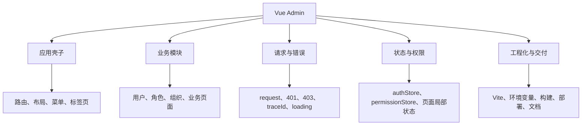

看懂 Vue Admin 的关键，不是背目录，而是看懂每条链路的输入、处理过程和输出。

## 总体架构图

一个可维护的 Vue Admin 项目可以拆成 5 层：

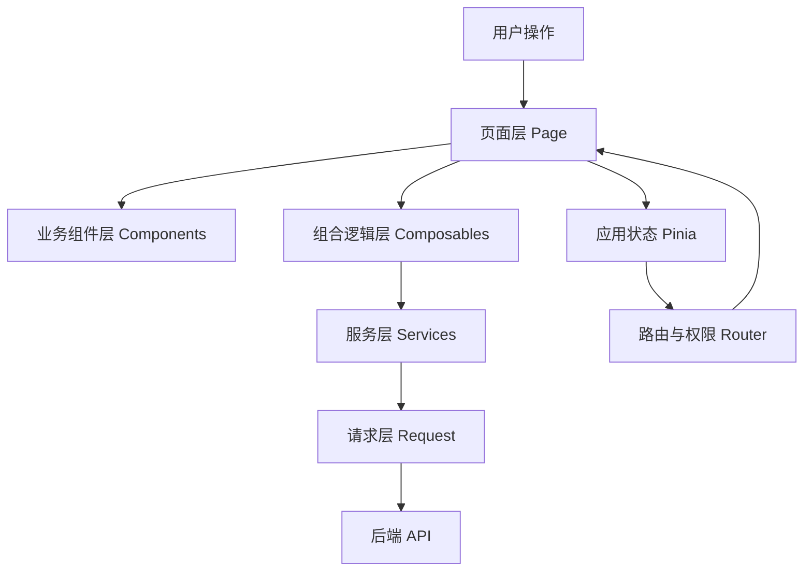

每层只做自己的事：

| 层级 | 负责什么 | 不应该做什么 |
| --- | --- | --- |
| Page | 组织页面、调用 composable、组装组件 | 直接拼接口地址 |
| Components | 展示表格、表单、弹窗、按钮 | 自己决定全局权限和路由 |
| Composables | 管理页面逻辑、loading、分页、提交 | 保存跨页面登录态 |
| Services | 封装业务接口和 DTO 转换 | 操作 DOM 和组件状态 |
| Request | 统一 token、错误、traceId、响应格式 | 理解具体业务页面 |
| Pinia | 保存跨页面状态 | 保存所有局部表单字段 |
| Router | 管理页面访问和动态路由 | 处理业务表单提交 |

## 推荐目录图

目录不是为了“看起来高级”，而是为了让每类代码有固定位置。

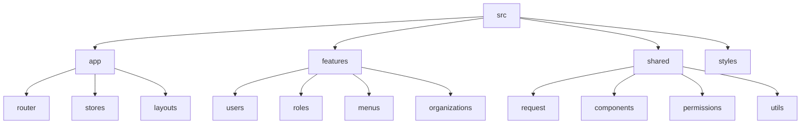

推荐结构：

```text
src/
  app/
    main.ts
    router/
      index.ts
      guards.ts
      static-routes.ts
      dynamic-route.ts
    stores/
      auth.ts
      permission.ts
      app.ts
    layouts/
      AdminLayout.vue
  features/
    users/
      UserListPage.vue
      components/
      services/
      model/
      composables/
    roles/
    menus/
    organizations/
  shared/
    request/
    components/
    permissions/
    utils/
  styles/
```

为什么推荐按 `features` 聚合？

- 用户模块相关页面、组件、请求、类型、权限码在一个目录里。
- 删除或迁移模块时不容易漏文件。
- 新人看目录时能先理解业务边界。
- 通用能力仍然放 `shared`，避免业务模块之间互相引用。

## 启动链路图

Vue Admin 启动时，不只是挂载组件，还要安装路由、状态和全局能力。

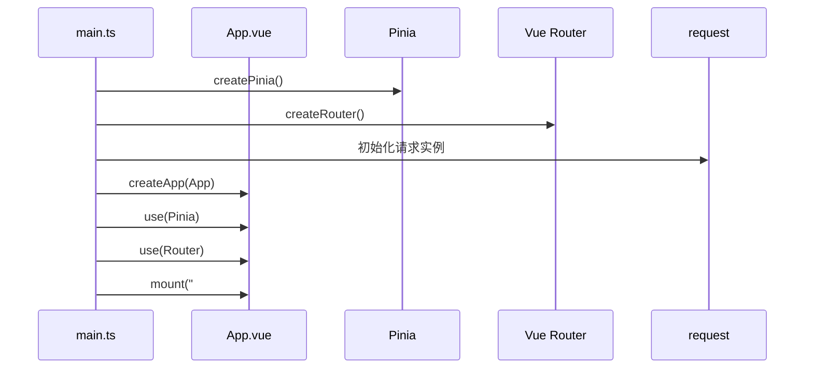

最小入口要保持干净：

```ts
import { createApp } from 'vue'
import { createPinia } from 'pinia'
import { router } from './router'
import App from './App.vue'

createApp(App)
  .use(createPinia())
  .use(router)
  .mount('#app')
```

不要把登录逻辑、权限请求、业务接口请求都塞进 `main.ts`。入口文件只负责组装应用。

## 页面数据流图

一个典型列表页的数据流如下：

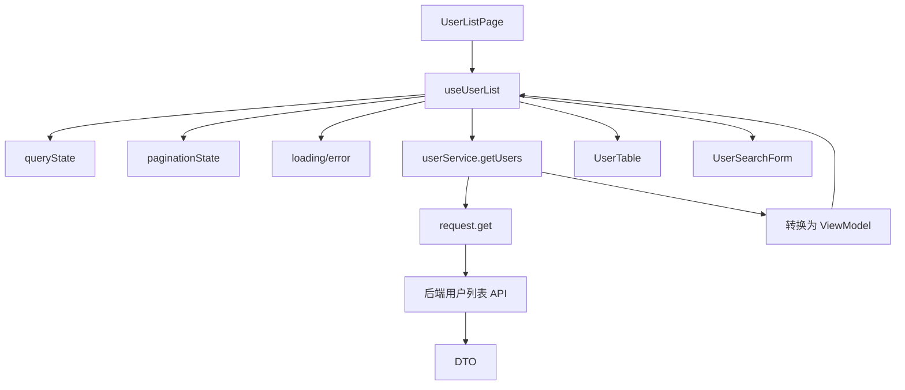

这张图要看懂两点：

1. 页面负责组织，不直接处理每个 HTTP 细节。
2. 子组件负责展示和触发事件，不直接越过页面去请求接口。

### 推荐分工

| 文件 | 职责 |
| --- | --- |
| `UserListPage.vue` | 组装搜索、表格、弹窗和按钮权限 |
| `useUserList.ts` | 管理查询、分页、loading、刷新、删除 |
| `userService.ts` | 请求用户接口，做 DTO 到页面模型的转换 |
| `UserSearchForm.vue` | 展示搜索表单，提交搜索条件 |
| `UserTable.vue` | 展示列表，触发编辑、删除、分页事件 |
| `UserFormDialog.vue` | 管理表单输入和校验 |

### 不推荐的做法

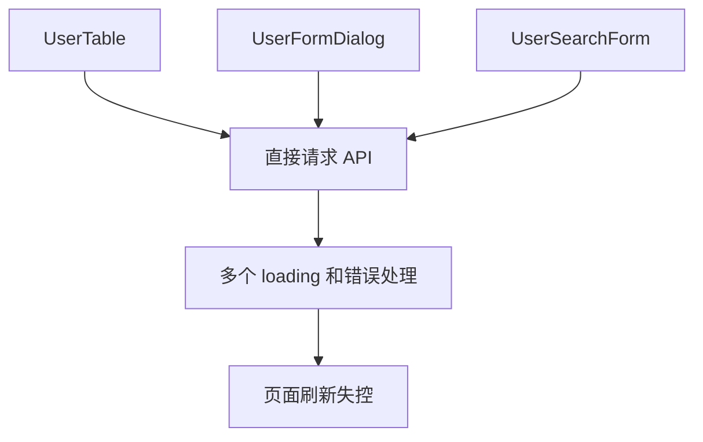

子组件都自己请求接口时，页面无法统一控制 loading、错误提示、刷新时机和权限状态。项目越大，越难排查。

## 状态分层图

不是所有状态都应该放 Pinia。状态要按生命周期分层。

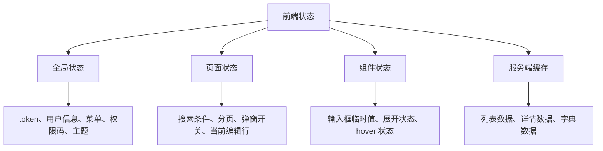

推荐规则：

| 状态 | 放哪里 | 原因 |
| --- | --- | --- |
| token | `authStore` + 持久化 | 刷新后要恢复登录态 |
| 当前用户 | `authStore` | 多页面都会用 |
| 菜单和权限码 | `permissionStore` | 路由、菜单、按钮都需要 |
| 搜索条件 | 页面或 `useUserList` | 只属于当前页面 |
| 弹窗开关 | 页面或弹窗组件 | 不需要跨页面共享 |
| 表单草稿 | 弹窗组件或 composable | 关闭后应清理 |
| 字典数据 | 视使用范围决定 | 多页面共享可放 Store 或缓存 |

如果你把所有状态都放进 Pinia，Pinia 会变成“全局垃圾桶”。后续调试时，很难判断某个状态为什么变化。

## 权限架构图

权限不是一个 `v-if`。它贯穿登录、菜单、路由、按钮、接口和数据范围。

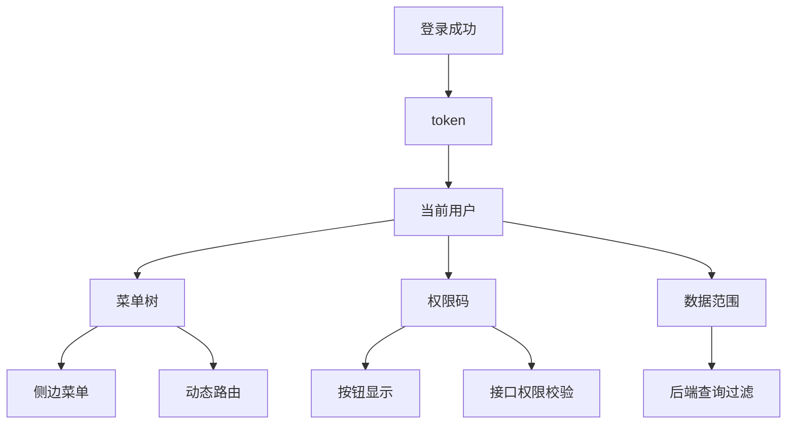

前端要分清三件事：

| 能力 | 前端负责 | 后端负责 |
| --- | --- | --- |
| 菜单权限 | 显示当前用户可见入口 | 返回当前用户菜单 |
| 路由权限 | 无权限页面跳 403 | 保证接口不会泄露数据 |
| 按钮权限 | 隐藏或禁用操作按钮 | 校验操作接口权限 |
| 数据权限 | 展示筛选结果和说明 | 按用户范围过滤查询 |

关键原则：

**前端权限让用户少走错路，后端权限保证系统安全。**

## 动态路由图

动态路由的本质是把后端菜单转成 Vue Router 能识别的路由记录。

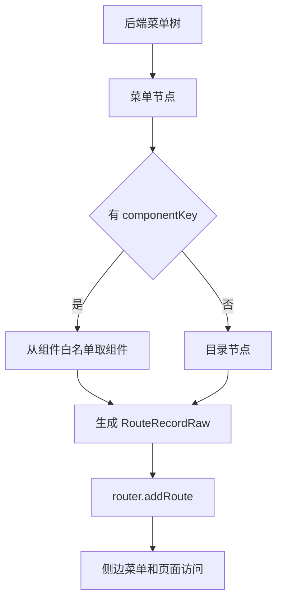

动态路由常见坑：

| 坑 | 表现 | 解决 |
| --- | --- | --- |
| 后端直接返回组件路径 | 存在安全和构建风险 | 后端返回 `componentKey`，前端维护白名单 |
| 刷新后 404 | 动态路由丢失 | token 存在时先恢复权限再 `return to.fullPath` |
| 重复注册路由 | 控制台警告、缓存错乱 | 使用稳定 `name`，注册前 `router.hasRoute` |
| 退出后旧页面还能进 | 旧路由未清理 | 退出时 `removeRoute` 并清权限 Store |

组件白名单示例：

```ts
const pageModules = {
  'system/users': () => import('@/features/users/UserListPage.vue'),
  'system/roles': () => import('@/features/roles/RoleListPage.vue'),
  'system/menus': () => import('@/features/menus/MenuListPage.vue')
} as const
```

## 请求架构图

请求层的职责是让所有接口都走同一套规则。

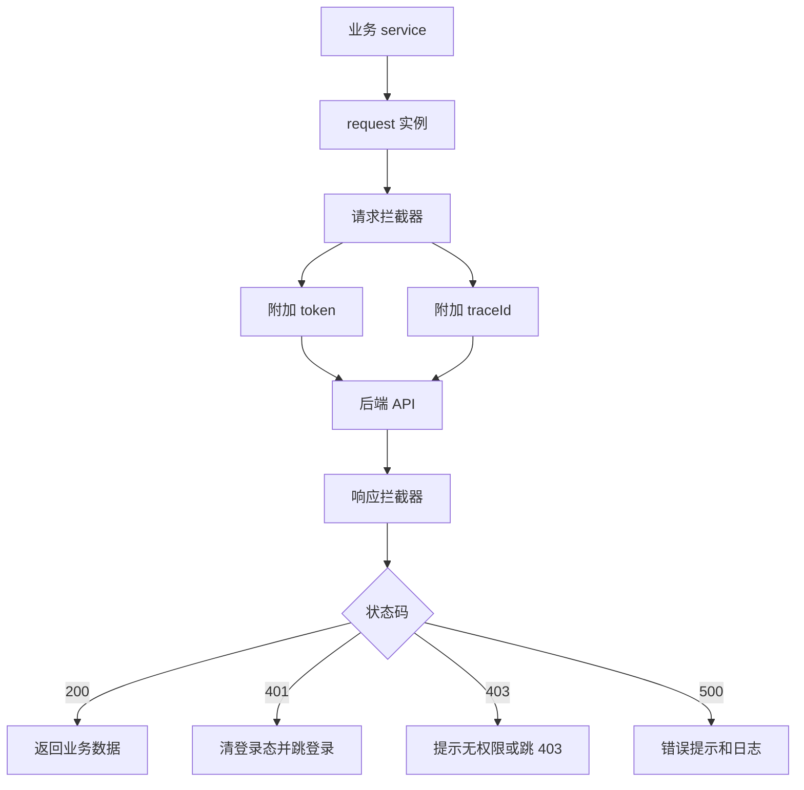

请求层要统一这些内容：

| 能力 | 为什么要统一 |
| --- | --- |
| baseURL | 不同环境不能散落写死 |
| token | 避免每个 service 手动加 header |
| traceId | 出问题时方便前后端对齐日志 |
| 401 | 统一清登录态和跳登录 |
| 403 | 保持登录态，明确无权限 |
| 业务错误 | 页面不需要重复解析错误结构 |
| 文件导出 | 统一处理 blob、文件名和失败提示 |

不要在每个页面重复写 `try/catch` 处理所有错误。页面可以处理业务上下文，但登录失效、无权限、服务异常应由请求层统一给出基础行为。

## 表单架构图

后台项目最常见的问题之一是“编辑表单污染列表”。根因是表单对象和表格行使用了同一个引用。

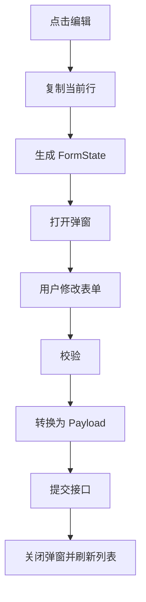

正确做法：

```ts
function openEdit(row: UserViewModel) {
  form.value = {
    id: row.id,
    name: row.name,
    email: row.email,
    roleIds: [...row.roleIds]
  }
  dialogVisible.value = true
}
```

不要这样：

```ts
function openEdit(row: UserViewModel) {
  form.value = row
}
```

表单要分清 3 种类型：

| 类型 | 用途 |
| --- | --- |
| DTO | 后端返回的数据结构 |
| FormState | 表单里编辑的数据结构 |
| Payload | 提交给后端的数据结构 |

这三者不要强行复用一个类型。真实项目里后端字段、页面显示字段和提交字段经常不一样。

## 模块依赖图

模块之间要避免随意互相引用。推荐依赖方向如下：

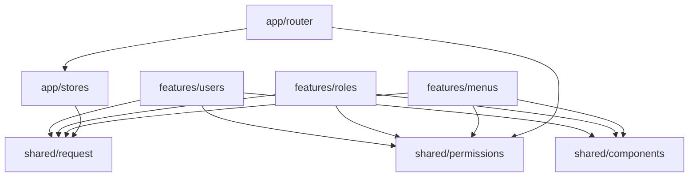

不推荐：

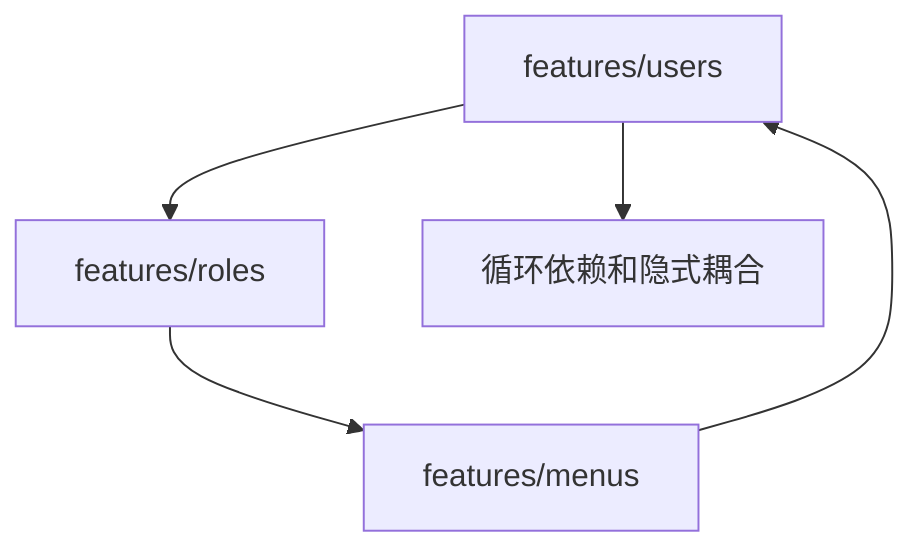

如果用户模块需要角色选项，不应该直接读取角色页面组件。更好的方式是：

- 把角色选项接口封装成 service。
- 把通用类型放到共享 model。
- 用户模块只依赖稳定接口，不依赖角色页面实现。

## 页面渲染状态图

一个成熟页面不只处理“有数据”。

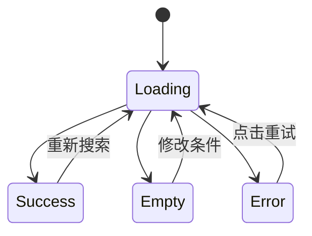

页面至少要处理：

| 状态 | 用户看到什么 |
| --- | --- |
| loading | 加载中，不重复点击 |
| empty | 没有数据，并说明下一步 |
| error | 出错提示和重试按钮 |
| forbidden | 无权限说明或 403 页面 |
| success | 正常列表和操作 |

不要只在接口成功时写页面。真实项目里，空状态、错误状态、无权限状态才是体验差异最大的地方。

## 构建与部署图

Vue Admin 的交付链路也要被设计，而不是最后才补。

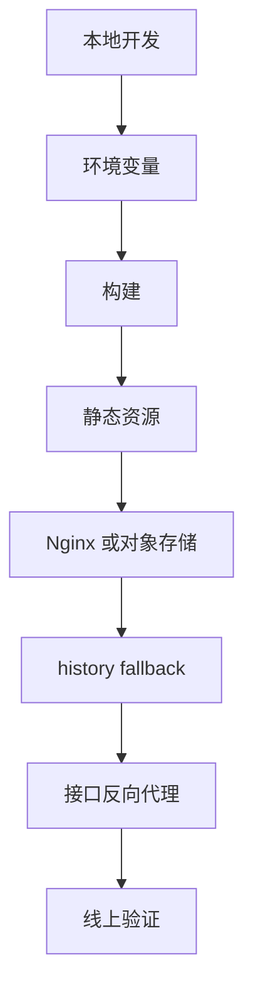

上线前要确认：

| 项目 | 检查点 |
| --- | --- |
| 环境变量 | API 地址、base、标题、开关不写死 |
| 构建产物 | `npm run build` 通过 |
| 路由模式 | history 模式配置 fallback |
| 静态资源 | base 路径正确 |
| 接口代理 | 生产环境不依赖 dev proxy |
| 缓存 | index.html 不长缓存，静态资源可长缓存 |
| 回滚 | 有旧版本产物或发布记录 |

如果生产环境二级路由刷新 404，先检查部署 fallback，再检查动态路由恢复，不要只盯 Vue Router。

## 排障定位图

出问题时，先判断问题属于哪条链路。

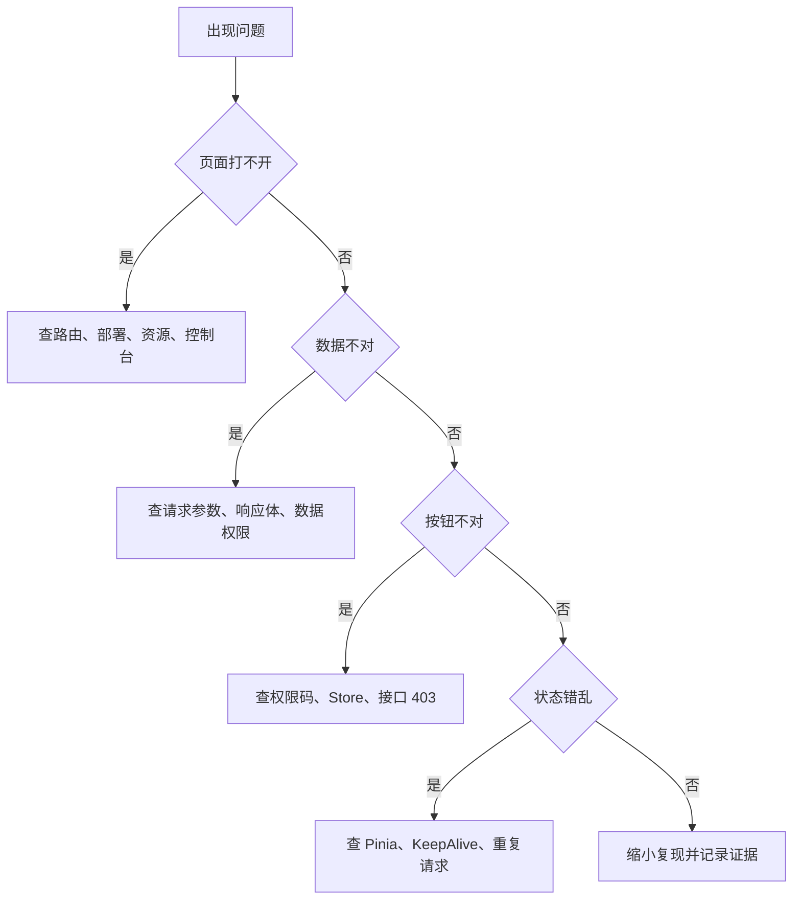

建议每次排障都记录 5 类证据：

| 证据 | 看什么 |
| --- | --- |
| Console | 是否有运行时错误 |
| Network | 请求参数、状态码、响应体 |
| Route | 当前路径、matched、meta |
| Store | token、用户、菜单、权限码 |
| Backend log | traceId、接口权限、数据范围 |

只看页面现象很容易误判。后台项目的问题常常出在请求、权限、状态和部署之间。

## 从图到代码的阅读顺序

建议按这个顺序进入具体章节：

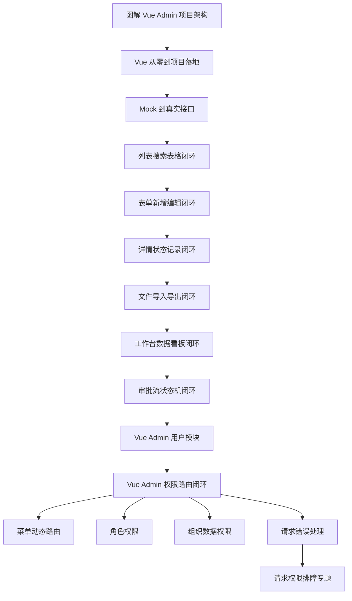

对应入口：

| 目标 | 下一篇 |
| --- | --- |
| 想开始搭项目 | [Vue 从零到项目落地](/vue/project-from-zero) |
| 想从 mock 接真实接口 | [Vue Admin Mock 到真实接口联调实战](/vue/admin-mock-to-api) |
| 想做好列表、搜索、分页和表格 | [Vue Admin 列表、搜索、分页与表格闭环实战](/vue/admin-list-search-table) |
| 想做好新增、编辑和表单校验 | [Vue Admin 表单弹窗、新增编辑与校验闭环实战](/vue/admin-form-modal-crud) |
| 想做好详情、状态流转和操作记录 | [Vue Admin 详情页、状态流转与操作记录闭环实战](/vue/admin-detail-status-audit) |
| 想做好上传、下载、导入导出和异步任务 | [Vue Admin 文件上传、下载、导入导出与异步任务闭环实战](/vue/admin-file-import-export) |
| 想做好工作台、统计卡片和图表看板 | [Vue Admin 工作台、统计卡片、图表看板与数据刷新闭环实战](/vue/admin-dashboard-analytics) |
| 想做好审批流、待办和状态机 | [Vue Admin 审批流、状态机、待办与审计闭环实战](/vue/admin-approval-workflow) |
| 想做用户列表 | [Vue Admin 用户模块实现手册](/vue/admin-user-module) |
| 想理解权限恢复 | [Vue Admin 权限路由闭环实战](/vue/admin-permission-route-flow) |
| 想做动态菜单 | [Vue Admin 菜单与动态路由实现手册](/vue/admin-menu-route-module) |
| 想做角色授权 | [Vue Admin 角色权限模块实现手册](/vue/admin-permission-module) |
| 想做组织和数据权限 | [Vue Admin 组织架构与数据权限实现手册](/vue/admin-organization-data-permission) |
| 想统一请求错误 | [Vue Admin 请求封装与错误处理闭环手册](/vue/admin-request-error-handling) |
| 想排查线上问题 | [Vue Admin 请求、权限与数据问题排查专题](/projects/issues-vue-admin-request) |

## 项目架构验收清单

完成 Vue Admin 基础架构后，用下面清单自查：

| 类别 | 验收项 |
| --- | --- |
| 目录 | `app`、`features`、`shared` 边界清楚 |
| 页面 | Page 负责组织，组件负责展示，composable 负责页面逻辑 |
| 请求 | service 不散落在组件里，request 统一处理 token 和错误 |
| 状态 | 登录态和权限放 Pinia，页面筛选和弹窗状态不乱放全局 |
| 权限 | 菜单、路由、按钮、接口、数据权限边界清楚 |
| 路由 | 静态路由和动态路由分开，刷新动态页不 404 |
| 表单 | DTO、FormState、Payload 分层，编辑不污染列表 |
| 错误 | loading、empty、error、forbidden 都有展示 |
| 部署 | 环境变量、base、fallback、代理和缓存策略清楚 |
| 文档 | README 写清目录、数据流、权限流和排障方式 |

如果其中某一项解释不清，先不要继续堆新业务模块。回到对应图，把输入、处理过程和输出画出来。

## 下一步学习

如果你刚开始做 Vue Admin，继续看 [Vue 从零到项目落地](/vue/project-from-zero)。  
如果你已经有项目骨架，先看 [Vue Admin Mock 到真实接口联调实战](/vue/admin-mock-to-api)，把环境、代理、DTO、分页和错误边界理清。  
如果你已经能接真实接口，继续看 [Vue Admin 列表、搜索、分页与表格闭环实战](/vue/admin-list-search-table)。  
如果你已经掌握列表页闭环，继续看 [Vue Admin 表单弹窗、新增编辑与校验闭环实战](/vue/admin-form-modal-crud)。  
如果你已经掌握表单新增编辑闭环，继续看 [Vue Admin 详情页、状态流转与操作记录闭环实战](/vue/admin-detail-status-audit)。  
如果你已经掌握详情状态记录闭环，继续看 [Vue Admin 文件上传、下载、导入导出与异步任务闭环实战](/vue/admin-file-import-export)。  
如果你已经掌握文件任务闭环，继续看 [Vue Admin 工作台、统计卡片、图表看板与数据刷新闭环实战](/vue/admin-dashboard-analytics)。  
如果你已经掌握工作台看板闭环，继续看 [Vue Admin 审批流、状态机、待办与审计闭环实战](/vue/admin-approval-workflow)。  
如果你已经掌握审批流闭环，继续看 [Vue Admin 用户模块实现手册](/vue/admin-user-module)。  
如果你已经完成用户模块，继续看 [Vue Admin 权限路由闭环实战](/vue/admin-permission-route-flow)。  
如果你想按完整路线推进，回到 [Vue Admin 学习地图与交付清单](/roadmap/vue-admin-learning-map)。  
如果你正在排查问题，进入 [项目排障方法论](/projects/debugging-playbook) 和 [Vue Admin 请求、权限与数据问题排查专题](/projects/issues-vue-admin-request)。
