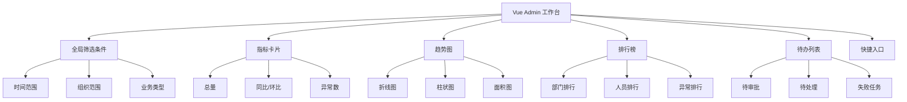
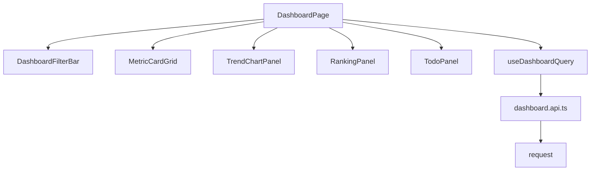
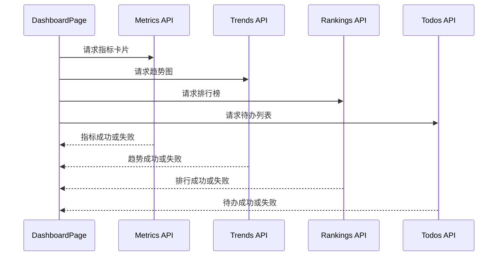
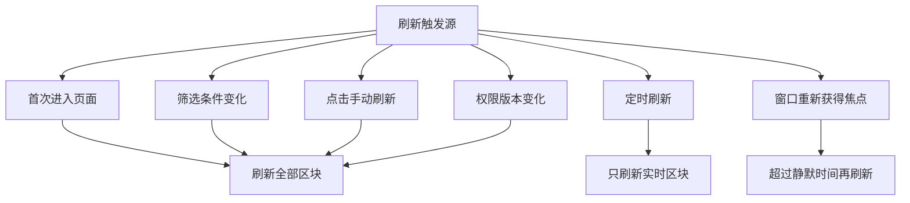
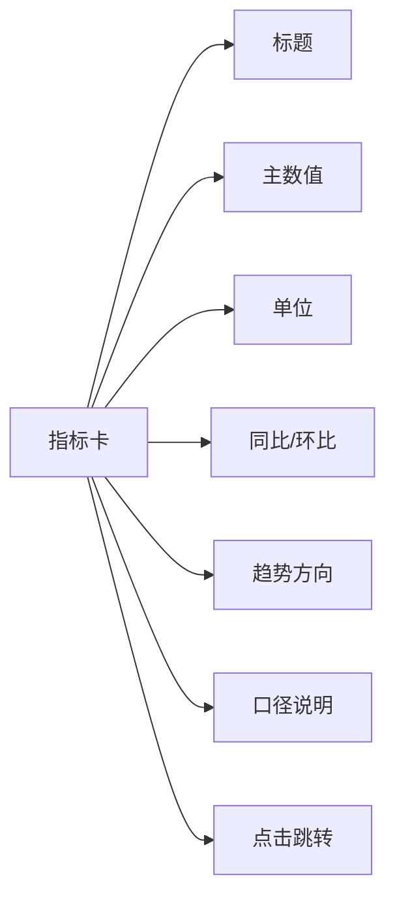
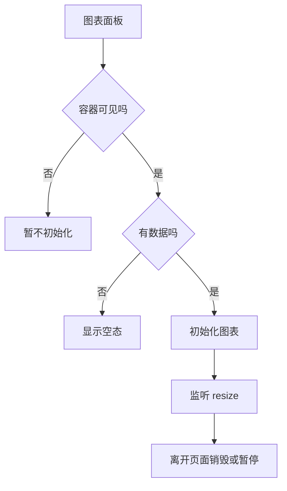
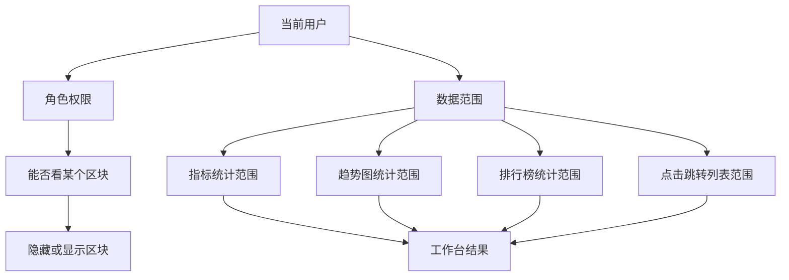
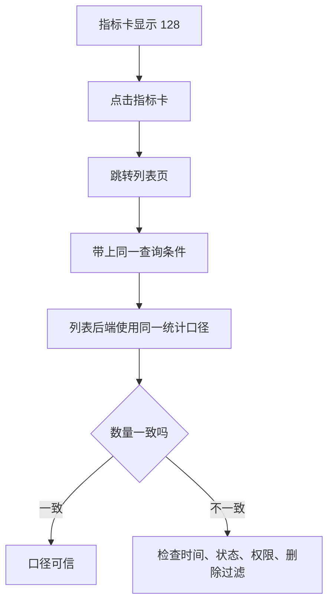
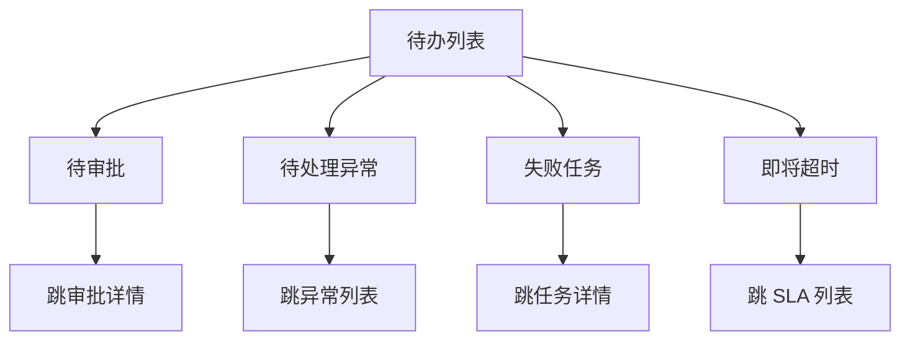
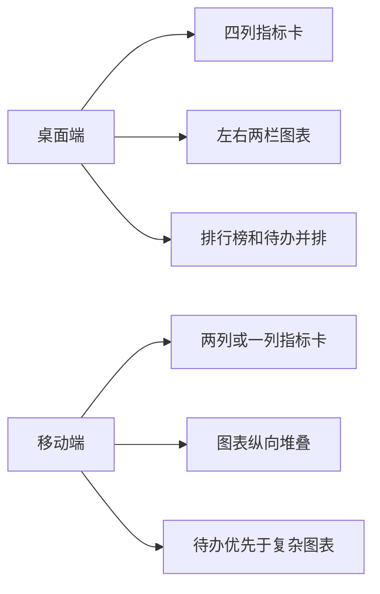

# Vue Admin 工作台、统计卡片、图表看板与数据刷新闭环实战

很多 Vue Admin 项目都会先做登录、菜单、用户管理、权限和列表页，但真正交给业务使用时，用户打开后台后最先看到的往往是工作台：

- 今天有多少待办。
- 本周新增多少客户、订单、工单或审批。
- 异常指标是不是变多了。
- 哪些任务需要我马上处理。
- 数据是否按我的部门、角色和数据权限裁剪。
- 图表里的数字为什么和列表导出的数字不一致。

工作台看起来像“几张卡片 + 几个图表”，但真实项目里它容易踩很多坑：指标口径不清、多个接口互相覆盖、图表闪烁、权限范围不一致、缓存导致数字不刷新、移动端图表溢出、后端慢查询把首页拖垮。

这一页把 Vue Admin 里的工作台、统计卡片、趋势图、排行榜、待办列表、自动刷新和数据权限串成一个可落地的闭环。

## 适合谁看

- 已经完成 [Vue Admin 用户模块实现手册](/vue/admin-user-module)，准备做后台首页的人。
- 已经完成 [Vue Admin 请求封装与错误处理闭环手册](/vue/admin-request-error-handling)，想把页面 loading、empty、error 状态用于看板的人。
- 正在做管理驾驶舱、运营看板、财务看板、售后看板、工单看板、审批工作台的人。
- 经常遇到“图表数据和列表不一致”“首页很慢”“权限切换后仍显示旧数据”的人。

## 这一页最终要做到什么

完成本页后，你应该能设计一个可维护的 Vue Admin 工作台：

| 能力 | 最终效果 | 不合格表现 |
| --- | --- | --- |
| 指标口径 | 每个数字都有业务定义、统计范围和刷新规则 | 卡片写死一个接口，没人知道数字怎么算 |
| 页面分层 | 工作台拆成筛选区、指标卡、趋势图、排行榜、待办区 | 所有请求和图表配置堆在一个页面组件里 |
| 请求组织 | 每个区域独立 loading、error、retry，不互相阻塞 | 一个接口失败导致整页空白 |
| 数据权限 | 图表、列表、导出和详情使用同一数据范围 | 用户只能看本部门列表，却看到全公司图表 |
| 刷新策略 | 支持手动刷新、定时刷新、焦点恢复刷新和权限版本刷新 | 页面一直轮询，离开也不停 |
| 图表性能 | 大图表懒加载、按需渲染、销毁实例、避免重复初始化 | 切换标签页后内存越来越高 |
| 排障证据 | 每个区块能定位接口、参数、traceId 和指标口径 | 只知道首页数字不对，不知道错在哪里 |

## 先建立心智模型

工作台不是一个“首页页面”，而是多个数据区块按优先级组合出来的任务入口。



正确的开发顺序不是先画图，而是先确定：

1. 谁看这个工作台。
2. 他打开页面最想完成什么任务。
3. 每个指标怎么定义。
4. 每个指标受哪些筛选和权限影响。
5. 哪些数据需要实时刷新，哪些可以缓存。

## 工作台的页面层级

推荐把工作台拆成 5 层：



目录结构示例：

```txt
src/
  features/
    dashboard/
      api/
        dashboard.api.ts
      components/
        DashboardFilterBar.vue
        MetricCardGrid.vue
        MetricCard.vue
        TrendChartPanel.vue
        RankingPanel.vue
        TodoPanel.vue
        DashboardSection.vue
      composables/
        useDashboardFilter.ts
        useDashboardMetrics.ts
        useDashboardCharts.ts
        useDashboardRefresh.ts
      types/
        dashboard.types.ts
      views/
        DashboardPage.vue
```

拆分原则：

- `DashboardPage` 只组织布局、筛选条件和刷新入口。
- `DashboardFilterBar` 只维护筛选 UI，不直接请求图表接口。
- `MetricCardGrid` 负责指标卡片布局。
- `TrendChartPanel` 负责图表容器、图表实例和图表状态。
- `useDashboardMetrics` 负责指标请求、错误和重试。
- `useDashboardRefresh` 负责刷新节奏，不知道具体业务指标。

## 先定义指标口径

工作台最重要的不是图表，而是指标口径。没有口径，图表越漂亮越危险。

| 指标 | 业务含义 | 统计范围 | 更新时间 | 权限规则 |
| --- | --- | --- | --- | --- |
| 今日新增用户 | 今天 00:00 到当前时间创建的用户数 | 当前数据权限内组织 | 5 分钟 | 按部门数据范围裁剪 |
| 待审批数量 | 当前用户需要处理的审批任务 | 当前用户本人待办 | 实时或 1 分钟 | 只看自己的待办 |
| 异常订单数 | 支付失败、取消失败、库存异常订单数 | 当前筛选时间范围 | 5 分钟 | 按业务数据范围裁剪 |
| 导出失败任务 | 当前用户创建且失败的导出任务 | 最近 7 天 | 1 分钟 | 只看自己任务 |
| 客户转化率 | 成交客户 / 有效线索 | 当前筛选范围 | 30 分钟 | 可按部门聚合 |

口径文档建议写在页面顶部附近或模块 README 中：

```md
## 工作台指标口径

### 今日新增用户

- 字段：`metrics.todayNewUsers`
- 统计范围：当前账号数据权限内的用户。
- 时间口径：服务端所在时区当天 00:00 到当前时间。
- 排除规则：排除已删除用户，包含停用用户。
- 刷新规则：首次加载、筛选变化、手动刷新、每 5 分钟自动刷新。
- 对账入口：用户列表使用相同时间条件筛选。
```

如果指标口径没有写清，后面所有“数字不一致”都会变成低效争论。

## 类型设计

不要让图表直接依赖后端原始字段。先定义 DTO，再转换成 ViewModel。

```ts
export type DashboardRange = 'today' | '7d' | '30d' | 'custom'

export interface DashboardQuery {
  range: DashboardRange
  startDate?: string
  endDate?: string
  departmentId?: string
  bizType?: string
}

export interface MetricDTO {
  key: string
  label: string
  value: number
  unit?: string
  compareValue?: number
  compareType?: 'day' | 'week' | 'month'
  trend: 'up' | 'down' | 'flat'
}

export interface TrendPointDTO {
  date: string
  value: number
  category?: string
}

export interface RankingItemDTO {
  id: string
  name: string
  value: number
  percent?: number
}

export interface TodoItemDTO {
  id: string
  title: string
  type: 'approval' | 'task' | 'alert' | 'export'
  priority: 'low' | 'normal' | 'high'
  createdAt: string
  routePath: string
}
```

页面展示模型可以更贴近 UI：

```ts
export interface MetricCardViewModel {
  key: string
  title: string
  valueText: string
  compareText: string
  trendType: 'success' | 'danger' | 'neutral'
  description: string
  routePath?: string
}

export interface ChartViewModel {
  title: string
  xAxis: string[]
  series: Array<{
    name: string
    data: number[]
  }>
  emptyText: string
}
```

为什么要转换？

- 后端返回的是业务事实，页面需要格式化数字、单位、趋势颜色和跳转链接。
- 同一个 DTO 可能用于桌面图表和移动端迷你图。
- 转换层能集中处理空值、单位和异常值。

## 请求组织：整页不能被一个接口拖死

工作台通常有多个接口：

| 区块 | 接口 | 失败时页面表现 |
| --- | --- | --- |
| 指标卡片 | `GET /dashboard/metrics` | 卡片区显示错误和重试 |
| 趋势图 | `GET /dashboard/trends` | 图表区显示错误，不影响待办 |
| 排行榜 | `GET /dashboard/rankings` | 排行榜区显示空态或错误 |
| 待办 | `GET /dashboard/todos` | 待办区显示错误和刷新 |
| 快捷入口 | `GET /dashboard/shortcuts` | 使用默认入口兜底 |



每个区块独立管理状态：

```ts
export interface SectionState<T> {
  loading: boolean
  error: string | null
  data: T | null
  updatedAt: string | null
}

export function createSectionState<T>(): SectionState<T> {
  return {
    loading: false,
    error: null,
    data: null,
    updatedAt: null
  }
}
```

不要只写一个全局 `dashboardLoading`。如果趋势图失败，指标卡片和待办仍然应该可用。

## 组合式函数：筛选、请求、刷新分开

```ts
import { computed, reactive, ref } from 'vue'

export function useDashboardFilter() {
  const query = reactive<DashboardQuery>({
    range: '7d',
    departmentId: undefined,
    bizType: undefined
  })

  const querySnapshot = computed(() => ({
    range: query.range,
    startDate: query.startDate,
    endDate: query.endDate,
    departmentId: query.departmentId,
    bizType: query.bizType
  }))

  function changeRange(range: DashboardRange) {
    query.range = range
    if (range !== 'custom') {
      query.startDate = undefined
      query.endDate = undefined
    }
  }

  return {
    query,
    querySnapshot,
    changeRange
  }
}
```

请求函数要处理旧请求覆盖：

```ts
export function useDashboardMetrics() {
  const state = reactive(createSectionState<MetricCardViewModel[]>())
  const requestVersion = ref(0)

  async function load(query: DashboardQuery) {
    const version = ++requestVersion.value
    state.loading = true
    state.error = null

    try {
      const result = await getDashboardMetrics(query)

      if (version !== requestVersion.value) return

      state.data = result.map(toMetricCardViewModel)
      state.updatedAt = new Date().toISOString()
    } catch (error) {
      if (version !== requestVersion.value) return

      state.error = normalizeErrorMessage(error)
    } finally {
      if (version === requestVersion.value) {
        state.loading = false
      }
    }
  }

  return {
    state,
    load
  }
}
```

筛选条件变化时，所有区块不一定都要刷新：

| 变化 | 需要刷新 |
| --- | --- |
| 时间范围变化 | 指标、趋势、排行榜 |
| 部门变化 | 指标、趋势、排行榜、待办 |
| 业务类型变化 | 指标、趋势、排行榜 |
| 权限版本变化 | 全部刷新 |
| 只切换图表类型 | 不请求接口，只重绘图表 |

## 刷新策略

工作台刷新不能只靠 `setInterval`。推荐设计成几种触发源：



### 定时刷新要有边界

适合定时刷新的区块：

- 待办数量。
- 异常告警。
- 导出失败任务。
- 在线状态。

不适合频繁刷新的区块：

- 大趋势图。
- 复杂排行榜。
- 历史统计。
- 大屏汇总查询。

```ts
import { onActivated, onBeforeUnmount, onDeactivated } from 'vue'

export function useDashboardRefresh(options: {
  refreshRealtime: () => void
  interval: number
}) {
  let timer: number | null = null

  function start() {
    stop()
    timer = window.setInterval(options.refreshRealtime, options.interval)
  }

  function stop() {
    if (timer) {
      window.clearInterval(timer)
      timer = null
    }
  }

  onActivated(start)
  onDeactivated(stop)
  onBeforeUnmount(stop)

  return {
    start,
    stop
  }
}
```

如果页面被 `KeepAlive` 缓存，离开页面不会触发 `onUnmounted`，所以要用 `onDeactivated` 暂停轮询。

## 指标卡片怎么设计

指标卡不是简单显示数字。一个成熟指标卡通常包含：



示例：

| 指标 | 主数值 | 趋势 | 点击后 |
| --- | ---: | --- | --- |
| 今日新增用户 | 128 | 较昨日 +12% | 用户列表，带创建时间筛选 |
| 待审批 | 6 | 高优先级 2 个 | 审批待办列表 |
| 导出失败任务 | 3 | 最近 24 小时 | 导出任务列表 |
| 异常订单 | 18 | 较昨日 -5% | 异常订单列表 |

点击跳转要带上同一套条件：

```ts
function openMetricDetail(metric: MetricCardViewModel, query: DashboardQuery) {
  if (!metric.routePath) return

  router.push({
    path: metric.routePath,
    query: {
      range: query.range,
      startDate: query.startDate,
      endDate: query.endDate,
      departmentId: query.departmentId
    }
  })
}
```

这样用户从“异常订单 18”跳到列表时，能看到对应的 18 条或同口径数据。

## 图表面板：先处理空态和尺寸，再谈图表库

图表最常见的问题不是配置项不会写，而是容器尺寸不稳定：

- 首次渲染时容器宽度是 0。
- 抽屉或标签页里图表不可见时初始化。
- 移动端图表固定宽度导致横向溢出。
- KeepAlive 恢复后图表没有 resize。



图表容器建议：

```vue
<template>
  <section class="dashboard-section">
    <header class="dashboard-section__header">
      <h2 class="dashboard-section__title">{{ title }}</h2>
      <button type="button" class="dashboard-section__refresh" @click="refresh">
        刷新
      </button>
    </header>

    <div v-if="loading" class="dashboard-section__state">加载中</div>
    <div v-else-if="error" class="dashboard-section__state">
      {{ error }}
      <button type="button" @click="refresh">重试</button>
    </div>
    <div v-else-if="isEmpty" class="dashboard-section__state">暂无数据</div>
    <div v-else ref="chartRef" class="dashboard-chart"></div>
  </section>
</template>
```

```css
.dashboard-section {
  min-width: 0;
}

.dashboard-section__header {
  display: flex;
  align-items: center;
  justify-content: space-between;
  gap: 12px;
}

.dashboard-section__title {
  min-width: 0;
  margin: 0;
  font-size: 16px;
  font-weight: 700;
}

.dashboard-section__refresh {
  flex: 0 0 auto;
}

.dashboard-chart {
  width: 100%;
  min-width: 0;
  height: 320px;
}
```

注意这里没有写 `.dashboard-section div` 这类宽泛选择器，避免污染组件库内部结构。

## 图表库选择原则

这一页不要求立刻安装图表库。真实项目可以按场景选择：

| 方案 | 适合场景 | 优点 | 注意点 |
| --- | --- | --- | --- |
| ECharts | 中后台图表、地图、复杂交互 | 生态成熟，企业后台常用 | 包体积较大，要按需加载 |
| AntV G2Plot | 统计图、分析图、可视化规范 | 图表语义清晰 | 和项目技术栈、主题集成要评估 |
| Chart.js | 简单图表 | 轻量易用 | 复杂交互能力有限 |
| 纯表格/数字卡 | 指标少、无需趋势 | 简单稳定 | 不适合趋势表达 |

如果项目已经选定组件库或图表库，优先使用现有方案，不要为了一个工作台引入第二套图表体系。

## 权限和数据范围

工作台最容易忽略权限。图表和列表必须使用同一套数据范围。



权限处理建议：

| 场景 | 前端表现 | 后端要求 |
| --- | --- | --- |
| 无权看销售指标 | 隐藏销售卡片或显示无权限占位 | 接口也必须 403 或过滤 |
| 只能看本部门 | 筛选部门只显示可选范围 | 查询统计时按部门裁剪 |
| 可看汇总不可看明细 | 卡片可见，点击详情提示无权限 | 指标接口和列表接口分别授权 |
| 敏感金额指标 | 卡片脱敏或只显示区间 | 接口按字段权限返回 |

不要只在前端隐藏卡片。前端隐藏只是体验，后端仍然要鉴权。

## 工作台和列表页如何对账

“图表数字和列表数字不一致”是工作台最常见问题。



对账检查清单：

1. 时间范围是否一致。
2. 时区是否一致。
3. 是否排除了软删除数据。
4. 是否包含停用、取消、失败状态。
5. 数据权限是否一致。
6. 列表是否还有额外默认筛选。
7. 指标是否使用缓存，列表是否实时查询。
8. 后端统计 SQL 和列表 SQL 是否共用条件构造。

前端要保留 query snapshot，方便复现。

```ts
export interface DashboardEvidence {
  sectionKey: string
  querySnapshot: DashboardQuery
  permissionVersion: string
  traceId?: string
  updatedAt: string
}
```

## 待办列表：工作台不是只看数字

待办区是工作台最有价值的部分，因为它直接把用户带到任务。



待办项最少包含：

| 字段 | 说明 |
| --- | --- |
| 标题 | 用户能看懂要处理什么 |
| 类型 | 审批、任务、异常、导出 |
| 优先级 | 高、中、低 |
| 时间 | 创建时间或截止时间 |
| 跳转路由 | 点击后进入真实处理页面 |
| 权限 | 无权处理时不应出现 |

不要把待办写成纯展示。每个待办都应该能进入处理路径。

## 移动端和窄屏处理

后台工作台在移动端不一定高频使用，但窄屏必须能读：



布局建议：

```css
.dashboard-grid {
  display: grid;
  grid-template-columns: repeat(4, minmax(0, 1fr));
  gap: 16px;
}

.dashboard-main {
  display: grid;
  grid-template-columns: minmax(0, 2fr) minmax(280px, 1fr);
  gap: 16px;
}

@media (max-width: 900px) {
  .dashboard-grid {
    grid-template-columns: repeat(2, minmax(0, 1fr));
  }

  .dashboard-main {
    grid-template-columns: minmax(0, 1fr);
  }
}

@media (max-width: 520px) {
  .dashboard-grid {
    grid-template-columns: minmax(0, 1fr);
  }
}
```

关键点：

- 每个 grid 轨道用 `minmax(0, 1fr)`，避免内容撑出容器。
- 图表容器 `width: 100%`，不要写固定宽度。
- 按钮、头像、状态点设置固定宽高和 `flex-shrink: 0`。
- 移动端优先展示待办和关键指标，复杂趋势图可以往下放。

## 缓存策略

工作台可以缓存，但缓存必须可解释。

| 数据 | 是否缓存 | 建议 |
| --- | --- | --- |
| 快捷入口 | 可以 | 登录后缓存，权限变化清理 |
| 指标卡片 | 短缓存 | 1 到 5 分钟，显示更新时间 |
| 趋势图 | 可以 | 按 query key 缓存 |
| 待办列表 | 少缓存 | 页面激活或焦点恢复刷新 |
| 权限相关区块 | 谨慎 | 权限版本变化必须清理 |

缓存 key 必须包含：

```ts
function getDashboardCacheKey(query: DashboardQuery, userId: string, permissionVersion: string) {
  return JSON.stringify({
    userId,
    permissionVersion,
    range: query.range,
    startDate: query.startDate,
    endDate: query.endDate,
    departmentId: query.departmentId,
    bizType: query.bizType
  })
}
```

如果缓存 key 不包含用户和权限版本，就可能出现 A 用户退出后 B 用户看到 A 的指标。

## 常见问题与解决方案

### 1. 首页加载很慢

排查顺序：

1. Network 里看哪个接口最慢。
2. 后端日志里用 traceId 查 SQL 和调用链。
3. 检查是否一个接口返回了所有图表数据。
4. 检查是否首页加载了很重的图表库。
5. 检查是否多个区块重复请求同一个接口。

解决方式：

- 把工作台拆成多个区块接口。
- 首屏只加载关键指标和待办。
- 趋势图懒加载或延后加载。
- 后端给复杂统计做汇总表或缓存。
- 前端每个区块独立 loading，不要全页等待。

### 2. 图表数字和列表不一致

优先查口径：

- 时间范围是不是一样。
- 是否使用同一时区。
- 是否包含取消、删除、停用状态。
- 是否按当前用户数据权限裁剪。
- 列表是否默认过滤了某些状态。
- 图表是否使用旧缓存。

不要只让后端“改 SQL”。先把 query snapshot 和口径对齐。

### 3. 切换账号后看到旧图表

常见原因：

- Pinia 没有清理 dashboard store。
- 缓存 key 没有包含 userId。
- KeepAlive 没有在退出时清理。
- 权限版本变化后没有重新请求。

修复：

```ts
function resetDashboardState() {
  metricsState.data = null
  trendsState.data = null
  rankingsState.data = null
  todosState.data = null
  clearDashboardCache()
}
```

退出登录、切换租户、切换角色后都要执行类似清理。

### 4. 图表在标签页里显示空白

原因通常是初始化时容器不可见，宽度为 0。

解决方式：

- 标签页激活后再初始化图表。
- 使用 `ResizeObserver` 监听容器尺寸。
- `onActivated` 时调用图表 resize。
- 如果抽屉或弹窗里有图表，等打开动画结束后 resize。

### 5. 定时刷新导致接口压力大

定时刷新要分级：

- 待办：1 分钟。
- 异常告警：30 秒到 1 分钟。
- 统计卡片：3 到 5 分钟。
- 趋势图：手动刷新或 10 分钟以上。

页面隐藏、路由离开、KeepAlive deactivated 时必须暂停轮询。

### 6. 移动端图表横向溢出

排查：

- 图表容器是否固定了 `width: 800px`。
- grid 轨道是否缺少 `minmax(0, 1fr)`。
- 图表 tooltip 或 legend 是否太长。
- 表格是否没有横向滚动容器。

修复时优先改业务容器，不要用宽泛选择器覆盖组件库内部 DOM。

### 7. 指标卡趋势颜色引发误解

不是所有“上涨”都是好事：

| 指标 | 上涨含义 |
| --- | --- |
| 销售额 | 通常是好事 |
| 异常订单 | 通常是坏事 |
| 投诉数量 | 通常是坏事 |
| 待办数量 | 可能是积压 |

趋势颜色不要只根据 up/down 决定，要根据指标类型决定。

```ts
function getTrendType(metricKey: string, trend: 'up' | 'down' | 'flat') {
  const negativeWhenUp = ['abnormalOrders', 'complaints', 'failedTasks']

  if (trend === 'flat') return 'neutral'
  if (negativeWhenUp.includes(metricKey)) {
    return trend === 'up' ? 'danger' : 'success'
  }

  return trend === 'up' ? 'success' : 'danger'
}
```

## 实战练习：做一个用户运营工作台

目标：在 Vue Admin 中增加一个“用户运营工作台”。

### 练习 1：指标口径表

先写文档，不写代码。

要求定义 4 个指标：

1. 今日新增用户。
2. 本周活跃用户。
3. 待处理导入任务。
4. 异常登录次数。

每个指标写清：

- 业务含义。
- 统计范围。
- 权限规则。
- 刷新规则。
- 点击跳转到哪里。

验收：

- 另一个人只看口径表，也能说清这个数字怎么算。

### 练习 2：指标卡片区

要求：

1. 创建 `MetricCardGrid`。
2. 每张卡片包含标题、主数值、单位、趋势、更新时间。
3. 每个卡片点击后跳到对应列表页。
4. loading、empty、error 独立展示。
5. 390px 宽度下不横向溢出。

验收：

- 接口失败时只影响卡片区，不影响待办区。
- 趋势颜色符合业务含义。

### 练习 3：趋势图面板

要求：

1. 创建 `TrendChartPanel`。
2. 支持最近 7 天和 30 天切换。
3. 切换时间范围时旧请求不能覆盖新请求。
4. 页面离开时销毁或暂停图表实例。
5. KeepAlive 恢复时 resize 图表。

验收：

- 快速切换时间范围不会显示旧数据。
- 移动端图表不撑出页面。
- 反复进入离开页面，内存和请求数量没有明显增加。

### 练习 4：待办列表

要求：

1. 展示待审批、失败导出任务、异常登录告警。
2. 每个待办都能跳转真实页面。
3. 每 1 分钟刷新待办。
4. 页面隐藏或离开时暂停刷新。
5. 权限不足的待办不展示。

验收：

- 待办不是静态文案，而是可处理任务入口。
- 切换账号后不会看到上一个账号的待办。

## 上线检查清单

上线工作台前逐项检查：

1. 每个指标都有口径说明。
2. 图表、列表、导出使用同一套查询条件和数据范围。
3. 每个区块有独立 loading、empty、error、retry。
4. 首页首屏不等待所有低优先级图表。
5. 刷新策略明确，离开页面会停止轮询。
6. KeepAlive 恢复时图表会 resize。
7. 切换账号、租户、角色后清理缓存。
8. 缓存 key 包含 userId、权限版本和筛选条件。
9. 移动端没有横向溢出。
10. 每个接口失败能拿到 traceId。
11. 图表库没有被多个页面重复打包。
12. README 写清指标口径和对账方式。

## 和其他文档怎么配合

| 你要做什么 | 继续看 |
| --- | --- |
| 先理解后台项目分层 | [图解 Vue Admin 项目架构](/vue/admin-architecture-visual-guide) |
| 处理请求错误和区块状态 | [Vue Admin 请求封装与错误处理闭环手册](/vue/admin-request-error-handling) |
| 处理数据范围 | [Vue Admin 组织架构与数据权限实现手册](/vue/admin-organization-data-permission) |
| 处理权限刷新和缓存 | [Vue Admin 权限路由闭环实战](/vue/admin-permission-route-flow) |
| 做审批待办和流程入口 | [Vue Admin 审批流、状态机、待办与审计闭环实战](/vue/admin-approval-workflow) |
| 做完整数据看板项目 | [数据看板项目案例](/projects/analytics-dashboard-case) |
| 做智能 BI 看板 | [智能报表与 BI 分析项目案例](/projects/smart-bi-dashboard-case) |
| 排查真实 Vue 问题 | [Vue 真实项目问题库](/projects/issues-vue) |

## 下一步学习

如果你已经完成工作台、统计卡片和图表看板闭环，继续看 [Vue Admin 审批流、状态机、待办与审计闭环实战](/vue/admin-approval-workflow)，把工作台待办、审批详情、处理动作和任务刷新串起来。

如果你的工作台已经和权限打通，继续看 [Vue Admin 请求封装与错误处理闭环手册](/vue/admin-request-error-handling)，把区块级 loading、empty、error、traceId、重试和刷新策略做成团队规范。
