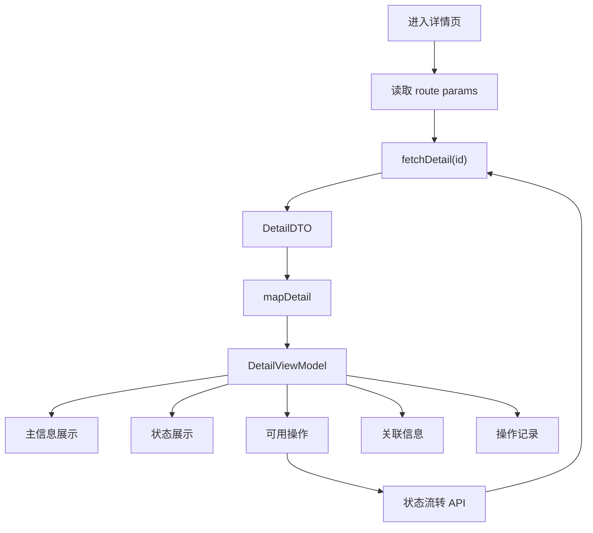
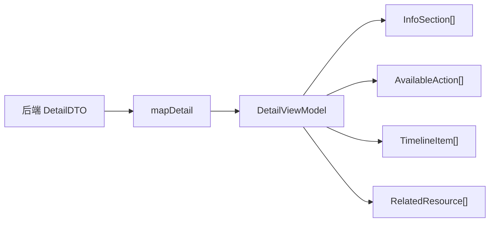
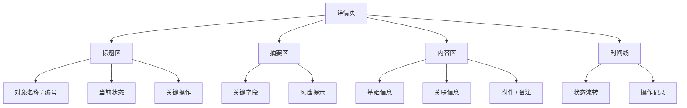
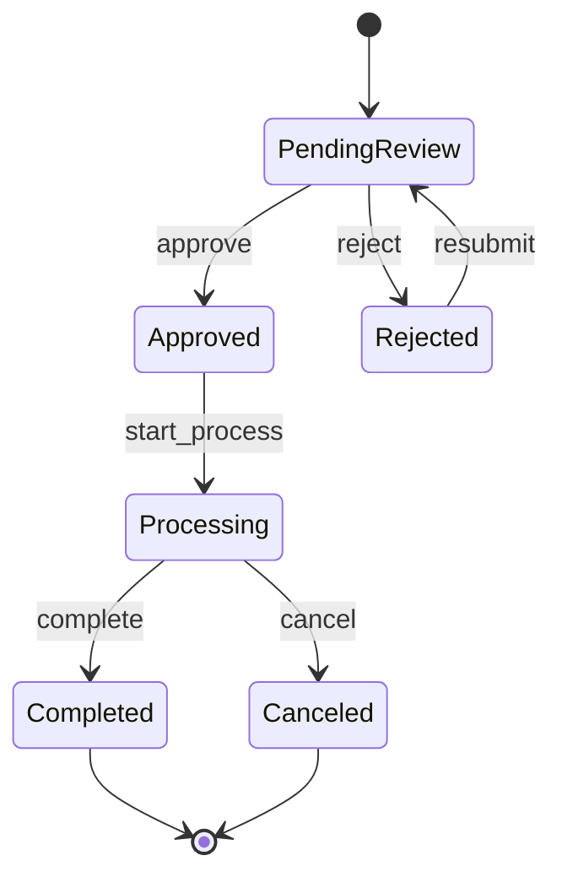
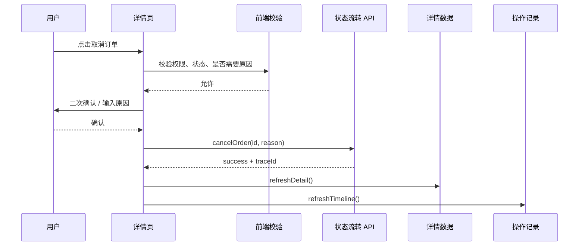
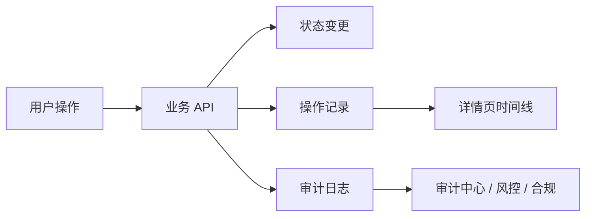
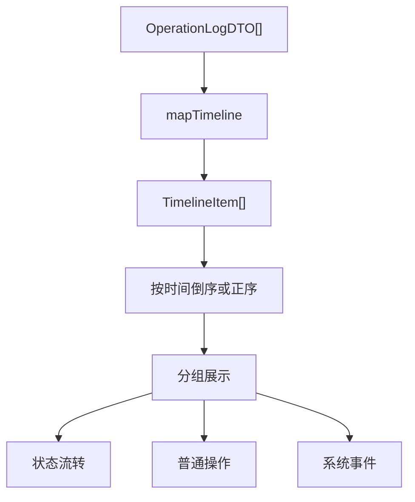
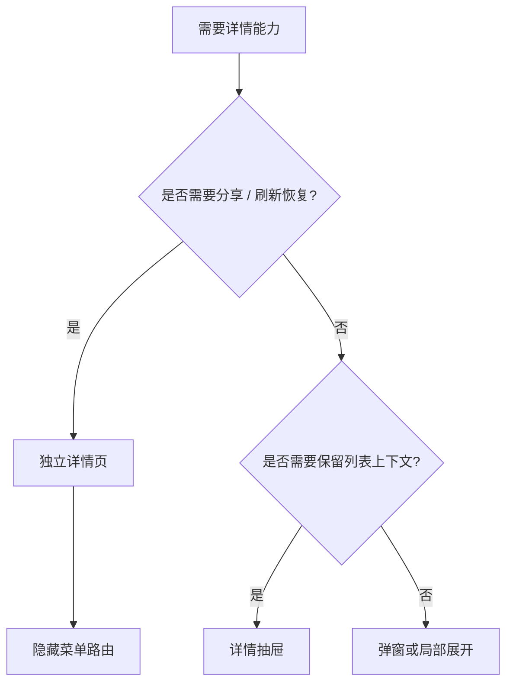
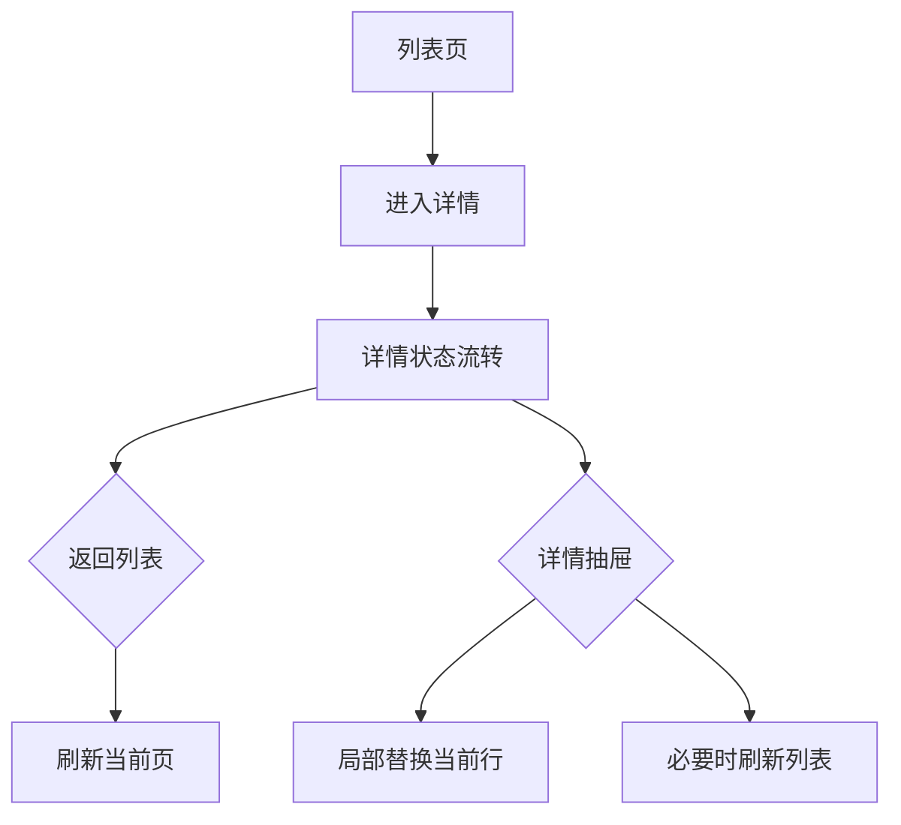
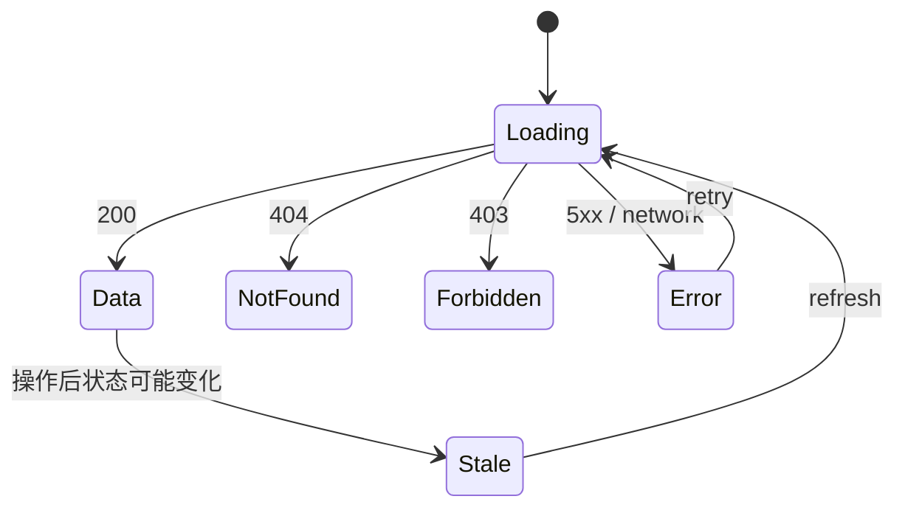

# Vue Admin 详情页、状态流转与操作记录闭环实战

## 这个页面解决什么

列表页和表单页做完后，真实后台项目很快会遇到第三种高频页面：详情页。

用户管理有用户详情，角色管理有角色详情，订单管理有订单详情，审批有审批详情，导出任务有任务详情，审计中心有日志详情。详情页看起来只是“展示更多字段”，但真实项目里它经常承载这些能力：

- 展示主信息、关联信息、附件、备注和操作记录。
- 根据状态展示不同操作按钮。
- 控制哪些字段可见、哪些按钮可点。
- 展示状态流转和审批进度。
- 处理刷新后状态变化、操作后局部刷新。
- 展示操作人、操作时间、变更内容和 traceId。
- 把详情页、详情抽屉、独立页面和隐藏路由区分清楚。

这一页把详情页拆成四条线：**详情数据、状态流转、操作权限、操作记录**。

## 适合谁看

- 已经会做列表和表单，但详情页经常写成一堆字段堆叠的人。
- 正在做订单、审批、用户、角色、菜单、组织、导出任务、审计日志等后台模块的人。
- 想理解“状态不同，按钮不同，记录不同，权限不同”的页面怎么设计的人。
- 经常遇到详情页刷新数据不一致、按钮状态错、操作记录查不到的人。
- 已经看完 [Vue Admin 表单弹窗、新增编辑与校验闭环实战](/vue/admin-form-modal-crud)，准备补更完整业务闭环的人。

## 详情页心智模型

详情页不是“大号表单”。它是一个围绕业务对象的阅读、判断和操作界面。



这张图说明：

1. 详情页展示的是 `DetailViewModel`，不要直接展示后端 DTO。
2. 状态、操作按钮和操作记录都来自同一个业务对象。
3. 操作成功后，优先重新拉详情，保证状态、权限和记录一致。

## 最终目标

完成这一页后，你应该能做出这样的详情页：

| 能力 | 通过标准 |
| --- | --- |
| 数据边界清楚 | `DetailDTO`、`DetailViewModel`、`OperationLog` 分清 |
| 信息层级清楚 | 主信息、关联信息、状态、附件、记录分区展示 |
| 状态流转明确 | 有状态机图，不靠按钮临时判断 |
| 操作权限明确 | 按钮是否展示、是否禁用、是否二次确认有规则 |
| 操作后刷新稳定 | 操作成功后详情、记录、列表都能同步 |
| 操作记录完整 | 操作人、动作、前后状态、时间、原因、traceId 可见 |
| 详情路由清楚 | 独立详情页、抽屉详情、隐藏菜单有选择标准 |
| 错误状态完整 | loading、notFound、forbidden、error、stale 分清 |
| 审计意识明确 | 高风险动作有审计日志和变更说明 |
| 移动端可读 | 详情区域、操作按钮和时间线在窄屏下可读 |

## 详情页类型边界

详情页常见类型：



示例：

```ts
export interface OrderDetailDTO {
  id: string
  order_no: string
  status: 'pending_pay' | 'paid' | 'shipped' | 'closed'
  customer_name: string
  amount_cent: number
  created_at: string
  updated_at: string
  can_cancel: boolean
  can_refund: boolean
  logs: OperationLogDTO[]
}

export interface OrderDetailViewModel {
  id: string
  orderNo: string
  status: OrderStatus
  statusText: string
  statusTone: 'warning' | 'success' | 'danger' | 'default'
  customerName: string
  amountText: string
  createdAtText: string
  updatedAtText: string
  actions: DetailAction[]
  timeline: TimelineItem[]
}

export interface DetailAction {
  code: 'cancel' | 'refund' | 'ship' | 'close'
  text: string
  danger?: boolean
  disabled?: boolean
  disabledReason?: string
  confirmText?: string
}

export interface TimelineItem {
  id: string
  title: string
  description: string
  operator: string
  timeText: string
  traceId?: string
}
```

这些类型不要混用：

| 类型 | 面向谁 | 说明 |
| --- | --- | --- |
| `DetailDTO` | 后端接口 | 原始字段，不直接给模板 |
| `DetailViewModel` | 页面展示 | 状态文案、金额、日期、权限动作都准备好 |
| `DetailAction` | 操作按钮区 | 决定展示、禁用、确认文案 |
| `TimelineItem` | 操作记录 | 统一时间线展示 |
| `OperationPayload` | 操作接口 | 取消、审核、驳回等动作的提交参数 |

## 推荐目录

以订单详情为例：

```text
src/features/orders/
  pages/
    OrderListPage.vue
    OrderDetailPage.vue
  components/
    OrderDetailHeader.vue
    OrderDetailSections.vue
    OrderActionBar.vue
    OrderOperationTimeline.vue
  composables/
    useOrderDetail.ts
    useOrderActions.ts
  services/
    orderApi.ts
    orderMapper.ts
  types/
    order.dto.ts
    order.model.ts
```

职责分工：

| 文件 | 职责 |
| --- | --- |
| `OrderDetailPage.vue` | 读取路由、组装详情区域 |
| `OrderDetailHeader.vue` | 展示标题、状态、关键摘要 |
| `OrderDetailSections.vue` | 展示主信息、客户、金额、附件等分区 |
| `OrderActionBar.vue` | 展示当前可操作按钮 |
| `OrderOperationTimeline.vue` | 展示状态流转和操作记录 |
| `useOrderDetail.ts` | 拉详情、刷新、错误状态 |
| `useOrderActions.ts` | 操作确认、提交、刷新 |
| `orderMapper.ts` | DTO 到 ViewModel、操作记录转换 |

## 详情页布局

详情页要先帮助用户判断“这是什么、当前什么状态、我能做什么”。



建议顺序：

1. 标题、编号、状态和关键操作放顶部。
2. 最重要的 4 到 6 个字段放摘要区。
3. 复杂字段用分区折叠或 tabs。
4. 操作记录放底部或右侧，不要打断主要阅读。
5. 高风险提示放在操作前，而不是操作后才提醒。

## 状态机怎么设计

如果详情页有状态，就不要只在按钮里写 `if status === xxx`。先画状态机。



状态机要回答：

| 问题 | 示例 |
| --- | --- |
| 有哪些状态 | 待审核、已通过、处理中、已完成、已取消 |
| 哪些动作能改变状态 | approve、reject、cancel |
| 谁能操作 | 管理员、审核员、负责人 |
| 操作是否需要原因 | 驳回、取消通常需要原因 |
| 操作后刷新什么 | 详情、时间线、列表状态 |
| 后端是否兜底 | 必须由后端校验状态流转合法性 |

前端状态机只服务展示和交互，后端状态机才是最终可信来源。

## 操作按钮怎么生成

详情页操作按钮不要散落在模板里。推荐从 `DetailViewModel.actions` 生成。

```ts
function createOrderActions(detail: OrderDetailDTO, permissions: PermissionContext): DetailAction[] {
  return [
    {
      code: 'cancel',
      text: '取消订单',
      danger: true,
      disabled: !detail.can_cancel || !permissions.can('order:cancel'),
      disabledReason: !detail.can_cancel ? '当前状态不能取消' : undefined,
      confirmText: '取消后不可恢复，确认继续？'
    },
    {
      code: 'refund',
      text: '发起退款',
      disabled: !detail.can_refund || !permissions.can('order:refund'),
      disabledReason: !detail.can_refund ? '当前订单不支持退款' : undefined
    }
  ]
}
```

按钮分三类：

| 类型 | 示例 | 规则 |
| --- | --- | --- |
| 普通操作 | 编辑备注、刷新 | 可直接执行或轻确认 |
| 状态流转 | 审核、驳回、取消、完成 | 必须校验状态和权限 |
| 高风险操作 | 删除、退款、重置、关闭 | 二次确认、原因、审计日志 |

不要只隐藏按钮。对于“有权限但当前状态不能操作”的情况，禁用并展示原因更利于用户理解。

## 操作提交流程



操作成功后建议：

- 重新拉详情。
- 刷新操作记录。
- 如果来自列表页，返回列表时刷新当前行。
- 对高风险操作保留 traceId。

不要只在前端把状态改掉。状态流转通常影响权限、按钮、列表、统计和下游流程。

## useDetail 的基础实现

```ts
import { computed, ref } from 'vue'

export function useOrderDetail(orderId: Ref<string>) {
  const detail = ref<OrderDetailViewModel | null>(null)
  const loading = ref(false)
  const error = ref<AppError | null>(null)
  const notFound = ref(false)
  const forbidden = ref(false)
  const version = ref(0)

  const status = computed(() => detail.value?.status)
  const actions = computed(() => detail.value?.actions ?? [])
  const timeline = computed(() => detail.value?.timeline ?? [])

  async function load() {
    const currentVersion = ++version.value
    loading.value = true
    error.value = null
    notFound.value = false
    forbidden.value = false

    try {
      const dto = await fetchOrderDetail(orderId.value)
      if (currentVersion !== version.value) return
      detail.value = mapOrderDetail(dto)
    } catch (err) {
      if (currentVersion !== version.value) return
      const appError = normalizeError(err)
      notFound.value = appError.status === 404
      forbidden.value = appError.status === 403
      error.value = appError
    } finally {
      if (currentVersion === version.value) {
        loading.value = false
      }
    }
  }

  return {
    detail,
    status,
    actions,
    timeline,
    loading,
    error,
    notFound,
    forbidden,
    load
  }
}
```

这里仍然使用版本号避免旧请求覆盖新请求。详情页常见于快速切换不同记录、浏览器前进后退、标签页缓存恢复，这个保护很有必要。

## 操作记录和审计日志

操作记录给用户看，审计日志给系统和团队追溯。两者相关但不完全一样。



区别：

| 类型 | 面向谁 | 内容 |
| --- | --- | --- |
| 操作记录 | 业务用户 | 谁在什么时候做了什么，状态怎么变 |
| 审计日志 | 管理员、合规、研发 | 请求参数、前后值、IP、设备、traceId、权限上下文 |

详情页时间线建议展示：

| 字段 | 说明 |
| --- | --- |
| 操作标题 | 例如“审核通过”“取消订单” |
| 操作人 | 用户名、角色或系统任务 |
| 操作时间 | 本地化展示 |
| 前后状态 | 从什么状态到什么状态 |
| 操作原因 | 驳回、取消、退款等必须显示 |
| traceId | 出问题时能关联后端日志 |

## 时间线怎么展示



示例转换：

```ts
export function mapTimeline(logs: OperationLogDTO[]): TimelineItem[] {
  return logs.map((log) => ({
    id: log.id,
    title: log.action_name,
    description: createLogDescription(log),
    operator: log.operator_name || '系统',
    timeText: formatDateTime(log.created_at),
    traceId: log.trace_id
  }))
}
```

展示规则：

| 场景 | 建议 |
| --- | --- |
| 状态流转少 | 用时间线直接展示 |
| 操作记录很多 | 默认展示最近 10 条，支持展开 |
| 审计字段敏感 | 只展示摘要，详情放审计中心 |
| 系统自动任务 | 操作人显示“系统”，说明触发原因 |
| traceId 太长 | 支持复制，不强行完整展示 |

## 路由和入口

详情页有三种常见形态：

| 形态 | 路由 | 适合场景 |
| --- | --- | --- |
| 独立详情页 | `/orders/:id` | 内容多、可分享、可刷新恢复 |
| 详情抽屉 | 当前列表页内打开 | 内容少、需要保留列表上下文 |
| 隐藏菜单路由 | 有路由但不出现在菜单 | 后台常见详情页、编辑页 |

选择建议：



后台项目里，详情页通常需要真实路由，但不一定出现在菜单里。这样刷新、复制链接、权限校验和面包屑都更清楚。

## 与列表页同步

从列表进入详情，详情操作后怎么同步列表？



建议：

| 场景 | 策略 |
| --- | --- |
| 独立详情页操作成功 | 返回列表时刷新当前页 |
| 详情抽屉操作成功 | 可以局部替换当前行 |
| 状态影响排序或筛选 | 刷新列表 |
| 状态影响权限按钮 | 刷新详情和列表 |
| 操作影响统计数字 | 刷新统计卡片或重新查询 |

不要让列表和详情各自维护一份状态长期不一致。初学阶段优先重新请求。

## 错误状态

详情页错误状态比列表页更复杂。



状态说明：

| 状态 | 页面表现 |
| --- | --- |
| `loading` | 骨架屏或详情加载中 |
| `notFound` | 记录不存在、已删除、无效链接 |
| `forbidden` | 没有查看权限 |
| `error` | 网络或系统异常，提供重试和 traceId |
| `stale` | 操作成功后需要刷新详情 |
| `data` | 正常展示 |

不要把 404、403、500 都显示成“加载失败”。用户需要知道是没权限、记录不存在，还是系统异常。

## 权限和数据范围

详情页权限至少分三层：

| 权限 | 示例 |
| --- | --- |
| 页面访问权限 | 能否打开详情页 |
| 字段可见权限 | 能否查看手机号、金额、成本、审批意见 |
| 操作权限 | 能否审核、取消、退款、删除 |

还要考虑数据范围：

- 用户能看到列表，不一定能看详情全部字段。
- 用户能看详情，不一定能操作。
- 用户能操作，不一定能操作所有状态。
- 敏感字段可能需要脱敏或二次鉴权。

详情接口最好返回当前用户上下文下的可见字段和可用操作，而不是让前端自己猜。

## 移动端和窄屏

详情页在移动端容易变成很长的字段列表。建议：

| 区域 | 窄屏策略 |
| --- | --- |
| 标题区 | 状态和主操作保留，次要操作收进更多菜单 |
| 摘要区 | 关键字段两列变单列 |
| 分区内容 | 使用折叠面板或 tabs |
| 时间线 | 每条记录减少装饰，保留操作人和时间 |
| 底部操作 | 固定底部操作栏，但不要遮挡内容 |

固定尺寸元素，例如状态点、头像、复制按钮、操作图标，要设置稳定宽高和不可压缩行为，避免被挤变形。

## 常见问题和解决方案

### 问题 1：详情页按钮状态和后端不一致

现象：

- 前端显示“取消订单”按钮。
- 点击后后端返回“当前状态不可取消”。

根因：

前端只根据本地状态判断，没有使用后端返回的可用操作。

解决：

- 详情接口返回 `can_cancel` 或 `available_actions`。
- 前端展示禁用原因。
- 后端仍然做最终状态机校验。
- 操作失败后刷新详情。

### 问题 2：操作成功后时间线没更新

根因：

操作成功后只改了详情状态，没有刷新操作记录。

解决：

- 操作成功后重新拉详情或时间线。
- 如果时间线独立接口，统一封装 `refreshAfterAction()`。
- 操作记录写入失败要暴露给后端监控，不能静默丢。

### 问题 3：详情页刷新 404

根因：

详情页是隐藏路由，但没有注册真实路由，或服务端没有 fallback。

解决：

- 动态路由恢复后再进入详情。
- 隐藏菜单路由也要注册到 router。
- 部署层配置 SPA fallback。
- 无权限和未注册路由要区分。

### 问题 4：详情抽屉关闭后列表状态错乱

根因：

抽屉内操作改变了状态，但列表行没有同步。

解决：

- 操作成功后通知列表刷新。
- 如果局部更新，必须使用同一套 mapper。
- 状态影响排序或筛选时，不做局部更新，直接刷新列表。

### 问题 5：操作记录看不懂

现象：

- 时间线只有“update”“save”“submit”。
- 用户不知道谁改了什么。

解决：

- 后端记录业务动作名。
- 展示前后状态、操作原因、操作人、时间。
- 高风险动作支持查看变更摘要。

### 问题 6：字段权限泄露

根因：

前端隐藏字段，但后端详情接口仍返回了敏感数据。

解决：

- 后端按权限裁剪字段。
- 前端只做展示层控制。
- 审计日志记录敏感字段查看行为。

### 问题 7：状态流转原因缺失

现象：

- 订单被取消、审批被驳回，但详情页看不到原因。

解决：

- 高风险或负向动作必须要求填写原因。
- 原因写入操作记录。
- 时间线展示原因摘要。

## 交付检查清单

| 检查项 | 通过标准 |
| --- | --- |
| 类型边界 | DetailDTO、DetailViewModel、TimelineItem、Action 分清 |
| 布局层级 | 标题、摘要、分区、时间线、操作区清楚 |
| 状态机 | 有状态流转图和合法动作说明 |
| 操作按钮 | 展示、禁用、确认、原因和权限规则明确 |
| 操作刷新 | 操作成功后详情和时间线同步 |
| 操作记录 | 操作人、动作、前后状态、时间、原因、traceId 完整 |
| 路由 | 独立详情页、详情抽屉、隐藏路由选择清楚 |
| 错误状态 | loading、404、403、500、stale 分清 |
| 权限 | 页面、字段、操作、数据范围权限分清 |
| 审计 | 高风险动作有审计日志 |
| 移动端 | 窄屏可读，操作按钮不遮挡内容 |
| 文档 | README 写清详情页数据流、状态流转和操作记录 |

## 最小练习

用订单详情或用户详情做一个练习：

1. 定义 `DetailDTO`、`DetailViewModel`、`TimelineItem`、`DetailAction`。
2. 写 `mapDetail` 和 `mapTimeline`。
3. 画出状态机。
4. 根据状态和权限生成操作按钮。
5. 实现 `useDetail`，处理 loading、404、403、error。
6. 实现一个状态流转动作，例如取消、审核、启用。
7. 操作成功后刷新详情和时间线。
8. 时间线展示操作人、时间、原因和 traceId。
9. 从列表进入详情后，返回列表能刷新当前页。
10. 用 390px 宽度检查标题、状态、操作按钮和时间线。

## 和其他文档怎么配合

| 你要做什么 | 继续看 |
| --- | --- |
| 先做好列表页 | [Vue Admin 列表、搜索、分页与表格闭环实战](/vue/admin-list-search-table) |
| 先做好新增编辑 | [Vue Admin 表单弹窗、新增编辑与校验闭环实战](/vue/admin-form-modal-crud) |
| 处理附件、导入导出和异步任务 | [Vue Admin 文件上传、下载、导入导出与异步任务闭环实战](/vue/admin-file-import-export) |
| 做审批流和待办处理 | [Vue Admin 审批流、状态机、待办与审计闭环实战](/vue/admin-approval-workflow) |
| 做完整用户模块 | [Vue Admin 用户模块实现手册](/vue/admin-user-module) |
| 处理权限按钮 | [Vue Admin 权限路由闭环实战](/vue/admin-permission-route-flow) |
| 做角色授权记录 | [Vue Admin 角色权限模块实现手册](/vue/admin-permission-module) |
| 处理请求错误 | [Vue Admin 请求封装与错误处理闭环手册](/vue/admin-request-error-handling) |
| 排查真实问题 | [Vue Admin 请求、权限与数据问题排查专题](/projects/issues-vue-admin-request) |

## 下一步学习

详情页、状态流转和操作记录闭环完成后，继续看 [Vue Admin 文件上传、下载、导入导出与异步任务闭环实战](/vue/admin-file-import-export)，把附件、模板导入、异步导出、任务轮询和审计记录补完整。  
如果你已经掌握文件任务闭环，继续看 [Vue Admin 审批流、状态机、待办与审计闭环实战](/vue/admin-approval-workflow)，把详情页里的状态机、审批进度、同意驳回和审计时间线做成真实流程。  
如果你已经掌握审批流闭环，继续看 [Vue Admin 用户模块实现手册](/vue/admin-user-module)，把列表、表单、详情、状态、文件任务、操作记录和权限按钮串成完整模块。  
如果你已经完成用户模块，继续看 [Vue Admin 权限路由闭环实战](/vue/admin-permission-route-flow)，把页面权限、按钮权限、接口权限和刷新恢复补完整。
