# Vue Admin 文件上传、下载、导入导出与异步任务闭环实战

后台项目里，文件能力通常不是一个孤立按钮，而是一整套业务链路：

- 上传附件后，要知道文件属于谁、能不能下载、什么时候清理。
- 下载文件时，要区分“真实文件流”和“接口返回的 JSON 错误”。
- 导入 Excel 时，要先下载模板、上传文件、解析校验、预览错误、确认提交。
- 导出数据时，要按当前搜索条件和数据权限生成任务，不能让浏览器一直等。
- 所有文件操作都要有权限、审计、进度、失败重试和问题排查证据。

这一页把 Vue Admin 项目里最常见的“上传、下载、导入、导出、异步任务”串成一个可复用模式。它不是文件中心项目案例的替代，而是站在前端 Vue Admin 模块视角，讲清楚页面、请求封装、任务状态、权限按钮和错误处理应该怎么配合。

## 适合谁看

- 已经完成 [Vue Admin 列表、搜索、分页与表格闭环实战](/vue/admin-list-search-table) 的人。
- 已经完成 [Vue Admin 表单弹窗、新增编辑与校验闭环实战](/vue/admin-form-modal-crud)，准备给表单加附件上传的人。
- 正在做用户导入、商品导入、客户导入、订单导出、报表导出、合同附件、发票附件的人。
- 经常遇到上传没进度、下载乱码、导出超时、导入错误看不懂、权限范围不一致的人。

## 这一页最终要做到什么

完成本页后，你应该能独立设计一个后台文件任务模块：

| 能力 | 最终效果 | 不合格表现 |
| --- | --- | --- |
| 上传 | 能限制类型和大小，显示进度，取消上传，拿到文件 ID | 只把文件丢给接口，不知道文件归属 |
| 下载 | 能正确处理文件流、文件名、JSON 错误和 403 | 只写 `window.open(url)`，出错时下载一个错误文件 |
| 导入 | 有模板下载、上传解析、行级校验、错误报告和确认提交 | 上传后直接入库，错了只能找后端看日志 |
| 导出 | 大数据量走异步任务，能轮询进度、下载结果、失败重试 | 点导出后浏览器一直转圈直到超时 |
| 权限 | 页面按钮、接口权限、数据范围和审计记录一致 | 前端能点，后端拒绝，或者导出越权数据 |
| 排障 | 有 traceId、taskId、fileId、请求参数和错误原因 | 只知道“失败了”，不知道失败在哪一步 |

## 先建立心智模型

文件任务不是“调用一个接口”，而是四条链路组合在一起：

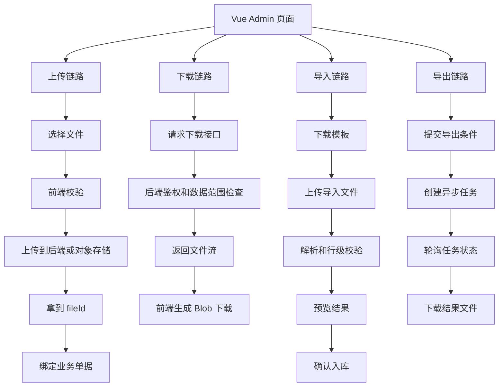

一个新手最容易犯的错误，是把这四条链路混在一个按钮里。正确做法是先拆边界：

| 链路 | 前端关注 | 后端关注 |
| --- | --- | --- |
| 上传 | 文件选择、校验、进度、取消、回显 | 存储、病毒扫描、大小限制、临时文件清理 |
| 下载 | Blob、文件名、错误 JSON、权限提示 | 鉴权、数据范围、文件存在性、审计 |
| 导入 | 模板、上传、预览、错误行、确认提交 | 解析、校验、事务、幂等、错误报告 |
| 导出 | 查询条件快照、任务进度、下载入口 | 异步任务、数据权限、生成文件、过期清理 |

## 推荐目录结构

以“用户导入导出”为例，不要把文件逻辑全部写在页面里：

```txt
src/
  features/
    users/
      api/
        user-file.api.ts
        user.api.ts
      components/
        UserImportDrawer.vue
        UserExportTaskDrawer.vue
        UserAttachmentUpload.vue
      composables/
        useFileDownload.ts
        useImportTask.ts
        useExportTask.ts
      types/
        user-file.types.ts
      views/
        UserListPage.vue
  shared/
    api/
      http.ts
      file.ts
    utils/
      download.ts
      file-validate.ts
```

目录的核心原则：

- `api` 只负责请求，不做页面状态。
- `components` 只负责局部 UI，比如导入抽屉、任务抽屉、上传组件。
- `composables` 负责可复用流程，比如下载 Blob、轮询任务、取消上传。
- `types` 统一约束前后端字段，避免每个页面自己猜字段。
- `shared` 放跨业务模块可复用的文件工具。

## 数据模型先设计清楚

文件任务最怕字段不清晰。建议先把几个核心类型定下来。

```ts
export type FileBizType =
  | 'USER_IMPORT'
  | 'USER_EXPORT'
  | 'CONTRACT_ATTACHMENT'
  | 'INVOICE_ATTACHMENT'

export type UploadStatus =
  | 'idle'
  | 'validating'
  | 'uploading'
  | 'success'
  | 'failed'
  | 'canceled'

export interface UploadFileState {
  uid: string
  name: string
  size: number
  type: string
  status: UploadStatus
  progress: number
  fileId?: string
  url?: string
  errorMessage?: string
}

export interface FileMetaDTO {
  id: string
  bizType: FileBizType
  originalName: string
  storageKey: string
  contentType: string
  size: number
  ownerId: string
  createdAt: string
  expireAt?: string
}
```

导入和导出不要共用一个模糊的 `Task`。它们看起来都叫任务，但业务字段不同：

```ts
export type TaskStatus =
  | 'PENDING'
  | 'RUNNING'
  | 'SUCCESS'
  | 'FAILED'
  | 'CANCELED'
  | 'EXPIRED'

export interface ImportTaskDTO {
  id: string
  fileId: string
  fileName: string
  status: TaskStatus
  totalRows: number
  validRows: number
  invalidRows: number
  successRows: number
  failedRows: number
  errorReportFileId?: string
  createdAt: string
  finishedAt?: string
  traceId?: string
}

export interface ExportTaskDTO {
  id: string
  name: string
  status: TaskStatus
  progress: number
  querySnapshot: Record<string, unknown>
  resultFileId?: string
  errorMessage?: string
  createdAt: string
  finishedAt?: string
  traceId?: string
}
```

前端页面里可以再转换成更适合展示的 ViewModel：

```ts
export interface TaskViewModel {
  id: string
  title: string
  statusText: string
  statusType: 'default' | 'info' | 'success' | 'warning' | 'error'
  progress: number
  canDownload: boolean
  canRetry: boolean
  message: string
}
```

为什么要有 ViewModel？

- 后端字段是接口契约，不能为了页面展示随便改。
- 页面需要中文文案、颜色、按钮可用性、进度展示。
- 状态显示逻辑集中后，表格、抽屉、详情页可以复用。

## 上传链路：从选择文件到拿到 fileId

上传不是 `input type="file"` 加一个 `POST` 就结束。完整链路如下：

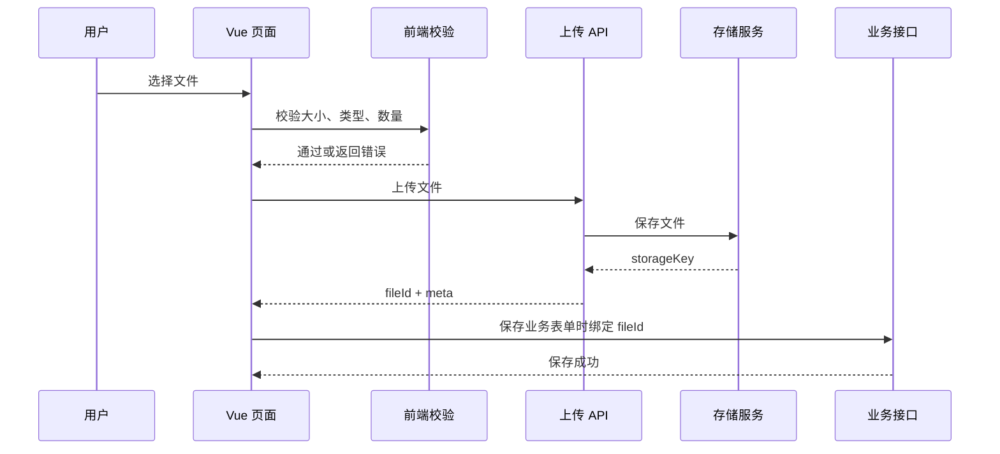

### 上传方式怎么选

| 方式 | 说明 | 适合场景 | 注意点 |
| --- | --- | --- | --- |
| 后端代理上传 | 前端把文件传给业务后端，后端再存储 | 小文件、权限强、实现简单 | 后端带宽压力大 |
| 预签名 URL 上传 | 前端先拿签名，再直传对象存储 | 大文件、图片、附件中心 | 签名过期、回调确认、跨域 |
| 分片上传 | 文件切片后逐片上传，最后合并 | 大文件、弱网、视频 | 状态复杂，先不要过早引入 |

后台管理系统的普通 Excel 导入、合同附件、图片附件，一开始建议用“后端代理上传”。等文件大、并发高、成本明显后，再演进到预签名 URL。

### 前端校验要先挡住低级错误

上传前至少校验：

- 文件数量：单文件还是多文件。
- 文件大小：比如 Excel 导入限制 10MB，附件限制 50MB。
- 文件类型：不要只看扩展名，也要看 MIME。
- 文件名：太长、特殊字符、重复文件名是否允许。
- 业务状态：单据已审批后是否还能上传附件。

```ts
interface FileRule {
  maxSize: number
  acceptTypes: string[]
  acceptExtensions: string[]
}

export function validateFile(file: File, rule: FileRule): string | null {
  if (file.size > rule.maxSize) {
    return `文件大小不能超过 ${Math.floor(rule.maxSize / 1024 / 1024)}MB`
  }

  const extension = file.name.split('.').pop()?.toLowerCase() ?? ''

  if (!rule.acceptExtensions.includes(extension)) {
    return `只支持 ${rule.acceptExtensions.join('、')} 格式`
  }

  if (file.type && !rule.acceptTypes.includes(file.type)) {
    return '文件类型不符合要求，请重新选择'
  }

  return null
}
```

注意：前端校验只提升体验，不能替代后端校验。后端必须重新检查文件大小、类型、业务权限和数据归属。

### 上传组件的状态不要只用 boolean

新手常写：

```ts
const loading = ref(false)
```

这会导致页面分不清“正在校验、正在上传、上传成功、上传失败、已取消”。建议用明确状态：

```ts
const uploadFile = ref<UploadFileState | null>(null)

const canSubmit = computed(() => {
  return uploadFile.value?.status === 'success' && Boolean(uploadFile.value.fileId)
})

const uploadText = computed(() => {
  const status = uploadFile.value?.status

  if (status === 'validating') return '正在校验文件'
  if (status === 'uploading') return `正在上传 ${uploadFile.value?.progress ?? 0}%`
  if (status === 'success') return '上传成功'
  if (status === 'failed') return uploadFile.value?.errorMessage ?? '上传失败'
  if (status === 'canceled') return '已取消上传'

  return '请选择文件'
})
```

### 使用 AbortController 支持取消上传

如果用户选错文件，应该允许取消。不要让旧上传完成后覆盖新文件状态。

```ts
import { ref } from 'vue'

const uploadController = ref<AbortController | null>(null)

async function upload(file: File) {
  uploadController.value?.abort()
  uploadController.value = new AbortController()

  const formData = new FormData()
  formData.append('file', file)
  formData.append('bizType', 'USER_IMPORT')

  try {
    uploadFile.value = {
      uid: crypto.randomUUID(),
      name: file.name,
      size: file.size,
      type: file.type,
      status: 'uploading',
      progress: 0
    }

    const result = await uploadUserFile(formData, {
      signal: uploadController.value.signal,
      onProgress: progress => {
        if (uploadFile.value) {
          uploadFile.value.progress = progress
        }
      }
    })

    if (uploadFile.value) {
      uploadFile.value.status = 'success'
      uploadFile.value.progress = 100
      uploadFile.value.fileId = result.id
      uploadFile.value.url = result.url
    }
  } catch (error) {
    if (uploadController.value?.signal.aborted) {
      if (uploadFile.value) uploadFile.value.status = 'canceled'
      return
    }

    if (uploadFile.value) {
      uploadFile.value.status = 'failed'
      uploadFile.value.errorMessage = normalizeErrorMessage(error)
    }
  }
}

function cancelUpload() {
  uploadController.value?.abort()
}
```

如果项目使用 Axios，上传进度可以通过 `onUploadProgress` 做；如果使用原生 `fetch`，上传进度支持不如 Axios 直接，通常需要 XMLHttpRequest 或封装库。

## 下载链路：不要把错误 JSON 当文件下载

下载最常见的问题不是“不会下载”，而是接口失败时仍然生成了一个文件。

错误示例：

```ts
async function downloadFile(fileId: string) {
  const response = await fetch(`/api/files/${fileId}/download`)
  const blob = await response.blob()
  saveAs(blob, 'download.xlsx')
}
```

如果后端返回的是：

```json
{ "code": 403, "message": "没有下载权限" }
```

前端也会把它下载成 `download.xlsx`，用户打开后才发现乱码。

正确链路应该先判断状态码和 `content-type`：

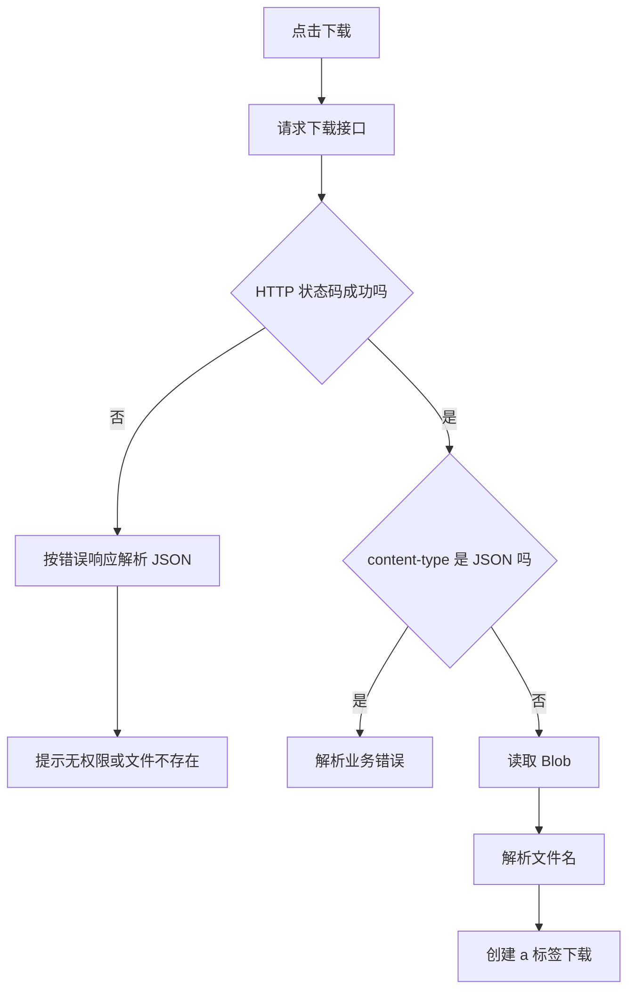

### 通用下载工具

```ts
function getFileNameFromDisposition(disposition: string | null): string | null {
  if (!disposition) return null

  const utf8Match = disposition.match(/filename\*=UTF-8''([^;]+)/)
  if (utf8Match?.[1]) {
    return decodeURIComponent(utf8Match[1])
  }

  const normalMatch = disposition.match(/filename="?([^"]+)"?/)
  return normalMatch?.[1] ? decodeURIComponent(normalMatch[1]) : null
}

export async function downloadByResponse(response: Response, fallbackName: string) {
  const contentType = response.headers.get('content-type') ?? ''

  if (!response.ok || contentType.includes('application/json')) {
    const errorBody = await response.json().catch(() => null)
    throw new Error(errorBody?.message ?? `下载失败，状态码 ${response.status}`)
  }

  const blob = await response.blob()
  const fileName =
    getFileNameFromDisposition(response.headers.get('content-disposition')) ??
    fallbackName

  const url = URL.createObjectURL(blob)
  const link = document.createElement('a')

  link.href = url
  link.download = fileName
  link.click()

  URL.revokeObjectURL(url)
}
```

下载时要让后端暴露 `content-disposition`：

```txt
Access-Control-Expose-Headers: Content-Disposition, X-Trace-Id
Content-Disposition: attachment; filename*=UTF-8''users.xlsx
```

如果没有 `Access-Control-Expose-Headers`，浏览器跨域时读不到文件名。

## 导入链路：模板、解析、预览、确认提交

导入不要做成“上传即入库”。更稳的流程是：

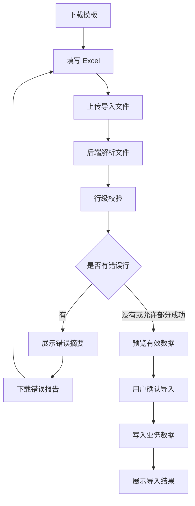

### 为什么必须有模板下载

模板不是“给用户一个 Excel”，而是前后端字段契约：

| 模板列 | 业务含义 | 必填 | 校验规则 | 示例 |
| --- | --- | --- | --- | --- |
| 用户名 | 登录账号或员工账号 | 是 | 3 到 32 位，不能重复 | zhangsan |
| 姓名 | 员工姓名 | 是 | 不能包含特殊控制字符 | 张三 |
| 手机号 | 登录或通知手机号 | 否 | 中国大陆手机号格式 | 13800000000 |
| 部门编码 | 归属部门 | 是 | 必须存在且在当前数据权限内 | RD-001 |
| 角色编码 | 初始角色 | 否 | 必须存在且当前用户可分配 | user_admin |
| 启用状态 | 是否启用 | 是 | 启用、停用 | 启用 |

实际项目里，模板列名改动一定要同步：

- 后端解析字段映射。
- 前端导入说明。
- 错误报告字段。
- 测试样例文件。
- 用户操作手册。

### 导入任务接口设计

建议拆成四个接口：

| 接口 | 用途 | 备注 |
| --- | --- | --- |
| `GET /users/import/template` | 下载模板 | 返回文件流 |
| `POST /users/import/parse` | 上传并解析文件 | 返回 taskId 和校验摘要 |
| `GET /users/import/tasks/:id` | 查询导入任务 | 用于轮询进度和结果 |
| `POST /users/import/tasks/:id/commit` | 确认导入 | 校验通过后才写入业务表 |

不要一个 `POST /users/import` 同时做上传、解析、校验、入库。这样失败时很难定位，也不方便预览和撤销。

### 导入任务状态机

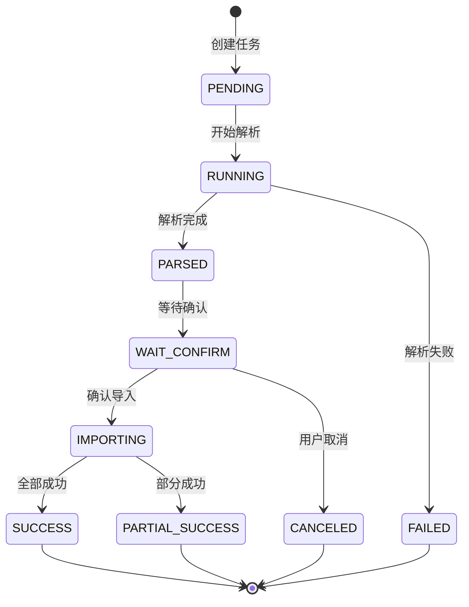

对应前端按钮：

| 状态 | 页面文案 | 可用按钮 |
| --- | --- | --- |
| `PENDING` | 等待解析 | 关闭 |
| `RUNNING` | 正在解析 | 取消、刷新 |
| `PARSED` | 解析完成 | 查看预览 |
| `WAIT_CONFIRM` | 等待确认导入 | 确认导入、下载错误报告、取消 |
| `IMPORTING` | 正在写入数据 | 刷新 |
| `SUCCESS` | 导入成功 | 查看结果、继续导入 |
| `PARTIAL_SUCCESS` | 部分成功 | 下载错误报告、继续导入 |
| `FAILED` | 导入失败 | 下载错误报告、重新上传 |

### 行级错误怎么展示

错误不要只弹一个“导入失败”。导入失败的最小可读信息应该包括：

| 行号 | 字段 | 当前值 | 错误原因 | 修复建议 |
| ---: | --- | --- | --- | --- |
| 2 | 用户名 | zhangsan | 用户名已存在 | 换一个账号或更新已有用户 |
| 5 | 部门编码 | RD-404 | 部门不存在 | 到组织架构中确认部门编码 |
| 8 | 角色编码 | admin | 当前账号无权分配该角色 | 联系管理员授权或删除该列 |

前端可以只展示前 20 条错误，完整错误放在错误报告里下载。

```ts
export interface ImportPreviewRow {
  rowNumber: number
  raw: Record<string, unknown>
  normalized: Record<string, unknown>
  valid: boolean
  errors: Array<{
    field: string
    value: string
    message: string
    suggestion: string
  }>
}
```

### 导入抽屉的页面结构

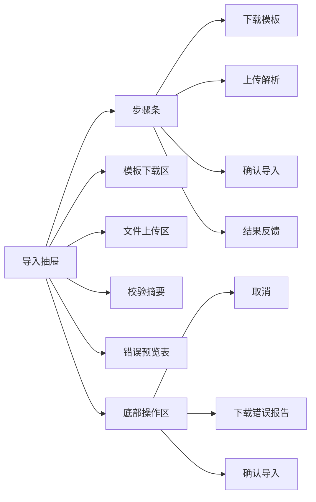

页面交互建议：

- 抽屉打开后默认展示模板说明和上传区。
- 上传成功后自动进入解析中状态。
- 解析完成后展示总行数、有效行、错误行。
- 有错误行时，优先展示错误，不要直接允许导入。
- 如果业务允许“部分导入”，按钮文案要明确写成“导入有效数据”。
- 确认导入前要二次确认，尤其是会创建大量数据时。

## 导出链路：大数据量必须异步任务化

列表页导出常见两种方式：

| 方式 | 适合场景 | 不适合场景 |
| --- | --- | --- |
| 同步导出 | 少量数据、生成很快、无复杂权限 | 上万行、跨表汇总、复杂报表 |
| 异步导出 | 大数据量、复杂查询、报表生成、需要审计 | 非常小的即时文件 |

后台项目建议把“业务数据导出”默认设计成异步任务，哪怕第一版后端内部很快返回，也先保留任务模型。

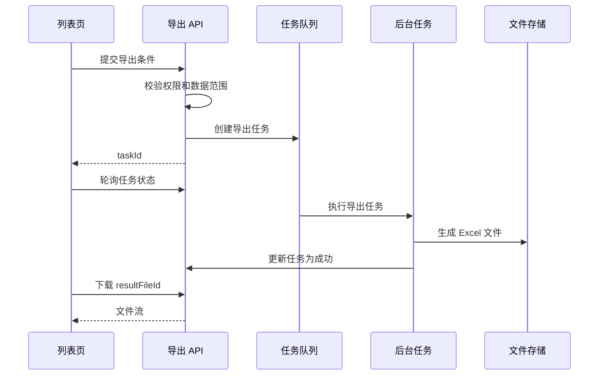

### 导出请求必须保存查询条件快照

用户点击导出时，后端应该保存当时的搜索条件和数据范围，而不是任务执行时再读页面状态。

```ts
export interface ExportUsersParams {
  keyword?: string
  status?: 'enabled' | 'disabled'
  departmentId?: string
  roleId?: string
  createdStart?: string
  createdEnd?: string
  selectedIds?: string[]
  exportScope: 'CURRENT_QUERY' | 'SELECTED_ROWS'
}
```

页面上要区分：

| 导出范围 | 含义 | 需要提示 |
| --- | --- | --- |
| 当前筛选结果 | 按搜索条件导出所有符合数据 | “将导出当前筛选条件下的数据” |
| 已选中数据 | 只导出表格勾选的行 | “将导出已选中的 N 条数据” |
| 当前页 | 只导出当前分页数据 | 很少推荐，容易误解 |

### 导出任务抽屉

不要只弹一个“任务已创建”。真实项目要让用户能找到任务：

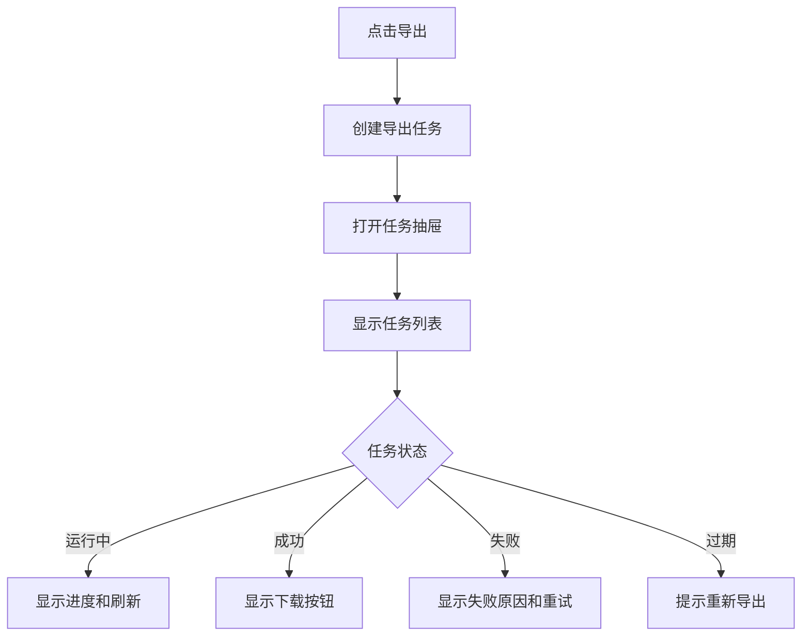

任务抽屉字段建议：

| 字段 | 含义 |
| --- | --- |
| 任务名称 | 比如“用户列表导出 2026-07-03 10:30” |
| 创建人 | 谁发起的导出 |
| 创建时间 | 方便定位 |
| 查询范围 | 当前筛选、选中数据、全部权限内数据 |
| 状态 | 待执行、运行中、成功、失败、已过期 |
| 进度 | 后端能提供就展示，不能提供就展示阶段文案 |
| traceId | 排查任务失败 |
| 操作 | 下载、重试、查看错误 |

## 轮询任务：不要无脑 setInterval

任务轮询要考虑：

- 页面关闭时停止轮询。
- 任务成功、失败、取消、过期时停止轮询。
- 浏览器切到后台时降低频率。
- 请求失败时不要疯狂重试。
- 新任务创建后立即刷新一次。

```ts
import { onBeforeUnmount, ref } from 'vue'

export function useTaskPolling<T extends { status: TaskStatus }>(
  fetchTask: () => Promise<T>,
  options: { interval: number }
) {
  const task = ref<T | null>(null)
  const loading = ref(false)
  const error = ref<string | null>(null)
  let timer: number | null = null

  const isFinished = (status: TaskStatus) => {
    return ['SUCCESS', 'FAILED', 'CANCELED', 'EXPIRED'].includes(status)
  }

  async function refresh() {
    loading.value = true
    error.value = null

    try {
      task.value = await fetchTask()

      if (task.value && isFinished(task.value.status)) {
        stop()
      }
    } catch (err) {
      error.value = normalizeErrorMessage(err)
    } finally {
      loading.value = false
    }
  }

  function start() {
    stop()
    void refresh()
    timer = window.setInterval(refresh, options.interval)
  }

  function stop() {
    if (timer) {
      window.clearInterval(timer)
      timer = null
    }
  }

  onBeforeUnmount(stop)

  return {
    task,
    loading,
    error,
    start,
    stop,
    refresh
  }
}
```

更成熟的项目可以把轮询升级成 SSE 或 WebSocket，但第一版不要为了“实时”引入太重的复杂度。轮询足够稳定、可控、易排查。

## 权限、数据范围和审计

文件任务必须和权限系统打通。否则最容易出现：

- 页面按钮可见，但接口 403。
- 用户只能看本部门数据，却导出了全公司数据。
- 删除业务单据后，附件还可以被下载。
- 导入时给用户分配了自己无权分配的角色。
- 导出失败后查不到是谁导出的、导出了什么条件。

权限链路建议这样设计：

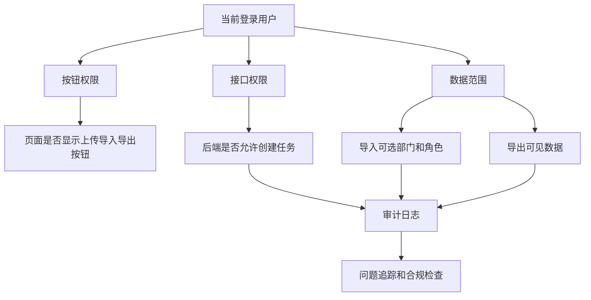

### 权限码建议

| 操作 | 权限码示例 | 说明 |
| --- | --- | --- |
| 上传用户导入文件 | `user:import:upload` | 能上传导入文件 |
| 确认导入用户 | `user:import:commit` | 能把校验后的数据写入系统 |
| 下载导入错误报告 | `user:import:error-report` | 能下载错误详情 |
| 创建用户导出任务 | `user:export:create` | 能发起导出 |
| 下载用户导出结果 | `user:export:download` | 能下载导出文件 |
| 下载附件 | `file:download` | 能下载业务附件 |

注意：上传文件和确认导入是两个权限。很多系统允许运营上传数据给主管审核，但不允许直接入库。

### 审计日志要记录什么

| 字段 | 说明 |
| --- | --- |
| operatorId | 操作人 |
| operation | 上传、下载、解析、确认导入、创建导出、下载导出 |
| bizType | 业务类型 |
| bizId | 业务对象 ID，没有则为空 |
| fileId | 文件 ID |
| taskId | 任务 ID |
| querySnapshot | 导出查询条件快照 |
| dataScopeSnapshot | 当时的数据权限范围 |
| result | 成功或失败 |
| traceId | 请求追踪 ID |
| createdAt | 操作时间 |

对导出任务尤其重要：审计里不一定要保存导出数据本身，但必须保存“按什么条件导出、谁导出、导出了多少、结果文件是什么”。

## 页面状态怎么组织

文件任务页面通常有三类状态：

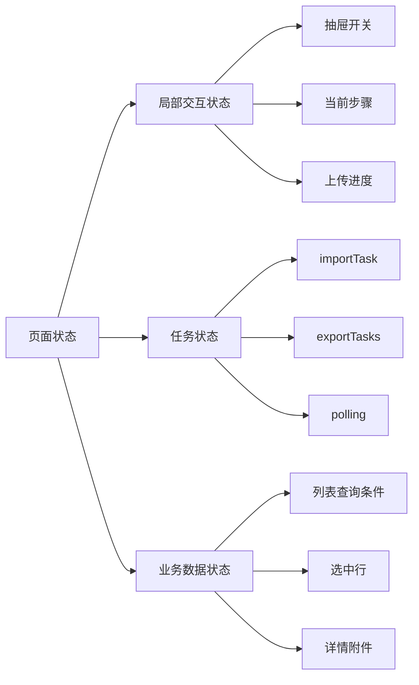

不要把所有状态都放进 Pinia。建议：

| 状态 | 放哪里 | 原因 |
| --- | --- | --- |
| 抽屉开关、步骤条 | 组件本地 | 只影响当前页面 |
| 上传进度 | 组件或 composable | 生命周期短 |
| 当前导入任务 | composable | 可在抽屉内复用 |
| 导出任务列表 | 页面或模块 store | 可能跨页面打开任务抽屉 |
| 登录用户权限 | Pinia | 全局使用 |
| 列表搜索条件 | 页面本地或 URL query | 需要刷新恢复时放 URL |

## 和列表页、表单页、详情页怎么连接

### 列表页

列表页通常放导入、导出按钮：

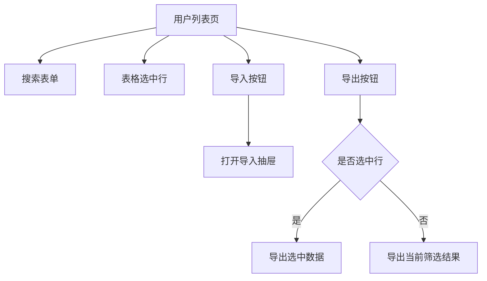

按钮文案要避免误解：

- 没有选中行时：`导出当前筛选结果`
- 选中行时：`导出已选 12 条`
- 有数据权限时：提示 `仅导出你有权限查看的数据`

### 表单页

表单页常见附件上传：

- 新增时先上传临时附件，保存成功后绑定业务 ID。
- 编辑时展示已有附件，可以新增、删除。
- 表单取消时，临时上传但未绑定的文件要清理。

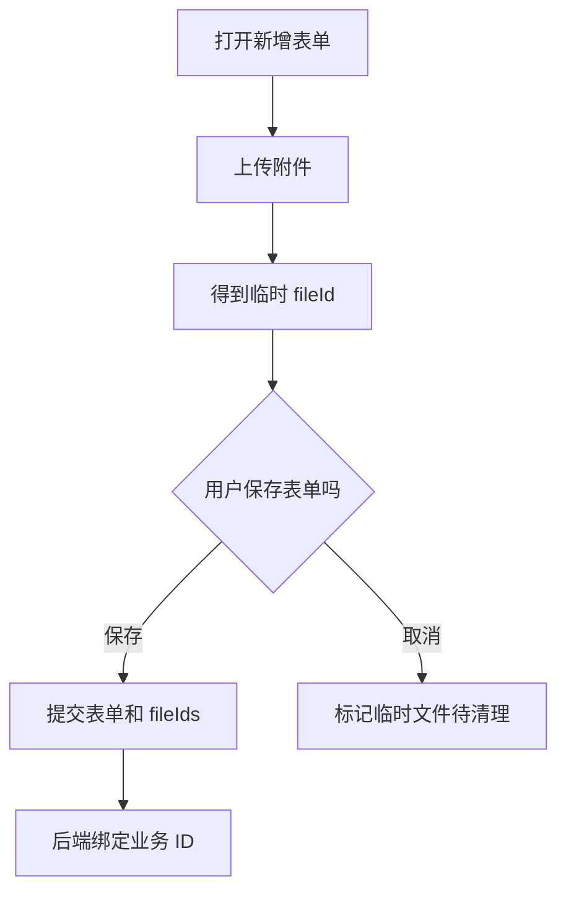

不要在上传成功时就认为业务保存成功。上传成功只代表文件存在，不代表它已经归属于某个业务对象。

### 详情页

详情页常见附件下载和操作记录：

- 附件列表显示上传人、上传时间、文件大小、下载次数。
- 下载前调用后端鉴权接口或下载接口本身鉴权。
- 删除附件要记录操作日志。
- 状态已归档的单据可能不允许删除附件，但允许下载。

## 常见问题与解决方案

### 1. 上传接口一直 400

常见原因：

- 手动设置了错误的 `Content-Type`，导致 multipart boundary 丢失。
- 后端字段名叫 `file`，前端传成了 `files`。
- 文件大小超过后端限制。
- 反向代理限制了请求体大小。

解决方式：

```ts
const formData = new FormData()
formData.append('file', file)

await http.post('/users/import/parse', formData)
```

不要手动写：

```ts
headers: {
  'Content-Type': 'multipart/form-data'
}
```

浏览器会自动带上正确的 boundary。

### 2. 下载出来的文件名乱码

原因通常是 `Content-Disposition` 没有使用 UTF-8 编码，或者跨域时没有暴露响应头。

后端应该返回：

```txt
Content-Disposition: attachment; filename*=UTF-8''%E7%94%A8%E6%88%B7.xlsx
Access-Control-Expose-Headers: Content-Disposition, X-Trace-Id
```

前端用 `filename*` 优先解析。

### 3. 导出时接口超时

不要继续调大前端超时时间。导出超过几秒就应该考虑异步任务：

1. 前端提交导出条件。
2. 后端立刻返回 `taskId`。
3. 前端展示任务抽屉。
4. 后端后台生成文件。
5. 任务成功后前端下载文件。

调大超时时间只能掩盖问题，不能解决大数据导出的用户体验和服务器压力。

### 4. 导入失败但用户看不懂

导入失败至少要返回：

- 总行数。
- 成功行数。
- 失败行数。
- 前几条错误。
- 错误报告下载地址。
- traceId。

如果只有“导入失败”，用户只能反复猜，客服和开发也无法快速定位。

### 5. 页面显示可以导出，后端返回 403

说明按钮权限和接口权限没有对齐。排查顺序：

1. 当前用户权限码里是否有 `user:export:create`。
2. 菜单接口是否返回了按钮权限。
3. 前端权限指令是否使用了正确权限码。
4. 后端接口权限是否使用同一个权限码。
5. 当前用户是否被数据范围拦截。

前端不要为了“体验好”隐藏 403。403 是重要证据，应该展示清楚，并带上 traceId。

### 6. 导出数据比列表看到的多

这是严重问题，通常是导出接口没有使用同一份查询条件或数据范围。

修复原则：

- 列表查询和导出查询使用同一套后端查询条件解析。
- 导出时保存 `querySnapshot`。
- 后端在导出任务执行时重新应用当前用户的数据范围。
- 审计日志保存 `dataScopeSnapshot`。

### 7. 用户重复点击导入，生成重复数据

导入必须有幂等保护：

- 同一个导入任务只能确认一次。
- 后端用任务状态从 `WAIT_CONFIRM` 原子更新到 `IMPORTING`。
- 业务唯一字段要有唯一约束，比如用户名、编码。
- 前端按钮在提交中禁用，只是体验优化，不是可靠保障。

### 8. 任务轮询越来越多

通常是组件卸载时没有停止定时器，或者每次打开抽屉都创建了新的 interval。

修复方式：

- 在 `onBeforeUnmount` 里停止轮询。
- 每次 `start` 前先 `stop`。
- 任务结束后停止轮询。
- 抽屉关闭时停止轮询。

## 实战练习：给用户管理补导入导出

目标：在用户管理模块补一个可交付的文件任务闭环。

### 练习 1：模板下载

要求：

1. 在用户列表页添加“下载导入模板”按钮。
2. 调用 `GET /users/import/template`。
3. 使用 Blob 下载工具保存文件。
4. 处理 403、404、500 和 JSON 错误。
5. 下载失败时显示 traceId。

验收：

- 能下载中文文件名。
- 无权限时不会下载乱码文件。
- Network 面板能看到 `content-disposition`。

### 练习 2：导入抽屉

要求：

1. 点击“导入用户”打开抽屉。
2. 展示模板说明和上传区域。
3. 校验只允许 `.xlsx`，最大 10MB。
4. 上传后展示解析进度。
5. 解析完成后展示总行数、有效行、错误行。
6. 有错误时支持下载错误报告。
7. 无错误时支持确认导入。

验收：

- 错误行能看懂。
- 关闭抽屉不会继续轮询。
- 重复点击确认不会重复提交。

### 练习 3：导出任务

要求：

1. 列表页支持“导出当前筛选结果”。
2. 勾选行后按钮文案变成“导出已选 N 条”。
3. 创建导出任务后打开任务抽屉。
4. 任务成功后显示下载按钮。
5. 任务失败后显示原因和 traceId。

验收：

- 导出的数据范围和列表搜索条件一致。
- 无权限时前端提示清楚。
- 任务抽屉刷新页面后能重新查询最近任务。

## 开发检查清单

上线前逐项检查：

1. 上传文件大小、类型、数量都有前后端双重校验。
2. 上传取消不会让旧请求覆盖新状态。
3. 下载接口能区分 Blob 和 JSON 错误。
4. 中文文件名正常。
5. 导入有模板、解析、预览、错误报告、确认提交。
6. 导入任务有幂等保护。
7. 导出大数据量走异步任务。
8. 导出保存查询条件快照和数据范围快照。
9. 按钮权限、接口权限、数据权限一致。
10. 审计日志记录 operatorId、fileId、taskId、traceId。
11. 任务轮询在关闭页面、关闭抽屉、任务结束时停止。
12. 390px 宽度下抽屉、表格、错误列表仍然可读可操作。

## 和其他文档怎么配合

| 你要做什么 | 继续看 |
| --- | --- |
| 先做好列表搜索分页 | [Vue Admin 列表、搜索、分页与表格闭环实战](/vue/admin-list-search-table) |
| 先做好表单附件入口 | [Vue Admin 表单弹窗、新增编辑与校验闭环实战](/vue/admin-form-modal-crud) |
| 先做好详情附件和操作记录 | [Vue Admin 详情页、状态流转与操作记录闭环实战](/vue/admin-detail-status-audit) |
| 理解请求错误处理 | [Vue Admin 请求封装与错误处理闭环手册](/vue/admin-request-error-handling) |
| 做完整文件中心 | [文件中心项目案例](/projects/file-center-case) |
| 做完整导入导出项目 | [数据导入导出项目案例](/projects/import-export-case) |
| 排查导出权限和数据范围 | [Vue Admin 请求、权限与数据问题排查专题](/projects/issues-vue-admin-request) |

## 下一步学习

如果你已经完成文件上传、下载、导入导出闭环，继续看 [Vue Admin 用户模块实现手册](/vue/admin-user-module)，把列表、表单、详情、文件任务和权限按钮串成完整业务模块。

如果你已经完成用户模块，继续看 [Vue Admin 权限路由闭环实战](/vue/admin-permission-route-flow)，把页面权限、按钮权限、接口权限、数据范围和刷新恢复补完整。
