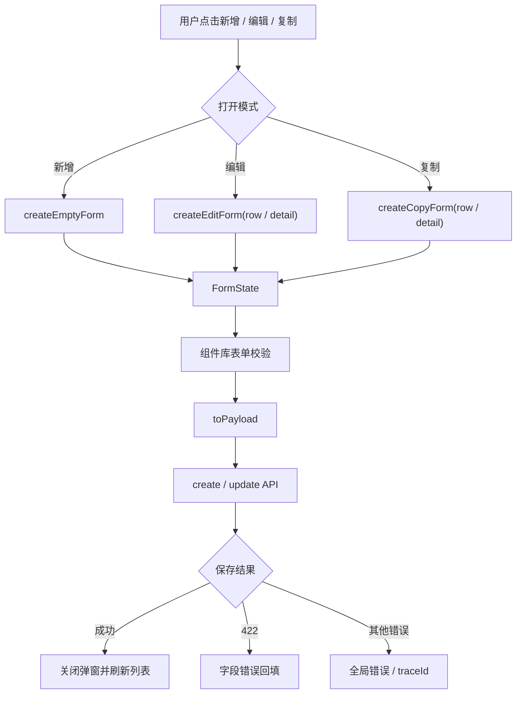
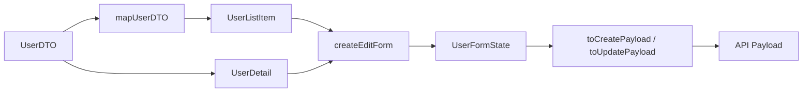
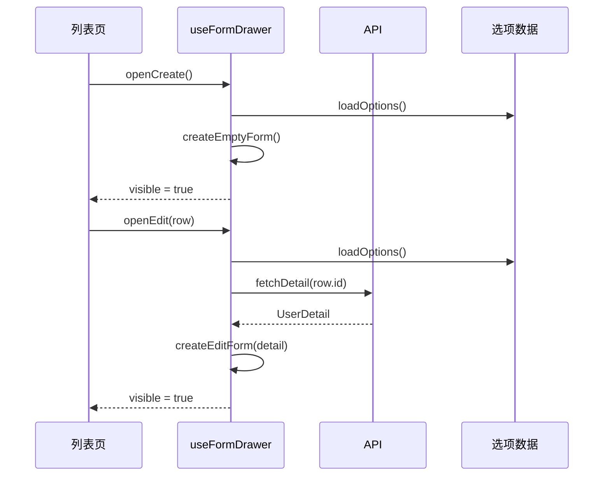
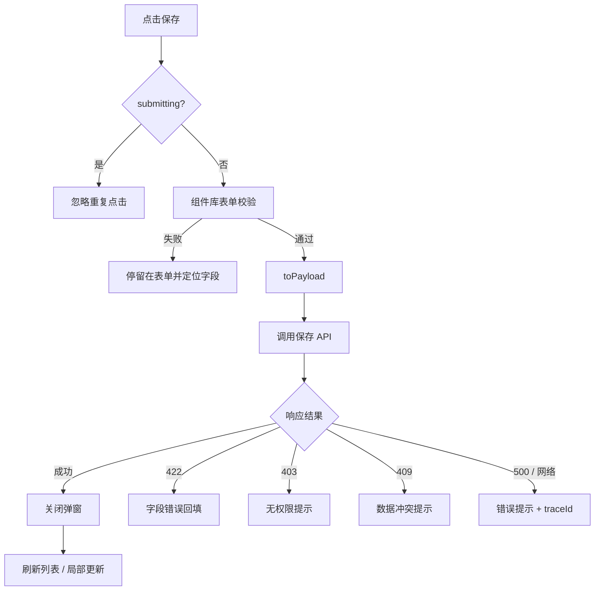
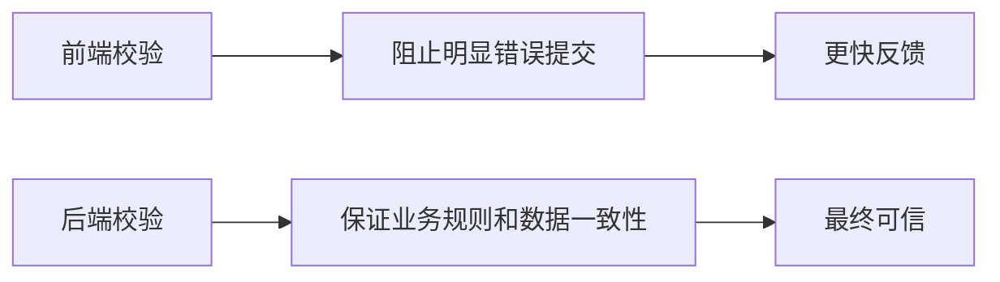
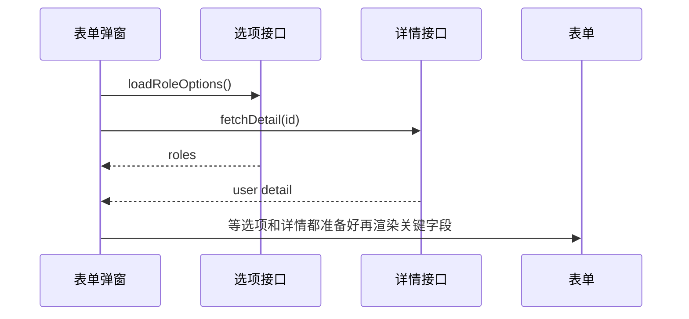
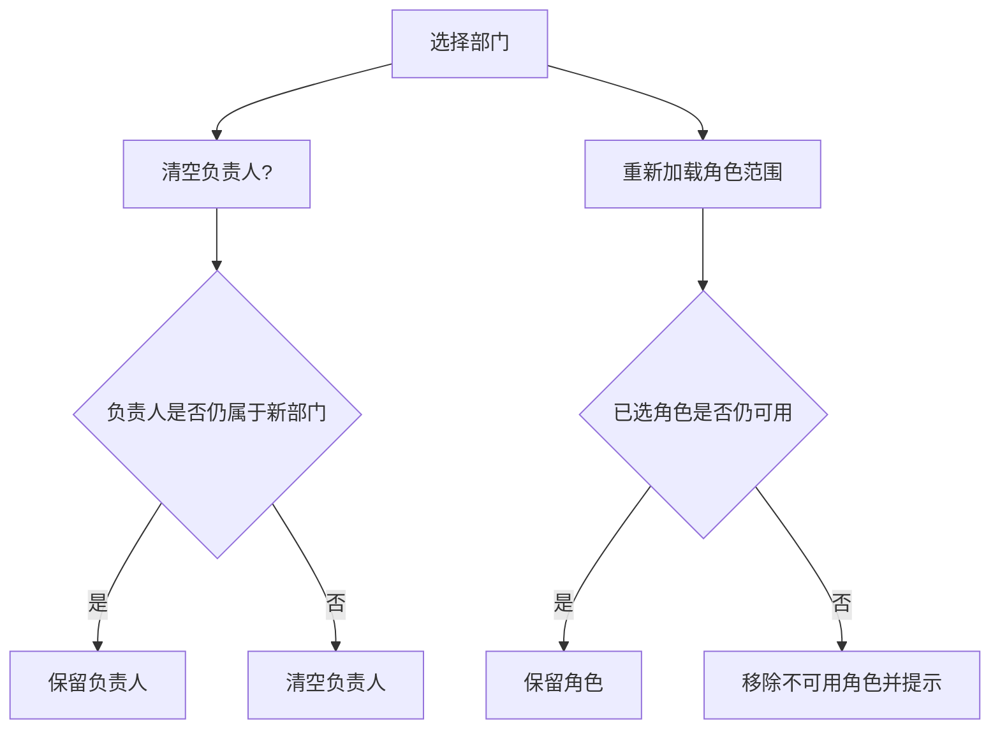
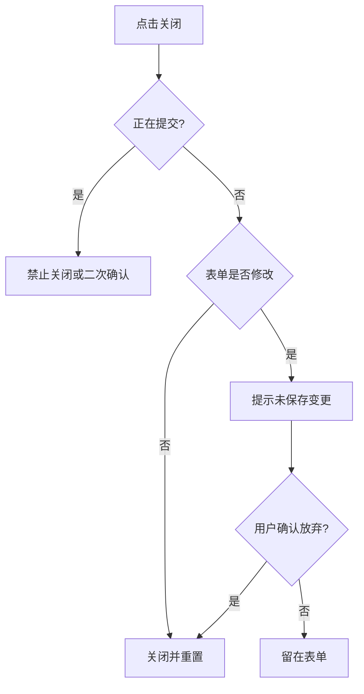
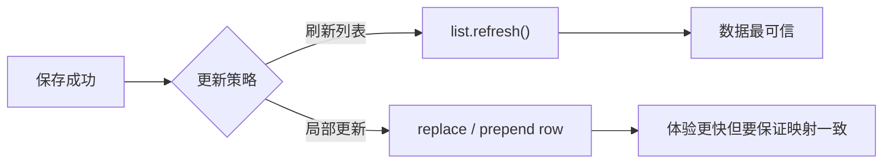

# Vue Admin 表单弹窗、新增编辑与校验闭环实战

## 这个页面解决什么

后台管理系统的第二个高频页面能力，是“新增/编辑弹窗或抽屉表单”。它通常跟列表页一起出现：用户列表点新增、编辑、复制、启停、分配角色；订单列表点备注、改价、审核；组织列表点新增部门、调整负责人。

很多问题都发生在这个环节：

- 编辑弹窗直接绑定表格行对象，用户没点保存，列表已经变化。
- 新增和编辑共用一个表单，但关闭后没有清空，下一次打开带着上一次的数据。
- 后端返回 422 字段错误，前端只弹一句“保存失败”。
- 保存按钮可以连续点击，产生重复数据。
- 编辑时选项接口还没回来，表单回显为空。
- 省市区、角色权限、部门负责人这些联动字段互相覆盖。
- 表单里有临时上传文件，关闭弹窗后没有释放。
- 用户改了一半点关闭，没有二次确认，内容直接丢失。

这一页把新增、编辑、复制、校验、提交、错误回填和关闭确认串成一个可复用闭环。

## 适合谁看

- 已经能写列表页，但新增/编辑弹窗经常写乱的人。
- 正在做 Vue Admin 用户、角色、菜单、组织、订单、日志配置等模块的人。
- 想把 `DTO`、`FormState`、`Payload`、字段错误和表单校验讲清楚的人。
- 经常遇到弹窗污染列表、表单残留、重复提交、422 不会回显的人。
- 已经看完 [Vue Admin 列表、搜索、分页与表格闭环实战](/vue/admin-list-search-table)，准备补完整 CRUD 的人。

## 表单闭环心智模型

新增编辑表单不是“打开弹窗，双向绑定，点保存”。它是一条有明确边界的数据流。



关键原则：

1. 表单永远编辑 `FormState`，不要直接编辑列表行对象。
2. 提交给后端的 `Payload` 必须由 `FormState` 转换。
3. 新增、编辑、复制可以共用表单组件，但初始化函数要分开。
4. 关闭弹窗要处理脏数据、校验状态、临时资源和提交状态。

## 最终目标

完成这一页后，你应该能做出这样的表单弹窗：

| 能力 | 通过标准 |
| --- | --- |
| 模式清楚 | 新增、编辑、复制有明确 mode |
| 初始化稳定 | 每次打开都由工厂函数创建 FormState |
| 类型分层 | DTO、ListItem、Detail、FormState、Payload 不混用 |
| 校验完整 | 前端规则和后端字段错误都能展示 |
| 提交安全 | 保存按钮防重复提交，关闭时不会误丢数据 |
| 错误可定位 | 422、403、409、500、网络错误展示不同反馈 |
| 选项可回显 | 异步字典、角色、部门选项加载顺序可控 |
| 联动可解释 | 父字段变化时清理或保留下游字段有规则 |
| 列表同步 | 保存成功后刷新或局部更新策略明确 |
| 移动端可用 | 抽屉/弹窗在窄屏下不遮挡核心操作 |

下面两张图使用同一个表单状态。第一张是可以提交的新增态，第二张展示前端规则和后端字段错误应如何落到具体字段。

<DocFigure
  src="/images/vue/admin-form-create.webp"
  alt="Vue Admin 新增用户抽屉表单，包含基础信息、角色、状态和固定操作区"
  caption="新增表单由独立 FormState 初始化，关闭后不应残留上一次编辑的数据和校验。"
  :width="1440"
  :height="900"
/>

<DocFigure
  src="/images/vue/admin-form-validation.webp"
  alt="Vue Admin 用户表单展示必填、格式和后端字段冲突三类校验错误"
  caption="错误要尽量靠近字段显示；全局提示负责总结，不能代替字段级反馈。"
  :width="1440"
  :height="900"
/>

## 推荐目录

以用户模块为例：

```text
src/features/users/
  components/
    UserFormDrawer.vue
    UserRoleSelect.vue
    UserDepartmentSelect.vue
  composables/
    useUserFormDrawer.ts
    useUserFormOptions.ts
  services/
    userApi.ts
    userMapper.ts
  types/
    user.dto.ts
    user.model.ts
```

职责分工：

| 文件 | 职责 |
| --- | --- |
| `UserFormDrawer.vue` | 负责表单 UI、组件库 Form、按钮和事件 |
| `useUserFormDrawer.ts` | 负责打开、关闭、初始化、校验、提交和状态 |
| `useUserFormOptions.ts` | 负责角色、部门、状态字典等选项加载 |
| `userMapper.ts` | 负责 DTO、FormState、Payload 转换 |
| `userApi.ts` | 负责 create、update、detail 等 API |

页面组件只应该调用：

```ts
const formDrawer = useUserFormDrawer({
  onSaved: () => userList.refresh()
})
```

不要把弹窗开关、表单对象、校验、提交和列表刷新全部塞进列表页面。

## 类型边界

真实项目里，表单相关类型至少有五类：



示例：

```ts
export interface UserDTO {
  id: string
  user_name: string
  phone_number: string | null
  status: 1 | 0
  role_ids: string[]
  department_id: string | null
}

export interface UserListItem {
  id: string
  name: string
  phoneText: string
  status: 'enabled' | 'disabled'
  roleNamesText: string
}

export interface UserDetail {
  id: string
  name: string
  phone: string
  status: 'enabled' | 'disabled'
  roleIds: string[]
  departmentId: string | null
}

export interface UserFormState {
  id?: string
  name: string
  phone: string
  status: 'enabled' | 'disabled'
  roleIds: string[]
  departmentId: string | null
}

export interface SaveUserPayload {
  id?: string
  user_name: string
  phone_number?: string
  status: 1 | 0
  role_ids: string[]
  department_id?: string
}
```

每个类型的职责：

| 类型 | 来源 | 用途 |
| --- | --- | --- |
| `DTO` | 后端接口 | 不直接进表单 |
| `ListItem` | 列表页 | 展示和行操作入口 |
| `Detail` | 详情接口 | 编辑复杂表单时的完整数据 |
| `FormState` | 表单内部 | 适合组件库绑定和校验 |
| `Payload` | 提交接口 | 和后端契约一致 |

## 初始化函数

不要在打开弹窗时手写一堆 `form.xxx = row.xxx`。初始化要有专门函数。

```ts
export function createEmptyUserForm(): UserFormState {
  return {
    name: '',
    phone: '',
    status: 'enabled',
    roleIds: [],
    departmentId: null
  }
}

export function createEditUserForm(detail: UserDetail): UserFormState {
  return {
    id: detail.id,
    name: detail.name,
    phone: detail.phone,
    status: detail.status,
    roleIds: [...detail.roleIds],
    departmentId: detail.departmentId
  }
}

export function createCopyUserForm(detail: UserDetail): UserFormState {
  return {
    ...createEditUserForm(detail),
    id: undefined,
    name: `${detail.name} 副本`
  }
}
```

为什么 `roleIds` 要复制：

- 数组和对象是引用类型。
- 如果直接复用 `detail.roleIds`，表单修改可能影响其他状态。
- 表单状态必须是当前弹窗独有的临时状态。

## 打开流程

新增、编辑、复制的打开流程不一样。不要用一个函数靠很多 `if` 临时拼。



编辑时是否要请求详情，取决于列表数据是否足够完整：

| 场景 | 建议 |
| --- | --- |
| 列表字段足够编辑 | 可以直接用行数据生成表单 |
| 编辑表单字段比列表多 | 打开时请求详情 |
| 字段涉及权限或敏感数据 | 请求详情并由后端裁剪 |
| 复制创建 | 通常请求详情，避免复制不完整 |

## composable 结构

下面是一种可复用结构：

```ts
import { computed, reactive, ref } from 'vue'

type FormMode = 'create' | 'edit' | 'copy'

interface UseUserFormDrawerOptions {
  onSaved?: () => void | Promise<void>
}

export function useUserFormDrawer(options: UseUserFormDrawerOptions = {}) {
  const visible = ref(false)
  const mode = ref<FormMode>('create')
  const submitting = ref(false)
  const loadingDetail = ref(false)
  const fieldErrors = reactive<Record<string, string>>({})
  const form = reactive<UserFormState>(createEmptyUserForm())
  const initialSnapshot = ref('')

  const title = computed(() => {
    if (mode.value === 'create') return '新增用户'
    if (mode.value === 'copy') return '复制用户'
    return '编辑用户'
  })

  const isDirty = computed(() => JSON.stringify(form) !== initialSnapshot.value)

  function resetForm(next: UserFormState) {
    Object.assign(form, createEmptyUserForm(), next)
    Object.keys(fieldErrors).forEach((key) => delete fieldErrors[key])
    initialSnapshot.value = JSON.stringify(form)
  }

  async function openCreate() {
    mode.value = 'create'
    resetForm(createEmptyUserForm())
    visible.value = true
  }

  async function openEdit(row: UserListItem) {
    mode.value = 'edit'
    visible.value = true
    loadingDetail.value = true

    try {
      const detail = await fetchUserDetail(row.id)
      resetForm(createEditUserForm(detail))
    } finally {
      loadingDetail.value = false
    }
  }

  async function submit() {
    if (submitting.value) return
    submitting.value = true
    Object.keys(fieldErrors).forEach((key) => delete fieldErrors[key])

    try {
      const payload = toSaveUserPayload(form)
      if (mode.value === 'edit') {
        await updateUser(payload)
      } else {
        await createUser(payload)
      }

      visible.value = false
      await options.onSaved?.()
    } catch (error) {
      applyFormError(error, fieldErrors)
    } finally {
      submitting.value = false
    }
  }

  return {
    visible,
    mode,
    title,
    form,
    fieldErrors,
    submitting,
    loadingDetail,
    isDirty,
    openCreate,
    openEdit,
    submit
  }
}
```

这个示例故意把 UI 组件库的 `formRef.validate()` 留给组件层调用。实际项目可以让 `UserFormDrawer.vue` 先调组件库校验，再调用 `submit()`。

## 提交流程

提交时要同时处理前端校验、后端校验、重复提交、列表刷新和错误提示。



提交按钮规则：

| 状态 | 按钮行为 |
| --- | --- |
| `loadingDetail` | 保存按钮禁用 |
| `submitting` | 保存按钮 loading，禁止重复点 |
| 前端校验失败 | 不发请求 |
| 后端 422 | 保持弹窗打开，字段错误回填 |
| 保存成功 | 关闭弹窗，刷新列表 |

## Payload 转换

表单提交不要直接把 `form` 传给后端。

```ts
export function toSaveUserPayload(form: UserFormState): SaveUserPayload {
  return {
    id: form.id,
    user_name: form.name.trim(),
    phone_number: form.phone.trim() || undefined,
    status: form.status === 'enabled' ? 1 : 0,
    role_ids: form.roleIds,
    department_id: form.departmentId || undefined
  }
}
```

转换层负责：

| 转换 | 示例 |
| --- | --- |
| 去空格 | `name.trim()` |
| 空字符串转 `undefined` | `phone || undefined` |
| 前端枚举转后端枚举 | `enabled` -> `1` |
| 数组复制 | `roleIds: [...form.roleIds]` |
| 日期格式转换 | 日期对象 -> `YYYY-MM-DD` |
| 金额转换 | 元 -> 分 |

不要把这些逻辑散落在组件模板和点击事件里。

## 字段校验

表单校验分两层：



前端校验适合：

- 必填。
- 长度。
- 格式。
- 简单范围。
- 两个字段之间的基础关系。

后端校验必须兜底：

- 用户名是否重复。
- 角色是否存在。
- 当前用户是否能分配该角色。
- 部门是否在数据权限范围内。
- 记录是否已被别人删除或修改。

## 422 字段错误回填

后端常见返回：

```json
{
  "code": "VALIDATION_FAILED",
  "message": "表单校验失败",
  "traceId": "req-20260703-002",
  "fields": {
    "user_name": "用户名已存在",
    "role_ids": "至少选择一个角色"
  }
}
```

前端要把后端字段名映射回表单字段：

```ts
const backendFieldMap: Record<string, keyof UserFormState> = {
  user_name: 'name',
  phone_number: 'phone',
  role_ids: 'roleIds',
  department_id: 'departmentId'
}

export function applyFormError(error: unknown, fieldErrors: Record<string, string>) {
  const appError = normalizeError(error)

  if (appError.status === 422 && appError.fields) {
    Object.entries(appError.fields).forEach(([backendField, message]) => {
      const formField = backendFieldMap[backendField]
      if (formField) {
        fieldErrors[formField] = message
      }
    })
    return
  }

  showErrorMessage(appError.message, appError.traceId)
}
```

字段错误回填要注意：

| 问题 | 做法 |
| --- | --- |
| 后端字段名和前端字段名不同 | 建字段映射 |
| 同一个字段多个错误 | 展示第一条或拼接 |
| 后端返回全局错误 | 放在表单顶部或消息提示 |
| 保存后再次编辑 | 打开时清空旧字段错误 |

## 异步选项和回显

表单经常依赖角色、部门、字典、地区、标签等选项。最常见问题是：详情数据到了，但选项没到，选择器显示空。



推荐策略：

| 场景 | 做法 |
| --- | --- |
| 选项少且通用 | 页面进入时预加载 |
| 选项多且可搜索 | 使用远程搜索选择器 |
| 编辑需要回显已删除选项 | 后端详情返回显示名，前端允许只读展示 |
| 部门树很大 | 懒加载树节点 |
| 多个表单共用选项 | 抽到 `useXxxOptions` |

不要为了省事一次性加载所有部门、角色、员工、地区。选项数据也有权限、性能和缓存问题。

## 字段联动

联动字段要写规则，不要靠 watch 随便改。



联动规则示例：

| 父字段 | 子字段 | 推荐规则 |
| --- | --- | --- |
| 部门 | 负责人 | 如果负责人不属于新部门，清空 |
| 部门 | 角色 | 移除当前用户无权分配的角色 |
| 业务类型 | 表单字段 | 隐藏字段同时清理提交值 |
| 国家/省份 | 城市 | 父级变化清空子级 |
| 是否启用高级配置 | 高级字段 | 关闭时清空或不提交高级字段 |

如果隐藏字段仍然提交，很容易造成后端保存了用户看不见的旧值。

## 关闭弹窗

关闭弹窗不是简单 `visible = false`。至少要处理脏数据、校验状态、上传任务和提交状态。



关闭时建议清理：

| 内容 | 为什么 |
| --- | --- |
| `FormState` | 避免下次打开残留 |
| 组件库校验状态 | 避免红字残留 |
| 后端字段错误 | 避免 422 残留 |
| 上传临时文件 | 避免无用资源 |
| 远程搜索关键词 | 避免选项列表残留 |
| 提交状态 | 避免按钮一直 loading |

## 保存成功后怎么更新列表

保存成功后有两种策略：



建议：

| 场景 | 推荐 |
| --- | --- |
| 新增用户 | 刷新第一页，或当前条件下能命中时插入 |
| 编辑用户 | 刷新当前页最稳 |
| 启停状态 | 可以局部更新状态，再后台刷新 |
| 涉及权限变化 | 刷新列表和权限上下文 |
| 涉及排序字段变化 | 刷新列表，避免位置错乱 |

如果列表用了当前查询条件和排序，局部插入很容易位置不对。初学阶段优先刷新列表。

## 弹窗还是抽屉

不要所有表单都用弹窗，也不要所有表单都用抽屉。按复杂度选。

| 形态 | 适合场景 | 注意点 |
| --- | --- | --- |
| Modal | 字段少、操作快、上下文明确 | 不要塞太长表单 |
| Drawer | 字段较多，需要保留列表上下文 | 移动端要全屏或接近全屏 |
| 独立页面 | 复杂流程、多步骤、需要草稿 | 路由和返回状态要清楚 |
| Step Form | 分阶段录入 | 每步校验和草稿保存要明确 |

在移动端，长表单弹窗很容易遮挡键盘和按钮。窄屏建议抽屉全屏化，底部固定操作按钮，并保证错误提示不会被遮挡。

## 常见问题和解决方案

### 问题 1：编辑时列表数据提前变化

根因：

表单直接绑定了列表行对象。

解决：

- 用 `createEditForm(rowOrDetail)` 创建独立表单对象。
- 数组和对象字段都复制。
- 保存成功后再刷新列表或局部替换。

### 问题 2：新增弹窗带着上一次编辑数据

根因：

关闭弹窗时只设置了 `visible = false`，没有重置表单和校验状态。

解决：

- `openCreate()` 每次调用 `createEmptyForm()`。
- 关闭后清理 `fieldErrors`。
- 调用组件库的 `clearValidate` 或等价 API。

### 问题 3：后端返回字段错误但页面只弹失败

根因：

请求层把所有错误都统一弹掉了，表单拿不到字段错误。

解决：

- 请求层保留结构化错误。
- 表单提交 catch 到 422 后做字段映射。
- 非字段错误再走全局提示。

### 问题 4：保存按钮连点产生重复数据

解决：

- `submitting` 为 true 时直接 return。
- 按钮 loading 和 disabled 同步。
- 后端仍要做幂等或唯一约束兜底。

### 问题 5：编辑回显时选择器为空

根因：

选项还没加载，选择器无法根据 id 显示名称。

解决：

- 编辑时并行加载详情和选项。
- 关键字段等数据准备好再渲染。
- 对远程选择器，详情接口返回 id 和 name。

### 问题 6：隐藏字段仍然提交旧值

根因：

表单切换类型后只隐藏了 UI，没有清理 FormState。

解决：

- 父字段变化时明确清理下游字段。
- `toPayload` 根据当前模式决定提交哪些字段。
- 后端忽略无关字段或返回校验错误。

### 问题 7：关闭弹窗误丢内容

解决：

- 打开时保存 `initialSnapshot`。
- 关闭时比较当前表单是否 dirty。
- 如果 dirty，提示用户确认放弃。

## 交付检查清单

| 检查项 | 通过标准 |
| --- | --- |
| 类型分层 | DTO、Detail、FormState、Payload 分开 |
| 初始化 | 新增、编辑、复制都有独立工厂函数 |
| 行对象隔离 | 表单不直接引用列表行对象 |
| 校验 | 前端规则和后端 422 都能展示 |
| 提交 | 保存按钮防重复提交 |
| 错误 | 403、409、422、500、网络错误分开处理 |
| 选项 | 异步选项和编辑回显顺序稳定 |
| 联动 | 父字段变化时下游字段处理明确 |
| 关闭 | dirty 确认、校验清理、临时资源释放 |
| 列表同步 | 保存成功后的刷新或局部更新策略明确 |
| 移动端 | 窄屏表单可操作，按钮不被遮挡 |
| 文档 | README 写清表单数据流和常见问题 |

## 最小练习

用用户管理做一个练习：

1. 定义 `UserDetail`、`UserFormState`、`SaveUserPayload`。
2. 写 `createEmptyUserForm`、`createEditUserForm`、`createCopyUserForm`。
3. 写 `toSaveUserPayload`。
4. 新增和编辑共用一个 `UserFormDrawer`。
5. 编辑时不要直接绑定列表行。
6. 保存时防重复提交。
7. 模拟后端 422 字段错误并回填到表单。
8. 关闭弹窗时如果表单已修改，提示确认。
9. 保存成功后刷新列表。
10. 用 390px 宽度检查表单按钮、错误提示和输入框是否可用。

## 和其他文档怎么配合

| 你要做什么 | 继续看 |
| --- | --- |
| 先做好列表页 | [Vue Admin 列表、搜索、分页与表格闭环实战](/vue/admin-list-search-table) |
| 做详情、状态流转和操作记录 | [Vue Admin 详情页、状态流转与操作记录闭环实战](/vue/admin-detail-status-audit) |
| 给表单加附件上传 | [Vue Admin 文件上传、下载、导入导出与异步任务闭环实战](/vue/admin-file-import-export) |
| 做完整用户模块 | [Vue Admin 用户模块实现手册](/vue/admin-user-module) |
| 处理后端字段错误 | [Vue Admin 请求封装与错误处理闭环手册](/vue/admin-request-error-handling) |
| 排查表单类型问题 | [TypeScript 类型边界问题](/projects/issues-typescript) |
| 复习基础表单 | [表单处理](/vue/forms) |
| 做专项练习 | [Vue Admin 专项练习](/roadmap/vue-admin-practice) |

## 下一步学习

表单弹窗闭环完成后，继续看 [Vue Admin 详情页、状态流转与操作记录闭环实战](/vue/admin-detail-status-audit)，把详情、状态流转、操作按钮和时间线补完整。  
如果你已经掌握详情闭环，继续看 [Vue Admin 文件上传、下载、导入导出与异步任务闭环实战](/vue/admin-file-import-export)，把表单附件、模板导入和异步导出补完整。  
如果你已经掌握文件任务闭环，继续看 [Vue Admin 用户模块实现手册](/vue/admin-user-module)，把列表、搜索、分页、表单、新增、编辑、启停和权限按钮连成完整 CRUD。  
如果你已经能完成用户模块，继续看 [Vue Admin 权限路由闭环实战](/vue/admin-permission-route-flow)，把按钮权限、接口权限和刷新恢复补完整。
