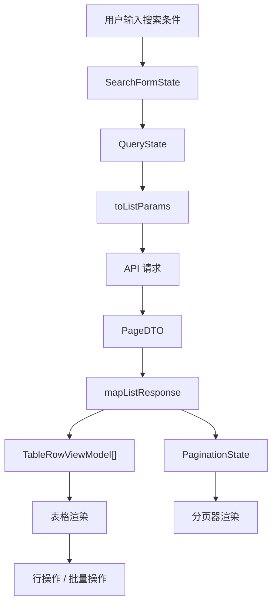
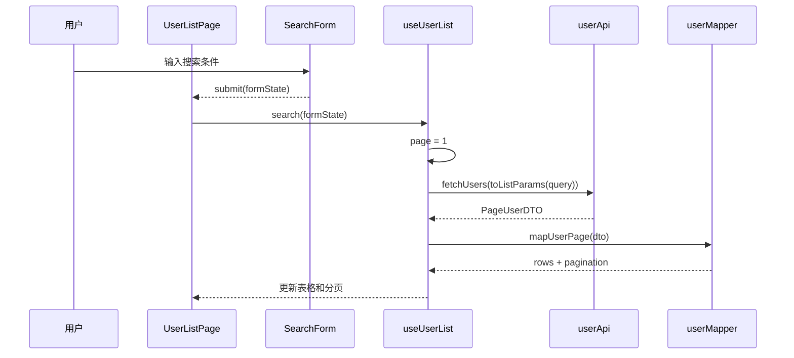
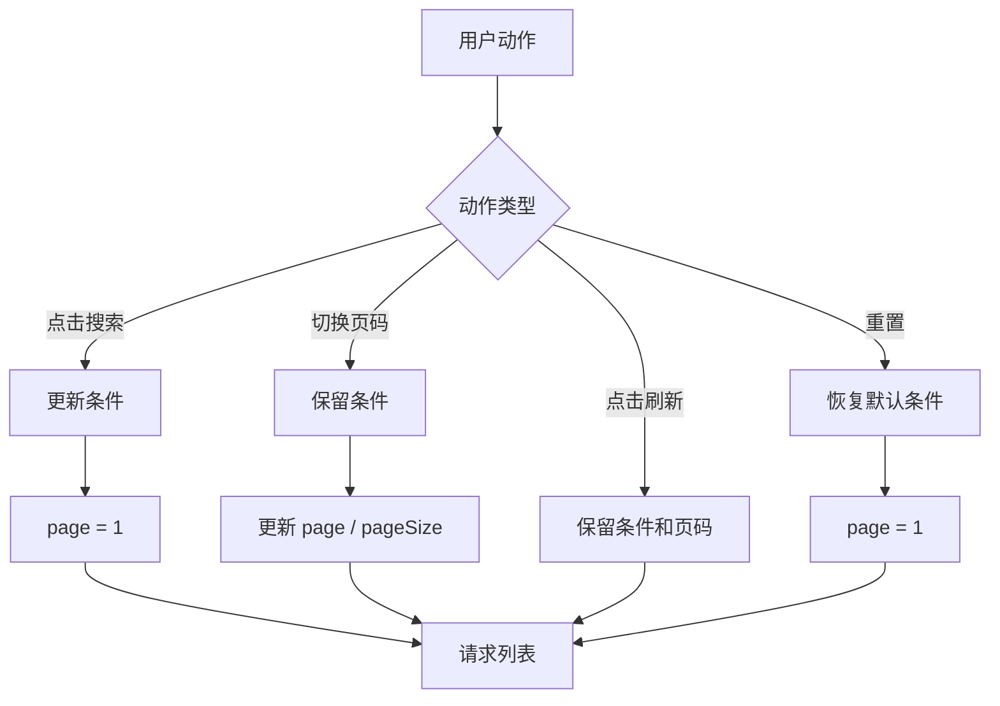
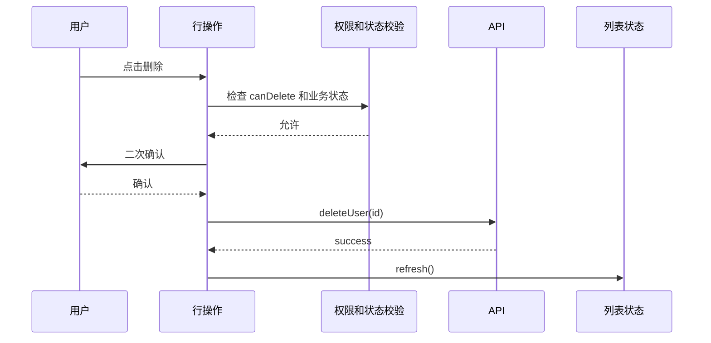
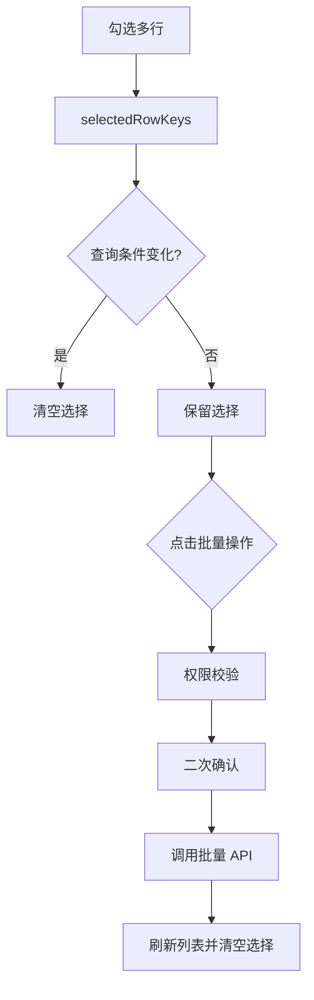
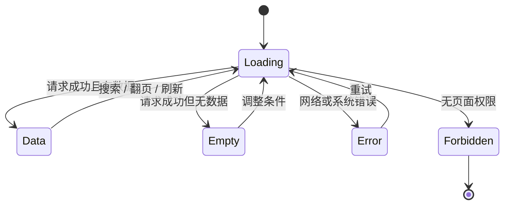
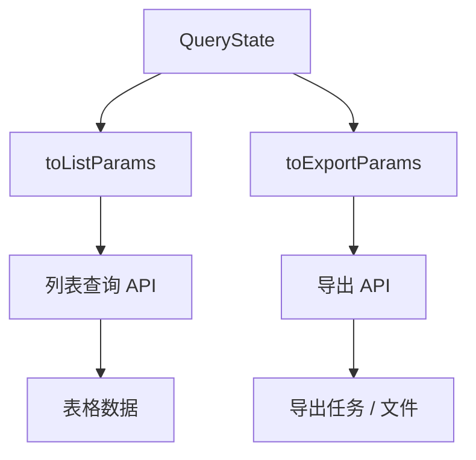
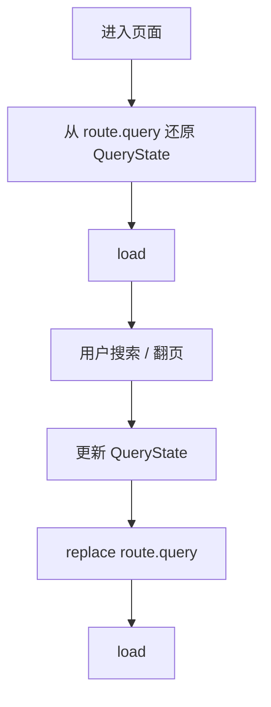

# Vue Admin 列表、搜索、分页与表格闭环实战

## 这个页面解决什么

后台管理系统里最常见的页面不是复杂看板，而是“列表 + 搜索 + 表格 + 分页 + 操作”。用户管理、角色管理、菜单管理、订单管理、客户管理、审批记录、导出任务、日志审计，本质上都离不开这个闭环。

很多项目的问题也集中在这里：

- 搜索条件改了，但分页没有回到第一页。
- 快速切换条件后，旧请求覆盖新请求。
- 表格行编辑时直接改了列表对象，保存前页面数据已经变了。
- 后端分页字段叫 `pageNo`，前端传了 `current`。
- 表格列越来越多，移动端和窄屏直接横向炸开。
- 选中多条后切换筛选条件，批量操作仍然作用在旧数据上。
- 排序、筛选、导出使用的条件和列表查询条件不一致。
- loading、empty、error、forbidden 混在一起，用户不知道是没数据还是没权限。

这一页把列表页拆成可复用的工程模型：**查询状态、请求参数、列表数据、分页信息、表格列、行操作、批量选择、错误状态和交付验收**。

## 适合谁看

- 已经会写 Vue 组件，但列表页经常写乱的人。
- 正在做 Vue Admin 用户、角色、菜单、订单、日志等模块的人。
- 想把“搜索 + 表格 + 分页”从页面堆代码变成稳定模式的人。
- 经常遇到重复请求、分页错位、表格污染、导出条件不一致的人。
- 已经看过 [Vue Admin Mock 到真实接口联调实战](/vue/admin-mock-to-api)，准备把接口数据落到列表页的人。

## 列表页心智模型

列表页不是“请求一次接口然后渲染表格”。它是一条从用户输入到页面状态的管道。



这张图要记住三个边界：

1. 搜索表单状态不等于接口参数。
2. 后端 DTO 不等于表格行 ViewModel。
3. 表格选择状态不应该跨查询条件长期保留，除非业务明确要求。

## 最终目标

完成这一页后，你应该能设计出这样的列表页：

| 能力 | 通过标准 |
| --- | --- |
| 查询状态清楚 | 搜索条件、分页、排序、表格筛选各有职责 |
| 请求参数稳定 | 页面状态通过 `toListParams` 转成后端参数 |
| DTO 映射明确 | 后端响应先转 ViewModel，再进入表格 |
| 请求并发可控 | 新请求能避免被旧请求覆盖 |
| 分页行为正确 | 新搜索回第一页，换页保留当前条件 |
| 表格列可维护 | 列配置集中，权限和格式化不散落 |
| 行操作安全 | 编辑、删除、启停都有状态校验和权限判断 |
| 批量操作可控 | 选择状态和当前查询范围一致 |
| 空态和错误明确 | loading、empty、error、forbidden 不混用 |
| 导出条件一致 | 导出使用同一份查询参数，而不是重新拼 |

## 推荐页面结构

一个中后台列表页建议按“页面、组合逻辑、业务组件、接口和类型”拆分：

```text
src/features/users/
  pages/
    UserListPage.vue
  components/
    UserSearchForm.vue
    UserTable.vue
    UserStatusTag.vue
    UserRowActions.vue
  composables/
    useUserList.ts
    useUserSelection.ts
  services/
    userApi.ts
    userMapper.ts
  types/
    user.dto.ts
    user.model.ts
```

职责分工：

| 文件 | 职责 | 不应该做什么 |
| --- | --- | --- |
| `UserListPage.vue` | 组装搜索、表格、分页和弹窗 | 不直接写复杂请求逻辑 |
| `UserSearchForm.vue` | 只负责搜索条件输入和重置 | 不直接请求接口 |
| `UserTable.vue` | 展示表格、分页和行操作入口 | 不保存业务查询状态 |
| `useUserList.ts` | 管理查询、请求、列表、分页、状态 | 不写 UI 样式 |
| `useUserSelection.ts` | 管理勾选和批量操作状态 | 不和搜索表单互相污染 |
| `userApi.ts` | 调接口 | 不处理页面显示格式 |
| `userMapper.ts` | DTO、ViewModel、Payload 转换 | 不发请求 |

## 列表页数据流

页面初始化、搜索、翻页、排序和刷新应该走同一条数据流。



这里最容易出错的是“搜索”和“翻页”混成一个函数。建议分清：

- `search(formState)`：更新搜索条件，并回到第一页。
- `changePage(page, pageSize)`：保留搜索条件，只改分页。
- `refresh()`：保留当前条件和页码，重新请求。
- `reset()`：恢复默认条件，并回到第一页。

## QueryState 怎么设计

不要把组件库表单对象、URL query、接口参数和页面内部状态混成一个对象。推荐拆成几类：

```ts
interface UserSearchFormState {
  keyword: string
  status: 'all' | 'enabled' | 'disabled'
  roleId?: string
  createdRange: [string, string] | null
}

interface UserQueryState {
  keyword: string
  status?: 'enabled' | 'disabled'
  roleId?: string
  createdStart?: string
  createdEnd?: string
  page: number
  pageSize: number
  sortBy?: 'createdAt' | 'lastLoginAt'
  sortOrder?: 'asc' | 'desc'
}

interface UserListParams {
  keyword?: string
  status?: 1 | 0
  role_id?: string
  created_start?: string
  created_end?: string
  page_no: number
  page_size: number
  sort_field?: string
  sort_order?: 'asc' | 'desc'
}
```

为什么要这样拆：

| 类型 | 面向谁 | 典型特点 |
| --- | --- | --- |
| `SearchFormState` | 表单组件 | 适合输入和回显，例如 `all`、日期范围数组 |
| `QueryState` | 页面逻辑 | 适合表达当前页面真实查询状态 |
| `ListParams` | 后端接口 | 字段名、枚举值和分页字段跟后端契约一致 |

转换函数应该单独写：

```ts
function normalizeSearchForm(form: UserSearchFormState): Omit<UserQueryState, 'page' | 'pageSize'> {
  return {
    keyword: form.keyword.trim(),
    status: form.status === 'all' ? undefined : form.status,
    roleId: form.roleId,
    createdStart: form.createdRange?.[0],
    createdEnd: form.createdRange?.[1]
  }
}

function toUserListParams(query: UserQueryState): UserListParams {
  return {
    keyword: query.keyword || undefined,
    status: query.status === 'enabled' ? 1 : query.status === 'disabled' ? 0 : undefined,
    role_id: query.roleId,
    created_start: query.createdStart,
    created_end: query.createdEnd,
    page_no: query.page,
    page_size: query.pageSize,
    sort_field: query.sortBy,
    sort_order: query.sortOrder
  }
}
```

## 分页行为规则

分页错误通常不是组件库问题，而是业务规则没有写清楚。



建议统一规则：

| 动作 | 是否重置页码 | 是否保留搜索条件 | 说明 |
| --- | --- | --- | --- |
| 首次进入 | 是 | 使用默认条件 | 从第一页开始 |
| 搜索 | 是 | 使用新条件 | 避免新条件下页码越界 |
| 重置 | 是 | 不保留 | 回到默认视图 |
| 翻页 | 否 | 保留 | 只改分页 |
| 改 pageSize | 是 | 保留 | 页大小变了，回第一页更稳定 |
| 排序 | 是 | 保留 | 排序后第一页更符合预期 |
| 刷新 | 否 | 保留 | 当前页面重新拉取 |

## useList 的基础实现

下面是一个可读性优先的结构。真实项目可以根据组件库再适配表格和分页事件。

```ts
import { computed, reactive, ref } from 'vue'

export function useUserList() {
  const query = reactive<UserQueryState>({
    keyword: '',
    page: 1,
    pageSize: 20
  })

  const rows = ref<UserRowViewModel[]>([])
  const total = ref(0)
  const loading = ref(false)
  const error = ref<AppError | null>(null)
  const requestVersion = ref(0)

  const hasRows = computed(() => rows.value.length > 0)
  const isEmpty = computed(() => !loading.value && !error.value && rows.value.length === 0)

  async function load() {
    const version = ++requestVersion.value
    loading.value = true
    error.value = null

    try {
      const dto = await fetchUsers(toUserListParams(query))
      if (version !== requestVersion.value) return

      const page = mapUserPage(dto)
      rows.value = page.rows
      total.value = page.total
    } catch (err) {
      if (version !== requestVersion.value) return
      error.value = normalizeError(err)
    } finally {
      if (version === requestVersion.value) {
        loading.value = false
      }
    }
  }

  function search(form: UserSearchFormState) {
    Object.assign(query, normalizeSearchForm(form), { page: 1 })
    return load()
  }

  function changePage(page: number, pageSize = query.pageSize) {
    query.page = page
    query.pageSize = pageSize
    return load()
  }

  function reset() {
    Object.assign(query, { keyword: '', status: undefined, roleId: undefined, page: 1 })
    return load()
  }

  return {
    query,
    rows,
    total,
    loading,
    error,
    hasRows,
    isEmpty,
    load,
    search,
    changePage,
    reset
  }
}
```

这里用 `requestVersion` 解决旧请求覆盖新请求的问题。也可以用 `AbortController`，但无论用哪种方式，都要保证“最后一次用户意图”胜出。

## 表格列怎么设计

表格列不要在模板里越写越长。推荐把列配置、格式化、权限和操作入口拆开。


列配置应该回答四个问题：

| 问题 | 示例 |
| --- | --- |
| 展示什么 | 用户名、手机号、状态、角色、创建时间 |
| 怎么展示 | 状态标签、日期格式化、空值占位 |
| 是否可排序 | 创建时间、最后登录时间 |
| 是否受权限影响 | 操作列按钮、敏感字段脱敏 |

建议表格行 ViewModel 尽量接近展示需要：

```ts
interface UserRowViewModel {
  id: string
  name: string
  phoneText: string
  roleNamesText: string
  status: 'enabled' | 'disabled'
  statusText: string
  createdAtText: string
  canEdit: boolean
  canDisable: boolean
  canDelete: boolean
}
```

不要在模板里写大量判断：

```vue
<!-- 不推荐：模板里堆字段转换和权限判断 -->
<span>{{ row.status === 1 ? '启用' : '禁用' }}</span>

<!-- 推荐：ViewModel 已经准备好展示字段 -->
<UserStatusTag :status="row.status" :text="row.statusText" />
```

## 行操作规则

行操作看起来只是几个按钮，但它连接了权限、状态机、二次确认、请求、刷新和错误处理。



每个行操作都要明确：

| 操作 | 必要规则 |
| --- | --- |
| 查看详情 | 通常只需要查看权限，但敏感字段要脱敏 |
| 编辑 | 需要编辑权限，且当前状态允许编辑 |
| 删除 | 需要删除权限，通常需要二次确认 |
| 启用/禁用 | 需要状态切换权限，切换后刷新列表 |
| 重置密码 | 高风险操作，需要确认和审计 |
| 分配角色 | 会影响权限，需要保存前展示影响范围 |

不要只在前端禁用按钮。前端负责体验，后端负责最终校验。

## 批量选择怎么做

批量操作比单行操作更容易出错，因为“选中的行”和“当前查询结果”可能已经不是同一个上下文。



推荐规则：

| 场景 | 选择状态 |
| --- | --- |
| 搜索条件变化 | 清空 |
| 页码变化 | 默认清空，除非明确支持跨页选择 |
| pageSize 变化 | 清空 |
| 排序变化 | 清空 |
| 删除成功 | 清空 |
| 导出当前页 | 使用当前选中行 |
| 导出全部查询结果 | 不依赖选中行，使用查询条件 |

如果业务真的需要跨页选择，要在 UI 上明确告诉用户“已跨页选择 N 条”，并且后端 API 要支持按 id 列表或查询条件执行。

## 空态、错误态和权限态

列表页至少有五种状态：



状态说明：

| 状态 | 用户看到什么 | 用户能做什么 |
| --- | --- | --- |
| `loading` | 骨架屏或表格 loading | 等待，不重复点击 |
| `empty` | 无数据提示 | 修改条件、重置搜索 |
| `error` | 错误信息和重试按钮 | 重试、复制 traceId |
| `forbidden` | 无权限说明 | 返回上一页或联系管理员 |
| `data` | 表格和分页 | 搜索、翻页、操作 |

不要把所有情况都显示成“暂无数据”。接口 403 显示空表格，会让用户误以为业务没有数据，而不是自己没有权限。

## 导出和列表条件保持一致

导出常见问题是：列表看到 20 条，导出出来完全不是同一批数据。根因通常是导出按钮重新拼参数，或者漏了排序、数据范围、日期条件。

推荐做法：



导出参数可以和列表参数不同，但必须从同一份 `QueryState` 转换出来。

| 导出类型 | 参数来源 | 注意点 |
| --- | --- | --- |
| 导出当前页 | 当前 `query` + 当前页码 | 只导出当前页数据 |
| 导出全部查询结果 | 当前 `query`，去掉分页 | 后端要限制最大数量或走异步任务 |
| 导出选中行 | `selectedRowKeys` | 选择状态变化要及时清空 |
| 导出敏感字段 | 查询条件 + 权限上下文 | 需要二次鉴权和审计 |

## URL Query 是否要同步

并不是所有列表页都需要把搜索条件写进 URL。判断依据是：这个页面是否需要分享、刷新恢复、从其他页面返回后保留条件。

| 页面类型 | 建议 |
| --- | --- |
| 用户管理 | 可以同步关键条件，例如 keyword、status、page |
| 审计日志 | 建议同步，方便复制问题链接 |
| 临时弹窗列表 | 不建议同步，保持局部状态即可 |
| 数据看板下钻列表 | 建议同步，方便回到同一视图 |

同步 URL 时要避免双向 watch 互相触发。推荐流程：



如果要同步 URL，建议只同步稳定、短小、可读的字段，不要把整个表单对象塞进 query。

## KeepAlive 下的列表页

后台项目经常启用标签页或 KeepAlive。列表页被缓存后，要明确什么时候刷新，什么时候保留。

| 场景 | 推荐行为 |
| --- | --- |
| 从列表进入详情再返回 | 保留搜索条件、页码和滚动位置 |
| 从新增页返回 | 刷新列表，通常回第一页或保持当前页 |
| 从编辑页返回 | 刷新当前页 |
| 切换顶部标签再回来 | 保留状态 |
| 登录用户切换 | 清空状态并重新加载 |

不要把所有状态都放进 Pinia。搜索条件、页码、弹窗开关通常是页面状态；只有跨页面共享、刷新恢复、权限上下文才适合放全局。

## 移动端和窄屏处理

后台表格在移动端很难完整展示。不要简单把 10 列表格硬塞进 390px 宽度。

推荐策略：

| 宽度 | 展示策略 |
| --- | --- |
| 桌面宽屏 | 完整表格，操作列固定 |
| 中等屏 | 隐藏低优先级列，把详情放抽屉 |
| 窄屏 | 改成列表卡片或只保留核心列 |
| 移动端 | 搜索条件折叠，行操作进入更多菜单 |

表格列优先级示例：

```text
高优先级：名称、状态、关键时间、操作
中优先级：角色、部门、创建人
低优先级：备注、更新时间、内部编码
```

固定尺寸元素要防止被压缩，例如头像、状态圆点、操作按钮图标要设置稳定宽高和不可压缩行为。不要用宽泛 CSS 选择器去覆盖组件库表格内部结构。

## 常见问题和解决方案

### 问题 1：搜索后没有回到第一页

现象：

- 当前在第 8 页。
- 输入新关键词搜索。
- 接口返回空数据。

根因：

新关键词下可能只有 1 页数据，但前端仍然请求第 8 页。

解决：

- `search()` 必须把 `page` 设置为 1。
- `pageSize` 改变也建议回到第一页。
- 搜索、重置、排序这些动作都要明确分页规则。

### 问题 2：旧请求覆盖新请求

现象：

- 连续输入关键词搜索。
- 后发请求先返回，页面显示正确。
- 先发请求后返回，又把页面覆盖成旧结果。

解决：

- 使用 `requestVersion` 或 `AbortController`。
- 只有最后一次请求可以更新 `rows`、`total`、`loading`。
- loading 关闭也要检查是否仍然是最后一次请求。

### 问题 3：编辑弹窗污染列表

现象：

- 打开编辑弹窗。
- 在表单里修改用户名。
- 没点保存，表格里用户名已经变了。

根因：

表单直接引用了表格行对象。

解决：

```ts
function createUserForm(row: UserRowViewModel): UserFormState {
  return {
    id: row.id,
    name: row.name,
    status: row.status
  }
}
```

编辑成功后再刷新列表或局部替换行数据，不要让表单直接持有列表对象引用。

### 问题 4：批量删除删到了旧数据

现象：

- 勾选了第一页的 3 条数据。
- 切换搜索条件。
- 批量删除按钮仍然可用。

解决：

- 查询条件、页码、排序变化时清空选择。
- 批量操作前展示选中数量和关键名称。
- 后端仍要校验这些 id 是否允许当前用户操作。

### 问题 5：导出条件和列表不一致

现象：

- 页面筛选了“启用用户”。
- 导出文件里包含禁用用户。

解决：

- 导出参数从当前 `QueryState` 转换。
- 不在按钮点击时重新读取零散表单字段。
- 导出前把条件摘要展示给用户确认。
- 导出任务记录 query、操作人、时间和 traceId。

### 问题 6：表格操作列挤压变形

现象：

- 操作按钮在窄屏下变成竖排或挤成很小。
- 图标按钮变形。

解决：

- 操作列设置稳定宽度。
- 图标、头像、状态点设置 `flex-shrink: 0`。
- 窄屏把次要操作收进“更多”菜单。
- 不用宽泛选择器覆盖组件库内部 `td`、`button`、`span`。

### 问题 7：空态误导用户

现象：

- 用户没有权限，页面显示“暂无数据”。
- 用户以为系统里真的没有数据。

解决：

- 403 显示无权限状态。
- 200 空数组显示空数据状态。
- 网络失败显示错误和重试。
- 数据权限裁剪显示“你只能查看所属部门数据”。

## 交付检查清单

| 检查项 | 通过标准 |
| --- | --- |
| 查询模型 | `SearchFormState`、`QueryState`、`ListParams` 分清 |
| 参数转换 | 有独立 `toListParams`，不是模板里拼 |
| 响应转换 | 有 `mapListResponse`，表格不用原始 DTO |
| 搜索行为 | 搜索和重置回第一页 |
| 翻页行为 | 翻页保留当前条件 |
| 并发控制 | 旧请求不能覆盖新请求 |
| 选择状态 | 查询变化后清空批量选择 |
| 行操作 | 权限、状态、确认、刷新都明确 |
| 错误状态 | loading、empty、error、forbidden 分清 |
| 导出 | 使用同一份查询状态 |
| URL 恢复 | 需要分享或返回恢复的页面同步 query |
| 移动端 | 窄屏无整体横向溢出，次要列有降级策略 |
| 文档 | README 写清列表页数据流和常见问题 |

## 最小练习

用用户管理列表做一个练习：

1. 定义 `UserSearchFormState`、`UserQueryState`、`UserListParams`。
2. 写 `normalizeSearchForm` 和 `toUserListParams`。
3. 写 `mapUserPage`，不要让表格直接用 DTO。
4. 实现 `search`、`changePage`、`reset`、`refresh`。
5. 加 `requestVersion`，验证旧请求不会覆盖新请求。
6. 搜索条件变化时清空批量选择。
7. 加 empty、error、forbidden 三种状态。
8. 写一个导出按钮，参数必须来自当前 `QueryState`。
9. 用 390px 宽度检查表格不出现整体横向溢出。
10. 把遇到的问题写进 `TROUBLESHOOTING.md`。

## 和其他文档怎么配合

| 你要做什么 | 继续看 |
| --- | --- |
| 先把 mock 切真实接口 | [Vue Admin Mock 到真实接口联调实战](/vue/admin-mock-to-api) |
| 做新增、编辑和表单校验 | [Vue Admin 表单弹窗、新增编辑与校验闭环实战](/vue/admin-form-modal-crud) |
| 做导出任务和批量文件下载 | [Vue Admin 文件上传、下载、导入导出与异步任务闭环实战](/vue/admin-file-import-export) |
| 做完整用户模块 | [Vue Admin 用户模块实现手册](/vue/admin-user-module) |
| 处理请求错误 | [Vue Admin 请求封装与错误处理闭环手册](/vue/admin-request-error-handling) |
| 排查请求和权限问题 | [Vue Admin 请求、权限与数据问题排查专题](/projects/issues-vue-admin-request) |
| 复习表单边界 | [表单处理](/vue/forms) |
| 复习类型边界 | [TypeScript 类型边界问题](/projects/issues-typescript) |

## 下一步学习

列表、搜索、分页和表格闭环完成后，继续看 [Vue Admin 表单弹窗、新增编辑与校验闭环实战](/vue/admin-form-modal-crud)，把新增、编辑、复制、校验和提交状态做稳。  
如果你已经掌握表单闭环，继续看 [Vue Admin 文件上传、下载、导入导出与异步任务闭环实战](/vue/admin-file-import-export)，把列表导出、选中导出和异步任务做稳。  
如果你已经掌握文件任务闭环，继续看 [Vue Admin 用户模块实现手册](/vue/admin-user-module)，把这套模式落到完整用户管理模块上。  
如果你已经有真实接口，继续看 [Vue Admin 请求封装与错误处理闭环手册](/vue/admin-request-error-handling)，把列表页的错误状态、traceId、重复提交和导出任务补完整。
