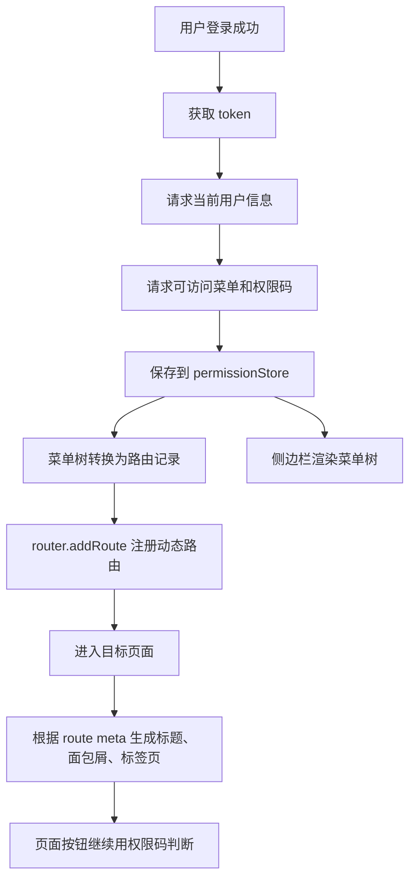
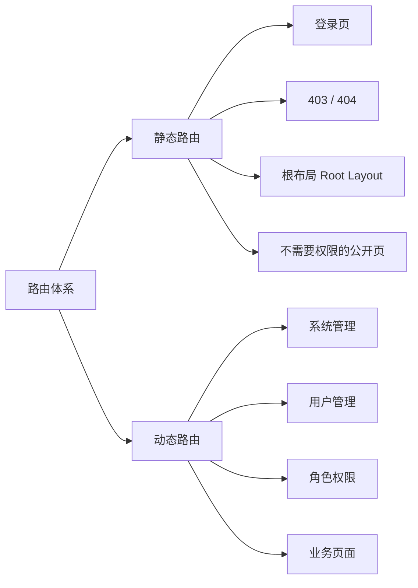
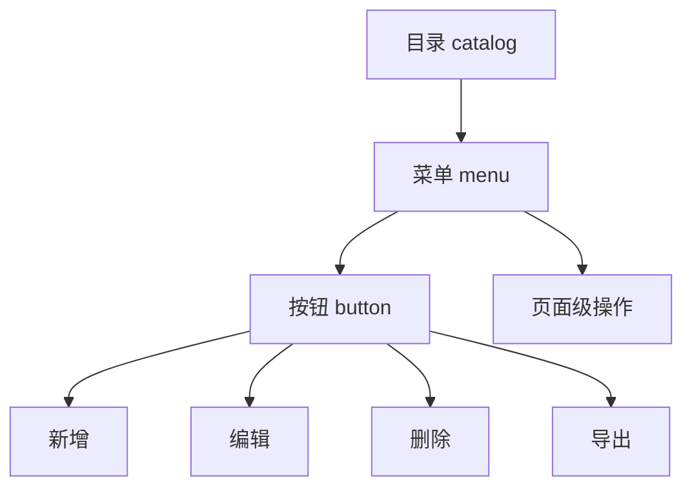
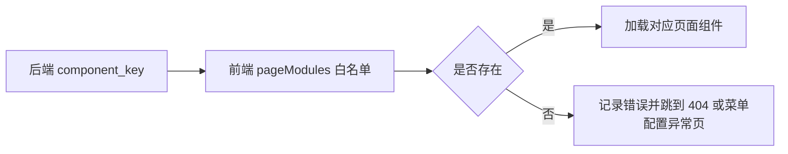
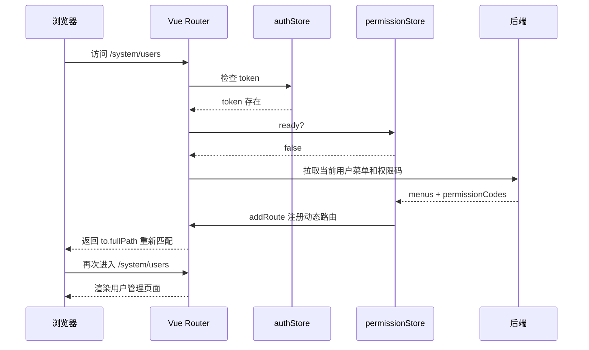
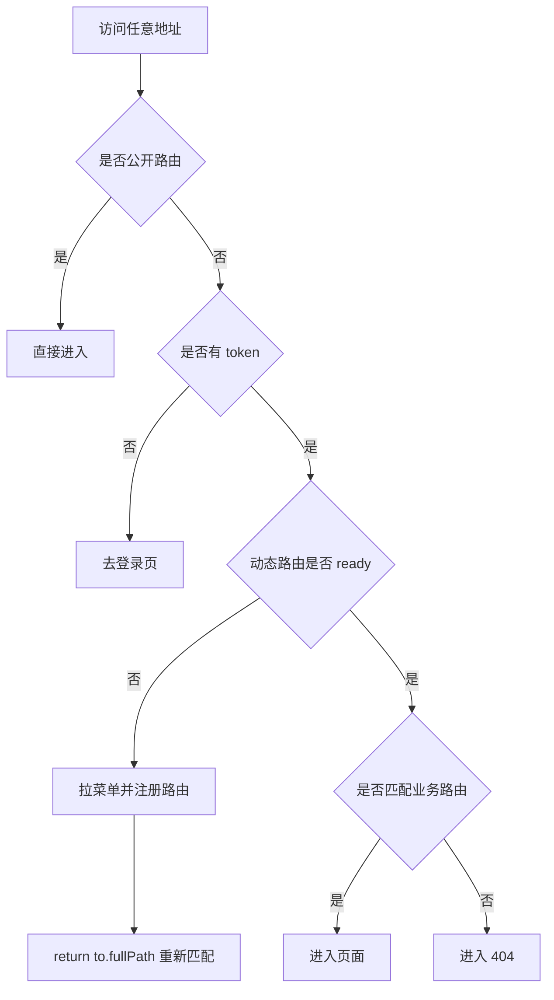
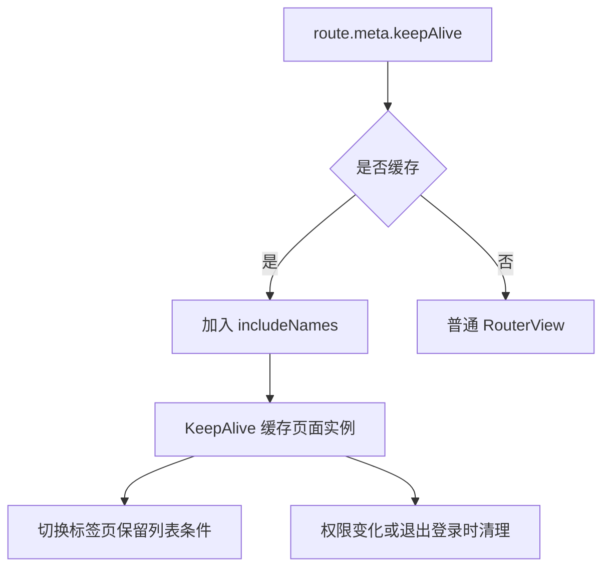
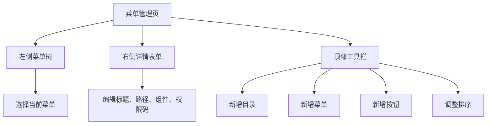

# Vue Admin 菜单与动态路由实现手册

## 这个页面解决什么

用户模块解决“谁登录系统”，角色权限模块解决“这个人拥有哪些权限”。菜单与动态路由模块解决“登录以后，系统怎么把权限变成左侧菜单、页面路由、面包屑、标签页和刷新后的可访问页面”。

这一页专门把后台项目中最常见的动态菜单链路讲完整：

- 后端菜单数据应该长什么样。
- 菜单、权限、路由、组件路径之间是什么关系。
- 前端如何把菜单树转换为 Vue Router 路由。
- 为什么不能直接信任后端返回的组件路径。
- 刷新深层页面为什么会 404，应该在哪里恢复动态路由。
- 退出登录、切换角色、权限变更时如何清理旧路由。
- 侧边栏、面包屑、标签页和路由 meta 如何保持同源。

如果你只把菜单理解成“左侧栏的几行文字”，后面一定会遇到刷新丢菜单、路由重复注册、按钮权限错位、缓存页面串数据等问题。真实项目里，菜单是后台应用的信息架构入口，也是动态路由、权限判断和页面导航的连接点。

## 适合谁看

- 已经学完 [Vue Admin 角色权限模块实现手册](/vue/admin-permission-module)，准备做动态菜单的人。
- 正在做企业后台、SaaS 控制台、权限系统、菜单管理、动态路由的人。
- 知道 Vue Router 和 Pinia，但不清楚菜单数据如何转成路由的人。
- 遇到刷新 404、路由重复、菜单错乱、页面标题丢失、标签页缓存错位的人。

## 最终要做成什么

一个可用的 Vue Admin 菜单与动态路由模块至少要覆盖：

| 能力 | 用户看到什么 | 工程上要做什么 |
| --- | --- | --- |
| 菜单管理 | 管理员能维护目录、菜单、按钮入口 | 菜单数据模型和表单校验 |
| 动态侧边栏 | 不同角色看到不同菜单 | 登录后拉取可访问菜单 |
| 动态路由 | 有权限的页面才能进入 | 菜单树转换为 RouteRecordRaw |
| 组件白名单 | 后端只保存组件 key | 前端用静态映射加载组件 |
| 刷新恢复 | 直接刷新深层页面仍能进入 | 路由守卫中恢复菜单和路由 |
| 面包屑 | 页面顶部显示当前位置 | route meta 和 matched 记录 |
| 标签页 | 打开过的页面可切换 | 根据路由 name/path 记录 visited views |
| 退出清理 | 退出后旧菜单不可访问 | removeRoute、清空 store 和缓存 |
| 权限变更 | 角色变更后菜单及时更新 | 版本号、重新拉取、重注册 |
| 异常页 | 无权限、无路由有明确反馈 | 403/404 路由顺序和兜底策略 |

## 总体链路

先看完整流程，再看代码细节：



这条链路里有一个关键原则：

**菜单、路由、面包屑、标签页、页面标题都应该从同一份菜单和 route meta 派生，不要各写一套配置。**

如果左侧菜单写一份、路由表写一份、面包屑再写一份，后续权限变更时很容易出现：

- 菜单隐藏了，但地址栏还能进。
- 页面能进，但面包屑没有标题。
- 标签页显示旧标题。
- 删除菜单后旧路由还在。
- 同一个页面在不同入口下缓存冲突。

## 一、先区分静态路由和动态路由

后台项目不是所有路由都要动态生成。推荐分成两类：



### 静态路由放什么

静态路由应该包含系统能启动所需的基础页面：

| 路由 | 是否需要登录 | 是否由菜单控制 | 说明 |
| --- | --- | --- | --- |
| `/login` | 否 | 否 | 登录页 |
| `/403` | 可选 | 否 | 无权限页 |
| `/404` | 可选 | 否 | 未找到页 |
| `/` 或 `/dashboard` | 是 | 可选 | 默认首页 |
| `RootLayout` | 是 | 否 | 后台布局容器 |

### 动态路由放什么

动态路由放具体业务页面，例如：

| 页面 | 路径 | 权限码 | 组件 key |
| --- | --- | --- | --- |
| 用户管理 | `/system/users` | `system:user:list` | `system/users` |
| 角色管理 | `/system/roles` | `system:role:list` | `system/roles` |
| 菜单管理 | `/system/menus` | `system:menu:list` | `system/menus` |
| 部门管理 | `/system/departments` | `system:department:list` | `system/departments` |

这样做有两个好处：

- 静态路由保证应用基本可启动。
- 动态路由只处理业务菜单，权限逻辑更集中。

## 二、菜单数据模型

菜单不是简单的字符串数组。真实项目里，一个菜单项通常要描述“它是不是可点击、对应哪个页面、用哪个图标、需不需要缓存、是否隐藏、排序是多少”。

推荐先定义后端 DTO 和前端模型。

`features/menus/model/menu.types.ts`：

```ts
export type MenuType = 'catalog' | 'menu' | 'button'

export interface MenuDTO {
  id: number
  parent_id: number | null
  name: string
  code: string
  type: MenuType
  path: string | null
  component_key: string | null
  icon: string | null
  sort: number
  permission_code: string | null
  visible: boolean
  keep_alive: boolean
  enabled: boolean
  external_url: string | null
  children?: MenuDTO[]
}

export interface AppMenu {
  id: number
  parentId: number | null
  title: string
  code: string
  type: MenuType
  path: string
  componentKey?: string
  icon?: string
  sort: number
  permissionCode?: string
  visible: boolean
  keepAlive: boolean
  enabled: boolean
  externalUrl?: string
  children: AppMenu[]
}
```

字段解释：

| 字段 | 给谁用 | 说明 |
| --- | --- | --- |
| `id` | 前后端 | 唯一标识，树节点 key |
| `parent_id` | 前后端 | 父级菜单，构建树 |
| `name` | 用户 | 菜单标题、面包屑标题、标签页标题 |
| `code` | 前后端 | 菜单业务编码，稳定且不随标题变化 |
| `type` | 前后端 | 目录、菜单、按钮 |
| `path` | 前端路由 | 页面访问路径 |
| `component_key` | 前端加载 | 组件白名单 key，不直接作为 import 路径 |
| `icon` | 侧边栏 | 图标 key |
| `sort` | 菜单树 | 同级排序 |
| `permission_code` | 权限判断 | 进入页面所需权限 |
| `visible` | 侧边栏 | 是否显示在菜单里 |
| `keep_alive` | 页面缓存 | 是否纳入 KeepAlive |
| `enabled` | 权限和菜单 | 是否启用 |
| `external_url` | 外链菜单 | 跳转外部系统 |

### 为什么要有 `code`

不要把菜单标题当业务标识。

错误做法：

```ts
if (menu.name === '用户管理') {
  // ...
}
```

正确做法：

```ts
if (menu.code === 'system:user') {
  // ...
}
```

标题会因为产品文案、国际化、业务改名而变化，`code` 应该长期稳定。

## 三、菜单类型怎么设计

后台常见的菜单类型有三种：



| 类型 | 是否有页面 | 是否显示在侧边栏 | 典型例子 |
| --- | --- | --- | --- |
| `catalog` | 不一定 | 是 | 系统管理 |
| `menu` | 是 | 是 | 用户管理 |
| `button` | 否 | 否 | 新增用户、删除用户 |

### 目录 catalog

目录通常只是分组，可能没有 `componentKey`。

```json
{
  "id": 10,
  "parent_id": null,
  "name": "系统管理",
  "code": "system",
  "type": "catalog",
  "path": "/system",
  "component_key": null,
  "permission_code": "system"
}
```

### 菜单 menu

菜单是可访问页面，必须有 `path` 和 `component_key`。

```json
{
  "id": 11,
  "parent_id": 10,
  "name": "用户管理",
  "code": "system:user",
  "type": "menu",
  "path": "/system/users",
  "component_key": "system/users",
  "permission_code": "system:user:list"
}
```

### 按钮 button

按钮不是路由，不应该进入侧边栏。

```json
{
  "id": 12,
  "parent_id": 11,
  "name": "新增用户",
  "code": "system:user:create",
  "type": "button",
  "path": null,
  "component_key": null,
  "permission_code": "system:user:create"
}
```

## 四、后端返回菜单的两种方式

有两种常见接口设计。

### 方式一：后端直接返回树

```json
[
  {
    "id": 10,
    "name": "系统管理",
    "type": "catalog",
    "path": "/system",
    "children": [
      {
        "id": 11,
        "name": "用户管理",
        "type": "menu",
        "path": "/system/users",
        "component_key": "system/users",
        "children": []
      }
    ]
  }
]
```

优点：

- 前端直接渲染和转换。
- 接口语义更接近页面需要。

缺点：

- 后端要负责排序和树构建。
- 树结构错误时前端排查需要看完整接口。

### 方式二：后端返回扁平列表

```json
[
  { "id": 10, "parent_id": null, "name": "系统管理", "sort": 1 },
  { "id": 11, "parent_id": 10, "name": "用户管理", "sort": 1 }
]
```

优点：

- 后端查询简单。
- 前端可复用构建树函数。

缺点：

- 前端多一步转换。
- 数据异常时要处理孤儿节点、循环引用、重复 id。

第一版项目推荐后端返回树，因为文档、调试和侧边栏渲染都更直观。如果后端只能返回扁平列表，前端要有明确的转换和异常兜底。

## 五、菜单 DTO 转前端模型

不要在页面组件里到处写 `item.parent_id`、`item.component_key` 这种后端字段。先用 mapper 转换。

`features/menus/model/menu.mapper.ts`：

```ts
import type { AppMenu, MenuDTO } from './menu.types'

export function mapMenu(dto: MenuDTO): AppMenu {
  return {
    id: dto.id,
    parentId: dto.parent_id,
    title: dto.name,
    code: dto.code,
    type: dto.type,
    path: dto.path ?? '',
    componentKey: dto.component_key ?? undefined,
    icon: dto.icon ?? undefined,
    sort: dto.sort,
    permissionCode: dto.permission_code ?? undefined,
    visible: dto.visible,
    keepAlive: dto.keep_alive,
    enabled: dto.enabled,
    externalUrl: dto.external_url ?? undefined,
    children: (dto.children ?? [])
      .map(mapMenu)
      .sort((a, b) => a.sort - b.sort)
  }
}

export function mapMenus(list: MenuDTO[]): AppMenu[] {
  return list.map(mapMenu).sort((a, b) => a.sort - b.sort)
}
```

这样页面组件永远面对前端友好的 `AppMenu`，不会被后端命名污染。

## 六、组件白名单

动态路由最容易写错的地方，是把后端返回的字符串直接拼进 `import()`：

```ts
// 不推荐
const page = () => import(`@/views/${menu.componentKey}.vue`)
```

这个写法有三个问题：

- 构建工具不一定能正确分析动态路径。
- 后端字符串出错会直接变成加载失败。
- 如果组件 key 没有约束，安全边界不清楚。

推荐维护前端白名单：

`app/router/page-modules.ts`：

```ts
import type { Component } from 'vue'

interface PageModuleConfig {
  loader: () => Promise<Component>
  cacheName: string
}

export const pageModules: Record<string, PageModuleConfig> = {
  dashboard: {
    loader: () => import('@/features/dashboard/DashboardPage.vue'),
    cacheName: 'DashboardPage'
  },
  'system/users': {
    loader: () => import('@/features/users/UserListPage.vue'),
    cacheName: 'SystemUserListPage'
  },
  'system/roles': {
    loader: () => import('@/features/permissions/RoleListPage.vue'),
    cacheName: 'SystemRoleListPage'
  },
  'system/menus': {
    loader: () => import('@/features/menus/MenuListPage.vue'),
    cacheName: 'SystemMenuListPage'
  },
  'system/departments': {
    loader: () => import('@/features/departments/DepartmentListPage.vue'),
    cacheName: 'SystemDepartmentListPage'
  }
}

export function resolvePageComponent(componentKey?: string) {
  if (!componentKey) return undefined
  return pageModules[componentKey]?.loader
}

export function resolvePageCacheName(componentKey?: string) {
  if (!componentKey) return undefined
  return pageModules[componentKey]?.cacheName
}
```

后端只保存 `component_key`，前端决定它能加载哪些页面。

这相当于给动态菜单加了一道“页面注册表”：



## 七、菜单转动态路由

Vue Router 的动态路由能力由 `addRoute` 和 `removeRoute` 支撑。项目里要把 `AppMenu` 转成 `RouteRecordRaw`。

`app/router/menu-to-routes.ts`：

```ts
import type { RouteRecordRaw } from 'vue-router'
import { resolvePageCacheName, resolvePageComponent } from './page-modules'
import type { AppMenu } from '@/features/menus/model/menu.types'

const EMPTY_LAYOUT = () => import('@/app/layouts/EmptyLayout.vue')

export function mapMenusToRoutes(menus: AppMenu[]): RouteRecordRaw[] {
  return menus
    .filter((menu) => menu.enabled)
    .filter((menu) => menu.type !== 'button')
    .map(mapMenuToRoute)
    .filter((route): route is RouteRecordRaw => Boolean(route))
}

function mapMenuToRoute(menu: AppMenu): RouteRecordRaw | null {
  if (!menu.path) return null

  const component =
    menu.type === 'catalog'
      ? EMPTY_LAYOUT
      : resolvePageComponent(menu.componentKey)

  if (!component) {
    console.warn(`[menu-route] component not found: ${menu.componentKey}`)
    return null
  }

  return {
    path: menu.path,
    name: menu.code,
    component,
    meta: {
      title: menu.title,
      icon: menu.icon,
      permission: menu.permissionCode,
      keepAlive: menu.keepAlive,
      cacheName: resolvePageCacheName(menu.componentKey),
      hidden: !menu.visible,
      menuCode: menu.code
    },
    children: mapMenusToRoutes(menu.children)
  }
}
```

这里有几个关键点：

| 代码 | 原因 |
| --- | --- |
| `type !== 'button'` | 按钮权限不生成路由 |
| `name: menu.code` | 路由名稳定，便于去重和 removeRoute |
| `meta.title` | 页面标题、面包屑、标签页同源 |
| `meta.permission` | 守卫判断是否能访问 |
| `meta.keepAlive` | 页面缓存配置同源 |
| `meta.cacheName` | KeepAlive 匹配组件名称 |
| `console.warn` | 菜单配置异常时能定位 |

### 为什么路由 name 推荐用 menu code

Vue Router 用 route name 做命名路由、去重、删除和缓存识别会更方便。菜单标题会改，路径也可能因为业务重构改变，但 `code` 应该稳定。

## 八、Pinia 中保存什么

菜单与动态路由的状态建议放在 `permissionStore` 或单独的 `menuStore`。如果项目规模不大，放在 `permissionStore` 更容易理解。

`app/stores/permission.ts`：

```ts
import { defineStore } from 'pinia'
import type { RouteRecordName, RouteRecordRaw } from 'vue-router'
import { mapMenus } from '@/features/menus/model/menu.mapper'
import type { AppMenu } from '@/features/menus/model/menu.types'
import { getCurrentPermissions } from '@/features/permissions/services/permissionService'
import { mapMenusToRoutes } from '@/app/router/menu-to-routes'

interface PermissionState {
  menus: AppMenu[]
  permissionCodes: string[]
  dynamicRoutes: RouteRecordRaw[]
  dynamicRouteNames: RouteRecordName[]
  ready: boolean
  version: string
}

export const usePermissionStore = defineStore('permission', {
  state: (): PermissionState => ({
    menus: [],
    permissionCodes: [],
    dynamicRoutes: [],
    dynamicRouteNames: [],
    ready: false,
    version: ''
  }),

  getters: {
    visibleMenus: (state) => filterVisibleMenus(state.menus),
    permissionSet: (state) => new Set(state.permissionCodes)
  },

  actions: {
    has(code?: string) {
      if (!code) return true
      return this.permissionSet.has(code)
    },

    async loadCurrentPermissions() {
      const result = await getCurrentPermissions()

      this.menus = mapMenus(result.menus)
      this.permissionCodes = result.permissionCodes
      this.version = result.version
      this.dynamicRoutes = mapMenusToRoutes(this.menus)
      this.dynamicRouteNames = this.dynamicRoutes
        .map((route) => route.name)
        .filter((name): name is RouteRecordName => Boolean(name))
      this.ready = true
    },

    reset() {
      this.menus = []
      this.permissionCodes = []
      this.dynamicRoutes = []
      this.dynamicRouteNames = []
      this.ready = false
      this.version = ''
    }
  }
})

function filterVisibleMenus(menus: AppMenu[]): AppMenu[] {
  return menus
    .filter((menu) => menu.enabled && menu.visible && menu.type !== 'button')
    .map((menu) => ({
      ...menu,
      children: filterVisibleMenus(menu.children)
    }))
}
```

状态说明：

| 状态 | 是否持久化 | 说明 |
| --- | --- | --- |
| `menus` | 不建议长期持久化 | 刷新后可重新请求 |
| `permissionCodes` | 不建议长期持久化 | 以后端为准 |
| `dynamicRoutes` | 不持久化 | 每次启动重新生成 |
| `dynamicRouteNames` | 不持久化 | 退出时删除动态路由 |
| `ready` | 不持久化 | 当前内存是否已恢复 |
| `version` | 可短期记录 | 判断权限是否变化 |

不要把完整菜单长期塞进 localStorage。菜单是权限结果，不是用户偏好，应该在 token 有效时重新向后端确认。

## 九、注册动态路由

推荐把注册逻辑封装成函数，不要散落在守卫和页面组件里。

`app/router/register-dynamic-routes.ts`：

```ts
import type { Router } from 'vue-router'
import { usePermissionStore } from '@/app/stores/permission'

export function registerDynamicRoutes(router: Router) {
  const permissionStore = usePermissionStore()

  for (const route of permissionStore.dynamicRoutes) {
    if (!route.name) continue

    if (!router.hasRoute(route.name)) {
      router.addRoute('Root', route)
    }
  }
}

export function removeDynamicRoutes(router: Router) {
  const permissionStore = usePermissionStore()

  for (const name of permissionStore.dynamicRouteNames) {
    if (router.hasRoute(name)) {
      router.removeRoute(name)
    }
  }

  permissionStore.reset()
}
```

这里假设静态路由里有一个根布局：

```ts
{
  path: '/',
  name: 'Root',
  component: () => import('@/app/layouts/AdminLayout.vue'),
  redirect: '/dashboard',
  children: []
}
```

动态路由全部挂到 `Root` 下，这样它们会使用同一个后台布局。

## 十、路由守卫恢复流程

刷新深层页面后，Pinia 内存状态会丢失。浏览器地址还是 `/system/users`，但动态路由还没有注册，所以 Vue Router 找不到页面。

正确流程应该是：



`app/router/guards.ts`：

```ts
import type { Router } from 'vue-router'
import { useAuthStore } from '@/app/stores/auth'
import { usePermissionStore } from '@/app/stores/permission'
import { registerDynamicRoutes } from './register-dynamic-routes'

const publicPaths = ['/login', '/403', '/404']

export function setupRouterGuards(router: Router) {
  router.beforeEach(async (to) => {
    const authStore = useAuthStore()
    const permissionStore = usePermissionStore()

    if (publicPaths.includes(to.path)) {
      return true
    }

    if (!authStore.token) {
      return {
        path: '/login',
        query: { redirect: to.fullPath }
      }
    }

    if (!permissionStore.ready) {
      await permissionStore.loadCurrentPermissions()
      registerDynamicRoutes(router)

      return to.fullPath
    }

    const permission = to.meta.permission as string | undefined
    if (permission && !permissionStore.has(permission)) {
      return '/403'
    }

    return true
  })
}
```

Vue Router 官方文档说明，导航守卫可以用于重定向或取消导航；动态路由注册后，如果新路由匹配当前地址，需要重新触发匹配。项目里使用 `return to.fullPath`，是为了让刚注册的路由重新参与当前地址匹配。

### 守卫里不要做什么

| 不推荐 | 原因 |
| --- | --- |
| 每次跳转都请求菜单 | 页面切换会非常慢 |
| 守卫里直接写大量菜单转换代码 | 难测试、难复用 |
| 注册路由后继续 `return true` | 当前地址可能仍然落到 404 |
| 在多个地方同时 addRoute | 容易重复注册 |
| 没有 ready 标记 | 可能无限请求或重复注册 |

## 十一、404 路由顺序

动态路由项目里，404 路由的顺序非常重要。

如果你一开始就把 `/:pathMatch(.*)*` 放进静态路由，并且守卫没有先恢复动态路由，刷新 `/system/users` 时可能直接命中 404。

推荐策略：



实现上有两种方式：

| 方式 | 做法 | 适合场景 |
| --- | --- | --- |
| 静态 404 | 404 一开始存在，但守卫先恢复动态路由 | 简单项目 |
| 动态 404 | 动态路由注册完后再追加 404 | 路由复杂、权限严格的项目 |

第一版可以使用静态 404，但必须保证守卫中先根据 token 恢复菜单和路由。

## 十二、侧边栏菜单

侧边栏只应该渲染可见、启用、非按钮的菜单。

`app/layouts/components/SidebarMenu.vue`：

```vue
<script setup lang="ts">
import { computed } from 'vue'
import { useRouter } from 'vue-router'
import { storeToRefs } from 'pinia'
import { usePermissionStore } from '@/app/stores/permission'
import type { AppMenu } from '@/features/menus/model/menu.types'

const router = useRouter()
const permissionStore = usePermissionStore()
const { visibleMenus } = storeToRefs(permissionStore)

const menuItems = computed(() => visibleMenus.value)

function handleMenuClick(menu: AppMenu) {
  if (menu.externalUrl) {
    window.open(menu.externalUrl, '_blank', 'noopener,noreferrer')
    return
  }

  if (menu.path) {
    router.push(menu.path)
  }
}
</script>

<template>
  <nav class="admin-sidebar-menu" aria-label="主导航">
    <button
      v-for="menu in menuItems"
      :key="menu.code"
      class="admin-sidebar-menu__item"
      type="button"
      @click="handleMenuClick(menu)"
    >
      <span class="admin-sidebar-menu__icon">{{ menu.icon }}</span>
      <span class="admin-sidebar-menu__title">{{ menu.title }}</span>
    </button>
  </nav>
</template>
```

如果你使用 Element Plus、Naive UI、Ant Design Vue、Arco Design 等组件库，侧边栏可以用组件库菜单组件实现，但数据来源仍然应该是 `visibleMenus`。

### 侧边栏常见坑

| 问题 | 原因 | 处理方式 |
| --- | --- | --- |
| 菜单显示但点击空白 | menu 没有 path | 目录只展开，菜单才跳转 |
| 菜单图标错乱 | icon 字段没有白名单 | 前端维护 icon map |
| 没权限仍看到菜单 | 后端返回未过滤或前端未过滤 | 后端按角色过滤，前端再按 enabled/visible 过滤 |
| 刷新后菜单空白 | 没有恢复 permissionStore | 守卫里根据 token 重新拉取 |

## 十三、面包屑

面包屑不要单独写配置。Vue Router 匹配到的 `route.matched` 已经包含父子路由记录。

`app/layouts/components/AppBreadcrumb.vue`：

```vue
<script setup lang="ts">
import { computed } from 'vue'
import { useRoute, useRouter } from 'vue-router'

const route = useRoute()
const router = useRouter()

const breadcrumbs = computed(() => {
  return route.matched
    .filter((record) => record.meta?.title)
    .map((record) => ({
      title: record.meta.title as string,
      path: record.path
    }))
})

function go(path: string) {
  if (path && path !== route.path) {
    router.push(path)
  }
}
</script>

<template>
  <nav class="app-breadcrumb" aria-label="面包屑">
    <button
      v-for="item in breadcrumbs"
      :key="item.path"
      class="app-breadcrumb__item"
      type="button"
      @click="go(item.path)"
    >
      {{ item.title }}
    </button>
  </nav>
</template>
```

面包屑依赖 `meta.title`，所以菜单转路由时必须把菜单标题写进 `meta.title`。

## 十四、标签页 visited views

后台系统常见“多标签页”功能，本质是记录访问过的路由。

推荐只记录最少信息：

`app/stores/tabs.ts`：

```ts
import { defineStore } from 'pinia'
import type { RouteLocationNormalizedLoaded } from 'vue-router'

export interface VisitedView {
  name: string
  path: string
  fullPath: string
  title: string
  keepAlive: boolean
  cacheName?: string
}

export const useTabsStore = defineStore('tabs', {
  state: () => ({
    visitedViews: [] as VisitedView[]
  }),

  actions: {
    addView(route: RouteLocationNormalizedLoaded) {
      const name = route.name?.toString()
      if (!name) return

      if (this.visitedViews.some((view) => view.fullPath === route.fullPath)) {
        return
      }

      this.visitedViews.push({
        name,
        path: route.path,
        fullPath: route.fullPath,
        title: (route.meta.title as string | undefined) ?? '未命名页面',
        keepAlive: Boolean(route.meta.keepAlive),
        cacheName: route.meta.cacheName as string | undefined
      })
    },

    closeView(fullPath: string) {
      this.visitedViews = this.visitedViews.filter((view) => view.fullPath !== fullPath)
    },

    reset() {
      this.visitedViews = []
    }
  }
})
```

在路由后置钩子中记录：

```ts
router.afterEach((to) => {
  const tabsStore = useTabsStore()
  tabsStore.addView(to)
})
```

退出登录时一定要清空标签页，否则下一个用户登录可能看到上一个用户的页面记录。

## 十五、KeepAlive 缓存

缓存页面要谨慎。列表页、详情页、表单页的缓存策略不同。



`app/layouts/AdminLayout.vue`：

```vue
<script setup lang="ts">
import { computed } from 'vue'
import { RouterView } from 'vue-router'
import { storeToRefs } from 'pinia'
import { useTabsStore } from '@/app/stores/tabs'

const tabsStore = useTabsStore()
const { visitedViews } = storeToRefs(tabsStore)

const cachedNames = computed(() => {
  return visitedViews.value
    .filter((view) => view.keepAlive)
    .map((view) => view.cacheName)
    .filter((name): name is string => Boolean(name))
})
</script>

<template>
  <RouterView v-slot="{ Component }">
    <KeepAlive :include="cachedNames">
      <component :is="Component" />
    </KeepAlive>
  </RouterView>
</template>
```

注意：`KeepAlive include` 匹配的是组件名称，不是路由名称。所以上面把组件白名单里的 `cacheName` 写进了 `route.meta.cacheName`。页面组件也要声明同一个名称。

```vue
<script setup lang="ts">
defineOptions({
  name: 'SystemUserListPage'
})
</script>
```

如果组件名称和 `meta.cacheName` 不一致，页面仍然能访问，但 KeepAlive 不会命中缓存。

## 十六、菜单管理页面怎么做

菜单管理页面是系统管理员维护导航结构的地方。

推荐页面结构：



表单字段建议：

| 字段 | 目录 | 菜单 | 按钮 | 校验规则 |
| --- | --- | --- | --- | --- |
| 名称 | 必填 | 必填 | 必填 | 2 到 30 字 |
| 编码 | 必填 | 必填 | 必填 | 全局唯一 |
| 父级 | 可空 | 必填 | 必填 | 不能选择自己或子级 |
| 路径 | 可选 | 必填 | 不填 | 以 `/` 开头 |
| 组件 key | 不填 | 必填 | 不填 | 必须在白名单中 |
| 权限码 | 可选 | 必填 | 必填 | 与权限系统一致 |
| 图标 | 可选 | 可选 | 不填 | 前端 icon map |
| 是否显示 | 可选 | 可选 | 通常否 | 控制侧边栏 |
| 是否缓存 | 通常否 | 可选 | 否 | 只对页面有效 |

### 表单校验重点

```ts
export function validateMenuForm(form: MenuFormState) {
  if (!form.name.trim()) return '请输入菜单名称'
  if (!form.code.trim()) return '请输入菜单编码'

  if (form.type === 'menu') {
    if (!form.path.startsWith('/')) return '页面路径必须以 / 开头'
    if (!form.componentKey) return '请选择页面组件'
    if (!form.permissionCode) return '请输入页面权限码'
  }

  if (form.type === 'button') {
    if (form.path) return '按钮权限不应该配置路由路径'
    if (form.componentKey) return '按钮权限不应该配置页面组件'
    if (!form.permissionCode) return '请输入按钮权限码'
  }

  return ''
}
```

菜单管理不是简单 CRUD，它会影响路由、权限和导航，所以校验要比普通表单更严格。

## 十七、退出登录和切换用户

退出登录不只是清 token。

必须清理：

| 内容 | 为什么 |
| --- | --- |
| token | 不再允许请求接口 |
| 用户信息 | 防止显示旧头像、旧用户名 |
| 菜单树 | 防止旧用户菜单残留 |
| 权限码 | 防止按钮权限残留 |
| 动态路由 | 防止地址栏访问旧页面 |
| 标签页 | 防止下一个用户看到旧页面记录 |
| KeepAlive 缓存 | 防止旧页面实例保留数据 |

`app/services/logout.ts`：

```ts
import type { Router } from 'vue-router'
import { useAuthStore } from '@/app/stores/auth'
import { usePermissionStore } from '@/app/stores/permission'
import { useTabsStore } from '@/app/stores/tabs'
import { removeDynamicRoutes } from '@/app/router/register-dynamic-routes'

export async function logout(router: Router) {
  const authStore = useAuthStore()
  const permissionStore = usePermissionStore()
  const tabsStore = useTabsStore()

  removeDynamicRoutes(router)
  permissionStore.reset()
  tabsStore.reset()
  authStore.reset()

  await router.replace('/login')
}
```

如果退出后不清动态路由，用户仍可能在当前 SPA 会话里通过地址栏进入旧页面。

## 十八、权限变更后的菜单刷新

管理员修改角色权限后，已经在线的用户怎么办？

常见策略有三种：

| 策略 | 做法 | 优点 | 缺点 |
| --- | --- | --- | --- |
| 下次登录生效 | 不主动刷新 | 简单 | 用户要重新登录 |
| 版本号检测 | 接口返回 permissionVersion | 体验较好 | 多一个版本字段 |
| WebSocket 推送 | 权限变化主动通知客户端 | 实时 | 成本较高 |

第一版推荐“版本号检测”：

```ts
export async function ensurePermissionFresh() {
  const permissionStore = usePermissionStore()
  const result = await getPermissionVersion()

  if (result.version !== permissionStore.version) {
    permissionStore.reset()
    await permissionStore.loadCurrentPermissions()
  }
}
```

可以在以下时机检测：

- 进入后台首页时。
- 从 403 返回时。
- 用户点击“刷新权限”按钮时。
- 定时低频检测，例如 5 到 10 分钟一次。

不要每次路由跳转都检测权限版本，否则会增加接口压力。

## 十九、真实项目常见问题

### 1. 刷新 `/system/users` 变成 404

现象：

- 从侧边栏点击能进入。
- 在用户管理页刷新后进入 404。

原因：

- 动态路由只在登录后注册了一次。
- 刷新后内存丢失，路由表没有 `/system/users`。

解决：

- token 存在且 `permissionStore.ready === false` 时，重新请求菜单。
- 注册动态路由后 `return to.fullPath` 重新匹配。

### 2. 控制台提示重复路由名

现象：

- 多次登录或刷新权限后出现重复路由。
- 菜单点击跳转异常。

原因：

- 没有用 `router.hasRoute()` 判断。
- 退出登录没有 removeRoute。
- route name 不稳定或重复。

解决：

- route name 使用菜单 `code`。
- 注册前检查 `router.hasRoute(route.name)`。
- 退出登录根据 `dynamicRouteNames` 删除路由。

### 3. 菜单有入口，页面组件加载失败

现象：

- 菜单正常显示。
- 点击后白屏或控制台报加载组件失败。

原因：

- 后端 `component_key` 拼错。
- 前端 `pageModules` 没有注册这个页面。
- 页面文件移动后没有同步白名单。

解决：

- 菜单管理页的组件 key 使用下拉选择，不要手输。
- 前端白名单缺失时记录清晰错误。
- 发布前检查菜单 key 与 pageModules 是否一致。

### 4. 面包屑显示空白

现象：

- 页面能打开。
- 顶部面包屑只有斜杠或空白。

原因：

- 菜单转路由时没有写 `meta.title`。
- 父级目录没有生成路由记录。

解决：

- 所有目录和菜单都写入 `meta.title`。
- catalog 使用 `EmptyLayout` 作为占位组件。

### 5. 标签页标题不更新

现象：

- 标签页显示旧标题。
- 菜单标题改了，页面标题没有变。

原因：

- 标签页自己保存了一份 title，权限刷新后未同步。

解决：

- 标题来源统一使用 `route.meta.title`。
- 菜单版本变化后清空并重建 visited views。

### 6. 切换用户后还能看到旧菜单

现象：

- A 用户退出后，B 用户登录。
- B 用户看到 A 用户的菜单或标签页。

原因：

- 退出登录只清 token，没有清 permissionStore、tabsStore、动态路由和缓存。

解决：

- 退出登录统一调用 `logout(router)`。
- 清理顺序：removeRoute -> reset stores -> 跳登录页。

### 7. 隐藏菜单还能通过地址访问

现象：

- 侧边栏不显示某页面。
- 输入 URL 仍能访问。

原因：

- `visible: false` 只表示“不显示在菜单”，不等于无权限。

解决：

- 是否能访问页面看 `permissionCode` 和 route meta。
- 隐藏菜单常用于详情页、编辑页、内嵌页，不应该自动禁止访问。

## 二十、验收清单

做完菜单与动态路由模块后，用这张表自测：

| 检查项 | 通过标准 |
| --- | --- |
| 菜单模型 | 有目录、菜单、按钮三类，字段含义清晰 |
| 组件白名单 | 后端只返回 componentKey，前端通过白名单加载 |
| 动态注册 | 登录后能根据菜单注册路由 |
| 刷新恢复 | 直接刷新深层页面不 404 |
| 路由去重 | 多次刷新权限不会重复注册 |
| 退出清理 | 退出后旧菜单、旧标签页、旧路由被清掉 |
| 侧边栏 | 只显示 enabled、visible、非 button 菜单 |
| 面包屑 | 来自 route.matched 和 meta.title |
| 标签页 | 来自 route name、fullPath、meta.title |
| KeepAlive | 只缓存明确标记的页面 |
| 403/404 | 无权限和不存在页面有明确区别 |
| 权限变更 | 权限版本变化后能重新拉取菜单 |

## 和其他文档怎么配合

| 你要做什么 | 继续看 |
| --- | --- |
| 先理解权限整体 | [Vue Admin 角色权限模块实现手册](/vue/admin-permission-module) |
| 做用户列表和用户角色 | [Vue Admin 用户模块实现手册](/vue/admin-user-module) |
| 做组织架构和数据权限 | [Vue Admin 组织架构与数据权限实现手册](/vue/admin-organization-data-permission) |
| 统一请求和错误处理 | [Vue Admin 请求封装与错误处理闭环手册](/vue/admin-request-error-handling) |
| 学路由基础 | [路由与页面](/vue/router) |
| 学 Pinia 存状态 | [Pinia 状态管理](/vue/pinia) |
| 排查动态路由问题 | [Vue 真实项目问题库](/projects/issues-vue) |
| 做完整练习 | [Vue Admin 专项练习](/roadmap/vue-admin-practice) |

## 官方参考

- [Vue Router 动态路由](https://router.vuejs.org/guide/advanced/dynamic-routing)
- [Vue Router Route Meta Fields](https://router.vuejs.org/guide/advanced/meta.html)
- [Vue Router 导航守卫](https://router.vuejs.org/guide/advanced/navigation-guards.html)
- [Pinia Defining a Store](https://pinia.vuejs.org/core-concepts/)
- [Pinia Actions](https://pinia.vuejs.org/core-concepts/actions.html)

## 下一步学习

完成菜单与动态路由后，继续补两块：

- 页面级按钮和批量操作：把 `PermissionButton`、表格操作列、批量删除、导出按钮做成统一规范。
- 数据权限和组织架构：让“本人、本部门、本部门及下级、全部数据”真正影响列表查询和接口参数。

下一页建议继续看 [Vue Admin 组织架构与数据权限实现手册](/vue/admin-organization-data-permission)，再看 [数据权限审计项目案例](/projects/data-permission-audit-case)，最后回到 [从零到项目落地](/vue/project-from-zero) 把登录、用户、权限、菜单、请求和部署串起来。
