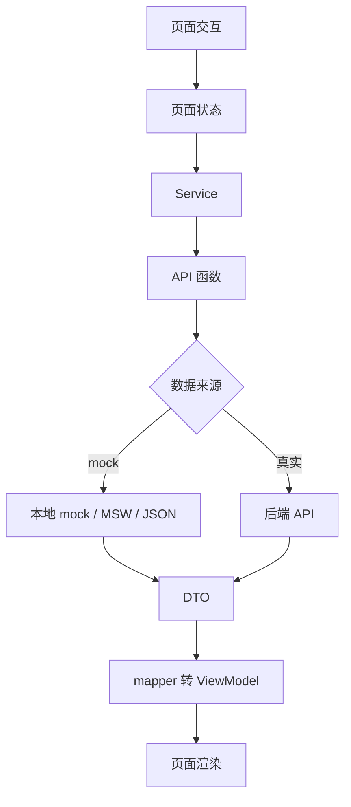
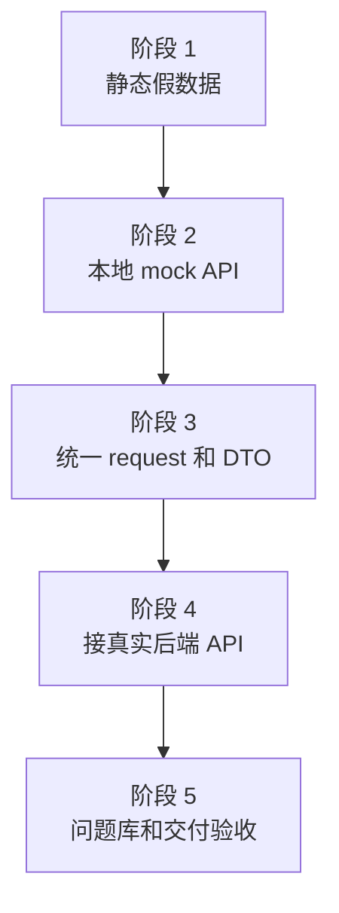
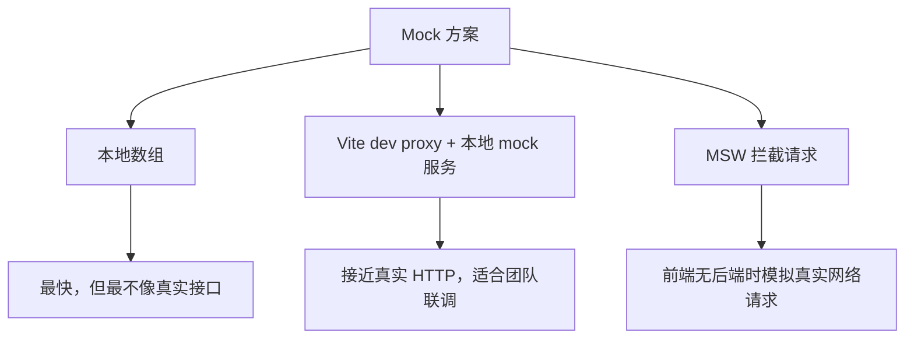
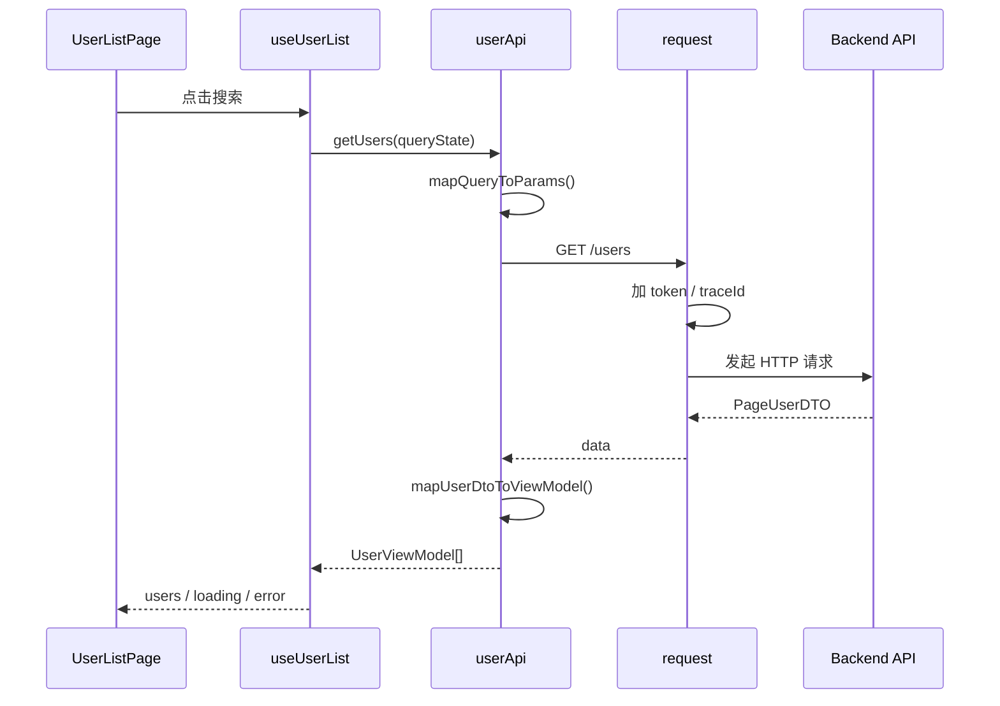
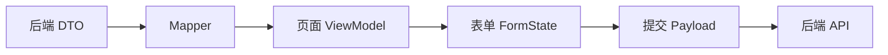
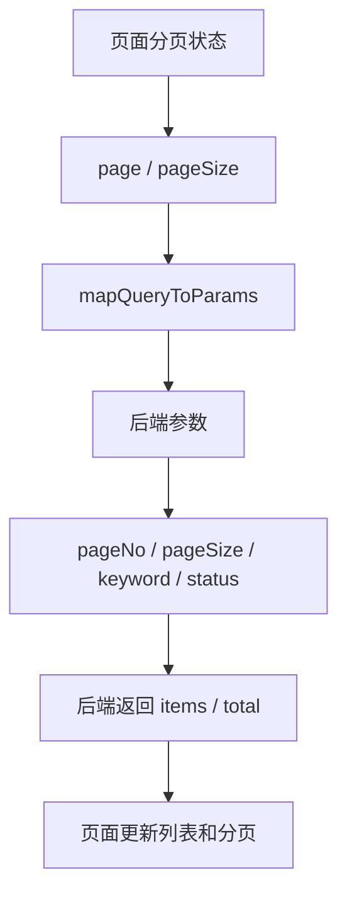
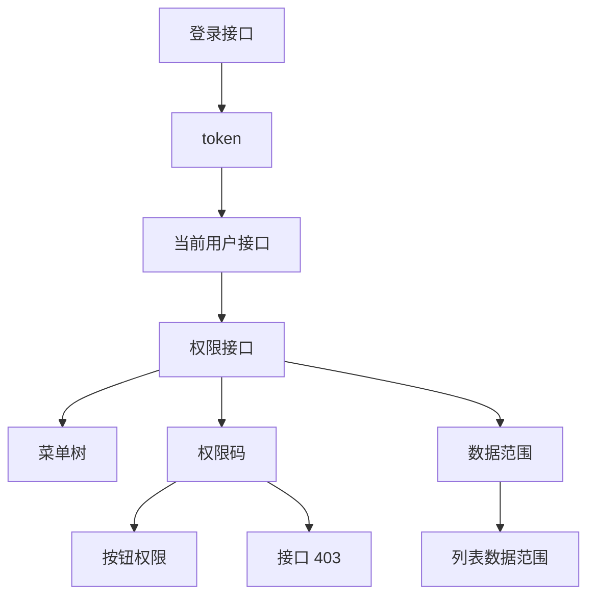
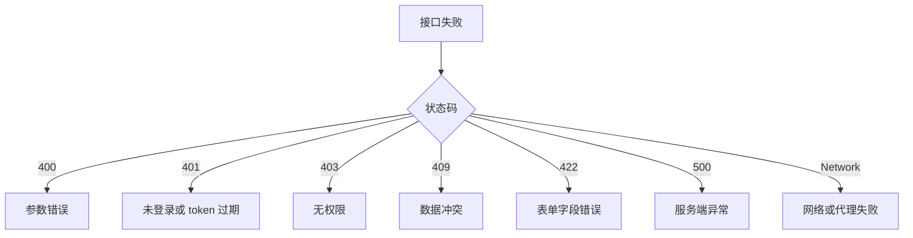
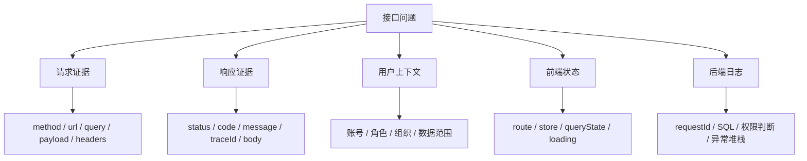
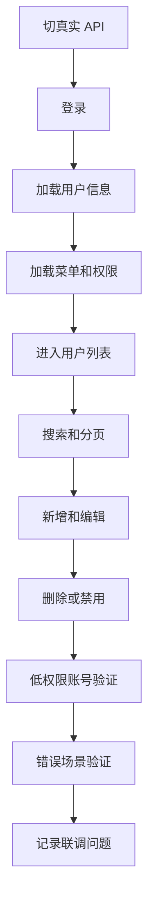

# Vue Admin Mock 到真实接口联调实战

## 这个页面解决什么

很多 Vue Admin 项目一开始会用本地 mock 数据把页面做出来：用户列表能显示，搜索能筛选，弹窗能打开，保存也能“成功”。但一接真实后端接口，问题马上出现：

- 本地 mock 正常，真实接口 401。
- 列表字段名对不上，页面显示空白。
- 前端传 `page`，后端要 `pageNo`。
- mock 返回数组，真实接口返回 `{ items, total }`。
- 本地保存成功，真实接口返回 422 表单校验错误。
- 菜单有权限，但接口返回 403。
- 开发环境能调通，测试环境跨域或代理失败。
- 后端说前端参数错，前端说接口文档不清。

这一页专门讲“从 mock 切到真实 API”的联调闭环。它不是泛泛讲请求封装，而是把真实项目里从假数据、接口约定、环境配置、DTO 转换、联调证据、错误分类、验收清单串起来。

## 适合谁看

- 已经有 Vue Admin 页面，但还没接真实接口的人。
- 正在从 mock 数据切换到后端 API 的人。
- 经常在联调时卡在字段、分页、401、403、CORS、代理、环境变量的人。
- 想把前后端联调变成可复盘流程，而不是靠聊天记录猜问题的人。
- 已经看完 [图解 Vue Admin 项目架构](/vue/admin-architecture-visual-guide)，准备进入真实项目交付的人。

## 联调心智模型

Mock 到真实接口不是“把 URL 换一下”。它是从“前端自己定义数据”切换到“前后端共同遵守契约”。



关键点：

1. 页面不应该知道当前数据来自 mock 还是真实 API。
2. Service 和 API 层要保持稳定，切换数据来源时尽量不改页面组件。
3. DTO 到 ViewModel 的转换要明确，避免后端字段一变页面全坏。
4. 联调时要保存请求证据，而不是只说“接口不对”。

## 最终目标

完成这页后，你的 Vue Admin 项目应该具备这些能力：

| 能力 | 说明 |
| --- | --- |
| mock 和真实 API 可切换 | 通过环境变量或配置切换，不改页面代码 |
| 请求入口统一 | 所有 API 经过 request 实例和拦截器 |
| DTO 转换明确 | 后端字段和页面字段不强行混用 |
| 分页、排序、筛选有映射 | 前端查询状态能稳定转成后端参数 |
| 401/403 可区分 | 登录失效和无权限不是同一种错误 |
| 表单错误可映射 | 422 字段错误能回填到表单 |
| traceId 可追踪 | 前后端能用同一个请求 id 查日志 |
| 联调证据可复盘 | URL、method、headers、payload、status、body 都能记录 |
| 验收清单明确 | 切真实接口前后知道该验证什么 |

## 推荐联调阶段

不要一开始就把所有页面都接真实接口。推荐按 5 个阶段推进：



| 阶段 | 目标 | 通过标准 |
| --- | --- | --- |
| 静态假数据 | 先把页面结构做出来 | 页面能展示、搜索、弹窗能打开 |
| 本地 mock API | 让页面像调接口一样工作 | service 返回 Promise，页面不直接读本地数组 |
| 统一 request 和 DTO | 建立数据边界 | DTO、ViewModel、Payload 分开 |
| 接真实 API | 与后端契约对齐 | 列表、详情、保存、删除、权限、错误都能处理 |
| 问题库验收 | 沉淀联调经验 | 有 TROUBLESHOOTING.md 和验收清单 |

## 推荐目录结构

```text
src/
  app/
    config/
      env.ts
    stores/
      auth.ts
      permission.ts
  shared/
    request/
      index.ts
      error.ts
      trace.ts
    mock/
      browser.ts
      handlers/
  features/
    users/
      services/
        userApi.ts
        userMock.ts
        userMapper.ts
      model/
        user.dto.ts
        user.model.ts
        user.payload.ts
      composables/
        useUserList.ts
      UserListPage.vue
```

职责说明：

| 文件 | 职责 |
| --- | --- |
| `env.ts` | 读取环境变量，决定 API 地址和 mock 开关 |
| `request/index.ts` | 创建请求实例，统一 token、traceId、错误 |
| `mock/browser.ts` | 开发环境启动 mock worker 或 mock server |
| `userApi.ts` | 真实接口函数 |
| `userMock.ts` | mock 数据源或 mock handler |
| `userMapper.ts` | DTO、ViewModel、Payload 转换 |
| `useUserList.ts` | 页面查询、分页、loading、刷新逻辑 |

## 环境变量和接口地址

Vite 项目里，前端能读取的环境变量要使用 `VITE_` 前缀。不要把数据库密码、后端密钥、私有 token 放进 `VITE_` 变量，因为它们会进入前端产物。

推荐环境文件：

```text
.env.development
.env.mock
.env.staging
.env.production
```

示例：

```env
VITE_API_BASE_URL=/api
VITE_USE_MOCK=true
VITE_APP_ENV=mock
```

在代码里集中读取：

```ts
export const appEnv = {
  apiBaseUrl: import.meta.env.VITE_API_BASE_URL,
  useMock: import.meta.env.VITE_USE_MOCK === 'true',
  appEnv: import.meta.env.VITE_APP_ENV
}
```

注意：

- 环境变量通常是字符串，布尔值和数字要自己转换。
- 修改 `.env` 后要重启 dev server。
- `VITE_*` 不要放敏感信息。
- `mock`、`staging`、`production` 要明确区分，避免本地误连生产。

## Mock 方案怎么选

常见 mock 方式有三种：



| 方案 | 适合阶段 | 优点 | 注意点 |
| --- | --- | --- | --- |
| 本地数组 | 静态页面阶段 | 简单、快 | 容易让页面直接依赖假结构 |
| 本地 mock 服务 | 页面联调阶段 | 请求链路接近真实 | 要维护接口路径和响应结构 |
| MSW | 前端独立开发、测试 | 在网络层拦截请求 | 要管理 handler 和启动时机 |
| 真实 API | 正式联调 | 最接近上线 | 需要后端、账号、权限、环境稳定 |

推荐顺序：

1. 页面第一版可以用本地数组。
2. 一旦出现 service 层，就改成 Promise 风格 mock。
3. 进入联调前，让 mock 响应结构尽量和真实接口一致。
4. 真实接口接通后，mock 仍保留用于离线开发和异常场景测试。

## 请求链路图

从页面到真实接口的完整链路如下：



联调时如果页面显示异常，要沿着这条链路逐层确认：

- 页面是否触发了查询。
- 查询条件是否正确。
- service 是否转成后端需要的参数。
- request 是否带了 token 和 traceId。
- 后端响应结构是否符合约定。
- mapper 是否把 DTO 正确转成页面模型。
- composable 是否把结果写入当前页面状态。

## DTO、ViewModel、Payload 分层

真实接口接入后，最容易出问题的是类型边界。



示例：

```ts
export interface UserDTO {
  id: string
  user_name: string
  enabled: 0 | 1
  role_ids: string[]
  created_at: string
}

export interface UserViewModel {
  id: string
  name: string
  statusText: string
  enabled: boolean
  roleIds: string[]
  createdAtText: string
}

export interface UserPayload {
  name: string
  enabled: boolean
  roleIds: string[]
}
```

转换函数：

```ts
export function mapUserDto(dto: UserDTO): UserViewModel {
  return {
    id: dto.id,
    name: dto.user_name,
    enabled: dto.enabled === 1,
    statusText: dto.enabled === 1 ? '启用' : '禁用',
    roleIds: dto.role_ids,
    createdAtText: formatDateTime(dto.created_at)
  }
}

export function mapUserPayload(form: UserFormState): UserPayload {
  return {
    name: form.name.trim(),
    enabled: form.enabled,
    roleIds: [...form.roleIds]
  }
}
```

不要让页面到处写 `dto.user_name`。字段转换一旦散落，后端改字段时会全站搜索修改。

## 分页参数联调

分页是联调高频返工点。先约定清楚前后端参数。



前端页面状态：

```ts
interface UserQueryState {
  page: number
  pageSize: number
  keyword: string
  status: 'all' | 'enabled' | 'disabled'
}
```

映射为后端参数：

```ts
function mapUserQuery(query: UserQueryState) {
  return {
    pageNo: query.page,
    pageSize: query.pageSize,
    keyword: query.keyword || undefined,
    enabled:
      query.status === 'all'
        ? undefined
        : query.status === 'enabled'
  }
}
```

联调时重点检查：

| 检查点 | 为什么 |
| --- | --- |
| 页码从 1 还是从 0 开始 | 前端组件和后端 SQL 分页可能不一致 |
| `pageSize` 最大值 | 防止一次请求大量数据 |
| 空搜索条件是否传 `undefined` | 防止后端把空字符串当有效条件 |
| 状态枚举怎么传 | `enabled=true` 和 `status=enabled` 不能混用 |
| 总数来自哪里 | 分页器必须使用后端 `total` |

## 登录和权限联调

真实接口接入后，登录态和权限一定要一起验证。



联调顺序：

1. 登录接口返回 token。
2. 请求当前用户信息成功。
3. 请求菜单和权限码成功。
4. 动态路由注册成功。
5. 用户列表接口带 token。
6. 无权限按钮不显示。
7. 直接请求无权限接口返回 403。
8. 数据范围影响列表结果。

不要只验证“管理员账号能访问”。至少准备三类账号：

| 账号 | 用途 |
| --- | --- |
| 管理员 | 验证完整菜单和全部接口 |
| 普通用户 | 验证按钮权限和数据范围 |
| 无权限用户 | 验证 403、隐藏入口、无权限提示 |

## Vite dev proxy 联调

开发环境常用 Vite dev proxy 解决本地代理和跨域问题。

示例：

```ts
// vite.config.ts
export default defineConfig({
  server: {
    proxy: {
      '/api': {
        target: 'http://localhost:8080',
        changeOrigin: true,
        rewrite: path => path.replace(/^\/api/, '')
      }
    }
  }
})
```

配套环境变量：

```env
VITE_API_BASE_URL=/api
```

联调注意：

| 问题 | 排查 |
| --- | --- |
| 请求没有走代理 | 检查 `baseURL` 是否以 `/api` 开头 |
| 后端收不到路径 | 检查 `rewrite` 是否把前缀删错 |
| Cookie 不生效 | 检查 `withCredentials`、SameSite、domain |
| 生产环境失败 | dev proxy 只在开发服务器生效，生产要配 Nginx 或网关 |

不要把开发代理当成生产代理。上线后前端静态资源服务器不会自动拥有 Vite dev server 的 proxy 能力。

## 错误分类联调

真实接口联调时，错误不能只弹一句“请求失败”。



页面处理建议：

| 错误 | 页面表现 |
| --- | --- |
| 400 | 提示参数错误，保留页面 |
| 401 | 清登录态，跳登录，保留 redirect |
| 403 | 保持登录态，提示无权限或跳 403 |
| 409 | 提示数据已变更，要求刷新 |
| 422 | 字段错误回填到表单 |
| 500 | 提示系统异常，保留 traceId |
| Network | 提示网络异常，提供重试 |

## 422 表单错误映射

后端返回字段错误时，前端应该能回填到表单。

后端响应示例：

```json
{
  "code": "VALIDATION_FAILED",
  "message": "表单校验失败",
  "errors": {
    "name": "用户名不能为空",
    "roleIds": "至少选择一个角色"
  },
  "traceId": "req-20260703-001"
}
```

前端处理：

```ts
function applyFieldErrors(errors: Record<string, string>) {
  Object.entries(errors).forEach(([field, message]) => {
    formErrors.value[field] = message
  })
}
```

注意字段名映射：

| 后端字段 | 前端字段 | 说明 |
| --- | --- | --- |
| `user_name` | `name` | DTO 和表单字段不同 |
| `role_ids` | `roleIds` | 命名风格不同 |
| `department_id` | `departmentId` | 提交字段和显示字段不同 |

如果后端字段名和前端表单字段不同，要有一层 `fieldNameMap`，不要在组件里到处写判断。

## 联调证据清单

每个接口问题都应该留下证据。



推荐复盘模板：

```md
# 接口联调问题：标题

## 现象

## 环境

- 前端环境：
- 后端环境：
- 账号：
- 角色：

## 请求证据

- Method：
- URL：
- Query：
- Payload：
- Headers：

## 响应证据

- Status：
- Body：
- TraceId：

## 定位结论

## 修复方案

## 验证结果

## 预防措施
```

没有证据的联调很容易变成争论。有证据后，问题通常会落到“参数、权限、数据、环境、代码转换”中的某一类。

## Mock 切真实 API 的检查清单

切换前先检查：

| 检查项 | 通过标准 |
| --- | --- |
| 环境变量 | `VITE_API_BASE_URL` 指向正确环境 |
| mock 开关 | 当前环境明确是否启用 mock |
| 接口文档 | 路径、方法、query、body、响应结构明确 |
| DTO 类型 | 与真实响应字段一致 |
| mapper | 能把 DTO 转成页面 ViewModel |
| 分页 | 页码、pageSize、total 对齐 |
| 登录态 | token 能正确写入和携带 |
| 权限 | 菜单、按钮、接口 403 都能验证 |
| 错误 | 400、401、403、422、500 有处理 |
| traceId | Network 和后端日志能对上 |

切换后再验证：



## 常见联调问题

### 问题 1：mock 正常，真实接口列表空白

常见原因：

- 真实接口返回字段和 mock 字段不同。
- 后端包了一层 `data.items`，前端仍按数组处理。
- mapper 没有处理空值。
- 数据权限导致后端返回空列表。

解决：

1. 对比 mock 响应和真实响应。
2. 在 service 层补 DTO 类型。
3. 用 mapper 做字段转换。
4. 如果真实返回空，确认账号数据范围。

### 问题 2：后端说没收到参数

常见原因：

- GET 参数写进 body。
- POST 参数写进 query。
- 文件上传手动设置了错误的 `Content-Type`。
- 前端字段名和后端字段名不一致。

解决：

把接口文档写成表格：

| 参数 | 位置 | 类型 | 必填 | 示例 |
| --- | --- | --- | --- | --- |
| `pageNo` | query | number | 是 | `1` |
| `pageSize` | query | number | 是 | `20` |
| `keyword` | query | string | 否 | `alice` |

### 问题 3：开发环境能通，测试环境失败

常见原因：

- `.env.staging` API 地址错。
- 测试环境网关路径和本地 proxy 不一致。
- token 的 issuer、domain、cookie 策略不同。
- 后端 CORS 没放开测试域名。

解决：

1. 打印当前 `import.meta.env.MODE` 和 `VITE_API_BASE_URL`。
2. 检查 Network 里真实请求 URL。
3. 确认生产或测试环境是否有 Nginx/网关代理。
4. 不要把 Vite dev proxy 当成测试环境配置。

### 问题 4：接口 403，但菜单和按钮都有权限

常见原因：

- 前端权限码和后端接口权限码不是同一个。
- 用户菜单权限有了，但操作权限没有。
- 数据权限不允许操作该条数据。
- 后端缓存了旧权限。

解决：

1. 记录当前用户权限码。
2. 记录接口需要的权限码。
3. 检查数据所属组织和用户数据范围。
4. 检查权限变更后是否刷新 token 或权限缓存。

### 问题 5：真实接口保存成功，但页面仍显示旧数据

常见原因：

- 保存后没有重新请求列表。
- 旧请求晚于新请求返回，覆盖了新数据。
- 列表缓存或 KeepAlive 没刷新。
- 后端异步处理，立即查询还未更新。

解决：

- 保存成功后统一调用 `refresh()`。
- 用请求序号或取消请求避免旧请求覆盖。
- 必要时让后端返回更新后的数据。
- 如果是异步任务，页面展示任务状态而不是假装立即完成。

## 交付前联调验收

一个 Vue Admin 模块从 mock 切真实 API 后，至少验收这些场景：

| 场景 | 验收 |
| --- | --- |
| 管理员登录 | 能进入页面，菜单和按钮完整 |
| 普通用户登录 | 只看到有权限的菜单和按钮 |
| 无权限接口 | 返回 403，页面不跳登录 |
| token 过期 | 返回 401，清上下文并跳登录 |
| 列表分页 | page、pageSize、total 正确 |
| 搜索筛选 | query 与后端参数一致 |
| 新增编辑 | payload 正确，422 能回填字段错误 |
| 删除禁用 | 权限和二次确认正常 |
| 数据权限 | 不同组织用户看到不同数据 |
| 环境切换 | mock、dev、staging、production 地址清楚 |
| traceId | 前端 Network 和后端日志能关联 |
| 问题复盘 | 关键联调问题写入 `TROUBLESHOOTING.md` |

## 参考资料

- [Vite Env Variables and Modes](https://vite.dev/guide/env-and-mode)
- [Vite Server Proxy](https://vite.dev/config/server-options.html#server-proxy)
- [Axios Interceptors](https://axios-http.com/docs/interceptors)
- [Mock Service Worker](https://mswjs.io/docs/)

## 下一步学习

如果你还没搭项目，先看 [图解 Vue Admin 项目架构](/vue/admin-architecture-visual-guide) 和 [Vue 从零到项目落地](/vue/project-from-zero)。  
如果你已经有页面骨架，继续看 [Vue Admin 列表、搜索、分页与表格闭环实战](/vue/admin-list-search-table)，先把后台最常见的列表页模式做稳。  
如果你已经掌握列表页闭环，继续看 [Vue Admin 用户模块实现手册](/vue/admin-user-module)，把列表、表单和权限按钮做完整。  
如果你已经接入真实接口，继续看 [Vue Admin 请求封装与错误处理闭环手册](/vue/admin-request-error-handling) 和 [Vue Admin 请求、权限与数据问题排查专题](/projects/issues-vue-admin-request)，把 401、403、422、重复提交和 traceId 问题沉淀成团队规范。
