# Vue Admin 消息通知、站内信、实时提醒与已读闭环实战

消息通知看起来只是页面右上角一个铃铛，但真实 Vue Admin 项目里，它通常会连接很多业务：

- 审批流：有人提交申请、需要你审批、审批被驳回、流程结束。
- 工作台：待办数量、风险提醒、异常任务、系统公告。
- 文件任务：导入完成、导出失败、模板校验错误。
- 权限系统：只允许某些角色看到某类通知。
- 登录态：切换账号后未读数必须刷新，不能沿用旧用户数据。
- 实时通信：页面不刷新时也要看到新消息。
- 审计与追踪：重要通知要知道是谁触发、什么时候送达、是否已读。

这一页从前端视角把“消息通知中心”拆成业务事件、通知记录、未读数量、消息铃铛、列表页、详情页、已读未读、实时通道、通知偏好和常见问题。目标不是让你背概念，而是让你能在 Vue Admin 中真正做出一个可维护的消息通知模块。

## 适合谁看

- 已经完成 [Vue Admin 审批流、状态机、待办与审计闭环实战](/vue/admin-approval-workflow)，想把审批待办变成消息提醒的人。
- 已经完成 [Vue Admin 工作台、统计卡片、图表看板与数据刷新闭环实战](/vue/admin-dashboard-analytics)，想把待办和异常提醒放进工作台的人。
- 正在做后台右上角铃铛、站内信列表、未读数、消息已读未读的人。
- 想理解轮询、SSE、WebSocket 在 Vue Admin 中怎么选的人。
- 遇到“未读数不准、重复提醒、切换账号后还显示旧消息、WebSocket 反复重连”的人。

## 最终要做到什么

完成本页后，你应该能做出下面这些能力：

| 能力 | 说明 |
| --- | --- |
| 消息铃铛 | 顶部显示未读数量，点击打开最近消息 |
| 站内信列表 | 支持搜索、类型筛选、已读未读筛选、分页 |
| 消息详情 | 能看到标题、正文、来源业务、跳转链接和操作记录 |
| 已读未读 | 支持单条已读、批量已读、全部已读 |
| 实时提醒 | 有新消息时自动更新铃铛和弹出轻提示 |
| 通知偏好 | 用户能配置哪些消息弹窗、哪些只进站内信 |
| 权限范围 | 不该看到的业务消息不会出现在前端 |
| 重连补偿 | 实时连接断开后重新拉取差量消息 |
| 问题排查 | 能定位重复通知、未读数不一致、旧账号数据污染 |

## 一句话心智模型

消息通知不是“前端自己造几条消息”，而是：

> 业务事件发生后，后端生成通知记录并计算接收人；前端负责展示、同步未读数、处理实时提醒、标记已读、跳转业务详情和处理异常状态。

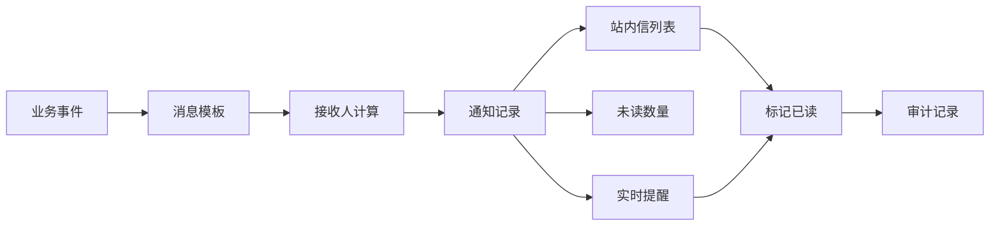

你可以把它想成一个流水线：

1. 业务模块产生事件，例如“审批任务到达”。
2. 后端根据模板生成通知标题、正文、跳转链接。
3. 后端计算谁应该收到通知。
4. 通知被保存为站内信记录。
5. 前端通过接口展示列表和未读数。
6. 如果接入实时通道，前端还能立即收到新消息事件。
7. 用户读取后，前端调用已读接口，后端更新状态。

## 为什么不要只在前端写假通知

很多新手会直接在前端写一个数组：

```ts
const notifications = [
  { title: '你有新的审批待办', read: false },
  { title: '导入任务完成', read: false }
]
```

这个做法只能用于静态演示，真实项目会马上遇到问题：

| 问题 | 为什么前端假数据解决不了 |
| --- | --- |
| 谁该收到消息 | 接收人跟角色、部门、业务归属有关，前端不知道完整规则 |
| 未读数准不准 | 已读状态必须落库，否则换设备后就不一致 |
| 是否重复发送 | 去重和幂等要靠后端业务事件和唯一键控制 |
| 能不能跳转详情 | 需要保存业务类型、业务 ID、路由参数 |
| 是否越权 | 前端只能隐藏，真正的数据权限必须由后端过滤 |
| 离线后怎么办 | 离线期间的新消息需要重新拉取 |

所以前端要做的是“把后端通知能力接好”，而不是自己定义一套孤立消息系统。

## 模块边界

消息通知中心在 Vue Admin 中通常放在 `features/notifications`，不要散落在布局、工作台和审批页面里。

```text
src/
  features/
    notifications/
      api/
        notificationApi.ts
      components/
        NotificationBell.vue
        NotificationDropdown.vue
        NotificationList.vue
        NotificationPreferencePanel.vue
      composables/
        useNotificationList.ts
        useUnreadCount.ts
        useNotificationRealtime.ts
      model/
        notificationTypes.ts
      pages/
        NotificationCenterPage.vue
        NotificationDetailPage.vue
      routes.ts
  shared/
    request/
    realtime/
    permissions/
```

职责拆分如下：

| 位置 | 职责 |
| --- | --- |
| `api/notificationApi.ts` | 只封装接口请求，不写页面状态 |
| `model/notificationTypes.ts` | 定义 DTO、查询参数、枚举和前端视图模型 |
| `composables/useUnreadCount.ts` | 管理未读数加载、刷新和局部更新 |
| `composables/useNotificationList.ts` | 管理列表查询、分页、筛选、已读动作 |
| `composables/useNotificationRealtime.ts` | 管理轮询、SSE 或 WebSocket 连接 |
| `components/NotificationBell.vue` | 顶部铃铛，只关心展示和打开下拉 |
| `components/NotificationDropdown.vue` | 展示最近消息和快捷操作 |
| `pages/NotificationCenterPage.vue` | 完整站内信列表页 |
| `pages/NotificationDetailPage.vue` | 消息详情和跳转业务入口 |

## 推荐路由

消息通知建议有独立页面，不要只做下拉框：

```ts
export const notificationRoutes = [
  {
    path: '/notifications',
    name: 'NotificationCenter',
    component: () => import('./pages/NotificationCenterPage.vue'),
    meta: {
      title: '消息中心',
      requiresAuth: true,
      permission: 'notification:read'
    }
  },
  {
    path: '/notifications/:id',
    name: 'NotificationDetail',
    component: () => import('./pages/NotificationDetailPage.vue'),
    meta: {
      title: '消息详情',
      requiresAuth: true,
      permission: 'notification:read',
      hidden: true
    }
  }
]
```

路由设计要注意：

- `/notifications` 是列表页，可以放在个人中心或系统消息分组下。
- `/notifications/:id` 是详情页，通常不放侧边栏，但要有稳定 `name`。
- 铃铛下拉只展示最近几条，不能替代完整列表页。
- 从消息跳转业务详情时，优先使用后端返回的 `targetRouteName` 和 `targetParams`，不要前端硬编码所有业务类型。

## 通知类型建模

先把类型定义清楚，后续页面会轻松很多。

```ts
export type NotificationChannel = 'in_app' | 'email' | 'sms' | 'wechat_work'

export type NotificationType =
  | 'system_announcement'
  | 'approval_todo'
  | 'approval_result'
  | 'file_task'
  | 'security_alert'
  | 'business_warning'

export type NotificationReadStatus = 'unread' | 'read'

export type NotificationPriority = 'low' | 'normal' | 'high' | 'urgent'

export interface NotificationDTO {
  id: string
  title: string
  content: string
  type: NotificationType
  priority: NotificationPriority
  readStatus: NotificationReadStatus
  channels: NotificationChannel[]
  sourceModule: string
  sourceBizId?: string
  targetRouteName?: string
  targetParams?: Record<string, string | number>
  createdAt: string
  readAt?: string
  senderName?: string
}

export interface NotificationListQuery {
  keyword?: string
  type?: NotificationType
  readStatus?: NotificationReadStatus
  priority?: NotificationPriority
  page: number
  pageSize: number
}

export interface UnreadCountDTO {
  total: number
  urgent: number
  approvalTodo: number
}

export interface NotificationPreferenceDTO {
  type: NotificationType
  inAppEnabled: boolean
  popupEnabled: boolean
  emailEnabled: boolean
  quietHoursEnabled: boolean
}

export interface RealtimeEventDTO {
  eventId: string
  eventType: 'notification_created' | 'notification_read' | 'unread_count_changed'
  notification?: NotificationDTO
  unreadCount?: UnreadCountDTO
  occurredAt: string
}
```

几个字段特别重要：

| 字段 | 作用 |
| --- | --- |
| `type` | 决定图标、颜色、筛选项和默认跳转逻辑 |
| `priority` | 决定是否弹窗、是否置顶、是否显示强提醒 |
| `readStatus` | 决定未读样式和未读数 |
| `sourceModule` | 表示来自审批、文件、系统、安全等哪个模块 |
| `sourceBizId` | 用于定位原始业务数据 |
| `targetRouteName` | 用于跳转业务详情 |
| `targetParams` | 用于构造路由参数 |
| `eventId` | 用于实时消息去重 |

## 生命周期图

一条通知从产生到完成，通常有这些状态：

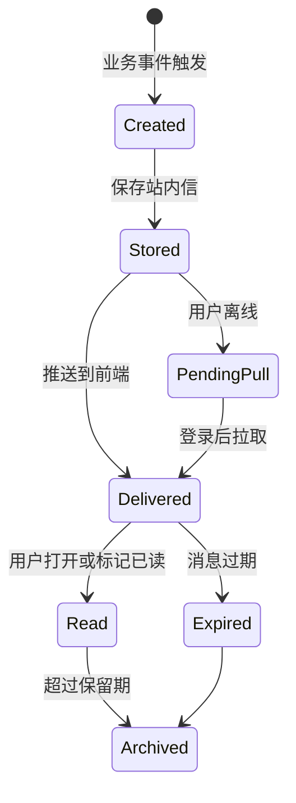

前端主要处理 `Delivered` 到 `Read` 之间的体验：

- 新消息来了，铃铛未读数增加。
- 下拉列表展示新消息。
- 用户点击消息后进入详情或业务页面。
- 前端调用已读接口。
- 未读数减少。
- 如果接口失败，页面不能直接假装成功。

## 后端接口契约

前端至少需要这些接口：

| 接口 | 方法 | 说明 |
| --- | --- | --- |
| `/api/notifications` | `GET` | 分页查询消息列表 |
| `/api/notifications/recent` | `GET` | 查询最近消息，用于铃铛下拉 |
| `/api/notifications/unread-count` | `GET` | 查询未读数量 |
| `/api/notifications/{id}` | `GET` | 查询消息详情 |
| `/api/notifications/{id}/read` | `POST` | 单条标记已读 |
| `/api/notifications/read-batch` | `POST` | 批量标记已读 |
| `/api/notifications/read-all` | `POST` | 全部标记已读 |
| `/api/notification-preferences` | `GET` | 查询通知偏好 |
| `/api/notification-preferences` | `PUT` | 保存通知偏好 |
| `/api/notifications/events` | `GET` | SSE 事件流，可选 |

`notificationApi.ts` 可以这样组织：

```ts
import { request } from '@/shared/request'
import type {
  NotificationDTO,
  NotificationListQuery,
  NotificationPreferenceDTO,
  UnreadCountDTO
} from '../model/notificationTypes'

export interface PageResult<T> {
  list: T[]
  total: number
}

export function getNotificationList(params: NotificationListQuery) {
  return request.get<PageResult<NotificationDTO>>('/api/notifications', { params })
}

export function getRecentNotifications() {
  return request.get<NotificationDTO[]>('/api/notifications/recent')
}

export function getUnreadCount() {
  return request.get<UnreadCountDTO>('/api/notifications/unread-count')
}

export function markNotificationRead(id: string) {
  return request.post(`/api/notifications/${id}/read`)
}

export function markNotificationsRead(ids: string[]) {
  return request.post('/api/notifications/read-batch', { ids })
}

export function markAllNotificationsRead() {
  return request.post('/api/notifications/read-all')
}

export function getNotificationPreferences() {
  return request.get<NotificationPreferenceDTO[]>('/api/notification-preferences')
}

export function updateNotificationPreferences(payload: NotificationPreferenceDTO[]) {
  return request.put('/api/notification-preferences', payload)
}
```

注意：不要让 API 文件直接操作 Pinia、路由或弹窗。API 层只负责请求。

## 页面关系图

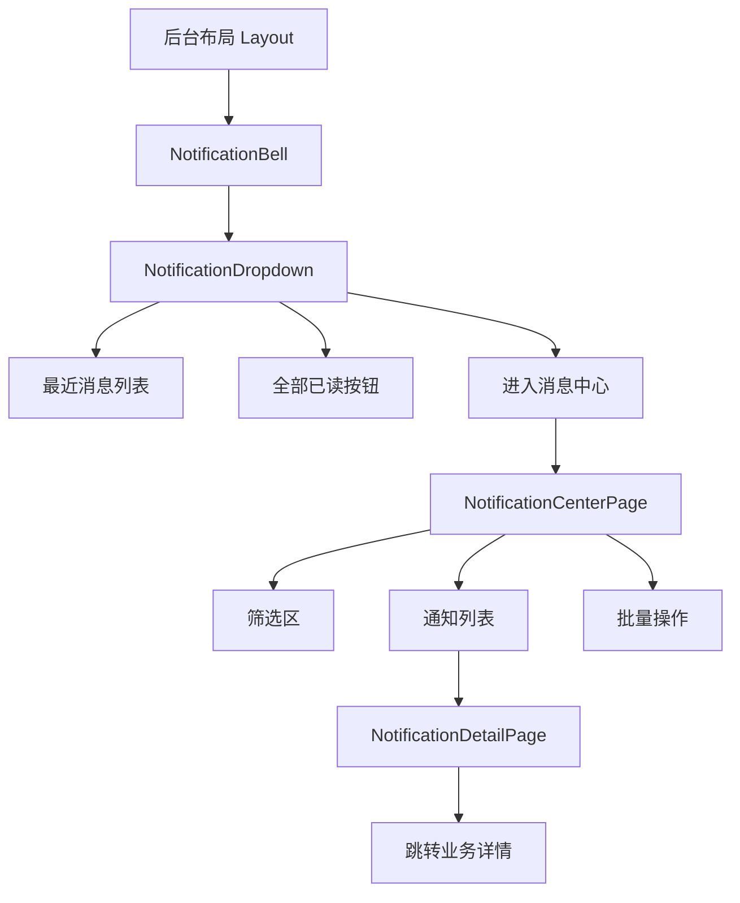

这个图说明：

- 铃铛是全局布局的一部分。
- 下拉框只展示最近消息，不做复杂筛选。
- 完整筛选和批量操作放在消息中心页。
- 消息详情页负责解释消息内容，并提供业务跳转。

## 未读数量 composable

未读数量会被多个地方使用：顶部铃铛、工作台待办卡片、移动端底部菜单。所以建议单独封装。

```ts
import { computed, ref } from 'vue'
import { getUnreadCount } from '../api/notificationApi'
import type { UnreadCountDTO } from '../model/notificationTypes'

const unreadCount = ref<UnreadCountDTO>({
  total: 0,
  urgent: 0,
  approvalTodo: 0
})

const loading = ref(false)

export function useUnreadCount() {
  const hasUnread = computed(() => unreadCount.value.total > 0)
  const badgeText = computed(() => {
    if (unreadCount.value.total > 99) return '99+'
    return String(unreadCount.value.total)
  })

  async function refreshUnreadCount() {
    loading.value = true
    try {
      unreadCount.value = await getUnreadCount()
    } finally {
      loading.value = false
    }
  }

  function applyUnreadCount(next: UnreadCountDTO) {
    unreadCount.value = next
  }

  function decreaseUnreadCount(delta = 1) {
    unreadCount.value = {
      ...unreadCount.value,
      total: Math.max(0, unreadCount.value.total - delta)
    }
  }

  function resetUnreadCount() {
    unreadCount.value = {
      total: 0,
      urgent: 0,
      approvalTodo: 0
    }
  }

  return {
    unreadCount,
    hasUnread,
    badgeText,
    loading,
    refreshUnreadCount,
    applyUnreadCount,
    decreaseUnreadCount,
    resetUnreadCount
  }
}
```

这里把 `unreadCount` 放在模块级变量，是为了让多个组件共享同一个响应式状态。但要注意两点：

1. 用户退出登录或切换账号时，必须调用 `resetUnreadCount()`。
2. 如果系统需要多租户切换，也要在租户切换时重新拉取未读数。

## 消息列表 composable

消息列表页需要处理查询条件、分页、加载状态、空状态和已读动作。

```ts
import { reactive, ref } from 'vue'
import {
  getNotificationList,
  markAllNotificationsRead,
  markNotificationRead,
  markNotificationsRead
} from '../api/notificationApi'
import type { NotificationDTO, NotificationListQuery } from '../model/notificationTypes'
import { useUnreadCount } from './useUnreadCount'

export function useNotificationList() {
  const query = reactive<NotificationListQuery>({
    keyword: '',
    type: undefined,
    readStatus: undefined,
    priority: undefined,
    page: 1,
    pageSize: 20
  })

  const list = ref<NotificationDTO[]>([])
  const total = ref(0)
  const loading = ref(false)
  const selectedIds = ref<string[]>([])
  const { refreshUnreadCount } = useUnreadCount()

  async function fetchList() {
    loading.value = true
    try {
      const result = await getNotificationList(query)
      list.value = result.list
      total.value = result.total
    } finally {
      loading.value = false
    }
  }

  async function search() {
    query.page = 1
    await fetchList()
  }

  async function markRead(id: string) {
    await markNotificationRead(id)
    const item = list.value.find((notification) => notification.id === id)
    if (item) {
      item.readStatus = 'read'
      item.readAt = new Date().toISOString()
    }
    await refreshUnreadCount()
  }

  async function markSelectedRead() {
    if (selectedIds.value.length === 0) return
    await markNotificationsRead(selectedIds.value)
    const selectedSet = new Set(selectedIds.value)
    list.value = list.value.map((item) => {
      if (!selectedSet.has(item.id)) return item
      return {
        ...item,
        readStatus: 'read',
        readAt: new Date().toISOString()
      }
    })
    selectedIds.value = []
    await refreshUnreadCount()
  }

  async function markAllRead() {
    await markAllNotificationsRead()
    await fetchList()
    await refreshUnreadCount()
  }

  return {
    query,
    list,
    total,
    loading,
    selectedIds,
    fetchList,
    search,
    markRead,
    markSelectedRead,
    markAllRead
  }
}
```

这里没有在标记已读后直接 `total--`，而是调用 `refreshUnreadCount()`。原因是：

- 一次操作可能影响多个未读分类。
- 其他标签页可能也在读消息。
- 后端可能有“只读本页消息”或“全部已读”的差异规则。

如果你为了体验做乐观更新，也要在接口成功后再同步服务端数量。

## 消息铃铛组件

铃铛组件只做三件事：

1. 展示未读数量。
2. 点击打开最近消息。
3. 暴露进入消息中心和全部已读入口。

```vue
<script setup lang="ts">
import { onMounted, ref } from 'vue'
import { useRouter } from 'vue-router'
import { getRecentNotifications, markAllNotificationsRead } from '../api/notificationApi'
import type { NotificationDTO } from '../model/notificationTypes'
import { useUnreadCount } from '../composables/useUnreadCount'

const router = useRouter()
const open = ref(false)
const recentList = ref<NotificationDTO[]>([])
const loading = ref(false)
const { badgeText, hasUnread, refreshUnreadCount } = useUnreadCount()

async function fetchRecentList() {
  loading.value = true
  try {
    recentList.value = await getRecentNotifications()
  } finally {
    loading.value = false
  }
}

async function handleOpenChange(value: boolean) {
  open.value = value
  if (value) {
    await fetchRecentList()
  }
}

async function handleMarkAllRead() {
  await markAllNotificationsRead()
  await Promise.all([fetchRecentList(), refreshUnreadCount()])
}

function goCenter() {
  open.value = false
  router.push({ name: 'NotificationCenter' })
}

onMounted(() => {
  refreshUnreadCount()
})
</script>

<template>
  <NotificationDropdown
    :open="open"
    :loading="loading"
    :items="recentList"
    :badge-text="badgeText"
    :has-unread="hasUnread"
    @open-change="handleOpenChange"
    @mark-all-read="handleMarkAllRead"
    @go-center="goCenter"
  />
</template>
```

实际项目里 `NotificationDropdown` 可以用组件库的 `Dropdown`、`Popover`、`Badge`、`List` 组合。不要为了铃铛手写组件库已经提供的基础控件。

## 实时方案怎么选

消息通知不一定一开始就上 WebSocket。先按业务频率选方案。

| 方案 | 适合场景 | 优点 | 缺点 |
| --- | --- | --- | --- |
| 手动刷新 | 内部低频后台 | 最简单 | 不及时 |
| 定时轮询 | 普通后台、通知不高频 | 容易实现、稳定 | 有延迟、有额外请求 |
| SSE | 服务端单向推送 | 比 WebSocket 简单，适合通知 | 只支持服务端到客户端 |
| WebSocket | 强实时、双向协作 | 实时性强，可双向通信 | 连接管理复杂 |

推荐顺序：

1. 项目早期：未读数接口 + 打开下拉时刷新。
2. 普通后台：每 30 到 60 秒轮询未读数。
3. 审批、告警、客服等需要及时提醒：SSE。
4. 在线协作、客服聊天、多人看板：WebSocket。

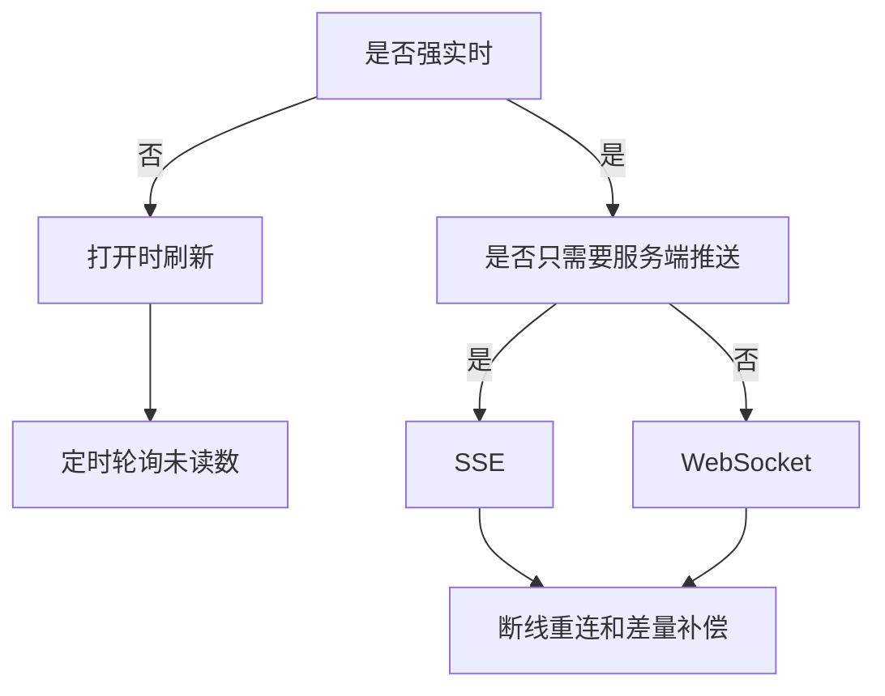

## 轮询实现

轮询适合绝大多数早期 Vue Admin：

```ts
import { onBeforeUnmount, onMounted } from 'vue'
import { useUnreadCount } from './useUnreadCount'

export function useUnreadCountPolling(interval = 30000) {
  let timer: number | undefined
  const { refreshUnreadCount } = useUnreadCount()

  function start() {
    stop()
    refreshUnreadCount()
    timer = window.setInterval(() => {
      refreshUnreadCount()
    }, interval)
  }

  function stop() {
    if (!timer) return
    window.clearInterval(timer)
    timer = undefined
  }

  onMounted(start)
  onBeforeUnmount(stop)

  return {
    start,
    stop
  }
}
```

注意：

- 退出登录时要停止轮询。
- 页面不可见时可以暂停或降低频率。
- 不要每个页面都启动一个轮询，应该放在后台布局或全局初始化处。

## SSE 实现

如果后端支持 SSE，可以封装 `useNotificationRealtime`：

```ts
import { onBeforeUnmount, ref } from 'vue'
import type { RealtimeEventDTO } from '../model/notificationTypes'
import { useUnreadCount } from './useUnreadCount'

export function useNotificationRealtime() {
  const connected = ref(false)
  const reconnecting = ref(false)
  const lastEventId = ref<string>()
  let eventSource: EventSource | undefined
  let reconnectTimer: number | undefined

  const { applyUnreadCount, refreshUnreadCount } = useUnreadCount()

  function handleEvent(event: MessageEvent<string>) {
    const payload = JSON.parse(event.data) as RealtimeEventDTO
    lastEventId.value = payload.eventId

    if (payload.eventType === 'unread_count_changed' && payload.unreadCount) {
      applyUnreadCount(payload.unreadCount)
      return
    }

    if (payload.eventType === 'notification_created') {
      refreshUnreadCount()
    }
  }

  function connect() {
    disconnect()

    const url = lastEventId.value
      ? `/api/notifications/events?lastEventId=${encodeURIComponent(lastEventId.value)}`
      : '/api/notifications/events'

    eventSource = new EventSource(url, { withCredentials: true })

    eventSource.onopen = () => {
      connected.value = true
      reconnecting.value = false
    }

    eventSource.onmessage = handleEvent

    eventSource.onerror = () => {
      connected.value = false
      scheduleReconnect()
    }
  }

  function scheduleReconnect() {
    if (reconnectTimer) return
    reconnecting.value = true
    reconnectTimer = window.setTimeout(() => {
      reconnectTimer = undefined
      connect()
      refreshUnreadCount()
    }, 3000)
  }

  function disconnect() {
    eventSource?.close()
    eventSource = undefined
    connected.value = false

    if (reconnectTimer) {
      window.clearTimeout(reconnectTimer)
      reconnectTimer = undefined
    }
  }

  onBeforeUnmount(disconnect)

  return {
    connected,
    reconnecting,
    connect,
    disconnect
  }
}
```

这个实现有一个关键点：重连后会调用 `refreshUnreadCount()`。原因是实时连接断开的时间里可能漏掉事件，必须用服务端当前未读数做一次补偿。

## WebSocket 接入边界

WebSocket 适合更复杂的实时场景，但不要把所有业务都塞进一个组件里。

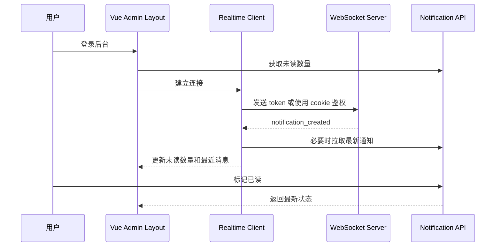

WebSocket 要重点确认：

| 问题 | 处理方式 |
| --- | --- |
| 鉴权 | 连接时携带 token，后端校验用户身份 |
| 续期 | token 过期后关闭连接并触发重新登录或刷新 token |
| 多标签页 | 避免每个标签页都弹同样的强提醒 |
| 重连 | 使用退避策略，不要 1 秒内无限重连 |
| 去重 | 根据 `eventId` 去重 |
| 补偿 | 重连后调用未读数接口和最近消息接口 |

## 已读未读流程

已读操作不能只改前端样式，必须调用后端接口。

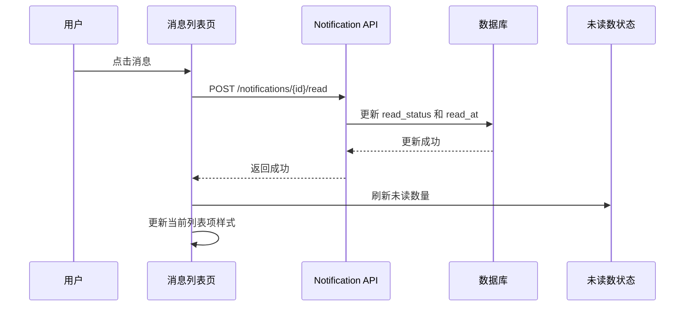

常见策略：

| 策略 | 适合场景 | 注意点 |
| --- | --- | --- |
| 点击消息即已读 | 普通站内信 | 用户误点也会变已读 |
| 打开详情即已读 | 内容较长的消息 | 进入详情后再调用已读接口 |
| 手动标记已读 | 重要提醒 | 操作多一步，但更可控 |
| 批量已读 | 通知很多 | 要确认筛选条件和选中范围 |
| 全部已读 | 系统通知泛滥时 | 后端必须只处理当前用户可见消息 |

## 消息详情页

消息详情页不能只展示标题正文，还要解释来源和下一步动作。

```vue
<script setup lang="ts">
import { onMounted, ref } from 'vue'
import { useRoute, useRouter } from 'vue-router'
import { getNotificationDetail, markNotificationRead } from '../api/notificationApi'
import type { NotificationDTO } from '../model/notificationTypes'

const route = useRoute()
const router = useRouter()
const detail = ref<NotificationDTO>()
const loading = ref(false)

async function fetchDetail() {
  loading.value = true
  try {
    const id = String(route.params.id)
    detail.value = await getNotificationDetail(id)

    if (detail.value.readStatus === 'unread') {
      await markNotificationRead(id)
      detail.value.readStatus = 'read'
      detail.value.readAt = new Date().toISOString()
    }
  } finally {
    loading.value = false
  }
}

function goTarget() {
  if (!detail.value?.targetRouteName) return
  router.push({
    name: detail.value.targetRouteName,
    params: detail.value.targetParams
  })
}

onMounted(fetchDetail)
</script>
```

如果跳转目标不存在或用户没有权限，要给出明确提示：

- “原业务记录已删除。”
- “你当前没有权限查看该记录。”
- “该任务已完成，可以在审批记录中查看结果。”

不要让用户点击后进入 404。

## 通知偏好

通知偏好不是一开始必须做，但成熟后台通常需要。否则所有消息都弹窗，用户会很快忽略提醒。

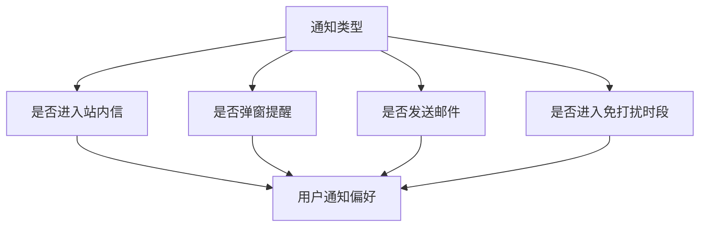

偏好页可以按通知类型配置：

| 通知类型 | 站内信 | 弹窗 | 邮件 | 免打扰 |
| --- | --- | --- | --- | --- |
| 审批待办 | 开 | 开 | 可选 | 不建议免打扰 |
| 审批结果 | 开 | 可选 | 可选 | 可免打扰 |
| 导入导出任务 | 开 | 开 | 关 | 可免打扰 |
| 系统公告 | 开 | 关 | 关 | 可免打扰 |
| 安全告警 | 开 | 开 | 开 | 不允许关闭 |

前端要注意：

- 安全告警这类强制通知不要给关闭入口，或禁用开关并说明原因。
- 偏好配置保存失败时不能假装成功。
- 偏好只影响提醒方式，不应该影响用户是否有权限看到业务消息。

## 权限范围

消息通知的权限有两层：

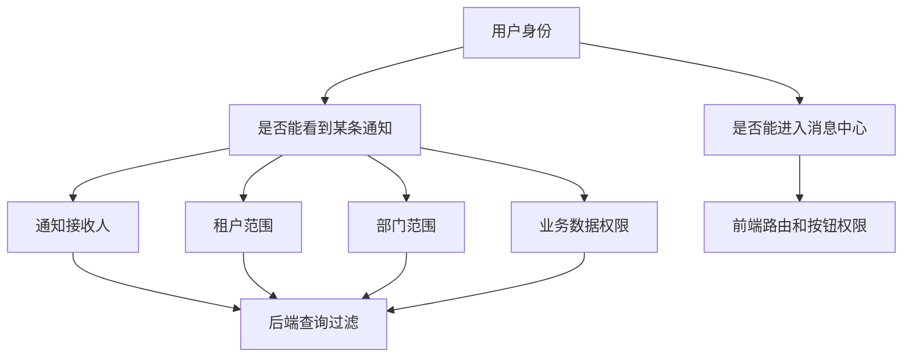

前端可以控制：

- 是否显示消息中心菜单。
- 是否显示铃铛。
- 是否显示某些操作按钮。
- 跳转业务详情前检查路由权限。

后端必须控制：

- 用户只能查询自己收到的通知。
- 用户只能标记自己可见的通知为已读。
- 跨租户、跨部门、跨业务范围的数据不能返回。

不要把“隐藏铃铛”当成消息权限的唯一控制。

## 与审批流的连接

审批流是消息通知最典型的来源。

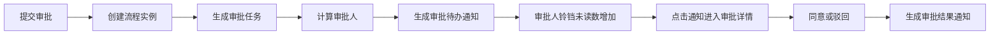

前端接入时要关注：

| 场景 | 消息内容 | 跳转目标 |
| --- | --- | --- |
| 新待办 | 你有一条采购申请需要审批 | 审批详情页 |
| 被驳回 | 你的申请被驳回，请修改后重新提交 | 申请详情页 |
| 审批通过 | 你的申请已审批通过 | 申请详情页 |
| 被转办 | 有一条审批任务转交给你 | 审批详情页 |
| 被催办 | 该任务已超过处理时限 | 审批详情页 |

不要在通知里复制审批流的全部逻辑。通知只负责提醒和跳转，审批动作仍然在审批模块完成。

## 与工作台的连接

工作台可以展示未读消息和待办摘要，但不要把消息中心所有功能搬到工作台。

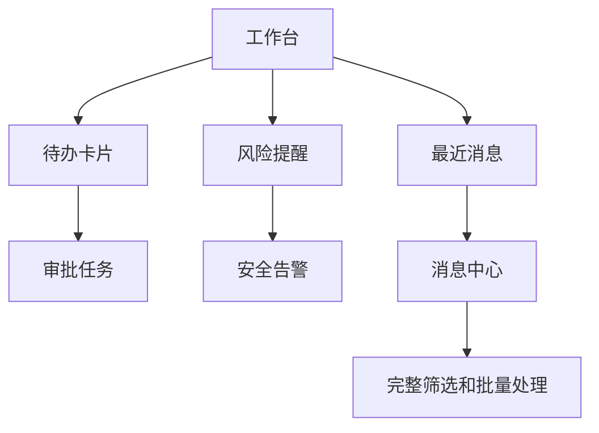

推荐做法：

- 工作台只展示最重要的 5 到 10 条。
- 工作台卡片点击后跳转到业务列表或消息中心。
- 工作台的数据口径要和消息中心一致。
- 工作台不要单独维护一套未读数。

## 与文件导入导出的连接

导入导出任务常常是异步的，非常适合接通知。

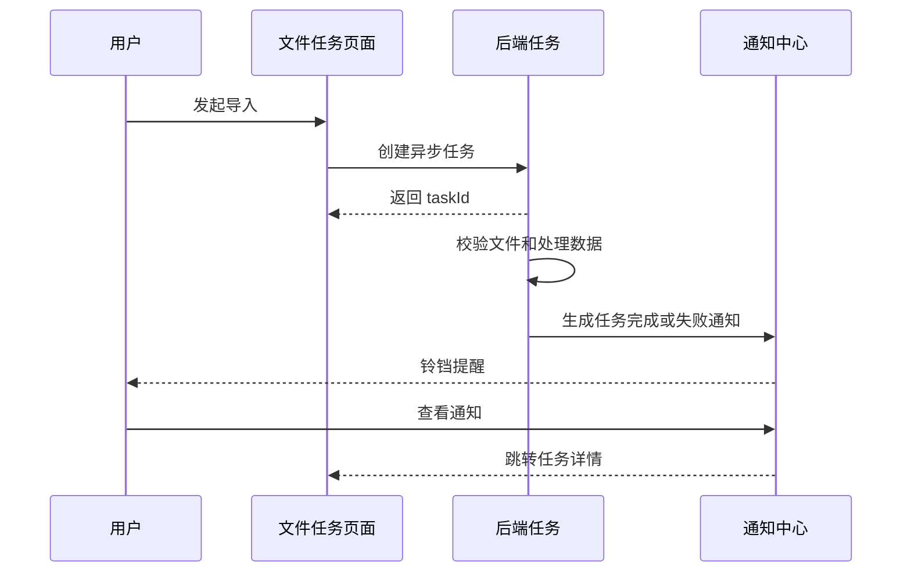

常见消息：

| 任务结果 | 通知标题 | 用户动作 |
| --- | --- | --- |
| 导入成功 | 用户数据导入完成 | 查看导入结果 |
| 部分成功 | 用户数据导入完成，存在失败行 | 下载失败明细 |
| 导入失败 | 用户数据导入失败 | 查看错误原因 |
| 导出完成 | 用户导出文件已生成 | 下载文件 |
| 导出过期 | 导出文件已过期 | 重新发起导出 |

## 登录、退出和切换账号

消息通知很容易出现“账号污染”问题。

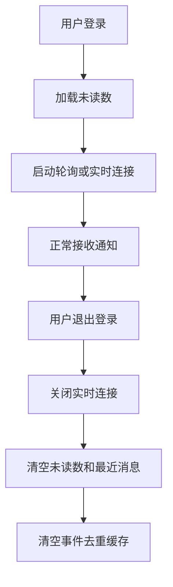

退出登录时必须做：

1. 停止轮询。
2. 关闭 SSE 或 WebSocket。
3. 清空未读数量。
4. 清空最近消息缓存。
5. 清空 `lastEventId` 或按用户维度保存。
6. 取消未完成的消息请求。

如果你只清 token，不清通知状态，下一位登录用户可能短暂看到上一位用户的未读数。

## 多标签页问题

用户可能打开多个后台标签页。通知模块要考虑：

| 问题 | 解决方向 |
| --- | --- |
| 多个标签页都弹窗 | 使用 BroadcastChannel 协调，或只让当前可见页弹窗 |
| 一个标签页已读，另一个仍显示未读 | 监听已读事件或定时刷新未读数 |
| 每个标签页都建立 WebSocket | 可接受但浪费；复杂项目可做主标签页策略 |
| 切换标签后未读数过期 | 页面重新可见时刷新未读数 |

基础方案：

```ts
document.addEventListener('visibilitychange', () => {
  if (document.visibilityState === 'visible') {
    refreshUnreadCount()
  }
})
```

这能解决很多“放了一上午回来未读数不准”的问题。

## 去重和幂等

重复通知是实际项目里非常常见的问题。

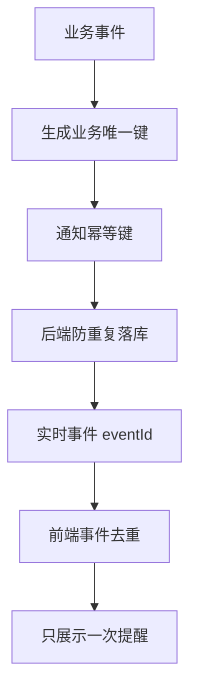

前端可以做事件级去重：

```ts
const handledEventIds = new Set<string>()

function shouldHandleEvent(eventId: string) {
  if (handledEventIds.has(eventId)) return false
  handledEventIds.add(eventId)

  if (handledEventIds.size > 500) {
    const firstEventId = handledEventIds.values().next().value
    handledEventIds.delete(firstEventId)
  }

  return true
}
```

但真正的重复通知要靠后端处理：

- 同一个审批任务不要重复创建多条待办通知。
- 同一个导出任务完成事件不要重复发送。
- 重试发送外部通道时，不要重复创建站内信。

前端去重只是保护用户体验，不能替代后端幂等。

## 列表页交互建议

消息中心列表页建议包含：

| 区域 | 内容 |
| --- | --- |
| 搜索区 | 关键词、类型、已读状态、优先级、时间范围 |
| 工具栏 | 批量已读、全部已读、刷新 |
| 列表区 | 标题、摘要、类型、优先级、创建时间、已读状态 |
| 操作区 | 查看详情、跳转业务、标记已读 |
| 空状态 | 根据筛选条件说明为什么为空 |

布局可以这样理解：

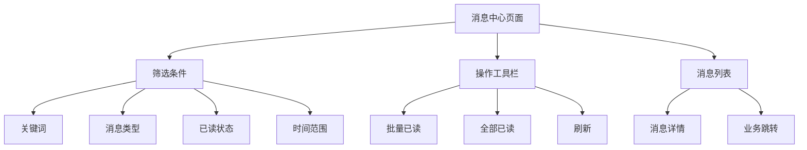

移动端或窄屏时：

- 筛选条件折叠到抽屉或筛选面板。
- 列表改成卡片式信息块。
- 批量操作不要挤在一行。
- 铃铛下拉宽度不要超过视口。

## 常见问题 1：未读数和列表不一致

现象：

- 铃铛显示 3 条未读。
- 进入消息中心后筛选未读只看到 2 条。

排查顺序：

1. 未读数接口和列表接口是否使用同一套权限过滤。
2. 列表是否默认只查某些类型，未读数是否统计全部类型。
3. 是否有过期消息被未读数统计但列表隐藏。
4. 是否有多标签页已读后没有刷新。
5. 是否乐观更新失败后没有回滚。

解决方案：

| 原因 | 处理 |
| --- | --- |
| 接口口径不一致 | 后端统一查询条件和权限范围 |
| 前端筛选默认值不同 | 明确列表默认筛选，并在 UI 中展示 |
| 多标签页不同步 | 页面可见时刷新未读数 |
| 已读失败仍减少数量 | 已读接口失败时不更新本地未读数 |

## 常见问题 2：重复弹出同一条通知

现象：

- 同一条审批待办连续弹两次。
- 刷新页面后又弹一次历史消息。

排查顺序：

1. 后端是否重复生成通知记录。
2. 实时通道是否重连后重放了旧事件。
3. 前端是否没有根据 `eventId` 去重。
4. 弹窗是否对所有未读历史消息都触发，而不是只对新事件触发。

建议：

- 弹窗只响应实时新事件，不要对列表拉取结果逐条弹窗。
- 根据 `eventId` 做短期去重。
- 对历史未读只更新铃铛，不弹强提醒。

## 常见问题 3：切换账号后显示旧消息

现象：

- A 用户退出后，B 用户登录，铃铛短暂显示 A 的未读数。

原因通常是：

- 通知状态存在模块级变量或 Pinia 中，但退出时没有清空。
- 实时连接没有关闭，旧连接继续推送。
- 未完成请求在新用户登录后返回，覆盖了新用户状态。

解决方案：

1. 退出登录时调用 `resetUnreadCount()`。
2. 关闭轮询、SSE、WebSocket。
3. 请求层支持取消旧请求，或者在响应回来时校验当前用户 ID。
4. 登录后重新加载未读数和最近消息。

## 常见问题 4：WebSocket 反复重连

现象：

- 控制台不断出现连接、断开、重连。
- 后端日志出现大量鉴权失败。

排查顺序：

1. token 是否过期。
2. WebSocket 地址是否走了正确环境变量。
3. 代理是否支持升级连接。
4. 后端是否允许跨域和携带凭证。
5. 重连策略是否没有退避。

解决方案：

- 401 或鉴权失败时不要无限重连，应该进入登录态恢复流程。
- 网络错误可以退避重连，例如 3 秒、5 秒、10 秒。
- 重连成功后刷新未读数，补偿断线期间的消息。

## 常见问题 5：消息太多导致用户忽略

现象：

- 用户长期有几十条未读。
- 重要审批提醒被系统公告淹没。

解决方案：

| 问题 | 做法 |
| --- | --- |
| 所有消息都弹窗 | 只让高优先级或用户开启弹窗的类型弹窗 |
| 类型不清晰 | 按审批、文件、安全、系统公告分类 |
| 没有优先级 | 增加 `priority` 字段 |
| 没有偏好 | 增加通知偏好设置 |
| 工作台太吵 | 工作台只展示待办和高优先级提醒 |

通知系统的目标不是“尽量多提醒”，而是“让用户不错过该处理的事情”。

## 常见问题 6：已读接口并发冲突

现象：

- 用户快速点击多条消息。
- 批量已读和单条已读同时发起。
- 未读数偶尔变成负数或跳动。

处理方式：

- 单条已读成功后刷新服务端未读数，不用本地连续减。
- 批量已读期间禁用重复点击。
- 全部已读成功后重新拉列表。
- 后端已读接口要幂等：已经已读的消息再次标记已读应该返回成功。

## 验收清单

| 类别 | 检查项 |
| --- | --- |
| 路由 | `/notifications` 和 `/notifications/:id` 可访问 |
| 铃铛 | 未读数加载、刷新、清空都正确 |
| 列表 | 支持类型、已读状态、优先级和分页 |
| 详情 | 能展示来源、正文、时间、跳转目标 |
| 已读 | 单条、批量、全部已读都调用后端 |
| 实时 | 断线后能重连并刷新未读数 |
| 权限 | 无权限用户看不到不该看的通知 |
| 登录态 | 退出和切换账号后清空旧状态 |
| 多标签页 | 页面重新可见时会刷新未读数 |
| 错误处理 | 已读失败、列表失败、跳转失败都有提示 |

## 练习任务

### 练习 1：做最小消息铃铛

目标：

- 顶部展示未读数量。
- 点击后加载最近 5 条消息。
- 提供“进入消息中心”按钮。

验收：

- 刷新页面后未读数正确。
- 打开下拉时有 loading 状态。
- 无消息时有空状态。

### 练习 2：做消息中心列表

目标：

- 支持关键词、类型、已读状态筛选。
- 支持分页。
- 支持单条标记已读。

验收：

- 筛选后分页回到第一页。
- 已读成功后当前行样式更新。
- 未读数重新从服务端获取。

### 练习 3：接审批待办通知

目标：

- 模拟后端返回一条 `approval_todo` 通知。
- 点击后跳转审批详情页。
- 进入详情后标记已读。

验收：

- 跳转参数正确。
- 无权限时有明确提示。
- 已读后返回列表状态正确。

### 练习 4：接 SSE 或轮询

目标：

- 先实现 30 秒轮询未读数。
- 如果后端支持 SSE，再实现实时事件监听。
- 断线后刷新未读数。

验收：

- 不会启动多个重复定时器。
- 退出登录后停止轮询或断开 SSE。
- 重连后能补偿未读数。

### 练习 5：写一份通知问题复盘

任选一个问题：

- 未读数不一致。
- 重复通知。
- 切换账号旧消息残留。
- WebSocket 反复重连。

按这个模板记录：

```md
# 消息通知问题复盘

## 现象

## 影响范围

## 复现步骤

## 根因

## 修复方案

## 验证方式

## 后续预防
```

## 和其他文档的关系

| 你要做什么 | 继续看 |
| --- | --- |
| 先理解后台项目分层 | [图解 Vue Admin 项目架构](/vue/admin-architecture-visual-guide) |
| 把通知接进审批待办 | [Vue Admin 审批流、状态机、待办与审计闭环实战](/vue/admin-approval-workflow) |
| 把通知放进工作台 | [Vue Admin 工作台、统计卡片、图表看板与数据刷新闭环实战](/vue/admin-dashboard-analytics) |
| 处理请求错误和登录态 | [Vue Admin 请求封装与错误处理闭环手册](/vue/admin-request-error-handling) |
| 处理权限路由和跳转 | [Vue Admin 权限路由闭环实战](/vue/admin-permission-route-flow) |
| 排查未读数、重复通知和实时连接问题 | [Vue Admin 消息通知、未读数与实时提醒问题排查专题](/projects/issues-vue-admin-notification) |
| 做通用项目案例 | [消息通知项目案例](/projects/notification-center-case) |
| 做专项练习 | [Vue Admin 专项练习](/roadmap/vue-admin-practice) |

## 下一步学习

如果你刚完成审批流，建议继续把审批待办、审批结果和催办提醒接入本页的消息通知闭环。这样你的 Vue Admin 就不只是“能处理流程”，而是能在工作台、铃铛、站内信和业务详情之间形成完整体验。

如果你已经完成消息通知闭环，继续看 [Vue Admin 消息通知、未读数与实时提醒问题排查专题](/projects/issues-vue-admin-notification)、[Vue Admin 用户模块实现手册](/vue/admin-user-module)、[Vue Admin 权限路由闭环实战](/vue/admin-permission-route-flow) 和 [Vue Admin 请求、权限与数据问题排查专题](/projects/issues-vue-admin-request)，把通知排障、基础后台模块、权限恢复和真实问题排查继续补齐。
