# Vue Admin 组织架构与数据权限实现手册

## 这个页面解决什么

用户、角色、菜单和动态路由做完以后，后台项目还缺一个关键能力：**用户到底能看到哪些业务数据**。

菜单权限控制“能不能看到入口”，按钮权限控制“能不能点操作”，数据权限控制“进入页面后能看到哪些数据”。很多后台项目做到菜单和按钮就停了，结果用户能进入订单列表，却看到别的部门订单；销售能打开客户页面，却看到其他销售的客户；部门主管能打开报表，却看不到下级部门数据。

这一页专门讲 Vue Admin 中的组织架构与数据权限落地：

- 部门树、岗位、员工、用户账号之间是什么关系。
- 组织架构页面怎么拆分。
- 部门树如何加载、选择、搜索和禁用。
- 员工列表如何按部门过滤。
- 角色里的 `dataScope` 怎么影响列表查询。
- 前端应该展示哪些数据范围提示。
- 查询参数里哪些字段可以由前端传，哪些必须由后端计算。
- 为什么数据权限不能只靠前端筛选。
- 项目里常见的“看不到数据”和“看到太多数据”怎么排查。

## 适合谁看

- 已经看完 [Vue Admin 菜单与动态路由实现手册](/vue/admin-menu-route-module)，准备继续做组织和数据范围的人。
- 正在做企业后台、SaaS 控制台、人事组织、CRM、工单、订单、财务报表的人。
- 需要实现“本人、本部门、本部门及下级、指定部门、全部数据”的开发者。
- 遇到列表缺数据、跨部门越权、部门树选中混乱、员工离职后权限残留的人。

## 先建立边界

组织架构和数据权限不是一个页面的事情，它会影响很多模块。

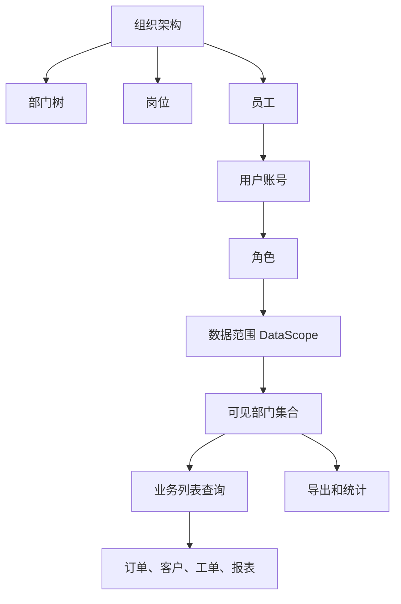

这张图里有三条职责边界：

| 边界 | 前端做什么 | 后端做什么 |
| --- | --- | --- |
| 组织展示 | 展示部门树、员工、岗位、负责人 | 存储组织关系，校验循环和禁用 |
| 数据范围配置 | 给角色选择数据范围和自定义部门 | 根据角色、用户、部门计算可见范围 |
| 业务查询 | 展示范围提示，提交业务筛选条件 | 强制追加数据范围过滤条件 |

前端可以帮助用户理解自己为什么看不到数据，但真正的数据过滤必须在后端完成。

## 最终能力清单

第一版组织架构与数据权限模块应覆盖：

| 能力 | 说明 |
| --- | --- |
| 部门树 | 展示公司、部门、子部门，支持搜索、选中、禁用 |
| 部门详情 | 查看部门负责人、成员数量、子部门数量 |
| 员工列表 | 按部门筛选员工，支持在职、停用、离职状态 |
| 员工归属 | 员工绑定部门、岗位、直属上级和账号 |
| 角色数据范围 | 角色配置本人、本部门、本部门及下级、指定部门、全部 |
| 自定义部门 | 部分角色可选择多个可见部门 |
| 数据范围提示 | 列表页展示当前可见范围说明 |
| 查询参数约束 | 前端只传业务筛选，后端计算最终数据范围 |
| 导出范围 | 导出接口使用同样的数据权限 |
| 排障能力 | 能解释为什么某个用户看不到或看到了某条数据 |

## 一、核心数据模型

组织架构通常有 5 个核心对象：

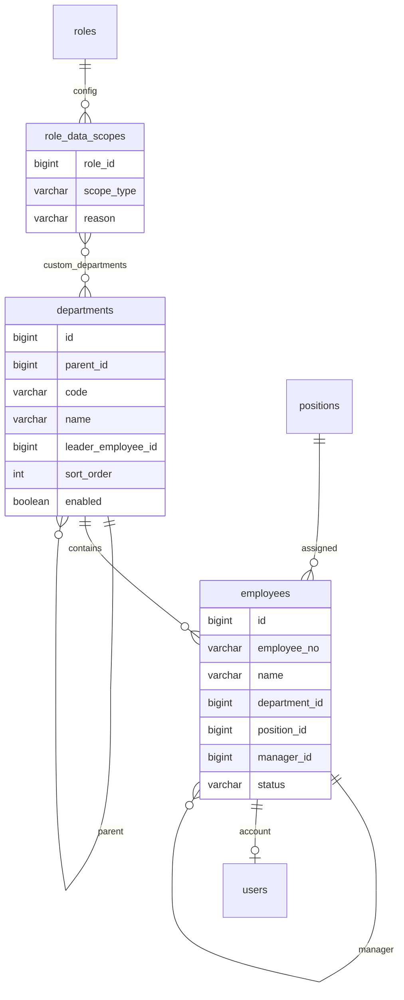

对象说明：

| 对象 | 解决什么问题 |
| --- | --- |
| 部门 `Department` | 组织树、数据归属、报表维度 |
| 岗位 `Position` | 员工岗位、职责说明、审批候选人 |
| 员工 `Employee` | 自然人身份、部门归属、直属上级 |
| 用户 `User` | 登录账号、登录态、角色绑定 |
| 数据范围 `DataScope` | 决定用户能看哪些部门或数据 |

注意：员工和用户账号不要强行合并。员工是组织里的自然人，用户是系统登录账号。一个员工可能没有账号，一个账号也可能是系统集成账号，不一定对应员工。

## 二、推荐目录结构

组织架构和数据权限可以拆成两个 feature，但共享模型要保持一致。

```text
src/
  features/
    organization/
      components/
        DepartmentDetail.vue
        DepartmentFormDrawer.vue
        DepartmentTreePanel.vue
        EmployeeFormDrawer.vue
        EmployeeSearchForm.vue
        EmployeeTable.vue
        PositionFormDialog.vue
        PositionTable.vue
      composables/
        useDepartmentTree.ts
        useEmployeeList.ts
        useEmployeeForm.ts
        usePositionList.ts
      model/
        organization.mapper.ts
        organization.types.ts
        organization.constants.ts
      services/
        departmentService.ts
        employeeService.ts
        positionService.ts
      OrganizationPage.vue
    permissions/
      components/
        DataScopeSelector.vue
        CustomDepartmentSelector.vue
      composables/
        useRoleDataScope.ts
      model/
        data-scope.types.ts
  shared/
    organization/
      department-tree.ts
      data-scope-label.ts
```

目录原则：

- `features/organization` 管理部门、岗位、员工。
- `features/permissions` 管理角色授权和角色数据范围。
- `shared/organization` 放跨页面复用的数据范围标签、部门树工具函数。
- 业务模块只使用数据范围结果，不直接实现组织架构逻辑。

## 三、数据范围类型

先统一枚举。不要让不同模块各自写一套 `dept`、`department`、`department_tree`。

`features/permissions/model/data-scope.types.ts`：

```ts
export type DataScopeType =
  | 'self'
  | 'department'
  | 'department_tree'
  | 'custom'
  | 'all'

export interface RoleDataScopeDTO {
  role_id: number
  scope_type: DataScopeType
  custom_department_ids: number[]
  reason: string | null
}

export interface RoleDataScope {
  roleId: number
  scopeType: DataScopeType
  customDepartmentIds: number[]
  reasonText: string
}

export interface SaveRoleDataScopePayload {
  roleId: number
  scopeType: DataScopeType
  customDepartmentIds: number[]
  reason?: string
}

export interface CurrentUserDataScope {
  scopeType: DataScopeType
  scopeLabel: string
  departmentIds: number[]
  departmentNames: string[]
  reasonText?: string
}
```

范围说明：

| 类型 | 中文 | 可见范围 | 常见角色 |
| --- | --- | --- | --- |
| `self` | 本人 | 自己创建、负责或归属的数据 | 普通销售、客服 |
| `department` | 本部门 | 当前员工所属部门数据 | 部门成员 |
| `department_tree` | 本部门及下级 | 所属部门和所有子部门 | 部门主管、大区负责人 |
| `custom` | 指定部门 | 授权选择的多个部门 | 财务专员、区域运营 |
| `all` | 全部数据 | 系统全部业务数据 | 超级管理员、审计管理员 |

### 为什么需要 `custom`

真实项目里经常有跨部门协作角色：

- 财务可以看多个业务部门的订单，但不能看所有部门。
- 区域运营可以看华东和华南，但不能看总部。
- 审计人员临时复核某几个部门。

如果没有 `custom`，团队只能给这些人开 `all`，权限会越开越大。

## 四、组织类型设计

`features/organization/model/organization.types.ts`：

```ts
export type EmployeeStatus = 'active' | 'disabled' | 'left'

export interface DepartmentDTO {
  id: number
  parent_id: number | null
  code: string
  name: string
  leader_employee_id: number | null
  leader_name: string | null
  sort_order: number
  enabled: boolean
  employee_count: number
  children?: DepartmentDTO[]
}

export interface DepartmentNode {
  id: number
  parentId: number | null
  code: string
  title: string
  leaderEmployeeId?: number
  leaderName: string
  sortOrder: number
  enabled: boolean
  employeeCount: number
  children: DepartmentNode[]
}

export interface EmployeeDTO {
  id: number
  employee_no: string
  name: string
  department_id: number
  department_name: string
  position_id: number | null
  position_name: string | null
  manager_id: number | null
  manager_name: string | null
  user_id: number | null
  status: EmployeeStatus
  joined_at: string | null
  left_at: string | null
}

export interface EmployeeListItem {
  id: number
  employeeNo: string
  name: string
  departmentId: number
  departmentName: string
  positionId?: number
  positionName: string
  managerId?: number
  managerName: string
  userId?: number
  status: EmployeeStatus
  statusLabel: string
  joinedAtText: string
  leftAtText: string
}

export interface EmployeeQuery {
  keyword: string
  departmentId?: number
  includeChildren: boolean
  status?: EmployeeStatus
  page: number
  pageSize: number
}
```

类型边界：

| 类型 | 用在哪里 | 说明 |
| --- | --- | --- |
| `DepartmentDTO` | 接口返回 | 保留后端字段 |
| `DepartmentNode` | 前端树组件 | 转成前端可读字段 |
| `EmployeeDTO` | 接口返回 | 保留后端字段 |
| `EmployeeListItem` | 表格展示 | 格式化状态和日期 |
| `EmployeeQuery` | 搜索条件 | 只放用户可操作的筛选项 |

不要把 `departmentIds` 这种最终数据范围放进 `EmployeeQuery` 让前端随便传。前端可以传“我选择了哪个部门筛选”，但最终能查哪些部门必须由后端根据当前用户权限裁剪。

## 五、后端表结构要点

如果你要落库，表结构注释必须写清楚业务含义。下面不是要求你原样复制，而是说明字段边界。

### departments

```sql
CREATE TABLE departments (
  id BIGINT PRIMARY KEY AUTO_INCREMENT COMMENT '部门主键。仅作为数据库内部关联 ID，不作为跨系统稳定标识。',
  parent_id BIGINT NULL COMMENT '父部门 ID。NULL 表示顶级组织。移动部门时必须校验不能移动到自身或子部门下面，避免形成循环树。',
  code VARCHAR(64) NOT NULL COMMENT '部门编码。用于跨系统对齐和长期引用，创建后不建议随意修改。',
  name VARCHAR(100) NOT NULL COMMENT '部门名称。用于组织树展示、报表维度和筛选项，允许按业务调整。',
  leader_employee_id BIGINT NULL COMMENT '部门负责人对应的员工 ID。用于审批候选人、部门负责人提醒和组织详情展示。',
  sort_order INT NOT NULL DEFAULT 0 COMMENT '同级排序值。值越小越靠前，只影响展示顺序，不影响权限范围。',
  enabled TINYINT NOT NULL DEFAULT 1 COMMENT '是否启用：1 启用，0 停用。停用后不应作为新增员工归属，但历史数据仍保留部门引用。',
  created_at DATETIME NOT NULL DEFAULT CURRENT_TIMESTAMP COMMENT '创建时间。用于审计组织变更。',
  updated_at DATETIME NOT NULL DEFAULT CURRENT_TIMESTAMP ON UPDATE CURRENT_TIMESTAMP COMMENT '更新时间。用于同步缓存和排查组织数据是否过期。',
  UNIQUE KEY uk_departments_code (code),
  KEY idx_departments_parent_sort (parent_id, sort_order),
  KEY idx_departments_enabled (enabled)
) COMMENT='组织部门表。维护企业组织树，是员工归属、数据权限、审批流和报表统计的基础数据。';
```

### employees

```sql
CREATE TABLE employees (
  id BIGINT PRIMARY KEY AUTO_INCREMENT COMMENT '员工主键。表示组织中的自然人，不等同于登录账号。',
  employee_no VARCHAR(64) NOT NULL COMMENT '员工工号。用于和 HR、考勤、财务等外部系统对齐。',
  name VARCHAR(100) NOT NULL COMMENT '员工姓名。用于组织树、员工列表、审批人和负责人展示。',
  department_id BIGINT NOT NULL COMMENT '所属部门 ID。数据权限、报表归属和审批候选人计算会依赖该字段。',
  position_id BIGINT NULL COMMENT '岗位 ID。用于岗位展示、职责说明和审批规则扩展。',
  manager_id BIGINT NULL COMMENT '直属上级员工 ID。用于汇报关系、审批链和离职交接。',
  user_id BIGINT NULL COMMENT '绑定的登录用户 ID。NULL 表示该员工暂未开通系统账号。',
  status VARCHAR(32) NOT NULL DEFAULT 'active' COMMENT '员工状态：active 在职，disabled 停用，left 离职。离职员工不应再作为新流程处理人。',
  joined_at DATE NULL COMMENT '入职日期。用于员工档案和组织历史分析。',
  left_at DATE NULL COMMENT '离职日期。只有 status=left 时才应填写。',
  created_at DATETIME NOT NULL DEFAULT CURRENT_TIMESTAMP COMMENT '创建时间。',
  updated_at DATETIME NOT NULL DEFAULT CURRENT_TIMESTAMP ON UPDATE CURRENT_TIMESTAMP COMMENT '更新时间。',
  UNIQUE KEY uk_employees_no (employee_no),
  UNIQUE KEY uk_employees_user (user_id),
  KEY idx_employees_department (department_id),
  KEY idx_employees_manager (manager_id),
  KEY idx_employees_status (status)
) COMMENT='员工表。维护自然人与部门、岗位、直属上级和登录账号的关系，是数据范围和审批链的基础。';
```

### role_data_scopes

```sql
CREATE TABLE role_data_scopes (
  role_id BIGINT PRIMARY KEY COMMENT '角色 ID。一个角色只配置一条主数据范围策略。',
  scope_type VARCHAR(32) NOT NULL COMMENT '数据范围类型：self 本人，department 本部门，department_tree 本部门及下级，custom 指定部门，all 全部数据。',
  reason VARCHAR(500) NULL COMMENT '授权原因。用于权限复核和审计说明，尤其是 custom 和 all 这类高风险范围。',
  updated_by BIGINT NOT NULL COMMENT '最后修改人用户 ID。用于追踪谁修改了角色的数据范围。',
  updated_at DATETIME NOT NULL DEFAULT CURRENT_TIMESTAMP ON UPDATE CURRENT_TIMESTAMP COMMENT '最后修改时间。用于权限缓存失效和审计。',
  KEY idx_role_data_scopes_type (scope_type)
) COMMENT='角色数据范围表。定义角色默认可访问的数据范围，后端查询时必须基于该表计算可见数据。';
```

### role_data_scope_departments

```sql
CREATE TABLE role_data_scope_departments (
  id BIGINT PRIMARY KEY AUTO_INCREMENT COMMENT '主键。',
  role_id BIGINT NOT NULL COMMENT '角色 ID。关联 role_data_scopes.role_id。',
  department_id BIGINT NOT NULL COMMENT '指定可见部门 ID。仅当 scope_type=custom 时生效。',
  created_at DATETIME NOT NULL DEFAULT CURRENT_TIMESTAMP COMMENT '创建时间。用于追踪自定义部门授权历史。',
  UNIQUE KEY uk_role_scope_department (role_id, department_id),
  KEY idx_role_scope_departments_department (department_id)
) COMMENT='角色自定义数据范围部门表。记录 custom 数据范围下角色可访问的部门集合。';
```

这些表属于后端实现，但前端要理解字段含义，否则页面会不知道哪些字段能编辑、哪些字段只能展示。

## 六、部门树转换

后端可以返回树，也可以返回扁平列表。Vue 页面最好统一面对 `DepartmentNode[]`。

`features/organization/model/organization.mapper.ts`：

```ts
import type { DepartmentDTO, DepartmentNode, EmployeeDTO, EmployeeListItem } from './organization.types'

export function mapDepartment(dto: DepartmentDTO): DepartmentNode {
  return {
    id: dto.id,
    parentId: dto.parent_id,
    code: dto.code,
    title: dto.name,
    leaderEmployeeId: dto.leader_employee_id ?? undefined,
    leaderName: dto.leader_name ?? '未设置',
    sortOrder: dto.sort_order,
    enabled: dto.enabled,
    employeeCount: dto.employee_count,
    children: (dto.children ?? [])
      .map(mapDepartment)
      .sort((a, b) => a.sortOrder - b.sortOrder)
  }
}

export function mapDepartments(list: DepartmentDTO[]): DepartmentNode[] {
  return list.map(mapDepartment).sort((a, b) => a.sortOrder - b.sortOrder)
}

export function mapEmployee(dto: EmployeeDTO): EmployeeListItem {
  return {
    id: dto.id,
    employeeNo: dto.employee_no,
    name: dto.name,
    departmentId: dto.department_id,
    departmentName: dto.department_name,
    positionId: dto.position_id ?? undefined,
    positionName: dto.position_name ?? '未设置',
    managerId: dto.manager_id ?? undefined,
    managerName: dto.manager_name ?? '未设置',
    userId: dto.user_id ?? undefined,
    status: dto.status,
    statusLabel: employeeStatusLabel[dto.status],
    joinedAtText: dto.joined_at ?? '-',
    leftAtText: dto.left_at ?? '-'
  }
}

const employeeStatusLabel = {
  active: '在职',
  disabled: '停用',
  left: '离职'
} as const
```

为什么要 mapper：

- 页面不需要知道后端字段是下划线还是驼峰。
- 状态、日期、空值可以统一格式化。
- 后端字段调整时只改 mapper，不让页面全部跟着改。

## 七、部门树 composable

部门树会被多个页面用到：组织页面、员工表单、角色自定义数据范围选择器、业务列表筛选。

`features/organization/composables/useDepartmentTree.ts`：

```ts
import { computed, ref } from 'vue'
import { getDepartmentTree } from '../services/departmentService'
import { mapDepartments } from '../model/organization.mapper'
import type { DepartmentNode } from '../model/organization.types'

export function useDepartmentTree() {
  const tree = ref<DepartmentNode[]>([])
  const selectedDepartmentId = ref<number>()
  const keyword = ref('')
  const loading = ref(false)

  const filteredTree = computed(() => {
    const text = keyword.value.trim().toLowerCase()
    if (!text) return tree.value

    return filterDepartmentTree(tree.value, (node) => {
      return node.title.toLowerCase().includes(text) || node.code.toLowerCase().includes(text)
    })
  })

  const selectedDepartment = computed(() => {
    if (!selectedDepartmentId.value) return undefined
    return findDepartment(tree.value, selectedDepartmentId.value)
  })

  async function loadTree() {
    loading.value = true
    try {
      const result = await getDepartmentTree()
      tree.value = mapDepartments(result)
      selectedDepartmentId.value ??= tree.value[0]?.id
    } finally {
      loading.value = false
    }
  }

  function selectDepartment(id: number) {
    selectedDepartmentId.value = id
  }

  return {
    tree,
    filteredTree,
    selectedDepartmentId,
    selectedDepartment,
    keyword,
    loading,
    loadTree,
    selectDepartment
  }
}

function filterDepartmentTree(
  nodes: DepartmentNode[],
  predicate: (node: DepartmentNode) => boolean
): DepartmentNode[] {
  return nodes
    .map((node) => {
      const children = filterDepartmentTree(node.children, predicate)
      if (predicate(node) || children.length > 0) {
        return { ...node, children }
      }
      return null
    })
    .filter((node): node is DepartmentNode => Boolean(node))
}

function findDepartment(nodes: DepartmentNode[], id: number): DepartmentNode | undefined {
  for (const node of nodes) {
    if (node.id === id) return node
    const child = findDepartment(node.children, id)
    if (child) return child
  }
  return undefined
}
```

这里用 `ref<DepartmentNode[]>([])`，因为部门树会整体替换。过滤树使用 `computed`，避免在模板里写复杂递归逻辑。

## 八、组织架构页面结构

组织架构页推荐左右布局：

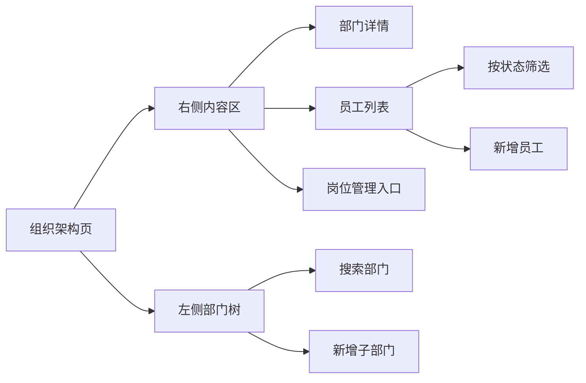

页面状态流：

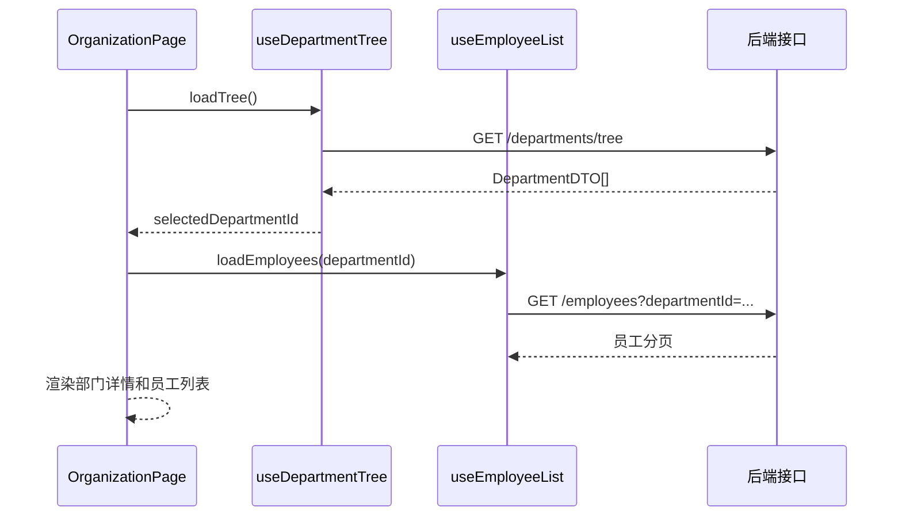

`features/organization/OrganizationPage.vue`：

```vue
<script setup lang="ts">
import { onMounted, watch } from 'vue'
import DepartmentDetail from './components/DepartmentDetail.vue'
import DepartmentTreePanel from './components/DepartmentTreePanel.vue'
import EmployeeTable from './components/EmployeeTable.vue'
import { useDepartmentTree } from './composables/useDepartmentTree'
import { useEmployeeList } from './composables/useEmployeeList'

const departmentTree = useDepartmentTree()
const employeeList = useEmployeeList()

watch(
  () => departmentTree.selectedDepartmentId.value,
  (departmentId) => {
    employeeList.setDepartment(departmentId)
  }
)

onMounted(async () => {
  await departmentTree.loadTree()
})
</script>

<template>
  <main class="organization-page">
    <DepartmentTreePanel
      class="organization-page__tree"
      :tree="departmentTree.filteredTree.value"
      :keyword="departmentTree.keyword.value"
      :selected-id="departmentTree.selectedDepartmentId.value"
      :loading="departmentTree.loading.value"
      @update:keyword="departmentTree.keyword.value = $event"
      @select="departmentTree.selectDepartment"
    />

    <section class="organization-page__content">
      <DepartmentDetail :department="departmentTree.selectedDepartment.value" />
      <EmployeeTable
        :items="employeeList.items.value"
        :loading="employeeList.loading.value"
        :pagination="employeeList.pagination.value"
        @refresh="employeeList.load"
      />
    </section>
  </main>
</template>
```

如果项目使用组件库，`DepartmentTreePanel` 内部可以用组件库 Tree、Input、Button。业务样式只命中明确 class，例如 `.organization-page__tree`，不要写宽泛选择器污染组件库内部 DOM。

## 九、员工列表 composable

员工列表是典型的“部门选中 + 搜索条件 + 分页”组合。

`features/organization/composables/useEmployeeList.ts`：

```ts
import { computed, reactive, ref } from 'vue'
import { getEmployees } from '../services/employeeService'
import { mapEmployee } from '../model/organization.mapper'
import type { EmployeeListItem, EmployeeQuery, EmployeeStatus } from '../model/organization.types'

export function useEmployeeList() {
  const items = ref<EmployeeListItem[]>([])
  const total = ref(0)
  const loading = ref(false)

  const query = reactive<EmployeeQuery>({
    keyword: '',
    departmentId: undefined,
    includeChildren: true,
    status: 'active',
    page: 1,
    pageSize: 20
  })

  const pagination = computed(() => ({
    page: query.page,
    pageSize: query.pageSize,
    total: total.value
  }))

  async function load() {
    loading.value = true
    try {
      const result = await getEmployees({ ...query })
      items.value = result.items.map(mapEmployee)
      total.value = result.total
    } finally {
      loading.value = false
    }
  }

  async function search() {
    query.page = 1
    await load()
  }

  async function setDepartment(departmentId?: number) {
    query.departmentId = departmentId
    query.page = 1
    await load()
  }

  async function setStatus(status?: EmployeeStatus) {
    query.status = status
    query.page = 1
    await load()
  }

  return {
    items,
    total,
    loading,
    query,
    pagination,
    load,
    search,
    setDepartment,
    setStatus
  }
}
```

注意：

- `query` 用 `reactive`，因为它是一个不会整体替换的表单对象。
- 调接口时用 `{ ...query }` 复制，避免请求层意外修改响应式对象。
- 部门变化要重置页码，否则可能出现“第 5 页无数据”的误判。

## 十、数据范围配置组件

角色授权页面里应该有一个独立的 `DataScopeSelector`，不要把数据范围写死在角色表单中。

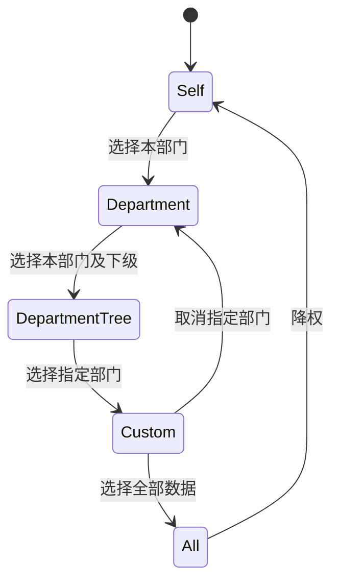

`features/permissions/components/DataScopeSelector.vue`：

```vue
<script setup lang="ts">
import { computed } from 'vue'
import type { DataScopeType } from '../model/data-scope.types'
import CustomDepartmentSelector from './CustomDepartmentSelector.vue'

interface Props {
  modelValue: DataScopeType
  customDepartmentIds: number[]
}

const props = defineProps<Props>()

const emit = defineEmits<{
  'update:modelValue': [value: DataScopeType]
  'update:customDepartmentIds': [value: number[]]
}>()

const options = [
  { label: '本人数据', value: 'self', description: '只能查看自己创建、负责或归属的数据' },
  { label: '本部门数据', value: 'department', description: '查看当前员工所属部门的数据' },
  { label: '本部门及下级', value: 'department_tree', description: '查看所属部门和所有下级部门的数据' },
  { label: '指定部门', value: 'custom', description: '查看被授权的多个部门数据' },
  { label: '全部数据', value: 'all', description: '查看系统全部业务数据，需要严格审计' }
] as const

const showCustomDepartments = computed(() => props.modelValue === 'custom')

function selectScope(value: DataScopeType) {
  emit('update:modelValue', value)

  if (value !== 'custom') {
    emit('update:customDepartmentIds', [])
  }
}
</script>

<template>
  <section class="data-scope-selector">
    <button
      v-for="option in options"
      :key="option.value"
      class="data-scope-selector__option"
      :class="{ 'data-scope-selector__option--active': option.value === modelValue }"
      type="button"
      @click="selectScope(option.value)"
    >
      <span class="data-scope-selector__title">{{ option.label }}</span>
      <span class="data-scope-selector__description">{{ option.description }}</span>
    </button>

    <CustomDepartmentSelector
      v-if="showCustomDepartments"
      :model-value="customDepartmentIds"
      @update:model-value="emit('update:customDepartmentIds', $event)"
    />
  </section>
</template>
```

真实项目里如果使用组件库，可以把按钮组换成 RadioGroup，把指定部门换成 TreeSelect，但状态边界不变。

## 十一、自定义部门选择

自定义部门选择必须能解释“选中父部门是否包含子部门”。

推荐规则：

| 规则 | 说明 |
| --- | --- |
| 选中部门默认包含该部门本身 | `department_id in selectedIds` |
| 是否包含子部门由后端策略决定 | 推荐包含子部门，减少配置成本 |
| 页面要写清楚含义 | 避免管理员误以为只包含单个部门 |
| 禁用部门不可新增授权 | 历史授权可展示但提醒迁移 |

`features/permissions/components/CustomDepartmentSelector.vue`：

```vue
<script setup lang="ts">
import { onMounted } from 'vue'
import { useDepartmentTree } from '@/features/organization/composables/useDepartmentTree'

interface Props {
  modelValue: number[]
}

defineProps<Props>()

const emit = defineEmits<{
  'update:modelValue': [value: number[]]
}>()

const departmentTree = useDepartmentTree()

onMounted(() => {
  departmentTree.loadTree()
})

function updateSelected(ids: number[]) {
  emit('update:modelValue', ids)
}
</script>

<template>
  <section class="custom-department-selector">
    <p class="custom-department-selector__hint">
      选中部门后，将允许访问这些部门及其下级部门的数据。
    </p>

    <!-- 这里替换为项目组件库的 TreeSelect / Tree 组件 -->
    <DepartmentTreePicker
      :tree="departmentTree.filteredTree.value"
      :model-value="modelValue"
      :disabled-node="(node) => !node.enabled"
      multiple
      @update:model-value="updateSelected"
    />
  </section>
</template>
```

不要让管理员在不知道规则的情况下勾部门。数据权限配置错误通常不是技术错误，而是产品说明不清楚。

## 十二、前端查询参数和后端数据范围

最重要的一点：

**前端可以传业务筛选条件，但不能决定最终可见数据范围。**

错误做法：

```ts
getOrders({
  departmentIds: selectedDepartmentIdsFromFrontend
})
```

正确做法：

```ts
getOrders({
  keyword: query.keyword,
  departmentId: query.departmentId,
  includeChildren: query.includeChildren,
  status: query.status,
  page: query.page,
  pageSize: query.pageSize
})
```

后端处理：

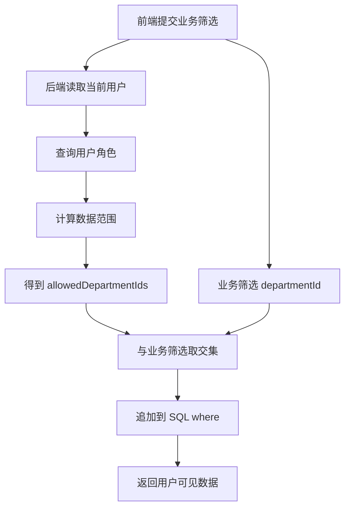

如果前端选择了一个自己无权访问的部门，后端应该返回空结果或 403，而不是信任前端。

## 十三、列表页展示数据范围提示

用户经常问：“为什么我看不到某个订单？”

列表页应该给出当前数据范围提示：

```vue
<script setup lang="ts">
import { computed } from 'vue'
import { usePermissionStore } from '@/app/stores/permission'

const permissionStore = usePermissionStore()

const dataScopeText = computed(() => {
  const scope = permissionStore.currentDataScope
  if (!scope) return '当前数据范围未加载'

  if (scope.scopeType === 'all') return '当前可查看全部数据'
  if (scope.scopeType === 'self') return '当前仅查看本人相关数据'

  return `当前可查看：${scope.departmentNames.join('、')}`
})
</script>

<template>
  <p class="data-scope-hint">
    {{ dataScopeText }}
  </p>
</template>
```

提示文案不需要很长，但要让用户知道自己处在什么范围里。

常见文案：

| 范围 | 文案 |
| --- | --- |
| 本人 | 当前仅展示你创建、负责或归属的数据 |
| 本部门 | 当前仅展示你所属部门的数据 |
| 本部门及下级 | 当前展示你所属部门及下级部门的数据 |
| 指定部门 | 当前展示已授权部门的数据 |
| 全部 | 当前展示全部数据，请谨慎导出 |

## 十四、permissionStore 中的数据范围

当前用户的数据范围可以和菜单、权限码一起加载。

`app/stores/permission.ts`：

```ts
import { defineStore } from 'pinia'
import type { CurrentUserDataScope } from '@/features/permissions/model/data-scope.types'

interface PermissionState {
  permissionCodes: string[]
  currentDataScope?: CurrentUserDataScope
  ready: boolean
}

export const usePermissionStore = defineStore('permission', {
  state: (): PermissionState => ({
    permissionCodes: [],
    currentDataScope: undefined,
    ready: false
  }),

  getters: {
    hasDataScopeLoaded: (state) => Boolean(state.currentDataScope),
    isAllDataScope: (state) => state.currentDataScope?.scopeType === 'all'
  },

  actions: {
    setCurrentDataScope(scope: CurrentUserDataScope) {
      this.currentDataScope = scope
    },

    resetDataScope() {
      this.currentDataScope = undefined
    }
  }
})
```

这里的数据范围只用于展示和交互提示，不用于前端强行过滤安全数据。

## 十五、业务列表如何接入

以订单列表为例：

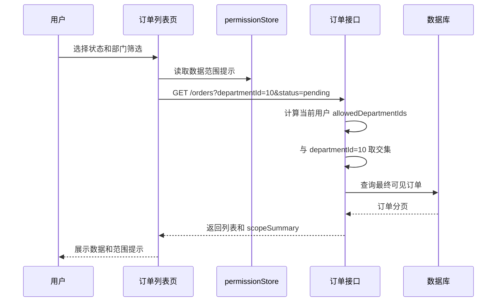

推荐接口返回一个 `scopeSummary`：

```ts
export interface PageResult<T> {
  items: T[]
  total: number
  scopeSummary?: {
    scopeType: DataScopeType
    appliedDepartmentNames: string[]
    clippedByPermission: boolean
  }
}
```

`clippedByPermission` 的意义：

- `false`：用户筛选条件在权限范围内。
- `true`：用户筛选的范围被权限裁剪过。

页面可以这样提示：

```vue
<template>
  <p v-if="scopeSummary?.clippedByPermission" class="data-scope-warning">
    部分筛选范围超出你的数据权限，当前仅展示你有权访问的数据。
  </p>
</template>
```

这个提示能减少很多“为什么数据少了”的沟通成本。

## 十六、数据权限和导出

导出接口必须使用和列表一样的数据范围，不能因为“导出是另一个接口”就绕过权限。

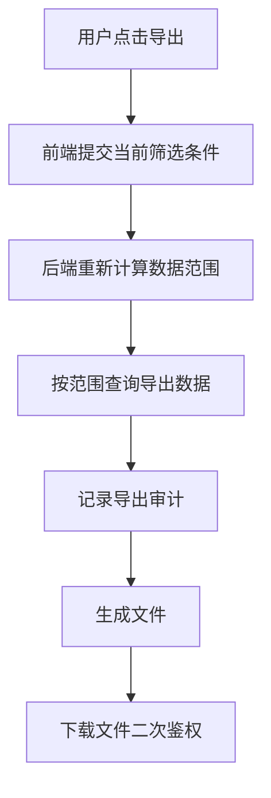

前端按钮权限和数据权限提示：

```vue
<PermissionButton permission="order:export">
  <button type="button" @click="exportOrders">
    导出
  </button>
</PermissionButton>

<p class="export-scope-hint">
  导出内容将受当前数据权限限制，不会包含你无权访问的数据。
</p>
```

如果导出包含敏感字段，例如手机号、身份证、金额明细，后端还要做字段级权限和导出审计。

## 十七、组织变更的影响

组织架构会变化：员工调部门、部门合并、部门停用、负责人变化。前端要知道这些变化会影响哪些页面。

| 变化 | 影响 | 前端处理 |
| --- | --- | --- |
| 员工调部门 | 数据范围、审批候选人、报表归属 | 保存后提示权限可能变化 |
| 部门停用 | 新增员工、筛选项、数据范围授权 | 禁用节点不可新选 |
| 部门移动 | 子部门范围、部门树路径 | 刷新部门树和路径 |
| 负责人变化 | 审批流、提醒接收人 | 刷新部门详情 |
| 员工离职 | 登录账号、审批待办、数据归属 | 显示离职状态和交接提示 |

### 员工离职不要只改状态

离职通常需要处理：

- 禁用登录账号。
- 移交客户、订单、工单或项目。
- 处理审批待办。
- 移除高风险角色。
- 保留历史数据归属。

前端可以在离职操作中给出交接确认：

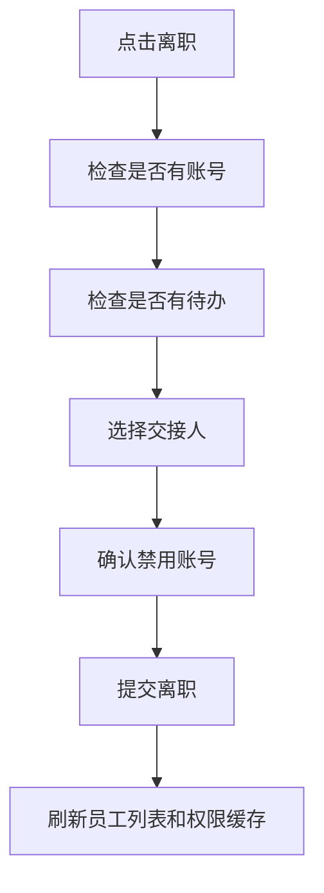

## 十八、前端排障路径

当用户说“我看不到数据”时，不要直接改权限。先按证据排查。

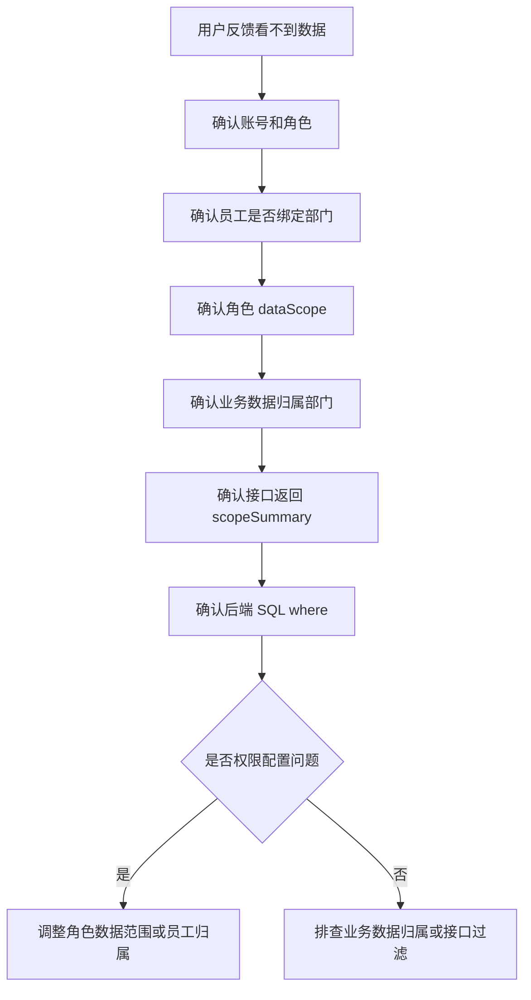

当用户说“我看到了不该看的数据”时：

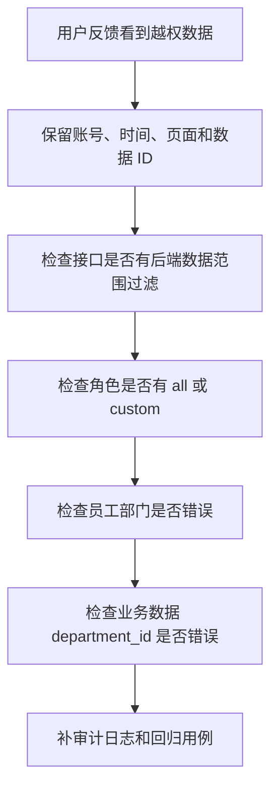

## 十九、真实项目常见问题

### 1. 部门树能看到，但员工列表为空

原因通常有四类：

| 原因 | 排查方式 | 解决 |
| --- | --- | --- |
| 选中的部门没有员工 | 看部门详情员工数 | 换部门或添加员工 |
| 未包含子部门 | 检查 `includeChildren` | 开启包含子部门 |
| 员工状态过滤为在职 | 看是否都是离职/停用 | 调整状态筛选 |
| 数据权限裁剪 | 看接口 `scopeSummary` | 调整角色范围或员工归属 |

### 2. 部门主管看不到下级部门数据

常见原因：

- 角色配置成了 `department`，不是 `department_tree`。
- 部门树 parent 关系错误。
- 员工绑定到了错误部门。
- 后端只取了当前部门，没有递归子部门。

前端应该在角色授权页明确显示“本部门”和“本部门及下级”的区别。

### 3. 给了全部数据还是看不到

不要只看前端权限。继续检查：

- 后端是否使用了旧的权限缓存。
- 用户是否绑定了多个角色，后端取了更小范围。
- 业务列表是否还有额外筛选条件。
- 数据本身是否被软删除、归档或租户隔离。

### 4. 自定义部门勾选后没有生效

可能原因：

- 只保存了 `role_data_scopes`，没保存 `role_data_scope_departments`。
- 保存后没有刷新权限版本。
- 后端没有处理 `custom` 分支。
- 前端传的是部门 code，后端期待 department id。

### 5. 导出数量比列表多

这是高风险问题。说明导出接口没有复用列表的数据范围过滤。

处理：

- 暂停该导出能力。
- 后端统一封装数据范围过滤。
- 补导出审计。
- 增加回归用例：普通用户不能导出其他部门数据。

### 6. 组织调整后历史报表变了

如果历史报表每次都根据员工当前部门反查，员工调部门后历史数据会变。

解决方式：

- 业务数据写入时保存当时的 `department_id`。
- 需要历史组织口径时保存组织快照。
- 报表说明使用“当前组织口径”还是“历史组织口径”。

## 二十、验收清单

| 检查项 | 通过标准 |
| --- | --- |
| 部门树 | 能加载、搜索、选中、展示禁用状态 |
| 部门详情 | 能展示负责人、员工数、子部门 |
| 员工列表 | 能按部门、是否包含子部门、状态和关键词筛选 |
| 员工表单 | 能绑定部门、岗位、直属上级和账号 |
| 角色数据范围 | 能保存 self、department、department_tree、custom、all |
| 指定部门 | custom 范围能选择多个部门并回显 |
| 数据范围提示 | 列表页能说明当前可见范围 |
| 接口边界 | 前端不传最终 allowedDepartmentIds |
| 后端兜底 | 列表、详情、导出都应用数据权限 |
| 权限刷新 | 角色数据范围变更后权限版本更新 |
| 退出清理 | 切换用户后旧数据范围不会残留 |
| 排障能力 | 能解释缺数据和越权数据的原因 |

## 和其他文档怎么配合

| 你要做什么 | 继续看 |
| --- | --- |
| 先做用户模块 | [Vue Admin 用户模块实现手册](/vue/admin-user-module) |
| 先做角色和权限树 | [Vue Admin 角色权限模块实现手册](/vue/admin-permission-module) |
| 先做菜单和动态路由 | [Vue Admin 菜单与动态路由实现手册](/vue/admin-menu-route-module) |
| 统一请求和错误处理 | [Vue Admin 请求封装与错误处理闭环手册](/vue/admin-request-error-handling) |
| 做工作台统计和图表看板 | [Vue Admin 工作台、统计卡片、图表看板与数据刷新闭环实战](/vue/admin-dashboard-analytics) |
| 做审批候选人和待办流转 | [Vue Admin 审批流、状态机、待办与审计闭环实战](/vue/admin-approval-workflow) |
| 看业务项目案例 | [组织架构项目案例](/projects/organization-case) |
| 做数据权限审计 | [数据权限审计项目案例](/projects/data-permission-audit-case) |
| 排查线上问题 | [项目排障方法论](/projects/debugging-playbook) |

## 官方参考

- [Vue 响应式基础](https://vuejs.org/guide/essentials/reactivity-fundamentals.html)
- [Vue 计算属性](https://vuejs.org/guide/essentials/computed.html)
- [Pinia Defining a Store](https://pinia.vuejs.org/core-concepts/)
- [Pinia Actions](https://pinia.vuejs.org/core-concepts/actions.html)
- [Vue Router 导航守卫](https://router.vuejs.org/guide/advanced/navigation-guards.html)

## 下一步学习

完成组织架构和数据权限后，Vue Admin 的后台基础链路已经比较完整：用户、角色、权限、菜单、动态路由、组织、数据范围都串起来了。

下一步建议继续看 [Vue Admin 请求封装与错误处理闭环手册](/vue/admin-request-error-handling)，把 401、403、数据范围裁剪、导出失败、重复提交、空状态和审计提示做成统一规范。然后看 [Vue Admin 审批流、状态机、待办与审计闭环实战](/vue/admin-approval-workflow)，把部门负责人、直属上级、岗位和角色候选人接进审批流。
