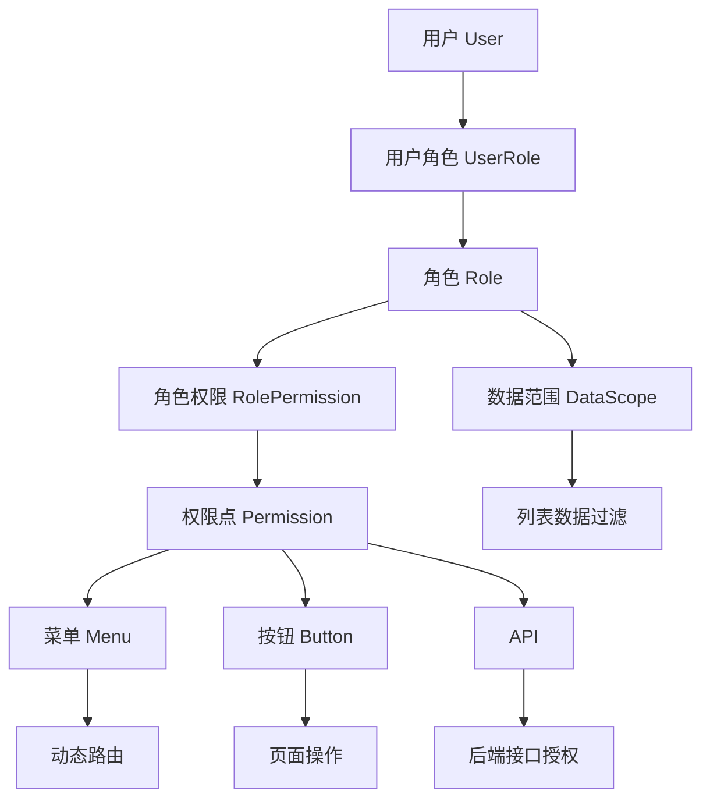
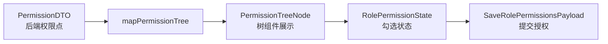
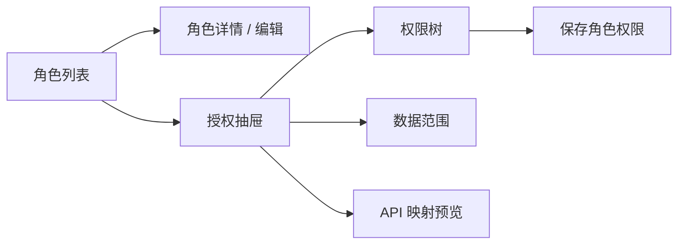
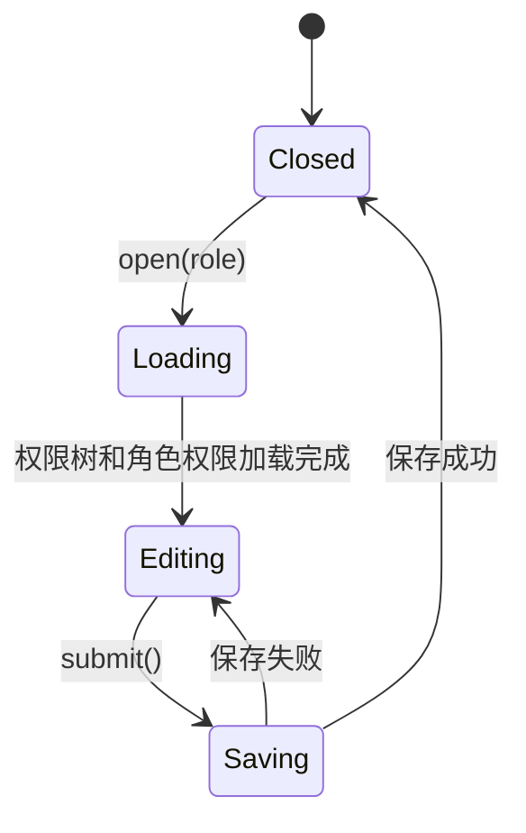
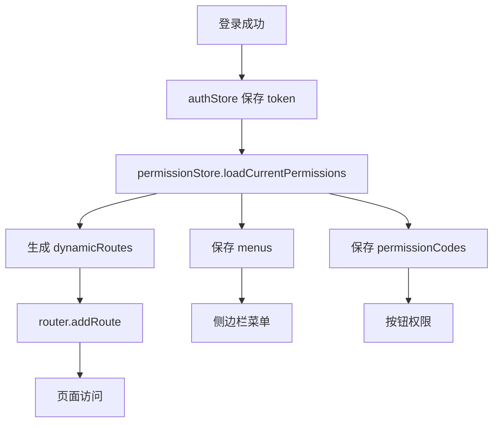
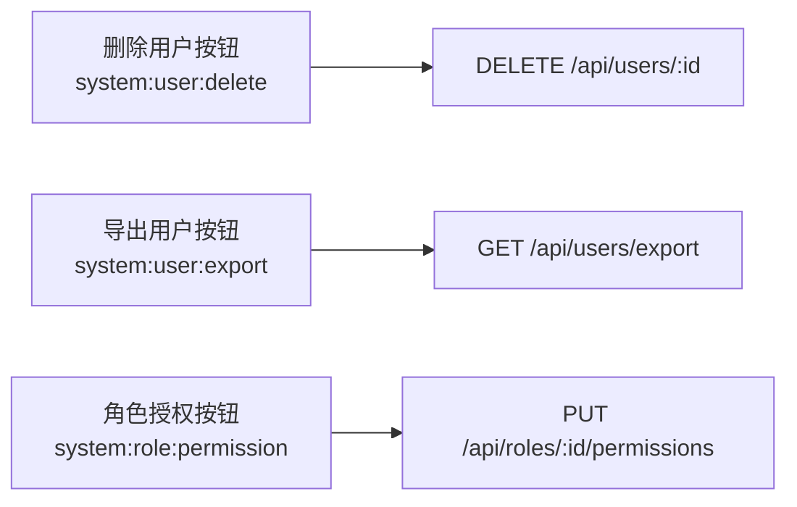
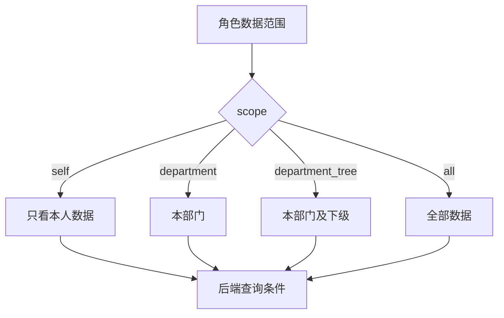

# Vue Admin 角色权限模块实现手册

## 这个页面解决什么

用户管理模块解决“谁在系统里”。角色权限模块解决“这个人能看到什么、能点什么、能调用什么接口、能操作哪些数据”。

这一页专门讲 Vue Admin 项目中的角色权限模块落地。它不是泛泛讲 RBAC 概念，而是把角色列表、权限树、菜单动态路由、按钮权限、API 映射、数据范围、Pinia 权限恢复和项目验收串起来。

读完后，你应该能回答：

- 角色、菜单、按钮、API、数据范围之间是什么关系。
- 权限树后端返回什么，前端如何展示和提交。
- Vue Router 的 route meta 如何和权限码关联。
- Pinia 中应该保存哪些权限状态，刷新后如何恢复。
- 按钮权限为什么不能只靠前端隐藏。
- 权限变更、缓存、动态路由和 403 应该怎么处理。

## 适合谁看

- 已经完成 [Vue Admin 用户模块实现手册](/vue/admin-user-module)，准备继续做角色权限的人。
- 正在做后台管理系统、SaaS 控制台、企业内部门户的人。
- 需要实现动态菜单、按钮级授权、权限树配置和 API 权限映射的人。
- 遇到刷新丢菜单、动态路由 404、按钮权限错位、权限变更不生效的人。

## 权限模块最终能力

第一版角色权限模块不需要做得像大型 IAM 平台，但至少要覆盖真实后台项目的主链路：

| 能力 | 说明 |
| --- | --- |
| 角色列表 | 查看角色、启停角色、编辑角色说明 |
| 权限树 | 按菜单、按钮、API 分层展示权限点 |
| 角色授权 | 给角色勾选菜单、按钮、API 权限 |
| 动态菜单 | 当前用户登录后只看到有权限的菜单 |
| 动态路由 | 当前用户只能进入有权限的页面 |
| 按钮权限 | 页面内新增、编辑、删除、导出按权限展示 |
| API 映射 | 高风险操作能对应到后端接口权限 |
| 数据范围 | 角色可配置本人、本部门、本部门及下级、全部 |
| 刷新恢复 | 刷新深层页面后菜单、按钮、动态路由能恢复 |
| 审计记录 | 授权、取消授权、启停角色要留下操作记录 |

## 总体模型

权限系统不要从“按钮显不显示”开始设计，而要从完整链路开始：



这张图里有 4 条边界：

| 边界 | 前端职责 | 后端职责 |
| --- | --- | --- |
| 菜单权限 | 控制侧边栏显示 | 返回用户可用菜单和权限码 |
| 路由权限 | 控制是否进入页面、展示 403 | 接口仍然必须鉴权 |
| 按钮权限 | 隐藏或禁用操作入口 | 校验操作接口权限 |
| 数据权限 | 展示当前数据范围提示 | 查询时过滤数据 |

前端权限负责体验，后端权限负责安全。不要把按钮隐藏当成真正授权。

## 推荐目录结构

```text
src/
  app/
    router/
      dynamic-routes.ts
      guards.ts
    stores/
      auth.ts
      permission.ts
  features/
    permissions/
      components/
        PermissionTree.vue
        RoleFormDialog.vue
        RolePermissionDrawer.vue
        RoleTable.vue
      composables/
        usePermissionTree.ts
        useRoleForm.ts
        useRoleList.ts
        useRolePermission.ts
      model/
        permission.mapper.ts
        permission.types.ts
        permission.constants.ts
      services/
        permissionService.ts
        roleService.ts
      RoleListPage.vue
  shared/
    permissions/
      can.ts
      PermissionButton.vue
```

目录原则：

- `app/stores/permission.ts` 保存当前登录用户的菜单、权限码、动态路由初始化状态。
- `features/permissions` 做权限配置后台，管理角色和权限树。
- `shared/permissions` 放全站可复用的权限判断函数和权限按钮组件。

## 一、权限类型设计

先把后端返回、前端展示和提交参数分开。



`features/permissions/model/permission.types.ts`：

```ts
export type PermissionType = 'menu' | 'button' | 'api'
export type DataScope = 'self' | 'department' | 'department_tree' | 'all'

export interface PermissionDTO {
  id: number
  code: string
  name: string
  type: PermissionType
  parent_code: string | null
  route_path?: string
  api_path?: string
  method?: string
  sort: number
  enabled: boolean
}

export interface PermissionTreeNode {
  id: number
  code: string
  label: string
  type: PermissionType
  disabled: boolean
  routePath?: string
  apiPath?: string
  method?: string
  children: PermissionTreeNode[]
}

export interface RoleDTO {
  id: number
  name: string
  code: string
  description: string | null
  data_scope: DataScope
  enabled: boolean
  permission_codes: string[]
}

export interface RoleListItem {
  id: number
  name: string
  code: string
  descriptionText: string
  dataScope: DataScope
  enabled: boolean
  permissionCodes: string[]
}

export interface RoleFormState {
  id?: number
  name: string
  code: string
  description: string
  dataScope: DataScope
  enabled: boolean
}

export interface SaveRolePayload {
  id?: number
  name: string
  code: string
  description?: string
  dataScope: DataScope
  enabled: boolean
}

export interface SaveRolePermissionsPayload {
  roleId: number
  permissionCodes: string[]
}
```

### 为什么要区分权限类型

| 类型 | 控制什么 | 例子 |
| --- | --- | --- |
| `menu` | 菜单和路由入口 | `system:user:list` |
| `button` | 页面内按钮和操作 | `system:user:create` |
| `api` | 后端接口授权 | `api:system:user:delete` |

有些团队会让按钮权限和 API 权限复用同一个 code，也可以。但至少要在文档里写清楚映射关系，否则前端以为有按钮权限，后端却用另一套 API 权限校验，就会出现 403。

## 二、权限树转换

后端通常返回扁平权限列表，前端树组件需要嵌套结构。

```ts
import type { PermissionDTO, PermissionTreeNode } from './permission.types'

export function mapPermissionTree(list: PermissionDTO[]): PermissionTreeNode[] {
  const nodeMap = new Map<string, PermissionTreeNode>()
  const roots: PermissionTreeNode[] = []

  const sorted = [...list].sort((a, b) => a.sort - b.sort)

  for (const item of sorted) {
    nodeMap.set(item.code, {
      id: item.id,
      code: item.code,
      label: item.name,
      type: item.type,
      disabled: !item.enabled,
      routePath: item.route_path,
      apiPath: item.api_path,
      method: item.method,
      children: []
    })
  }

  for (const item of sorted) {
    const node = nodeMap.get(item.code)
    if (!node) continue

    if (!item.parent_code) {
      roots.push(node)
      continue
    }

    const parent = nodeMap.get(item.parent_code)

    if (parent) {
      parent.children.push(node)
    } else {
      roots.push(node)
    }
  }

  return roots
}
```

这个转换函数要写成纯函数，方便测试：

| 输入 | 输出 |
| --- | --- |
| 扁平权限列表 | 树节点 |
| 启用状态 | `disabled` |
| route/api 字段 | 树节点附加信息 |

不要在组件里临时递归拼树。权限树是核心业务逻辑，应该放在 model 或 mapper 中。

## 三、权限配置页面结构

角色权限页面通常分成三块：



推荐页面行为：

| 区域 | 作用 |
| --- | --- |
| 角色列表 | 展示角色、启停、编辑、授权 |
| 授权抽屉 | 勾选菜单、按钮、API 权限 |
| 权限树 | 按模块分层展示权限点 |
| 数据范围 | 配置该角色可访问哪些数据 |
| API 映射预览 | 告诉配置者按钮背后会影响哪些接口 |

角色授权不要只做一个弹窗。如果权限树很大，用抽屉或独立页更容易操作。

## 四、角色列表 composable

角色列表和用户列表类似，但多了启停和授权入口。

```ts
import { reactive, ref } from 'vue'
import { listRoles, toggleRoleEnabled } from '../services/roleService'
import type { RoleListItem } from '../model/permission.types'

export function useRoleList() {
  const query = reactive({
    keyword: '',
    page: 1,
    pageSize: 10
  })

  const roles = ref<RoleListItem[]>([])
  const total = ref(0)
  const loading = ref(false)
  const errorMessage = ref('')

  async function loadRoles() {
    loading.value = true
    errorMessage.value = ''

    try {
      const result = await listRoles({ ...query })
      roles.value = result.list
      total.value = result.total
    } catch (error) {
      errorMessage.value = error instanceof Error ? error.message : '角色加载失败'
    } finally {
      loading.value = false
    }
  }

  async function toggleEnabled(role: RoleListItem) {
    await toggleRoleEnabled(role.id, !role.enabled)
    await loadRoles()
  }

  return {
    query,
    roles,
    total,
    loading,
    errorMessage,
    loadRoles,
    toggleEnabled
  }
}
```

启停角色是高风险动作，真实项目里应该二次确认并写审计日志。

## 五、角色授权 composable

授权抽屉需要管理这些状态：

- 当前角色。
- 权限树。
- 已勾选权限码。
- 半选状态。
- 保存中。
- 数据范围。



示例：

```ts
import { ref } from 'vue'
import { mapPermissionTree } from '../model/permission.mapper'
import { getPermissionTree, getRolePermissions, saveRolePermissions } from '../services/permissionService'
import type { DataScope, PermissionTreeNode, RoleListItem } from '../model/permission.types'

export function useRolePermission(onSaved: () => Promise<void>) {
  const visible = ref(false)
  const loading = ref(false)
  const saving = ref(false)
  const currentRole = ref<RoleListItem | null>(null)
  const tree = ref<PermissionTreeNode[]>([])
  const checkedCodes = ref<string[]>([])
  const dataScope = ref<DataScope>('self')

  async function open(role: RoleListItem) {
    visible.value = true
    loading.value = true
    currentRole.value = role

    try {
      const [permissions, rolePermissions] = await Promise.all([
        getPermissionTree(),
        getRolePermissions(role.id)
      ])

      tree.value = mapPermissionTree(permissions)
      checkedCodes.value = [...rolePermissions.permissionCodes]
      dataScope.value = rolePermissions.dataScope
    } finally {
      loading.value = false
    }
  }

  async function submit() {
    if (!currentRole.value) return

    saving.value = true

    try {
      await saveRolePermissions({
        roleId: currentRole.value.id,
        permissionCodes: [...checkedCodes.value],
        dataScope: dataScope.value
      })

      visible.value = false
      await onSaved()
    } finally {
      saving.value = false
    }
  }

  return {
    visible,
    loading,
    saving,
    currentRole,
    tree,
    checkedCodes,
    dataScope,
    open,
    submit
  }
}
```

真实项目里，`saveRolePermissions` 最好保存权限变更差异：新增了哪些、删除了哪些、操作者是谁、影响哪些角色成员。

## 六、Permission Store 的职责

当前登录用户的权限状态放 Pinia。角色配置页面自己的表单、抽屉、树勾选状态不放 Pinia。



`app/stores/permission.ts`：

```ts
import { defineStore } from 'pinia'
import type { RouteRecordRaw } from 'vue-router'

export interface AppMenu {
  title: string
  path: string
  icon?: string
  permission?: string
  children?: AppMenu[]
}

export const usePermissionStore = defineStore('permission', {
  state: () => ({
    ready: false,
    menus: [] as AppMenu[],
    permissionCodes: [] as string[],
    dynamicRoutes: [] as RouteRecordRaw[]
  }),
  getters: {
    permissionSet: (state) => new Set(state.permissionCodes)
  },
  actions: {
    has(code: string) {
      return this.permissionSet.has(code)
    },
    async loadCurrentPermissions() {
      const result = await fetchCurrentUserPermissions()

      this.menus = result.menus
      this.permissionCodes = result.permissionCodes
      this.dynamicRoutes = mapMenusToRoutes(result.menus)
      this.ready = true
    },
    reset() {
      this.ready = false
      this.menus = []
      this.permissionCodes = []
      this.dynamicRoutes = []
    }
  }
})
```

Pinia 官方文档把 state、getters、actions 分别类比为 store 的数据、计算属性和方法。权限恢复属于跨页面业务流程，适合放到 action 中；树勾选属于当前配置页面，留在 composable。

## 七、动态路由与 Route Meta

Vue Router 的 route meta 可以存放自定义信息，例如页面标题、登录要求、权限码。权限模块要把菜单、路由、meta 统一起来。

```ts
export const staticRoutes = [
  {
    path: '/login',
    name: 'Login',
    component: () => import('@/pages/LoginPage.vue'),
    meta: { public: true }
  }
]

export const pageModules = {
  'system/users': () => import('@/features/users/UserListPage.vue'),
  'system/roles': () => import('@/features/permissions/RoleListPage.vue')
}
```

菜单转路由：

```ts
import type { RouteRecordRaw } from 'vue-router'
import type { AppMenu } from '@/app/stores/permission'

export function mapMenusToRoutes(menus: AppMenu[]): RouteRecordRaw[] {
  return menus.map((menu) => ({
    path: menu.path,
    name: menu.path.replaceAll('/', '-'),
    component: pageModules[menu.path],
    meta: {
      title: menu.title,
      requiresAuth: true,
      permission: menu.permission
    },
    children: menu.children ? mapMenusToRoutes(menu.children) : undefined
  }))
}
```

注意：不要直接执行后端传来的组件路径。建议前端维护 `pageModules` 白名单，后端只返回业务标识或路由路径。

### 路由守卫恢复权限

Vue Router 官方文档说明，导航守卫可以重定向或取消导航。动态路由文档也建议：如果在守卫里添加路由，应通过返回目标地址触发重新匹配，而不是在守卫里直接 `router.replace()`。

```ts
router.beforeEach(async (to) => {
  const authStore = useAuthStore()
  const permissionStore = usePermissionStore()

  if (to.meta.public) return true

  if (!authStore.token) {
    return {
      path: '/login',
      query: { redirect: to.fullPath }
    }
  }

  if (!permissionStore.ready) {
    await permissionStore.loadCurrentPermissions()

    for (const route of permissionStore.dynamicRoutes) {
      if (!router.hasRoute(route.name!)) {
        router.addRoute('Root', route)
      }
    }

    return to.fullPath
  }

  const requiredPermission = to.meta.permission as string | undefined

  if (requiredPermission && !permissionStore.has(requiredPermission)) {
    return '/403'
  }

  return true
})
```

这段代码解决三个问题：

- 刷新深层页面后重新恢复菜单和动态路由。
- 动态路由注册后重新匹配当前地址。
- 无页面权限进入 403，而不是白屏或跳登录。

## 八、按钮权限组件

按钮权限可以先用函数：

```ts
export function can(code: string) {
  const permissionStore = usePermissionStore()
  return permissionStore.has(code)
}
```

项目变大后，建议封装 `PermissionButton`：

```vue
<script setup lang="ts">
import { computed } from 'vue'
import { usePermissionStore } from '@/app/stores/permission'

const props = withDefaults(defineProps<{
  permission: string
  disabledMode?: 'hide' | 'disable'
}>(), {
  disabledMode: 'hide'
})

const permissionStore = usePermissionStore()
const allowed = computed(() => permissionStore.has(props.permission))
</script>

<template>
  <button
    v-if="allowed || disabledMode === 'disable'"
    type="button"
    :disabled="!allowed"
  >
    <slot />
  </button>
</template>
```

如果使用组件库，可以用组件库按钮替换原生 `button`，但不要依赖组件库内部 DOM 写样式。

## 九、API 权限映射

按钮权限和 API 权限最好能被配置者看见。



权限点可以带上 API 信息：

| 权限码 | 类型 | API | 方法 |
| --- | --- | --- | --- |
| `system:user:delete` | button | `/api/users/:id` | DELETE |
| `system:user:export` | button | `/api/users/export` | GET |
| `system:role:permission` | button | `/api/roles/:id/permissions` | PUT |

前端展示 API 映射的价值：

- 授权人知道按钮背后影响哪些接口。
- 测试能按权限码验证接口。
- 后端能检查是否有孤立接口没有权限点。
- 审计能根据权限码追踪高风险操作。

## 十、数据范围权限

数据范围不是按钮权限。一个用户可能有 `system:user:list`，但只能看本部门用户。



前端可以展示数据范围，但不要在前端做最终过滤。后端查询时必须根据当前用户和角色计算数据范围。

前端页面可以给用户提示：

```vue
<p class="permission-hint">
  当前角色数据范围：{{ dataScopeLabel }}
</p>
```

但真实数据过滤应该发生在后端 service 或 repository。

## 十一、权限变更后的缓存处理

权限变更后最容易出问题的是缓存。

| 场景 | 处理方式 |
| --- | --- |
| 修改当前用户自己的角色 | 保存后提示重新登录，或立即重新拉权限并重建路由 |
| 修改其他用户角色 | 记录权限版本，下次请求时校验版本 |
| 删除角色权限 | 清理菜单缓存、权限码缓存、动态路由状态 |
| 修改 API 权限 | 后端权限缓存要失效 |
| 多租户权限 | 缓存 key 必须包含租户 ID |

前端可以维护 `permissionVersion`：

```ts
export const usePermissionStore = defineStore('permission', {
  state: () => ({
    version: '',
    ready: false,
    permissionCodes: [] as string[]
  }),
  actions: {
    async refreshIfVersionChanged(nextVersion: string) {
      if (this.version === nextVersion) return

      this.reset()
      await this.loadCurrentPermissions()
    }
  }
})
```

## 十二、常见问题和解决方案

| 问题 | 根因 | 解决方案 |
| --- | --- | --- |
| 刷新后菜单为空 | 权限只在内存中，刷新后未恢复 | 守卫中根据 token 重新拉权限和动态路由 |
| 动态路由注册后还是 404 | 注册后没有重新匹配当前地址 | 添加路由后 `return to.fullPath` |
| 有按钮但接口 403 | 按钮权限和 API 权限不一致 | 建立按钮和 API 映射，后端统一权限码 |
| 权限树勾选错乱 | 半选、父子联动规则不清楚 | 明确提交叶子节点还是全部节点 |
| 权限码改名影响全站 | 字符串散落在页面 | 集中维护权限常量和迁移映射 |
| 超级管理员到处特殊判断 | 页面里写死 admin | 超级管理员走统一策略，审计特权操作 |
| 修改权限后用户仍有旧菜单 | 缓存未失效 | 增加权限版本或保存后重新登录 |

## 十三、验收清单

| 能力 | 验收方式 |
| --- | --- |
| 角色列表 | 搜索、分页、启停、编辑正常 |
| 权限树 | 菜单、按钮、API 分层显示，禁用项不可选 |
| 角色授权 | 勾选后保存，重新打开仍能回显 |
| 数据范围 | 角色能保存 self、department、department_tree、all |
| 动态菜单 | 不同角色登录看到不同菜单 |
| 动态路由 | 直接刷新深层页面不 404 |
| 页面权限 | 无权限访问页面进入 403 |
| 按钮权限 | 无权限按钮隐藏或禁用 |
| API 权限 | 直接调用无权限接口返回 403 |
| 缓存处理 | 权限变更后旧菜单不会一直存在 |
| 审计日志 | 授权、取消授权、启停角色可追踪 |

## 十四、和其他文档怎么配合

| 目标 | 入口 |
| --- | --- |
| 先理解权限概念 | [权限与菜单](/vue/permission) |
| 实现用户模块 | [Vue Admin 用户模块实现手册](/vue/admin-user-module) |
| 细化菜单和动态路由 | [Vue Admin 菜单与动态路由实现手册](/vue/admin-menu-route-module) |
| 细化组织架构和数据权限 | [Vue Admin 组织架构与数据权限实现手册](/vue/admin-organization-data-permission) |
| 做权限系统案例 | [权限系统案例](/projects/permission-case-study) |
| 查刷新丢菜单等问题 | [Vue 真实项目问题库](/projects/issues-vue) |
| 做完整练习 | [Vue Admin 专项练习](/roadmap/vue-admin-practice) |
| 排查权限问题 | [项目排障方法论](/projects/debugging-playbook) |

## 参考资料

- [Vue Router 导航守卫](https://router.vuejs.org/guide/advanced/navigation-guards.html)
- [Vue Router Route Meta Fields](https://router.vuejs.org/guide/advanced/meta.html)
- [Vue Router 动态路由](https://router.vuejs.org/guide/advanced/dynamic-routing)
- [Pinia 核心概念](https://pinia.vuejs.org/core-concepts/)
- [Pinia Actions](https://pinia.vuejs.org/core-concepts/actions.html)
- [Vue 响应式基础](https://vuejs.org/guide/essentials/reactivity-fundamentals.html)

## 下一步学习

完成角色权限模块后，先继续看 [Vue Admin 菜单与动态路由实现手册](/vue/admin-menu-route-module)，把菜单、路由、面包屑和标签页串起来；然后看 [Vue Admin 组织架构与数据权限实现手册](/vue/admin-organization-data-permission)，让数据范围真正影响业务列表。
