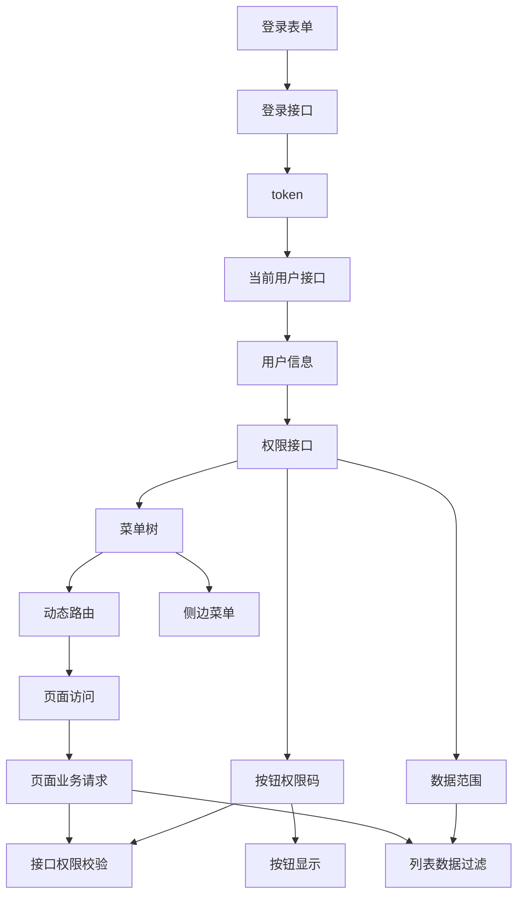
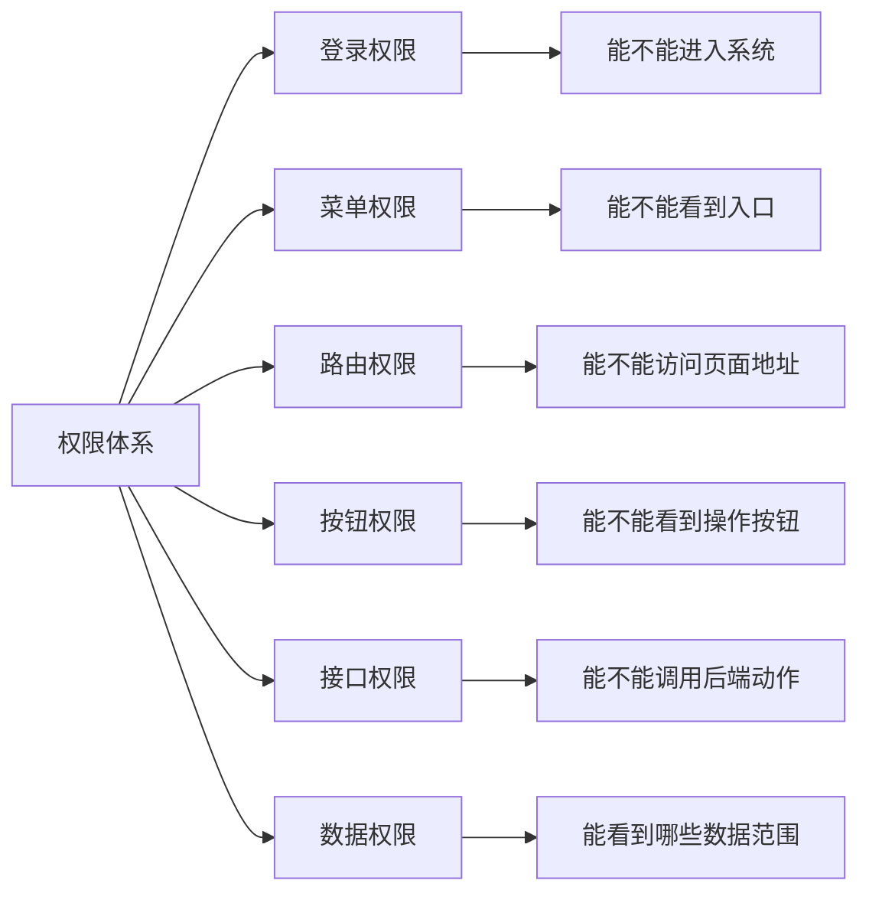
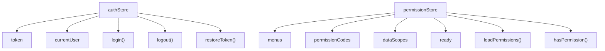
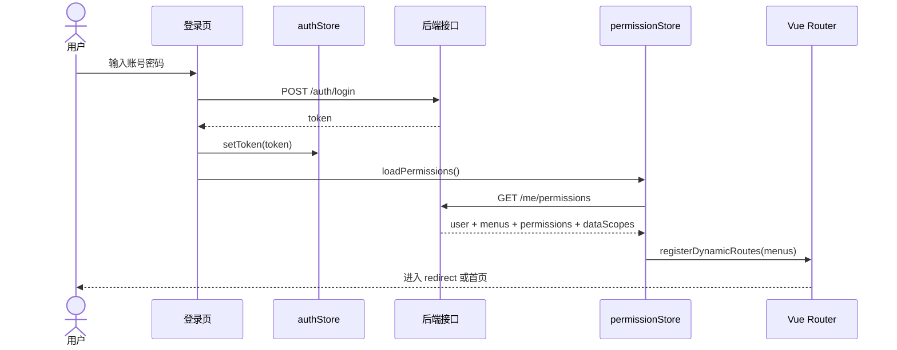
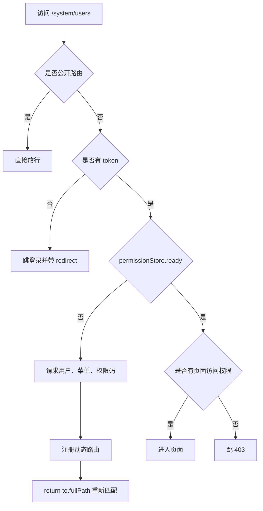
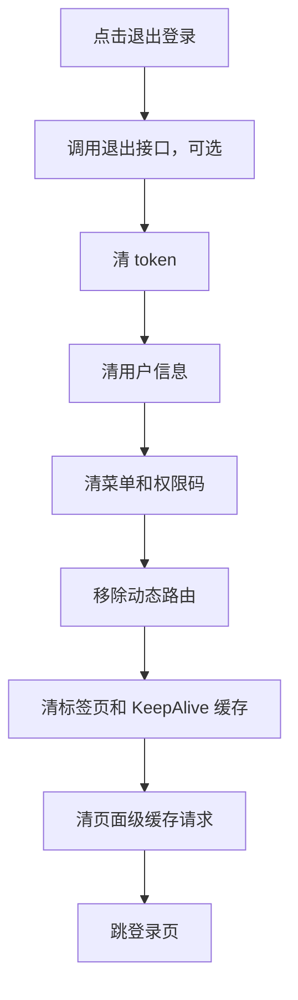
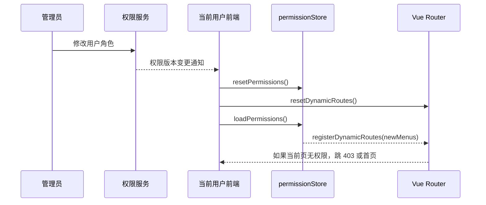
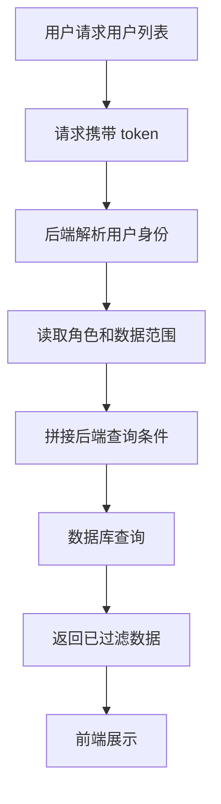
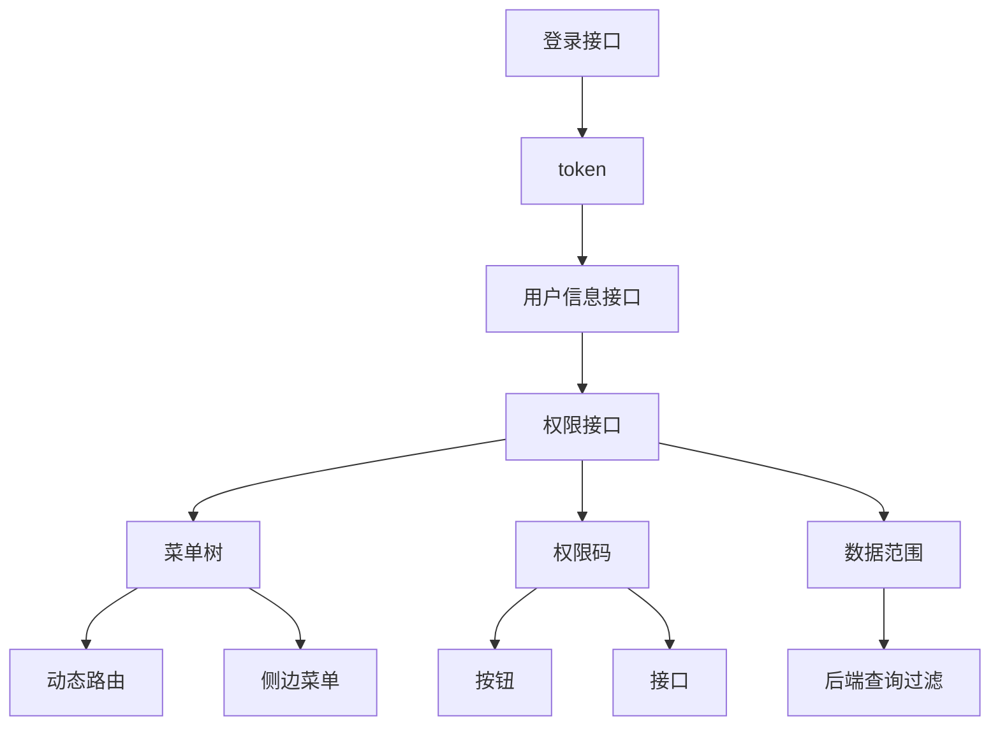

# Vue Admin 权限路由闭环实战

## 这个页面解决什么

很多人学 Vue Admin 时会把“登录、菜单、路由、按钮、接口权限”分开看：

- 登录成功后保存 token。
- 菜单接口返回左侧菜单。
- Vue Router 根据菜单注册动态路由。
- 页面里用权限码控制按钮。
- 后端接口再判断是否允许访问。

分开看时都不难，真正做项目时却容易乱，因为这些能力不是五件独立的事，而是一条完整链路。任何一个环节时序不对，都会出现刷新 404、菜单丢失、按钮显示错、接口 403、退出后还能访问旧页面、切换角色仍看到旧菜单等问题。

这一页专门讲“权限路由闭环”。目标不是再写一个零散教程，而是让你能回答：

- token、用户信息、菜单、权限码分别放哪里。
- 登录后为什么不能只跳首页，还要恢复用户上下文。
- 动态路由为什么要等权限数据回来后再注册。
- 菜单权限、路由权限、按钮权限、接口权限、数据权限有什么区别。
- 刷新深层路由时应该怎样恢复动态路由。
- 切换账号、退出登录、角色变更时应该清理哪些状态。
- 项目里如何把这套流程写成可验收、可排障、可维护的实现。

如果你正在做一个 Vue 3 + Vue Router + Pinia 的后台项目，这一页可以作为权限模块的总装图。

## 适合谁看

- 已经会 Vue Router、Pinia 和请求封装，但不清楚真实后台权限链路的人。
- 正在做 Vue Admin、SaaS 控制台、权限系统、组织管理、菜单管理的人。
- 遇到过刷新后 404、菜单空白、按钮权限错位、接口 403、退出登录后旧页面残留的人。
- 想把“能跑的 demo”升级成“团队能维护的权限基建”的人。

建议先看完 [Vue 从零到项目落地](/vue/project-from-zero)，再看本页。看完后继续拆到 [Vue Admin 菜单与动态路由实现手册](/vue/admin-menu-route-module)、[Vue Admin 角色权限模块实现手册](/vue/admin-permission-module) 和 [Vue Admin 请求封装与错误处理闭环手册](/vue/admin-request-error-handling)。

## 一句话心智模型

Vue Admin 权限链路可以理解成一句话：

**登录拿身份，身份换权限，权限生成菜单和路由，按钮与接口用同一套权限码校验，刷新和退出必须恢复或清理整条链路。**

下面这张图是整页的核心：



初学者容易忽略三件事：

1. 菜单不是权限的全部，它只控制“能不能看到入口”。
2. 前端按钮权限不是安全边界，后端接口必须再次校验。
3. 刷新页面时内存里的动态路由会丢失，必须先恢复权限，再进入页面。

## 最终要做成什么

一个成熟的 Vue Admin 权限路由闭环至少包含这些能力：

| 能力 | 用户体验 | 工程实现 |
| --- | --- | --- |
| 登录态 | 登录后进入后台，刷新不掉线 | token 持久化，启动时恢复用户上下文 |
| 用户上下文 | 顶部显示当前用户、角色、租户 | `authStore` 管理用户信息和登录态 |
| 菜单权限 | 不同角色看到不同菜单 | 权限接口返回菜单树，侧边栏从菜单树渲染 |
| 动态路由 | 有权限的页面才能访问 | 菜单树转换为 `RouteRecordRaw` 后 `addRoute` |
| 按钮权限 | 无权限按钮不出现或不可点 | 权限码集中管理，组件通过 `hasPermission` 判断 |
| 接口权限 | 直接调接口也会被拦截 | 后端按同一权限码校验，前端处理 403 |
| 数据权限 | 同一页面不同人看到不同数据 | 后端按组织、租户、角色、数据范围过滤 |
| 刷新恢复 | 直接刷新 `/system/users` 不 404 | 路由守卫中恢复用户、菜单、动态路由 |
| 退出清理 | 退出后旧菜单和页面不可访问 | 清 token、store、动态路由、缓存页面 |
| 角色变更 | 权限变化后前端及时更新 | 权限版本号、重新拉取、重注册路由 |

这张表也可以直接放进项目 README，作为权限模块的验收标准。

刷新受保护页面时，应用必须先显示权限恢复态，等用户、菜单和动态路由准备完成后再决定去向。这样不会短暂闪现无权限页或业务数据。

<DocFigure
  src="/images/vue/admin-permission-loading.webp"
  alt="Vue Admin 刷新页面时正在恢复用户信息、菜单权限和动态路由"
  caption="权限恢复是启动阶段的真实状态，应使用专门的 loading 页面阻止路由过早判定。"
  :width="1440"
  :height="900"
/>

确认无权访问后，页面只展示拒绝原因和安全的返回入口，不能先渲染业务组件再用 CSS 隐藏。

<DocFigure
  src="/images/vue/admin-permission-denied.webp"
  alt="Vue Admin 无权限页面展示 403 状态、原因说明和返回工作台操作"
  caption="403 是授权结果，不是前端按钮是否可见的判断；后端接口仍必须执行相同的权限校验。"
  :width="1440"
  :height="900"
/>

## 先分清五种权限

后台项目里经常把“权限”说成一个词，但它实际包含五层：



每一层负责的对象不同：

| 权限类型 | 控制对象 | 典型例子 | 常见错误 |
| --- | --- | --- | --- |
| 登录权限 | 系统入口 | 没 token 跳登录 | token 过期后仍停留在业务页 |
| 菜单权限 | 左侧菜单入口 | 角色 A 看不到“角色管理”菜单 | 看不到菜单但地址栏仍能进入 |
| 路由权限 | 页面 URL | `/system/users` 是否可访问 | 动态路由注册晚于 404 匹配 |
| 按钮权限 | 页面操作 | 新增、编辑、删除、导出 | 隐藏按钮但接口仍可直接调用 |
| 接口权限 | 后端 API | `DELETE /users/:id` | 前端有权限、接口返回 403 |
| 数据权限 | 数据范围 | 只能看本部门用户 | 前端过滤代替后端过滤 |

实际项目里要记住一个原则：

**前端权限负责体验和导航，后端权限负责安全和数据边界。**

前端隐藏按钮能减少误操作，但不能防止用户直接构造请求。后端必须校验接口权限和数据权限。

## 推荐目录结构

权限路由闭环最好按“应用基建”和“业务模块”分开：

```text
src/
  app/
    main.ts
    router/
      index.ts
      static-routes.ts
      dynamic-route.ts
      guards.ts
    stores/
      auth.ts
      permission.ts
      app.ts
    layouts/
      AdminLayout.vue
  shared/
    request/
      index.ts
      error.ts
    permissions/
      codes.ts
      hasPermission.ts
    utils/
      route.ts
  features/
    system/
      users/
      roles/
      menus/
```

目录职责要清楚：

| 文件 | 负责什么 | 不应该负责什么 |
| --- | --- | --- |
| `auth.ts` | token、用户信息、登录、退出 | 菜单树转换 |
| `permission.ts` | 菜单、权限码、数据范围、是否已初始化 | 表单状态和列表分页 |
| `dynamic-route.ts` | 菜单转路由、注册路由、移除路由 | 调登录接口 |
| `guards.ts` | 进入页面前恢复上下文和做访问控制 | 页面业务请求 |
| `request/index.ts` | 带 token 请求、统一处理 401/403 | 具体页面按钮显示 |
| `permissions/codes.ts` | 权限码常量和注释 | 写死在页面模板里 |

这样拆的好处是：登录、权限、路由、请求互相协作，但不会互相揉成一坨。

## 权限接口应该返回什么

权限接口不一定所有项目都长一样，但至少要能支撑菜单、路由、按钮和数据范围。

推荐返回结构：

```ts
interface PermissionPayload {
  user: CurrentUser
  menus: MenuNode[]
  permissions: string[]
  dataScopes: DataScope[]
  version: string
}

interface CurrentUser {
  id: string
  name: string
  roles: string[]
  tenantId?: string
  organizationId?: string
}

interface MenuNode {
  id: string
  parentId: string | null
  title: string
  path: string
  name: string
  componentKey?: string
  icon?: string
  hidden?: boolean
  order: number
  permissionCode?: string
  children?: MenuNode[]
}

interface DataScope {
  resource: string
  scope: 'all' | 'tenant' | 'department' | 'self' | 'custom'
  values?: string[]
}
```

字段解释：

| 字段 | 说明 | 为什么需要 |
| --- | --- | --- |
| `menus` | 当前用户能看到的菜单树 | 渲染侧边栏，生成动态路由 |
| `permissions` | 当前用户拥有的按钮和接口权限码 | 控制按钮，也和后端接口权限保持一致 |
| `dataScopes` | 数据范围 | 解释为什么列表只返回部分数据 |
| `version` | 权限版本 | 判断权限是否变更，避免使用旧菜单 |
| `componentKey` | 页面组件白名单 key | 避免后端直接控制前端 import 路径 |

不要让后端返回任意组件路径后前端直接加载。更安全的方式是后端只返回 `componentKey`，前端维护白名单：

```ts
const pageModules = {
  'system/users': () => import('@/features/system/users/UserListPage.vue'),
  'system/roles': () => import('@/features/system/roles/RoleListPage.vue'),
  'system/menus': () => import('@/features/system/menus/MenuListPage.vue')
} as const

type PageModuleKey = keyof typeof pageModules
```

这样做能保证：

- 后端不能让前端加载未知文件。
- 重命名页面时能在 TypeScript 或构建阶段暴露问题。
- 权限菜单和前端页面之间有明确映射关系。

## Pinia Store 怎么拆

推荐拆成两个核心 Store：



`authStore` 只管身份：

```ts
export const useAuthStore = defineStore('auth', () => {
  const token = ref<string | null>(localStorage.getItem('token'))
  const user = ref<CurrentUser | null>(null)

  const isLoggedIn = computed(() => Boolean(token.value))

  function setToken(nextToken: string) {
    token.value = nextToken
    localStorage.setItem('token', nextToken)
  }

  function clearAuth() {
    token.value = null
    user.value = null
    localStorage.removeItem('token')
  }

  return {
    token,
    user,
    isLoggedIn,
    setToken,
    clearAuth
  }
})
```

`permissionStore` 只管权限：

```ts
export const usePermissionStore = defineStore('permission', () => {
  const menus = ref<MenuNode[]>([])
  const permissionCodes = ref<string[]>([])
  const dataScopes = ref<DataScope[]>([])
  const version = ref('')
  const ready = ref(false)

  const permissionSet = computed(() => new Set(permissionCodes.value))

  function hasPermission(code: string) {
    return permissionSet.value.has(code)
  }

  async function loadPermissions() {
    const payload = await getCurrentPermissions()
    menus.value = payload.menus
    permissionCodes.value = payload.permissions
    dataScopes.value = payload.dataScopes
    version.value = payload.version
    ready.value = true
  }

  function resetPermissions() {
    menus.value = []
    permissionCodes.value = []
    dataScopes.value = []
    version.value = ''
    ready.value = false
  }

  return {
    menus,
    permissionCodes,
    dataScopes,
    version,
    ready,
    hasPermission,
    loadPermissions,
    resetPermissions
  }
})
```

为什么不把所有东西都放进一个 Store？

- 登录态和权限数据生命周期不同。
- token 可以持久化，完整菜单不一定要持久化。
- 退出登录时需要清两个 Store，但刷新恢复时可能先恢复 token，再拉权限。
- 权限 Store 会参与动态路由注册，职责应该更单一。

## 登录后的完整流程

登录不是“调接口成功后跳首页”这么简单。后台登录后至少要走完这条链路：



登录页可以这样组织：

```ts
async function handleLogin() {
  const { token } = await loginApi(form)
  authStore.setToken(token)

  await permissionStore.loadPermissions()
  registerDynamicRoutes(permissionStore.menus)

  await router.replace(
    route.query.redirect?.toString() || '/dashboard'
  )
}
```

注意顺序：

1. 先保存 token，否则后续权限接口没有身份。
2. 再拉用户和权限，否则不知道该注册哪些动态路由。
3. 再注册动态路由，否则跳转目标可能匹配不到。
4. 最后跳转目标页。

如果你先跳转再拉权限，很容易出现：

- 页面先进入 404。
- 侧边菜单短暂空白。
- 页面业务请求先发出，后端返回 401 或 403。
- 面包屑和标题拿不到 route meta。

## 刷新深层页面时怎么恢复

刷新 `/system/users` 时，浏览器会重新加载整个前端应用。此时：

- localStorage 里的 token 还在。
- Pinia 内存状态丢失。
- 动态路由也丢失。
- 当前地址已经是 `/system/users`。

所以路由守卫必须在进入页面前恢复权限和动态路由：



示例守卫：

```ts
const publicRoutes = ['/login', '/403', '/404']

router.beforeEach(async (to) => {
  const authStore = useAuthStore()
  const permissionStore = usePermissionStore()

  if (publicRoutes.includes(to.path)) {
    return true
  }

  if (!authStore.token) {
    return {
      path: '/login',
      query: { redirect: to.fullPath }
    }
  }

  if (!permissionStore.ready) {
    await permissionStore.loadPermissions()
    registerDynamicRoutes(permissionStore.menus)

    return to.fullPath
  }

  if (!canVisitRoute(to, permissionStore.permissionCodes)) {
    return '/403'
  }

  return true
})
```

Vue Router 官方文档提到，在导航守卫中动态添加路由时，不应该直接调用 `router.replace()`，而是通过返回目标地址触发重新匹配。也就是这里的 `return to.fullPath`。

这个细节能解决“路由已经 addRoute 了，但当前页面仍然 404”的问题。

## 菜单树怎么转动态路由

动态路由注册通常分三步：

1. 把菜单树压平或递归遍历。
2. 找到有 `componentKey` 的页面菜单。
3. 转成 Vue Router 的 `RouteRecordRaw`。

示例：

```ts
import type { RouteRecordRaw } from 'vue-router'

export function menuToRoutes(menus: MenuNode[]): RouteRecordRaw[] {
  return menus
    .filter(menu => !menu.hidden)
    .map((menu) => {
      const children = menu.children?.length
        ? menuToRoutes(menu.children)
        : undefined

      const component = menu.componentKey
        ? pageModules[menu.componentKey as PageModuleKey]
        : undefined

      return {
        path: menu.path,
        name: menu.name,
        component,
        meta: {
          title: menu.title,
          icon: menu.icon,
          permissionCode: menu.permissionCode
        },
        children
      }
    })
}
```

注册时建议记录已注册的路由名称，方便退出时清理：

```ts
const dynamicRouteNames: string[] = []

export function registerDynamicRoutes(menus: MenuNode[]) {
  const routes = menuToRoutes(menus)

  routes.forEach((route) => {
    if (route.name && !router.hasRoute(route.name)) {
      router.addRoute('RootLayout', route)
      dynamicRouteNames.push(String(route.name))
    }
  })
}

export function resetDynamicRoutes() {
  dynamicRouteNames.forEach((name) => {
    if (router.hasRoute(name)) {
      router.removeRoute(name)
    }
  })
  dynamicRouteNames.length = 0
}
```

这里有两个常见坑：

| 坑 | 表现 | 解决 |
| --- | --- | --- |
| 没有父布局路由 | 动态页面没有后台布局 | 先注册静态 `RootLayout`，动态路由挂到它下面 |
| 路由 name 不稳定 | 重复注册、缓存错乱 | name 使用稳定业务 key，不要用随机值 |

## 按钮权限怎么写

按钮权限不要在页面里到处写字符串：

```vue
<!-- 不推荐 -->
<button v-if="permissionStore.hasPermission('system:user:delete')">
  删除
</button>
```

更推荐集中维护权限码：

```ts
export const USER_PERMISSION = {
  list: 'system:user:list',
  create: 'system:user:create',
  update: 'system:user:update',
  delete: 'system:user:delete',
  export: 'system:user:export'
} as const
```

页面里使用常量：

```vue
<script setup lang="ts">
import { USER_PERMISSION } from './user.permissions'
import { usePermissionStore } from '@/app/stores/permission'

const permissionStore = usePermissionStore()
</script>

<template>
  <button v-if="permissionStore.hasPermission(USER_PERMISSION.create)">
    新增用户
  </button>
</template>
```

如果项目里按钮很多，可以封装组件或指令：

```vue
<PermissionButton
  :code="USER_PERMISSION.delete"
  danger
  @click="handleDelete(row)"
>
  删除
</PermissionButton>
```

但不要只依赖前端按钮。删除接口仍然必须在后端校验 `system:user:delete`。

## 请求层怎么配合权限

请求层要处理两类权限错误：

| 状态 | 含义 | 前端应该怎么做 |
| --- | --- | --- |
| 401 | 未登录、token 过期、登录态无效 | 清登录态，跳登录，保留 redirect |
| 403 | 已登录但无权限 | 保持登录态，提示无权限或跳 403 |

请求拦截器只负责带上 token：

```ts
request.interceptors.request.use((config) => {
  const authStore = useAuthStore()

  if (authStore.token) {
    config.headers.Authorization = `Bearer ${authStore.token}`
  }

  return config
})
```

响应错误处理要区分 401 和 403：

```ts
request.interceptors.response.use(
  response => response.data,
  async (error) => {
    const status = error.response?.status
    const authStore = useAuthStore()
    const permissionStore = usePermissionStore()

    if (status === 401) {
      authStore.clearAuth()
      permissionStore.resetPermissions()
      resetDynamicRoutes()

      router.replace({
        path: '/login',
        query: { redirect: router.currentRoute.value.fullPath }
      })
    }

    if (status === 403) {
      router.replace('/403')
    }

    return Promise.reject(error)
  }
)
```

不要把 403 当成 401 处理。403 说明用户已经登录，只是当前动作无权限。如果直接清 token，会让用户误以为系统掉线。

## 退出登录要清什么

退出登录不是只删 token。完整清理应该覆盖：



示例：

```ts
async function logout() {
  try {
    await logoutApi()
  } finally {
    authStore.clearAuth()
    permissionStore.resetPermissions()
    resetDynamicRoutes()
    tabStore.resetTabs()
    appStore.resetKeepAlive()

    await router.replace('/login')
  }
}
```

如果没有清动态路由，会出现：

- 退出后浏览器返回键还能看到旧页面。
- 切换账号后旧账号的菜单还在。
- 新账号没有权限的页面仍能进入。
- 标签页缓存里保留旧账号数据。

## 角色变更和权限版本

真实项目中，管理员可能在后台修改某个用户的角色。此时前端不能一直使用旧权限。

推荐后端返回 `permissionVersion`：

```ts
interface PermissionPayload {
  menus: MenuNode[]
  permissions: string[]
  dataScopes: DataScope[]
  version: string
}
```

前端可以在这些时机检查版本：

| 时机 | 做法 |
| --- | --- |
| 登录后 | 保存当前权限版本 |
| 每次进入页面 | 可选：轻量检查版本是否变化 |
| 关键接口返回特定错误码 | 重新拉取权限 |
| 用户主动切换角色或租户 | 清旧权限，重新加载 |
| WebSocket/SSE 收到权限变更通知 | 弹提示并重新加载权限 |

权限变更后的处理流程：



权限变更后要特别处理“当前页面是否还能访问”。如果当前用户失去了当前页面权限，应该跳到 403 或首页，而不是继续停留。

## 数据权限不要放在前端做

数据权限决定“能看到哪些数据”，例如：

- 总部管理员能看所有用户。
- 区域经理只能看本区域。
- 部门主管只能看本部门。
- 普通员工只能看自己。

前端可以展示数据范围说明，但不能承担数据过滤：



不要这样做：

```ts
// 不推荐：前端拿到全量用户后自行过滤
const visibleUsers = allUsers.filter(user =>
  user.departmentId === currentUser.departmentId
)
```

正确做法是：

```ts
// 推荐：前端只传搜索条件，后端根据登录人自动叠加数据权限
const users = await getUsers({
  keyword: searchForm.keyword,
  status: searchForm.status,
  page: pagination.page,
  pageSize: pagination.pageSize
})
```

如果列表数据“少了”，排查时不要先怀疑前端渲染，先确认后端是否按数据权限裁剪了结果。

## 页面访问判断怎么写

页面访问通常基于路由 meta：

```ts
interface RouteMeta {
  title?: string
  permissionCode?: string
  public?: boolean
}
```

判断函数保持简单：

```ts
function canVisitRoute(to: RouteLocationNormalized, codes: string[]) {
  if (to.meta.public) {
    return true
  }

  const requiredCode = to.meta.permissionCode

  if (!requiredCode) {
    return true
  }

  return codes.includes(requiredCode as string)
}
```

注意：

- 不需要权限的页面要显式标记或放入公开路由。
- 业务页面最好都有稳定的 `permissionCode`。
- 不要用页面标题判断权限。
- 不要用菜单文字判断权限。
- 不要用按钮权限代替页面权限。

## 常见问题与解决方案

### 问题 1：刷新动态页面变 404

现象：

- 登录后从菜单进入 `/system/users` 正常。
- 在 `/system/users` 按浏览器刷新。
- 页面变成 404。

原因：

- 动态路由只存在于内存。
- 刷新后应用重新启动，路由表只剩静态路由。
- 当前地址已经是动态地址，但路由还没注册。

解决：

1. token 存在时，守卫先请求权限数据。
2. 注册动态路由。
3. 返回 `to.fullPath` 重新匹配。
4. 确保 404 兜底路由不会过早吞掉动态地址。

### 问题 2：菜单显示了，点进去还是 403

原因可能有三类：

| 原因 | 判断方式 | 处理 |
| --- | --- | --- |
| 菜单权限和页面权限码不一致 | 看菜单 `permissionCode` 和 route meta | 统一权限码来源 |
| 前端缓存了旧菜单 | 换账号或改角色后仍显示旧菜单 | 退出、切换角色时清 store 和动态路由 |
| 后端接口权限更严格 | 页面能进，但接口 403 | 对齐后端接口权限码 |

不要只改前端显示。先确认后端返回的菜单、权限码、接口权限是否一致。

### 问题 3：按钮没有显示，但接口能直接调

这是典型安全漏洞。

前端按钮权限只控制 UI，后端接口必须再次判断。例如删除用户：

| 层级 | 必须做什么 |
| --- | --- |
| 前端 | 没有 `system:user:delete` 时不显示删除按钮 |
| 后端 | 没有 `system:user:delete` 时 `DELETE /users/:id` 返回 403 |
| 审计 | 删除成功和失败都记录操作人、目标用户、时间、原因 |

### 问题 4：退出登录后返回键还能看到页面

常见原因：

- 只清了 token，没有清 Pinia。
- 动态路由没有 remove。
- 标签页或 KeepAlive 缓存没有清。
- 页面组件里还有未取消的请求。

解决：

退出时执行完整清理：`authStore.clearAuth()`、`permissionStore.resetPermissions()`、`resetDynamicRoutes()`、清标签页、清缓存、跳登录。

### 问题 5：切换角色后菜单没变

原因：

- 权限 Store 没有重新加载。
- 菜单缓存 key 没有包含用户、角色、租户或权限版本。
- 动态路由重复注册，没有先移除旧路由。

解决：

切换角色时按“退出当前权限上下文，但不一定退出账号”的方式处理：

1. 清旧权限。
2. 移除旧动态路由。
3. 拉新权限。
4. 注册新路由。
5. 如果当前页无权限，跳首页或 403。

### 问题 6：本地能进，生产刷新 404

这不一定是动态路由问题，也可能是部署问题。

需要区分：

| 场景 | 原因 | 处理 |
| --- | --- | --- |
| 本地刷新动态页 404 | 前端没有恢复动态路由 | 修路由守卫 |
| 生产刷新所有二级路由 404 | Nginx 没配 history fallback | 配 `try_files $uri $uri/ /index.html` |
| 生产只某些动态页 404 | 动态路由或权限恢复有问题 | 检查菜单接口和 `addRoute` |

## 最小验收清单

做完权限路由闭环后，至少要手动验收这些场景：

| 场景 | 操作 | 通过标准 |
| --- | --- | --- |
| 首次登录 | 登录账号 A | 能进入首页，菜单正确 |
| 刷新动态页 | 在 `/system/users` 刷新 | 页面不 404，菜单仍正常 |
| 无 token 访问 | 清 token 后访问业务页 | 跳登录，登录后回原页面 |
| 无页面权限 | 访问没有权限的地址 | 跳 403 或明确提示 |
| 无按钮权限 | 使用低权限角色进入页面 | 按钮不显示或禁用 |
| 直接调接口 | 无权限用户调用删除接口 | 后端返回 403 |
| 退出登录 | 登录后退出，再按返回键 | 不能看到旧业务页 |
| 切换账号 | A 退出，B 登录 | 不出现 A 的菜单、标签页和缓存数据 |
| 角色变更 | 管理员移除权限 | 当前用户权限能刷新或收到提示 |
| 生产刷新 | 部署后刷新二级路由 | 不出现服务器 404 |

## 学习练习

### 练习 1：画出你项目的权限链路

用下面模板画你自己的项目：



要求：

- 标出哪些数据来自后端。
- 标出哪些状态存在 Pinia。
- 标出哪些数据会被持久化。
- 标出刷新页面时哪些东西会丢。

### 练习 2：实现最小动态路由恢复

只做两个页面：

- `/dashboard`
- `/system/users`

要求：

1. 登录后从模拟接口返回菜单。
2. 根据菜单注册 `/system/users`。
3. 刷新 `/system/users` 不 404。
4. 删除 token 后访问 `/system/users` 跳登录。

验收点：

- 不能把 `/system/users` 写进静态路由。
- 路由守卫中要有 `permissionStore.ready`。
- 注册动态路由后要重新匹配当前地址。

### 练习 3：补齐按钮和接口权限

给用户列表加两个权限码：

```ts
export const USER_PERMISSION = {
  create: 'system:user:create',
  delete: 'system:user:delete'
} as const
```

要求：

- 没有 `create` 时不显示新增按钮。
- 没有 `delete` 时不显示删除按钮。
- 直接调用删除接口时，后端仍然返回 403。
- 页面提示“没有删除权限”，而不是跳登录。

## 项目文档模板

权限路由闭环完成后，建议在项目内写一份 `docs/permission-flow.md`：

```md
# 权限路由闭环说明

## 数据来源

- token 来源：
- 当前用户接口：
- 菜单权限接口：
- 权限码接口：
- 数据范围接口：

## 前端状态

- authStore：
- permissionStore：
- 是否持久化：
- 退出登录清理项：

## 动态路由

- 静态路由：
- 动态路由：
- 组件白名单：
- 注册时机：
- 清理时机：

## 权限码

- 页面权限：
- 按钮权限：
- 接口权限：
- 命名规则：

## 验收场景

- 登录：
- 刷新动态页：
- 无权限访问：
- 退出登录：
- 切换账号：
- 生产刷新：
```

这个模板能让新人快速理解项目，而不是靠翻代码猜权限链路。

## 参考资料

- [Vue Router 导航守卫](https://router.vuejs.org/guide/advanced/navigation-guards.html)
- [Vue Router 动态路由](https://router.vuejs.org/guide/advanced/dynamic-routing)
- [Pinia 核心概念](https://pinia.vuejs.org/core-concepts/)
- [Pinia Actions](https://pinia.vuejs.org/core-concepts/actions.html)

## 下一步学习

如果你刚做完本页，建议按这个顺序继续：

1. 看 [Vue Admin 菜单与动态路由实现手册](/vue/admin-menu-route-module)，把菜单树、组件白名单、面包屑、标签页继续细化。
2. 看 [Vue Admin 角色权限模块实现手册](/vue/admin-permission-module)，学习角色、权限树、授权保存和权限码治理。
3. 看 [Vue Admin 组织架构与数据权限实现手册](/vue/admin-organization-data-permission)，理解数据范围为什么必须由后端控制。
4. 看 [Vue Admin 请求封装与错误处理闭环手册](/vue/admin-request-error-handling)，把 401、403、traceId、重试和错误提示接进请求层。
5. 看 [Vue Admin 请求、权限与数据问题排查专题](/projects/issues-vue-admin-request)，把常见线上问题按证据链排查。
