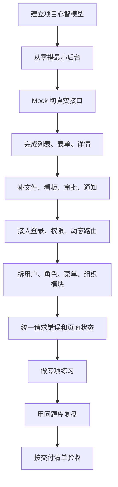
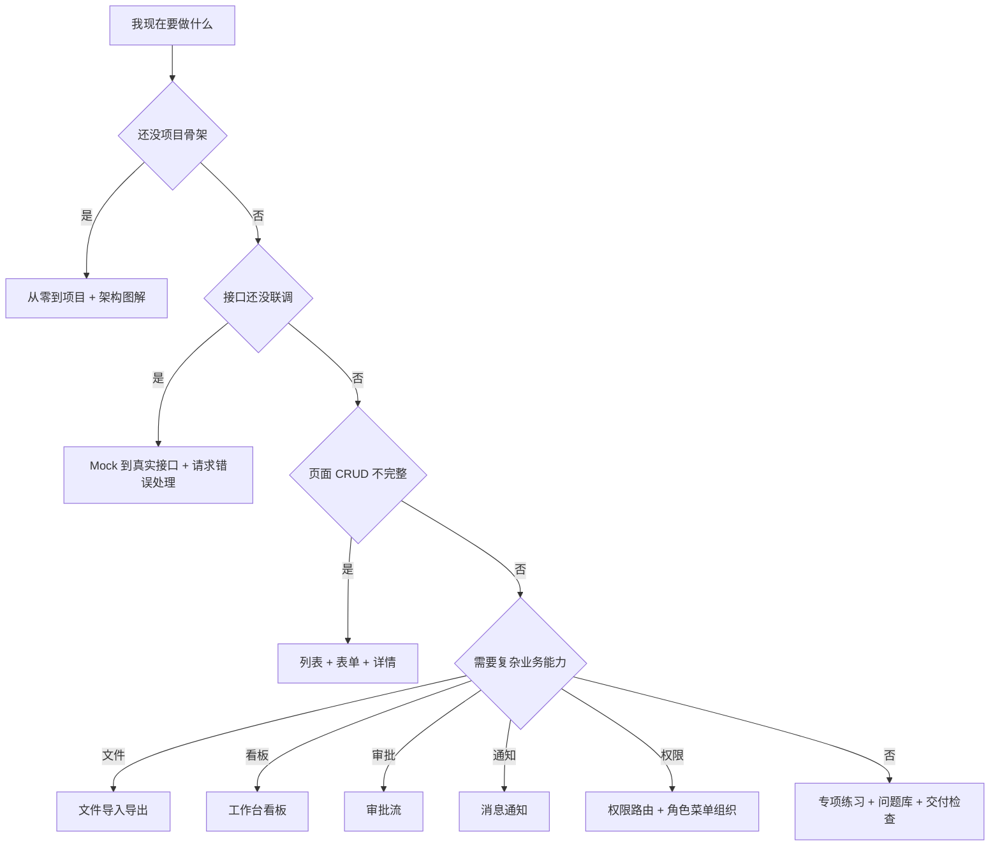

# Vue Admin 阅读顺序与实战索引

## 这个页面解决什么

Vue Admin 相关内容已经覆盖了从零搭项目、Mock 到真实接口、列表、表单、详情、文件、看板、审批、消息通知、权限路由、用户、角色、菜单、组织、请求错误和问题排查。内容足够多以后，新手最容易遇到的问题不是“没有文档”，而是：

- 打开了很多页面，但不知道先看哪一篇。
- 看完实现手册，却不知道自己要交付什么代码。
- 遇到错误时不知道该查 Vue 问题库、请求问题库还是消息通知专题。
- 学习路线、实战项目、问题库和练习包之间没有连成一条线。

这一页是 Vue Admin 文档的任务式索引。它不替代具体实现手册，而是告诉你：

- 当前阶段应该读哪些文档。
- 每阶段应该产出哪些代码、截图、README 或复盘记录。
- 遇到问题时应该按什么路径查。
- 什么时候可以进入下一阶段。

## 适合谁看

- 已经学过 Vue 基础，但第一次系统做后台管理项目的人。
- 正在做 Vue Admin，却在用户、角色、菜单、权限、请求、通知之间来回跳的人。
- 想把本站文档变成一套可执行学习计划的人。
- 带新人做后台项目，需要明确交付物和验收标准的人。
- 已经看过 [Vue Admin 学习地图与交付清单](/roadmap/vue-admin-learning-map)，但想按“今天具体看什么、做什么、查什么”推进的人。

## 总体阅读策略

Vue Admin 不适合按 API 名称学习。真实后台项目是按业务链路交付的，所以阅读顺序也应该按交付链路来组织。



这条路线的核心原则是：

1. 先让项目跑起来，再讨论架构优雅。
2. 先完成一个最小业务闭环，再扩展复杂模块。
3. 先把请求、类型、状态和权限边界写清楚，再接更多页面。
4. 每做完一个模块，都要去问题库找同类问题做复盘。
5. 不用“看完文档”判断进度，要用“能运行、能解释、能排错、能验收”判断进度。

## 最小阅读路径

如果你只想快速做出一个可运行 Vue Admin，不要一开始读完所有专题。先按下面 8 步走。

| 步骤 | 先读 | 目标产出 | 过关标准 |
| --- | --- | --- | --- |
| 1. 看懂整体 | [图解 Vue Admin 项目架构](/vue/admin-architecture-visual-guide) | 画出自己的项目分层图 | 能说明页面、组件、composable、service、store、router 的职责 |
| 2. 搭项目 | [Vue 从零到项目落地](/vue/project-from-zero) | 一个能启动的 Vue Admin demo | `npm run dev` 和 `npm run build` 都能通过 |
| 3. 接接口 | [Mock 到真实接口](/vue/admin-mock-to-api) | 环境变量、代理、DTO 转换、错误分类 | 能说明 mock、dev、test、prod 的接口来源 |
| 4. 做列表 | [列表搜索表格闭环](/vue/admin-list-search-table) | 用户列表、搜索、分页、表格操作 | 搜索后分页回到第一页，刷新不出现旧数据 |
| 5. 做表单 | [表单新增编辑闭环](/vue/admin-form-modal-crud) | 新增、编辑、校验、422 回填 | 编辑不污染列表行，提交不重复 |
| 6. 接权限 | [权限路由闭环](/vue/admin-permission-route-flow) | 登录态恢复、动态菜单、按钮权限、403 | 深层路由刷新后菜单和权限能恢复 |
| 7. 拆模块 | 用户、角色、菜单、组织实现手册 | 用户、角色、菜单、组织的最小闭环 | 每个模块有类型、service、页面和验收说明 |
| 8. 复盘问题 | [Vue 真实项目问题库](/projects/issues-vue) | `TROUBLESHOOTING.md` | 至少记录 5 个问题的现象、根因和预防方式 |

如果你能完成这 8 步，就已经不是只会写 Vue 语法，而是能交付一个基础后台项目。

## 完整阅读路径

当你希望把项目做得更接近真实业务系统，可以按下面顺序补齐。

### 第一段：基础和项目骨架

| 顺序 | 文档 | 为什么先看它 |
| --- | --- | --- |
| 1 | [Vue 学习导览](/vue/introduction) | 知道 Vue 模块有哪些能力 |
| 2 | [图解 Vue 核心概念](/vue/visual-guide) | 先理解响应式、组件、路由、状态和请求之间的关系 |
| 3 | [图解 Vue Admin 项目架构](/vue/admin-architecture-visual-guide) | 建立后台项目分层模型 |
| 4 | [Vue 从零到项目落地](/vue/project-from-zero) | 搭出最小项目，不停留在概念 |
| 5 | [Vue Admin Mock 到真实接口](/vue/admin-mock-to-api) | 从静态 demo 进入真实联调 |

### 第二段：后台页面闭环

| 顺序 | 文档 | 解决的问题 |
| --- | --- | --- |
| 6 | [列表搜索表格闭环](/vue/admin-list-search-table) | 后台页面最常见的查询、分页、表格、批量操作 |
| 7 | [表单新增编辑闭环](/vue/admin-form-modal-crud) | 新增、编辑、复制、校验、提交、关闭确认 |
| 8 | [详情状态记录闭环](/vue/admin-detail-status-audit) | 详情页、状态流转、操作按钮、审计时间线 |
| 9 | [文件导入导出闭环](/vue/admin-file-import-export) | 上传、下载、模板导入、异步导出、任务轮询 |
| 10 | [工作台数据看板闭环](/vue/admin-dashboard-analytics) | 指标口径、统计卡片、图表、排行榜、自动刷新 |

### 第三段：复杂业务能力

| 顺序 | 文档 | 解决的问题 |
| --- | --- | --- |
| 11 | [审批流状态机闭环](/vue/admin-approval-workflow) | 待办、同意、驳回、转办、撤回、状态机和审计 |
| 12 | [消息通知闭环](/vue/admin-notification-center) | 业务事件、站内信、未读数、实时提醒、已读未读 |
| 13 | [权限路由闭环](/vue/admin-permission-route-flow) | 登录态、用户信息、菜单、动态路由、按钮、接口权限 |
| 14 | [请求与错误处理闭环](/vue/admin-request-error-handling) | 401、403、422、重复提交、导出任务、页面错误态 |

### 第四段：核心后台模块

| 顺序 | 文档 | 交付物 |
| --- | --- | --- |
| 15 | [用户模块实现手册](/vue/admin-user-module) | 用户列表、搜索、表单、启停、角色绑定 |
| 16 | [角色权限模块实现手册](/vue/admin-permission-module) | 角色列表、权限树、按钮权限、API 权限、数据范围 |
| 17 | [菜单与动态路由实现手册](/vue/admin-menu-route-module) | 后端菜单、侧边栏、动态路由、面包屑、标签页 |
| 18 | [组织架构与数据权限实现手册](/vue/admin-organization-data-permission) | 部门树、员工归属、数据范围、业务查询过滤 |

### 第五段：练习、问题库和交付

| 顺序 | 文档 | 用法 |
| --- | --- | --- |
| 19 | [Vue Admin 专项练习](/roadmap/vue-admin-practice) | 用 14 天任务把模块串起来 |
| 20 | [学习路径练习包](/roadmap/practice-labs) | 挑一个练习做成可提交项目 |
| 21 | [Vue 真实项目问题库](/projects/issues-vue) | 训练路由、状态、表单、权限、构建排障 |
| 22 | [Vue Admin 请求权限排障](/projects/issues-vue-admin-request) | 专门排查 401、403、权限、数据错乱 |
| 23 | [Vue Admin 消息通知排障](/projects/issues-vue-admin-notification) | 专门排查未读数、重复提醒、实时连接和切换账号残留 |
| 24 | [项目交付检查清单](/projects/delivery-checklist) | 判断项目是否能交付、展示或沉淀为模板 |

## 从页面到交付物

每篇 Vue Admin 实战文档都应该落到一个可检查交付物，不要只停留在阅读。


### 交付物模板

建议每完成一个模块，在项目里写一份简短 README：

```md
# 模块名称

## 模块目标

## 页面入口

## 目录结构

## 接口列表

## 主要类型

## 权限点

## 页面状态

## 常见问题

## 验收清单
```

这份 README 不需要很长，但必须能让另一个开发者知道模块在哪里、怎么运行、怎么联调、出错怎么查。

## 任务分流图

当你不知道下一篇该看什么时，按当前任务分流。



## 常见迷路场景

### 场景 1：只会写页面，不知道怎么接真实接口

读：

- [Vue Admin Mock 到真实接口联调实战](/vue/admin-mock-to-api)
- [Vue Admin 请求封装与错误处理闭环手册](/vue/admin-request-error-handling)
- [Vue Admin 请求、权限与数据问题排查专题](/projects/issues-vue-admin-request)

做到：

- `.env.development`、`.env.test`、`.env.production` 能说清楚。
- Vite proxy 只在开发环境使用。
- DTO 到页面模型有独立 mapper。
- 401、403、422、500 的处理方式不同。
- 每次联调保留请求参数、响应体、traceId 和截图。

### 场景 2：权限逻辑越写越乱

读：

- [Vue Admin 权限路由闭环实战](/vue/admin-permission-route-flow)
- [Vue Admin 角色权限模块实现手册](/vue/admin-permission-module)
- [Vue Admin 菜单与动态路由实现手册](/vue/admin-menu-route-module)
- [Vue Admin 组织架构与数据权限实现手册](/vue/admin-organization-data-permission)

做到：

- 菜单权限、路由权限、按钮权限、接口权限和数据权限能区分。
- 登录后用户上下文能恢复。
- 动态路由注册后能重新匹配当前地址。
- 退出登录或切换账号会清空旧权限。
- 高风险接口不依赖前端隐藏按钮保证安全。

### 场景 3：列表、表单、详情互相影响

读：

- [Vue Admin 列表、搜索、分页与表格闭环实战](/vue/admin-list-search-table)
- [Vue Admin 表单弹窗、新增编辑与校验闭环实战](/vue/admin-form-modal-crud)
- [Vue Admin 详情页、状态流转与操作记录闭环实战](/vue/admin-detail-status-audit)

做到：

- 搜索条件、分页、排序有统一 QueryState。
- 编辑表单不直接引用表格行对象。
- 新增、编辑、复制有不同初始化逻辑。
- 详情页操作成功后能同步列表或提示用户刷新。
- 表格空态、加载态、错误态都有明确展示。

### 场景 4：消息通知和业务状态不一致

读：

- [Vue Admin 消息通知、站内信、实时提醒与已读闭环实战](/vue/admin-notification-center)
- [Vue Admin 消息通知、未读数与实时提醒问题排查专题](/projects/issues-vue-admin-notification)
- [消息通知项目案例](/projects/notification-center-case)

做到：

- 通知只作为提醒入口，不作为唯一业务事实来源。
- 未读数有服务端权威口径。
- SSE 或 WebSocket 断线后有补偿拉取。
- 切换账号会清理旧连接、旧未读数和旧通知列表。
- 已读动作具备幂等性。

## 7 天强化节奏

如果你想用一周把 Vue Admin 文档真正用起来，可以按下面节奏。

| 天数 | 主题 | 阅读 | 当天产出 |
| --- | --- | --- | --- |
| 第 1 天 | 架构和目录 | 图解架构、从零到项目 | 项目目录、路由、布局、README |
| 第 2 天 | 接口联调 | Mock 到真实接口、请求错误处理 | request 实例、service、DTO mapper |
| 第 3 天 | 列表表格 | 列表搜索表格闭环 | 列表页、搜索、分页、空态、错误态 |
| 第 4 天 | 表单详情 | 表单闭环、详情状态记录 | 新增编辑弹窗、详情页、操作记录 |
| 第 5 天 | 权限路由 | 权限路由、角色权限、菜单动态路由 | 登录态恢复、动态菜单、按钮权限 |
| 第 6 天 | 复杂业务 | 文件、看板、审批、消息通知选四个中的一个 | 一个复杂业务模块的最小闭环 |
| 第 7 天 | 排障交付 | 问题库、交付检查清单 | TROUBLESHOOTING.md、验收截图、复盘 |

每一天都要保留一个小证据：

- 运行截图。
- 关键接口请求和响应。
- 一段 README。
- 一个修复记录。
- 一条验收清单勾选结果。

这些证据比“我看完了”更能证明你掌握了项目。

## 阶段验收表

| 阶段 | 能力问题 | 合格答案 |
| --- | --- | --- |
| 架构 | 页面为什么不直接请求接口 | 页面负责组织交互，service 负责业务请求，request 负责协议和错误 |
| 类型 | 为什么 DTO、ViewModel、Payload 要分开 | 避免后端字段、页面展示字段和提交字段互相污染 |
| 状态 | 什么放 Pinia，什么不放 | 登录态、权限、全局配置放 Pinia；单页面搜索和弹窗状态优先留在页面 |
| 路由 | 刷新深层页面为什么会丢动态路由 | 动态路由在内存里，刷新后需要先恢复用户上下文再注册路由 |
| 权限 | 按钮隐藏能不能代表安全 | 不能，前端权限是体验，后端接口权限才是安全边界 |
| 请求 | 401 和 403 为什么不能混用 | 401 是未登录或登录过期，403 是已登录但无权限 |
| 表单 | 编辑为什么不能直接绑定表格行 | 会提前污染列表显示，取消编辑后数据也可能变了 |
| 通知 | 未读数为什么不能只靠前端累加 | 多端、重连、已读、批量更新都会让本地累加失准 |
| 交付 | 项目什么时候能展示给别人 | 能启动、能构建、能说明目录、能演示主链路、能解释常见问题 |

## 下一步

第一次做 Vue Admin，继续进入 [图解 Vue Admin 项目架构](/vue/admin-architecture-visual-guide)。  
已经有项目骨架，继续进入 [Vue Admin Mock 到真实接口联调实战](/vue/admin-mock-to-api)。  
已经做完主要模块，进入 [Vue Admin 专项练习](/roadmap/vue-admin-practice) 和 [Vue 真实项目问题库](/projects/issues-vue) 做复盘。
