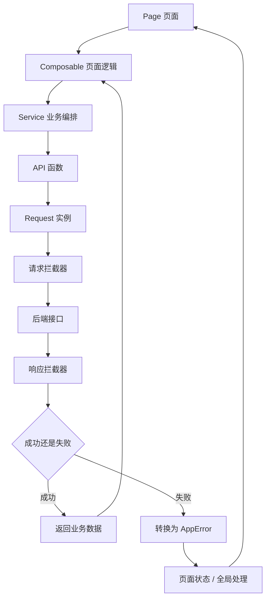
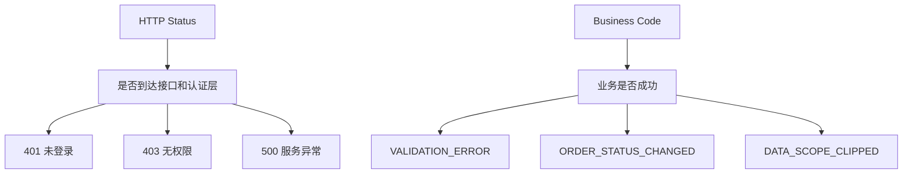
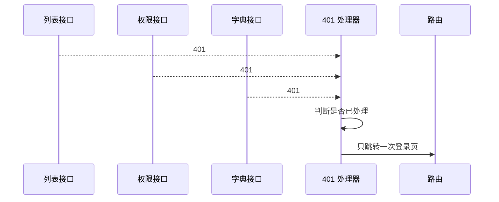
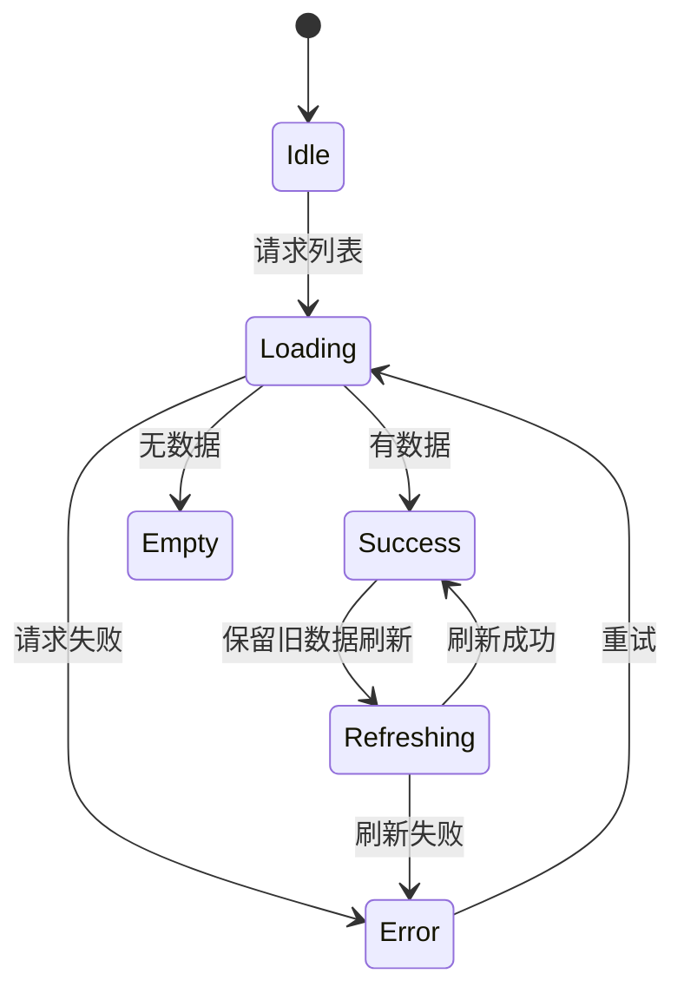
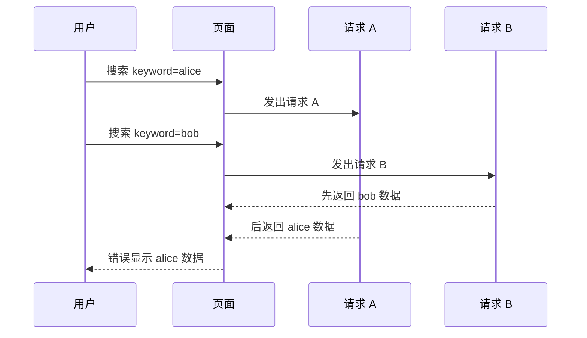
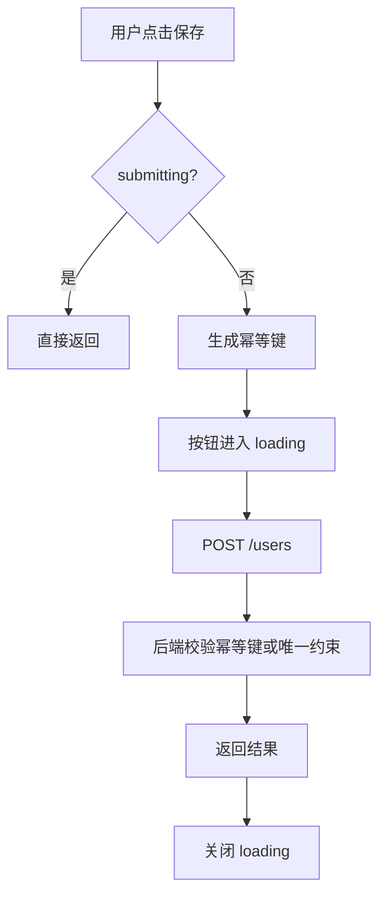
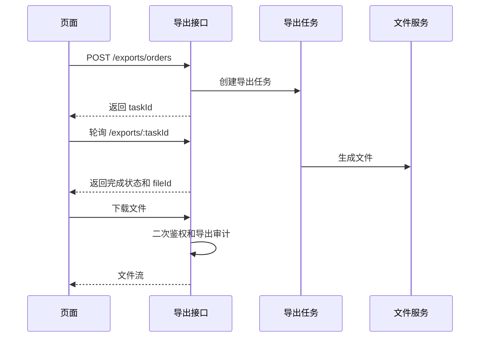
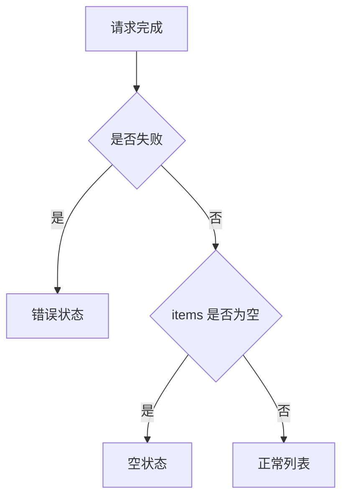
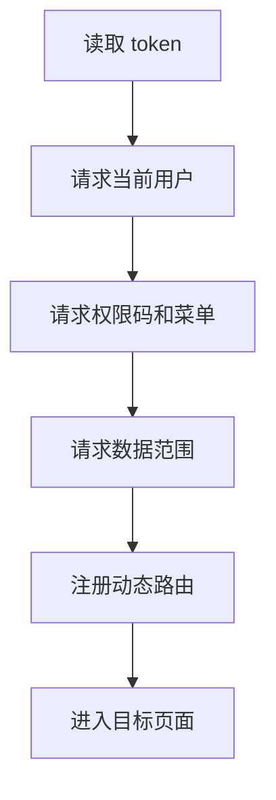

# Vue Admin 请求封装与错误处理闭环手册

## 这个页面解决什么

前面的 Vue Admin 手册已经把用户、角色、菜单、动态路由、组织架构和数据权限串起来了。接下来要解决的是后台项目每天都会遇到的问题：**接口请求失败时，系统到底应该怎么表现**。

很多项目的请求封装只做到“给 axios 加 token”，但真实后台里还需要处理：

- 登录过期后多个接口同时 401，不能重复跳登录。
- 已登录但无权限时 403，要区分页面无权限、按钮无权限和接口无权限。
- 数据权限裁剪后，列表数据变少，要解释原因。
- 搜索条件快速切换时，慢请求不能覆盖新请求。
- 保存按钮重复点击不能创建重复数据。
- 导出接口可能耗时很久，要改成任务状态。
- 网络失败、业务失败、表单校验失败、服务端异常要展示不同反馈。
- 每个请求要有 trace id，方便前后端联调和排障。

这一页不是替代 [请求与接口封装](/vue/request)，而是把请求封装放进 Vue Admin 项目里，形成可落地的“请求、错误、权限、页面状态、导出、审计、排障”闭环。

## 适合谁看

- 已经看完 [Vue Admin 组织架构与数据权限实现手册](/vue/admin-organization-data-permission)，准备把接口层做稳定的人。
- 正在做后台系统、SaaS 控制台、CRM、订单、工单、报表、权限系统的人。
- 遇到 401 循环跳转、403 提示混乱、重复提交、列表旧数据闪回、导出失败的人。
- 想把 API、service、composable、store、页面状态分清楚的人。

## 最终目标

一个成熟的 Vue Admin 请求与错误处理体系，应覆盖：

| 能力 | 说明 |
| --- | --- |
| 统一请求实例 | baseURL、token、trace id、租户 id、超时 |
| 响应拆包 | 统一处理后端 `code/message/data` |
| 错误分类 | 网络错误、401、403、400、409、422、500 分开处理 |
| 登录失效 | 并发 401 只处理一次，清理上下文并跳登录 |
| 接口无权限 | 403 进入无权限提示，不误判为未登录 |
| 数据范围裁剪 | 列表提示当前结果被权限裁剪 |
| 并发控制 | 快速切换查询条件时避免旧请求覆盖新数据 |
| 重复提交 | 按钮 loading、幂等键、后端唯一约束一起做 |
| 导出任务 | 长耗时导出走异步任务、进度、下载二次鉴权 |
| 页面状态 | loading、empty、error、success 不混用 |
| 联调证据 | 请求 URL、payload、status、trace id 可追踪 |

## 总体链路

先看请求从页面到后端再回到页面的完整路径：



这条链路有一个核心原则：

**请求层处理通用协议，service 处理业务编排，composable 处理页面状态，组件只负责展示和交互。**

不要让组件直接拼 URL，也不要让请求拦截器直接控制某个页面弹窗。

## 一、推荐目录结构

```text
src/
  app/
    router/
      guards.ts
    stores/
      auth.ts
      permission.ts
  shared/
    request/
      app-error.ts
      request.ts
      request-types.ts
      trace.ts
      unauthorized.ts
    feedback/
      error-message.ts
      status-view.ts
  features/
    users/
      services/
        userApi.ts
        userService.ts
      composables/
        useUserList.ts
        useUserForm.ts
    exports/
      services/
        exportApi.ts
      composables/
        useExportTask.ts
```

分层说明：

| 层 | 做什么 | 不做什么 |
| --- | --- | --- |
| `shared/request` | 请求实例、错误类型、拦截器、trace id | 具体业务状态 |
| `service` | 组合多个 API，做 DTO 转换 | 页面 loading |
| `composable` | loading、empty、error、submit 状态 | 拼接请求头 |
| `store` | token、用户、权限等跨页面状态 | 保存所有列表数据 |
| `component` | 视图和交互 | 直接写 fetch/axios |

## 二、统一响应和错误类型

先把成功响应和错误响应定清楚。

`shared/request/request-types.ts`：

```ts
export interface ApiResult<T> {
  code: string
  message: string
  data: T
  traceId?: string
}

export interface PageResult<T> {
  items: T[]
  total: number
  page: number
  pageSize: number
  scopeSummary?: ScopeSummary
}

export interface ScopeSummary {
  scopeType: 'self' | 'department' | 'department_tree' | 'custom' | 'all'
  appliedDepartmentNames: string[]
  clippedByPermission: boolean
}

export interface RequestOptions {
  silent?: boolean
  skipUnauthorizedHandler?: boolean
  skipPermissionHandler?: boolean
  idempotencyKey?: string
}
```

`shared/request/app-error.ts`：

```ts
export type AppErrorType =
  | 'network'
  | 'unauthorized'
  | 'forbidden'
  | 'validation'
  | 'conflict'
  | 'business'
  | 'server'
  | 'cancelled'
  | 'unknown'

export class AppError extends Error {
  constructor(
    message: string,
    public readonly type: AppErrorType,
    public readonly status?: number,
    public readonly code?: string,
    public readonly traceId?: string,
    public readonly detail?: unknown
  ) {
    super(message)
    this.name = 'AppError'
  }
}

export function isAppError(error: unknown): error is AppError {
  return error instanceof AppError
}
```

为什么要有 `AppError`：

- 页面不需要理解 axios/fetch 的原始错误结构。
- 401、403、业务错误、网络错误可以走不同 UI。
- trace id 能透传到错误页和联调记录。

## 三、错误码分层

后端状态码和业务 `code` 要分工清楚。



推荐规则：

| 类型 | 示例 | 前端处理 |
| --- | --- | --- |
| HTTP 401 | token 过期、未登录 | 清理上下文，跳登录 |
| HTTP 403 | 无接口权限 | 展示无权限，不跳登录 |
| HTTP 400 | 请求参数格式错误 | 展示参数错误，记录联调证据 |
| HTTP 409 | 数据冲突 | 展示冲突原因，引导刷新 |
| HTTP 422 | 表单校验失败 | 映射到表单字段错误 |
| HTTP 500 | 服务端异常 | 展示系统错误和 trace id |
| 业务 code 非成功 | 状态不允许、余额不足 | 页面或业务弹窗处理 |

不要把所有失败都返回 HTTP 200。否则浏览器、网关、监控、联调工具都无法正确识别问题。

## 四、请求实例

下面用 axios 风格演示。如果项目用原生 `fetch`，思想相同：统一请求入口、统一错误转换、统一 token 和 trace id。

`shared/request/request.ts`：

```ts
import axios, { AxiosError, type AxiosRequestConfig } from 'axios'
import { useAuthStore } from '@/app/stores/auth'
import { AppError } from './app-error'
import type { ApiResult, RequestOptions } from './request-types'
import { createTraceId } from './trace'
import { handleUnauthorizedOnce } from './unauthorized'

declare module 'axios' {
  export interface AxiosRequestConfig {
    requestOptions?: RequestOptions
  }
}

export const request = axios.create({
  baseURL: import.meta.env.VITE_API_BASE_URL,
  timeout: 15000
})

request.interceptors.request.use((config) => {
  const authStore = useAuthStore()
  const traceId = createTraceId()

  config.headers.set('X-Trace-Id', traceId)

  if (authStore.token) {
    config.headers.set('Authorization', `Bearer ${authStore.token}`)
  }

  if (config.requestOptions?.idempotencyKey) {
    config.headers.set('Idempotency-Key', config.requestOptions.idempotencyKey)
  }

  return config
})

request.interceptors.response.use(
  (response) => {
    const result = response.data as ApiResult<unknown>

    if (result.code !== 'SUCCESS') {
      throw new AppError(
        result.message || '请求失败',
        'business',
        response.status,
        result.code,
        result.traceId
      )
    }

    return result.data
  },
  async (error: AxiosError<ApiResult<unknown>>) => {
    const appError = mapAxiosError(error)

    if (appError.type === 'unauthorized' && !error.config?.requestOptions?.skipUnauthorizedHandler) {
      await handleUnauthorizedOnce()
    }

    throw appError
  }
)

function mapAxiosError(error: AxiosError<ApiResult<unknown>>) {
  if (error.code === 'ERR_CANCELED') {
    return new AppError('请求已取消', 'cancelled')
  }

  if (!error.response) {
    return new AppError('网络异常，请检查连接后重试', 'network')
  }

  const status = error.response.status
  const result = error.response.data
  const message = result?.message || defaultMessageByStatus(status)

  if (status === 401) return new AppError(message, 'unauthorized', status, result?.code, result?.traceId)
  if (status === 403) return new AppError(message, 'forbidden', status, result?.code, result?.traceId)
  if (status === 409) return new AppError(message, 'conflict', status, result?.code, result?.traceId)
  if (status === 422) return new AppError(message, 'validation', status, result?.code, result?.traceId, result?.data)
  if (status >= 500) return new AppError(message, 'server', status, result?.code, result?.traceId)

  return new AppError(message, 'unknown', status, result?.code, result?.traceId)
}

function defaultMessageByStatus(status: number) {
  if (status === 400) return '请求参数不正确'
  if (status === 401) return '登录已过期，请重新登录'
  if (status === 403) return '没有权限执行该操作'
  if (status === 404) return '请求的资源不存在'
  if (status === 409) return '数据已发生变化，请刷新后重试'
  if (status >= 500) return '服务暂时不可用，请稍后重试'
  return '请求失败'
}
```

Axios 官方文档把拦截器定位为请求发出前、响应处理前的统一处理点。这里正好用它处理 token、trace id、响应拆包和错误转换。

## 五、trace id

每个请求都应该带 trace id，便于联调。

`shared/request/trace.ts`：

```ts
export function createTraceId() {
  if (crypto.randomUUID) {
    return crypto.randomUUID()
  }

  return `${Date.now()}-${Math.random().toString(16).slice(2)}`
}
```

请求失败时，页面可以展示：

```vue
<template>
  <p v-if="error?.traceId" class="request-error__trace">
    请求编号：{{ error.traceId }}
  </p>
</template>
```

联调时不要只说“接口报错了”，至少要给后端：

- 请求 URL。
- 请求方法。
- 请求 payload。
- 响应 status。
- 响应 body。
- trace id。

## 六、401 只处理一次

多个接口同时返回 401 时，如果每个请求都弹窗、清状态、跳登录，用户会看到多次提示，路由也可能反复跳转。



`shared/request/unauthorized.ts`：

```ts
import { router } from '@/app/router'
import { useAuthStore } from '@/app/stores/auth'
import { usePermissionStore } from '@/app/stores/permission'

let handlingUnauthorized: Promise<void> | null = null

export function handleUnauthorizedOnce() {
  if (handlingUnauthorized) return handlingUnauthorized

  handlingUnauthorized = handleUnauthorized().finally(() => {
    handlingUnauthorized = null
  })

  return handlingUnauthorized
}

async function handleUnauthorized() {
  const authStore = useAuthStore()
  const permissionStore = usePermissionStore()

  authStore.reset()
  permissionStore.reset()

  const currentPath = router.currentRoute.value.fullPath

  if (router.currentRoute.value.path !== '/login') {
    await router.replace({
      path: '/login',
      query: { redirect: currentPath }
    })
  }
}
```

注意：

- 401 是“未登录或登录失效”，不是“无权限”。
- 403 是“已登录但没有权限”，不要跳登录。
- 登出时要同步清理菜单、动态路由、标签页和权限缓存。

## 七、403 怎么处理

403 分两种场景：

| 场景 | 表现 | 处理 |
| --- | --- | --- |
| 页面接口 403 | 页面能打开，但核心数据无权限 | 页面展示无权限状态 |
| 操作接口 403 | 点击删除、导出、授权失败 | 保留页面，提示没有该操作权限 |

不要所有 403 都跳到 `/403`，否则用户在表格里点一个无权限按钮就离开当前页面，体验很差。

推荐在 composable 里处理：

```ts
import { ref } from 'vue'
import { isAppError, type AppError } from '@/shared/request/app-error'

export function usePageRequestError() {
  const error = ref<AppError>()

  function setError(value: unknown) {
    if (isAppError(value)) {
      error.value = value
      return
    }

    error.value = undefined
  }

  function clearError() {
    error.value = undefined
  }

  return {
    error,
    setError,
    clearError
  }
}
```

页面判断：

```vue
<template>
  <ForbiddenState v-if="error?.type === 'forbidden'" :trace-id="error.traceId" />
  <ServerErrorState v-else-if="error?.type === 'server'" :trace-id="error.traceId" />
  <UserTable v-else :items="items" />
</template>
```

操作接口判断：

```ts
async function removeUser(id: number) {
  try {
    await userService.removeUser(id)
    await load()
  } catch (error) {
    if (isAppError(error) && error.type === 'forbidden') {
      showWarning('你没有删除用户的权限')
      return
    }

    throw error
  }
}
```

## 八、页面状态模型

页面不要只有一个 `loading`。



推荐状态：

| 状态 | 用途 |
| --- | --- |
| `loading` | 首次加载，表格区域可骨架屏 |
| `refreshing` | 已有数据时刷新，不清空旧表格 |
| `submitting` | 表单保存按钮 |
| `exporting` | 导出按钮或导出任务 |
| `error` | 页面级错误 |
| `empty` | 请求成功但无数据 |

不要用一个 `loading` 控制页面、弹窗、导出和删除按钮。

## 九、列表请求 composable

下面是后台列表最常见的请求组织方式。

`features/users/composables/useUserList.ts`：

```ts
import { computed, reactive, ref } from 'vue'
import { AppError, isAppError } from '@/shared/request/app-error'
import { userService } from '../services/userService'
import type { UserListItem, UserQuery } from '../model/user.types'

export function useUserList() {
  const items = ref<UserListItem[]>([])
  const total = ref(0)
  const loading = ref(false)
  const refreshing = ref(false)
  const error = ref<AppError>()

  const query = reactive<UserQuery>({
    keyword: '',
    status: undefined,
    departmentId: undefined,
    page: 1,
    pageSize: 20
  })

  const empty = computed(() => !loading.value && !error.value && items.value.length === 0)

  async function load(options: { keepItems?: boolean } = {}) {
    const isRefresh = options.keepItems && items.value.length > 0
    loading.value = !isRefresh
    refreshing.value = isRefresh
    error.value = undefined

    try {
      const result = await userService.getUserPage({ ...query })
      items.value = result.items
      total.value = result.total
    } catch (value) {
      if (isAppError(value) && value.type !== 'cancelled') {
        error.value = value
      }
    } finally {
      loading.value = false
      refreshing.value = false
    }
  }

  async function search() {
    query.page = 1
    await load()
  }

  return {
    items,
    total,
    query,
    loading,
    refreshing,
    error,
    empty,
    load,
    search
  }
}
```

注意这里有两个细节：

- 请求时用 `{ ...query }` 创建快照，避免请求过程中 query 被用户继续修改。
- `cancelled` 不进入页面错误态，取消旧请求是正常行为。

## 十、并发请求和旧数据覆盖

快速切换筛选条件时，常见问题是慢请求后返回，把新请求的数据覆盖掉。



两种处理方式：

| 方式 | 优点 | 适合 |
| --- | --- | --- |
| 请求序号 | 简单，不依赖取消能力 | axios/fetch 都可用 |
| AbortController | 能取消旧请求，节省资源 | fetch 或支持 signal 的请求库 |

### 请求序号

```ts
let requestSeq = 0

async function load() {
  const seq = ++requestSeq
  const querySnapshot = { ...query }

  const result = await userService.getUserPage(querySnapshot)

  if (seq !== requestSeq) return

  items.value = result.items
  total.value = result.total
}
```

### AbortController

MDN 文档说明 `AbortController.abort()` 可以中止异步操作，包括 fetch 请求、响应体消费和流。

```ts
let currentController: AbortController | undefined

async function load() {
  currentController?.abort()

  currentController = new AbortController()

  try {
    const result = await userService.getUserPage(
      { ...query },
      { signal: currentController.signal }
    )

    items.value = result.items
    total.value = result.total
  } finally {
    currentController = undefined
  }
}
```

无论用哪种方式，都要保证旧请求不能覆盖新状态。

## 十一、重复提交

重复提交不能只靠前端按钮禁用。前端负责降低误操作，后端负责真正幂等。



前端：

```ts
import { ref } from 'vue'
import { createTraceId } from '@/shared/request/trace'

const submitting = ref(false)

async function submit() {
  if (submitting.value) return

  submitting.value = true

  try {
    await userService.createUser(form.value, {
      idempotencyKey: createTraceId()
    })
  } finally {
    submitting.value = false
  }
}
```

后端还要做：

- 唯一约束，例如用户名、手机号、业务单号。
- 幂等键，例如 `Idempotency-Key`。
- 状态机校验，例如已审批不能重复提交审批。

## 十二、数据范围裁剪提示

组织与数据权限手册里提到 `scopeSummary`。请求闭环里要把它接到列表页面。

```ts
export interface PageResult<T> {
  items: T[]
  total: number
  scopeSummary?: {
    scopeType: string
    appliedDepartmentNames: string[]
    clippedByPermission: boolean
  }
}
```

页面使用：

```vue
<template>
  <DataScopeAlert
    v-if="scopeSummary?.clippedByPermission"
    :departments="scopeSummary.appliedDepartmentNames"
  />

  <UserTable :items="items" />
</template>
```

交互规则：

| 情况 | 页面表现 |
| --- | --- |
| 用户选择了无权部门 | 展示空列表和“筛选范围超出权限” |
| 用户选择上级部门但只授权本部门 | 展示被裁剪提示 |
| 用户有全部数据 | 不显示裁剪提示 |
| 导出被裁剪 | 导出确认弹窗说明导出范围 |

这能避免“数据少了是 bug 还是权限”的沟通成本。

## 十三、导出任务

后台导出不能简单写成同步下载，尤其是订单、报表、客户、审计日志。

推荐异步导出：



`features/exports/composables/useExportTask.ts`：

```ts
import { ref } from 'vue'
import { exportApi } from '../services/exportApi'

export function useExportTask() {
  const exporting = ref(false)
  const progressText = ref('')

  async function startExport(payload: Record<string, unknown>) {
    if (exporting.value) return

    exporting.value = true
    progressText.value = '正在创建导出任务'

    try {
      const task = await exportApi.createExportTask(payload)
      progressText.value = '正在生成文件'

      const result = await pollExportTask(task.id)

      progressText.value = '正在下载文件'
      await exportApi.downloadExportFile(result.fileId)
    } finally {
      exporting.value = false
      progressText.value = ''
    }
  }

  return {
    exporting,
    progressText,
    startExport
  }
}

async function pollExportTask(taskId: number) {
  for (let index = 0; index < 60; index += 1) {
    const result = await exportApi.getExportTask(taskId)

    if (result.status === 'success') return result
    if (result.status === 'failed') throw new Error(result.errorMessage || '导出失败')

    await sleep(2000)
  }

  throw new Error('导出超时，请稍后在导出记录中查看')
}

function sleep(ms: number) {
  return new Promise((resolve) => window.setTimeout(resolve, ms))
}
```

导出必须遵守：

- 和列表相同的数据范围。
- 记录导出条件快照。
- 记录导出人、时间、行数、字段范围。
- 下载文件时二次鉴权。
- 敏感导出加水印或审批。

## 十四、表单校验错误

后端表单校验失败通常返回 422。前端要把字段错误映射回表单。

推荐后端结构：

```ts
interface ValidationErrorDetail {
  field: string
  message: string
}
```

前端处理：

```ts
function applyValidationErrors(error: AppError, setFieldError: (field: string, message: string) => void) {
  if (error.type !== 'validation') return false

  const details = error.detail as ValidationErrorDetail[] | undefined

  for (const item of details ?? []) {
    setFieldError(item.field, item.message)
  }

  return true
}
```

不要把所有表单错误都弹 toast。字段错误应该显示在字段旁边，用户才能知道改哪里。

## 十五、空状态和错误状态

空状态不是错误，错误状态也不是空状态。



推荐文案：

| 状态 | 文案 |
| --- | --- |
| 首次无数据 | 暂无数据，可以尝试新增或调整筛选条件 |
| 搜索无结果 | 没有符合条件的数据，请修改筛选条件 |
| 无权限 | 你没有查看该数据的权限 |
| 网络失败 | 网络异常，请检查连接后重试 |
| 服务异常 | 服务暂时不可用，请稍后重试 |
| 数据冲突 | 数据已发生变化，请刷新后重试 |

空状态要结合场景，不要所有页面都写“暂无数据”。

## 十六、service 如何组织业务流程

以用户模块为例，API 函数只描述接口，service 做 DTO 转换和业务拼装。

`features/users/services/userApi.ts`：

```ts
import { request } from '@/shared/request/request'
import type { PageResult, RequestOptions } from '@/shared/request/request-types'
import type { UserDTO, UserQueryDTO } from '../model/user.types'

export function getUserPage(params: UserQueryDTO) {
  return request.get<PageResult<UserDTO>>('/users', { params })
}

export function createUser(payload: unknown, options?: RequestOptions) {
  return request.post<UserDTO>('/users', payload, {
    requestOptions: options
  })
}
```

`features/users/services/userService.ts`：

```ts
import { mapUser } from '../model/user.mapper'
import { userApi } from './userApi'
import type { UserQuery } from '../model/user.types'

export const userService = {
  async getUserPage(query: UserQuery) {
    const result = await userApi.getUserPage({
      page: query.page,
      page_size: query.pageSize,
      keyword: query.keyword,
      status: query.status,
      department_id: query.departmentId
    })

    return {
      ...result,
      items: result.items.map(mapUser)
    }
  },

  async createUser(form: unknown, options?: { idempotencyKey?: string }) {
    const payload = mapUserFormToPayload(form)
    const result = await userApi.createUser(payload, options)
    return mapUser(result)
  }
}
```

这样 API 层保留后端字段，service 层返回前端友好的模型。

## 十七、全局提示和页面提示怎么分工

不是所有错误都应该全局弹 toast。

| 错误 | 推荐位置 | 原因 |
| --- | --- | --- |
| 401 | 全局处理 | 登录态失效是全局事件 |
| 403 页面数据 | 页面状态 | 用户需要知道当前页面无权限 |
| 403 操作 | 操作附近或轻提示 | 页面仍可继续使用 |
| 422 表单字段 | 表单字段旁 | 用户要知道改哪个字段 |
| 409 冲突 | 对话框或页面提示 | 需要用户刷新或确认 |
| 500 | 页面错误或全局提示 | 取决于是否核心数据 |
| 网络失败 | 页面错误和重试按钮 | 用户需要重试入口 |
| 取消请求 | 不提示 | 这是正常交互结果 |

全局提示太多会让用户不知道该处理哪个问题。

## 十八、路由守卫和请求初始化

Vue Router 官方文档说明导航守卫可以重定向或取消导航。后台项目里，路由守卫通常要初始化用户上下文：

```ts
router.beforeEach(async (to) => {
  const authStore = useAuthStore()
  const permissionStore = usePermissionStore()

  if (!to.meta.requiresAuth) return true

  if (!authStore.token) {
    return {
      path: '/login',
      query: { redirect: to.fullPath }
    }
  }

  if (!permissionStore.ready) {
    await initUserContext()
    return to.fullPath
  }

  return true
})
```

初始化顺序建议：



不要让每个页面各自请求用户信息、权限、菜单和数据范围。

## 十九、真实项目常见问题

### 1. 登录过期后弹出很多提示

原因：

- 多个接口同时 401。
- 每个响应拦截器都执行跳登录。

解决：

- 用 `handleUnauthorizedOnce()`。
- 401 处理时清理上下文并只跳转一次。

### 2. 403 被当成 401

原因：

- 后端没有区分未登录和无权限。
- 前端所有错误都走“跳登录”。

解决：

- 未登录返回 401。
- 已登录但无权限返回 403。
- 403 不跳登录，按页面或操作场景展示。

### 3. 搜索条件切换后出现旧数据

原因：

- 慢请求覆盖快请求。
- 请求没有 query 快照。

解决：

- 使用请求序号或 AbortController。
- 每次请求都复制当前 query。

### 4. 保存按钮生成重复数据

原因：

- 前端没有 `submitting` 防重。
- 后端没有幂等键或唯一约束。

解决：

- 前端提交期间禁用按钮。
- 后端加 `Idempotency-Key`、唯一索引或状态机。

### 5. 导出文件比页面列表多

原因：

- 导出接口没有复用数据范围过滤。
- 导出没有保存筛选条件快照。

解决：

- 导出和列表使用同一套查询条件和数据权限。
- 导出任务记录 query snapshot、用户、行数、字段。

### 6. 用户说看不到数据

排查：

- Network 里看请求参数。
- 看响应是否有 `scopeSummary`。
- 看是否 `clippedByPermission`。
- 后端查 allowedDepartmentIds。
- 对照用户角色和组织归属。

### 7. 页面一直 loading

原因：

- `finally` 没有关闭 loading。
- 请求被取消后没有处理。
- 异常被吞掉。

解决：

- 所有请求状态在 `finally` 关闭。
- 取消请求不进入错误态，但要结束 loading。
- 不要在 catch 里空处理。

## 二十、验收清单

| 检查项 | 通过标准 |
| --- | --- |
| 请求实例 | token、trace id、baseURL、timeout 都统一处理 |
| 响应拆包 | `SUCCESS` 返回 data，业务失败转 AppError |
| 401 | 并发 401 只跳登录一次，并清理上下文 |
| 403 | 页面 403 和操作 403 分开处理 |
| 表单错误 | 422 能映射到字段 |
| 网络错误 | 有重试入口和清晰文案 |
| 并发请求 | 旧请求不能覆盖新数据 |
| 重复提交 | 前端按钮防重，后端幂等兜底 |
| 导出任务 | 异步任务、进度、下载鉴权、导出审计 |
| 数据权限裁剪 | `scopeSummary` 能展示裁剪提示 |
| 页面状态 | loading、empty、error、refreshing、submitting 分清 |
| 联调证据 | 能拿到 URL、method、payload、status、trace id |

## 和其他文档怎么配合

| 你要做什么 | 继续看 |
| --- | --- |
| 学请求基础 | [请求与接口封装](/vue/request) |
| 从 mock 接真实接口 | [Vue Admin Mock 到真实接口联调实战](/vue/admin-mock-to-api) |
| 做用户模块 | [Vue Admin 用户模块实现手册](/vue/admin-user-module) |
| 做权限和菜单 | [Vue Admin 角色权限模块实现手册](/vue/admin-permission-module) |
| 做组织和数据范围 | [Vue Admin 组织架构与数据权限实现手册](/vue/admin-organization-data-permission) |
| 排查请求问题 | [Vue Admin 请求、权限与数据问题排查专题](/projects/issues-vue-admin-request) |
| 学通用排障方法 | [项目排障方法论](/projects/debugging-playbook) |
| 做 Vue Admin 文件任务闭环 | [Vue Admin 文件上传、下载、导入导出与异步任务闭环实战](/vue/admin-file-import-export) |
| 做 Vue Admin 工作台看板 | [Vue Admin 工作台、统计卡片、图表看板与数据刷新闭环实战](/vue/admin-dashboard-analytics) |
| 做导入导出 | [数据导入导出项目案例](/projects/import-export-case) |
| 看真实 Vue 问题 | [Vue 真实项目问题库](/projects/issues-vue) |

## 官方参考

- [Axios Interceptors](https://axios-http.com/docs/interceptors)
- [MDN AbortController](https://developer.mozilla.org/en-US/docs/Web/API/AbortController)
- [Vue Router 导航守卫](https://router.vuejs.org/guide/advanced/navigation-guards.html)
- [Pinia Defining a Store](https://pinia.vuejs.org/core-concepts/)
- [Pinia Actions](https://pinia.vuejs.org/core-concepts/actions.html)

## 下一步学习

请求与错误处理闭环完成后，Vue Admin 的基础工程能力已经比较完整。下一步可以继续补两个方向：

- 业务模块：审批流、文件中心、数据看板、导入导出。Vue Admin 主线建议先看 [Vue Admin 文件上传、下载、导入导出与异步任务闭环实战](/vue/admin-file-import-export) 和 [Vue Admin 工作台、统计卡片、图表看板与数据刷新闭环实战](/vue/admin-dashboard-analytics)。
- 问题库：进入 [Vue Admin 请求、权限与数据问题排查专题](/projects/issues-vue-admin-request)，把 401/403、并发请求、重复提交、导出失败、数据权限裁剪这些问题拆成可复制的排障案例。

如果你要继续按项目交付推进，建议下一页先看 [Vue Admin 文件上传、下载、导入导出与异步任务闭环实战](/vue/admin-file-import-export) 和 [Vue Admin 工作台、统计卡片、图表看板与数据刷新闭环实战](/vue/admin-dashboard-analytics)，再看 [Vue Admin 请求、权限与数据问题排查专题](/projects/issues-vue-admin-request)、[数据导入导出项目案例](/projects/import-export-case) 和 [数据看板项目案例](/projects/analytics-dashboard-case)。
