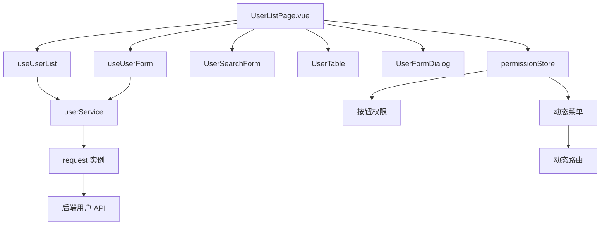
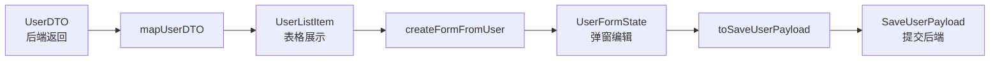
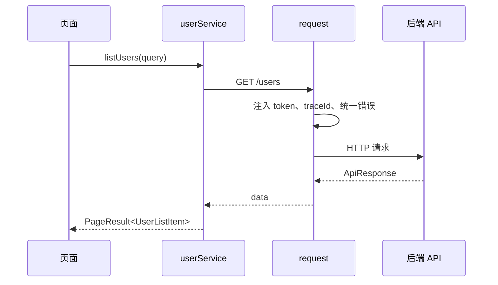
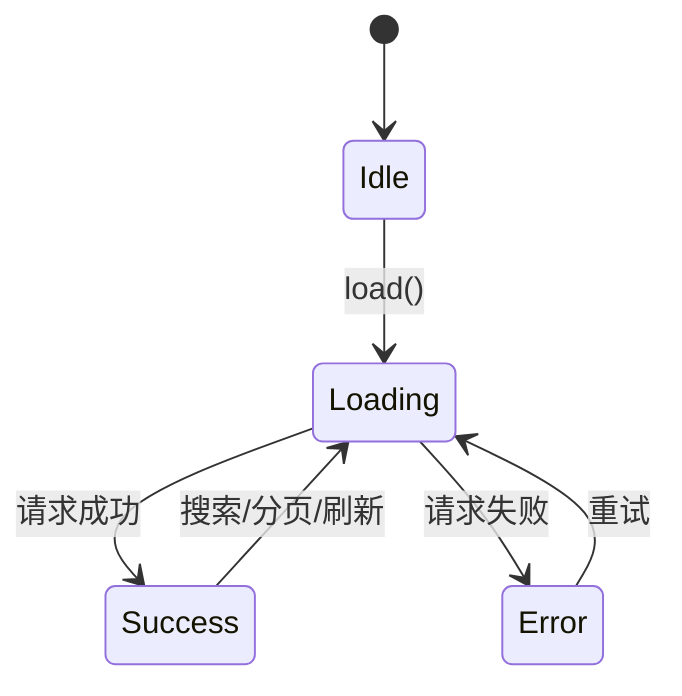
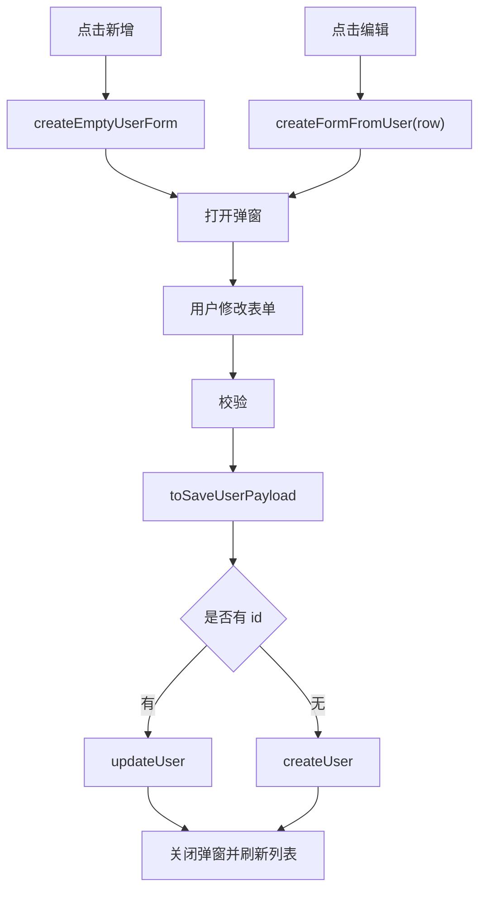
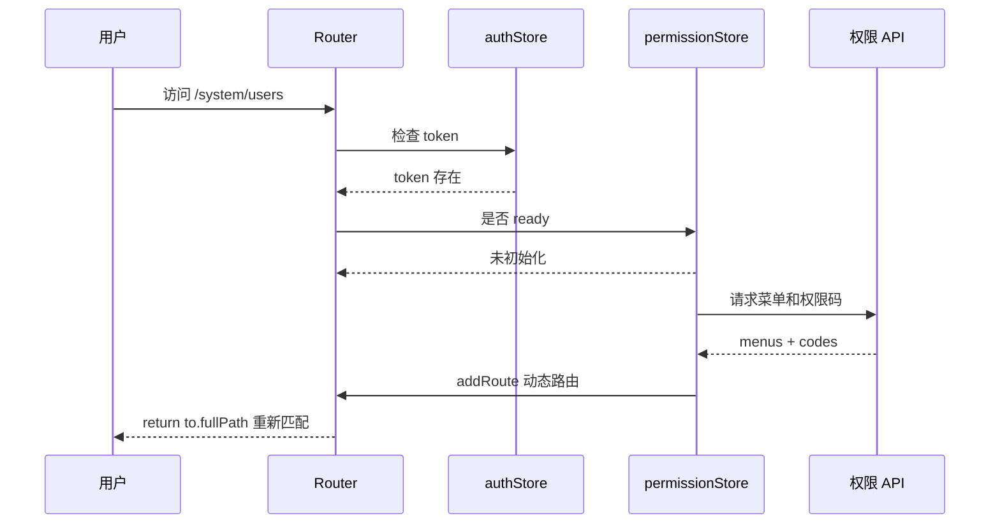
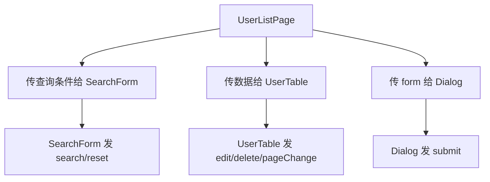

# Vue Admin 用户模块实现手册

## 这个页面解决什么

很多 Vue 学习资料会分别讲路由、Pinia、请求、表单和组件，但真实后台项目不是把这些知识点分开使用，而是要把它们组织成一个能长期维护的业务模块。

这一页用“用户管理模块”演示 Vue Admin 的项目级实现方式，重点解决：

- 用户模块应该放在哪个目录。
- 后端 DTO、页面列表、表单状态、保存参数如何分开。
- 请求封装、service、composable、页面组件各自负责什么。
- 表格搜索、分页、loading、错误状态如何组织。
- 新增和编辑弹窗如何避免污染列表行对象。
- 登录态、菜单、动态路由和按钮权限如何串起来。
- 如何做验收、排错和后续扩展。

它不是组件库教程，也不绑定具体 UI 库。你可以用 Element Plus、Ant Design Vue、Arco Design、TDesign、Naive UI 或项目内组件，只要边界一致，代码组织方式都可以复用。

## 适合谁看

- 已经读过 [Vue 从零到项目落地](/vue/project-from-zero)，想继续把用户模块做细的人。
- 正在做 Vue Admin、SaaS 控制台、企业后台、权限系统的人。
- 知道 Vue Router 和 Pinia，但不清楚动态路由、菜单、按钮权限怎么落地的人。
- 做过列表和弹窗，但经常遇到重复请求、表单污染列表、刷新丢菜单、权限错位的人。

## 模块最终形态

用户管理不是一个单独页面，而是一组有边界的文件：

```text
src/
  app/
    router/
      index.ts
      guards.ts
      dynamic-routes.ts
    stores/
      auth.ts
      permission.ts
  features/
    users/
      components/
        UserSearchForm.vue
        UserTable.vue
        UserFormDialog.vue
        UserStatusTag.vue
      services/
        userService.ts
      composables/
        useUserList.ts
        useUserForm.ts
      model/
        user.mapper.ts
        user.types.ts
        user.permissions.ts
      UserListPage.vue
  shared/
    request/
      index.ts
      types.ts
    permissions/
      can.ts
```

这个结构强调三点：

| 原则 | 说明 |
| --- | --- |
| 按业务聚合 | 用户模块相关的页面、组件、类型、请求、权限码放在一起 |
| 分层清楚 | 页面不直接拼接口，组件不直接请求后端，Store 不保存所有页面状态 |
| 可迁移 | 未来把用户模块迁到另一个后台项目时，能整体搬走 |

## 总体实现图



阅读这张图时，只需要记住：

- 页面负责把搜索、表格、弹窗、权限组合起来。
- composable 管理页面状态和交互流程。
- service 负责接口调用和数据转换。
- Pinia 只保存跨页面共享的登录态、菜单、权限码。
- 组件只收 props、发 emits，不知道后端接口细节。

## 一、先定义类型边界

真实项目里最容易偷懒的是“一个 `User` 类型用到底”。这会让后端字段、页面字段、表单字段、提交字段混在一起，后期每改一次接口都牵连整页。



推荐先写 `features/users/model/user.types.ts`：

```ts
export type UserStatus = 'enabled' | 'disabled'

export interface UserDTO {
  id: number
  user_name: string
  mobile: string | null
  status: 0 | 1
  role_ids: number[]
  role_names: string[]
  created_at: string
}

export interface UserListItem {
  id: number
  name: string
  mobileText: string
  enabled: boolean
  roleIds: number[]
  roleNames: string[]
  createdAtText: string
}

export interface UserFormState {
  id?: number
  name: string
  mobile: string
  roleIds: number[]
  enabled: boolean
}

export interface SaveUserPayload {
  id?: number
  name: string
  mobile?: string
  roleIds: number[]
  status: 0 | 1
}

export interface UserListQuery {
  keyword: string
  status?: UserStatus
  page: number
  pageSize: number
}

export interface PageResult<T> {
  list: T[]
  total: number
}
```

再写 `features/users/model/user.mapper.ts`：

```ts
import type { SaveUserPayload, UserDTO, UserFormState, UserListItem } from './user.types'

export function mapUserDTO(dto: UserDTO): UserListItem {
  return {
    id: dto.id,
    name: dto.user_name,
    mobileText: dto.mobile || '-',
    enabled: dto.status === 1,
    roleIds: dto.role_ids,
    roleNames: dto.role_names,
    createdAtText: dto.created_at
  }
}

export function createEmptyUserForm(): UserFormState {
  return {
    name: '',
    mobile: '',
    roleIds: [],
    enabled: true
  }
}

export function createFormFromUser(user: UserListItem): UserFormState {
  return {
    id: user.id,
    name: user.name,
    mobile: user.mobileText === '-' ? '' : user.mobileText,
    roleIds: [...user.roleIds],
    enabled: user.enabled
  }
}

export function toSaveUserPayload(form: UserFormState): SaveUserPayload {
  return {
    id: form.id,
    name: form.name.trim(),
    mobile: form.mobile.trim() || undefined,
    roleIds: [...form.roleIds],
    status: form.enabled ? 1 : 0
  }
}
```

这里有两个关键点：

| 关键点 | 为什么 |
| --- | --- |
| `roleIds: [...user.roleIds]` | 避免表单修改数组时影响列表行 |
| `mobileText === '-' ? '' : mobileText` | 页面展示值不直接进入提交参数 |

## 二、请求层只做通用能力

请求层应该解决通用问题，不应该知道“用户管理”业务。



`shared/request/types.ts`：

```ts
export interface ApiResponse<T> {
  code: string
  message: string
  data: T
}

export interface RequestOptions {
  silent?: boolean
}
```

`shared/request/index.ts` 可以保留统一能力：

```ts
import type { ApiResponse, RequestOptions } from './types'

const API_BASE_URL = import.meta.env.VITE_API_BASE_URL || '/api'

export async function request<T>(
  path: string,
  init: RequestInit = {},
  options: RequestOptions = {}
): Promise<T> {
  const response = await fetch(`${API_BASE_URL}${path}`, {
    ...init,
    headers: {
      'Content-Type': 'application/json',
      ...init.headers
    }
  })

  if (!response.ok) {
    throw new Error(`HTTP ${response.status}`)
  }

  const result = (await response.json()) as ApiResponse<T>

  if (result.code !== 'OK') {
    if (!options.silent) {
      console.error(result.message)
    }

    throw new Error(result.message || '请求失败')
  }

  return result.data
}
```

真实项目中还会加 token、租户、traceId、401 跳登录、403 跳无权限页。建议这些放在请求层或请求拦截器里，不要散落在每个 service。

## 三、service 负责业务接口和转换

`features/users/services/userService.ts`：

```ts
import { request } from '@/shared/request'
import { mapUserDTO } from '../model/user.mapper'
import type {
  PageResult,
  SaveUserPayload,
  UserDTO,
  UserListItem,
  UserListQuery
} from '../model/user.types'

interface UserListDTO {
  list: UserDTO[]
  total: number
}

export async function listUsers(query: UserListQuery): Promise<PageResult<UserListItem>> {
  const params = new URLSearchParams()
  params.set('keyword', query.keyword)
  params.set('page', String(query.page))
  params.set('pageSize', String(query.pageSize))

  if (query.status) {
    params.set('status', query.status)
  }

  const result = await request<UserListDTO>(`/users?${params.toString()}`)

  return {
    list: result.list.map(mapUserDTO),
    total: result.total
  }
}

export function createUser(payload: SaveUserPayload) {
  return request<void>('/users', {
    method: 'POST',
    body: JSON.stringify(payload)
  })
}

export function updateUser(payload: SaveUserPayload) {
  return request<void>(`/users/${payload.id}`, {
    method: 'PUT',
    body: JSON.stringify(payload)
  })
}

export function deleteUser(id: number) {
  return request<void>(`/users/${id}`, {
    method: 'DELETE'
  })
}
```

service 层的边界：

| 应该做 | 不应该做 |
| --- | --- |
| 调接口 | 控制弹窗显示 |
| 转 DTO | 直接操作组件 ref |
| 统一业务路径 | 保存表单校验状态 |
| 返回页面需要的模型 | 写全局 Pinia 页面状态 |

## 四、用 composable 管理列表状态

列表页的状态很多：查询条件、分页、loading、错误、当前数据、刷新、删除、重置。放在页面里会越来越乱，放在 Pinia 又太重，适合抽成 composable。



`features/users/composables/useUserList.ts`：

```ts
import { reactive, ref } from 'vue'
import { deleteUser, listUsers } from '../services/userService'
import type { UserListItem, UserListQuery } from '../model/user.types'

export function useUserList() {
  const query = reactive<UserListQuery>({
    keyword: '',
    page: 1,
    pageSize: 10
  })

  const users = ref<UserListItem[]>([])
  const total = ref(0)
  const loading = ref(false)
  const errorMessage = ref('')
  let requestSeq = 0

  async function loadUsers() {
    const currentSeq = ++requestSeq
    loading.value = true
    errorMessage.value = ''

    try {
      const result = await listUsers({ ...query })

      if (currentSeq !== requestSeq) return

      users.value = result.list
      total.value = result.total
    } catch (error) {
      if (currentSeq !== requestSeq) return

      errorMessage.value = error instanceof Error ? error.message : '加载失败'
    } finally {
      if (currentSeq === requestSeq) {
        loading.value = false
      }
    }
  }

  function search() {
    query.page = 1
    return loadUsers()
  }

  function reset() {
    query.keyword = ''
    query.status = undefined
    query.page = 1
    return loadUsers()
  }

  async function remove(id: number) {
    await deleteUser(id)

    if (users.value.length === 1 && query.page > 1) {
      query.page -= 1
    }

    await loadUsers()
  }

  return {
    query,
    users,
    total,
    loading,
    errorMessage,
    loadUsers,
    search,
    reset,
    remove
  }
}
```

这里加 `requestSeq` 是为了处理一个真实项目常见问题：用户连续切换查询条件，旧请求比新请求更晚返回，导致页面显示旧数据。

## 五、用 composable 管理表单弹窗

新增和编辑弹窗共享一套表单，但状态要隔离，不能直接绑定列表行。



`features/users/composables/useUserForm.ts`：

```ts
import { reactive, ref } from 'vue'
import { createEmptyUserForm, createFormFromUser, toSaveUserPayload } from '../model/user.mapper'
import { createUser, updateUser } from '../services/userService'
import type { UserFormState, UserListItem } from '../model/user.types'

export function useUserForm(onSaved: () => Promise<void>) {
  const visible = ref(false)
  const saving = ref(false)
  const form = reactive<UserFormState>(createEmptyUserForm())

  function resetForm(next: UserFormState) {
    Object.assign(form, next)
  }

  function openCreate() {
    resetForm(createEmptyUserForm())
    visible.value = true
  }

  function openEdit(user: UserListItem) {
    resetForm(createFormFromUser(user))
    visible.value = true
  }

  async function submit() {
    saving.value = true

    try {
      const payload = toSaveUserPayload(form)

      if (payload.id) {
        await updateUser(payload)
      } else {
        await createUser(payload)
      }

      visible.value = false
      await onSaved()
    } finally {
      saving.value = false
    }
  }

  return {
    visible,
    saving,
    form,
    openCreate,
    openEdit,
    submit
  }
}
```

这里不要写 `form = createEmptyUserForm()`。如果 `form` 是 `reactive`，重新赋值会破坏外部引用。保持同一个响应式对象，用 `Object.assign` 更新字段更稳。

## 六、页面负责组装，不负责细节

`features/users/UserListPage.vue` 应该像业务流程说明，而不是把所有逻辑塞满。

```vue
<script setup lang="ts">
import { onMounted } from 'vue'
import { usePermissionStore } from '@/app/stores/permission'
import UserFormDialog from './components/UserFormDialog.vue'
import UserSearchForm from './components/UserSearchForm.vue'
import UserTable from './components/UserTable.vue'
import { USER_PERMISSIONS } from './model/user.permissions'
import { useUserForm } from './composables/useUserForm'
import { useUserList } from './composables/useUserList'

const permissionStore = usePermissionStore()
const userList = useUserList()
const userForm = useUserForm(userList.loadUsers)

const canCreate = permissionStore.has(USER_PERMISSIONS.create)
const canEdit = permissionStore.has(USER_PERMISSIONS.edit)
const canDelete = permissionStore.has(USER_PERMISSIONS.delete)

onMounted(() => {
  userList.loadUsers()
})
</script>

<template>
  <section class="user-page">
    <UserSearchForm
      v-model:keyword="userList.query.keyword"
      v-model:status="userList.query.status"
      :loading="userList.loading.value"
      @search="userList.search"
      @reset="userList.reset"
    />

    <div class="user-page__toolbar">
      <button v-if="canCreate" type="button" @click="userForm.openCreate">
        新增用户
      </button>
    </div>

    <UserTable
      :users="userList.users.value"
      :total="userList.total.value"
      :page="userList.query.page"
      :page-size="userList.query.pageSize"
      :loading="userList.loading.value"
      :can-edit="canEdit"
      :can-delete="canDelete"
      @update:page="userList.query.page = $event; userList.loadUsers()"
      @edit="userForm.openEdit"
      @delete="userList.remove"
    />

    <UserFormDialog
      v-model:visible="userForm.visible.value"
      :form="userForm.form"
      :saving="userForm.saving.value"
      @submit="userForm.submit"
    />
  </section>
</template>
```

如果使用组件库，模板会换成组件库写法，但边界不变：

- 搜索表单只负责搜索条件输入。
- 表格只负责展示和发出编辑、删除、分页事件。
- 弹窗只负责表单输入和提交事件。
- 页面组合它们。

## 七、按钮权限集中维护

`features/users/model/user.permissions.ts`：

```ts
export const USER_PERMISSIONS = {
  view: 'user:view',
  create: 'user:create',
  edit: 'user:edit',
  delete: 'user:delete',
  disable: 'user:disable'
} as const
```

不要在页面里到处写字符串：

```vue
<!-- 不推荐 -->
<button v-if="permissionStore.has('user:create')">新增</button>
```

原因很简单：权限码一旦改名，全站很难找齐。集中维护后可以搜索常量，也能写注释说明业务含义。

权限判断可以封装在 `permissionStore`：

```ts
export const usePermissionStore = defineStore('permission', {
  state: () => ({
    codes: [] as string[],
    menus: [] as MenuItem[],
    ready: false
  }),
  actions: {
    has(code: string) {
      return this.codes.includes(code)
    }
  }
})
```

Pinia 官方文档把 state、getters、actions 分别类比为 store 的数据、计算属性和方法。用户权限这种跨页面共享数据适合放在 Store，但表格查询条件和弹窗状态不适合放进去。

## 八、动态菜单和动态路由

后台项目常见流程：



Vue Router 官方动态路由文档建议：如果在导航守卫中添加路由，不要在守卫里直接 `router.replace()`，而是通过返回新的位置触发重定向，例如返回 `to.fullPath`。

简化代码：

```ts
router.beforeEach(async (to) => {
  const authStore = useAuthStore()
  const permissionStore = usePermissionStore()

  if (!to.meta.requiresAuth) return true

  if (!authStore.token) {
    return {
      path: '/login',
      query: { redirect: to.fullPath }
    }
  }

  if (!permissionStore.ready) {
    await permissionStore.loadPermissions()
    registerDynamicRoutes(permissionStore.menus)

    return to.fullPath
  }

  if (!permissionStore.canVisit(to)) {
    return '/403'
  }

  return true
})
```

动态路由要注意：

| 问题 | 处理方式 |
| --- | --- |
| 刷新后菜单丢失 | token 存在时重新请求用户信息、菜单和权限码 |
| 动态路由注册后仍 404 | 注册完成后 `return to.fullPath` 重新匹配 |
| 404 路由提前匹配 | 让动态路由有机会先注册，再进入 fallback |
| 菜单组件路径不可信 | 建立白名单 `pageModules`，不要直接执行后端字符串 |
| 按钮有权限但接口 403 | 前端按钮权限和后端接口权限要共用权限码体系 |

## 九、组件拆分规则

用户模块至少拆成 3 个业务组件：

| 组件 | 输入 | 输出 | 不应该做 |
| --- | --- | --- | --- |
| `UserSearchForm` | keyword、status、loading | search、reset、update model | 请求用户列表 |
| `UserTable` | users、分页、权限、loading | edit、delete、update page | 修改用户表单 |
| `UserFormDialog` | visible、form、saving | submit、update visible | 直接调用 service |

拆组件不是为了文件多，而是为了边界清楚：



如果子组件直接请求接口，页面就很难统一 loading、错误、刷新和权限。

## 十、常见问题和解决方案

| 问题 | 根因 | 解决方案 |
| --- | --- | --- |
| 编辑弹窗一输入，表格也变了 | 表单直接引用了行对象 | 用 `createFormFromUser(row)` 复制 |
| 搜索后分页仍停在第 5 页 | 搜索没有重置 page | `search()` 里先 `page = 1` |
| 快速切换条件显示旧数据 | 旧请求晚于新请求返回 | 使用请求序号或取消旧请求 |
| 刷新后动态页面 404 | 动态路由没有恢复 | token 存在时先加载权限再 `return to.fullPath` |
| 按钮隐藏但接口能调 | 只做了前端权限 | 后端接口也必须校验权限码 |
| Store 越来越大 | 页面状态也塞进 Pinia | 查询、弹窗、表单留在页面或 composable |
| 类型越来越乱 | DTO、表单、提交参数共用一个类型 | 分成 DTO、ListItem、FormState、Payload |

## 十一、验收清单

| 能力 | 验收方式 |
| --- | --- |
| 用户列表 | 能搜索、分页、刷新后仍可加载 |
| 新增用户 | 表单校验通过后创建，列表刷新 |
| 编辑用户 | 不污染原列表行，保存后列表更新 |
| 删除用户 | 删除最后一条时分页回退 |
| 请求封装 | 统一处理错误和业务 code |
| 类型边界 | DTO、页面模型、表单、提交参数分离 |
| 动态路由 | 刷新 `/system/users` 不丢页面 |
| 菜单权限 | 无菜单权限时侧边栏不显示 |
| 按钮权限 | 无权限按钮不显示，接口也返回 403 |
| 异常处理 | loading、error、空数据都有状态 |
| 项目文档 | README 写清目录、数据流、权限恢复流程 |

## 十二、交付文档模板

建议在项目 README 或模块文档中补这一段：

```text
## 用户管理模块

### 目录结构

### 页面能力

### 数据流

### 类型边界

### 请求接口

### 权限码

### 动态路由恢复流程

### 常见问题

### 验收清单
```

真实团队里，文档不是额外工作。它能降低后续维护成本，尤其是权限、动态路由、请求封装这类隐性逻辑。

## 参考资料

- [Vue 响应式基础](https://vuejs.org/guide/essentials/reactivity-fundamentals.html)
- [Vue Router 导航守卫](https://router.vuejs.org/guide/advanced/navigation-guards.html)
- [Vue Router 动态路由](https://router.vuejs.org/guide/advanced/dynamic-routing)
- [Pinia 核心概念](https://pinia.vuejs.org/core-concepts/)
- [Pinia Actions](https://pinia.vuejs.org/core-concepts/actions.html)

## 下一步学习

继续看 [Vue 从零到项目落地](/vue/project-from-zero)、[Vue Admin 表单弹窗、新增编辑与校验闭环实战](/vue/admin-form-modal-crud)、[Vue Admin 详情页、状态流转与操作记录闭环实战](/vue/admin-detail-status-audit)、[Vue Admin 文件上传、下载、导入导出与异步任务闭环实战](/vue/admin-file-import-export)、[Vue Admin 工作台、统计卡片、图表看板与数据刷新闭环实战](/vue/admin-dashboard-analytics)、[Vue Admin 审批流、状态机、待办与审计闭环实战](/vue/admin-approval-workflow)、[Vue Admin 权限路由闭环实战](/vue/admin-permission-route-flow)、[Vue Admin 角色权限模块实现手册](/vue/admin-permission-module)、[Vue Admin 菜单与动态路由实现手册](/vue/admin-menu-route-module)、[Vue Admin 组织架构与数据权限实现手册](/vue/admin-organization-data-permission)、[Vue Admin 请求封装与错误处理闭环手册](/vue/admin-request-error-handling)、[Vue Admin 专项练习](/roadmap/vue-admin-practice)、[Vue 真实项目问题库](/projects/issues-vue) 和 [项目排障方法论](/projects/debugging-playbook)。如果你已经完成用户管理模块，可以继续做权限路由闭环、角色权限、菜单动态路由、组织架构、数据权限、请求错误处理、文件导入导出、工作台看板和审批流。
