# Vue 从零到项目落地

## 这个页面解决什么

学完 Vue 语法后，很多人仍然不知道真实项目该怎么组织：页面放哪里、组件怎么拆、请求怎么封装、权限怎么接、表单怎么处理、状态什么时候放 Pinia、代码怎么构建上线。

这一页用一个“后台管理系统”的用户管理模块作为例子，把 Vue 3、TypeScript、Vue Router、Pinia、请求封装、权限、表单、工程化和验收串成一个完整流程。你可以照着它搭一个最小项目，再逐步扩展成真实业务系统。

## 适合谁看

适合已经学过这些内容，但还没有独立做过项目的人：

- Vue 模板语法。
- 响应式和组合式 API。
- 组件通信。
- Vue Router。
- Pinia。
- TypeScript 基础。
- Vite 基础。

如果你还没有这些基础，先看 [Vue 前端工程师路线](/roadmap/vue-frontend)，再回到这篇。如果你已经能看懂 Vue 基础，但不清楚后台项目分层，先看 [图解 Vue Admin 项目架构](/vue/admin-architecture-visual-guide)。

## 项目目标

我们要做一个最小后台管理系统，先不追求复杂业务，只覆盖真实项目高频链路：

- 登录。
- 用户列表。
- 用户搜索。
- 分页。
- 新增用户。
- 编辑用户。
- 删除用户。
- 启用和禁用。
- 角色选择。
- 菜单权限。
- 按钮权限。
- 请求封装。
- 表单校验。
- 登录态恢复。
- 退出登录。
- 构建验收。

这个项目足够小，但覆盖了大多数 Vue 中后台项目的核心能力。完成本页的最小项目后，建议继续看 [图解 Vue Admin 项目架构](/vue/admin-architecture-visual-guide)、[Vue Admin Mock 到真实接口联调实战](/vue/admin-mock-to-api) 和 [Vue Admin 权限路由闭环实战](/vue/admin-permission-route-flow)，把目录分层、联调边界、登录、菜单、路由、按钮权限、接口权限和数据权限串成真实项目闭环。

## 总体架构图

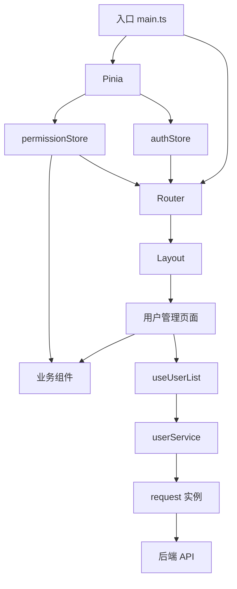

这张图要看懂 4 个边界：

1. 页面只负责组织功能，不直接拼接口地址。
2. 业务请求放到 service 层，不散落在组件里。
3. 登录态和权限属于全局状态，放 Pinia。
4. 列表查询、弹窗开关、当前表单属于页面状态，优先留在页面或 composable。

## 第一阶段：创建项目

### 目标

先得到一个能启动、能构建、目录清楚的 Vue 3 + TypeScript 项目。

### 推荐技术栈

| 能力 | 推荐 |
| --- | --- |
| 构建工具 | Vite |
| 框架 | Vue 3 |
| 语言 | TypeScript |
| 路由 | Vue Router |
| 状态 | Pinia |
| 测试 | Vitest |
| 代码规范 | ESLint + Prettier |

这篇文档不绑定具体组件库。真实项目可以选 Element Plus、Ant Design Vue、Arco Design、TDesign、Naive UI 等，但组件库选择应在项目开始前单独评估，而不是在文档里强行指定。

### 初始化命令

```bash
npm create vite@latest vue-admin-demo -- --template vue-ts
cd vue-admin-demo
npm install
npm install vue-router pinia
```

如果项目已经存在，不需要重新创建，直接按下面结构整理即可。

### 最小启动检查

```bash
npm run dev
npm run build
```

验收标准：

- 本地能启动。
- 构建能通过。
- 页面能访问。
- TypeScript 没有明显错误。

## 第二阶段：目录结构

### 推荐目录

```text
src/
  app/
    main.ts
    router/
      index.ts
      guards.ts
      routes.ts
    stores/
      auth.ts
      permission.ts
      app.ts
    layouts/
      AppLayout.vue
  features/
    users/
      components/
        UserSearchForm.vue
        UserTable.vue
        UserFormDialog.vue
      services/
        userService.ts
      types.ts
      useUserList.ts
      UserListPage.vue
  shared/
    request/
      index.ts
      types.ts
    components/
    constants/
    utils/
      format.ts
      guards.ts
  styles/
    index.css
```

### 目录职责

| 目录 | 放什么 | 不应该放什么 |
| --- | --- | --- |
| `app/router` | 路由表、守卫、动态路由注册 | 页面请求和表单逻辑 |
| `app/stores` | 登录态、权限、主题、全局配置 | 单页面临时筛选条件 |
| `app/layouts` | 后台整体布局、菜单、头部 | 具体用户业务逻辑 |
| `features/users` | 用户管理完整业务模块 | 全站通用工具 |
| `shared/request` | 请求实例、响应类型、错误处理 | 具体页面状态 |
| `shared/components` | 可复用基础组件 | 某个业务模块专属组件 |
| `shared/utils` | 格式化、判断、纯函数工具 | 会发请求的业务函数 |

### 为什么推荐按业务功能聚合

后台系统会不断增加业务模块。如果全部按 `pages`、`components`、`api` 横向堆放，项目变大后会出现这些问题：

- 改用户模块要在多个目录来回找。
- 组件和接口文件之间没有业务边界。
- 新人不知道哪些文件属于同一个功能。
- 删除一个模块时容易漏文件。

按 `features/users` 聚合后，一个业务模块的页面、组件、类型、请求和组合逻辑都在同一处，更容易迁移和维护。

## 第三阶段：类型设计

### 目标

在写页面之前，先定义接口返回、页面展示、表单状态和提交参数的类型边界。

### 类型边界图

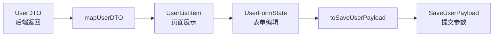

不要把一个 `User` 类型从接口返回、表格展示、表单编辑、提交保存一直用到底。真实项目里这样做很容易出问题：

- 后端字段命名不适合页面展示。
- 表单需要临时字段。
- 提交时不应该带页面展示字段。
- 编辑时可能污染列表对象。

### 用户模块类型

```ts
export type UserStatus = 0 | 1

export interface UserDTO {
  id: number
  user_name: string
  mobile: string | null
  status: UserStatus
  role_ids: number[]
  role_names: string[]
  created_at: string
}

export interface UserListItem {
  id: number
  name: string
  mobileText: string
  enabled: boolean
  roleIds: number[]
  roleNames: string[]
  createdAtText: string
}

export interface UserFormState {
  id?: number
  name: string
  mobile: string
  roleIds: number[]
  enabled: boolean
}

export interface SaveUserPayload {
  id?: number
  name: string
  mobile?: string
  roleIds: number[]
  status: UserStatus
}

export interface UserListQuery {
  keyword: string
  page: number
  pageSize: number
}
```

### 转换函数

```ts
export function mapUserDTO(dto: UserDTO): UserListItem {
  return {
    id: dto.id,
    name: dto.user_name,
    mobileText: dto.mobile || '-',
    enabled: dto.status === 1,
    roleIds: dto.role_ids,
    roleNames: dto.role_names,
    createdAtText: dto.created_at
  }
}

export function createEmptyUserForm(): UserFormState {
  return {
    name: '',
    mobile: '',
    roleIds: [],
    enabled: true
  }
}

export function createEditUserForm(row: UserListItem): UserFormState {
  return {
    id: row.id,
    name: row.name,
    mobile: row.mobileText === '-' ? '' : row.mobileText,
    roleIds: [...row.roleIds],
    enabled: row.enabled
  }
}

export function toSaveUserPayload(form: UserFormState): SaveUserPayload {
  return {
    id: form.id,
    name: form.name.trim(),
    mobile: form.mobile.trim() || undefined,
    roleIds: form.roleIds,
    status: form.enabled ? 1 : 0
  }
}
```

验收标准：

- 页面展示类型和后端 DTO 分开。
- 表单类型和提交参数分开。
- 编辑表单通过复制生成，不直接引用表格行。
- 转换函数是纯函数，方便测试。

## 第四阶段：请求封装

### 请求链路

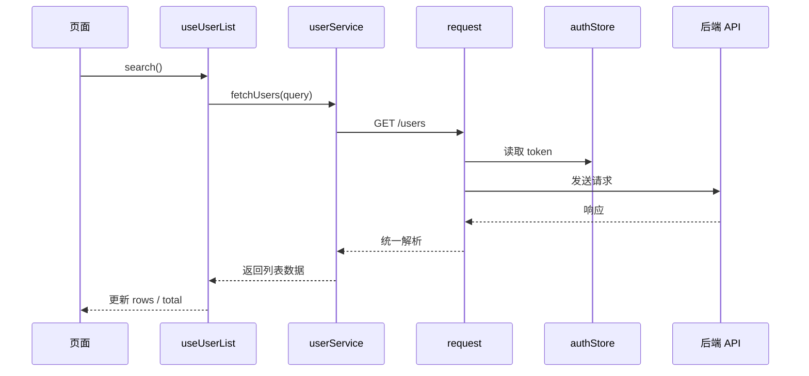

### request 层职责

request 层只处理通用问题：

- baseURL。
- token。
- 超时。
- JSON 解析。
- 业务错误。
- 401 登录过期。
- 403 无权限。
- 网络错误提示。

不要在 request 层写“用户列表怎么转换”这类业务逻辑。

### 响应类型

```ts
export interface ApiResponse<T> {
  code: number
  message: string
  data: T
}

export interface PageResult<T> {
  list: T[]
  total: number
}
```

### 用户 Service

```ts
import { request } from '@/shared/request'
import type { PageResult } from '@/shared/request/types'
import type { SaveUserPayload, UserDTO, UserListQuery } from '../types'

export async function fetchUsers(query: UserListQuery) {
  return request.get<PageResult<UserDTO>>('/users', { params: query })
}

export async function createUser(payload: SaveUserPayload) {
  return request.post('/users', payload)
}

export async function updateUser(id: number, payload: SaveUserPayload) {
  return request.put(`/users/${id}`, payload)
}

export async function deleteUser(id: number) {
  return request.delete(`/users/${id}`)
}

export async function updateUserStatus(id: number, status: 0 | 1) {
  return request.patch(`/users/${id}/status`, { status })
}
```

验收标准：

- 页面不直接写 URL。
- 同一个接口只在一个 service 函数里定义。
- Service 不依赖组件实例。
- request 层能统一处理认证和错误。

## 第五阶段：路由和布局

### 路由结构

```ts
import type { RouteRecordRaw } from 'vue-router'

export const constantRoutes: RouteRecordRaw[] = [
  {
    path: '/login',
    name: 'Login',
    component: () => import('@/features/auth/LoginPage.vue')
  },
  {
    path: '/',
    name: 'Root',
    component: () => import('@/app/layouts/AppLayout.vue'),
    redirect: '/users',
    meta: { requiresAuth: true },
    children: [
      {
        path: 'users',
        name: 'Users',
        component: () => import('@/features/users/UserListPage.vue'),
        meta: {
          title: '用户管理',
          requiresAuth: true,
          permission: 'user:view',
          keepAlive: true
        }
      }
    ]
  }
]
```

### RouteMeta 类型

```ts
import 'vue-router'

declare module 'vue-router' {
  interface RouteMeta {
    title?: string
    requiresAuth?: boolean
    permission?: string
    keepAlive?: boolean
  }
}
```

如果不声明 `RouteMeta`，`meta.permission` 写错字段名也可能没人发现。

### 路由守卫流程

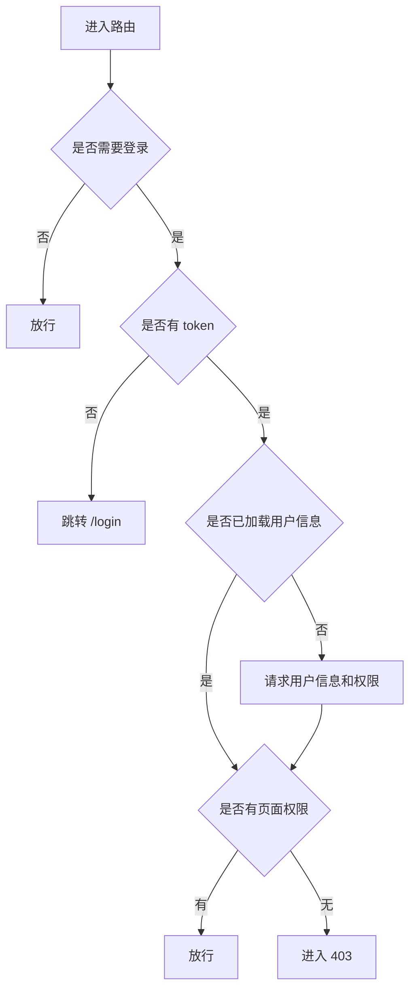

### 守卫职责

守卫只做入口判断，不要塞入页面业务：

- 是否需要登录。
- token 是否存在。
- 用户信息是否恢复。
- 页面权限是否满足。
- 跳转登录、403 或放行。

验收标准：

- 直接刷新 `/users` 不会白屏。
- token 过期后能回登录页。
- 无权限页面进入 403。
- 菜单和路由使用同一份权限信息。

## 第六阶段：Pinia 状态

### 状态分层

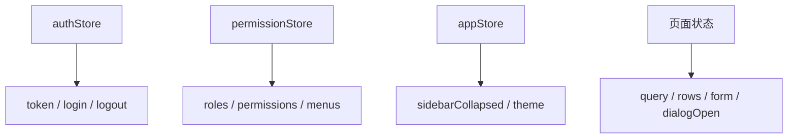

### authStore

```ts
import { defineStore } from 'pinia'
import { computed, ref } from 'vue'

export const useAuthStore = defineStore('auth', () => {
  const token = ref(localStorage.getItem('token') || '')

  const isLoggedIn = computed(() => Boolean(token.value))

  function setToken(value: string) {
    token.value = value
    localStorage.setItem('token', value)
  }

  function clearToken() {
    token.value = ''
    localStorage.removeItem('token')
  }

  return {
    token,
    isLoggedIn,
    setToken,
    clearToken
  }
})
```

### permissionStore

```ts
import { defineStore } from 'pinia'
import { computed, ref } from 'vue'

export const usePermissionStore = defineStore('permission', () => {
  const permissions = ref<string[]>([])
  const menus = ref<MenuItem[]>([])

  const permissionSet = computed(() => new Set(permissions.value))

  function has(permission: string) {
    return permissionSet.value.has(permission)
  }

  function setPermissions(next: string[]) {
    permissions.value = next
  }

  function reset() {
    permissions.value = []
    menus.value = []
  }

  return {
    permissions,
    menus,
    has,
    setPermissions,
    reset
  }
})
```

### 什么不应该放 Pinia

| 状态 | 推荐位置 | 原因 |
| --- | --- | --- |
| 用户列表当前页 | `useUserList` | 只属于当前页面 |
| 弹窗开关 | 页面组件 | 不需要跨页面共享 |
| 编辑表单 | `UserFormDialog` 或页面 | 临时数据，关闭后丢弃 |
| 表格 loading | `useUserList` | 局部加载状态 |
| 当前选中的行 | 页面组件 | 单页面交互状态 |

验收标准：

- Store 只放全局或跨页面状态。
- 登出时能清理 token、用户信息、权限和菜单。
- 权限判断统一走 `permissionStore.has()`。
- 不把接口 DTO 长期塞进 Store。

## 第七阶段：用户列表 composable

### 为什么需要 composable

用户列表页面会同时处理查询、分页、加载、错误、刷新、删除、状态切换。如果全部写进页面组件，页面很快变成几百行。

推荐把列表流程放到 `useUserList.ts`。

### 列表状态机

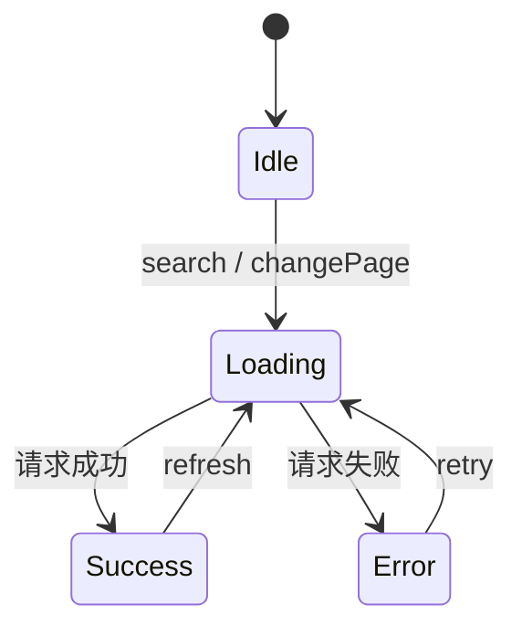

### useUserList 示例

```ts
import { reactive, ref } from 'vue'
import { fetchUsers } from './services/userService'
import { mapUserDTO } from './types'
import type { UserListItem, UserListQuery } from './types'

export function useUserList() {
  const query = reactive<UserListQuery>({
    keyword: '',
    page: 1,
    pageSize: 20
  })

  const rows = ref<UserListItem[]>([])
  const total = ref(0)
  const loading = ref(false)
  const error = ref('')

  async function loadUsers() {
    loading.value = true
    error.value = ''

    try {
      const result = await fetchUsers(query)
      rows.value = result.list.map(mapUserDTO)
      total.value = result.total
    } catch (err) {
      error.value = err instanceof Error ? err.message : '用户列表加载失败'
    } finally {
      loading.value = false
    }
  }

  function search() {
    query.page = 1
    return loadUsers()
  }

  function changePage(page: number) {
    query.page = page
    return loadUsers()
  }

  async function refreshAfterDelete() {
    if (rows.value.length === 1 && query.page > 1) {
      query.page -= 1
    }

    await loadUsers()
  }

  return {
    query,
    rows,
    total,
    loading,
    error,
    loadUsers,
    search,
    changePage,
    refreshAfterDelete
  }
}
```

验收标准：

- 查询时页码回到 1。
- 翻页只改页码并重新加载。
- 删除最后一条数据后页码能回退。
- loading 在成功和失败后都能关闭。
- 错误信息不会吞掉。

## 第八阶段：页面和组件拆分

### 组件关系

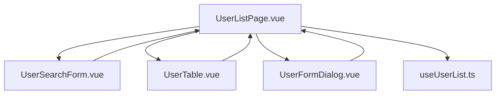

### 页面组件职责

`UserListPage.vue` 负责组织页面流程：

- 初始化加载。
- 接收搜索组件事件。
- 接收表格行操作事件。
- 控制弹窗打开关闭。
- 调用 service 保存。
- 保存后刷新列表。

它不应该负责：

- 拼接接口地址。
- 写大量表单字段 UI。
- 长期保存登录态。
- 直接判断所有权限字符串。

### 搜索组件

```vue
<script setup lang="ts">
import type { UserListQuery } from '../types'

const model = defineModel<UserListQuery>({ required: true })

const emit = defineEmits<{
  search: []
  reset: []
}>()
</script>

<template>
  <form class="user-search-form" @submit.prevent="emit('search')">
    <input v-model="model.keyword" placeholder="搜索用户名或手机号" />
    <button type="submit">查询</button>
    <button type="button" @click="emit('reset')">重置</button>
  </form>
</template>
```

### 表格组件

```vue
<script setup lang="ts">
import type { UserListItem } from '../types'

defineProps<{
  rows: UserListItem[]
  loading: boolean
  canEdit: boolean
  canDelete: boolean
}>()

const emit = defineEmits<{
  edit: [row: UserListItem]
  delete: [row: UserListItem]
  toggleStatus: [row: UserListItem]
}>()
</script>
```

### 弹窗组件

弹窗组件最重要的原则：内部编辑表单，提交时向外抛出 payload，不直接改列表行。

```vue
<script setup lang="ts">
import type { UserFormState } from '../types'

const visible = defineModel<boolean>('visible', { required: true })
const form = defineModel<UserFormState>('form', { required: true })

const emit = defineEmits<{
  submit: []
}>()
</script>
```

验收标准：

- 页面组件能在 200 行左右保持可读。
- 子组件通过 props 和 emits 通信。
- 子组件不直接调用全局路由和全局 Store，除非它本身就是全局组件。
- 表单弹窗关闭后临时状态能重置。

## 第九阶段：表单处理

### 表单流程

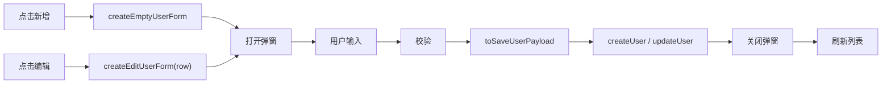

### 表单校验

最少校验这些内容：

| 字段 | 规则 | 错误提示 |
| --- | --- | --- |
| 用户名 | 必填，2 到 20 个字符 | 请输入 2 到 20 个字符的用户名 |
| 手机号 | 可选，但填写后格式正确 | 手机号格式不正确 |
| 角色 | 至少选择一个 | 请至少选择一个角色 |
| 状态 | 必须是启用或禁用 | 用户状态不正确 |

### 提交保护

真实项目里经常出现重复提交。提交按钮应该有 `submitting` 状态：

```ts
const submitting = ref(false)

async function submitForm() {
  if (submitting.value) return

  submitting.value = true

  try {
    const payload = toSaveUserPayload(form.value)

    if (payload.id) {
      await updateUser(payload.id, payload)
    } else {
      await createUser(payload)
    }

    dialogVisible.value = false
    await loadUsers()
  } finally {
    submitting.value = false
  }
}
```

验收标准：

- 新增和编辑共用表单 UI，但提交逻辑能区分。
- 编辑时复制列表行，不直接引用。
- 关闭弹窗后清理校验状态。
- 提交中按钮禁用，避免重复提交。
- 保存成功后刷新列表。

## 第十阶段：权限接入

### 权限模型

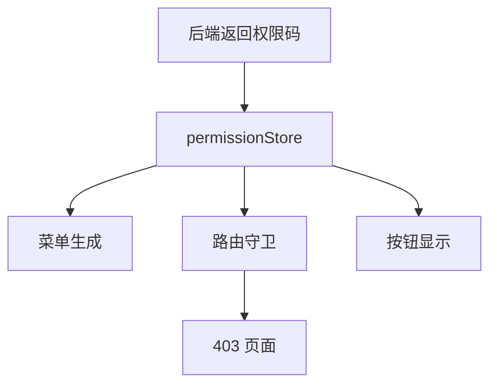

### 权限码定义

```ts
export const USER_PERMISSIONS = {
  VIEW: 'user:view',
  CREATE: 'user:create',
  UPDATE: 'user:update',
  DELETE: 'user:delete',
  ENABLE: 'user:enable'
} as const

export type UserPermission =
  (typeof USER_PERMISSIONS)[keyof typeof USER_PERMISSIONS]
```

### 页面使用

```ts
const permissionStore = usePermissionStore()

const canCreate = computed(() => permissionStore.has(USER_PERMISSIONS.CREATE))
const canUpdate = computed(() => permissionStore.has(USER_PERMISSIONS.UPDATE))
const canDelete = computed(() => permissionStore.has(USER_PERMISSIONS.DELETE))
```

模板里只控制体验：

```vue
<button v-if="canCreate" @click="openCreateDialog">新增用户</button>
```

后端接口仍然必须校验权限。前端隐藏按钮不能当作安全措施。

验收标准：

- 权限码集中定义，不散落裸字符串。
- 菜单、路由、按钮使用同一份权限数据。
- 无权限页面有 403。
- 无权限接口返回 403 时有提示。
- 退出登录时清空权限。

## 第十一阶段：错误处理

### 错误分类

| 错误 | 常见原因 | 页面处理 |
| --- | --- | --- |
| 400 | 参数错误 | 提示用户检查输入 |
| 401 | token 过期或未登录 | 清理登录态并跳转登录 |
| 403 | 无权限 | 提示无权限或进入 403 页面 |
| 404 | 接口不存在 | 提示资源不存在 |
| 500 | 服务异常 | 提示稍后重试，保留日志 |
| 网络错误 | 断网、跨域、网关异常 | 提示网络异常 |

### 页面状态

用户列表至少要有这些状态：

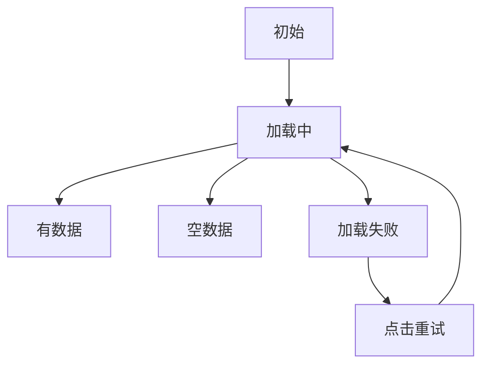

### 错误提示原则

- 用户能修正的错误，要告诉用户怎么改。
- 用户不能修正的错误，要告诉用户下一步怎么办。
- 认证错误不要无限弹窗。
- 业务错误不要只写 `console.log`。
- 重要错误要能在日志里追踪。

验收标准：

- loading、empty、error 三种状态清楚。
- 请求失败后能重试。
- 401 不会停留在半登录状态。
- 403 不会显示无意义空白页。

## 第十二阶段：工程化验收

### 必备脚本

```json
{
  "scripts": {
    "dev": "vite",
    "typecheck": "vue-tsc --noEmit",
    "lint": "eslint .",
    "test": "vitest",
    "build": "vue-tsc --noEmit && vite build",
    "preview": "vite preview"
  }
}
```

如果项目暂时没有全部脚本，也要在 README 里说明当前缺口。

### 环境变量

```text
.env.development
.env.test
.env.production
```

示例：

```env
VITE_API_BASE_URL=/api
VITE_APP_TITLE=Vue Admin Demo
```

注意：前端环境变量会进入浏览器，不要放密钥、数据库密码、私有 token。

### README 必写内容

```text
# Vue Admin Demo

## 技术栈

## 启动方式

## 环境变量

## 目录结构

## 业务模块

## 权限说明

## 请求封装

## 常见问题

## 构建和部署
```

验收标准：

- `npm run build` 通过。
- README 能让新人启动项目。
- 环境变量有示例。
- 目录职责清晰。
- 核心数据流有说明。

## 完整开发顺序

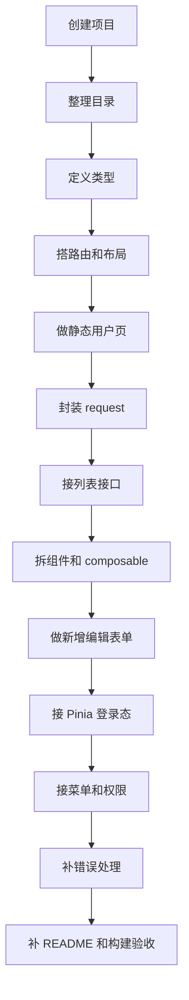

不要跳着做权限和动态菜单。先让静态页面、路由、列表和表单跑通，再接登录态和权限，排查成本会低很多。

## 常见问题

### 1. 页面刷新后菜单没了

通常是权限菜单只存在内存里，刷新后 Pinia 状态丢失。

解决：

- 只持久化 token。
- 应用启动或路由守卫中根据 token 重新请求用户信息和菜单。
- 菜单恢复完成后再放行需要权限的页面。

### 2. 编辑表单影响列表数据

原因是表单直接引用了表格行对象。

解决：

- 打开弹窗时复制数据。
- 表单保存成功后重新拉列表。
- 不要把列表行对象直接传给表单长期编辑。

### 3. 查询和分页状态错乱

常见现象：

- 搜索后仍停留在第 5 页。
- 删除最后一条后页面空白。
- 快速切换筛选时旧请求覆盖新请求。

解决：

- 搜索时把 `page` 重置为 1。
- 删除后判断当前页是否需要回退。
- 高频查询使用防抖或请求取消。

### 4. 按钮隐藏了但接口还能调用

前端隐藏按钮只是体验优化，不是安全措施。

解决：

- 前端根据权限隐藏按钮。
- 后端接口必须再次校验权限。
- 403 统一提示或进入无权限页。

### 5. Store 越写越乱

常见原因是把所有页面状态都塞到 Pinia。

解决：

- 登录态、用户信息、权限放 Store。
- 列表、分页、弹窗、表单留在页面或 composable。
- Store 不保存临时编辑对象。

### 6. 构建才发现类型错误

开发服务器通常更关注快速反馈，不一定执行完整类型检查。

解决：

- 保留 `npm run typecheck`。
- 构建命令里包含类型检查。
- DTO、ViewModel、FormState、Payload 分层。

## 项目验收清单

| 类别 | 验收项 |
| --- | --- |
| 启动 | 本地能启动，README 写清命令 |
| 构建 | 生产构建通过 |
| 路由 | 登录页、用户页、403、404 都能访问 |
| 登录态 | 登录、刷新恢复、退出清理都正常 |
| 菜单 | 根据权限生成，刷新后恢复 |
| 用户列表 | 搜索、分页、loading、empty、error 都完整 |
| 表单 | 新增、编辑、校验、提交、关闭重置都正常 |
| 权限 | 页面、菜单、按钮、接口错误都有处理 |
| 类型 | DTO、ViewModel、FormState、Payload 分层 |
| 请求 | token、401、403、网络错误统一处理 |
| 组件 | 页面、搜索、表格、弹窗、composable 边界清楚 |
| 移动端 | 390px 宽度下没有整体横向溢出 |

## 练习任务

如果你想把这篇真正练会，按下面顺序做：

1. 只用 mock 数据做用户列表页。
2. 拆出搜索、表格、弹窗 3 个组件。
3. 定义 DTO、ViewModel、FormState、Payload。
4. 写转换函数并补测试。
5. 接入真实或模拟接口。
6. 封装 request 错误处理。
7. 接入 Pinia 登录态。
8. 接入权限码和按钮权限。
9. 写 README 和项目数据流图。
10. 跑构建并修掉所有错误。

每完成一步，都在 README 或学习记录里写：

- 做了什么。
- 哪个文件负责。
- 遇到什么问题。
- 最后怎么解决。

## 下一步学习

如果你还没有做练习，进入 [学习路径练习包](/roadmap/practice-labs)，从“Vue Admin 用户管理”开始。

如果你已经做完用户管理模块，继续看：

- [Vue Admin 用户模块实现手册](/vue/admin-user-module)
- [Vue Admin Mock 到真实接口联调实战](/vue/admin-mock-to-api)
- [Vue Admin 列表、搜索、分页与表格闭环实战](/vue/admin-list-search-table)
- [Vue Admin 表单弹窗、新增编辑与校验闭环实战](/vue/admin-form-modal-crud)
- [Vue Admin 详情页、状态流转与操作记录闭环实战](/vue/admin-detail-status-audit)
- [Vue Admin 文件上传、下载、导入导出与异步任务闭环实战](/vue/admin-file-import-export)
- [Vue Admin 工作台、统计卡片、图表看板与数据刷新闭环实战](/vue/admin-dashboard-analytics)
- [Vue Admin 审批流、状态机、待办与审计闭环实战](/vue/admin-approval-workflow)
- [Vue Admin 角色权限模块实现手册](/vue/admin-permission-module)
- [Vue Admin 菜单与动态路由实现手册](/vue/admin-menu-route-module)
- [Vue Admin 组织架构与数据权限实现手册](/vue/admin-organization-data-permission)
- [Vue Admin 请求封装与错误处理闭环手册](/vue/admin-request-error-handling)
- [请求与接口封装](/vue/request)
- [权限与菜单](/vue/permission)
- [Pinia 状态管理](/vue/pinia)
- [TypeScript 类型边界问题库](/projects/issues-typescript)
- [真实项目问题库](/projects/real-world-issues)
