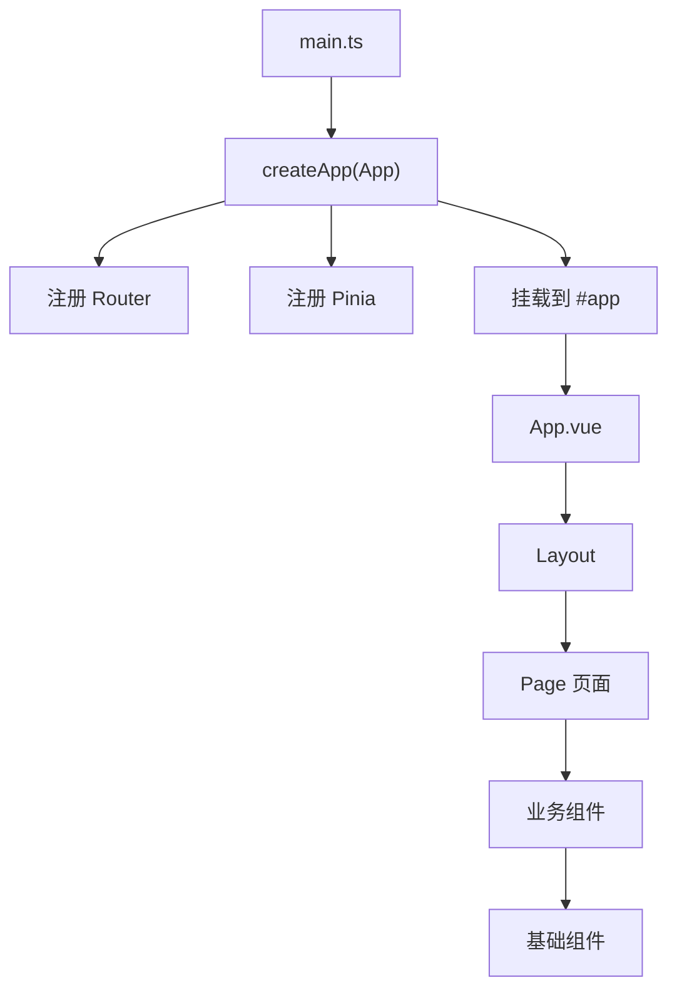
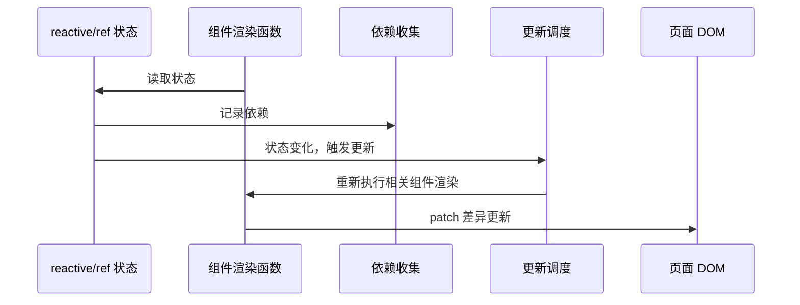
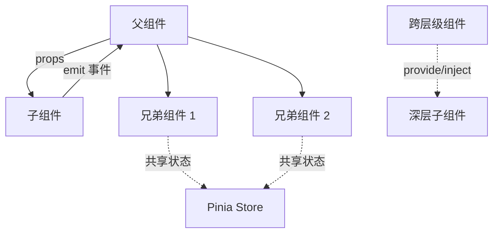
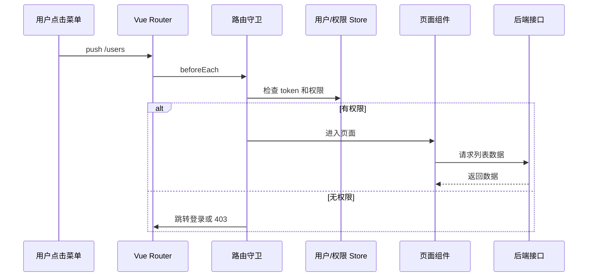
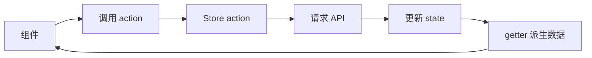
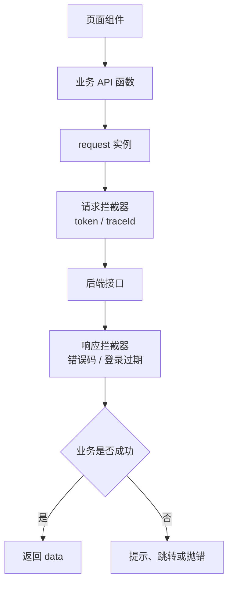
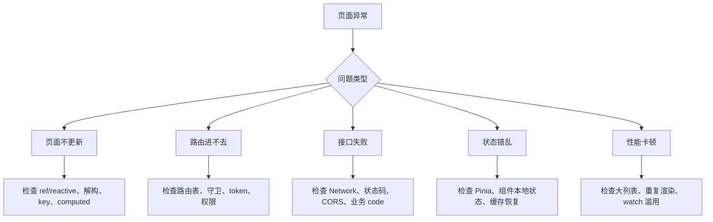

# 图解 Vue 核心概念

## 这个页面解决什么

Vue 学习最容易卡在“响应式为什么会更新页面”“组件之间怎么传数据”“路由、状态、请求、权限到底放在哪里”。这一页用图先建立整体模型。

## 适合谁看

适合已经能写基础 Vue 页面，但对响应式、组件通信、路由权限、Pinia、请求封装和页面排错还没有形成整体理解的人。

## 一张图理解 Vue 应用结构



理解这张图后，项目结构会更清晰：

- `main.ts` 负责应用启动和插件注册。
- `App.vue` 负责根容器。
- Layout 负责页面框架。
- Page 负责路由页面。
- 业务组件负责业务片段。
- 基础组件负责可复用 UI。

## 一张图理解响应式更新



核心理解：

- 组件渲染时读取了哪些状态，Vue 就知道这些状态和组件有关。
- 状态变化后，Vue 不会重刷整个页面，而是调度相关组件更新。
- `ref` 适合基本值和明确可替换的数据。
- `reactive` 适合对象状态。

## 一张图理解组件通信



选择规则：

| 场景 | 推荐方式 |
| --- | --- |
| 父传子 | props |
| 子通知父 | emit |
| 兄弟组件共享 | 提升到父组件或 Pinia |
| 全局用户信息、权限、主题 | Pinia |
| 表单内部局部状态 | 组件本地状态 |
| 跨层级但不全局 | provide/inject |

## 一张图理解路由进入页面



项目里经常把权限逻辑写散，导致页面能进但按钮不能点，或者菜单显示但接口 403。推荐把权限分成三层：

- 路由权限：能不能进入页面。
- 菜单权限：能不能看到入口。
- 按钮权限：能不能执行动作。

## 一张图理解 Pinia 数据流



Pinia 不应该成为“所有变量的垃圾桶”。适合放：

- 登录用户。
- 权限菜单。
- 跨页面筛选条件。
- 购物车、主题、语言等全局状态。

不适合放：

- 单个弹窗开关。
- 单个表单字段。
- 只在一个组件里使用的临时状态。

## 一张图理解请求封装



建议页面不要直接写 `fetch('/api/users')`，而是：

```text
页面
↓
业务 API 函数
↓
统一 request
↓
后端
```

这样 token、错误码、登录过期、重复提交、取消请求都能统一治理。

## 一张图理解 Vue 页面排错



排错时先判断是“状态问题、路由问题、接口问题、渲染问题”，不要一上来就改组件代码。

## 下一步学习

继续学习 [快速开始](/vue/quick-start)，或进入 [响应式基础](/vue/reactivity)。
